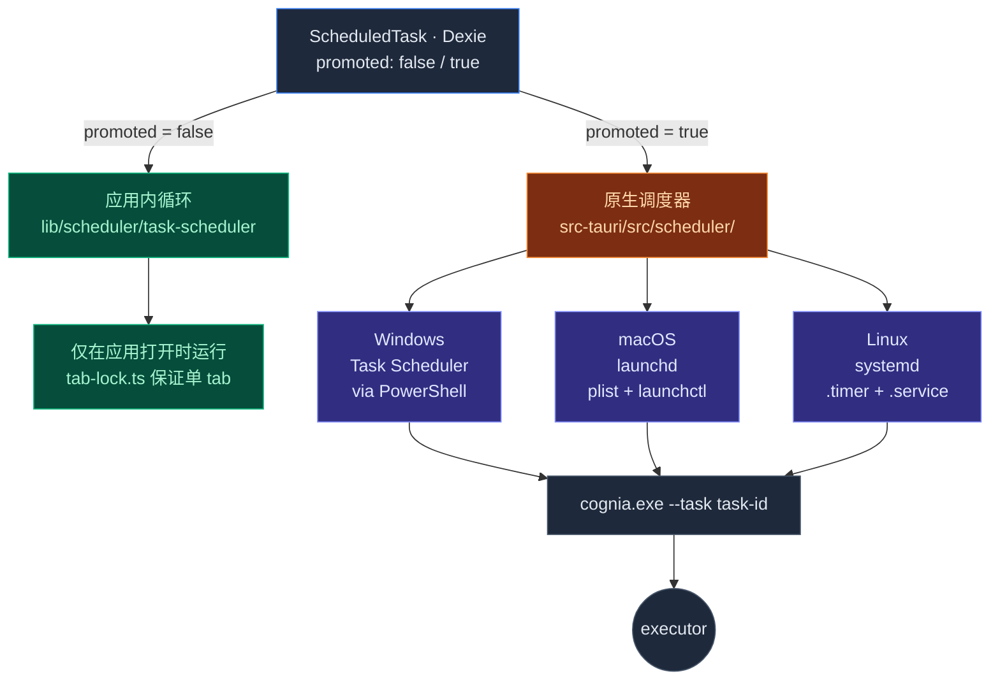

# 调度器
Cognia 自带的调度器子系统跑在两层：

- **应用内层** —— `lib/scheduler/` 在应用运行时按 cron 触发任务。
- **原生层** —— `src-tauri/src/scheduler/` 把任务"提升"给 OS 调度器（Windows Task Scheduler、macOS launchd、Linux systemd），让任务在 Cognia 关闭时也能触发。

提升按任务粒度可选：轻任务留在应用内；重任务或要求后台运行的走原生。

完整设计原由参见 [ADR-0002](../adr/0002-scheduler-full-agent-resolution)。

## 代码位置

```text title="lib/scheduler/ + src-tauri/src/scheduler/"
lib/scheduler/
  index.ts                       # 公共 API
  task-scheduler.ts              # 核心调度循环 + registerTaskExecutor
  scheduler-db.ts                # Dexie 表（jobs、history）
  cron-parser.ts                 # 5/6 字段 cron 表达式
  trigger-normalizer.ts          # UI 输入 → cron / interval / once
  promote-to-system.ts           # 把任务交给原生层
  task-templates.ts              # 可复用任务模板
  format-utils.ts                # 把调度渲染成 UI 字符串（"每周一 9:00"）
  tab-lock.ts                    # 单 tab worker 选举
  errors.ts
  conversational-task-authoring.ts  # LLM 辅助任务创建
  conversational-task-intent.ts
  notification-integration.ts    # 成功 / 失败通知
  event-integration.ts
  script-executor.ts             # 安全执行用户脚本
  executors/index.ts             # 注册全部内置 executor
  executors/backup-executor.ts   # 加密备份产出
  executors/twin-executor.ts     # 孪生 ingest / distill
  executors/plugin-executor.ts   # 触发插件任务

src-tauri/src/scheduler/
  mod.rs
  service.rs                     # 跨平台 Service trait
  windows.rs                     # Windows Task Scheduler（PowerShell）
  macos.rs                       # launchd（plist + launchctl）
  linux.rs                       # systemd（.timer + .service unit）
  metadata_store.rs              # sqlite 元数据，便于恢复
  commands.rs                    # #[tauri::command] 封装
  types.rs
  error.rs

components/scheduler/            # 工作台 UI
app/scheduler/                   # 工作台路由
```

## 任务模型

<TypeTable
  type={{
    id: { description: "稳定唯一标识。", type: "string", required: true },
    name: { description: "显示名。", type: "string", required: true },
    description: { description: "可选说明。", type: "string" },
    trigger: {
      description: "何时运行 —— 判别联合（见下）。",
      type: "Trigger",
      required: true,
    },
    type: {
      description: "选择哪个 executor —— 字符串标签，由注册表解析。",
      type: "string",
      required: true,
    },
    payload: {
      description: "executor 自定义参数（按 type 形态各异）。",
      type: "Record<string, unknown>",
      required: true,
    },
    enabled: {
      description: "false 时触发点直接跳过。",
      type: "boolean",
      required: true,
    },
    promoted: {
      description: "true 时任务镜像到原生 OS 调度器。",
      type: "boolean",
      default: "false",
    },
    createdAt: { description: "ISO-8601 创建时间。", type: "string", required: true },
    updatedAt: { description: "ISO-8601 最近更新时间。", type: "string", required: true },
  }}
/>

`Trigger` 形态：

```ts title="types/scheduler/"
type Trigger =
  | { type: "cron"; expression: string; timezone?: string }
  | { type: "interval"; everyMs: number }
  | { type: "once"; runAt: string }
  | { type: "event"; eventName: string }
```

`type` 字段是字符串而非枚举：内置 executor 注册了固定标签（见下），用户也能通过 `registerTaskExecutor("custom-<name>", fn)` 在运行时注册新标签。

## Cron 解析器

`lib/scheduler/cron-parser.ts` 实现 5 / 6 字段 cron 解析（6 字段时含秒）。特性：

- 标准通配符（`*`、`,`、`-`、`/`）。
- 命名星期（`MON`、`TUE`……）。
- 命名月份（`JAN`……）。
- 时区感知（trigger 的 `timezone` 字段；默认系统本地）。

解析器产出 `next(after: Date)` 迭代器。调度循环调 `next()` 计算下次触发时间，sleep 到点，运行执行器，循环。

## 应用内 vs 原生



任务默认 `promoted: false`。用户在工作台手动提升；提升时合成：

- **Windows** —— 一个指向 `cognia.exe --workspace <id> --task <task-id>` 的 Task Scheduler 条目。
- **macOS** —— `~/Library/LaunchAgents/` 中的 launchd `.plist`。
- **Linux** —— `~/.config/systemd/user/` 中的 systemd `.timer` + `.service` 单元对。

`metadata_store.rs` 维护任务 UUID 与原生 task ID（PowerShell 任务名、plist label、systemd unit name）之间的映射。任务删除时元数据存储也会清理对应原生条目。

## Tab 锁

`lib/scheduler/tab-lock.ts` 保证**有且仅有一个 tab** 跑应用内循环：

- Dexie（`schedulerLock`）中有一行心跳，每 5 秒更新一次。
- 启动时每个 tab 检查：如心跳老于 15 秒，认领锁；否则等待。
- 持有 tab 关闭/崩溃后，下一个 tab 在 15 秒内接管。

避免用户在多个窗口打开 Cognia 时重复触发。

## 对话式任务创作

`conversational-task-authoring.ts` 与 `conversational-task-intent.ts` 让用户用自然语言描述调度（"每个工作日 9 点发一份站会提醒"），LLM 输出一个 `ScheduledTask` JSON。意图抽取器拉出结构化字段；创作 agent 补默认值并校验。

工作台的"AI 创建"面板使用这一能力。

## 内置 executor

`lib/scheduler/executors/index.ts` 中的 `registerBuiltInExecutors()` 注册全部内置 executor。所有 chat 类（chat / agent / skill / goal / plan / agent-team）都通过同一份 `resolveSendOptions` 流水线，复用交互式 Composer 使用的角色 / agent mode / 技能 / 工具 / MCP / 内置工具配置 —— 调度任务跑出的提示词与人工发送的语义完全一致。

| 类型                                                     | 用途                                                                                        | 关键依赖                                                                       |
| -------------------------------------------------------- | ------------------------------------------------------------------------------------------- | ------------------------------------------------------------------------------ |
| `chat` / `agent` / `skill`                               | 跑一次 Claude 会话（可绑定角色 / 单次技能）                                                | `lib/claude/ipc.sendPrompt` + `resolveSendOptions`                             |
| `goal` / `plan` / `agent-team`                           | 推进目标、执行计划或启动内置团队                                                            | ADR-0019 / ADR-0022 运行时                                                     |
| `external-agent`                                         | 把任务派给 ACP 外部 agent（Claude Desktop、Cursor……）                                       | `lib/ai/agent/external/manager.executeOnExternalAgent`                         |
| `script` / `background-command` / `monitor`              | 通过主机 shell 跑用户脚本或命令                                                             | `script-executor.ts`（桌面走 `shell_exec`，无头走 jobs supervisor）             |
| `workflow`                                               | 以 `triggeredBy.source = "schedule"` 运行已发布的可视化工作流                               | `executeDeployedWorkflow`（ADR-0011）                                          |
| `im-push`                                                | 经治理出站队列向绑定的 IM 会话推送消息                                                      | `enqueueGoverned` + `hasNoLeakingPii` + 每会话 `proactivePush` 选择加入         |
| `backup`                                                 | 构建 + 加密快照并扇出到所有已配置目的地（本地、WebDAV / S3、GitHub、Drive）                 | `lib/data/destinations/`、`lib/data/backup-host-filesystem.ts`                 |
| `wiki-rebuild` / `wiki-lint`                             | 重建 / 检查 wiki（需要主机文件系统）                                                        | `lib/wiki/rebuild-runner.ts`                                                   |
| `plugin`                                                 | 触发插件注册的定时任务（见[插件系统](./plugin-system)）                                     | `executors/plugin-executor.ts`                                                 |
| `twin`、`connection:*`、`github-issue-sync`              | 卡片创作类型（由各自子系统创建，不经表单）                                                  | 各自子系统                                                                     |
| `test`                                                   | 诊断：回显 payload，在任意主机上端到端验证触发链                                            | `executors/test-executor.ts`                                                   |
| `custom`                                                 | 未注册处理器时以 `EXECUTOR_NOT_FOUND` 失败                                                  | `registerTaskExecutor("custom-<name>", fn)`                                    |
| `sync`、`ai-generation`                                  | **已弃用** —— 无 executor；现有行在初始化时自动暂停并在详情视图标注                         | —                                                                              |

每个 executor 返回：

```ts
interface TaskExecutorResult {
  success: boolean
  output?: Record<string, unknown>
  error?: string
  /** "unsupported-on-host" | "deprecated-type" | "executor-not-found" | … */
  terminalReason?: string
}
```

结果写入 `schedulerHistory`（每任务最多 200 行）。

## 任务在哪台主机上跑（ADR-0128）

归属是**主机自有**的：桌面、无头大脑（`cognia-server`）与 web / 伴侣 webview 各自维护自己的 `CogniaSchedulerDB`，任务不在主机间交接。差别在于主机能*运行*哪些类型。`lib/scheduler/host-support.ts` 按类型声明需求；executor 以结构化的 `unsupported-on-host` 结果拒绝，任务表单把不支持的类型**禁用并给出原因**（从不隐藏）。

| 类型                                                     | 需要                | 桌面 | 无头大脑 | Web / 伴侣 webview |
| -------------------------------------------------------- | ------------------- | ---- | -------- | ------------------ |
| `chat` `agent` `skill` `goal` `plan` `agent-team`        | `sidecar`           | ✓    | ✓        | ✗                  |
| `external-agent` `script` `background-command` `monitor` | `shell`             | ✓    | ✓        | ✗                  |
| `backup` `wiki-rebuild`                                  | `host-filesystem`   | ✓    | ✓        | ✗                  |
| `im-push`                                                | `connector-runtime` | ✓    | ✓        | ✗                  |
| `workflow` `test` `plugin` `custom`（有处理器）          | —                   | ✓    | ✓        | ✓                  |
| `system`（原生 OS 任务）                                  | `desktop-shell`     | ✓    | ✗        | ✗                  |
| `sync` `ai-generation`                                   | 已弃用              | 暂停 | 暂停     | 暂停               |

定时驱动同样跟随主机：Tauri 上是 Rust 守护进程，无头上是 `NodeTimingDriver`，web / 移动上是渲染端循环 + tab 锁。

**页面管理哪份日程。** 客户端可以查看两份日程：`local`（本机）与 `paired`（它驱动或配对的主机，经 `scheduled_task_*` 伴侣 RPC）。伴侣与驱动远端主机的桌面默认 `paired`；调度器页面的**主机栏**说明当前管理的是哪一份并允许切换（`lib/scheduler/scheduler-host-target.ts`）。类型选择器通过 `host_capabilities` RPC 解析*目标*主机的能力。

**无头桥接。** 大脑上的 workflow 触发经伴侣 `subscribe` 控制帧到达（`lib/headless/runtimes/workflow-trigger-bridge.ts`）；大脑上产生的 toast / OS 通知通过 `remote_notification_publish` 发布一次，由已连接客户端摄入本地通知中心（`lib/notifications/remote-subscription.ts`）。

**OS 提升 = 唤醒并委托。** 提升任务的原生条目打开 `cognia://scheduler/task/<id>?run=<token>`；应用校验令牌后经普通应用内 executor 运行任务，提升运行与应用内运行永不分叉。无头主机不提升（常驻在线）。

## 注册自定义 executor

`registerTaskExecutor(typeTag, fn)`（在 `lib/scheduler/task-scheduler.ts` 中导出）允许在运行时把任意标签接入调度器。常见用法是配合 `custom` 前缀，把团队特有的工作流接入 UI：

```ts title="lib/scheduler/task-scheduler.ts"
import { registerTaskExecutor } from "@/lib/scheduler/task-scheduler"

registerTaskExecutor("custom-daily-report", async (task) => {
  const payload = task.payload as { folder: string }
  const report = await composeReport(payload.folder)
  return { success: true, output: { lines: report.length } }
})
```

注册是幂等的 —— 重复注册同名标签会覆盖前一个 handler。插件 / workflow 系统都用这个钩子接入：[可视化工作流](./visual-workflows)的 `workflow.task` 类节点最终通过它落地。

## 通知

`notification-integration.ts` 监听调度器历史事件流，并：

- 每次运行 toast（可配，默认"仅错误"）。
- 失败时发原生 OS 通知（`tauri-plugin-notification`）。
- 菜单 / 系统托盘有未读失败时显示徽章。

## 事件触发

任务也可以在应用事件触发（如"每次新建会话"）。`event-integration.ts` 订阅事件总线，触发匹配的任务。

## 工作台 UI

路由：`app/scheduler/`。组件：`components/scheduler/`。Tab：

- **任务** —— 列表，含快速 开/关 / 提升 / 立即运行 / 删除。
- **历史** —— 跨所有任务的运行历史，按状态过滤。
- **模板** —— 来自 `task-templates.ts` 的预定义模板（如"每日备份"、"每周重新蒸馏孪生"）。
- **创作** —— "AI 创建"面板。

## 在哪里入手

| 目标                | 文件                                                                            |
| ------------------- | ------------------------------------------------------------------------------- |
| 加内置 executor     | 在 `executors/` 写一个，在 `executors/index.ts:registerBuiltInExecutors` 加一行 |
| 加新 trigger 类型   | `lib/scheduler/cron-parser.ts`（或新解析器）、`trigger-normalizer.ts`           |
| 支持新原生平台      | `src-tauri/src/scheduler/<platform>.rs`                                         |
| 调整对话式创作      | `conversational-task-authoring.ts`                                              |
| 注册自定义 executor | 应用启动后调用 `registerTaskExecutor(...)`                                      |

## 测试

- `lib/scheduler/cron-parser.test.ts` —— cron 表达式覆盖。
- `task-scheduler.test.ts` —— fake-timers 驱动的循环模拟。
- `tab-lock.test.ts` —— 多 tab 竞争。
- `executors/*.test.ts` —— 每个 executor 单测，并断言注册流程幂等。
- 原生层在 `src-tauri/tests/` 有集成测试，建临时 DB 并验证元数据往返。

## 下一篇

<Cards>
  <Card
    title="Agent 团队"
    href="../chat/agent-teams"
    description="agent / skill executor 服务的角色 / 团队体系"
  />
  <Card
    title="可视化工作流"
    href="./visual-workflows"
    description="把 executor 编排成图，调度器是其触发底座"
  />
  <Card title="插件系统" href="./plugin-system" description="插件可注册自己的定时任务" />
  <Card
    title="ADR-0002"
    href="../adr/0002-scheduler-full-agent-resolution"
    description="为什么应用内 vs 原生分层"
  />
</Cards>
