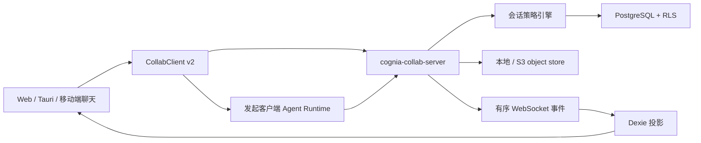

# 共享 AI 聊天

<Status variant="stable">协议 v2 · 灰度开关控制 · 默认私有</Status>

<TLDR>
  共享 AI 聊天是独立的在线协作平面。本地会话保持私有，只有 owner 显式确认完整历史后才会
  导入。协作服务拥有成员关系、权限判定、事件顺序、Agent Run 租约、审批、附件授权与审计。
  Web、Tauri 和 Capacitor 共用同一套 renderer 实现，本地 Dexie 只保存镜像。
</TLDR>

服务端是所有跨人状态的唯一权威；本地模型执行只有持有绑定设备与 Run 的短期租约 token 才能
发布事件。

## 产品行为

- 私有/共享徽标打开成员与运维抽屉。
- 转换前显示消息数和附件数，并警告受邀者能查看完整历史。
- 共享消息显示稳定作者，并标记 Guest 外部来源。
- 离线时可以读取缓存和保留草稿，但发送消息和启动 Agent Run 必须联网后再次确认。
- 移除成员会清除其已撤权投影并关闭实时流，不会删除无关的私有聊天。
- 脱敏正文显示为墓碑，普通客户端协议不会返回原文。

## 运行时所有者

| 层 | 所有者 |
|---|---|
| 契约与角色矩阵 | `packages/agent-config-types/src/shared-chat.ts`、`lib/collab/session-permissions.ts` |
| HTTP/WebSocket 客户端与同步 | `lib/collab/client.ts`、`lib/collab/shared-chat-sync.ts` |
| 显式历史转换 | `lib/collab/shared-chat-conversion.ts` |
| 共享 Run 协调 | `lib/collab/shared-run-coordinator.ts` |
| 产品 UI | `components/chat/shared-session-panel.tsx` |
| 服务端策略/API/存储 | `crates/cognia-collab-server/src/chat*.rs` |
| PostgreSQL schema | `crates/cognia-collab-server/migrations/0005_shared_chat.sql`、`0008_shared_chat_control.sql` |
| 附件字节 | `chat_attachment_store.rs` |

## 阅读顺序

<Cards>
  <Card title="权限与数据" href="./permissions-and-data" description="角色、Guest、作者身份、事件、脱敏、附件与租户边界。" />
  <Card title="Run、同步与运维" href="./runs-sync-and-operations" description="Run 租约、队列、审批、重连、灰度开关、审计与 break-glass。" />
</Cards>

## 灰度

两个开关都必须打开：服务端 `COLLAB_SHARED_CHAT_ENABLED=true`，产品构建
`NEXT_PUBLIC_SHARED_CHAT_ENABLED=true`。关闭任一开关都会停止新的共享入口和写入，但不会删除
数据库表、对象、镜像或私有会话。Health 报告协议 v2，并且只有服务端开关打开时才包含
`shared-chat`。

架构决策与威胁模型记录在 `docs/plans/2026-08-29-server-authoritative-shared-ai-chat.md`
以及 ADR-0149 的 2026-08-29 补记中。
