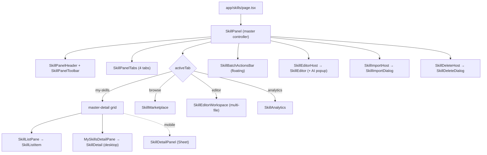
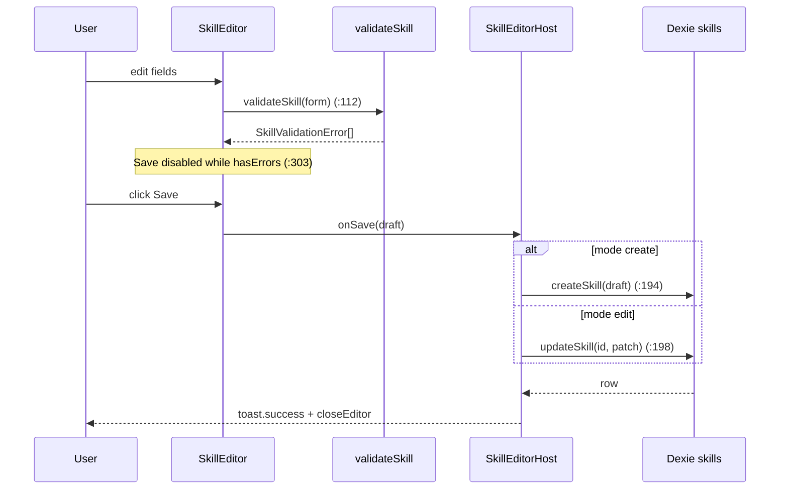

# 创作与工作台

<Status variant="stable">UI surface — components/skills (40+ files) · lib/skills authoring helpers · stores/skills</Status>

<TLDR>
  Skills 工作台是单一路由（`app/skills/page.tsx:6` 挂载 `<SkillPanel />`），划分为四个
  tab —— **My Skills · Browse · Editor · Analytics** —— 由一个临时的 Zustand store 驱动
  （`stores/skills/skills-store.ts:155`，**不持久化**）。创作逻辑位于 `lib/skills/`：
  `validate.ts:19`（无依赖的字段校验）、`categories.ts:27`（8 个分类 + 5 个来源）、
  `templates.ts:19`（4 个起步模板）、`batch-tags.ts:6`（标签集合代数）、`ai-prompts.ts:39`
  （AI 辅助的 prompt 构造器），以及 `export-toast.ts:29`（选目录 → 序列化 → toast）。持久化行
  位于 Dexie（`lib/db/skills.ts`）；本层是纯 UI + 纯辅助函数，因此每次保存都会经
  `createSkill` / `updateSkill` 往返。快捷键（`hooks/skills/use-skill-shortcuts.ts:30`）绑定
  `/`、`Cmd/Ctrl+A`、`Esc`、`N` 与 `Delete`。
</TLDR>

## 路由落点

`app/skills/page.tsx` 是一个轻量的服务端组件，把客户端 `SkillPanel` 放进一个满高
外壳中：

```tsx
// app/skills/page.tsx
export default function SkillsRoutePage() {
  return (
    <div className="h-full w-full min-h-0 flex-1" data-bg-target="chat">
      <SkillPanel />
    </div>
  )
}
```

`SkillPanel`（`components/skills/skill-panel.tsx:45`）是主控制器。它从 store 读取 `activeTab`
并按其分支主体：`my-skills` 渲染主从（master-detail）网格（`skill-panel.tsx:99`），
`browse` 渲染 `<SkillMarketplace />`（`:118`），`editor` 渲染 `<SkillEditorWorkspace />`（`:119`），
`analytics` 渲染 `<SkillAnalytics />`（`:120`）。三个宿主子组件 —— `SkillEditorHost`
（`:176`）、`SkillImportHost`（`:260`）和 `SkillDeleteHost`（`:287`）—— 位于树的底部，
从 store 状态中实体化出编辑器 Sheet、导入对话框和删除确认。



<Callout type="info" title="主从（master-detail）自动选中">
  在桌面端，详情面板必须始终指向一个可见行。`skill-panel.tsx:68` 处的副作用
  会保留一个仍在过滤结果内的选中项；否则选中第一个过滤出的 skill，或在列表为空时清除
  选中。`detailSkillId` 被读取，但被刻意排除在依赖数组之外（`skill-panel.tsx:74`），
  这样在写入选中项时重新运行就不会与用户的点击相冲突。在移动端会跳过该副作用，使得
  详情 Sheet 永远不会无端打开。
</Callout>

## 创作辅助函数（`lib/skills/`）

这些模块不依赖框架，可独立做单元测试 —— DB 层从不伸进它们，因此并集/差集运算与校验
能够干净地 tree-shake。

| Module | Export(s) | Purpose |
| --- | --- | --- |
| `validate.ts:19` | `validateSkill`, `isValidSkill` (`:85`) | 逐字段校验 → `SkillValidationError[]` |
| `categories.ts:27` | `SKILL_CATEGORIES`, `getCategoryMeta` (`:80`) | 8 个分类：icon + color + i18n labelKey |
| `categories.ts:90` | `SKILL_SOURCES`, `getSourceMeta` (`:100`) | 5 个来源 + badge variant |
| `templates.ts:19` | `SKILL_TEMPLATES`, `templateToSkillSeed` (`:115`) | 4 个起步模板 → 创建编辑器的种子 |
| `batch-tags.ts:6` | `unionTag`, `withoutTag` (`:15`), `tagsAcrossSkills` (`:20`) | 纯标签集合代数 |
| `ai-prompts.ts:39` | `buildAiUserPrompt`, `buildAiSystemPrompt` (`:68`) | AI 辅助 prompt 构造 |
| `export-toast.ts:29` | `exportSkillsToDirWithFeedback` | 选目录 → 序列化 → toast → 日志 |

### 校验

`validateSkill`（`validate.ts:19`）接受一个 `ValidatableSkill`（name / description / content / resources）
并返回一个结构化列表，使编辑器能逐个高亮字段。边界值是文件顶部的常量：

```ts
// lib/skills/validate.ts
const MAX_NAME_LEN = 64
const MAX_DESC_LEN = 1024
const NAME_PATTERN = /^[A-Za-z0-9][A-Za-z0-9\s_-]*$/
```

它可能发出的 code：

| Code | Field | Trigger |
| --- | --- | --- |
| `missing-name` | `name` | 去空白后 name 为空（`validate.ts:22`） |
| `name-too-long` | `name` | 长度超过 `MAX_NAME_LEN`（`validate.ts:29`） |
| `name-format` | `name` | 未通过 `NAME_PATTERN`（`validate.ts:36`） |
| `description-too-long` | `description` | 长度超过 `MAX_DESC_LEN`（`validate.ts:45`） |
| `missing-content` | `content` | 去空白后正文为空（`validate.ts:52`） |
| `resource-path-traversal` | resource id | 路径含 `..`（`validate.ts:62`） |
| `duplicate-resource-path` | resource id | 两个 resource 共享一个路径，按大小写不敏感比较（`validate.ts:71`） |

重复检查会把每个路径小写化放入一个 `Map`（`validate.ts:69`），因此 `Scripts/Run.sh` 与
`scripts/run.sh` 会冲突。

### 分类与来源

`SKILL_CATEGORIES`（`categories.ts:27`）是单一事实来源，与 Cognia 的 skill 常量一一共享。
每一项携带一个 lucide 图标、一段 Tailwind 颜色片段，以及位于 `skills.category.*` 下的
i18n `labelKey`：

| Category | Icon | Color | labelKey |
| --- | --- | --- | --- |
| `creative-design` | Palette | pink | `creativeDesign` |
| `development` | Code2 | blue | `development` |
| `enterprise` | Briefcase | amber | `enterprise` |
| `productivity` | Package | emerald | `productivity` |
| `data-analysis` | Database | cyan | `dataAnalysis` |
| `communication` | MessageCircle | violet | `communication` |
| `meta` | Brain | slate | `meta` |
| `custom` | Sparkles | muted | `custom` |

`getCategoryMeta`（`categories.ts:80`）对任何未知 id 回退到 `custom` 项。
`SKILL_SOURCES`（`categories.ts:90`）列出 `builtin`、`custom`、`imported`、`generated` 和 `marketplace`，
每个带一个 badge variant；`getSourceMeta`（`categories.ts:100`）默认为 `custom`。

### 模板

`SKILL_TEMPLATES`（`templates.ts:19`）提供四个可直接编辑的起步点；目录存在代码里
（而非 DB），因此它随应用一起版本化，且不占用存储：

| Template | Category | Tags | Body |
| --- | --- | --- | --- |
| `blank` | custom | — | 章节脚手架：When to use / Instructions / Examples |
| `code-review` | development | review, quality | Diff 评审清单 |
| `writing-style` | creative-design | writing, style | 文风语气 / 结构指南 |
| `research-summary` | productivity | research, summary | 收集 → 核实 → 综合摘要 |

`templateToSkillSeed`（`templates.ts:115`）把模板转成一个 `Skill` 形状的种子，带占位 id
与时间戳；`blank` 模板播种一个空 `name`，迫使用户为它命名
（`templates.ts:118`）。该种子被放进 store 里的 `createSeed`，仅在
`editorTarget.mode === "create"` 时读取。

### 批量标签

`batch-tags.ts` 把集合运算挡在 DB 层之外。`unionTag`（`:6`）通过一个 `Set` 去空白 + 去重
（大小写敏感）；`withoutTag`（`:15`）做过滤；`tagsAcrossSkills`（`:20`）返回跨选区的
一个 **已排序** 并集。批量操作栏把这些逐 skill 喂给 `updateSkill`。

### AI 辅助 prompt

`ai-prompts.ts` 把模型设定为一个 SKILL.md 编辑器。`AiIntent`（`:9`）是
`optimize | simplify | expand | fixErrors` 之一，每个带一个指令字符串（`ai-prompts.ts:28`）。
系统 prompt（`ai-prompts.ts:20`）对输出要求严格：

```ts
// lib/skills/ai-prompts.ts
const SYSTEM_PROMPT = `You are an expert SKILL.md editor for Claude Code.
...
Respond with ONLY the rewritten markdown body — no preamble, no commentary, no fenced code wrapper.
...`.trim()
```

`buildAiUserPrompt`（`ai-prompts.ts:39`）喂入 name、description、当前正文，以及 —— 仅对
`fixErrors` —— 校验问题列表，使模型能反复重写正文，直到重新校验返回干净结果。

### 带反馈的导出

`exportSkillsToDirWithFeedback`（`export-toast.ts:29`）是共享的“选目录 → 写 SKILL.md →
toast → 日志”流程，被批量操作栏和面板工具栏共同使用。它返回一个 `ExportOutcome`
（`export-toast.ts:12`），即 `{ ran, writtenCount, failedCount, total }`。浏览器回退返回一个
`null` 目录，但 `saveFilesToDir` 仍会逐文件触发下载，因此该函数不会中途退出
（`export-toast.ts:42`）。部分失败会触发 `toast.warning`（`export-toast.ts:55`）；一切都
经由 `loggers.skills` 路由。

## store

`useSkillsStore`（`stores/skills/skills-store.ts:155`）**只持有临时 UI 状态** —— 它按设计
不接入 localStorage（`skills-store.ts:1`）。持久化的 skill 行存在 Dexie 里。

| Slice | Type | Notes |
| --- | --- | --- |
| `activeTab` | `SkillPanelTab` (`:43`) | `my-skills` / `browse` / `editor` / `analytics` |
| `filters` | `SkillFilters` (`:47`) | query / category / source / status / tag / sort |
| `selection` | `Set<string>` | 批量选中的 skill id |
| `detailSkillId` | `string` or `null` | 驱动桌面详情面板 + 移动端 Sheet |
| `editorTarget` | create / edit target or `null` (`:68`) | 打开 `SkillEditorHost` |
| `createSeed` | `Skill` or `null` | 创建编辑器的模板/导入种子 |
| `importStaging` | `ImportStaging` or `null` (`:108`) | 暂存的导入草稿 + 解析错误 |
| `deleteTarget` | `{ skillId, name }` or `null` | 删除确认的载荷 |
| `editorWorkspace` | `EditorWorkspace` (`:29`) | VSCode 风格的多文件编辑器状态 |

`openCreate`（`skills-store.ts:185`）设置 `editorTarget` 并清除 `detailSkillId`；`openEdit`（`:187`）
打开编辑模式。`editorWorkspace` slice 跟踪 `EditorFile`（`skills-store.ts:16`）的 `openFiles[]`，
每个同时携带 `draftContent` 与 `savedContent` —— 二者之间的差异就是 tab 与
编辑器 tab badge 计为“dirty”的依据。

## My Skills：列表栏与行

`SkillListPane`（`skill-list-pane.tsx:37`）镜像 provider-settings 侧栏：一个搜索框、两个紧凑的
过滤下拉、可滚动的行，以及一个统计栏。

- **Search** —— `Input` 携带 `data-skill-search` 属性（`skill-list-pane.tsx:60`），使 `/`
  快捷键可聚焦它。
- **Source / Category 下拉**（`skill-list-pane.tsx:69` / `:91`）—— 选中其一会把另一个重置为
  `"all"`（`setFilters({ source, category: "all" })`），使两个过滤器永不相冲。
- **行** 渲染 `SkillListItem`（`skill-list-pane.tsx:131`）；点击某行调用 `openDetail`。
- **统计栏**（`skill-list-pane.tsx:144`）显示 `{enabled}/{total} enabled`。

`SkillListItem`（`skill-list-item.tsx:29`）被 `memo` 包裹。选中用的 `Checkbox`
（`skill-list-item.tsx:44`）是行按钮的 **兄弟节点**，从不嵌套，因此切换批量选中
不会打开该行。行按钮（`skill-list-item.tsx:49`）携带分类图标、name +
description、当 `validationErrors.length > 0` 时一个红色错误计数 `Badge`（`:75`）、一个 `disabled` 状态徽章
（`:85`），以及 —— 仅在 Tauri 下 —— 一个 `SyncDot`（`skill-list-item.tsx:90`），它在
`syncFingerprint` 已设置时为 emerald、在 `lastSyncError` 时为 destructive、否则为 muted（`skill-list-item.tsx:97`）。当前
行获得一条左边框强调，禁用行则变为 `opacity-60`（`skill-list-item.tsx:53`）。

## My Skills：详情面板

`SkillDetail`（`skill-detail.tsx:30`）是与 Sheet 无关的详情视图，在桌面端内联渲染
（`MySkillsDetailPane`，`skill-panel.tsx:145`），并在移动端 Sheet 中渲染（`SkillDetailPanel`）。头部
（`skill-detail.tsx:75`）暴露：

| Action | Behavior | Disabled when |
| --- | --- | --- |
| Edit (`:108`) | `openEdit(skill.id)` | `skill.isBuiltIn` |
| Duplicate (`:118`) | `duplicateSkill` | — |
| Export (`:127`) | `saveFileAs` + `serializeSkill` | — |
| Toggle status (`:136`) | `setSkillStatus` enabled ⇄ disabled | — |
| Delete (`:145`) | `setDeleteTarget` | `skill.isBuiltIn` |

tab 条（`skill-detail.tsx:159`）有五个 tab：

- **Overview**（`:188`）—— `SkillSyncSection` 加上一个元数据网格，含 `usageCount` / `lastUsedAt` /
  `allowedTools`（`skill-detail.tsx:209`）。
- **Content**（`:191`）—— 经聊天的 `MarkdownRenderer` 渲染正文，因此该 skill 获得 Shiki 高亮、
  GFM 表格和数学公式，而非 streamdown 的纯文本回退（`skill-detail.tsx:250`）。
- **Resources**（`:194`）—— `SkillResourceManager`，对 scripts / references / assets 做 CRUD。
- **Security**（`:197`）—— `SkillSecurityScanner`（Tauri）。
- **Validation**（`:200`）—— `SkillValidationSection`（`skill-validation-section.tsx:16`）：干净时
  显示绿色对勾（`:18`），否则按字段分组（`groupByField`，`:56`）展示发现项，并内联显示
  原始错误 code。

## 头部、工具栏与 tab

`SkillPanelHeader`（`skill-panel-header.tsx:18`）布局出一个回到 `/` 的返回链接（`:26`）、一个仅移动端的
分类 Sheet 按钮（`:31`）、标题 + 过滤/总计计数（`:42`）、`lg+` 处的 tab 槽（`:50`）、一个
打开 `setFilterSheetOpen` 的过滤按钮（`:52`），以及 `SkillPanelToolbar`（`skill-panel-header.tsx:64`）。

`SkillPanelToolbar`（`skill-panel-toolbar.tsx`）承载创建 / 导入 / 导出 / 同步操作：

| Control | Line | Action |
| --- | --- | --- |
| **+ New** | `skill-panel-toolbar.tsx:352` | `openCreate()` |
| Import → Markdown | `:121` | `handleImportFromMarkdown` → `parseSkillMarkdown` → staging |
| Import → `.zip` bundle | `:174` | `handleImportFromBundleZip` → `loadBundle` |
| Import → folder (Tauri) | `:221` | `handleImportFromBundleFolder` |
| Import → Claude Code skills | `:274` | `handleImportFromClaudeCode` → `scanClaudeSkills` |
| **Export All** | `:333` (button `:439`) | `handleExportAll` → `exportSkillsToDirWithFeedback` |
| Sync → Push / Pull all | `:462` / `:466` | `useSkillSync` (Tauri-only) |
| Sync → Mirror Claude / Codex | `:478` / `:486` | Mirror targets |
| Sync → Empty trash | `:496` | `skillsEmptyTrash` |

`SkillPanelTabs`（`skill-panel-tabs.tsx:22`）从 `TAB_DEFS`（`:11`）驱动这四个 tab。编辑器 tab
携带一个 dirty 计数 `Badge`（`skill-panel-tabs.tsx:44`），由
`editorWorkspace.openFiles.filter(f => f.draftContent !== f.savedContent).length`（`:27`）计算。

## 编辑器 Sheet

`SkillEditorHost`（`skill-panel.tsx:176`）为创建和编辑都打开一个右侧 Sheet，从 store 读取
`editorTarget`。保存时它分发到 `createSkill`（`skill-panel.tsx:194`）或
`updateSkill`（`:198`），然后 toast、记日志并关闭。AI 辅助回调 **仅在 Tauri 下** 接线
（`skill-panel.tsx:241`）：脱离桌面时宿主传 `undefined`，从而完全隐藏 AI 按钮。

`SkillEditor`（`skill-editor.tsx:96`）持有一个 `FormState`（`:49`），含 name / description / content /
category / `allowedTools`（逗号分隔）/ tags / version / author / license。它实时校验：

```ts
// components/skills/skill-editor.tsx — live per-field error map
validateSkill({
  name: form.name,
  description: form.description,
  content: form.content,
  resources,
})                                   // :112
```

Save 按钮为 `disabled={saving || hasErrors}`（`skill-editor.tsx:303`），而 AI 辅助触发器
本身在尚无可操作的 name 或 content 之前是禁用的（`skill-editor.tsx:235`）。

`SkillEditorAiPopup`（`skill-editor-ai-popup.tsx:45`）渲染来自 `INTENTS`（`:38`）的四个 intent。
点击某个 intent 调用 `onAiAssist`，把一个 diff 预览（经 `Streamdown`）流式渲染进一个 `Card`，再提供
Accept（`:125`）/ Revert。当没有校验错误时，`fixErrors` intent 被禁用
（`fixErrorsDisabled`，`skill-editor-ai-popup.tsx:74`）。



## VSCode 风格的多文件工作区

**Editor** tab 渲染 `SkillEditorWorkspace`（`editor/skill-editor-workspace.tsx`）：一个文件树
侧栏（`skill-file-tree.tsx`）、一个感知 dirty 的 tab 条（`skill-tab-strip.tsx`）、一个 Monaco 编辑器
（`skill-monaco-editor.tsx`），以及一个右侧校验栏（`skill-validation-panel.tsx`）。它的状态是
store 中的 `editorWorkspace` slice。键盘处理器（`skill-editor-workspace.tsx:61`）绑定：

```ts
// editor/skill-editor-workspace.tsx
const cmd = e.ctrlKey || e.metaKey
if (cmd && e.key === "s" && !e.shiftKey) { /* saveActive() */ }   // :62
else /* Ctrl+Shift+S */ { /* saveAll() */ }                       // :67
```

`openFile` / `closeFile` / `updateDraftContent` / `markSaved`（`skills-store.ts:211`–`:252`）保持打开
文件同步；`discardDrafts`（`:254`）把每份草稿重置回其已保存内容。

## 批量操作

`SkillBatchActionsBar`（`skill-batch-actions-bar.tsx:24`）仅在选区非空时出现。它
是一个固定在底部居中的栏，经 `motion/react`（`skill-batch-actions-bar.tsx:135`，
`y: 24 → 0`）上滑出现。它提供 Enable / Disable（逐 skill 的 `setSkillStatus`）、一个通过
`updateSkill` 应用 `unionTag` / `withoutTag` 的 Tags popover（`skill-batch-actions-bar.tsx:41`）、Export
（`exportSkillsToDirWithFeedback`）、Delete 和 Clear selection。实时的标签 chip 会以 id 列表为键
经 `listSkillsByIds` 重新查询选区（`skill-batch-actions-bar.tsx:38`）。

## 分析、资源与发现

- **`SkillAnalytics`**（`skill-analytics.tsx`）—— 汇总卡片（total / enabled / total usage / estimated
  tokens）、一个分类用量条形图、一条 `SkillUsageTrend` 折线，以及打开详情的行。
- **`SkillResourceManager`**（`skill-resource-manager.tsx`）—— 经
  `createResource` / `updateResource` / `deleteResource` 对 `script`（Terminal）、
  `reference`（FileText）和 `asset`（Image）资源做 CRUD，支持上传 + 粘贴。
- **`SkillDiscovery`**（`skill-discovery.tsx`）—— 仅 Tauri：扫描标准的 home 目录路径外加一个自定义
  路径以查找 `SKILL.md` 文件，让用户用复选框选择，并把选中项解析进 `ImportStaging`。

## 键盘快捷键

`useSkillShortcuts(skills)`（`hooks/skills/use-skill-shortcuts.ts:30`）在面板挂载期间附加一个 window
`keydown` 监听器。它用 `useSkillsStore.getState()`（`:33`）以命令式读取 store 来
避免重渲染，并以 `isEditableTarget`（`:21`）守护，使按键在输入框内正常键入。

| Key | Action | Line |
| --- | --- | --- |
| `Esc` | 清除选中，否则关闭详情 —— 即使在可编辑字段内也生效 | `:37` |
| `Cmd/Ctrl + A` | 选中当前过滤视图中的每个 skill | `:52` |
| `/` | 聚焦 `[data-skill-search]` | `:60` |
| `N` | `openCreate()` | `:70` |
| `Delete` / `Backspace` | 当恰好选中一个 skill 时打开删除确认 | `:76` |

<Callout type="warn" title="Esc 是特例">
  其他每个快捷键在焦点位于 input / textarea / select / contenteditable 内时都会退出
  （`use-skill-shortcuts.ts:48`）。`Escape` 在该守护 **之前** 被检查（`:37`），因此它总会清除
  选中或关闭详情 —— 即使用户正在搜索框或编辑器中键入。
</Callout>

## 保存往返小结

本层从不直接写 Dexie。每次变更都汇入 `lib/db/skills.ts`：

- **编辑器保存** → `SkillEditor.onSave` → `createSkill` / `updateSkill` → toast（`skill-panel.tsx:190`）。
- **批量标签** → `unionTag` / `withoutTag` → 逐 skill 的 `updateSkill`（`skill-batch-actions-bar.tsx:41`）。
- **AI 辅助** → `buildAiUserPrompt` → Claude → Accept 把建议的正文应用回表单
  （`skill-editor-ai-popup.tsx:125`）。
- **导出** → `exportSkillsToDirWithFeedback` → 逐 skill 的 `serializeSkill` → 目录写入 + toast。

<Cards>
  <Card title="Skills overview" href="./index" />
  <Card title="Data model" href="./data-model" />
  <Card title="Bundle import" href="./bundle-import" />
  <Card title="Marketplace" href="./marketplace" />
</Cards>
