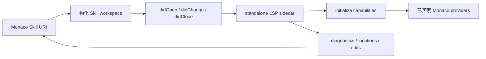

# 创作与工作台

<Status variant="stable">带共享 LSP 的事务型多文件编辑器</Status>

<TLDR>
  桌面工作台把 `SKILL.md`、`agents/openai.yaml` 和资源文件作为一个逻辑 workspace 编辑。dirty baseline 提供内容级冲突检查，Save All 原子提交。standalone LSP 发送文档事件前，Monaco model 会映射到物化后的 `file://` 文件。
</TLDR>

## 文件与保存状态

文件树始终显示 `SKILL.md` 与虚拟 `agents/openai.yaml`，并按真实相对路径显示全部资源。每个打开文件保存 `draftContent`、`savedContent` 和一种状态：`clean`、`saving`、`saved`、`blocked`、`conflict` 或 `error`。

`saveSkillWorkspace` 会比较当前 Dexie 内容与已保存 baseline。仅 metadata 导致的 `updatedAt` 变化不会产生伪冲突。runtime 校验或非法 Codex YAML 返回 `blocked`；外部内容变化返回 `conflict`；存储失败返回 `error`。autosave 失败后仍保留草稿与状态，继续编辑或使用保存快捷键即可重试。

Save All 先校验全部 dirty 文件，再在一个事务中提交正文、Codex YAML 和资源变更。任一失败都不会写入，并让所有草稿保持 dirty。只有真实提交后才显示“全部已保存”。metadata 设置 Sheet 只更新 metadata，不会提交未保存正文。

## 共享 LSP workspace

`lsp-workspace-manager.ts` 为每个 Skill 分配一个 workspace，而不是每个 tab 一个。它会物化：

- `SKILL.md`；
- 存在时的 `agents/openai.yaml`；
- 按 Bundle 相对路径放置的全部资源。

Canvas 与 Artifact 继续使用单文件 synthetic workspace。Project editor 注册真实 project root，并保留真实 `file://` 文档 URI。

manager 维护 Monaco URI ↔ 物化 URI 双向映射。类似 `skill:///skill-id/scripts/a.ts` 的 Skill model 会以 workspace 内的 `file://` URI 发给 server；diagnostics、location 和 workspace edit 在交给 Monaco 前会映射回来。

## 文档生命周期与 providers

工作台会先物化文档，再发送 open。内容变化按序 debounce，先 flush 到磁盘，再发送 `didChange`；关闭时发送 `didClose`，workspace 清理会删除映射与文件。

registry 保存 initialize capabilities，并且只注册 server 声明的 Monaco provider：completion、hover、definition、references、signature help、rename、symbols、formatting、code actions、code lens、links、colors、folding、selection ranges、semantic tokens、inlay hints、call/type hierarchy、linked editing、inline completion 与 workspace symbols。server 停止或崩溃时会立即 dispose 对应 providers。

同一语言下，user/project 配置优先于 plugin server；同级按解析配置顺序和 server ID。活动 server 崩溃后回退到下一个运行中的候选。支持动态 workspace folder 的 server 会收到 `workspace/didChangeWorkspaceFolders`；其他 server 使用最新 folder 列表安全重启。二进制信任 gate 不变，web/mobile 不显示不可用的 LSP 控件。

