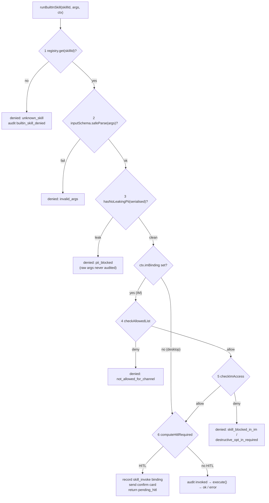

# 内置技能

<Status variant="beta">ADR-0026 — lib/skills/built-in · 类型化 MCP 工具 · 桌面与连接器 HITL</Status>

<TLDR>
  内置技能是**模型调用的类型化 MCP 工具**，而不是一段提示词片段。每个技能都是一个冻结的
  `BuiltInSkill`（`types.ts:116`），在模块加载时自注册（`registry.ts:115`），并声明一个
  `mutation` 等级（`read` / `write` / `destructive`）外加一个 `imAccess` 等级。`buildBuiltInSkillManifest`
  （`manifest.ts:63`）将注册表投影为 MCP 工具定义；`runBuiltInSkill`（`dispatcher.ts:58`）是
  唯一永不抛出的入口点，运行一条 6 道闸门的流水线（注册表 → Zod → PII → 白名单 → IM 访问 →
  变更路由）。写 / 破坏性技能会渲染一张 A2UI 确认卡片，持久化一条 `skill_invoke` 回调
  绑定（`a2ui-mapper.ts:171`），并在用户点击确认后通过连接器总线（`bus.ts:893`）重新进入。这 40 个 Lark 技能
  会调用用户已安装的 `lark-cli`（`exec-lark-cli.ts:101`），OAuth 凭据从已有的 Lark 连接器
  拉取（`auth-bridge.ts:86`）。运行时接线位于
  `build-options.ts` 和 `plugin-tool-ipc.ts`。仅桌面可用的 `plugin.conversion` 家族则复用应用内
  确定性转换器，并把所有路径限制在当前工作区。
</TLDR>

<Callout type="warn" title="与种子化的 `skill_builtin_*` 行不是一回事">
  本层级与那五行种子化的 Dexie 技能行（`skill_builtin_concise`、
  `skill_builtin_step_by_step`、……）共用了 "built-in" 这个词，后者记录在 [数据模型](./data-model) 中。那些是**提示词片段**，
  在发送时追加到系统提示中——模型从不"调用"它们。**本**页上的技能是
  模型通过 MCP 工具调用所触发的**可执行类型化工具**，带有凭据、审计行和一次 HITL
  往返。它们位于 `lib/skills/built-in/`，从不触碰 `skills` / `skillResources` Dexie 表，并
  由清单构建器按渠道过滤进出——而非由种子化程序处理。
</Callout>

## 代码位置

| 文件 | 职责 |
| --- | --- |
| `lib/skills/built-in/types.ts` | `BuiltInSkill` 契约、`BuiltInSkillContext`、`BuiltInSkillResult` |
| `lib/skills/built-in/registry.ts` | 基于 Map 的注册表 + 共享单例 + 不变量强制 |
| `lib/skills/built-in/manifest.ts` | 注册表 → MCP 工具定义；按渠道的过滤流水线；能力摘要 |
| `lib/skills/built-in/dispatcher.ts` | `runBuiltInSkill`——6 道闸门的信任流水线；永不抛出 |
| `lib/skills/built-in/index.ts` | 公共桶文件；`import "./lark"` 触发所有注册 |
| `lib/skills/built-in/lark/` | 跨 6 个家族（family）的 40 个 Lark 技能 + lark-cli 执行/鉴权桥 |
| `lib/skills/built-in/plugin-conversion/` | 仅桌面可用的整插件确定性转换 inspect/apply 工具 |
| `lib/plugin/convert/agent-service.ts` | 源快照、过期计划、空目标校验和文件系统写入适配器 |
| `lib/claude/build-options.ts:895` | 闸门 + 清单构建 + 折叠进 `allowedTools` / `pluginTools` |
| `lib/claude/plugin-tool-ipc.ts:144` | 渲染端 IPC 回退：MCP 工具名 → `runBuiltInSkill` |
| `lib/connectors/bus.ts:893` | `skill_invoke` 回调短路（HITL 确认重新触发） |
| `components/settings/built-in-skills/` | 设置外壳 + 按家族 / 按技能的开关 |
| `components/inbox/overrides/conversation-override-form.tsx` | 按会话的白名单 + HITL 覆盖 UI |

## 技能契约

技能是一个实现 `BuiltInSkill<Args>` 的冻结值（`types.ts:116`）。Zod 的 `inputSchema` 既充当
运行时参数校验，**又**充当 MCP 工具的 JSON-Schema（在 `manifest.ts:78` 中经 `z.toJSONSchema` 渲染）。唯一的硬性不变量：任何 `write` 或 `destructive` 技能都必须携带一个 `hitlSurface`，否则
注册会抛出（`registry.ts:50`）。

```ts
// lib/skills/built-in/types.ts:116 — abridged
export interface BuiltInSkill<Args extends ZodTypeAny = ZodTypeAny> {
  id: string                         // "lark.calendar.list_events"
  family: string                     // "lark.calendar"
  label: BilingualString             // { en, "zh-CN" } — settings + prompt
  description: BilingualString
  platforms: readonly PlatformKind[] | "any"
  requires?: readonly Capability[]   // channel must declare these (e.g. "rich-card.lark")
  mutation: BuiltInSkillMutation     // "read" | "write" | "destructive"
  imAccess: BuiltInSkillImAccess     // "always" | "readonly" | "opt-in" | "blocked"
  mcpToolName: string                // "lark_calendar_list_events" — verbatim tool name
  inputSchema: Args                  // Zod — runtime validation + JSON-Schema source
  execute: (args: z.infer<Args>, ctx: BuiltInSkillContext) => Promise<unknown>
  hitlSurface?: (args: z.infer<Args>) => A2UISegmentContent  // required when mutation !== "read"
}
```

`BuiltInSkillResult`（`types.ts:100`）是一个四形态的可辨识联合——`ok` / `pending_hitl` / `denied` /
`error`——因此即使在闸门拒绝或 `execute` 被拒的情况下，助手的工具调用结果也始终是良构的。

### 两个访问维度

信任模型由两个正交的枚举管理。`mutation` 决定是否需要 HITL；
`imAccess` 决定该技能在 IM 渠道中是否*可见*。

| `mutation`（`types.ts`） | IM 中的 HITL | `imAccess`（`types.ts:54`） | IM 中可见 |
| --- | --- | --- | --- |
| `read` | 从不 | `always` | 始终（在白名单许可时） |
| `write` | 除非 `requireHitlForWrites === false` | `readonly` | 仅当渠道设置了任意白名单时 |
| `destructive` | 始终 | `opt-in` | 仅当渠道显式列出该 id 时 |
| — | — | `blocked` | 从不（仅桌面应用内聊天） |

## 注册表

`createBuiltInSkillRegistry`（`registry.ts:35`）是一个带插入顺序家族列表的 `Map<id, skill>`，
逐字仿照 `lib/ocr/registry.ts`。`register` 在 id 重复时（`registry.ts:44`）以及写 / 破坏性技能缺少
`hitlSurface` 时（`registry.ts:51`）抛出——快速失败，因此破坏性技能
绝不可能在没有确认卡片的情况下到达 IM 渠道。

```ts
// lib/skills/built-in/registry.ts:50 — the load-bearing invariant
if (skill.mutation !== "read" && !skill.hitlSurface) {
  throw new Error(
    `BuiltInSkillRegistry: skill "${skill.id}" has mutation="${skill.mutation}" but no hitlSurface`
  )
}
```

共享单例在模块作用域创建（`registry.ts:112`）；`registerBuiltInSkill`（`registry.ts:115`）
是加载时入口点，`getSharedBuiltInSkillRegistry`（`registry.ts:119`）是读取入口点，而
`__resetSharedBuiltInSkillRegistry`（`registry.ts:124`）是测试辅助函数。导入 `lib/skills/built-in`
（`index.ts:45`）会运行 `import "./lark"`，进而扇出到全部六个家族模块并在
`build-options.ts` 遍历注册表之前将其填充完毕。

## 清单构建器

`buildBuiltInSkillManifest`（`manifest.ts:63`）遍历注册表，为每个存活的技能发出一条 `BuiltInSkillManifestEntry`
（`manifest.ts:42`），全部命名空间归于合成的插件 id
`cognia-builtin-skills`（`manifest.ts:40`）。它应用一条三阶段过滤（`manifest.ts:71-73`）：

1. **平台**（`passPlatformFilter`，`manifest.ts:122`）——非 IM（桌面）会话看到每个技能；
   IM 会话只看到其 `platforms` 覆盖所绑定平台的技能。
2. **IM 访问**（`passImAccessFilter`，`manifest.ts:137`）——在 IM 中丢弃 `blocked`，并在 IM 中丢弃 `readonly` /
   `opt-in`，除非该渠道已策展了一份白名单。
3. **白名单**（`passAllowedListFilter`，`manifest.ts:159`）——对照
   `ConversationOverrideRow.allowedBuiltInSkillIds` 做精确 id 匹配或 `family.*` 通配。

```ts
// lib/skills/built-in/manifest.ts:75 — surviving skills become MCP tool defs
out.push({
  name: skill.mcpToolName,
  description: skill.description.en,
  jsonSchema: z.toJSONSchema(skill.inputSchema) as object,
  pluginId: BUILTIN_SKILLS_PLUGIN_ID,
  skillId: skill.id,
})
```

<Callout type="info" title="变更等级不在清单层级过滤">
  写技能和破坏性技能仍会暴露给助手——模型被允许*提议*它们。
  分发器在调用时才决定是否渲染确认卡片。这让模型清楚自己能请求什么，
  同时为实际的副作用保留人工介入。
</Callout>

`summariseSkillCapabilities`（`manifest.ts:92`）把注册表提炼成按家族的
`PlatformSkillCapability[]`（变更集合按稳定的 `read → write → destructive` 顺序），适配器在启动时将其缓存到
`AdapterInstanceRow.lastKnownSkillCapabilities`（`connector-types.ts:101`）——因此热发送路径
绝不会为了能力提示段而重新遍历注册表。

## 分发器流水线

`runBuiltInSkill(skillId, args, ctx)`（`dispatcher.ts:58`）是每次调用的唯一入口点——
既包括助手驱动的首次调用，也包括回调驱动的 HITL 重新触发。它**永不抛出**：`execute`
被拒会被捕获并以 `{ status: "error" }` 呈现（`dispatcher.ts:230`）。每条路径都会写一条
`connectorAudit` 行，且 PII 脱敏在参数到达审计日志*之前*运行。



### 逐道闸门

| # | 闸门 | 来源 | 失败时的拒绝原因 |
| --- | --- | --- | --- |
| 1 | 注册表查找 | `dispatcher.ts:64` | `unknown_skill` |
| 2 | Zod 参数校验 | `dispatcher.ts:83` | `invalid_args` |
| 3 | PII 闸门（`hasNoLeakingPii`） | `dispatcher.ts:102` | `pii_blocked` |
| 4 | 渠道白名单（`checkAllowedList`） | `dispatcher.ts:124`，辅助函数 `:263` | `not_allowed_for_channel` / `channel_blocks_all_builtin_skills` |
| 5 | IM 访问（`checkImAccess`） | `dispatcher.ts:142`，辅助函数 `:295` | `skill_blocked_in_im` / `destructive_opt_in_required` / `readonly_requires_channel_curation` |
| 6 | 变更路由（`computeHitlRequired`） | `dispatcher.ts:162`，辅助函数 `:338` | → 执行或 `pending_hitl` |

对于桌面应用内（非 IM）会话，闸门 4 和 5 是空操作（`dispatcher.ts:123`）——内置技能在
桌面聊天中始终暴露，因为用户已经在盯着它。PII 闸门复用了
`packages/redact/src/index.ts` 中的 `hasNoLeakingPii`（`dispatcher.ts:36`），即保护 Twin、
Goal 和连接器自动模式的同一条红线。

```ts
// lib/skills/built-in/dispatcher.ts:338 — the mutation → HITL decision
function computeHitlRequired(skill, isImSession, requireHitlForWrites, bypass): boolean {
  if (bypass) return false                  // callback re-fire after Confirm
  if (skill.mutation === "read") return false
  if (skill.mutation === "destructive") return true   // always — channel toggle ignored
  return requireHitlForWrites !== false     // write: desktop + IM default true
}
```

### 审计种类

每条分发器和总线路径都会发出六种审计种类之一（`types/connectors/audit.ts:79-84`），以便运维人员能够
精确重建一个技能为何触发或未触发：

| 审计种类 | 写入位置 | 含义 |
| --- | --- | --- |
| `builtin_skill_invoked` | `dispatcher.ts:220` | 读/自动写正在执行 |
| `builtin_skill_denied` | `dispatcher.ts:66`、`:86`、`:105`、`:126`、`:144` | 某道闸门在执行前触发 |
| `builtin_skill_hitl_pending` | `dispatcher.ts:201` | 确认卡片已发出，等待点击 |
| `builtin_skill_hitl_approved` | `dispatcher.ts:220`（bypass 路径） | 用户点击确认，正在执行 |
| `builtin_skill_hitl_rejected` | `bus.ts:899` | 用户点击取消 / 忽略 |
| `builtin_skill_failed` | `dispatcher.ts:232`、`bus.ts:924` | `execute` 抛出 |

## 端到端：从工具调用到副作用

```mermaid
sequenceDiagram
  participant M as Model (sidecar)
  participant IPC as plugin_tool_exec IPC
  participant D as runBuiltInSkill (renderer)
  participant CLI as lark-cli (execFile)
  participant A as Lark adapter / IM channel
  participant U as User

  M->>IPC: tool_use lark_calendar_create_event(args)
  IPC->>D: handlePluginToolExec → resolve by mcpToolName
  Note over D: gates 1-5 pass; mutation=write → HITL
  D->>D: recordCallbackBinding(kind="skill_invoke", payload={skillId,args})
  D->>A: send A2UI confirm card (Confirm / Cancel)
  D-->>M: { status: "pending_hitl", bindingId }
  U->>A: clicks "Confirm"
  A->>D: dispatchConnectorCallback → bus skill_invoke short-circuit
  D->>D: runBuiltInSkill(skillId, args, { hitlBypass: true })
  Note over D: computeHitlRequired → false (bypass)
  D->>CLI: execFile lark-cli calendar +create-event --yes ...
  CLI-->>D: { status: "ok", data }
  D->>A: surfaces skill result through the chat loop
```

## 插件转换家族

`plugin.conversion` 把种子提示技能（`skills/built-in/plugin-conversion/SKILL.md`）与两个类型化工具组合起来：

| 工具 | 变更等级 | 契约 |
| --- | --- | --- |
| `inspect_plugin_conversion` | `read` | 检测源生态、运行规范转换器、返回保真度/问题/文件清单，并在不写盘的情况下创建限时计划 |
| `apply_plugin_conversion` | `write` | 重新读取源，拒绝过期计划、非空或重叠目标，经桌面确认后只写入确定性转换产物 |

两个工具都声明 `imAccess: "blocked"`。仅当提示技能已激活（或选择加入的 `Skill` 自加载器可在本轮
激活它）、桌面会话存在工作区 cwd 且工作区文件系统后端可用时，`resolveSendOptions` 才会暴露它们。
源目录与输出目录都必须相对工作区；Rust 工作区文件命令会在落盘边界再次执行路径包含校验。

计划将 `workspaceRoot + sourceDir + target` 绑定到源快照摘要，并在 15 分钟后过期。成功写入后计划
即被消费。源发生变化、计划未知或过期、输出非空、源与输出重叠都会关闭式失败。不支持的能力保留在
结构化 `blocking` 报告中；Agent 被明确禁止近似实现或自行生成转换后的运行时代码。

整包转换支持 Claude Code、Codex 或 Gemini CLI → Cognia，以及 Cognia → 这三种生态中的任意一种。
外部生态 → 外部生态刻意不支持。

## Lark CLI 桥

这 40 个 v1 技能全部属于 Lark，分为六个家族，每个家族在模块加载时各自 `registerBuiltInSkill()`
（`lark/index.ts:19-24`）。这个数字是精确的——9 + 6 + 6 + 8 + 7 + 4 = **40** 次注册。

| 家族 | 工具数 | 变更等级 | 模块 |
| --- | --- | --- | --- |
| `lark.calendar` | 9 | 读 · 写 · 破坏性 | `lark/calendar.ts` |
| `lark.doc` | 6 | 读 · 写 · 破坏性 | `lark/doc.ts` |
| `lark.sheets` | 6 | 读 · 写 | `lark/sheets.ts` |
| `lark.base`（Bitable） | 8 | 读 · 写 · 破坏性 | `lark/base.ts` |
| `lark.task` | 7 | 读 · 写 | `lark/task.ts` |
| `lark.wiki` | 4 | 读 · 写 | `lark/wiki.ts` |

每个家族文件使用两个工厂——一个读取制造器和一个写入制造器——以将每个技能的主体保持为
lark-cli 的 argv 形态。calendar 家族是参考样板：`mkRead`（`calendar.ts:26`）设置 `mutation: "read"`
和 `imAccess: "always"`；`mkWrite`（`calendar.ts:56`）默认为 `write` / `always`，但接受覆盖，因此
`delete_event` 声明了 `mutation: "destructive"` 和 `imAccess: "opt-in"`（`calendar.ts:300-301`）。写入
制造器附加了一个由 `buildConfirmSurface`（`_helpers.ts:59`）构建的 `hitlSurface`。

### lark-cli 执行

`execLarkCli`（`exec-lark-cli.ts:101`）通过 `execFile` 派生用户已安装的 `lark-cli`——**没有 shell
插值**。`argsToFlags`（`_helpers.ts:17`）把 camelCase 的 Zod 参数形态映射为 kebab-case 的
`--flag value` argv（对数组重复该标志）。身份标志被前置（`exec-lark-cli.ts:132`），
而 `--yes` 仅在调用方标记该调用已确认时才追加（`exec-lark-cli.ts:135`）。

```ts
// lib/skills/built-in/lark/exec-lark-cli.ts:142 — direct execFile, env-injected auth
const result = await execFileAsync(binary, argv, {
  env: { ...process.env, ...auth.env },     // OAuth creds, ephemeral
  timeout: timeoutMs,                        // clamped to 5-min max
  maxBuffer: MAX_STDOUT_BYTES,               // 1 MB
  windowsHide: true,                         // no console flash on Windows
})
```

上限镜像 sidecar shell 工具：5 分钟超时钳制（`exec-lark-cli.ts:44,139`）、1 MB stdout 上限
（`exec-lark-cli.ts:42`）、`windowsHide`（`exec-lark-cli.ts:146`）。二进制发现
（`locateLarkCliBinary`，`exec-lark-cli.ts:172`）依次尝试 `LARK_CLI_BIN` → PATH → Windows 上的
`%APPDATA%\npm\lark-cli.cmd` 垫片。lark-cli 自身的确认闸门（退出码 10）被映射为
`{ reason: "hitl_required" }`（`exec-lark-cli.ts:240`），因此在没有 `confirmed: true` 的情况下调用的技能会呈现一个
干净的结构化错误，而非挂起。`runLarkCli`（`_helpers.ts:118`）解包 `ok` 结果，否则抛出一个
格式化错误——分发器把这个抛出捕获进审计行和工具调用结果。

### 鉴权桥——复用 Lark 连接器 OAuth

`resolveLarkAuth`（`auth-bridge.ts:86`）从已有的 Lark 连接器适配器中取出凭据，而不是
强制进行第二次 `lark-cli auth login`。它挑选一个适配器（显式 id → 首个已启用 → 任意一个以便给出精确错误，
`auth-bridge.ts:177`），从密钥环经 `connectorsKeyringGet`（`auth-bridge.ts:188`）读取应用密钥和用户令牌，
优先采用窄作用域的用户令牌（`auth-bridge.ts:128`），并回退到经
`getTenantAccessToken`（`auth-bridge.ts:148`）获取的租户（机器人）令牌。它**永不抛出**——六个精确的错误
原因（`auth-bridge.ts:58-64`）让技能能渲染一条精准的引导横幅。

```ts
// lib/skills/built-in/lark/auth-bridge.ts:135 — env overlay passed to execFile
env: {
  LARK_APP_ID: appId,
  LARK_APP_SECRET: appSecret,                 // ephemeral env, never written to disk
  LARK_USER_ACCESS_TOKEN: userToken,          // or LARK_TENANT_ACCESS_TOKEN for bot identity
}
```

## 运行时接线

### build-options 闸门与清单折叠

`resolveSendOptions`（`build-options.ts:895`）仅在会话绑定到 IM
**或**活跃角色通过 `Character.enableBuiltInSkills`（`lib/claude/types.ts:2210`）选择加入时，才暴露内置技能。它惰性
导入 `@/lib/skills/built-in` 以便注册得以运行（`build-options.ts:904`），构建清单
（`build-options.ts:906`），将每个工具名并入 `opts.allowedTools`（`build-options.ts:916-918`），并
随后把清单条目折叠进插件工具桥所产出的同一条 `opts.pluginTools` 流
（`build-options.ts:1099-1108`）。sidecar 通过合成的 `cognia-plugin-tools` MCP 服务器同时暴露两者，并
按工具名路由调用——因此 `cognia-builtin-skills` 命名空间与真正的插件工具共存而
不冲突。

```ts
// lib/claude/build-options.ts:895 — gate
const builtInSkillsRequested =
  Boolean(session?.platformBinding?.adapterId) || character?.enableBuiltInSkills === true
```

`plugin.conversion` 被刻意放在这个宽泛开关之外。它的条目会从通用桌面清单中移除，只在
`builtin:plugin-conversion` 提示技能已激活或 `Skill` 自加载器启用时单独追加。这样，仅仅启用了其他
连接器内置技能的角色不会意外获得文件系统写工具。它也位于 `disablePluginTools` 之外，因为该标志
控制第三方插件工具，而非第一方转换能力。

### 渲染端分发回退

sidecar 把每次 `cognia-builtin-skills` 工具调用通过已有的 `plugin_tool_exec` IPC
通道代理回来。`handlePluginToolExec`（`plugin-tool-ipc.ts:121`）先尝试插件注册表
（`plugin-tool-ipc.ts:131`），然后回退到内置技能注册表：它按
`mcpToolName` 解析工具，并带会话 id 调用 `runBuiltInSkill`（`plugin-tool-ipc.ts:144-149`）。可辨识的
结果（`ok` / `denied` / `pending_hitl` / `error`）被逐字呈现，因此模型能看到闸门原因。该
IPC 事件经由 `components/providers/plugin-tool-dispatch-provider.tsx` 到达。

### 经总线的 HITL 往返

当分发器要求 HITL 时，它经 `recordCallbackBinding`（`a2ui-mapper.ts:171`）持久化一条回调绑定，
带 `kind: "skill_invoke"` 和 `payload: { skillId, args }`（`dispatcher.ts:191`）；
绑定行 id 为 `` `${adapterId}:${actionId}` ``，默认 30 天 TTL（`a2ui-mapper.ts:169`）。
`skill_invoke` 种类是 `ConnectorCallbackBindingKind`
（`types/connectors/interaction.ts:189-200`，`skill_invoke` 在 `:194`）十一个联合成员之一。

当用户点击按钮时，适配器规范化该回调，连接器总线在绑定种类上短路
（`bus.ts:893`）：`cancel` / 忽略会审计 `builtin_skill_hitl_rejected`（`bus.ts:899`），
否则重新触发 `runBuiltInSkill(skillId, args, { …, hitlBypass: true })`（`bus.ts:913-922`），
错误审计为 `builtin_skill_failed`（`bus.ts:924`）。

```ts
// lib/connectors/bus.ts:893 — skill_invoke short-circuit
if (resolvedBinding?.kind === "skill_invoke") {
  const skillId = String(resolvedBinding.payload?.["skillId"] ?? "")
  const skillArgs = resolvedBinding.payload?.["args"]
  const cancelled = (event.value ?? "").toLowerCase() === "cancel" || event.actionType === "dismiss"
  // … cancelled → audit reject; else runBuiltInSkill(skillId, skillArgs, { hitlBypass: true })
}
```

## 按会话覆盖与能力提示段

`ConversationOverrideRow` 携带两个技能控制字段（`lib/db/connector-types.ts`）：
`allowedBuiltInSkillIds?: string[] | "all"`（`:426`——`undefined` 表示继承，`"all"`，`[]` 阻断每个技能，
或精确 id / `family.*` 通配）以及 `requireHitlForWrites?: boolean`（`:434`——默认为 `true`；
破坏性技能无论如何始终要求 HITL）。覆盖编辑器
（`components/inbox/overrides/conversation-override-form.tsx`）经 `deriveSkillMode`（`:48`）暴露一个三态模式（继承 / 全部 /
白名单）、一个分词器 `addSkillFromInput`（`:122`）以及 HITL 开关
状态（`:118-119`）。

能力提示段由 `buildCapabilityPromptSection`（`capability-evaluator.ts:106`）追加到系统提示中：行
`:140` 发出一个形如 `Built-in skills available on this
channel: lark.calendar (read+write), …` 的句子，让模型知道它在该渠道上可调用哪些家族——由
缓存的 `lastKnownSkillCapabilities` 喂养，而非实时遍历注册表。

<Callout type="warn" title="一句话说清信任模型">
  读 = 始终可用，无需确认；写 = 默认弹出 HITL 确认卡片，渠道可经
  `requireHitlForWrites = false` 选择退出；破坏性 = **始终** HITL，且渠道必须通过在
  `allowedBuiltInSkillIds` 中列出该 id（或 `family.*`）来选择加入。注册表拒绝加载没有
  `hitlSurface` 的写 / 破坏性技能，且 PII 闸门在任何执行或审计写入之前对序列化后的参数运行。
</Callout>

<Callout type="info" title="坑点">
  - 凭据是临时的：鉴权桥把 `LARK_APP_SECRET` / 令牌作为环境变量传给 `execFile`，
    从不写入磁盘（`auth-bridge.ts:43`）。v1 仅支持环境变量；临时配置回退是 v2 的钩子。
  - 必须安装 lark-cli（`npm install -g lark-cli`）或设置 `LARK_CLI_BIN`——否则技能返回一个
    `binary_not_found` 错误（`exec-lark-cli.ts:118`），而非崩溃。
  - 审计是尽力而为：`safeAppendAudit`（`dispatcher.ts:387`）吞掉 Dexie 失败，因此缺失的审计
    存储绝不会破坏技能。
  - 桌面写操作会暂停在标准工具审批对话框。`apply_plugin_conversion` 必须经用户批准才能写盘；
    取消或超时会返回结构化拒绝。
</Callout>

## 相关

<Cards>
  <Card title="技能概览" href="./index" />
  <Card title="加载与注入" href="./loading-and-injection" />
  <Card title="平台连接器" href="../platform-connectors/index" />
  <Card title="ADR-0026 — 内置技能与 Lark CLI 桥" href="../../adr/0026-builtin-skills-and-lark-cli-bridge" />
</Cards>
