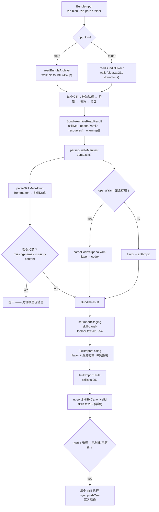
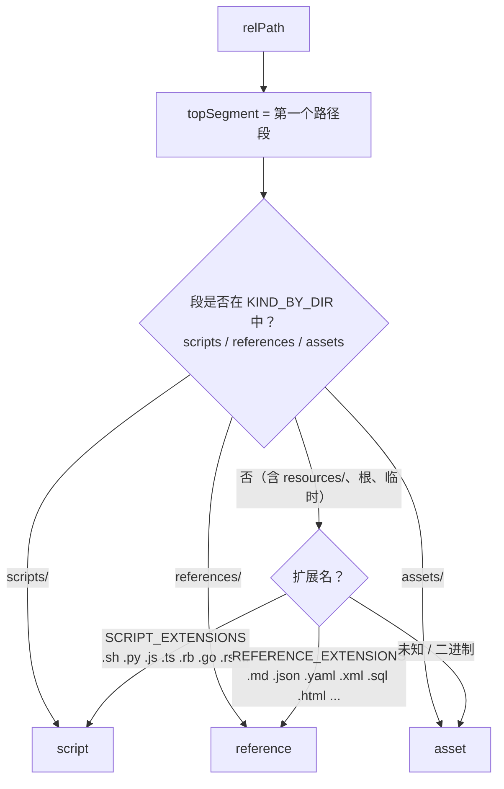

# Bundle 导入

<Status variant="stable">导入管线 —— lib/skills/bundle（6 个模块）· zip / 文件夹 / Codex YAML</Status>

<TLDR>
  `loadBundle(input)`（`lib/skills/bundle/loader.ts:65`）是唯一入口。它接受一个
  `BundleInput` 联合类型（`loader.ts:26` —— `zip-blob` / `zip-path` / `folder`），用
  `readBundleArchive`（`walk-zip.ts:191`）或 `readBundleFolder`（`walk-folder.ts:211`）遍历文件，然后用
  `parseBundleManifest`（`parse.ts:57`）解析清单层。每个非 SKILL.md 文件都由
  `inferResourceKind`（`classify.ts:93`）分类，并受共享的 `limits.ts` 常量限制。结果是一个
  `SkillDraft` 加 `resources[]`；工具栏将其暂存（`skill-panel-toolbar.tsx:201`），对话框通过
  `bulkImportSkills`（`skill-import-dialog.tsx:68` → `lib/db/skills.ts:257`）持久化它，后者将
  canonical-id 草稿路由到幂等的 `upsertSkillByCanonicalId`（`skills.ts:202`）。Codex `openai.yaml`
  **仅支持导入**，并且**没有 bundle（zip）导出** —— 只有逐个 skill 的 `SKILL.md`。
</TLDR>

## 输入与加载器

`loadBundle` 刻意与持久化解耦：`lib/skills/bundle/` 中没有任何代码写入 Dexie 或
文件系统（`loader.ts:13`）。它将遍历器与解析器组合起来，返回一个 `BundleResult`
（`loader.ts:31`）。

```ts
// loader.ts:26 — three ways in, one BundleResult out
export type BundleInput =
  | { kind: "zip-blob"; bytes: Uint8Array | ArrayBuffer; fallbackName?: string }
  | { kind: "zip-path"; path: string; fallbackName?: string }
  | { kind: "folder"; path: string; fallbackName?: string; fs?: BundleFs }
```

| 输入类型 | 遍历器 | Shell | 说明 |
| --- | --- | --- | --- |
| `zip-blob` | `readBundleArchive` | web · 移动端 · Tauri | 字节已在内存中（文件选择器） |
| `zip-path` | `readBundleArchive` | Tauri | 通过 `@tauri-apps/plugin-fs`（`loader.ts:54`）惰性读取文件 |
| `folder` | `readBundleFolder` | Tauri | 通过 `BundleFs` 适配器遍历目录树 |

函数体按 `input.kind` 挑选遍历器，推导出一个 `fallbackName`（显式指定 → 根目录名 → 路径的
basename），然后将遍历器的 `skillMd` 加可选的 `openaiYaml` 喂给 `parseBundleManifest`
（`loader.ts:110`）。致命校验会抛出异常；所有非致命问题随草稿一并携带在
`warnings` / `nonFatalValidationErrors` 数组中（`loader.ts:116`）。

```ts
// loader.ts:31 — the unified output the dialog consumes
export interface BundleResult {
  draft: SkillDraft
  resources: Array<Omit<SkillResourceDraft, "skillId">>
  flavor: BundleFlavor              // "anthropic" | "codex"
  codexMeta?: CodexOpenaiMeta       // present only when agents/openai.yaml existed
  rootDirName?: string
  nonFatalValidationErrors: SkillValidationError[]
  warnings: string[]
}
```

## 管线



### 遍历 zip —— `walk-zip.ts`

`readBundleArchive`（`walk-zip.ts:191`）用 JSZip 加载归档，并且只接受两种布局：根目录下扁平的
`SKILL.md`，或单层嵌套的 `<name>/SKILL.md`。更深的层级会被拒绝，以保证 bundle 的
目录名清晰明确（`findSkillRoot:122`，在 `walk-zip.ts:144` 抛出）；嵌套目录名
成为 `rootDirName`（`walk-zip.ts:212`）。

- **总量限制。** `collectEntries`（`walk-zip.ts:96`）在实例化每个非目录条目的同时强制执行
  `MAX_ZIP_TOTAL_BYTES`（`walk-zip.ts:107`）；原始缓冲区在解压前也会预先检查（`walk-zip.ts:195`）。
- **sidecar 抽取。** `agents/openai.yaml`（或 `.yml`）会被单独提取为 Codex 清单，
  从不作为资源处理（`walk-zip.ts:228`）。
- **逐文件处理。** 对于每个剩余条目，遍历器会跳过根目录之外的文件（`walk-zip.ts:220`），
  运行 `validateResourcePath`（`walk-zip.ts:234`），强制执行逐文件的 `MAX_RESOURCE_BYTES_WEB` 限制
  （`walk-zip.ts:241`），对其分类，当文件位于规范目录之外时发出警告（`walk-zip.ts:252`），并在
  达到 `MAX_RESOURCES_PER_SKILL` 后停止（`walk-zip.ts:258`）。
- **编码。** `encodeResource`（`walk-zip.ts:161`）将类文本扩展名（`TEXT_EXTENSIONS:24`）解码为
  UTF-8，但当解码产生替换字符时回退到 base64（`walk-zip.ts:168`）—— 这是
  对错误命名的二进制文件的防御。base64 路径使用分块的、浏览器安全的 `btoa` 编码器（`walk-zip.ts:172`）。

### 遍历文件夹 —— `walk-folder.ts`

Tauri 侧的遍历器通过一个微型适配器访问文件系统，以便测试可以换入内存中的
实现，而无需 mock `@tauri-apps/plugin-fs`：

```ts
// walk-folder.ts:22 — the seam that makes the folder walker testable
export interface BundleFs {
  readDir(path: string): Promise<BundleFsEntry[]>
  readTextFile(path: string): Promise<string>
  readFile(path: string): Promise<Uint8Array>
  exists(path: string): Promise<boolean>
}
```

`readBundleFolder`（`walk-folder.ts:211`）要求存在 `<root>/SKILL.md`，缺失时抛出异常
（`walk-folder.ts:218`）；`agents/openai.yaml` 是可选的（`walk-folder.ts:223`）。默认适配器
惰性地从 `@tauri-apps/plugin-fs` 构建，以保持模块对 jsdom 安全（`walk-folder.ts:113`）。`recurse`
（`walk-folder.ts:151`）是一次深度优先遍历，跳过 `SKILL.md` 和 Codex sidecar 文件（`walk-folder.ts:166`），
并应用与 zip 遍历器**相同**的限制、路径校验、分类和编码。两个遍历器
发出完全相同的 `BundleArchiveReadResult` 结构（`walk-folder.ts:237`），因此加载器可以将任一来源
拼接进同一份草稿。

## 分类

`inferResourceKind`（`classify.ts:93`）决定每个文件的 `SkillResourceKind`。**规范子目录名优先**；
只有在没有规范目录匹配时，它才回退到逐文件扩展名，最后以 `asset` 兜底。



| 信号 | 来源 | 结果 |
| --- | --- | --- |
| `scripts/` 目录 | `KIND_BY_DIR`（`classify.ts:21`） | `script` |
| `references/` 目录 | `KIND_BY_DIR` | `reference` |
| `assets/` 目录 | `KIND_BY_DIR` | `asset` |
| 可执行扩展名 | `SCRIPT_EXTENSIONS`（`classify.ts:28`） | `script` |
| 文档 / 结构化文本扩展名 | `REFERENCE_EXTENSIONS`（`classify.ts:53`） | `reference` |
| 其他任何情况 | 兜底（`classify.ts:103`） | `asset` |

`isCanonicalBundleDir`（`classify.ts:84`）是遍历器用来决定是否
附加 "lives outside scripts/ references/ assets/" 软警告的大小写不敏感检查。正是它让真实世界的 bundle 能够附带
一个 `resources/` 目录（在 Claude Code skills 中很常见），并仍让其 `.py` 辅助脚本归为 `script`
而非全部被归入 `asset`。

<Callout type="info" title="规范目录之外按文件逐个分类">
  位于 `references/build.sh` 的文件是 `reference`（目录名是显式的创作信号，
  且优先），但同一个 `build.sh` 位于 `resources/` 下或 bundle 根目录时则是 `script`（基于扩展名）。
  目录约定在设计上是宽松的 —— 分类从不丢弃文件，只会重新归类。
</Callout>

## 限制与路径安全

所有限制都集中在一个模块中（`limits.ts`），以便加载器、Dexie 持久化层和 Rust ↔ TS 磁盘
镜像就同一组数值达成一致（`limits.ts:1`）。

| 常量 | 值 | 对应 |
| --- | --- | --- |
| `MAX_ZIP_TOTAL_BYTES`（`limits.ts:21`） | 200 MB | VSIX 安装器的总量限制 |
| `MAX_RESOURCE_BYTES_WEB`（`limits.ts:22`） | 每文件 16 MB | web/移动端内联（Dexie）上限 |
| `MAX_RESOURCE_BYTES_DISK`（`limits.ts:23`） | 每文件 2 MB | Rust `MAX_RESOURCE_BYTES` 原生限制 |
| `MAX_RESOURCES_PER_SKILL`（`limits.ts:24`） | 50 个条目 | Rust 的每 skill 限制 |

`validateResourcePath`（`limits.ts:32`）是镜像 Rust `validate_resource_path` 规则的
单一事实来源守卫 —— 它拒绝空路径、`..` 穿越、前导绝对分隔符，以及空段
或 `.` 段。`validateDirName`（`limits.ts:48`）镜像 `validate_dir_name`：ASCII 字母数字加
`-` 和 `_`，长度 1–64，无前导/尾随 `-`。

<Callout type="warn" title="两个逐文件限制，而非一个">
  遍历器在导入时强制执行 `MAX_RESOURCE_BYTES_WEB`（16 MB）。更严格的 2 MB
  `MAX_RESOURCE_BYTES_DISK` 在此**不**强制执行 —— 在 web 上创作的 bundle 可以持有介于
  2 到 16 MB 之间的资源。它们只在镜像推送稍后将其写入 Tauri 设备时
  才浮现一个逐资源的 `tooLargeForDisk` 警告。参见 [原生同步与安全](./native-sync-and-security)。
</Callout>

## 解析清单

`parseBundleManifest`（`parse.ts:57`）负责从"两个文本 blob"到"一个 `SkillDraft` 加类型化的
Codex 元数据"的转换。它将 frontmatter 解析委托给 `parseSkillMarkdown`（`lib/claude/skills-io.ts`），后者
识别 `name`、`description`、`allowed-tools` / `allowedTools`、`tags`、`category`、`version`、`author`
和 `license`。致命与非致命的划分镜像 `lib/skills/marketplace-install.ts`：

```ts
// parse.ts:38 — only these two refuse the import loudly
const FATAL_VALIDATION_CODES = new Set<SkillValidationError["code"]>([
  "missing-name",
  "missing-content",
])
```

`validateSkill` 在草稿上运行；致命代码会抛出（`parse.ts:109`），其他一切都被过滤到
`nonFatalValidationErrors`（`parse.ts:112`）并持久化到生成的 `Skill` 行上，以便编辑器可以标记
它。当存在 `openaiYaml` 时，`flavor` 翻转为 `"codex"`（`parse.ts:69`），Codex 元数据被合并进来：

- **显示名优先级** —— SKILL.md frontmatter > Codex `interface.display_name` > 文件名兜底。
  Codex 显示名只有在 markdown `name` 等于所提供的兜底值时才覆盖，这表明用户
  从未设置过显示名（`parse.ts:77`）。
- **隐式调用警告** —— `policy.allow_implicit_invocation === false` 会添加一条警告，说明该 skill
  仅可选择性启用（`parse.ts:82`）。
- **MCP 依赖警告** —— `type === "mcp"` 的 `dependencies.tools[]` 会作为警告浮现；bundle
  导入从不自动接线 MCP 服务器（`parse.ts:88`）。

### Codex `agents/openai.yaml`

`parseCodexOpenaiYaml`（`codex-yaml.ts:72`）读取 OpenAI Codex CLI 的 skill sidecar 文件。它在遇到
未知或非预期的结构时**从不抛出** —— 每个偏差都落在 `result.warnings`（`codex-yaml.ts:65`）中，YAML 加载
失败会被包装而非传播（`codex-yaml.ts:76`）。所识别的 schema 使用 snake_case 键
（`codex-yaml.ts:43`：`display_name`、`short_description`、`allow_implicit_invocation`、`dependencies.tools`），
解析器将其映射到 camelCase 的 `CodexOpenaiMeta`：

```ts
// codex-yaml.ts:36 — the typed projection of openai.yaml
export interface CodexOpenaiMeta {
  interface?: CodexInterfaceMeta      // displayName, shortDescription, icons, brandColor, defaultPrompt
  policy?: CodexPolicyMeta            // allowImplicitInvocation
  toolDependencies: CodexToolDependency[]
  warnings: string[]
}
```

<Callout type="warn" title="Codex YAML 是只读的 —— 无往返">
  cognia 将应用内的 `Skill` 行视为规范来源。`agents/openai.yaml` 在导入时解析一次，从不
  重新序列化；没有 Codex 导出。未知的顶层键会产生一条醒目的警告
  （`codex-yaml.ts:103`），但解析仍然成功。
</Callout>

## 暂存与持久化

工具栏暴露四个导入入口，每个都构建草稿并调用 `setImportStaging`：

| 操作 | 处理器 | 路径 |
| --- | --- | --- |
| 从 markdown | `handleImportFromMarkdown`（`skill-panel-toolbar.tsx:121`） | 直接通过 `parseSkillMarkdown` 处理纯 `.md` |
| 从 bundle zip | `handleImportFromBundleZip`（`:174`） | `loadBundle({ kind: "zip-blob" })`（`:184`），提取 `flavor`（`:205`） |
| 从 bundle 文件夹 | `handleImportFromBundleFolder`（`:221`） | Tauri 目录选择器 → `loadBundle({ kind: "folder" })`（`:236`） |
| 从 Claude Code | `handleImportFromClaudeCode`（`:274`） | 扫描 `~/.claude/skills`，给每个草稿打上 `"claude-code"` 标签（`:294`） |

Bundle 导入会在草稿上盖上一个 `canonicalId` —— `bundle:zip:<slug>`（`:196`）或 `bundle:folder:<slug>`
（`:248`）—— 这正是让重复导入幂等的关键。一切都通过 `setImportStaging`
（`:201`、`:254`）暂存，并交给 `SkillImportDialog`。

对话框会显示一个 flavor 徽章（`skill-import-dialog.tsx:132`）、一个资源计数徽章（`:141`）和一个
冲突策略单选组 —— `skip` / `duplicate` / `overwrite`（`:190`）。应用时调用 `bulkImportSkills`
（`:68`）。对于产生了资源并至少创建或更新了一行的 Tauri 导入，对话框随后会
按 `canonicalId` 重新查找每个 skill，并为每个 skill 触发 `sync.pushOne`，以将 bundle 物化到磁盘上
（`:84`）。

```ts
// skill-import-dialog.tsx:84 — auto-mirror bundle imports to disk on Tauri
if (isTauri() && hasResources && (report.created > 0 || report.updated > 0)) {
  // re-lookup by canonicalId (the dialog never saw the row id) → push each
  for (const id of targetIds) {
    if (!(await getSkill(id))) continue
    await sync.pushOne(id)
  }
}
```

### `bulkImportSkills` 与 canonical-id upsert

`bulkImportSkills`（`lib/db/skills.ts:257`）根据草稿是否携带 `canonicalId` 进行分流。携带 canonical-id 的草稿
走幂等的 upsert 路径（`skills.ts:280`）；没有的草稿则落入名称冲突
策略（`skills.ts:290`–`323`）。

```ts
// skills.ts:280 — bundle / marketplace drafts never duplicate
if (draft.canonicalId) {
  const { skill, created } = await upsertSkillByCanonicalId({
    draft,
    canonicalId: draft.canonicalId,
  })
  byName.set(skill.name.toLowerCase(), skill)
  if (created) result.created += 1
  else result.updated += 1
  continue
}
```

`upsertSkillByCanonicalId`（`skills.ts:202`）按 `canonicalId` 查找现有行，就地更新它 —— 因此
`Skill.id` 在重复导入间保持稳定 —— 并且关键地调用 `replaceResourcesForSkill`（`skills.ts:230`），
后者替换**整个**资源集。其契约是"zip 里有什么，DB 里就是什么"：从 bundle 中删掉一个
文件再重新导入会将其从该行中移除。同一个 `replaceResourcesForSkill` 也在
`overwrite` 名称冲突路径上运行（`skills.ts:313`）。

<Callout type="info" title="与 marketplace 和 plugin 路径共享">
  canonical-id upsert 是唯一的重复导入接缝：`lib/skills/marketplace-install.ts` 复用同一条
  `parseSkillMarkdown` + `validateSkill` + `upsertSkillByCanonicalId` 链（参见 [Marketplace](./marketplace)），
  而 plugin 附带的 `archive` skills 在发送时调用 `loadBundle({ kind: "zip-path" })`（`lib/claude/skills-io.ts:309`）
  来提取 SKILL.md —— 每次解析时都重新提取，没有缓存层。
</Callout>

## 导出 —— 仅单文件

**没有 bundle（zip）导出**。唯一的导出路径是逐个 skill 的 `SKILL.md`：
`exportSkillsToDirWithFeedback`（`lib/skills/export-toast.ts:29`）通过 `serializeSkill`
（`lib/claude/skills-io.ts:94`）将每个 skill 序列化为一个 kebab-case 的 `.md` 文件名。

```ts
// skills-io.ts:94 — what gets serialized (and what doesn't)
const data: Record<string, unknown> = { name: skill.name }
// description, allowed-tools, tags, category, version, author, license …
// id / canonicalId / marketplaceSkillId are intentionally NOT emitted
```

省略 `id` / `canonicalId` / `marketplaceSkillId` 是刻意的：重新导入的导出会作为一个
普通 `custom` skill 回流，而非重新绑定到其原始行。结合上述的导入不对称性，
往返过程在若干处是刻意有损的：

<Callout type="warn" title="休眠 / 单向部分">
  - **无 zip 导出。** 资源始终内联在 Dexie 中；唯一的出口是磁盘镜像（Tauri）—— 没有
    "导出 bundle" 按钮。
  - **Codex YAML 仅支持导入** —— `agents/openai.yaml` 从不往返。
  - **Plugin archive skills 在每次解析时都重新提取**（`skills-io.ts:309`）—— 无缓存。
  - **文件夹导入仅限 Tauri** —— 在 Tauri 之外，处理器会弹出 `importFromClaudeDesktopOnly` toast
    （`skill-panel-toolbar.tsx:222`）。
</Callout>

<Cards>
  <Card title="Skills 概览" href="./index" />
  <Card title="数据模型" href="./data-model" />
  <Card title="原生同步与安全" href="./native-sync-and-security" />
  <Card title="Marketplace" href="./marketplace" />
</Cards>
