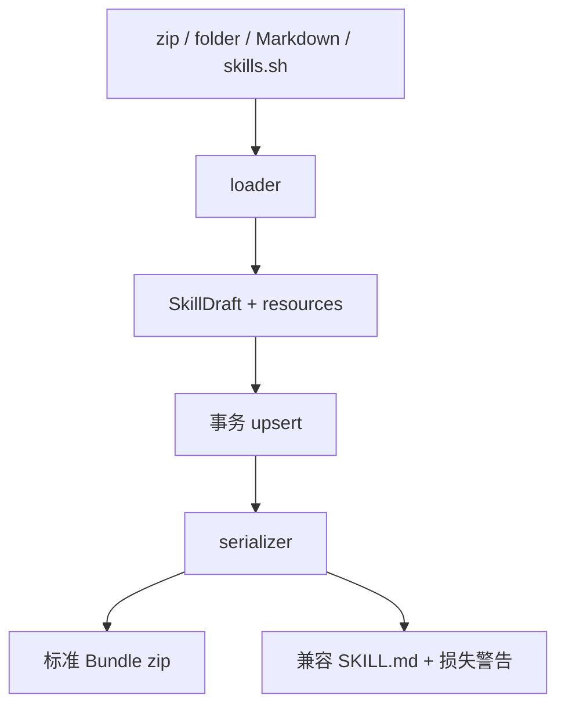

# Bundle 导入与导出

<Status variant="stable">对称的 zip loader 与 serializer</Status>

<TLDR>
  Cognia 可把 zip、本地文件夹、Markdown、native Skill、Marketplace 快照或 skills.sh 文件集导入为一个 `SkillDraft` 加资源。标准导出会生成真实的 Bundle zip；兼容导出只写 `SKILL.md`，并在省略文件前明确警告。
</TLDR>

## 解析与兼容

`lib/claude/skills-io.ts` 实现 Agent Skills frontmatter：

- `name` 作为可移植 slug；Cognia 显示名称从 `metadata.cognia.display-name` 恢复。
- 可移植导出要求 `description`。
- `compatibility` 最多 500 字符。
- `metadata` 只接受字符串键和值。
- `allowed-tools` 导出为空格分隔字符串，导入兼容数组、逗号、空白与换行。

Cognia 把 `author`、`version`、`category`、`tags`、inline 资源路径、显示名称和调用策略放入 `metadata`。序列化时，已知且经过编辑的字段优先；未知 YAML 字段保存在 `frontmatterExtensions` 中，并保留其 YAML 值语义。

Claude 的 `disable-model-invocation` 和 Codex 的 `allow_implicit_invocation` 会映射为 `invocationPolicy`。其他 Claude 激活字段只做保留，不会自动获得 Cognia 运行时行为。

## Codex YAML

存在 `agents/openai.yaml` 时，loader 会解析 interface、policy 与 dependency 提示，同时把原文存入 `codexOpenAiYaml`。Dependencies 可以查看和导出；Cognia 不会自动安装 MCP server，也不会扩大 MCP 权限。编辑虚拟 YAML 文件时要求合法 YAML 且根节点为 mapping；同步已知 policy 字段时，未知 mapping 仍会保留。

## 标准导出

`lib/skills/bundle/serializer.ts` 写出：

```text
<slug>/SKILL.md
<slug>/agents/openai.yaml
<slug>/scripts/...
<slug>/references/...
<slug>/assets/...
```

base64 资源会恢复为二进制 bytes。单个 Skill 下载为 `<slug>.zip`；批量导出为一个按日期命名的 zip，每个 Skill 占一个根目录。目录冲突或 portability 错误会在保存文件前阻止导出。

serializer 与 loader 复用 JSZip 和现有二进制保存桥。load → export → load 后，正文、资源路径与 bytes、inline 标记、标准 metadata、未知 frontmatter 和 Codex YAML 语义保持一致。

## 兼容 Markdown 导出

详情菜单继续保留单文件 Markdown 导出。当 resources 或 `agents/openai.yaml` 会被省略时，确认对话框会先列出损失内容。需要可移植且无损的包时应使用 Bundle 导出。

## 持久化语义

导入暂存把 canonical Bundle 交给 `upsertSkillByCanonicalId`。资源替换和 Skill 行更新处于同一事务中。`resources: undefined` 表示保留资源，`resources: []` 表示清空。skills.sh 复用同一路径，并把 `agents/openai.yaml` 识别为供应商配置，而不是普通 asset。


