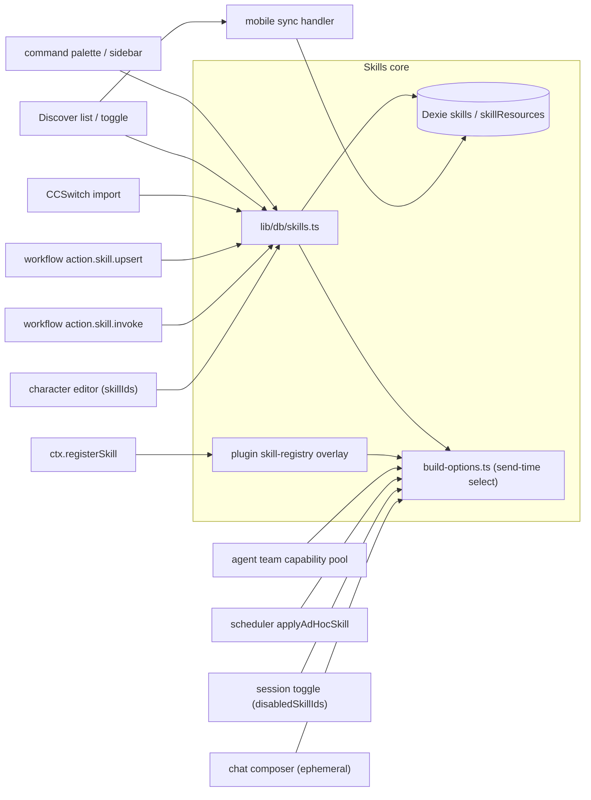

# 消费面

<Status variant="stable">集成地图——10 个消费面消费 skills 表与桥接层</Status>

<TLDR>
  在“设置 → 技能”之外，有十个消费面读取或写入 `skills` Dexie 表（以及插件
  skill-registry 叠加层）。两个**聊天**消费面在每次发送时附加技能（临时选择器），并按会话
  禁用它们（`disabledSkillIds`）。**角色编辑器**通过一个真正的多选控件绑定一份持久的 `skillIds` 集合。
  **工作流节点**负责解析（`action.skill.invoke`）与编写（`action.skill.upsert`）技能。
  **调度器**把一个临时技能加上逐任务禁用拼接到同一条 `resolveSendOptions` 管线上。
  **CCSwitch** 是第二个导入器；**发现页（Discover）**负责列出 + 切换 + 同步；
  **命令面板 / 侧栏**路由到管理器；**插件**贡献叠加层技能；**智能体团队**解析逐队友的能力池；
  而**移动端同步处理器**把整张表送到设备。所有读取路径都汇聚到 `lib/db/skills.ts`
  与 `lib/claude/build-options.ts` 中的发送时选择逻辑。
</TLDR>



## 聊天 composer（输入框）（临时附加）

`components/chat/skill-picker.tsx:28` 是一个基于 `listSkills()`（`:30`）的多选 `CommandDialog`，
过滤到已启用、非内置的行（`:31`），并通过 `onChange` 切换 id（`:33-35`）。所选项会以可移除的
chips 形式渲染在输入框上方，经由 `components/chat/composer/skill-chip-row.tsx:19`，它用
`listSkillsByIds(ids)`（`:22`）解析名称，并为每个 chip 暴露一个移除按钮（`:32-41`）。
`composer.tsx` 为当前草稿挂载 `SkillChipRow`。

所选 id 存放在聊天 store 的 `ephemeralSkillIds` 中，且只被消费一次——它们会被折叠进本次发送，
并在消息发出后清空（发送时的折叠见
[加载与注入](./loading-and-injection)）。

## 会话开关（按会话的持久禁用）

`components/chat/chat-header.tsx:128` 用 `useSkillsByIds(character?.skillIds)` 读取当前角色绑定的技能，
并从 `session.disabledSkillIds` 读取逐会话的禁用集合（`:129-132`）。当角色拥有技能时，
header 会渲染一个 `SkillsBadge`（`:433`），其 `onToggle` 会在 `disabledSkillIds` 中增删一个 id，
并用 `updateSession` 持久化它（`:437-444`）：

```tsx title="components/chat/chat-header.tsx:437"
onToggle={async (skillId, nextDisabled) => {
  const current = new Set(session.disabledSkillIds ?? [])
  if (nextDisabled) current.add(skillId)
  else current.delete(skillId)
  await updateSession(session.id, { disabledSkillIds: [...current] })
}}
```

被禁用的 id 是一种软静音：技能仍绑定在角色上，但在发送时会被过滤掉。

## 角色编辑器

`components/settings/characters-section.tsx:189` 用 `useLiveQuery(listSkills())` 加载目录，
并以 `skillsCatalog` 向下传递。编辑对话框从 `character.skillIds` 为表单 `skillIds` 设定初值
（`:707`，类型 `EditingCharacter` 见 `:1317`），并渲染一个**真正的选择器**——一个 `ItemMultiSelect`，
其 `selectedIds`/`onChange` 驱动绑定集合：

```tsx title="components/settings/characters-section.tsx:1890"
<ItemMultiSelect
  label={tEditor("skills")}
  helpText={tEditor("skillsHint")}
  items={skillsCatalog.map((sk) => ({ id: sk.id, name: sk.name, description: sk.description }))}
  selectedIds={s.skillIds}
  onChange={(ids) => setS({ ...s, skillIds: ids })}
/>
```

列表行展示一份只读摘要——技能数量加上前几个名称——位于 `:744-748` / `:904-907`。

<Callout type="info" title="角色 → 技能的绑定已完全打通">
  本子系统早期的草稿只持久化 `skillIds` 而没有 UI 控件。这个缺口已经补上：编辑对话框
  搭载了上面的 `ItemMultiSelect`，而绑定集合正是 `resolveSendOptions` 在每一轮读取的内容
  （交互式、计划任务和队友派发皆然）。这里没有休眠字段。
</Callout>

## 工作流节点

`lib/workflow/nodes/built-ins.ts` 注册了两个技能节点；它们的检查器 schema 位于
`lib/workflow/nodes/params-schemas.ts`。

**`action.skill.invoke`（`built-ins.ts:744`）** 把一个逗号分隔的 `skillIds` 参数（`:747`）解析为
一段拼接后的 markdown 正文，供下游 AI 节点拼接进 `systemPrompt`。空列表会返回空结果而非抛错
（`:752-754`）；在 Dexie 表里命不中的 id 会经由 `getPluginSkill` 回退到插件叠加层（`:771`）。
它会尽力记录使用情况，以便管理器的“最近”排序更新（`:781`）：

```ts title="lib/workflow/nodes/built-ins.ts:779"
const markdown = resolved.map((s) => `### ${s.name}\n\n${s.markdown}`).join("\n\n")
void recordSkillUsage(ids).catch(() => undefined)
return { output: { skills: resolved.map((s) => ({ id: s.id, name: s.name })), markdown } }
```

**`action.skill.upsert`（`built-ins.ts:918`）** 让工作流以幂等方式保持一个技能同步：带 `skillId` 时
它会经由 `updateSkill`（`:928-940`，当 id 未知时抛出不可重试错误）补丁一个已有行；不带时
它要求提供 `name` + `content`（`:942`），并经由 `createSkill`（`:947`）创建。

## 调度器

技能式的计划任务与交互式聊天达到完全对等。在解析之前，执行器会把任意逐任务的 `disabledSkillIds`
拼接到一个合成的会话克隆上，从而让 `resolveSendOptions` 直接读取它们
（`lib/scheduler/executors/index.ts:378-383`）。解析之后，它会用 `applyAdHocSkill`（`:306`，在 `:403` 调用）
在角色自身集合之上追加一个**临时**技能：

```ts title="lib/scheduler/executors/index.ts:311"
const skills = await listEnabledSkillsByIds([skillId])
if (skills.length === 0) return base
out.systemPrompt = renderSkillsSection(skills) // spliced onto resolved prompt
out.allowedTools = unionStrings(out.allowedTools, skills.flatMap((s) => s.allowedTools ?? []))
```

效果是：一次计划运行会得到与 composer（输入框）本会产生的相同的角色技能、会话禁用，
以及一个额外的任务范围技能。

## CCSwitch 导入

`components/settings/ccswitch/tabs/skills-tab.tsx:26` 列出 CCSwitch 的技能表
（`useCcswitchStatus` 在 `:29`，`useCcswitchSkills` 在 `:30-35`）。它只默认选中**内联**行——
外部文件行（正文存于磁盘上，`content` 为空）会被标记且不可选（`:42-45`）。提交时会调用
`importCcswitchSkills(importable)`（`:67`）并打印一份摘要（`:69-73`）。

`lib/ccswitch/import.ts:138` 经由 `createSkill`（`:165`）把每个 `CcswitchSkill` 映射为一个全新的行，
并跳过外部文件行与名称冲突（`:153-163`）。数据经由 `ccswitchListSkills` → `ccswitch_list_skills`
（`lib/ccswitch/client.ts`）跨越 Tauri 边界，其形状为
`CcswitchSkill { id, name, description?, content, sourcePath? }`（`types/ccswitch/content.ts`）。

该标签页仅限桌面端——web 模式下改为显示一个 `SettingsAlert`（`skills-tab.tsx:80-84`）。

## 发现页（Discover）

`hooks/discover/use-discover-query.ts:115` 为 `"skills"` 分类与收藏视图订阅 `listSkills()`。
过滤/排序分支保留了一个仅启用选项（`status !== "disabled"`，`:195`），并按字母顺序排序（`:196`），
发射 kind 为 `"skill"` 的 `DiscoverItem` 行（`:197`）。网格使用 `emptySkills` 空态键
（`components/discover/discover-grid.tsx:42`），该分类注册在 `lib/discover/categories.ts:55`
（Sparkles 图标，`agents` 分组）。

检查器会把一个技能项路由到 `SkillInspector`（`discover-inspector.tsx:128` / `:201`）。它的开关
经由 `setSkillStatus`（`:206`）翻转状态，**并**入队一条出站移动端同步命令，使变更传播到设备
（`:207-211`）：

```tsx title="components/discover/discover-inspector.tsx:204"
const onToggle = (next: boolean) => {
  void setSkillStatus(skill.id, next ? "enabled" : "disabled")
  void enqueue({ command: "skill_set_enabled", payload: { id: skill.id, enabled: next }, label: ... })
}
```

## 命令面板与侧栏

`components/desktop/command-palette.tsx:268` 添加了一条“管理技能”命令，路由到技能设置区段
（`handleSettings("skills")`）。外壳侧栏暴露同一个去向——`skills` 图标映射在
`lib/shell/sidebar-nav.ts:42`，且发现页分类元数据携带了 `skills` 条目
（`lib/discover/categories.ts:55`）。两者都是纯导航，并非数据消费者。

## 插件

搭载 `skills` 能力的插件会调用 `ctx.registerSkill(def)`（`lib/plugin/core/context.ts:742`），
它写入叠加层注册表（`lib/plugin/registries/skill-registry.ts:19`，构建于
`createOverlayRegistry` 之上）。停用时管理器会调用 `unregisterSkillsByPlugin(pluginId)`，一次性
丢弃该插件贡献的每一个技能。叠加层技能**不在** Dexie 中——它们在发送时经由 skills 桥接层解析，
在冲突时插件 id 会胜过 Dexie 行（见
[加载与注入](./loading-and-injection)）。

角色包以间接方式贡献技能：`defineCharacterPack`（`lib/plugin/sdk/define-character-pack.ts`，
ADR-0030）叠加角色，其自身的 `skillIds` 会被 `resolveSendOptions` 尊重，因此一个包角色拉入技能的
方式与一个手工编写的角色完全相同。

## 智能体团队

每个队友都会得到一个延迟计算的能力池。`team-run-context.ts:64` 持有一个
`resolvedCapabilities` 映射（skills + MCP + 原生工具 + 角色 + 子智能体 + a2ui），在首次派发时
由 `resolveTeammateCapabilities`（注释 `:57-62`）填充。由于队友派发会经过
`resolveSendOptions`，一个队友角色绑定的 `skillIds` 会与在交互式聊天中完全一样地生效
（人格解析——系统提示词、模型、允许的工具、技能、MCP——记于
`lib/ai/agent/agent-executor.ts:88-89`）。

## 移动端同步

`lib/sync/handlers/skills.ts:8` 导出 `syncSkills(transport, cursor)`，在统一的 Dexie-sync 传输上
注册 `skills` 表，从而让行随之搭乘到移动端外壳：

```ts title="lib/sync/handlers/skills.ts:8"
export function syncSkills(transport: Transport, cursor: SyncCursor): Promise<SyncOutcome> {
  return runSyncHandler<Skill>({ table: "skills", getTable: () => getDb().skills }, transport, cursor)
}
```

出站状态变更由发现页检查器入队（`skill_set_enabled`，见上文），因此在桌面端做出的切换会在
设备上得到对账。

## 备份 / 导出与外部智能体

还有另外两个触点以同一份数据为给养：

- **备份域**——传输清单暴露单个 `skills` 域，它**仅导出用户技能 +
  其资源**，在内存中过滤掉内置项（`lib/data/domain/index.ts:128-137`）。详见
  [数据模型](./data-model)。
- **外部智能体**——外部 CLI 指令栈经由 `buildProgressiveSkillsPrompt`
  （`lib/ai/instructions/external-agent-instruction-stack.ts:122-124`）为
  Codex / Claude Code / Gemini 构建一份渐进式技能提示词，而 Codex 磁盘镜像会同步到
  `~/.agents/skills`。见
  [加载与注入](./loading-and-injection)与[原生同步与安全](./native-sync-and-security)。

## ADR 交叉引用

| ADR | 主题 |
| --- | --- |
| [0026 — Built-in skills & lark CLI bridge](../../adr/0026-builtin-skills-and-lark-cli-bridge) | 技能子系统的基础与内置种子 |
| [0011 — Workflows subsystem](../../adr/0011-workflows-subsystem) | 技能节点注册进的节点运行时 |
| [0034 — Workflow editor completeness & plugin parity](../../adr/0034-workflow-editor-completeness-and-plugin-parity) | 节点检查器 schema 与插件节点对等 |
| [0022 — Agent team runtime hardening](../../adr/0022-agent-team-runtime-hardening) | 队友派发与能力解析 |
| [0032 — Agent team plugin integration](../../adr/0032-agent-team-plugin-integration) | 逐队友的插件能力池 |
| [0027 — Mobile offline & discovery](../../adr/0027-mobile-offline-and-discovery) | 发现页消费面与移动端同步传输 |

## 相关页面

<Cards>
  <Card title="技能概览" href="./index" description="什么是技能，以及子系统是如何组织的。" />
  <Card title="加载与注入" href="./loading-and-injection" description="临时、会话、角色、插件与外部智能体技能在发送时汇聚之处。" />
  <Card title="可视化工作流" href="../visual-workflows/index" description="action.skill.invoke / upsert 背后的节点运行时。" />
  <Card title="插件系统" href="../plugin-system/index" description="插件如何注册叠加层技能与角色包。" />
</Cards>
