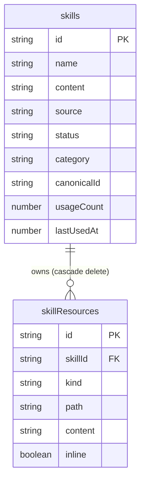
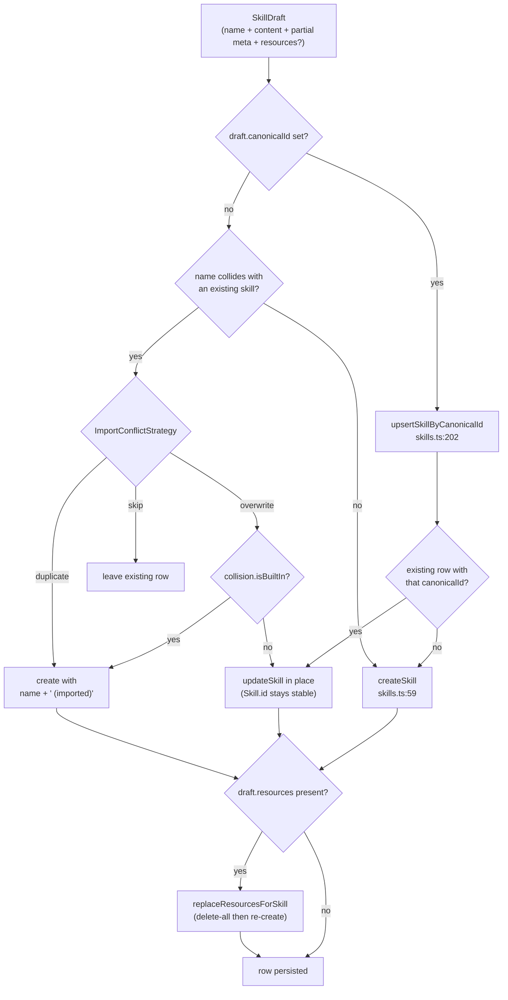

# 数据模型

<Status variant="stable">核心数据层 — lib/claude/types.ts · lib/db/skills.ts · Dexie v8 tables</Status>

<TLDR>
  一个技能就是一行 IndexedDB 记录（`Skill`，`lib/claude/types.ts:2362`），外加零个或多个随附文件
  （`SkillResource`，`types.ts:2441`），存放在一张同级表中。两者都位于 Dexie **v8**（`lib/db/schema.ts:461`）
  声明的 `skills` / `skillResources` 存储区中。所有写入都经由
  `lib/db/skills.ts`：`createSkill:59` / `updateSkill:91` / `deleteSkill:98` 会级联处理资源；
  `upsertSkillByCanonicalId:202` 是幂等的重新导入路径。五个只读内置技能会惰性种子注入
  （`seedBuiltInSkills:344`），使用遥测在
  `lib/claude/build-options.ts:402` 处以「发后即忘」方式累加，而备份仅导出用户记录（`lib/data/domain/index.ts:128`）。
</TLDR>

## 两种行类型

一个技能是**纯 markdown** 加元数据；在本版本中它没有任何文件系统副作用。其正文在发送时会原样
追加到一个 `## <name>` 标题之下（`renderSkillsSection`，`skills.ts:339`）。资源
则是一个可选的脚本、引用和素材包，内联存储在 IndexedDB 中。

```ts
// lib/claude/types.ts:2362 — abridged
export interface Skill {
  id: string
  name: string
  content: string                  // markdown body, appended under "## <name>"
  allowedTools?: string[]          // unioned with the character's whitelist
  isBuiltIn?: boolean              // back-compat; prefer source === "builtin"
  source?: SkillSource             // default "custom"
  status?: SkillStatus             // default "enabled"; "disabled" hides at send time
  category?: SkillCategory         // default "custom"
  canonicalId?: string             // cross-source identity, e.g. "registry:ai-elements"
  usageCount?: number              // bumped each time the skill is sent
  lastUsedAt?: number              // indexed → drives the "recent" sort
  // ...createdAt, updatedAt
}
```

### Skill 字段

| 字段 | 类型 | 默认值 | 说明 |
| --- | --- | --- | --- |
| `id` | `string` | 生成 | `skill_` 前缀（`skills.ts:9`）；跨多次重新导入保持稳定 |
| `name` | `string` | `"Untitled skill"` | 创建时会被 trim（`skills.ts:63`） |
| `description?` | `string` | — | 显示在管理器 UI 中 |
| `content` | `string` | — | markdown 正文，原样追加到 `## <name>` 之下 |
| `allowedTools?` | `string[]` | — | 发送时与角色白名单取并集 |
| `tags?` | `string[]` | — | 自由格式标签 |
| `isBuiltIn?` | `boolean` | — | 种子注入的内置技能为只读；保留以兼容旧版 |
| `source?` | `SkillSource` | `"custom"` | 相比 `isBuiltIn` 更优先的来源判别字段 |
| `status?` | `SkillStatus` | `"enabled"` | `"disabled"` 在发送时隐藏该技能但不删除 |
| `category?` | `SkillCategory` | `"custom"` | 驱动 UI 侧栏与图标 |
| `version?` `author?` `license?` | `string` | — | SKILL.md frontmatter 元数据 |
| `usageCount?` | `number` | `0` | 分析计数器，未建索引 |
| `lastUsedAt?` | `number` | — | 已建索引，驱动「最近」排序 |
| `validationErrors?` | `SkillValidationError[]` | — | 非致命，来自 `lib/skills/validate.ts` |
| `canonicalId?` | `string` | — | 跨来源身份标识，用于重新导入时去重 |
| `marketplaceSkillId?` | `string` | — | 该行所安装自的市场条目 |
| `nativeDirectory?` | `string` | — | 同步到磁盘时的 `~/.claude/skills/<dir>` |
| `syncOrigin?` | `SkillSyncOrigin` | `"frontend"` | 最近写入该行的来源 |
| `syncFingerprint?` | `string` | — | frontmatter、正文与资源的哈希 |
| `lastSyncedAt?` `lastSyncError?` | `number` / `string null` | — | 同步记账 |
| `createdAt` `updatedAt` | `number` | `Date.now()` | epoch 毫秒 |

### 类型别名（`types.ts:2418`）

| 别名 | 成员 |
| --- | --- |
| `SkillCategory` | creative-design, development, enterprise, productivity, data-analysis, communication, meta, custom |
| `SkillSource` | builtin, custom, imported, generated, marketplace |
| `SkillStatus` | enabled, disabled, error, loading |
| `SkillSyncOrigin` | frontend, builtin, native, marketplace |
| `SkillResourceKind` | script, reference, asset |

### SkillResource（`types.ts:2441`）

一个 `SkillResource` 是随技能捆绑的单个文件：一个 `script`（可执行）、一个 `reference`（markdown/文本
配套），或一个 `asset`（图像、json 或其他任何东西）。文本内联存储；二进制素材存储一段不透明的
base64 负载。

| 字段 | 类型 | 说明 |
| --- | --- | --- |
| `id` | `string` | `skres_` 前缀（`skill-resources.ts:9`） |
| `skillId` | `string` | 所属技能，始终由持久化器设置 |
| `kind` | `SkillResourceKind` | script、reference 或 asset |
| `name` | `string` | 资源管理器中的显示名 |
| `path` | `string` | 相对路径，如 `scripts/foo.sh`；每个技能内大小写不敏感唯一 |
| `content` | `string` | utf-8 文本或 base64 |
| `encoding?` | `"utf-8" \| "base64"` | 默认为 `"utf-8"`（`skill-resources.ts:60`） |
| `mimeType?` `size?` | `string` / `number` | 省略时推导 |
| `inline?` | `boolean` | 为 true 时，正文在发送时内联进系统提示词 |
| `createdAt` `updatedAt` | `number` | epoch 毫秒 |

<Callout type="info" title="校验仅作建议，不是写入门禁">
  `SkillValidationError`（`types.ts:2461`）携带一个 `code` 判别字段 ——
  `missing-name`、`name-too-long`、`name-format`、`missing-content`、`description-too-long`、
  `duplicate-resource-path`、`resource-path-traversal`、`frontmatter-parse`、`unknown`。它们来自
  `lib/skills/validate.ts`，并作为 `validationErrors` 存储在行上；它们都是**非致命的**。写入时
  唯一的硬性门禁是 `createResource` 内部的路径穿越 / 大小写不敏感唯一性检查
  （`skill-resources.ts:38` 与 `:47`）。
</Callout>



## Dexie 表与索引

两个存储区都在 `CogniaDB` 类（`schema.ts:128`）中声明，并首次物化于版本 **8**
（`schema.ts:453`）。当前数据库已到 **v72**（`schema.ts:1815`）；从 9 到 72 之间没有任何版本
改动过这两个索引字符串 —— 它们被原样向前复制。

```ts
// lib/db/schema.ts:461 — the v8 store declaration
skills: "id, name, updatedAt, isBuiltIn, category, source, status, lastUsedAt, canonicalId",
skillResources: "id, skillId, [skillId+kind], [skillId+path], updatedAt",
```

| 存储区 | 主键 | 二级索引 |
| --- | --- | --- |
| `skills` | `id` | `name`、`updatedAt`、`isBuiltIn`、`category`、`source`、`status`、`lastUsedAt`、`canonicalId` |
| `skillResources` | `id` | `skillId`、`[skillId+kind]`、`[skillId+path]`、`updatedAt` |

v8 的 `.upgrade()` 钩子（`schema.ts:467`）会回填旧版行，使新的判别字段始终存在：

```ts
// schema.ts:471 — backfill on upgrade to v8
.modify((row) => {
  if (!row.source) row.source = row.isBuiltIn ? "builtin" : "custom"
  if (!row.status) row.status = "enabled"
  if (!row.category) row.category = row.isBuiltIn ? "meta" : "custom"
  if (typeof row.usageCount !== "number") row.usageCount = 0
})
```

<Callout type="warn" title="isBuiltIn 已建索引但在内存中过滤">
  IndexedDB 无法可靠地对布尔值建索引，因此尽管 `isBuiltIn` 出现在索引字符串中，
  每一处「仅用户技能」过滤都是在内存中完成的 —— 见 `inferSource`/`inferCategory`（`skills.ts:174`）和
  备份域（`lib/data/domain/index.ts:130`）。请将 `isBuiltIn` 索引视为描述性的，而非可查询的。
</Callout>

## CRUD 层

`lib/db/skills.ts` 是唯一的写入面。`SkillDraft`（`skills.ts:27`）是每个
创建器/导入器接收的输入形态：`Pick<Skill, "name" | "content">` 加上元数据的 `Partial`，再加一个可选的
`resources?` 包，其 `skillId` 由持久化器填入。

| 函数 | 行号 | 行为 |
| --- | --- | --- |
| `listSkills` | 13 | 全部行，按 `name` 排序 |
| `getSkill` / `listSkillsByIds` | 17 / 21 | 单条 / 批量获取 |
| `createSkill` | 59 | 生成 `id`，默认 source/status/category，级联 `replaceResourcesForSkill` |
| `updateSkill` | 91 | 打补丁 + 更新 `updatedAt`；不能改动 `id`、`createdAt`、`isBuiltIn` |
| `deleteSkill` | 98 | 对内置技能抛错；先级联删除资源 |
| `duplicateSkill` | 109 | 追加 `" (copy)"`，重置为 `custom` 来源，清空所有同步字段 |
| `setSkillStatus` | 139 | 切换 enabled/disabled（内置技能可被禁用，但不可删除） |
| `recordSkillUsage` | 147 | 事务性的 `usageCount++` 与 `lastUsedAt`，发后即忘 |
| `listEnabledSkillsByIds` | 168 | 仅 `status === "enabled"`（或 undefined，向后兼容） |
| `upsertSkillByCanonicalId` | 202 | 幂等地按 canonicalId 查找，然后就地更新或创建 |
| `bulkImportSkills` | 257 | 带名称冲突策略的批量导入 |
| `renderSkillsSection` | 339 | 将所选技能拼接进系统提示词后缀 |
| `seedBuiltInSkills` | 344 | 幂等的首次运行种子注入器 |

### 从 draft 到行的生命周期



### 按 canonicalId 的幂等重新导入

`upsertSkillByCanonicalId`（`skills.ts:202`）是市场安装与捆绑包导入共享的接缝。它
按 `canonicalId` 查找该行，要么就地更新它 —— 保持 `Skill.id` 稳定，从而让
`TeamCapabilityBundle.skillIds` 和工作流节点引用在重新导入后依然有效 —— 要么创建一个新的。当 draft
携带 `resources` 时，会通过 `replaceResourcesForSkill` 重写资源集合（先全删再重建，
`skill-resources.ts:114`），与捆绑包加载器「zip 里有什么，Dexie 里就存什么」的规则一致。

```ts
// skills.ts:208 — find by canonicalId, update in place keeping id stable
const existing = (await db.skills.toArray()).find((s) => s.canonicalId === canonicalId)
if (existing) {
  await updateSkill(existing.id, { /* ...merged draft, canonicalId */ })
  if (draft.resources) await replaceResourcesForSkill(existing.id, draft.resources)
  const refreshed = await db.skills.get(existing.id)
  return { skill: refreshed ?? existing, created: false }
}
const created = await createSkill({ ...draft, canonicalId })
return { skill: created, created: true }
```

`bulkImportSkills`（`skills.ts:257`）会把任何带 `canonicalId` 的 draft 委派给该路径（`skills.ts:280`）；
只有没有 canonical 的 draft 才走名称冲突 `ImportConflictStrategy`（`skills.ts:240` ——
`skip | duplicate | overwrite`）。对内置技能执行 overwrite 是被禁止的，会静默回退到
`duplicate` 路径并带上 `" (imported)"` 后缀（`skills.ts:301`、`:320`）。

## 内置技能种子注入

`seedBuiltInSkills`（`skills.ts:344`）种子注入五个只读技能且是幂等的：重新运行时它会保留
用户的 `status` 开关、`usageCount`、`lastUsedAt` 和 `createdAt`，同时从随附副本中刷新 `content`/`category`
（`skills.ts:418`）。

| id | name | category | tag |
| --- | --- | --- | --- |
| `skill_builtin_concise` | Concise answers | communication | style |
| `skill_builtin_step_by_step` | Step-by-step reasoning | meta | reasoning |
| `skill_builtin_cite` | Cite sources | meta | accuracy |
| `skill_builtin_code_review` | Code review checklist | development | engineering |
| `skill_builtin_plain_english` | Plain-English explainer | communication | style |

种子注入每进程惰性运行一次，经由 `seedBuiltIns`（`lib/db/seed.ts:19`）从 `getDb()` 触发，与
角色、预设、工作流模板和目标模板并行进行。因为种子使用稳定 id 与 `put`，重新种子注入
绝不会产生重复行。

## 备份与导出

传输清单暴露单个 `skills` 域（`lib/data/domain/index.ts:128`）。它**仅导出用户
技能** —— 内置技能在内存中被过滤掉（`!s.isBuiltIn`，`index.ts:132`）—— 外加属于这些用户 id 的
`skillResources`。内置技能在导入时会在本地重新种子注入，因此它们绝不会出现在文件中。该域的
默认导入策略是 `"skip"`。

```ts
// lib/data/domain/index.ts:131 — booleans filtered in memory, resources scoped by id
const userSkills = allSkills.filter((s) => !s.isBuiltIn)
const userIds = userSkills.map((s) => s.id)
const resources = allResources.filter((r) => userIds.includes(r.skillId))
return { skills: userSkills, skillResources: resources }
```

## 使用遥测

`recordSkillUsage`（`skills.ts:147`）在单个 `rw` 事务内累加 `usageCount` 并戳上 `lastUsedAt`。它
以发后即忘方式从发送时路径被调用 —— `build-options.ts:402`，紧接在
`listEnabledSkillsByIds` 选出要注入的内容之后（`build-options.ts:396`）：

```ts
// lib/claude/build-options.ts:396 — select enabled skills, then record usage
skills = await listEnabledSkillsByIds(wantedIds)
// ...
void recordSkillUsage(skills.map((s) => s.id)).catch(() => undefined)
```

`lastUsedAt` 已建索引（驱动管理器的「最近」排序）；`usageCount` 未建索引，仅由
分析标签页读取。

<Callout type="info" title="插件技能在单独的表中追踪使用情况">
  第一方 `Skill` 行与插件提供的技能是相互独立的。插件技能的使用情况记录在一张
  并行存储区 `pluginSkillUsage` 中（在 Dexie v37 加入，`schema.ts:1212`；CRUD 在
  `lib/db/plugin-skill-usage.ts`），以 `pluginSkillId` 为键。这两类技能在发送时的选择与注入
  都在 [Loading and injection](./loading-and-injection) 中讲解。
</Callout>

## 相关

<Cards>
  <Card title="技能概览" href="./index" />
  <Card title="加载与注入" href="./loading-and-injection" />
  <Card title="捆绑包导入" href="./bundle-import" />
  <Card title="存储与备份" href="../../data/storage" />
</Cards>
