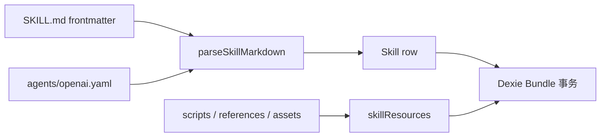

# 数据模型

<Status variant="stable">可移植 Agent Skills 模型 · Dexie v154</Status>

<TLDR>
  `Skill.name` 是可本地化的显示名称，`Skill.slug` 是稳定的 Agent Skills `name` 和 Bundle 目录。标准字段、Cognia metadata、未知 frontmatter 与原始 Codex YAML 分开存储，导入和导出时不会混淆显示身份与可移植身份。
</TLDR>

## Skill 身份与字段

公共行类型位于 `packages/agent-config-types/src/index.ts`。可移植能力新增以下字段：

| 字段 | 用途 |
| --- | --- |
| `slug` | 1–64 字符的 lowercase kebab-case 可移植名称 |
| `compatibility` | 运行时或环境要求，最多 500 字符 |
| `metadata` | Agent Skills 字符串键值 metadata |
| `invocationPolicy` | `implicit` 或 `explicit` |
| `frontmatterExtensions` | Cognia 未建模字段的 YAML 值 |
| `codexOpenAiYaml` | 原始 `agents/openai.yaml` 文本 |

`name` 继续作为用户可见名称，可包含非 ASCII 字符。现有 ID、角色引用、启用状态和 native 目录都不会从 slug 重新生成。

## 迁移

Dexie v154 在不增加索引的前提下回填 `slug`。行按 `createdAt`、`id` 的稳定顺序处理，候选优先级为：

1. 合法的 `nativeDirectory` basename；
2. 已存在且合法的 slug；
3. 显示名称的规范化结果；
4. `skill-` 加 ID 后缀。

冲突项依次追加 `-2`、`-3`，并保持不超过 64 字符。迁移幂等，且不会重命名外部目录。

## 校验级别

`lib/skills/validate.ts` 为每个问题分配级别：

- `runtime`：正文缺失、资源路径穿越或路径重复；阻止加载或保存。
- `portability`：description 缺失、slug 非法、目录名不匹配、metadata 非法或长度超限；阻止标准 Bundle 导出，但不会自动停用旧行。
- `warning`：不会阻止持久化或运行的兼容性提示。

从 Skills 表单新建的行必须通过 runtime 与 portability 校验。宽容导入会保留旧数据，并把 portability 问题写入行中供用户修复。

## 事务持久化

`lib/db/skills.ts` 把一条 Skill 行及其 `skillResources` 视为一个 Bundle。创建、canonical upsert、覆盖、复制与删除都在同时覆盖两个 store 的 Dexie 事务中执行。省略 `resources` 表示保留现有资源；显式传空数组表示清空。批量导入按 Skill 独立提交，因此单个失败不会回滚其他成功项。

复制会带上 metadata、Codex YAML、扩展字段和全部资源，再生成新的显示名称和无冲突 slug。编辑已同步行会清除 `syncFingerprint`；下一次用户显式 push 时才安全迁移 native 目录及 mirrors。

## 相关页面

<Cards>
  <Card title="Bundle 导入与导出" href="./bundle-import" />
  <Card title="加载与注入" href="./loading-and-injection" />
  <Card title="创作与工作台" href="./authoring-and-workbench" />
</Cards>
