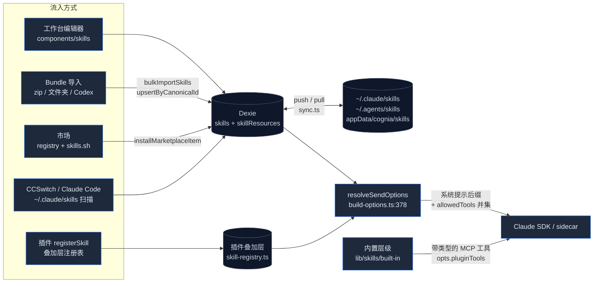

# Skills 子系统

<Status variant="stable">稳定 · skills + skillResources 表自 Dexie v8 起（DB v72） · ADR-0026 内置层级处于 schema v43</Status>

<TLDR>
  一个**技能**是一行 `SKILL.md` 形态的记录——名称、Markdown 正文、可选的 `allowedTools`，外加打包的
  `scripts/` / `references/` / `assets/` 资源。浏览器端的事实来源是 Dexie
  （`lib/db/skills.ts`）；其余一切都是流入或流出该表的管道：一个 **bundle 导入器**
  （`lib/skills/bundle/loader.ts:65`），用于 zip / 文件夹 / OpenAI-Codex 布局；一个**双来源
  市场**（`skills-lock.json` 注册表 + skills.sh 目录）；一个**三目标原生同步**
  （`lib/skills/sync.ts:145` → `skills_install_mirrored` 写入 cognia / `~/.claude/skills` /
  `~/.agents/skills`）；以及**发送时注入器**（`lib/claude/build-options.ts:378`），它将
  已启用的技能追加到系统提示，并对它们的 `allowedTools` 取**并集**。一个独立的 ADR-0026 层级——
  `lib/skills/built-in/`——将 40 个带类型的 Lark 技能作为**agent 工具**暴露出来，带有 PII、白名单和
  HITL 门控；它们从不触及 Dexie 表。
</TLDR>

<StatGrid>
  <Stat label="源文件" value="100+" hint="lib/skills (61) + components/skills (40+) + stores/skills + hooks/skills + src-tauri/src/skills (7 Rust)" />
  <Stat label="Dexie 表" value="2" hint="skills + skillResources——在 v8 引入，索引字符串直到 v72 保持不变" />
  <Stat label="Tauri 命令" value="13" hint="scan / install_mirrored / trash / registry / 远程拉取 / 安全扫描——lib/claude/ipc.ts:381-440" />
  <Stat label="导入路径" value="5" hint="markdown 文件 · zip bundle · 文件夹 · Claude Code 扫描 · 发现——skill-panel-toolbar.tsx" />
  <Stat label="市场来源" value="2" hint="注册表（skills-lock.json，6 条目）+ skills.sh 目录（匿名搜索/安装；可选的 skillsShToken 解锁排行榜）" />
  <Stat label="内置工具技能" value="40" hint="ADR-0026 层级——6 个 Lark 家族，读取/写入/破坏性，HITL 确认卡片" />
  <Stat label="安全扫描规则" value="9" hint="建议性正则扫描——src-tauri/src/skills/scanner.rs:60" />
</StatGrid>

在本代码库中，有两个截然不同的东西都叫"技能"，本章节将它们严格区分开来：

1. **提示技能**——Dexie 记录，其 Markdown 正文在发送时被追加到系统提示。
   在工作台中编写、导入、同步，并在市场上销售。它们*从不被执行*。
2. **内置工具技能**——经过代码评审的 TypeScript 模块（`lib/skills/built-in/`），注册为
   MCP 形态的工具供模型*调用*，以六道门控的分发器封装 `lark-cli`。ADR-0026。

内置层级的原始设计理据见
[ADR-0026](../../adr/0026-builtin-skills-and-lark-cli-bridge)；提示技能
一侧则是有机生长起来的，在此按模块逐一对照当前实现进行记录。

## 它的代码位置

```
lib/skills/
  validate.ts            # 纯校验器——名称模式、长度、资源路径
  categories.ts          # 8 个类别 + 图标 + i18n 键
  templates.ts           # 创建编辑器的 4 个起始模板
  batch-tags.ts          # 批量操作栏的标签集合操作
  ai-prompts.ts          # optimize / simplify / expand / fixErrors AI 辅助提示
  export-toast.ts        # 带 toast 反馈的每技能 SKILL.md 导出
  executor.ts            # buildProgressiveSkillsPrompt + executeSkill 桩
  sync.ts                # push / pull 引擎、SHA-256 指纹、3 个镜像目标
  marketplace-*.ts       # 类型 · 注册表适配器 · skills.sh 适配器 · 安装
  skillssh-*.ts          # skills.sh：CORS 路由 http · 多文件安装 · 更新检查 · 从 URL 安装
  bundle/                # loader · walk-zip · walk-folder · classify · parse · codex-yaml · limits
  built-in/              # ADR-0026 层级：types · registry · manifest · dispatcher · lark/（40 个技能）

lib/db/skills.ts         # Dexie CRUD + SkillDraft + upsertByCanonicalId + renderSkillsSection + seeding
lib/db/skill-resources.ts# skillResources CRUD（replaceResourcesForSkill）
lib/claude/skills-io.ts  # serializeSkill / parseSkillMarkdown / resolveSkillMarkdown（插件来源）
lib/claude/skills-bridge.ts # 在发送时合并 Dexie 技能与插件叠加层技能
lib/claude/build-options.ts # 发送时热路径（ids → filter → render → union tools）

components/skills/       # 工作台：panel · 列表窗格 · 详情 · 编辑器 · Monaco 工作区 · 市场
stores/skills/skills-store.ts  # Zustand UI 状态（标签页、过滤器、选择、编辑器工作区）
hooks/skills/            # use-skill-shortcuts · use-skill-sync · use-skill-marketplace · use-skill-ai
app/skills/page.tsx      # 挂载 SkillPanel 的轻量路由

src-tauri/src/skills/    # native.rs · install.rs · registry.rs · remote.rs · scanner.rs · types.rs
skills-lock.json         # 打包的市场注册表（仓库根目录，手动维护）
```

## 生命周期一览



## 章节地图

| 页面 | 涵盖内容 |
| --- | --- |
| [数据模型](./data-model) | `Skill` / `SkillResource` 类型、Dexie v8 索引、`SkillDraft`、`upsertSkillByCanonicalId`、5 个内置种子提示技能、备份域、使用遥测 |
| [编写与工作台](./authoring-and-workbench) | `validate.ts` 规则、8 个类别、4 个模板、AI 辅助、主从式面板、Monaco 多文件编辑器工作区、批量操作、键盘快捷键 |
| [Bundle 导入](./bundle-import) | 对 zip / 文件夹的 `loadBundle`、资源分类、限制（200 MB zip · 50 个资源 · 16 MB web / 2 MB 磁盘）、OpenAI-Codex `agents/openai.yaml` 附属文件、暂存对话框 |
| [原生同步与安全](./native-sync-and-security) | SHA-256 指纹 push/pull、冲突规则、三个镜像目标 + 回收站、全部 13 个 Tauri 命令、9 规则的建议性安全扫描器 |
| [市场](./marketplace) | `skills-lock.json` 注册表 vs skills.sh 目录、匿名搜索/下载/审计 + 可选的 token 解锁排行榜、CORS 路由传输、多文件安装 + 内容哈希、更新检测、从 URL 安装、Dexie v78 SkillsMP 迁移 |
| [内置技能（ADR-0026）](./built-in-skills) | 带类型的工具层级：注册表、manifest 过滤链、六道门控分发器、40 个 Lark 技能、lark-cli 执行 + 认证桥、HITL 确认卡片往返 |
| [加载与注入](./loading-and-injection) | 发送时热路径：id 收集、三重启用过滤、系统提示节区顺序、`allowedTools` **并集**、插件技能桥、容器技能 |
| [消费面](./consumption-surfaces) | 编写器 chip、会话开关、角色编辑器、工作流节点、调度器、CCSwitch、Discover、插件、团队、移动端同步 |

## 关键不变量

- **技能是提示后缀，不是程序。** Cognia 中没有任何东西会执行技能的 `scripts/`；
  安全扫描器（`scanner.rs:16`）是针对你可能在*别处*运行的脚本的保存前卫生检查，
  它从不阻止保存。
- **`allowedTools` 是并集。** 角色 ∪ 每个激活的技能 ∪ 插件技能 ∪ agent 模式
  （`build-options.ts:823-836`）。如果无人声明任何内容，该字段被省略，于是 SDK
  默认值（一切）生效。旧文档曾描述为交集——那从来不是实际发布的行为。
- **`canonicalId` 是身份主轴。** 市场安装、bundle 重新导入和卸载
  全部汇聚到 `upsertSkillByCanonicalId`（`lib/db/skills.ts:202`），它保持 `Skill.id`
  稳定，从而让会话引用和工作流节点在重新安装后得以存续。
- **内置项有两种互不相关的形态。** 5 个种子 Dexie 记录（`skill_builtin_*`）是
  无法删除的普通提示技能；40 个 ADR-0026 技能是工具，且从不
  出现在 `skills` 表中。
- **Web 模式只会降级，从不崩溃。** 同步、安全扫描、文件夹导入和注册表 IPC
  都是仅桌面端的；工作台会回退到打包的 JSON 并禁用相应按钮。

## 相关

<Cards>
  <Card title="聊天、角色、技能与团队" href="../../chat/chat-and-skills" description="角色在何处引用 skillIds、会话又在何处切换它们。" />
  <Card title="内置 agent" href="../../chat/built-in-agent" description="接收渲染后的系统提示和 pluginTools 流的运行时。" />
  <Card title="插件系统" href="../plugin-system" description="插件通过叠加层注册表贡献技能。" />
  <Card title="平台连接器" href="../platform-connectors" description="IM 通道按会话对内置工具技能进行门控。" />
</Cards>
