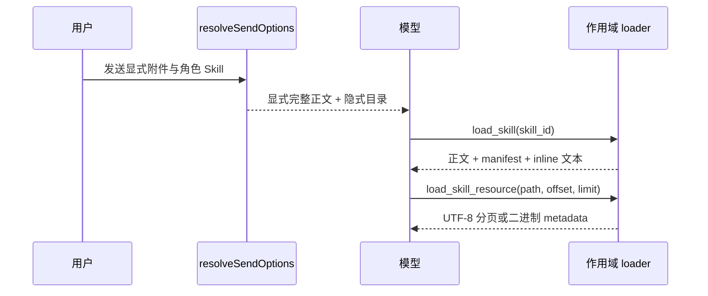

# 加载与注入

<Status variant="stable">桌面聊天的混合渐进加载</Status>

<TLDR>
  当前消息显式附加的 Skill 会注入完整内容。角色和 surface Skill 只以紧凑目录展示，并通过 session-scoped 的只读工具按需加载。explicit-only Skill 不会进入隐式目录。
</TLDR>

## 有效集合

`resolveSendOptions` 先从角色引用与消息临时附件中解析已启用 Skill，并排除当前会话禁用的行。`invocationPolicy: explicit` 会把角色 Skill 从隐式发现中移除；当用户显式附加同一个 Skill 时仍可使用。

有效 `allowedTools` 只合并：

- 本轮显式附加的 Skill；
- 出现在隐式目录中的 Skill。

`disallowedTools` 在之后应用，并始终拥有更高优先级。

## 混合 prompt

显式附件包含完整正文、资源 manifest，以及标记为 `inline` 的 UTF-8 资源。隐式 Skill 只提供 ID、slug、显示名称和 description。目录会要求模型在遵循未加载 Skill 前调用 `load_skill`。

catalog 内置 Skill 可以声明 `metadata.default-enabled: true`。首次建行时会应用这个默认值，之后用户手动禁用的选择会被保留。`Diagram Design` 走这条路径：画图意图可以发现它，但普通对话不会注入完整正文与 27 类参考。

单个 Skill 的 inline 资源文本总量最多 64 KiB。超出上限的文件继续保留在 manifest 中，按需读取。

## 作用域 loader 工具

每次发送都会按 session 建立内存 context，其中只包含本轮可用 Skill。下一次发送会替换该 context，回合结束时释放。

`load_skill` 返回正文、资源 manifest、inline 文本，以及存在非 inline 文本时的读取提示。`load_skill_resource` 接受 `skill_id`、规范化相对路径及可选 byte `offset`、`limit`。单页最多 64 KiB，且不会切断 UTF-8 code point。二进制资源只返回 MIME 和大小，不会把 base64 倾倒进模型上下文。

猜测其他 Skill ID、路径穿越或读取属于其他 Skill 的资源都会被拒绝。只有启用渐进加载时才会注册这两个无副作用 host tool；有效集合没有资源时不会注册资源读取器。

## Usage 计数

显式附件在组装发送时计一次。隐式目录项仅被展示时不计数；本轮第一次成功调用 `load_skill` 时计一次。同一回合重复加载不会再次增加。

