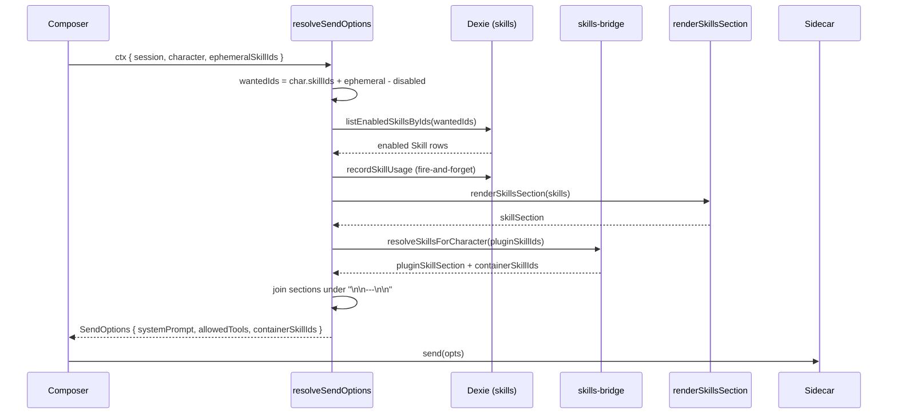
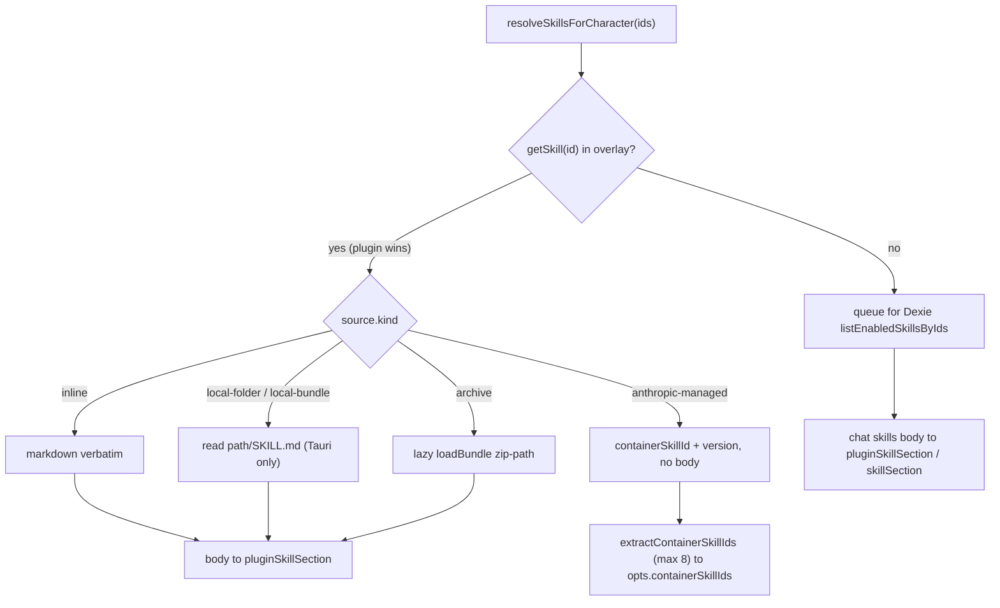

# 加载与注入

<Status variant="stable">发送时热路径 — lib/claude/build-options.ts · skills-bridge · skills-io</Status>

<TLDR>
  技能是**系统提示的后缀，永不执行**。每次发送时，`resolveSendOptions`
  （`lib/claude/build-options.ts:364`）从 `character.skillIds ∪ ctx.ephemeralSkillIds`
  收集 id 并减去 `session.disabledSkillIds`（`:378-398`），只保留 `status === "enabled"` 的行
  （`listEnabledSkillsByIds:396`），通过 `renderSkillsSection`（`lib/db/skills.ts:339`）渲染它们，并
  以固定顺序把该块追加到系统提示（`:755-765`）。插件技能经由
  `skills-bridge.ts:71` 解析——`inline` / `local-folder` 变成 markdown，`anthropic-managed` 变成
  `containerSkillIds`（最多 8 个，`skills-bridge.ts:126`）转发给 sidecar。`allowedTools` 是
  character + 技能 + 插件技能 + agent 模式之间的**并集**（`:823-836`），而非交集。
  `executeSkill`（`lib/skills/executor.ts:35`）是一个刻意为之的 stub。
</TLDR>

## 解释一切的那条语义

技能从不运行。没有技能 VM，没有工具分发，没有单独的执行调用。技能是一段
markdown 正文，会被拼接到下一次请求的系统提示上。本页的一切
都是围绕这个唯一事实的管道：

1. **技能是系统提示的后缀。** 正文渲染在 `## <name>` 标题之下，并在 `\n\n---\n\n`
   分隔符下拼接到提示上（`renderSkillsSection`，`lib/db/skills.ts:339-342`）。
2. **三重 enabled 过滤** 决定哪些被追加：每个技能的 `status`、每个会话的
   `disabledSkillIds`，以及 character/临时（ephemeral）附加集（`build-options.ts:378-398`）。
3. **`allowedTools` 是并集**，而非交集——跨 character、每个被追加的技能、
   每个插件技能以及当前活动的 agent 模式（`:823-836`）。旧文档称之为交集；
   那是错误的。
4. **插件技能在 id 冲突时覆盖 Dexie 技能**——overlay 注册表是
   插件贡献实体的事实来源（`skills-bridge.ts:76`）。
5. **anthropic-managed 技能完全绕过 markdown**；它们作为 `containerSkillIds`（最多 8 个）流向
   sidecar，由 sidecar 在请求时附加（`skills-bridge.ts:82-87`、`:133-150`）。

## 发送时序列



## 第 1 步 — 收集聊天技能 id

`resolveSendOptions`（`build-options.ts:364`）从两个来源构建所需 id 集合，然后减去
会话级禁用。`:378` 处的注释逐字陈述了该契约：

```ts
// build-options.ts:378-398 — "Honour the per-skill status flag — disabled
// skills don't get appended even if the character references them or the
// user attached them ad-hoc."
let skills: Skill[] = []
const characterSkillIds = character?.skillIds ?? []
const ephemeralIds = ctx.ephemeralSkillIds ?? []
if (characterSkillIds.length || ephemeralIds.length) {
  const disabled = new Set(session?.disabledSkillIds ?? [])
  const seen = new Set<string>()
  const wantedIds: string[] = []
  for (const id of [...characterSkillIds, ...ephemeralIds]) {
    if (disabled.has(id)) continue
    if (seen.has(id)) continue
    seen.add(id)
    wantedIds.push(id)
  }
  if (wantedIds.length) {
    skills = await listEnabledSkillsByIds(wantedIds)
  }
}
```

`listEnabledSkillsByIds`（`:396`）是第二道过滤器：它只返回 `status` 为
`"enabled"` 的行（缺失/旧版的 status 被视为已启用）。所以一个 id 只有在以下情况下才能存活到提示：
(a) 被 character 引用或临时（ephemeral）附加，(b) **不**在
`session.disabledSkillIds` 中，且 (c) 有一行 enabled 记录支撑。对于存活下来的项，使用计数器以
fire-and-forget 方式递增（`recordSkillUsage`，`:401-402`）。

## 第 2 步 — 系统提示的组装顺序

聊天技能块（`skillSection`，`:685`）和插件技能块（`pluginSkillSection`，`:718`）
按固定的段落顺序折叠进一个提示（`:755-765`）。空字符串会被过滤，
所有内容在 `\n\n---\n\n` 下拼接。

| 顺序 | 段落 | 来源 | 备注 |
| --- | --- | --- | --- |
| 1 | `baseSystem` | character / 应用默认 | persona 或应用基础提示 |
| 2 | `personaSection` | `character.persona` | 语气 + 个性（`:743-753`） |
| 3 | `memorySection` | memory 运行时 | 召回的长期记忆 |
| 4 | `modeSection` | 活动 agent 模式 | 模板展开（`:689-696`） |
| 5 | `skillSection` | Dexie 聊天技能 | `renderSkillsSection(skills)`（`:685`） |
| 6 | `pluginSkillSection` | 插件 overlay | `renderResolvedSkillsSection`（`:718`） |

```ts
// build-options.ts:755-765
const systemPrompt = [
  baseSystem,
  personaSection,
  memorySection,
  modeSection,
  skillSection,
  pluginSkillSection,
]
  .filter((p) => p && p.trim().length > 0)
  .join("\n\n---\n\n")
if (systemPrompt) opts.systemPrompt = systemPrompt
```

`renderSkillsSection`（`lib/db/skills.ts:339-342`）是聊天技能的格式化器：每一行变成
`## <name>`，后跟其裁剪后的 `content`，以空行拼接。

```ts
// lib/db/skills.ts:339-342
export function renderSkillsSection(skills: Skill[]): string {
  if (skills.length === 0) return ""
  return skills.map((s) => `## ${s.name}\n\n${s.content.trim()}`).join("\n\n")
}
```

## 第 3 步 — allowedTools 并集

白名单以 `Set` 组装，且是真正可累加的（`build-options.ts:823-836`）。成员
override **替换** character 的基础列表，但技能、插件技能和 agent 模式
仍会把它们声明的工具并集叠加在上面，因此 override 永远不会剥夺某个技能所需的权限。如果
没有任何东西声明任何工具，该字段就被省略——SDK 将其读作"一切皆可"。

```ts
// build-options.ts:827-836
const allowed = new Set<string>()
const baseAllowed = memberOverride?.allowedToolsOverride ?? character?.allowedTools
for (const t of baseAllowed ?? []) allowed.add(t)
for (const sk of skills) for (const t of sk.allowedTools ?? []) allowed.add(t)
for (const t of pluginAllowedTools) allowed.add(t)        // plugin skills
for (const t of activeMode?.tools ?? []) allowed.add(t)   // agent mode
```

## 插件技能桥

插件技能存在于内存中的 overlay 注册表，而非 Dexie。当 character 携带
`pluginSkillIds` 时，`build-options.ts:709-737` 惰性导入 `skills-bridge.ts` 并解析它们。每个
id 按 `source.kind` 解析：



### resolveSkillsForCharacter (skills-bridge.ts:71-119)

对每个 id，`getSkill(id)`（`:76`）**首先**检查 overlay——冲突时插件条目获胜
（`:24-27` 处注释）。一个 `anthropic-managed` 技能不携带正文，只有一个 `containerSkillId` +
`version`（`:82-87`）；其他所有来源都经过 `resolveSkillMarkdown`（`:86`）。在
overlay 中找不到的 id 回退到 Dexie `listEnabledSkillsByIds`（`:105`）。解析是 fail-soft 的——Dexie
故障或缺失的 `SKILL.md` 只会降级提示，而不会阻塞发送。

### resolveSkillMarkdown (skills-io.ts:273-326)

按来源的加载器。**每个分支都 fail soft**：读取错误会记录 `console.warn` 并返回
`undefined`，绝不抛出。

| `source.kind` | 行为 | 行号 |
| --- | --- | --- |
| `inline` | 逐字返回 `source.markdown` | `:277` |
| `anthropic-managed` | 返回 `undefined`（由容器处理） | `:279` |
| `local-folder` / `local-bundle` | 读取 `<path>/SKILL.md`，仅 Tauri；浏览器告警 + `undefined` | `:281-298` |
| `archive` | 惰性 `loadBundle({ kind: "zip-path" })` | `:300-316` |

### 容器技能（anthropic-managed）

`extractContainerSkillIds`（`skills-bridge.ts:133-150`）将已解析的集合过滤为携带
`containerSkillId` 的条目，并把它们映射为 `{ skill_id, version? }`。Anthropic API 将单次请求上限设为
`MAX_CONTAINER_SKILLS = 8`（`:126`）；溢出部分按 FIFO 丢弃并带 `console.warn`。结果
落到 `opts.containerSkillIds`（`build-options.ts:716`），由 sidecar 转发，以便 API
在请求时附加该托管技能——没有 markdown 进入提示。

```ts
// skills-bridge.ts:158-162 — body-bearing plugin skills render like chat skills
export function renderResolvedSkillsSection(resolved: ResolvedSkill[]): string {
  const renderable = resolved.filter((s) => s.body && s.body.trim().length > 0)
  if (renderable.length === 0) return ""
  return renderable.map((s) => `## Skill: ${s.name}\n\n${s.body!.trim()}`).join("\n\n---\n\n")
}
```

## 会话与临时（ephemeral）开关

两个正交的会话级 override 馈入 id 收集器。

**会话级禁用** —— `ChatSession.disabledSkillIds?: string[]`（`lib/claude/types.ts:680`，
文档记为"用户仅为本会话临时禁用的技能"）。这些在收集器内部被减去
（`build-options.ts:386-393`）。聊天头部的 `SkillsBadge` 切换它们：它
从 `session.disabledSkillIds`（`chat-header.tsx:129-131`）记忆化一个 `Set`，并在切换时通过
`updateSession`（`chat-header.tsx:437-444`）把新集合持久化回 Dexie。

**按消息的临时（ephemeral）选择** —— 聊天 store 上的 `ephemeralSkillIds`（`stores/chat/chat-store.ts:81`）。
这些与 character 的 `skillIds` 取并集，**仅用于下一次发送**，随后清空：

| 操作 | 行号 | 效果 |
| --- | --- | --- |
| `setEphemeralSkillIds` | `chat-store.ts:235` | 替换整个集合 |
| `toggleEphemeralSkill` | `chat-store.ts:236-241` | 添加/移除一个 id |
| `clearEphemeralSkillIds` | `chat-store.ts:242` | 重置为 `[]` |
| 新会话时重置 | `chat-store.ts`（初始化为 `[]`） | 选择不会跨会话泄漏 |

composer 的 `SkillPicker`（多选对话框）和 `skill-chip-row`（可移除的 chip）驱动
`ephemeralSkillIds`；它们由 `use-claude-chat.ts` 中的发送管道消费并清空。

## executor stub

<Callout type="warn">
  `executeSkill`（`lib/skills/executor.ts:35-37`）是一个刻意为之的 **stub**，返回
  `{ output: "" }`。cognia 中的技能是提示追加的，而非单独执行；该符号存在
  仅为上游外部 agent 的兼容性。没有需要接线的单独执行调用。
</Callout>

```ts
// lib/skills/executor.ts:35-37 — skills are prompt-appended, not executed
export async function executeSkill(_ctx: SkillExecutionContext): Promise<SkillExecutionResult> {
  return { output: "" }
}
```

`buildProgressiveSkillsPrompt`（`executor.ts:50-54`）是 `renderSkillsSection` 的一个薄封装。

<Callout type="warn">
  `buildProgressiveSkillsPrompt` 上的 `maxTokens` 参数**仅提示性**——目前没有
  tokenizer 感知的截断。传入预算不会裁剪渲染出的块。
</Callout>

## 外部 agent 指令栈

外部 agent（Codex / Claude Code / Gemini / …）通过
`lib/ai/instructions/external-agent-instruction-stack.ts` 组装自己的提示。它接受 `activeSkills?` 和
`maxSkillsTokens?`（`:18-25`），调用 `buildProgressiveSkillsPrompt`（默认预算 `4000`，
`:121-125`），并且——与聊天路径不同——把技能块 **unshift** 到
sections 数组的最前面（`:139`），使技能领先，排在 base / custom / project / knowledge 段落之前。
段落以 `\n\n` 拼接（`:144`）。

```ts
// external-agent-instruction-stack.ts:121-139
const { prompt: skillsPrompt } = buildProgressiveSkillsPrompt(
  activeSkills,
  input.maxSkillsTokens || 4000
)
// ...
if (skillsPrompt) {
  sections.unshift(skillsPrompt.trim())   // skills FIRST for external agents
}
```

## 调度器与工作流消费

调度器通过同一个 `resolveSendOptions` 管道解析技能。在解析前，会把一份按任务的禁用列表
拼接到一个克隆的会话上（`lib/scheduler/executors/index.ts:378-391`），使它
与会话自身的禁用取并集。`skill` 任务类型还会通过
`applyAdHocSkill`（`:306-326`）额外追加一个临时技能：它取出单个 enabled 技能，在
`\n\n---\n\n` 下追加 `renderSkillsSection`，并将其 `allowedTools` 取并集。

```ts
// lib/scheduler/executors/index.ts:306-324 — one ad-hoc skill on top of the character set
async function applyAdHocSkill(base: SendOptions, skillId: string | undefined): Promise<SendOptions> {
  if (!skillId) return base
  const skills = await listEnabledSkillsByIds([skillId])
  if (skills.length === 0) return base
  const out: SendOptions = { ...base }
  const skillSection = renderSkillsSection(skills)
  if (skillSection) {
    out.systemPrompt = out.systemPrompt ? `${out.systemPrompt}\n\n---\n\n${skillSection}` : skillSection
  }
  const skillTools = skills.flatMap((s) => s.allowedTools ?? [])
  if (skillTools.length > 0) out.allowedTools = unionStrings(out.allowedTools, skillTools)
  return out
}
```

可视化工作流的 `action.skill.invoke` 节点（`lib/workflow/nodes/built-ins.ts:738-781`）通过
同一个 `resolveSkillsForCharacter` 路径解析，并递增 `recordSkillUsage`（`:781`）——见
[消费面](./consumption-surfaces)。

## 插件注册表与遥测

overlay 注册表（`lib/plugin/registries/skill-registry.ts:14-33`）是插件技能的事实
来源：`registerSkill`（`:19`，在启用时由插件上下文调用）、`unregisterSkillsByPlugin`
（`:23`，管理器的禁用路径）、`getSkill`（`:25`）、`getSkillEntry`（`:27`）、`listSkillIds`
（`:29`）。

遥测按存储拆分。聊天技能通过 `recordSkillUsage` 递增其 Dexie 的 `usageCount` / `lastUsedAt`。
插件技能——没有 Dexie 行——通过 `recordPluginSkillUsage`（`lib/db/plugin-skill-usage.ts:25-54`）
记录到一个单独的 v37 表，它递增 `usageCount`、
盖上 `lastUsedAt`，并在首次得知时回填所属的 `pluginId`。读取通过
`getPluginSkillUsage`（`:56`）/ `listPluginSkillUsage`（`:62`）；卸载时的清理使用
`deletePluginSkillUsageByPlugin`（`:70`）。两条写路径在
`build-options.ts` 中均为 fire-and-forget（`:401-402` 聊天，`:735-737` 插件），所以失败的计数器永不阻塞发送。

## 谁调用了什么

| 调用方 | 函数 | 路径 |
| --- | --- | --- |
| 聊天 composer | `resolveSendOptions` | `lib/claude/build-options.ts:364` |
| `resolveSendOptions` | `listEnabledSkillsByIds` | `lib/db/skills.ts` |
| `resolveSendOptions` | `renderSkillsSection` | `lib/db/skills.ts:339` |
| `resolveSendOptions` | `resolveSkillsForCharacter` | `lib/claude/skills-bridge.ts:71` |
| `resolveSkillsForCharacter` | `resolveSkillMarkdown` | `lib/claude/skills-io.ts:273` |
| `resolveSendOptions` | `recordSkillUsage` / `recordPluginSkillUsage` | `lib/db/skills.ts` · `plugin-skill-usage.ts:25` |
| 外部 agent 栈 | `buildProgressiveSkillsPrompt` | `lib/skills/executor.ts:50` |
| 调度器 `skill` 任务 | `applyAdHocSkill` | `lib/scheduler/executors/index.ts:306` |
| 工作流 `action.skill.invoke` | `resolveSkillsForCharacter` | `lib/workflow/nodes/built-ins.ts:738` |

<Cards>
  <Card title="概览" href="./index" />
  <Card title="数据模型" href="./data-model" />
  <Card title="内置技能" href="./built-in-skills" />
  <Card title="消费面" href="./consumption-surfaces" />
</Cards>
