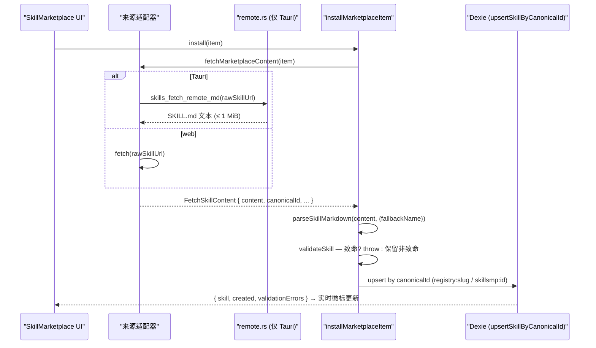
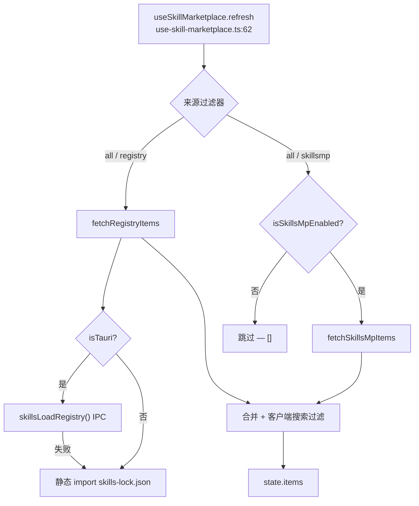

# 市场

<Status variant="stable">两个来源——内置 registry（注册表）（skills-lock.json）加上可选的 SkillsMP API</Status>

<TLDR>
  两个适配器把各自的传输格式归一化为同一个 `MarketplaceItem`（`marketplace-types.ts:8`）：始终启用的
  **registry（注册表）** 读取内置的 `skills-lock.json`（`marketplace-registry.ts:74` —— Tauri IPC 或静态
  import 回退），而可选的 **SkillsMP** API 读取 `AppSettings.skillsMpBaseUrl`
  （`marketplace-skillsmp.ts:59`，未设置时静默禁用）。SKILL.md 按条目惰性拉取
  （`marketplace-install.ts:14`）；在 Tauri 中渲染端的 CSP 会阻止任意主机，因此该拉取由
  Rust 命令 `skills_fetch_remote_md`（`remote.rs:15` —— 仅限 http(s)、1 MiB 上限、15 秒）代理。`installMarketplaceItem`
  （`marketplace-install.ts:37`）解析 → 校验 → 按 canonical id 幂等地 upsert（`registry:<slug>` /
  `skillsmp:<id>`）。`useSkillMarketplace` 钩子（`use-skill-marketplace.ts:41`）并行合并两个来源，
  并从 Dexie 实时派生已安装集合。SkillsMP 的 base URL **没有缓存、没有分页、也没有设置表单**。
</TLDR>

## 两个来源，一种条目形态

两个适配器输出相同的 `MarketplaceItem`，因此除了来源徽标外，UI 从不根据出处分支。`id` 全局唯一
（`source` + `sourceId`），而 `rawSkillUrl` 是延迟的惰性拉取 URL，仅在用户打开或安装该条目时才解析。

```ts
// marketplace-types.ts:8 — the normalised item both adapters produce
export interface MarketplaceItem {
  id: string                 // `registry:ai-elements` | `skillsmp:1234`
  source: MarketplaceSourceId // "registry" | "skillsmp"  (marketplace-types.ts:6)
  sourceId: string           // slug for registry, integer/UUID for SkillsMP
  name: string
  description?: string
  author?: string
  category?: SkillCategory
  tags?: string[]
  repository?: string        // `owner/repo` (registry) or full HTTPS URL (SkillsMP)
  license?: string
  iconUrl?: string
  rawSkillUrl?: string       // deferred — resolved lazily on open/install
  stars?: number
  downloads?: number
  installed?: boolean
}
```

| | Registry | SkillsMP |
| --- | --- | --- |
| 适配器 | `marketplace-registry.ts` | `marketplace-skillsmp.ts` |
| 始终启用？ | 是（内置） | 仅当设置了 `skillsMpBaseUrl` 时 |
| `id` 前缀 | `registry:<slug>` | `skillsmp:<id>` |
| 列表来源 | `skills-lock.json`（IPC 或静态 import） | `GET <base>/skills?q=&category=&page=&sort=` |
| 默认分类 | `development`（`marketplace-registry.ts:58`） | `custom`（`marketplace-skillsmp.ts:86`） |
| `rawSkillUrl` | `entry.rawSkillUrl` 或从 `owner/repo`@`main` 构建 | `item.skillmdUrl` |
| 内容拉取 | `fetchRegistrySkillContent`（`marketplace-registry.ts:107`） | `fetchSkillsMpSkillContent`（`marketplace-skillsmp.ts:140`） |

`FetchSkillContent`（`marketplace-types.ts:32`）是安装路径所消费的内容：`{ content, canonicalId?,
marketplaceSkillId?, rawUrl? }`。两个适配器都提供 `canonicalId`（`registry:<sourceId>` /
`skillsmp:<sourceId>`），因此 upsert 会对重复安装去重。

## registry（注册表）适配器（内置 `skills-lock.json`）

`fetchRegistryItems`（`marketplace-registry.ts:74`）是列表入口点。在 Tauri 中它调用
`skillsLoadRegistry()` IPC（读取生产环境内置的 lockfile 副本）；在 web 模式下它静态 import
`@/skills-lock.json`（`marketplace-registry.ts:11`）。在任何 IPC 失败时它都会 **静默回退** 到内置
JSON（`marketplace-registry.ts:80`），因此 Browse 选项卡始终有 registry（注册表）内容。

每个 lockfile 条目由 `fromRegistryEntry`（`marketplace-registry.ts:50`）映射。无法识别的 `category`
会由 `normaliseCategory`（`marketplace-registry.ts:44`）依据八个 `VALID_CATEGORIES`
（`marketplace-registry.ts:33`）归一化，并回退为 `development`。当 `rawSkillUrl` 缺失时，`buildRawUrl`
（`marketplace-registry.ts:66`）会合成一个 `raw.githubusercontent.com/<source>/main/<skillPath>` URL —— 这
假定默认分支为 `main`，而 lockfile 可以按条目覆盖该假定。

```ts
// marketplace-registry.ts:66 — best-effort raw URL when the lockfile omits one
function buildRawUrl(source: string, sourceType: string, skillPath?: string): string | undefined {
  if (sourceType !== "github" || !skillPath) return undefined
  // owner/repo + assumed `main` branch; override via rawSkillUrl when wrong.
  return `https://raw.githubusercontent.com/${source}/main/${skillPath}`
}
```

### lockfile

仓库根目录下的 `skills-lock.json` 形如 `{ version: 2, skills: {...} }`。它目前提供 **六个条目** ——
`ai-elements`（`vercel/ai-elements`）、`ai-sdk`（`vercel/ai`）、`find-skills`（`vercel-labs/skills`）、
`next-best-practices`（`vercel-labs/next-skills`）、`shadcn`（`shadcn/ui`）以及 `streamdown`
（`vercel/streamdown`）。每个条目都带有 `source`、`sourceType: "github"`、`skillPath`、`computedHash`，以及
可选的显示字段（`displayName`、`description`、`category`、`tags`、`author`、`rawSkillUrl`）。

<Callout type="warn" title="lockfile 由人工维护">
  `scripts/` 中 **没有 `skills-lock.json` 的生成脚本** —— 条目是手动添加的，`computedHash`
  也是手动更新的。省略 `displayName` / `category` 的条目（例如 `ai-sdk`、`find-skills`、`streamdown`）
  会以 slug 作为名称、以 `development` 作为分类来渲染。`skillPath` 被假定位于
  `main` 分支上；默认分支为其他名称的仓库需要显式的 `rawSkillUrl`。
</Callout>

`fetchRegistrySkillContent`（`marketplace-registry.ts:107`）在条目没有 `rawSkillUrl` 时会 **抛出异常**。在 Tauri
中它经由 `skillsFetchRemoteMd`（Rust 代理）路由；在 web 模式下它使用普通 `fetch`，并在状态码非 OK 时抛出异常。

## SkillsMP 适配器（可选 API）

`getSkillsMpBaseUrl`（`marketplace-skillsmp.ts:59`）读取 `AppSettings.skillsMpBaseUrl`，去除尾部斜杠，
并在为空时返回 `null`；`isSkillsMpEnabled`（`marketplace-skillsmp.ts:67`）就是这一检查。当
base 未设置时，`fetchSkillsMpItems` 会立即返回 `[]`（`marketplace-skillsmp.ts:115`）—— 该来源是
静默缺席，而非报错。

列表调用是 `GET <base>/skills`，带有 `q`、`category`、`page`、`pageSize` 和 `sort`
（`popular`|`recent`|`stars`）查询参数（`marketplace-skillsmp.ts:113`）。响应是容忍性的：它接受
`items` 或 `data` 数组中的任意一种（`marketplace-skillsmp.ts:124`）。`fromSkillsMp`
（`marketplace-skillsmp.ts:77`）把一条列表映射为 `skillsmp:<id>`，并以 `custom` 作为分类回退。
`fetchSkillsMpItem`（`marketplace-skillsmp.ts:128`）拉取单条列表（出错时返回 `null`），而
`fetchSkillsMpSkillContent`（`marketplace-skillsmp.ts:140`）使用与 registry（注册表）相同的 Tauri/web 双拉取路径。
`httpJson`（`marketplace-skillsmp.ts:97`）在非 OK 时抛出异常，并附带 200 字符的 body 摘录。

```ts
// marketplace-skillsmp.ts:59 — empty/unset disables the whole source
export function getSkillsMpBaseUrl(): string | null {
  const settings = useSettingsStore.getState().settings
  const url = settings?.skillsMpBaseUrl
  if (!url) return null
  const trimmed = url.trim().replace(/\/+$/, "")
  return trimmed || null
}
```

<Callout type="warn" title="base URL 没有设置表单">
  `AppSettings.skillsMpBaseUrl` 已有文档记载（`lib/claude/types.ts:1208`），并且空状态会链接到
  `/settings?section=skills-marketplace`（`skill-marketplace-empty.tsx:26`），**但没有任何专门的设置表单
  组件写入该字段** —— `skillsMpBaseUrl` 引用仅存在于 `lib/claude/types.ts` 以及
  marketplace 相关文件中，从未出现在 `components/settings/` 里。如今 SkillsMP 来源只能通过以其他方式写入
  该设置来启用；"Configure" 按钮是一个悬空链接。请将此视为一个已知缺口。
</Callout>

## 安装 / 卸载流程

`installMarketplaceItem`（`marketplace-install.ts:37`）与来源无关：它通过
`fetchMarketplaceContent`（`marketplace-install.ts:14`，对 `item.source` 进行穷尽式 `switch`）派发惰性内容拉取，解析
SKILL.md，校验，然后 upsert。



校验分为两层（`marketplace-install.ts:44`）。`missing-name` / `missing-content` 代码是 **致命的**，
会抛出异常（`marketplace-install.ts:51`），从而让 UI 通过 toast 暴露失败，而不是存储一行损坏的记录。
其他任何校验错误都是非致命的：该行会以 `status: "error"` 存储
（`marketplace-install.ts:60`），从而在用户修复之前将其排除在发送时的已启用技能查询之外。

```ts
// marketplace-install.ts:60 — non-fatal errors land on the row, not a throw
const status: SkillStatus = validationErrors.length > 0 ? "error" : "enabled"
// canonicalId from the adapter, or synthesised so the row still lands stably
const canonicalId = fetched.canonicalId ?? `${item.source}:${item.sourceId ?? item.id}`
const { skill, created } = await upsertSkillByCanonicalId({
  draft: { /* … */ source: "marketplace", marketplaceSkillId: fetched.marketplaceSkillId, status },
  canonicalId,
})
```

`uninstallMarketplaceItem`（`marketplace-install.ts:95`）按 `canonicalId` 找到该行并对其执行 `deleteSkill`
（级联删除资源）；当没有任何匹配时它返回 `false`。由于内置项不携带 `canonicalId`，它们
永远不会被卸载命中。`listInstalledCanonicalIds`（`marketplace-install.ts:106`）返回当前 Dexie 中所有
canonical id 的 `Set` —— 这是已安装徽标的数据基底。

## 来源解析与外壳回退



`useSkillMarketplace` 钩子（`use-skill-marketplace.ts:41`）持有 `source` 过滤器（`all` | `registry` |
`skillsmp`）、搜索 `query`，以及 `{ loading, items, error }` 状态。`refresh`（`use-skill-marketplace.ts:62`）
通过 `Promise.all` 并行拉取两个来源，在禁用时跳过 SkillsMP，独立捕获每个来源的失败，
然后应用 **客户端** 的 name/description/tags 过滤（`use-skill-marketplace.ts:83`）。已安装集合
从 `useLiveQuery(listSkills)`（`use-skill-marketplace.ts:53`）实时派生，因此安装/卸载
切换会即时更新徽标。

<Callout type="warn" title="没有缓存、没有分页、没有防抖">
  该钩子在每次 `[source, query]` 变化时都会重新拉取，**没有缓存** 也 **没有防抖** —— 每次按键
  都可能重新命中 SkillsMP API。该 API 支持 `page` / `pageSize`，但钩子会把结果扁平化并且
  **没有暴露任何分页 UI**；只显示服务端的第一页。
</Callout>

## 远程拉取 Rust 代理

`skills_fetch_remote_md`（`remote.rs:15`）之所以存在，是因为 Tauri 渲染端的 CSP 会阻止任意出站
拉取，因此 registry/SkillsMP 适配器通过 Rust 代理 SKILL.md 的下载。它只接受 `http(s)` URL
（`remote.rs:16`），把响应上限设为 `MAX_BYTES` = 1 MiB（`remote.rs:11`），使用 15 秒超时（`remote.rs:12`），
并发送 UA `cognia-next-skills/0.1`（`remote.rs:22`）。

```rust
// remote.rs:15 — the Tauri-only SKILL.md proxy (CSP-blocked in the renderer)
#[tauri::command]
pub async fn skills_fetch_remote_md(url: String) -> Result<String, String> {
    let lower = url.to_lowercase();
    if !(lower.starts_with("https://") || lower.starts_with("http://")) {
        return Err("unsupported scheme: must be http(s)".into());
    }
    // … reqwest client (15 s timeout, UA), GET, status check,
    //   1 MiB cap, UTF-8 decode …
}
```

1 MiB 的上限是有意为之：带有大型内置脚本的技能必须经由 bundle-import / 原生
同步路径安装，而非原始的远程拉取。

## 市场 UI

`SkillMarketplace`（`skill-marketplace.tsx:20`）是一个主从（master-detail）布局。桌面端的详情面板从不空白：
`selectedItem`（`skill-marketplace.tsx:32`）会把一次显式选择重新指向刷新后的结果对象，
其余情况默认指向第一个条目；移动端则保留原始选择，使 Sheet 仅在点按时打开。安装与
卸载通过 `handleInstall` / `handleUninstall`（`skill-marketplace.tsx:42`、
`skill-marketplace.tsx:61`）连接，并带有 `toast` + `loggers.skills` 日志记录。来源切换会在来源关闭时禁用
SkillsMP 按钮（`skill-marketplace.tsx:153`），而当 SkillsMP 未配置时会出现一个提示横幅（`skill-marketplace.tsx:80`）。

| 组件 | 角色 | file:line |
| --- | --- | --- |
| `SkillMarketplace` | 主从外壳、来源切换、搜索、安装处理器 | `skill-marketplace.tsx:20` |
| `SkillMarketplaceListItem` | 记忆化的左窗格行 —— 分类图标、名称、已安装勾选 | `skill-marketplace-list-item.tsx:22` |
| `SkillMarketplaceDetailContent` | 头部、徽标、安装按钮、惰性 SKILL.md 渲染 | `skill-marketplace-detail-content.tsx:30` |
| `SkillMarketplaceDetail` | 围绕详情内容的移动端 Sheet 包装 | `skill-marketplace-detail.tsx:27` |
| `SkillMarketplaceEmpty` | 预览卡（teaser）+ 未配置时的 "Configure" 链接 | `skill-marketplace-empty.tsx:13` |

`SkillMarketplaceDetailContent`（`skill-marketplace-detail-content.tsx:30`）在条目变化时通过
`fetchMarketplaceContent`（`skill-marketplace-detail-content.tsx:45`）惰性拉取 SKILL.md，渲染头部
（`detail-content.tsx:73`）和徽标（`detail-content.tsx:101`）、一个带加载指示的安装/卸载按钮
（`detail-content.tsx:123`），以及通过 `Streamdown`（`detail-content.tsx:151`）渲染的 readme。列表行中的已安装勾选
位于 `skill-marketplace-list-item.tsx:52`。

### 预览卡（teaser，未配置时的空状态）

当 SkillsMP 未配置且没有任何条目时，`SkillMarketplaceEmpty`（`skill-marketplace-empty.tsx:13`）
会渲染四个静态的 `MARKETPLACE_TEASERS`（`marketplace-teasers.ts:15`），外加一个指向
`/settings?section=skills-marketplace`（`skill-marketplace-empty.tsx:26`）的 "Configure" 按钮。

| 预览卡（teaser） | 分类 | id |
| --- | --- | --- |
| Code Reviewer | development | `teaser-code-reviewer` |
| Meeting Notetaker | productivity | `teaser-meeting-notetaker` |
| SQL Explainer | data-analysis | `teaser-sql-explainer` |
| Email Rewriter | communication | `teaser-email-rewriter` |

这些预览卡（teaser）仅供展示 —— 它们不是可安装的条目，只是把用户引导到（目前缺失的）设置
表单的示意性卡片。

<Cards>
  <Card title="技能概览" href="./index" />
  <Card title="Bundle 导入" href="./bundle-import" />
  <Card title="数据模型" href="./data-model" />
  <Card title="消费面" href="./consumption-surfaces" />
</Cards>
