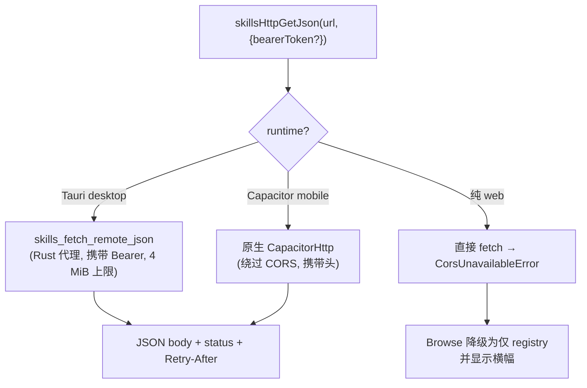
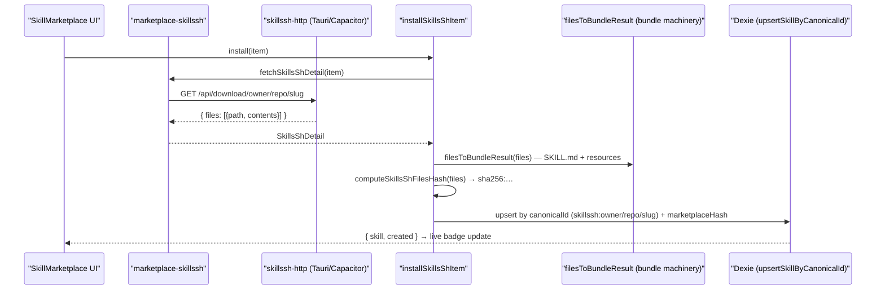
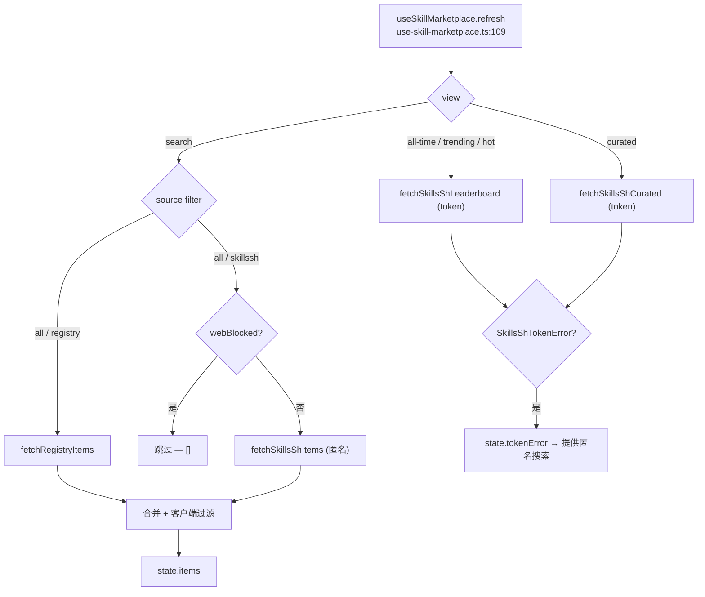

# 市场

<Status variant="stable">两个来源——内置 registry（注册表）（skills-lock.json）加上 skills.sh 目录</Status>

<TLDR>
  两个适配器把各自的传输格式归一化为同一个 `MarketplaceItem`（`marketplace-types.ts:8`）：始终启用的
  **registry（注册表）** 读取内置的 `skills-lock.json`（`marketplace-registry.ts:74` —— Tauri IPC 或静态
  import 回退），而 **skills.sh** 适配器（`marketplace-skillssh.ts`）对接真实的
  [skills.sh](https://skills.sh) 目录。skills.sh 是 **匿名优先** 的：搜索、快照下载，以及多方安全审计
  都无需任何配置即可工作（与 `npx skills` CLI 使用的是同一批端点）。一个 **可选的 Vercel OIDC token**
  （`AppSettings.skillsShToken`）可解锁 `/api/v1` 的排行榜与 curated（精选）视图。skills.sh 不发送 CORS 头，
  因此每个请求都经由 `skillssh-http.ts` 路由（Tauri Rust 代理 / CapacitorHttp / 在纯 web 下被阻止）。安装是
  多文件的：快照的 `{files:[{path,contents}]}` 文件集经由 bundle 机制变成 skill + 资源，并存储一个
  客户端计算的 `sha256:` 哈希以供显式的"检查更新"操作使用。`MarketplaceSourceId = "registry" | "skillssh"`；
  canonical id 为 `registry:<slug>` / `skillssh:owner/repo/slug`。
</TLDR>

## 两个来源，一种条目形态

两个适配器输出相同的 `MarketplaceItem`，因此除了来源徽标外，UI 从不根据出处分支。`id` 全局唯一
（`source` + `sourceId`）；对于 skills.sh，`sourceId` 是 `owner/repo/slug` 三元组。

```ts
// marketplace-types.ts:8 — the normalised item both adapters produce
export interface MarketplaceItem {
  id: string                 // `registry:ai-elements` | `skillssh:owner/repo/slug`
  source: MarketplaceSourceId // "registry" | "skillssh"  (marketplace-types.ts:6)
  sourceId: string           // slug for registry, `owner/repo/slug` triple for skills.sh
  name: string
  description?: string
  author?: string
  category?: SkillCategory
  tags?: string[]
  repository?: string        // `owner/repo` (registry) or the skill's source URL (skills.sh)
  license?: string
  iconUrl?: string
  rawSkillUrl?: string       // deferred — resolved lazily on open/install (registry only)
  stars?: number
  downloads?: number
  installed?: boolean
}
```

| | Registry | skills.sh |
| --- | --- | --- |
| 适配器 | `marketplace-registry.ts` | `marketplace-skillssh.ts` |
| 始终启用？ | 是（内置） | 是（匿名）；token 解锁额外视图 |
| `id` 前缀 | `registry:<slug>` | `skillssh:<owner/repo/slug>` |
| 列表来源 | `skills-lock.json`（IPC 或静态 import） | `GET https://skills.sh/api/search?q=&limit=` |
| 默认分类 | `development`（`marketplace-registry.ts:58`） | `custom`（`marketplace-skillssh.ts:177`） |
| 安装形态 | 经 `rawSkillUrl` 的单个 SKILL.md | 经 `fetchSkillsShDetail` 的多文件快照 |
| 内容拉取 | `fetchRegistrySkillContent`（`marketplace-registry.ts:107`） | `fetchSkillsShDetail` / `fetchSkillsShSkillContent`（`marketplace-skillssh.ts:271`、`:387`） |

`FetchSkillContent`（`marketplace-types.ts:32`）是单文件安装路径所消费的内容：`{ content, canonicalId?,
marketplaceSkillId?, rawUrl? }`。skills.sh 的安装路径是 **多文件** 的，会绕过它（见下文
[多文件安装](#多文件安装)）。

## registry（注册表）适配器（内置 `skills-lock.json`）

`fetchRegistryItems`（`marketplace-registry.ts:74`）是列表入口点。在 Tauri 中它调用
`skillsLoadRegistry()` IPC（读取生产环境内置的 lockfile 副本）；在 web 模式下它静态 import
`@/skills-lock.json`（`marketplace-registry.ts:11`）。在任何 IPC 失败时它都会 **静默回退** 到内置
JSON（`marketplace-registry.ts:80`），因此 Browse 选项卡始终有 registry（注册表）内容。

每个 lockfile 条目由 `fromRegistryEntry`（`marketplace-registry.ts:50`）映射。无法识别的 `category`
会由 `normaliseCategory`（`marketplace-registry.ts:44`）依据八个 `VALID_CATEGORIES`
（`marketplace-registry.ts:33`）归一化，并回退为 `development`。当 `rawSkillUrl` 缺失时，`buildRawUrl`
（`marketplace-registry.ts:66`）会合成一个 `raw.githubusercontent.com/<source>/main/<skillPath>` URL —— 这
假定默认分支为 `main`，而 lockfile 可以按条目覆盖该假定。

```ts
// marketplace-registry.ts:66 — best-effort raw URL when the lockfile omits one
function buildRawUrl(source: string, sourceType: string, skillPath?: string): string | undefined {
  if (sourceType !== "github" || !skillPath) return undefined
  // owner/repo + assumed `main` branch; override via rawSkillUrl when wrong.
  return `https://raw.githubusercontent.com/${source}/main/${skillPath}`
}
```

### lockfile

仓库根目录下的 `skills-lock.json` 形如 `{ version: 2, skills: {...} }`。它目前提供 **六个条目** ——
`ai-elements`（`vercel/ai-elements`）、`ai-sdk`（`vercel/ai`）、`find-skills`（`vercel-labs/skills`）、
`next-best-practices`（`vercel-labs/next-skills`）、`shadcn`（`shadcn/ui`）以及 `streamdown`
（`vercel/streamdown`）。每个条目都带有 `source`、`sourceType: "github"`、`skillPath`、`computedHash`，以及
可选的显示字段（`displayName`、`description`、`category`、`tags`、`author`、`rawSkillUrl`）。

<Callout type="warn" title="lockfile 由人工维护">
  `scripts/` 中 **没有 `skills-lock.json` 的生成脚本** —— 条目是手动添加的，`computedHash`
  也是手动更新的。省略 `displayName` / `category` 的条目（例如 `ai-sdk`、`find-skills`、`streamdown`）
  会以 slug 作为名称、以 `development` 作为分类来渲染。`skillPath` 被假定位于
  `main` 分支上；默认分支为其他名称的仓库需要显式的 `rawSkillUrl`。
</Callout>

`fetchRegistrySkillContent`（`marketplace-registry.ts:107`）在条目没有 `rawSkillUrl` 时会 **抛出异常**。在 Tauri
中它经由 `skillsFetchRemoteMd`（Rust 代理）路由；在 web 模式下它使用普通 `fetch`，并在状态码非 OK 时抛出异常。

## skills.sh 适配器（Agent Skills Directory）

`marketplace-skillssh.ts` 对接公开的 [skills.sh](https://skills.sh) 目录。它是 **匿名优先** 的 ——
搜索、快照下载和安全审计都无需配置 —— 在其之上叠加了一层轻量的 token 解锁能力。涉及两个 base 主机：
`SKILLS_SH_BASE_URL = "https://skills.sh"` 与审计服务 `AUDIT_BASE_URL = "https://add-skill.vercel.sh"`
（`marketplace-skillssh.ts:20`）。

### 匿名端点（零配置）

这些与官方 `npx skills` CLI 命中的是同一批端点，因此对每个用户都无需 token 即可工作。

| 调用 | 端点 | 返回 |
| --- | --- | --- |
| 搜索 | `GET https://skills.sh/api/search?q=&limit=` | `{ skills: [{ id, name, source, installs }] }` → `MarketplaceItem[]`（`fetchSkillsShItems`，`marketplace-skillssh.ts:197`） |
| 快照下载 | `GET https://skills.sh/api/download/{owner}/{repo}/{slug}` | `{ files: [{ path, contents }] }`（`fetchSkillsShDetail`，`marketplace-skillssh.ts:271`） |
| 安全审计 | `GET https://add-skill.vercel.sh/audit?source={owner/repo}&skills={slug}` | 各方风险映射 → `SkillsShAudit`（`fetchSkillsShAudit`，`marketplace-skillssh.ts:341`） |

`fetchSkillsShItems` 对短于两个字符的查询返回 `[]`（`marketplace-skillssh.ts:199`），因此在搜索有意义之前
列表保持为空。审计端点聚合了多个合作方 —— Socket、Snyk、ZeroLeaks、Agent Trust Hub（`ath`）、Runlayer
（`ANONYMOUS_PROVIDER_LABELS`，`marketplace-skillssh.ts:329`）—— 每个提供方的 `risk` 都被归一化为
`safe | low | medium | high | critical | unknown` 之一（`normaliseRisk`，`marketplace-skillssh.ts:299`）。
缺失的审计（404）返回 `null` 而非抛出异常（`marketplace-skillssh.ts:376`）。

### token 解锁的 `/api/v1` 视图（可选）

把一个 **Vercel OIDC token** 粘贴进内联的 teaser 卡片，会将其存入 `AppSettings.skillsShToken`
（`lib/claude/types.ts:1304` —— 一个短时存活的普通设置，而非 keyring），并经由 `v1Get` 辅助函数
（`marketplace-skillssh.ts:209`，把 token 作为 Bearer 头附加）解锁受 OIDC 保护的 `/api/v1` 面。

| 视图 | 端点 | 辅助函数 |
| --- | --- | --- |
| 排行榜（all-time / trending / hot） | `GET /api/v1/skills?view=&page=&per_page=` | `fetchSkillsShLeaderboard`（`marketplace-skillssh.ts:230`）—— 分页，`hasMore` 驱动"Load more" |
| Curated（精选）合集 | `GET /api/v1/skills/curated` | `fetchSkillsShCurated`（`marketplace-skillssh.ts:254`）—— owner 及其 skills |
| 带哈希的 detail | `GET /api/v1/skills/{owner}/{repo}/{slug}` | `fetchSkillsShDetail`（有 token 时优先） |
| 审计 | `GET /api/v1/skills/audit/{owner}/{repo}/{slug}` | `fetchSkillsShAudit`（有 token 时优先） |

```ts
// marketplace-skillssh.ts:209 — every /api/v1 call needs a token; a 401 is typed
async function v1Get<T>(path: string): Promise<T> {
  const token = getSkillsShToken()
  if (!token) {
    throw new SkillsShTokenError("skills.sh /api/v1 requires a Vercel OIDC token")
  }
  try {
    return await skillsHttpGetJson<T>(`${SKILLS_SH_BASE_URL}${path}`, { bearerToken: token })
  } catch (err) {
    if (err instanceof SkillsHttpError && err.status === 401) {
      throw new SkillsShTokenError("skills.sh token rejected (expired or invalid)")
    }
    throw err
  }
}
```

被拒绝的 token 表现为类型化的 `SkillsShTokenError`（`marketplace-skillssh.ts:51`）。钩子会在排行榜/curated
刷新时捕获它并设置 `state.tokenError`，因此 UI 提供一键返回匿名搜索的选项（`use-skill-marketplace.ts:140`、
`skill-marketplace.tsx:109`）。detail 与审计调用会 **优雅降级**：有 token 时它们先尝试 `/api/v1`，遇到
token 错误则回退到匿名端点（`marketplace-skillssh.ts:281`、`:355`）—— 查看某个 skill 从不需要配置。

<Callout type="warn" title="不再有 SkillsMP base URL">
  推测性的 **SkillsMP** 协议（及其 `AppSettings.skillsMpBaseUrl` 字段）已被 **移除**。市场现在指向真实的
  skills.sh 目录；唯一的可选设置是 `skillsShToken`，通过内联 teaser 卡片写入。遗留的 `skillsmp:*` 安装由一次
  Dexie 迁移分离（见 [遗留迁移](#遗留-skillsmp-迁移)）。
</Callout>

## 传输：CORS 路由

skills.sh 与 `add-skill.vercel.sh` **不发送 CORS 头**，因此浏览器普通 `fetch` 会被阻止。每个请求都经由
`skillssh-http.ts`，按运行时挑选一条免 CORS 的路径：



- **Tauri desktop** → Rust 命令 `skills_fetch_remote_json`（`src-tauri/src/skills/remote.rs:75`）。与 SKILL.md
  代理不同，它把非 2xx 状态 **返回** 在响应结构里（让前端可对 401/404/429 分支），携带可选的 Bearer token，
  暴露 `Retry-After`，并把 body 上限设为 `MAX_JSON_BYTES` = 4 MiB（`remote.rs:13`）。
- **Capacitor mobile** → 原生 `CapacitorHttp`（`getViaCapacitor`，`skillssh-http.ts:70`），它免于 CORS 并转发
  `Authorization` 头。
- **纯 web** → 直接 `fetch`；网络/CORS 拒绝会变成类型化的 `CorsUnavailableError`（`skillssh-http.ts:37`）。
  此时 `isSkillsShWebBlocked()`（`skillssh-http.ts:50`）为真，Browse 面降级为 **仅 registry** 并显示横幅
  （`skill-marketplace.tsx:229`）。

`skillsHttpGetJson`（`skillssh-http.ts:120`）在任何非 2xx 响应上抛出携带 HTTP `status`（及 `retryAfter`）的
类型化 `SkillsHttpError` —— 适配器正是检查这个 status 来把 401 映射为 token 错误、把 404 映射为
"无审计 / 需要 slug"。

## 远程拉取 Rust 代理

`src-tauri/src/skills/remote.rs` 暴露了 **两个** Tauri 命令，二者都拒绝非 `http(s)` scheme
（`validate_scheme`，`remote.rs:16`），使用 UA `cognia-next-skills/0.1` 与 15 秒超时：

- `skills_fetch_remote_md`（`remote.rs:24`）—— 用于 **registry** 适配器的原始 SKILL.md 代理。上限为
  `MAX_BYTES` = 1 MiB（`remote.rs:11`）；非 2xx 变为 `Err`。
- `skills_fetch_remote_json`（`remote.rs:75`）—— 用于 **skills.sh** 的市场 JSON 代理。上限 4 MiB，携带 Bearer
  token，并把非 2xx 状态（`RemoteGetResponse { status, body, retryAfter }`）返回而非报错，让渲染端可对状态
  分支。

```rust
// remote.rs:75 — JSON proxy; non-2xx is RETURNED, not Err, so the UI can branch
#[tauri::command]
pub async fn skills_fetch_remote_json(req: RemoteGetRequest) -> Result<RemoteGetResponse, String> {
    validate_scheme(&req.url)?;
    // … reqwest client (15 s, UA), optional bearer_auth, Accept header …
    //   capture status + Retry-After, cap body at MAX_JSON_BYTES (4 MiB), UTF-8 decode …
}
```

1 MiB / 4 MiB 的上限是有意为之：带有大型内置脚本的技能必须经由 bundle-import / 原生同步路径，而非单次
远程拉取。

## 多文件安装

一个 skills.sh 技能是一个 **文件集**，而非单个 SKILL.md，因此 `installMarketplaceItem`
（`marketplace-install.ts:72`）为 `source === "skillssh"` 取了一条专门分支（`installSkillsShItem`，
`marketplace-install.ts:34`），复用既有的 bundle 机制而非单文件解析器：

1. `fetchSkillsShDetail(item)` 下载快照 `{ files: [{ path, contents }] }`。
2. `filesToBundleResult`（`skillssh-install.ts:63`）找到 `SKILL.md`，将其交给 `parseBundleManifest`
   （frontmatter + 致命校验），并用 `inferResourceKind` 对其余每个文件分类（script / reference / asset）——
   正是 bundle 导入器所产出的形态。
3. `computeSkillsShFilesHash`（`skillssh-install.ts:98`）对规范化（按路径排序）的文件集做哈希，并把它存到
   `Skill.marketplaceHash` 上，前缀 `sha256:`，从而让比较器绝不会把客户端计算的哈希与服务端 `/api/v1`
   哈希混淆。
4. 草稿按 `canonicalId = skillssh:<owner/repo/slug>` 经 `upsertSkillByCanonicalId` upsert，因此重新安装会
   就地替换内容、资源与哈希（幂等）。



detail 面板仅在打开某个条目时才惰性拉取 **文件清单**（`buildSkillsShFileTree`，`skillssh-install.ts:36` ——
SKILL.md 在前，其余按字母序）和 **安全审计徽标**（`fetchFileTree` / `fetchAudit`，
`use-skill-marketplace.ts:271`、`:259`），二者均按 item id 作键，从而各自只拉取一次。

### registry 安装（不变的单文件路径）

registry 分支仍然解析单个 SKILL.md。`fetchMarketplaceContent`（`marketplace-install.ts:15`）对 `item.source`
做 switch；校验分为两层 —— `missing-name` / `missing-content` 是 **致命的**，会抛出异常使 UI 通过 toast
暴露失败，而其他任何校验错误都是非致命的，会落到该行上并带 `status: "error"`（`marketplace-install.ts:99`），
在修复之前将其排除在发送时的已启用技能查询之外。

## 更新检测

**没有后台轮询**。用户触发一个显式的"检查更新"工具栏操作，经由 `useSkillUpdate`
（`hooks/skills/use-skill-update.ts`）连接：

- `checkAll` 调用 `checkSkillsShUpdates`（`skillssh-updates.ts:56`），它重新下载每个 `skillssh:` 安装的当前
  快照，重新计算 `computeSkillsShFilesHash`，并与存储的 `marketplaceHash` 比较。由于安装时与检查时的哈希都是
  对文件集做的客户端计算，二者无论是否有 token 都直接可比。每个技能的失败会落进 `error` 而非中止整轮运行。
- 发生漂移的技能会被标记进 skills store（`setUpdateAvailable`）；列表行显示一个"Update available"徽标，
  detail 的 Overview 获得一个一键 **Update** 横幅。
- `updateOne` 为该技能重新运行幂等的 `installMarketplaceItem`，就地替换内容/资源/哈希并清除标记
  （`use-skill-update.ts:56`）。

## 从 URL 直接安装

"Install from URL" 对话框（`components/skills/skill-url-install-dialog.tsx`，从 Browse 搜索行的链接按钮或
工具栏打开）经由 `parseSkillsShInput`（`skillssh-github.ts:29`）解析自由格式输入，并通过匿名下载端点解析
（`resolveSkillsShRef`，`skillssh-github.ts:79`）。接受的形式：

| 输入 | 行为 |
| --- | --- |
| `https://skills.sh/{owner}/{repo}/{slug}` | 从页面 URL 取完整三元组（也支持 `www.skills.sh`） |
| `owner/repo/slug` | 完整三元组 |
| `owner/repo` | slug 默认为 repo 名；404 时抛出带指引的 `SkillsShSlugRequiredError` |
| `https://github.com/{owner}/{repo}` | github.com repo URL —— 其路径匹配 repo-only 形态 |

由于解析经由 `fetchSkillsShDetail`，一个发布了技能的 GitHub repo 无需任何 GitHub API 下钻即可安装。一个
`owner/repo/repo` 快照 404 的 repo-only 引用会产生一个指引错误，提示用户追加 slug 或粘贴 skills.sh 页面
URL（`skillssh-github.ts:59`）。

## 来源解析与外壳回退



`useSkillMarketplace` 钩子（`use-skill-marketplace.ts:77`）持有 `view`
（`search` | `all-time` | `trending` | `hot` | `curated`）、`source` 过滤器
（`all` | `registry` | `skillssh`）、搜索 `query`，以及 `{ loading, items, error, hasMore, loadingMore,
tokenError }` 状态。在 **search** 视图中它经 `Promise.all` 并行拉取 registry 与匿名 skills.sh 搜索，在
`webBlocked` 时跳过 skills.sh，独立捕获每个来源的失败，然后应用 **客户端** 的
name/description/tags/repository 过滤（`use-skill-marketplace.ts:174`）。视图切换与 token teaser 仅在配置了
token / 可达时出现（`skill-marketplace.tsx:179`）。已安装集合从 `useLiveQuery(listSkills)`
（`use-skill-marketplace.ts:100`）实时派生，因此安装/卸载切换会即时更新徽标。

<Callout type="warn" title="没有缓存或防抖；仅排行榜分页">
  该钩子在每次 `[source, query, view]` 变化时都会重新拉取，**没有缓存** 也 **没有防抖** —— 每次按键
  都可能重新命中 skills.sh 搜索 API。分页（"Load more"）**仅** 存在于 token 解锁的排行榜视图
  （`loadMore`，`use-skill-marketplace.ts:205`）；搜索与 curated 结果被扁平化，没有分页。
</Callout>

## 遗留 SkillsMP 迁移

Dexie **v78**（`lib/db/schema.ts:1890`）分离来自已废弃 SkillsMP 来源的安装。它的 `upgrade` 会清除任何
`canonicalId` 带 `skillsmp:` 前缀的行上的 `canonicalId` 与 `marketplaceSkillId`，把这些行变成普通的本地技能
（它们继续可用），而非"installed"徽标与更新检查永远无法对新的 `skillssh:owner/repo/slug` 方案解析的幽灵
市场安装。该迁移是幂等的 —— 只触碰 `skillsmp:` 前缀的行。

## 市场 UI

`SkillMarketplace`（`skill-marketplace.tsx:26`）是一个主从（master-detail）布局。桌面端的详情面板从不空白：
`selectedItem`（`skill-marketplace.tsx:48`）会把一次显式选择重新指向刷新后的结果对象，其余情况默认指向第一个
条目；移动端则保留原始选择，使 Sheet 仅在点按时打开。安装与卸载通过 `handleInstall` / `handleUninstall`
（`skill-marketplace.tsx:58`、`:77`）连接，并带有 `toast` + `loggers.skills` 日志记录。视图切换
（search / 排行榜 / curated）仅在有 token 时出现（`skill-marketplace.tsx:179`）；来源切换
（All / registry / skills.sh）在 `webBlocked` 时禁用 skills.sh（`skill-marketplace.tsx:223`）；当 skills.sh
不可达时显示一个 web-blocked 横幅（`skill-marketplace.tsx:229`）。

| 组件 | 角色 | file:line |
| --- | --- | --- |
| `SkillMarketplace` | 主从外壳、视图 + 来源切换、搜索、URL 安装 + 刷新、安装处理器 | `skill-marketplace.tsx:26` |
| `SkillMarketplaceListItem` | 记忆化的左窗格行 —— 分类图标、名称、已安装勾选 | `skill-marketplace-list-item.tsx:22` |
| `SkillMarketplaceDetailContent` | 头部、徽标、安装按钮、文件清单预览、惰性审计徽标、更新横幅 | `skill-marketplace-detail-content.tsx` |
| `SkillMarketplaceDetail` | 围绕详情内容的移动端 Sheet 包装 | `skill-marketplace-detail.tsx` |
| `SkillMarketplaceTokenTeaser` | 内联解锁卡 —— 粘贴 Vercel OIDC token 以启用排行榜 | `skill-marketplace-token-teaser.tsx:17` |
| `SkillUrlInstallDialog` | "Install from URL" 对话框（skills.sh / 三元组 / GitHub repo） | `skill-url-install-dialog.tsx:29` |

### token teaser（匿名优先的解锁卡）

当没有配置 token 且用户处于无查询的搜索视图时，列表面会显示 `SkillMarketplaceTokenTeaser`
（`skill-marketplace-token-teaser.tsx:17`）。它说明搜索与安装无需配置即已可用，并提供一个密码输入框来粘贴
Vercel OIDC token —— 经 `useSettingsStore.save` 直接存入 `AppSettings.skillsShToken` —— 从而解锁排行榜与
curated 视图。它替代了旧的静态 `SkillMarketplaceEmpty` teaser 卡片（及 `marketplace-teasers.ts`），二者连同
SkillsMP base-URL 设置一起被删除。

<Cards>
  <Card title="技能概览" href="./index" />
  <Card title="Bundle 导入" href="./bundle-import" />
  <Card title="数据模型" href="./data-model" />
  <Card title="消费面" href="./consumption-surfaces" />
</Cards>
