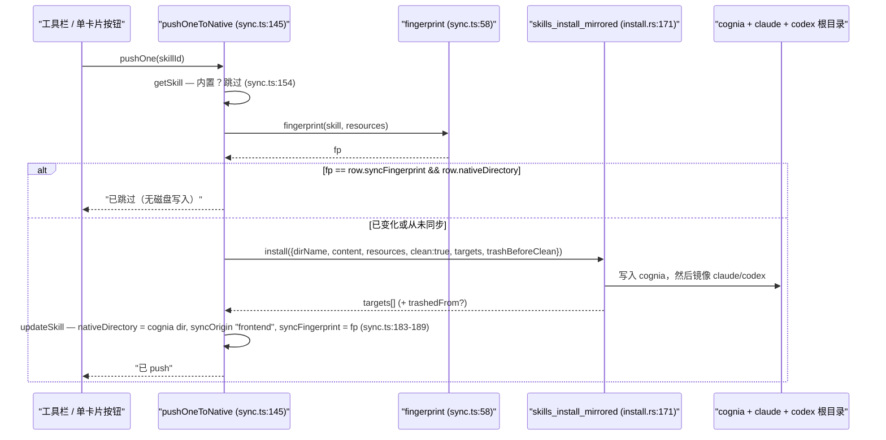
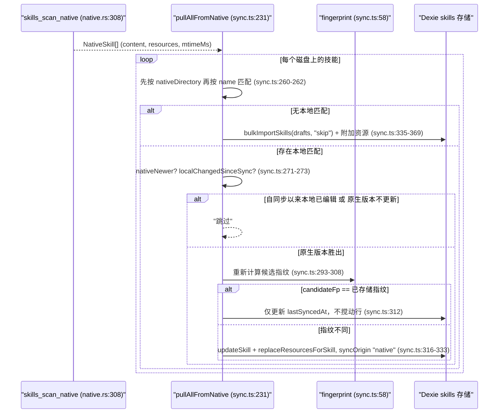
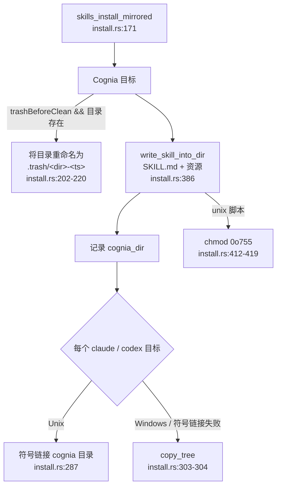

# 原生同步与安全

<Status variant="stable">仅桌面端 — lib/skills/sync.ts · src-tauri/src/skills（7 个文件，13 个命令）</Status>

<TLDR>
  Dexie 技能存储是事实来源；磁盘上的 `SKILL.md` 目录树才是其他 Claude
  工具实际读取的内容。`lib/skills/sync.ts` 将行 push 出去，并把磁盘上的编辑 pull 回来，先按
  `nativeDirectory` 再按 name slug 匹配（`sync.ts:260-262`），并以 SHA-256 的
  `fingerprint` 对每个方向进行门控（`sync.ts:58-86`）。Rust 一侧（`src-tauri/src/skills/`）将规范副本写入
  `<appData>/cognia/skills/`，并将其投影为 `~/.claude/skills/` + `~/.agents/skills/`，**在
  Unix 上是符号链接，在 Windows 上是拷贝**（`install.rs:226-304`），指纹变化时把旧副本移动到 `.trash/`。
  13 命令的 IPC 表层（`lib/claude/ipc.ts:381-440`，注册于 `lib.rs:398-410`）涵盖扫描、安装、
  回收、远程拉取、注册表，以及一个**仅提示性（advisory）**的 9 规则正则安全扫描器（`scanner.rs:59-126`）。
  在浏览器中一切都是空操作——`isTauri()` 守卫会返回一个 `(env)` 错误（`sync.ts:147-148`）。
</TLDR>

## 为何存在两份副本

Cognia 将技能存储为 IndexedDB 行（参见 [数据模型](./data-model)），但 Claude Code、Codex CLI
以及 Cognia 自己的 sidecar 都从磁盘按 `~/.claude/skills/<dir>/SKILL.md` 读取技能。原生同步
协调这两种视图，使得在应用内编写的技能能被这些 CLI 逐字发现，而外部 CLI 写入的
技能也能被无需手动转换地导回 Dexie
（`native.rs:1-5`）。

| 平面 | 位置 | 角色 |
| --- | --- | --- |
| Dexie 存储 | IndexedDB `skills` / `skillResources` | 事实来源——在应用内编辑 |
| Cognia 规范副本 | `<appData>/cognia/skills/<dir>/` | Cognia 拥有的磁盘副本；镜像的基础 |
| Claude 镜像 | `~/.claude/skills/<dir>/` | 符号链接（Unix）/ 拷贝（Windows）——由 Claude Code 读取 |
| Codex 镜像 | `~/.agents/skills/<dir>/` | 符号链接（Unix）/ 拷贝（Windows）——由 Codex CLI 读取 |

每个 `<dir>/` 下的磁盘布局：`SKILL.md`（frontmatter + 正文）外加可选的 `scripts/`、
`references/` 与 `assets/` 子目录——这些是遍历器识别的资源种类（`native.rs:45-49`）。

<Callout type="warn" title="仅桌面端">
  每个公共入口点在 Web 上都会短路。当 `isTauri()` 为 false 时，`pushOneToNative` / `pushAllToNative` /
  `pullAllFromNative` 返回 `errors: [{ name: "(env)", error: "Desktop only." }]`
  （`sync.ts:147-148`、`:213-214`、`:233-235`）；`useSkillSync` 在调用它们之前就会抛出一个 `"Sync requires desktop
  mode."` toast（`use-skill-sync.ts:24-26`）。
</Callout>

## 指纹——幂等性钩子

两个方向都依赖于 `fingerprint(skill, resources)`（`sync.ts:58-86`）：一份稳定的 JSON，由
`serializeSkill(skill)` 外加每个资源的 `{path, kind, size, encoding, content}` **按 path 排序**
（`sync.ts:60-71`）组成，并经由 `crypto.subtle` 用 SHA-256 哈希。当 WebCrypto 不可用（例如测试
框架中）时，它会回退到一个非密码学的、类 FNV 的滚动哈希，使该函数仍然可调用
（`sync.ts:80-85`）。

```ts
// sync.ts:58 — same canonical shape feeds both push and pull, so an unchanged
// skill produces a byte-identical fingerprint in either direction.
export async function fingerprint(skill: Skill, resources: SkillResource[]): Promise<string> {
  const md = serializeSkill(skill)
  const stable = JSON.stringify({
    md,
    res: resources
      .map((r) => ({ path: r.path, kind: r.kind, size: r.size, encoding: r.encoding, content: r.content }))
      .sort((a, b) => a.path.localeCompare(b.path)),
  })
  // ...SHA-256 over `stable`, hex fallback when crypto.subtle is missing
}
```

## Push——Dexie → 磁盘

`pushOneToNative(skillId)`（`sync.ts:145-199`）是按技能的写入器；`pushAllToNative`（`sync.ts:211-224`）
在 `listSkills()` 上循环调用它。内置技能会被跳过（`sync.ts:154-155`），因为它们不是用户编辑的
内容。关键一步是 `sync.ts:164` 处的**指纹预检**：如果行存储的
`syncFingerprint` 已与一次新计算的结果匹配*且*已记录了 `nativeDirectory`，磁盘写入会被
完全跳过并计为 `skipped`。正是这一点让"重新导入相同的 zip ⇒ 什么都不会发生"
以及"狂点 Sync now"变得廉价。



只有当该行此前已被同步且指纹确实发生变化时，才会设置 `trashBeforeClean`
（`sync.ts:176`），从而在覆写之前把旧的 cognia 副本保留到 `.trash/` 中。安装
成功后，cognia 的结果会被优先选作该行的规范 `nativeDirectory`——其他
镜像是一次性的投影（`sync.ts:181-182`）。

### 活动镜像目标

`activeMirrorTargets()`（`sync.ts:122-129`）始终包含 `"cognia"`；只有当 `AppSettings.skillBundleMirrors`
中各自的按用户开关处于开启状态（默认两者均为 `true`）时，才会加入 `"claude"` 与 `"codex"`：

```ts
// sync.ts:122
export function activeMirrorTargets(): SkillsTarget[] {
  const flags = resolveSkillBundleMirrors(useSettingsStore.getState().settings)
  const targets: SkillsTarget[] = ["cognia"]
  if (flags.claude) targets.push("claude")
  if (flags.codex) targets.push("codex")
  return targets
}
```

## Pull——磁盘 → Dexie

`pullAllFromNative()`（`sync.ts:231-382`）通过 `skillsScanNative` 扫描 `~/.claude/skills/`，解析每个
`SKILL.md`，并先按 `nativeDirectory` 再按 name slug 将其匹配到一个本地行（`sync.ts:260-262`）。
它**从不删除本地行**——漂移只会新增或更新。冲突裁决决定是
磁盘上的版本还是应用内的编辑胜出：

```ts
// sync.ts:269-273 — the conflict gate, with a clock-skew fudge
const nativeMtime = skill.mtimeMs || 0
const lastSynced = existing.lastSyncedAt ?? 0
const localChangedSinceSync = (existing.updatedAt ?? 0) > lastSynced + TIMESTAMP_FUDGE_MS
const nativeNewer = nativeMtime > 0 ? nativeMtime > lastSynced + TIMESTAMP_FUDGE_MS : true
if (!nativeNewer || localChangedSinceSync) { result.skipped += 1; continue }
```



三个微妙之处：

- **`mtimeMs === 0` ⇒ 保守 pull。** 当文件系统无法暴露修改时间时，`nativeNewer`
  默认为 `true`（`sync.ts:272`），从而重新考量磁盘版本而非默默丢弃它。
- **第二道指纹门控。** 即便 mtime 表示"原生版本更新"，一个与已存储指纹相匹配的重新计算指纹
  也意味着只是时间戳移动了（一次 `touch`）；代码会更新 `lastSyncedAt` 并跳过
  该行 + 资源重写（`sync.ts:293-315`）。
- **没有删除。** 磁盘上缺失的技能永远不会从 Dexie 中移除；pull 严格是增量的。

<Callout type="warn" title="时钟偏差容差">
  `TIMESTAMP_FUDGE_MS = 1000`（`sync.ts:37`）会被加到比较两侧的 `lastSyncedAt` 上，从而使写入时间戳
  与记录的同步时间之间亚秒级的时钟抖动不会被错误地标记为
  冲突。同一常量同时守护"原生版本更新"与"自同步以来本地已变化"。
</Callout>

## Rust 安装层——镜像目标、符号链接或拷贝、回收目录

`skills_install_mirrored`（`install.rs:171-260`）是多目标写入器。`SkillsTarget`
（`install.rs:81-87`，serde 小写化的 `Cognia` / `Claude` / `Codex`）经由 `resolve_target_root`
（`install.rs:128-154`）映射到根目录：

| 目标 | 根目录 |
| --- | --- |
| `cognia` | `<appData>/cognia/skills/` |
| `claude` | `~/.claude/skills/` |
| `codex` | `~/.agents/skills/` |

Cognia 始终通过 `write_skill_into_dir` 逐字写入（`install.rs:226-234`、`:386-425`）；随后 Claude
与 Codex 由 `link_or_copy_mirror`（`install.rs:267-305`）从该规范副本投影而来——
**在 Unix 上是目录符号链接**（`install.rs:287`），或在 Windows 上 / 当符号链接
调用失败时使用递归的 `copy_tree`（`install.rs:303-304`）。某个无法解析其 home 目录的目标会被记录一个
`note: "home directory unavailable; mirror skipped"`，而不会使整个安装失败
（`install.rs:188-195`）。



`write_skill_into_dir`（`install.rs:386-425`）可选地清空目录（`clean`）、写入 `SKILL.md`，然后
对每个资源：校验相对路径（`validate_resource_path`，`install.rs:47-57`）、创建
父目录、写入（当 `encoding == "base64"` 时进行 base64 解码），并对 Unix 的 `script` 资源
执行 `chmod 0o755`，使 Bash 能执行它们（`install.rs:412-419`）。`validate_dir_name`（`install.rs:29-45`）将目录
名约束为 `[A-Za-z0-9_-]`、1–64 字符、无前导/尾随 `-`。Base64 是手写实现的
（`base64_encode` `native.rs:196-223` / `base64_decode` `install.rs:455-482`，RFC 4648），以避免为了
寥寥几个调用点而引入额外的 crate。

### 回收目录（trash）

当一次重新导入会覆写现有的 cognia 副本时，旧目录会被移动到
`<appData>/cognia/skills/.trash/<dir>-<ts>/`（`install.rs:202-220`）——没有自动保留清扫，
因此回收目录会一直增长，直到用户清空它。`skills_list_trash`（`install.rs:362`）返回 `<dir>-<ts>`
基名用于计数徽标；`skills_empty_trash`（`install.rs:333`）移除每个条目并返回
计数。`skills_move_to_trash`（`native.rs:274`）是 bundle 导入流程使用的独立等价物，
会先校验 `dir_name` 不含 `/`、`\` 或 `..`。

## 读取磁盘——扫描器

`read_skill_dir`（`native.rs:26-67`）要求存在一个 `SKILL.md`（否则为 `None`），以毫秒记录其 mtime
（不可用时为 0，`native.rs:40-43`），并遍历 `scripts/` / `references/` / `assets/`。`walk_resources`
（`native.rs:69-133`）强制执行 bundle 限制与安全边界：

- **`MAX_RESOURCE_BYTES = 2 MB`** 每文件（`native.rs:13`）——超大文件会被记录为内容为空
  但保留真实大小（`native.rs:110-111`）。
- **`MAX_RESOURCES_PER_SKILL = 50`**（`native.rs:14`）——一旦达到上限遍历器即停止。
- **符号链接被无条件拒绝**（`native.rs:87-88`）——`symlink_metadata` 报告链接本身，
  因此一个 `scripts/inner → /etc` 链接无法将技能目录之外的文件泄漏进 bundle。
- 文本扩展名（`native.rs:135-167`）以 UTF-8 读取；其余一切都进行 base64 编码
  （`native.rs:118-121`），并根据扩展名猜测 MIME（`native.rs:169-191`）。

`skills_scan_native` 解析 `~/.claude/skills/`（`native.rs:308`），`skills_scan_codex` 解析
`~/.agents/skills/`，在缺失时返回空的 Vec（`native.rs:254`），而 `skills_scan_dir`
（`native.rs:229`）扫描任意用户提供的文件夹——全部按 `dir_name` 排序。`skills_uninstall_native`
（`native.rs:328`）在同样的 `/` `\` `..` 守卫之后移除 `~/.claude/skills/<dir>/`。

## IPC 表层——13 个命令

全部声明于 `lib/claude/ipc.ts` 并通过 `transport.call()` 分派；注册于
`src-tauri/src/lib.rs:398-410`。

| TS 函数 | Rust 命令 | file:line (TS) | Rust |
| --- | --- | --- | --- |
| `skillsScanNative` | `skills_scan_native` | `ipc.ts:381` | `native.rs:308` |
| `skillsScanDir` | `skills_scan_dir` | `ipc.ts:385` | `native.rs:229` |
| `skillsScanCodex` | `skills_scan_codex` | `ipc.ts:389` | `native.rs:254` |
| `skillsMoveToTrash` | `skills_move_to_trash` | `ipc.ts:393` | `native.rs:274` |
| `skillsListTrash` | `skills_list_trash` | `ipc.ts:397` | `install.rs:362` |
| `skillsEmptyTrash` | `skills_empty_trash` | `ipc.ts:401` | `install.rs:333` |
| `skillsInstallNative` | `skills_install_native` | `ipc.ts:405` | `install.rs:60` |
| `skillsInstallMirrored` | `skills_install_mirrored` | `ipc.ts:411` | `install.rs:171` |
| `skillsUninstallNative` | `skills_uninstall_native` | `ipc.ts:417` | `native.rs:328` |
| `skillsFetchRemoteMd` | `skills_fetch_remote_md` | `ipc.ts:425` | `remote.rs:15` |
| `skillsLoadRegistry` | `skills_load_registry` | `ipc.ts:429` | `registry.rs:65` |
| `skillsScanSecurity` | `skills_scan_security` | `ipc.ts:433` | `scanner.rs:16` |
| `skillsScanResources` | `skills_scan_resources` | `ipc.ts:437` | `scanner.rs:24` |

线协议类型位于 `types.rs`（全部为 serde camelCase）：`NativeSkill`（`types.rs:20-34`，
`{dirName, filePath, content, resources, mtimeMs}`）、`NativeSkillResource`（`types.rs:8-18`，
`{kind, path, name, content, encoding, mimeType?, size}`）、`ScanIssue`（`types.rs:74-81`），以及
`RegistryEntry`（`types.rs:59-72`）。

<Callout type="info" title="遗留的单目标命令">
  `skills_install_native`（`install.rs:60`）是前镜像时代的写入器，仅针对 `~/.claude/skills/`。
  push 流水线只使用 `skills_install_mirrored`；单目标版本被保留为可达状态以
  向后兼容，并在 `sync.ts:204` 中被 `void` 引用，使该导入不会被 tree-shake 掉。二者
  共享 `write_skill_into_dir`，因此校验永远不会在它们之间漂移。
</Callout>

## 远程拉取与注册表

`skills_fetch_remote_md`（`remote.rs:15`）通过 Rust 代理一次 `SKILL.md` 拉取，因为 Tauri 的 CSP 阻止
渲染端拉取任意主机。它**只接受 http/https**（`remote.rs:16-19`），将响应上限设为 **1 MiB**
（`remote.rs:11`），在 **15s** 后超时（`remote.rs:12`），并发送一个
`cognia-next-skills/0.1` User-Agent——大型脚本 bundle 必须经由原生同步，而非原始 fetch。

`skills_load_registry`（`registry.rs:65`）读取打包的 `skills-lock.json`，依次搜索
`../skills-lock.json`（生产资源目录）→ `skills-lock.json`（仓库根目录，开发）→
`../../skills-lock.json`（`registry.rs:51-62`），都未找到时返回空的 Vec。注册表的
结构及其消费者在 marketplace 页面有详细介绍。

## 安全扫描器——仅提示性（advisory）

`skills_scan_security`（`scanner.rs:16`）扫描一个 `SKILL.md` 正文；`skills_scan_resources`（`scanner.rs:24`）
扫描打包脚本的 `Vec<(label, content)>`。`build_rules`（`scanner.rs:60-126`）编译 **9** 个
正则，按行评估并使用从 1 开始计数的行号（`scanner.rs:32-50`）：

| 模式 | 严重度 | 种类 |
| --- | --- | --- |
| 在文件系统根目录上递归 `rm -rf` | high | `shell-rmrf` |
| fork 炸弹 | high | `shell-forkbomb` |
| `curl` 管道接入 shell | high | `shell-curl-sh` |
| `wget` 管道接入 shell | high | `shell-wget-sh` |
| `sudo rm` | medium | `shell-sudo-rm` |
| `eval(` | medium | `code-eval` |
| `DROP TABLE` | medium | `sql-drop-table` |
| `AKIA[0-9A-Z]{16}` | high | `leaked-aws-key` |
| 内嵌的 RSA / EC / OPENSSH 私钥头 | high | `leaked-private-key` |

```rust
// scanner.rs:32 — line-by-line, every rule, 1-indexed line numbers
for (line_no, line) in input.content.lines().enumerate() {
    for rule in &rules {
        if rule.pattern.is_match(line) {
            out.push(ScanIssue {
                severity: rule.severity.to_string(),
                kind: rule.kind.to_string(),
                message: format!("{}: {}", input.label, rule.message),
                line: Some((line_no as u32) + 1),
            });
        }
    }
}
```

<Callout type="warn" title="扫描器从不阻断">
  这是**保存前的卫生检查，而非沙箱**。扫描结果是仅提示性（advisory）的：它从不阻断一次保存或一次 push，
  且这些正则并不意在拦住有备而来的攻击者——是用户自愿安装了该技能
  （`scanner.rs:1-4`）。关键在于，一个技能的"执行"只会将其 markdown 追加到系统提示词中；
  Cognia 本身从不运行打包的脚本，因此被标记的 `rm -rf /` 是对一个外部
  CLI *可能*做什么的警告，而非 Cognia 将会执行的内容。
</Callout>

## UI 触发器

`useSkillSync`（`use-skill-sync.ts:20-72`）暴露 `{ busy, push, pull, pushOne }`，每个都经过桌面端门控，
在 Web 上带有一个 toast（`use-skill-sync.ts:24-26`），并经由 `summariseSync`（`use-skill-sync.ts:74-87`）汇总。
工具栏的同步下拉菜单接入 push-all / pull-all / 镜像开关 / 清空回收目录；bundle 导入对话框
在导入后自动 push；安全扫描器面板在挂载时（桌面端）自动扫描，外加一个手动按钮。

<Cards>
  <Card title="概览" href="./index" description="技能子系统一览。" />
  <Card title="Bundle 导入" href="./bundle-import" description="Zip / 文件夹导入与幂等的 upsert 路径。" />
  <Card title="数据模型" href="./data-model" description="Skill / SkillResource 行与 Dexie v8 表。" />
  <Card title="消费表层" href="./consumption-surfaces" description="技能如何到达系统提示词与 agent。" />
</Cards>
