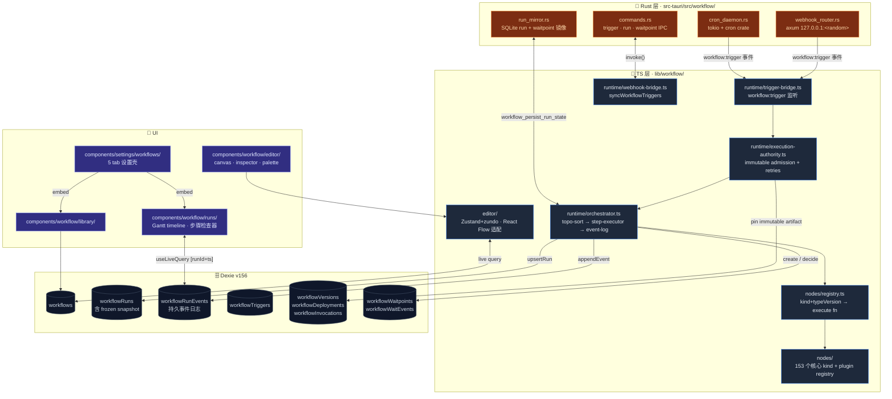
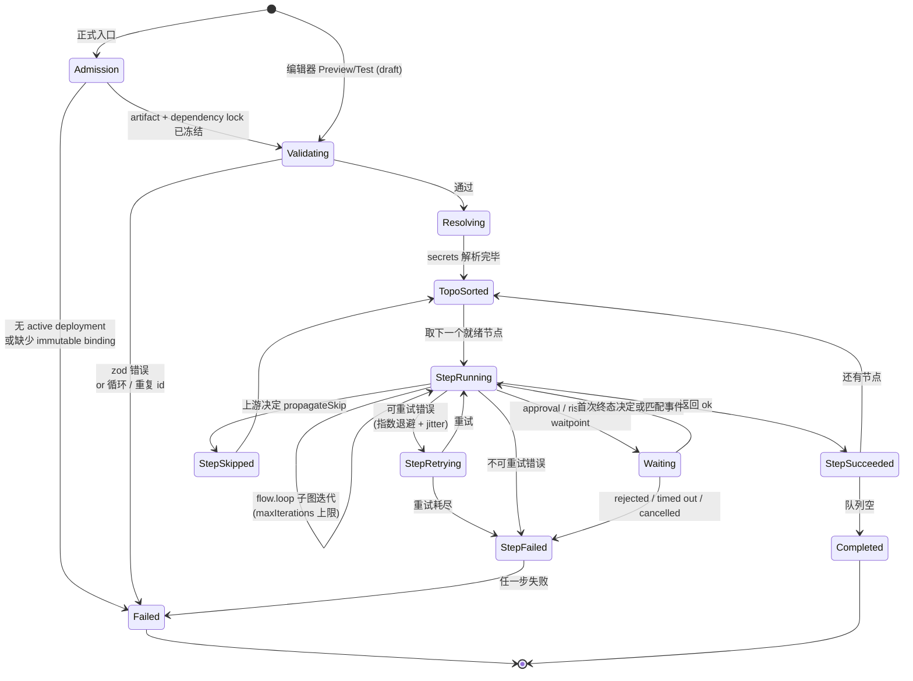

# 可视化工作流
cognia-next 借这层把已经成熟的运行时实体 —— [角色](../chat/chat-and-skills)、[Agent
团队](../chat/agent-teams)、[技能](./skills)、[员工孪生](./employee-twin)、
[平台连接器](./platform-connectors)、MCP 服务器、[插件](./plugin-system)
—— 拼成可执行图。设计目标对齐 ADR 0011 与 0017：

- 可视化图编辑器：左栏拖拽 → 拖到画布 → 句柄连接 → 右栏检查器配置 → Ctrl+S 保存 → zundo 撤销重做 → elkjs 自动布局。
- 执行引擎：端到端跑图、每步写入持久事件日志、支持重试 / 超时 / 幂等、webview 崩溃后能从日志恢复。
- 正式执行权威：CLI、触发器、MCP、子工作流、运行历史与 Dead Letter 必须经 Execution Authority 执行已发布 immutable artifact；只有编辑器 Preview/Test 是显式 draft 路径。
- 持久检查点：审批、risk gate 与 event wait 共用 CAS-controlled repository，使用首次绝对截止时间与“事件先持久化、后匹配”语义。
- 触发分类：手动 / cron / 连接器入站 / 聊天消息 / webhook —— 都接入现有基础设施，不另起调度器。
- 混合运行时：**Rust 负责"工作流何时启动"和"这次运行是否撑过了崩溃"，TS 负责"给定一次运行，怎么把步骤一个个走完"**。

## 适用场景

| 场景              | 推荐做法                                                                              |
| ----------------- | ------------------------------------------------------------------------------------- |
| 定时数据同步      | `trigger.cron` → `io.http` → `data.transform` → `flow.set`                            |
| 入站自动回复      | `trigger.connector.inbound` → `ai.classify` → `flow.branch` → `action.connector.send` |
| RAG-back FAQ 回复 | `trigger.chat.message` → `action.twin.rag` → `ai.prompt` → 落到聊天回复               |
| Webhook 桥接      | `trigger.webhook` → `ai.extract` → `io.webhook.respond`                               |
| 复杂聚合          | `flow.loop` + `flow.subworkflow` + `data.template` + `flow.join`                      |
| 多角色任务编排    | `action.team.run` 驱动 agent-team 生命周期                                            |

## 架构图



跨界面只在 Tauri 事件（`workflow:trigger` / `workflow:resume`）与 IPC 命令（`lib/workflow/runtime/tauri-bridge.ts`）发生。Web 模式下 Rust 部分优雅 no-op，TS 编排器单独跑得通。

## 关键模块与文件路径

### 类型与定义

| 文件                                  | 用途                                                          |
| ------------------------------------- | ------------------------------------------------------------- |
| `types/workflow/visual.ts`            | `VisualWorkflow` / `WorkflowNode` / 153 种 `WorkflowNodeKind` |
| `lib/workflow/definition/validate.ts` | zod envelope + 图完整性（循环、重复 id 检测）                 |
| `lib/workflow/definition/seed.ts`     | 10 个内置模板（hello world / classify-branch / RAG FAQ / 等） |

### 编辑器

| 文件                                                 | 用途                                                                       |
| ---------------------------------------------------- | -------------------------------------------------------------------------- |
| `lib/workflow/editor/store.ts`                       | Zustand + zundo store（100 步历史限制）                                    |
| `lib/workflow/editor/auto-layout.ts`                 | elkjs `layered` 算法懒加载                                                 |
| `lib/workflow/editor/react-flow-converter.ts`        | `VisualWorkflow` ↔ React Flow `nodes` / `edges` 双向转换                   |
| `lib/workflow/editor/connection-validator.ts`        | `isValidConnection` 守卫（拒绝 trigger 作目标、annotation 边、自环、重边） |
| `lib/workflow/editor/expression-language.ts`         | CodeMirror 6 语法高亮（`{{ $node['x'].out.field }}`）                      |
| `lib/workflow/editor/expression-suggestions.ts`      | 上下文敏感自动补全                                                         |
| `components/workflow/editor/canvas.tsx`              | React Flow shell + 工具栏 + 空态                                           |
| `components/workflow/editor/inspector-panel.tsx`     | 右栏检查器；按 kind 派发到 typed 或 schema-generated form                    |
| `components/workflow/editor/node-search-sidebar.tsx` | 左栏拖拽源（custom MIME `application/x-workflow-kind`）                    |
| `components/workflow/editor/command-palette.tsx`     | Ctrl+K cmdk 面板 —— 全部节点 + 编辑器动作 + 最近 5 个工作流                |

### 运行时

| 文件                                        | 用途                                                                            |
| ------------------------------------------- | ------------------------------------------------------------------------------- |
| `lib/workflow/runtime/orchestrator.ts`      | 顶层入口；validate → resolve secrets → topo-sort → step loop → 持久化           |
| `lib/workflow/runtime/execution-authority.ts` | 正式 admission、immutable version、dependency lock 与三种重试                  |
| `lib/workflow/runtime/egress-guard.ts`      | Connector 来源在模型、Connector、MCP、Plugin 与网络汇点的 PII 强制治理          |
| `lib/workflow/runtime/waitpoint-repository.ts` | 审批/risk/event 的持久 pause-resume 与绝对 timeout                              |
| `lib/workflow/runtime/topo-sort.ts`         | Kahn 算法 + `flow.loop` / `flow.wait` 反向边识别                                |
| `lib/workflow/runtime/step-executor.ts`     | 重试（指数 / 固定退避）+ 超时（`AbortController`）+ 幂等                        |
| `lib/workflow/runtime/event-log.ts`         | append-only 写入器；`createRunLogger(runId)` 作用域捕获                         |
| `lib/workflow/runtime/idempotency.ts`       | Inngest 风格 memoization；崩溃恢复时从事件日志 hydrate                          |
| `lib/workflow/runtime/expression.ts`        | 安全表达式解析（**不**用 `eval`）；`$node` / `$trigger` / `$static` / `$params` |
| `lib/workflow/runtime/secret-resolver.ts`   | `NoopSecretResolver` + 内存实现；生产由 keyring 桥实现                          |
| `lib/workflow/runtime/tauri-bridge.ts`      | trigger/run/waitpoint IPC + 事件监听；web 模式 no-op                            |
| `lib/workflow/runtime/webhook-bridge.ts`    | 保存工作流时把 trigger 节点推送给 Rust（idempotent）                            |
| `lib/workflow/runtime/trigger-bridge.ts`    | `workflow:trigger` 事件 → Execution Authority admission                         |
| `lib/workflow/runtime/resume-controller.ts` | 启动时回放进行中运行                                                            |
| `lib/workflow/runtime/run-status-bridge.ts` | 订阅 `workflowRunEvents` 把每步状态推给编辑器 store                             |

### 节点执行器

| 文件                                    | 用途                                                                                            |
| --------------------------------------- | ----------------------------------------------------------------------------------------------- |
| `lib/workflow/nodes/registry.ts`        | `registerNodeExecutor(kind, typeVersion, fn)` —— 插件也调这一个                                 |
| `lib/workflow/nodes/built-ins.ts`       | 核心 executor registry 入口；专门的 action/AI 模块同时注册                                      |
| `lib/workflow/nodes/catalog.ts`         | 每个 kind 的元数据（label / description / icon / keywords） —— 左栏 / 命令面板 / 检查器头部共用 |
| `lib/workflow/nodes/params-schemas.ts`  | 每个 kind 的 JSON Schema —— 校验 + 自动生成表单                                                 |
| `lib/workflow/nodes/validate-params.ts` | 运行前对每节点 params 跑 schema                                                                 |

### Rust 层

| 文件                                                | 用途                                                                      |
| --------------------------------------------------- | ------------------------------------------------------------------------- |
| `src-tauri/src/workflow/mod.rs`                     | 模块入口 + `WorkflowState`                                                |
| `src-tauri/src/workflow/commands.rs`                | trigger、run-state、webhook、integration-ingress 与 waitpoint IPC         |
| `src-tauri/src/workflow/run_mirror.rs`              | SQLite run + waitpoint/event 镜像，用于崩溃与离线审批恢复                   |
| `src-tauri/src/workflow/state.rs`                   | `WorkflowState` —— 持有 cron / webhook / mirror 句柄                      |
| `src-tauri/src/workflow/triggers/cron_daemon.rs`    | tokio 任务 + `cron` crate；最近触发时间排序的小堆                         |
| `src-tauri/src/workflow/triggers/webhook_router.rs` | axum 接收器，HMAC-SHA256 验签（`x-signature-256`）；1 MiB body cap        |

### UI 与设置

| 文件                                                  | 用途                                                        |
| ----------------------------------------------------- | ----------------------------------------------------------- |
| `app/workflows/page.tsx`                              | 库列表                                                      |
| `app/workflows/[id]/page.tsx`                         | 全屏画布编辑器                                              |
| `app/workflows/[id]/runs/page.tsx`                    | 运行历史列表                                                |
| `app/workflows/[id]/runs/[runId]/page.tsx`            | Gantt 时间线 + 步骤检查器                                   |
| `components/workflow/runs/run-timeline.tsx`           | 按事件日志 `buildSpans` 渲染水平 Gantt                      |
| `components/workflow/runs/run-detail.tsx`             | 单次运行视图 + "从此步重跑"                                 |
| `components/settings/workflows/workflows-section.tsx` | 5 tab 设置壳：Library / Runs / Templates / Defaults / Audit |

## 节点分类（153 种）

```text
trigger.*    manual · cron · connector/chat/integration/team/goal/desktop/terminal/pet/workflow event
action.*     character · agent · goal · team · plan · scheduler · skill · twin · memory
             connector · approval · mobile · MCP · plugin · git · desktop · terminal · pet
ai.*         prompt · classify · extract · embed · browserModel · council · ensemble
flow.*       branch · switch · split · join · loop · wait · set · subworkflow · catch/break/continue
data.*       transform · aggregate · code · template · OCR · eval
io.*         HTTP · webhook response · typed output · web clone
annotation.* note · group
```

每种 `kind` 在 `catalog.ts` 都有元数据条目；插件贡献的 kind 通过 `pluginId` 字段标记，渲染时归到"Plugin nodes"分组（参见 ADR 0017）。

## 控制流：节点执行 / 状态机



每次状态切换都通过 `event-log.ts:RunLogger` 追加一行 `workflowRunEvents`，UI 端 `useLiveQuery` 即刻刷新。

## 数据库表（Dexie v156）

| 表                  | 主键 | 关键索引                 | 用途                                                                          |
| ------------------- | ---- | ------------------------ | ----------------------------------------------------------------------------- |
| `workflows`         | `id` | -                        | 工作流定义（图 + settings + viewport）                                        |
| `workflowRuns`      | `id` | `[workflowId+startedAt]` | 每次执行一行；冻结 snapshot 用于查看/调试，正式重试使用 immutable execution binding |
| `workflowRunEvents` | `id` | `[runId+ts]`             | 每步事件日志；按时间排序回放                                                  |
| `workflowTriggers`  | `id` | `[workflowId+enabled]`   | 已注册触发器（cron / webhook / inbound / chat-msg）                           |
| `workflowVersions` | `id` | `[workflowId+sequence]` | 不可变发布 artifact |
| `workflowDeployments` | `id` | `[workflowId+environment]` | production pointer、revision 与 active/disabled 状态 |
| `workflowInvocations` | `id` | deployment / version / status | 正式 admission、caller、idempotency、dependency lock 与 retry provenance |
| `workflowWaitpoints` | `id` | `[kind+status]`、`[runId+status]` | 审批、risk 与 event checkpoint 的 pending/terminal 状态 |
| `workflowWaitEvents` | `id` | `[key+emittedAt]` | 先持久化后匹配、只消费一次、24 小时后清理的事件 |

完整事实来源是 `lib/db/schema.ts`；旧版存储文档中的 v22 块只描述最初引入时的表。

## 配置项与扩展点

### 工作流级 settings

定义在 `types/workflow/visual.ts:WorkflowSettings`，由编辑器 Toolbar → 设置抽屉编辑：

- `timeoutMs > 0` —— 整次运行的墙钟超时（`AbortController` 武装）
- `retry: { mode: "exponential" | "fixed", maxAttempts, baseDelayMs }`
- `maxIterations`（默认 10 000，全局硬上限 100 000）

### 表达式语法

任何 `supports {{ }} expressions` 字段都接受：

```text
{{ $node['stepId'].out.fieldName }}     上游节点输出
{{ $trigger.payload.foo }}              触发器原始 payload
{{ $static.key }}                       工作流级常量
{{ $params.foo }}                       当前节点 params
```

支持 `.field` / `['key']` / `[index]` 访问；`expression.test.ts` 覆盖了 token / eval / resolveExpression / resolveDeep 全链路。

### 插件扩展点（ADR 0017）

三个 `runtime` 类扩展点：

| 扩展点             | 作用                                                              |
| ------------------ | ----------------------------------------------------------------- |
| `workflow.node`    | 插件贡献节点执行器；`PluginNodeDef.execute` 注册到 registry       |
| `workflow.trigger` | 插件贡献长跑触发源；`PluginTriggerDef.start` 返回带 `stop` 的句柄 |
| `workflow.task`    | 既有 —— `action.plugin.invoke` 的目标                             |

权限门：`extension:workflow`。审计走 `auditPluginPointContracts`。详情见[插件系统](./plugin-system)。

### 触发器混合分布

| 触发器                      | TS                                                    | Rust                                            |
| --------------------------- | ----------------------------------------------------- | ----------------------------------------------- |
| `trigger.manual`            | 编辑器 Run 按钮                                       | -                                               |
| `trigger.cron`              | TS 端 fallback（webview 在线时）                      | `cron_daemon.rs`（最小化到托盘也触发）          |
| `trigger.connector.inbound` | `ConnectorBus.dispatchInbound` 钩入                   | -                                               |
| `trigger.chat.message`      | `lib/claude/build-options.ts:resolveSendOptions` 钩入 | -                                               |
| `trigger.webhook`           | -                                                     | `webhook_router.rs`（仅桌面，HMAC-SHA256 验签） |

## 关联子系统

<Cards>
  <Card
    title="平台连接器"
    href="./platform-connectors"
    description="trigger.connector.inbound + action.connector.send 的来源"
  />
  <Card title="调度器" href="./scheduler" description="cron 触发器复用 Rust 调度抽象" />
  <Card
    title="技能子系统"
    href="./skills"
    description="action.skill.invoke / action.skill.upsert 的目标"
  />
  <Card
    title="Agent 团队"
    href="../chat/agent-teams"
    description="action.team.run 驱动 runTeamLifecycle"
  />
  <Card
    title="员工孪生"
    href="./employee-twin"
    description="action.twin.rag / action.twin.ingest 的接入点"
  />
  <Card
    title="插件系统"
    href="./plugin-system"
    description="workflow.node / workflow.trigger / workflow.task 扩展点"
  />
</Cards>

## 关联 ADR

- [ADR 0011 — Visual Workflows Subsystem](../adr/0011-workflows-subsystem)
- [ADR 0017 — Workflow Plugin Extension Points](../adr/0017-workflow-plugin-extension-points)
- [ADR 0009 — Platform Connectors](../adr/0009-platform-connectors)（混合 Rust / TS 分工的参考模式）
- [ADR 0004 — Native Vector Store](../adr/0004-vector-native-backend)（SQLite 镜像持久化的参考模式）

## 已知限制

- **subworkflow 递归**硬上限深度 10；超出抛错。Phase 5 已加固。
- **`flow.loop` 上限**：每实例 `maxIterations`（默认 10000）+ 全局硬上限 100000（覆盖 `forEach` / `times` / `while`）。
- **Web 模式降级**：cron 仅在 webview 在线时触发；webhook 显示"desktop only"提示；其他四种触发器照常工作。
- **`io.webhook.respond`**：Phase 5a 走异步存响应；Phase 5b 计划加 "hold the response open until io.webhook.respond runs" 反向通道。
- **`action.character.send`** 不强制走聊天 UI —— 是直接写一条消息进会话，UI 需独立刷新。
- **`workflow_persist_run_state`** 镜像 Tauri-only；web 模式仅靠 Dexie + 启动回放，crash recovery 弱一档。
- **运行 snapshot 不变**：从历史重跑使用 snapshot，工作流后续修改不会回溯影响历史运行 —— 这是有意为之的，但用户需要明白。
