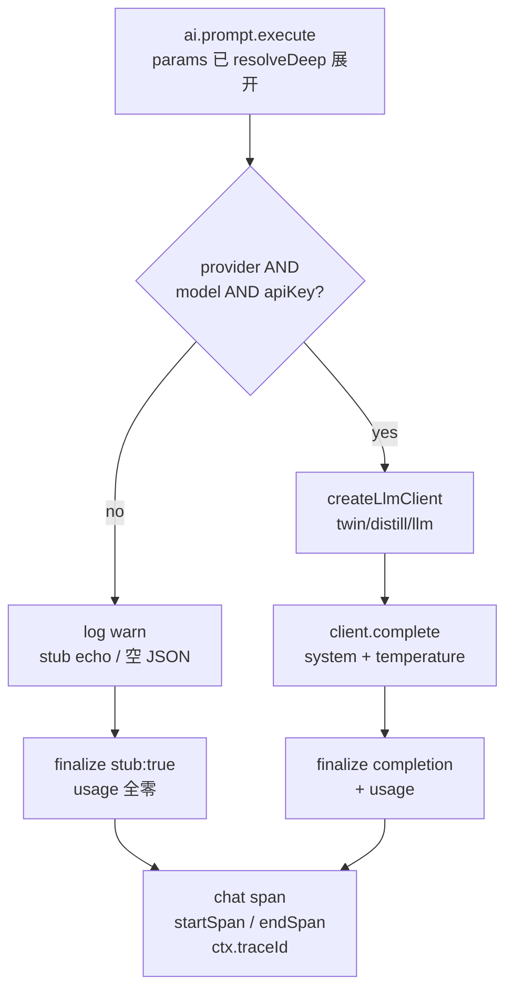
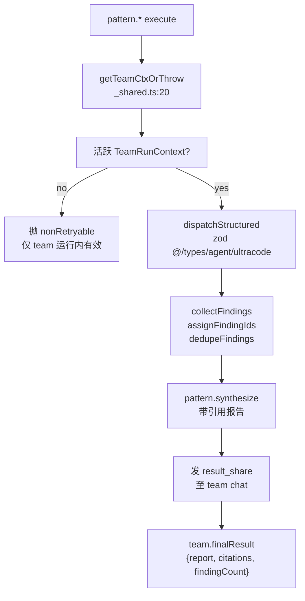

# AI 与 pattern 节点

<Status variant="stable" />

<TLDR>
本页深入讲解为 Visual Workflows 引入智能的两类节点。四个 **AI 原语**位于 `lib/workflow/nodes/built-ins.ts`（`ai.prompt` 注册于 `built-ins.ts:228`，`ai.classify` 于 `built-ins.ts:984`，`ai.extract` 于 `built-ins.ts:1049`，`ai.embed` 于 `built-ins.ts:1134`），遵循 **fall-open 哲学**——凭证缺失时降级为 stub 或确定性哈希而非抛错（`built-ins.ts:280`）。六个 **Ultracode `pattern.*` 节点**则另置于 `lib/ai/agent/team/patterns/`（ADR-0022 增补），以加载期副作用自注册，仅由 synthesizer 产出，且依赖一个由 `getTeamCtxOrThrow` 解析出的活跃 `TeamRunContext`（`_shared.ts:20`）。它们共享的注册表、catalog 与 schema 机制记录在同级的[节点系统](./node-system)页；本页只讲行为，不重复底层管线。
</TLDR>

<StatGrid>
  <Stat label="AI 原语" value="4" />
  <Stat label="pattern.* 节点" value="6" />
  <Stat label="直接调用 LLM" value="2（ai.prompt、ai.embed）" />
  <Stat label="fall-open 默认" value="从不抛错" />
</StatGrid>

## AI 原语

四个 AI 执行器全部注册在 `lib/workflow/nodes/built-ins.ts`。其中两个直接触碰外部库，另两个**委派**给 `ai.prompt`，从而免费继承其 provider 路由、stub 兜底与 trace span。

| Kind | 注册行 | 触碰 | 输出结构 |
| --- | --- | --- | --- |
| `ai.prompt` | `built-ins.ts:228` | `@/lib/twin/distill/llm` 客户端 | `{ provider, model, completion, usage, stub? }` |
| `ai.classify` | `built-ins.ts:984` | 委派给 `ai.prompt` | `{ label, completion, confident }` + `decision:matched` |
| `ai.extract` | `built-ins.ts:1049` | 委派给 `ai.prompt` | `{ extracted, missing, valid, parseError }` |
| `ai.embed` | `built-ins.ts:1134` | `@/lib/vector/embedding` | embedding 向量（真实或哈希） |

### ai.prompt——LLM 收口处

`ai.prompt` 是唯一驱动聊天 LLM 客户端的 AI 节点。其参数 schema 为 `params-schemas.ts:213` 处的 `AiPromptParams`：`provider`、`model`、`apiKey`、`baseURL`、`systemPrompt`、`userPrompt`（必填）、`temperature`（0-2）、`responseFormat` 枚举 `text` / `json`，以及可选的 `jsonSchema`。当 `execute` 运行时，每个参数都已被 `resolveDeep` 展开（模板/上游引用已解析），执行器把它们当作普通值处理。

凭证缺失时，节点 fall-open 为 **stub echo** 而非失败——半配置的工作流仍能端到端跑通：

```ts
// built-ins.ts:280
if (!params.provider || !params.model || !apiKey) {
  ctx.log("warn", "ai.prompt: provider / model / apiKey missing — using stub echo. ...")
  return finalize({ provider, model, completion: jsonMode ? "{}" : `[ai.prompt stub] ${userPrompt}`, usage: { inputTokens:0, outputTokens:0, totalTokens:0 }, stub: true })
}
```

凭证齐备时则构造共享客户端并完成补全：

```ts
// built-ins.ts (creds-present path)
const { createLlmClient } = await import("@/lib/twin/distill/llm")
const client = createLlmClient({ provider, model, apiKey, baseURL, defaultTemperature: params.temperature })
completion = await client.complete(userPrompt, { system: systemPrompt, temperature })
```

`ai.prompt` 还通过 `@/lib/agent-trace/emitter`（`startSpan` / `endSpan`）发出一个 **`chat` span**，串入 `ctx.traceId`，使 eval / 可观测层能够重组整次运行。由于 `ai.classify` 与 `ai.extract` 都经由 `ai.prompt`，它们的 LLM 调用会出现在同一条 trace 中。

结构化输出辅助函数（`built-ins.ts:51-82`）支撑 JSON 路径：`parseStructured`（基于 `extractJson`）、`buildJsonInstruction` 与 `coerceToType`。



### ai.classify——Question-Classifier 路由

`ai.classify`（`built-ins.ts:984`）构造一个严格分类的 `systemPrompt`，并在 `temperature: 0` 下通过 `getExecutor("ai.prompt", 1).execute({ ...ctx, params })` **委派**给 `ai.prompt`。它返回 `{ label, completion, confident }`，外加一个 `decision: matched` 信号，用于驱动 `flow.switch` / 分支路由（Question-Classifier 模式）。它从不自行调用 LLM 客户端——所有 provider 路由与 stub 兜底都继承自 `ai.prompt`。

### ai.extract——带必填校验的类型化抽取

`ai.extract`（`built-ins.ts:1049`）构造一个 JSON 形状的提示词，同样委派给 `ai.prompt`，随后运行 `parseStructured` + `coerceToType` 以及必填字段校验，返回 `{ extracted, missing, valid, parseError }`。解析失败时填充 `parseError` 而非抛错。

### ai.embed——真实向量或哈希向量

`ai.embed`（`built-ins.ts:1134`）在 `provider` + `model` 设置时调用真实的 `@/lib/vector/embedding`，并在任何失败时 fall-open 到确定性哈希的 `generateTextEmbedding`。这使得下游相似度节点即便没有 embedding provider 也保持确定且可运行。

> **关键洞见：** 只有 `ai.prompt` 与 `ai.embed` 触碰客户端 / 向量库。`ai.classify` 与 `ai.extract` 复用 `ai.prompt` 执行器，因此 LLM 仅通过唯一一条代码路径触达——一处 provider 路由、一处 stub 兜底、一处 trace span。

## Twin 注入

AI prompt 路径可经由 `lib/workflow/nodes/shared/twin-injector.ts:40` 的 `injectTwinContext(input)` 注入员工 twin 上下文（文件共 118 行）。该辅助函数由 AI prompt 路径与 connector 外发共享，并被设计为**从不抛错**——它静默降级：

| 步骤 | 行为 |
| --- | --- |
| 解析 character | 若无 `twinId`，原样返回基础 `systemPrompt` |
| `tryBuildTwinDeps` | 若 twin 未配置，原样返回基础值 |
| embed + RAG | 检索 twin 记忆，再由 `applyTwinContext` 构建 4 段式 system prompt |
| 记录 | 追加到 M6 inject-log 环形缓冲 |
| 返回 | `{ systemPrompt, applied, degradedReason? }` |

任何失败路径都会设置 `degradedReason` 并返回基础提示词——节点照常运行。twin deps 与 inject-log 的组装方式见[员工数字孪生](../employee-twin)。

## Ultracode pattern.* 节点

六个高阶 **Agent-Team** 节点按 ADR-0022 增补定义在 `lib/ai/agent/team/patterns/`（**不在** `lib/workflow/nodes/`）。它们以**加载期副作用**经 `registerNodeExecutor` 自注册；`index.ts` 重新导出全部六个，而 `runTeamLifecycle` 会在任何 Ultracode 运行前导入该 barrel，使编排器得以解析它们。它们没有 catalog 条目（仅由 synthesizer 产出），使用 `params-schemas.ts:473-478` 处的宽松参数 schema，全部 `typeVersion: 1` 且 `retryable: false`。

| Kind | 文件 | 执行器 / 注册行 |
| --- | --- | --- |
| `pattern.multi-modal-sweep` | `multi-modal-sweep.ts` | `execute` L29；`multiModalSweepNode` L71；`registerNodeExecutor` L78 |
| `pattern.loop-until-dry` | `loop-until-dry.ts` | 注册 L113 |
| `pattern.adversarial-verify` | `adversarial-verify.ts` | 注册 L144 |
| `pattern.judge-panel` | `judge-panel.ts` | 注册 L131 |
| `pattern.completeness-critic` | `completeness-critic.ts` | 注册 L66 |
| `pattern.synthesize` | `synthesize.ts` | `execute` L32；`synthesizeNode` L95；`registerNodeExecutor` L102 |

注册是一条扁平的模块级语句——导入该文件即足够：

```ts
// multi-modal-sweep.ts:71
export const multiModalSweepNode: NodeExecutorRegistration = { kind: MULTI_MODAL_SWEEP_KIND, typeVersion: 1, retryable: false, execute }
registerNodeExecutor(multiModalSweepNode)
```

### 共享辅助函数与派发

六个 pattern 都依赖 `_shared.ts`：`nonRetryable`（L13）、`getTeamCtxOrThrow`（L20，读取每次运行的 `TeamRunContext`）、`fanoutLimit`（L31）、`mapSettled`（L40），以及一组 finding 工具 `collectUpstreamArray` / `firstUpstream` / `collectFindings` / `assignFindingIds` / `dedupeFindings` / `renderFinding`（L67-109）。每个 pattern 都对来自 `@/types/agent/ultracode` 的 zod schema 调用 `dispatchStructured`（出自 `../structured-dispatch`），并从 `ctx` 上取出 team 上下文。`pattern.synthesize` 向 team chat 发出一条 `result_share` 消息，并返回 `{ report, citations, findingCount }`，该结果写入 `team.finalResult`。

### 各 pattern 的语义

| Kind | 语义（ADR-0022 增补） |
| --- | --- |
| `pattern.multi-modal-sweep` | N 个并行 finder，彼此互不可见 |
| `pattern.loop-until-dry` | 持续派生 finder，直到连续 K 轮空结果 |
| `pattern.adversarial-verify` | N 个怀疑者尝试反驳每条 finding；多数否决则剔除 |
| `pattern.judge-panel` | 独立评审打分；从胜者综合 |
| `pattern.completeness-critic` | 追问"还缺什么" |
| `pattern.synthesize` | 收集 + 去重 finding，汇成带引用的报告 |



## 注意事项

- **`typeVersion` 精确匹配**——运行时仅在请求版本匹配时解析执行器；所有 AI 与 pattern 节点版本均为 `1`。
- **AI 参数已预解析**——`resolveDeep` 在 `execute` 之前已展开模板 / 上游引用；执行器看到的是普通值。
- **fall-open 是有意为之**——AI 节点降级（stub 补全、哈希 embedding）而非抛错，使部分配置的工作流仍能端到端完成（`built-ins.ts:280`）。
- **`pattern.*` 依赖活跃 `TeamRunContext`**——`getTeamCtxOrThrow`（`_shared.ts:20`）意味着它们只能在 agent-team 运行内工作，绝不能作为用户独立放置的节点。它们按设计不出现在调色板中（无 catalog 条目）。

## 另见

- [节点系统](./node-system)——注册表、catalog、参数 schema、`resolveDeep`
- [运行时执行](./runtime-execution)——执行器调用循环与 span 串接
- [数据模型](./data-model)——node / edge 持久化
- [Visual Workflows 索引](./index)
- [员工数字孪生](../employee-twin)——twin deps、RAG、inject-log
- [Agent 团队](../../chat/agent-teams)——`runTeamLifecycle`、`TeamRunContext`
- [ADR-0022 Agent Team](../../adr/0022-agent-team)
