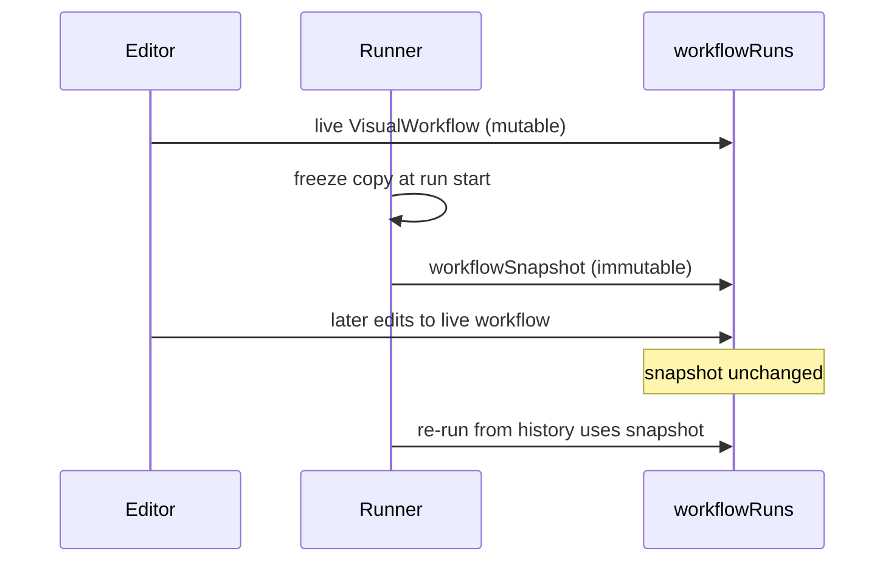
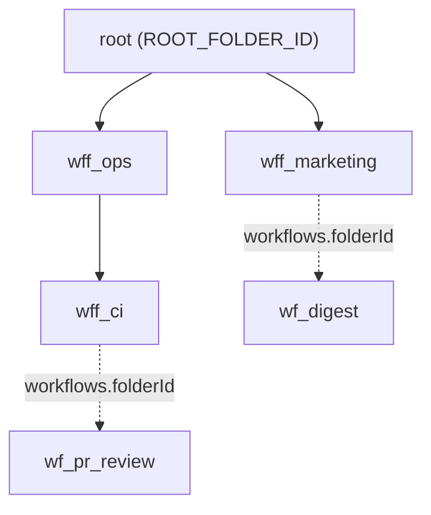
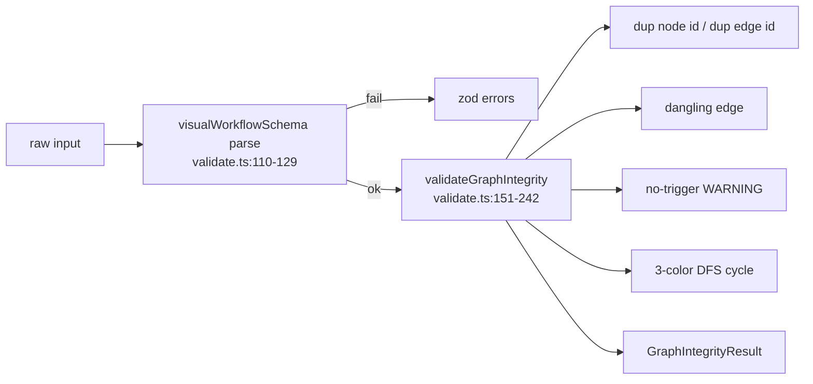

# 数据模型与定义

<Status variant="stable" />

<TLDR>
一个工作流就是由 `WorkflowNode` 与 `WorkflowEdge` 组成的 `VisualWorkflow` 图。每个节点 `type` 是 153 个 `WorkflowNodeKind` 字面量之一，归入 7 大类。持久化截至 schema v156 涉及 13 张工作流 Dexie 表，包括 immutable version/deployment/invocation 与 durable waitpoint/event。执行前会依次完成 Zod 和图完整性校验。
</TLDR>

<StatGrid>
  <Stat label="节点种类" value="153" hint="across 7 categories" />
  <Stat label="Schema 版本" value="1" hint="VisualWorkflowSchemaVersion" />
  <Stat label="Dexie 表" value="13" hint="v22 to v156" />
  <Stat label="内置模板" value="22" hint="10 + 4 + 8" />
  <Stat label="默认超时" value="600000ms" hint="10 minute run cap" />
  <Stat label="默认重试" value="3" hint="exponential backoff" />
</StatGrid>

## 图类型

`VisualWorkflow`（`types/workflow/visual.ts:242-285`）是工作流定义唯一的持久化权威。它承载标识、节点与边数组、运行期设置、声明式凭据引用、变量、pin 数据、静态数据、编辑器视口以及文件夹归属。

| 字段 | 来源 | 用途 |
| --- | --- | --- |
| `id` | visual.ts:242-285 | `wf_` 前缀的主键 |
| `schemaVersion` | visual.ts:235 | 每张持久化图都是字面量 `1` |
| `name` | visual.ts:242-285 | 显示名，在 Zod 层最长 120 字符 |
| `nodes` | visual.ts:242-285 | `WorkflowNode[]` |
| `edges` | visual.ts:242-285 | `WorkflowEdge[]` |
| `settings` | visual.ts:338-354 | 错误策略、超时、并发、重试、时区 |
| `credentials` | visual.ts:364-369 | `WorkflowCredentialRef[]` —— 仅引用，从不存值 |
| `variables` | visual.ts:242-285 | 工作流级变量 |
| `pinData` | visual.ts:242-285 | 仅编辑器使用的 pin 步骤输出 |
| `staticData` | visual.ts:242-285 | 跨运行持久化的临时状态 |
| `viewport` | visual.ts:371-375 | `{ x, y, zoom }` 编辑器相机 |
| `folderId` | visual.ts:259-265 | `ROOT_FOLDER_ID` 哨兵，从不为 null |
| `complexity` | visual.ts:242-285 | starter / intermediate / advanced 标签 |
| `isTemplate` / `isBuiltIn` | visual.ts:242-285 | 模板与内置标志 |

```ts
// types/workflow/visual.ts:287-323 — node and node data
export interface WorkflowNode<TParams = Record<string, unknown>> {
  // id (n_ prefix), type: WorkflowNodeKind, position, data: WorkflowNodeData<TParams>
}
export interface WorkflowNodeData<TParams> {
  label?: string
  params?: TParams
  notes?: string
  credentialRefs?: string[]
  disabled?: boolean
  authoredBy?: "ai" | "user"
  // [key: string]: unknown  — index signature required by React Flow v12
}
```

`WorkflowNodeData`（`types/workflow/visual.ts:305-323`）刻意声明了一个开放的 `[key: string]: unknown` 索引签名，正是为了让 React Flow v12 能在不引发 TypeScript 摩擦的情况下挂载自己的数据。边是 `WorkflowEdge`（`types/workflow/visual.ts:325-334`），其 `WorkflowEdgeKind`（`types/workflow/visual.ts:336`）取值为 `default | conditional | parallel | loop | error` 之一。

## 153 种节点的分类体系

`WorkflowNodeKind` 是 153 个字符串字面量的联合类型，由运行期数组 `WORKFLOW_NODE_KINDS` 镜像。`workflowNodeCategory()` 将每个 kind 归入 7 个分类之一，并把 `pattern.*` 映射到 `action`。

```ts
// types/workflow/visual.ts:130-141
export function workflowNodeCategory(kind: WorkflowNodeKind): WorkflowNodeCategory {
  const head = kind.split(".")[0]
  if (head === "trigger") return "trigger"
  if (head === "action") return "action"
  if (head === "ai") return "ai"
  if (head === "flow") return "flow"
  if (head === "data") return "data"
  if (head === "io") return "io"
  if (head === "pattern") return "action"
  return "annotation"
}
```

| 类别 | 数量 | 种类 |
| --- | --- | --- |
| trigger | 9 | `trigger.manual`, `trigger.cron`, `trigger.connector.inbound`, `trigger.chat.message`, `trigger.webhook`, `trigger.github.webhook`, `trigger.team`, `trigger.goal.completed`, `trigger.desktop.event` |
| action | 40 | `character.send/create/update`; `team.run/create/update/task.dispatch`; `skill.invoke/upsert`; `twin.rag/ingest`; `connector.send/draft`; `mcp.invokeTool`; `plugin.invoke`; `github.openPr/closePr/mergePr/reviewPr/reviewPrInline/commentPr/commentIssue/labelIssue/closeIssue/createRelease/generateChangelog/pushTag/runIssueLoop`; `desktop.screenshot/findElement/readTree/click/type/keys/invokePattern/windowFocus/windowClose/windowResize/wait`; `system.terminal` |
| ai | 4 | `ai.prompt`, `ai.classify`, `ai.extract`, `ai.embed` |
| flow | 8 | `flow.branch`, `flow.switch`, `flow.split`, `flow.join`, `flow.loop`, `flow.wait`, `flow.set`, `flow.subworkflow` |
| data | 3 | `data.transform`, `data.code`, `data.template` |
| io | 2 | `io.http`, `io.webhook.respond` |
| annotation | 2 | `annotation.note`, `annotation.group` |
| pattern | 6 | `pattern.multi-modal-sweep`, `pattern.loop-until-dry`, `pattern.adversarial-verify`, `pattern.judge-panel`, `pattern.completeness-critic`, `pattern.synthesize` |

这 6 个 `pattern.*` 种类仅供合成器使用 —— 它们由 AI 规划器产出，并在执行前被展开；`workflowNodeCategory()` 将其报告为 `action`，因此它们共享 action 的样式与路由。其语义见 [./ai-pattern-nodes](./ai-pattern-nodes)，按种类的配置注册表见 [./node-system](./node-system)。

## 设置、重试与默认值

`WorkflowSettings`（`types/workflow/visual.ts:338-354`）持有 `errorPolicy`、`timeoutMs`、`concurrency`、可选的 `maxConcurrency`、`retryDefaults`（`WorkflowRetryPolicy`，`types/workflow/visual.ts:356-362`）以及可选的 `timezone`。这里有两个不同的并发旋钮：`concurrency` 限制工作流的并发**运行数**，而 `maxConcurrency` 限制单次运行内的并发**节点数**。

```ts
// types/workflow/visual.ts:633-638
export const DEFAULT_WORKFLOW_SETTINGS = {
  errorPolicy: "stop",
  timeoutMs: 600_000,
  concurrency: 1,
  retryDefaults: { attempts: 3, backoff: "exponential", baseMs: 1000, maxMs: 30_000 },
}
```

`DEFAULT_RETRY_POLICY`（`types/workflow/visual.ts:640-645`）单独提供了相同的重试结构。`WorkflowCredentialRef`（`types/workflow/visual.ts:364-369`）仅存引用标识符 —— 密钥值绝不会进入 `VisualWorkflow`。

NDV 仅编辑器使用的形状 `NodeIoSource`、`NodeIoOutput`、`NodeIoData` 与 `SchemaRow`（`types/workflow/visual.ts:647-706`）描述了检查器的输入与输出面板，**不会**持久化到任何表。它们如何被填充见 [./ui-runs](./ui-runs)。

## 运行行与不可变快照

`WorkflowRunRow`（`types/workflow/visual.ts:443-470`）记录一次执行：`status`（`RunStatus`，`types/workflow/visual.ts:381-388`）、`triggerKind`、`lastCompletedStepId`、`triggeredBy`（`WorkflowTriggeredFrom`，`types/workflow/visual.ts:426-431`，source 为 `im | ui | api`）以及一份冻结的 `workflowSnapshot`。

```ts
// types/workflow/visual.ts:456-460
workflowSnapshot: VisualWorkflow
// Frozen workflow definition at run start. Editing the live workflow doesn't
// retroactively change this run; re-runs from history use the snapshot.
```



`RunEventType`（`types/workflow/visual.ts:487-499`）枚举了 12 种事件类型，包括 `step.long_running.checkpoint` 与 `step.long_running.progress`，存为 `WorkflowRunEventRow`（`types/workflow/visual.ts:503-512`）。步骤管线类型 `StepExecutionContext`（`types/workflow/visual.ts:538-563`）与 `StepExecutionResult`（`types/workflow/visual.ts:569-575`）喂给 [./runtime-execution](./runtime-execution)。触发器注册使用 `RegisterTriggerInput`（`types/workflow/visual.ts:602-627`），其 `signatureMode` 为 `cognia | github` 并带 HMAC 密钥；见 [./triggers-rust](./triggers-rust)。

## 文件夹与桶文件

`WorkflowFolder`（`types/workflow/folder.ts:16-28`）为每个工作流提供树状归属：`id`（`wff_` 前缀）、`name`、`parentFolderId`、时间戳、可选的 `color` 与 `icon`。`ROOT_FOLDER_ID` 是字面量 `"root"`（`types/workflow/folder.ts:14`），`folderId` 以非空字符串存储（`types/workflow/visual.ts:259-265`），因为 IndexedDB 无法索引或匹配 `null` 键。



`types/workflow/index.ts` 是一个桶文件（`types/workflow/index.ts:18-19`），同时重新导出旧的 PPT `./workflow` 家族与 `./visual` 图类型；这两个命名空间被设计为零名称冲突。

## 校验流水线

`validateWorkflow(raw)`（`lib/workflow/definition/validate.ts:248-265`）先跑 Zod 解析，再跑图完整性分析，返回一个判别式结果。



Zod 层：`workflowNodeKindSchema`（`lib/workflow/definition/validate.ts:20-29`）接受任意已知种类**或**匹配 `/^[a-z][a-z0-9-]*(\.[a-z][a-z0-9-]*)+$/` 的插件式模式；`nodeSchema`（`lib/workflow/definition/validate.ts:44-52`）要求 `typeVersion` 为 int >= 1；`settingsSchema`（`lib/workflow/definition/validate.ts:75-90`）把 `timeoutMs` 限制在 1..24h、`concurrency` 在 1-100；`visualWorkflowSchema`（`lib/workflow/definition/validate.ts:110-129`）把 `schemaVersion` 钉为 `z.literal(1)`，并把 `name` 限制为 120。

一处已知漂移：`edgeSchema`（`lib/workflow/definition/validate.ts:54-66`）只接受 `["default","conditional","parallel","loop"]`，**省略**了 `WorkflowEdgeKind`（`types/workflow/visual.ts:336`）在 TS 层允许的 `"error"` 种类。

图完整性（`lib/workflow/definition/validate.ts:151-242`）会标记重复节点 id（L156-162）、重复边 id 与悬挂边（L165-177），仅对无触发器发出**警告**（L180-183），并运行三色 DFS 环检测（L194-228）。仅当环上某节点是 `flow.loop` 或 `flow.wait` 时才允许成环：

```ts
// lib/workflow/definition/validate.ts:229-239
if (cycleNodes.size > 0) {
  const allowed = wf.nodes.some(
    (n) => cycleNodes.has(n.id) && (n.type === "flow.loop" || n.type === "flow.wait")
  )
  if (!allowed) {
    errors.push(`Cycle detected through nodes: ${[...cycleNodes].join(", ")}. Add a flow.loop or flow.wait node to make the back-edge explicit.`)
  }
}
```

## Dexie 表

13 张工作流表覆盖 v22 的原始图/运行存储、v148 的 immutable deployment control plane，以及 v156 的 durable waitpoint store。合并后的索引与兼容升级以 `lib/db/schema.ts` 为准。

| 表 | 版本 | 索引串 |
| --- | --- | --- |
| `workflows` | v22（v52 重新声明） | `&id, name, updatedAt, createdAt, isBuiltIn, isTemplate, *tags, schemaVersion[, folderId @v52]` |
| `workflowRuns` | v22 | `&id, workflowId, status, startedAt, completedAt, [workflowId+startedAt], [workflowId+status]` |
| `workflowRunEvents` | v22 | `&id, runId, [runId+ts], stepId, [runId+stepId], type` |
| `workflowTriggers` | v22 | `&id, workflowId, kind, enabled, [workflowId+enabled], cron, nextFireAt` |
| `workflowViewportBookmarks` | v35 | `&id, workflowId, [workflowId+createdAt]` |
| `workflowProposalHistory` | v42 | `&id, workflowId, createdAt, [workflowId+createdAt]` |
| `workflowFolders` | v52 | `&id, name, parentFolderId, [parentFolderId+name], updatedAt, createdAt` |
| `workflowFanoutSubscriptions` | v56 | `&id, workflowId, [workflowId+enabled], enabled, adapterId, conversationKey, createdAt` |
| `workflowVersions` | v148 | `&id, workflowId, [workflowId+sequence], digest, createdAt` |
| `workflowDeployments` | v148 | `&id, &[accountId+workflowId+environment], workflowId, environment, versionId, status, updatedAt` |
| `workflowInvocations` | v148 | `&id, &[accountId+entrypoint+deploymentId+caller+idempotencyKey], deploymentId, versionId, runId, status, createdAt` |
| `workflowWaitpoints` | v156 | `&id, status, kind, runId, workflowId, stepId, key, expiresAt, [kind+status], [key+status], [runId+status]` |
| `workflowWaitEvents` | v156 | `&id, key, correlationId, emittedAt, expiresAt, consumedByWaitpointId, [key+emittedAt]` |

```ts
// 原始 v22 bootstrap；后续版本扩展到 v156。
this.version(22).stores({
  workflows: "&id, name, updatedAt, createdAt, isBuiltIn, isTemplate, *tags, schemaVersion",
  workflowRuns: "&id, workflowId, status, startedAt, completedAt, [workflowId+startedAt], [workflowId+status]",
  workflowRunEvents: "&id, runId, [runId+ts], stepId, [runId+stepId], type",
  workflowTriggers: "&id, workflowId, kind, enabled, [workflowId+enabled], cron, nextFireAt",
})
```

IndexedDB 的注意事项塑造了这些索引：布尔值不可靠地可索引，因此 `isTemplate` 的过滤在内存中完成；`folderId` 使用 `"root"` 哨兵而非 `null`。

## CRUD 层

`lib/db/workflows.ts` 是唯一受认可的变更面。`newWorkflowId()`（`lib/db/workflows.ts:22-24`）铸造 `wf_` + base36(now) + random。读：`listWorkflows()`（L30-32，按 name 排序）、`listWorkflowsByUpdated()`（L34-36）、`getWorkflow(id)`（L46-48）、`listWorkflowRuns(query)`（L132-142）。写：`createWorkflow(draft)`（L67-89，`folderId` 默认为 `ROOT_FOLDER_ID`，强制 `isBuiltIn:false`）、`updateWorkflow(id,patch)`（L100-102，自动顶起 `updatedAt`，调用方绝不可传它）、`replaceWorkflow(wf)`（L109-115，整体 put，id 缺失则抛错）。

```ts
// lib/db/workflows.ts:144-149
export async function deleteWorkflow(id: string): Promise<void> {
  const existing = await getDb().workflows.get(id)
  if (existing?.isBuiltIn) { throw new Error("Built-in workflows cannot be deleted. Duplicate first.") }
  await getDb().workflows.delete(id)
  await recordTombstones("workflows", [id])
}
```

`deleteWorkflow(id)`（`lib/db/workflows.ts:144-165`）拒绝删除内置，记录 v61 同步墓碑，并级联删除 fan-out 订阅。`duplicateWorkflow(id)`（L172-187）以新 id 与 "(copy)" 后缀克隆，始终设 `isBuiltIn:false` 与 `isTemplate:false`，并保留节点 id。`seedBuiltInWorkflows()`（L207-216）批量 put 并打上 `isBuiltIn:true`。辅助函数：`regenerateNodeIds(w)`（L238-252）、`moveWorkflowToFolder` / `moveWorkflowsToFolder`（L263-279）、`addTagToWorkflows`（L283-297）、`getRunCounts(ids)`（L306-321，记忆化 30s）、`getRecentlyFailedWorkflowIds(sinceMs)`（L333-341）。编辑器如何封装这些见 [./editor-store](./editor-store)。

## 22 个内置模板

模板拆为 10 + 4 + 8。`seed.ts` 工厂使用稳定的 `NOW = 1_730_000_000_000`（`lib/workflow/definition/seed.ts:21`），使重新播种保持哈希稳定。

```ts
// lib/workflow/definition/seed.ts:23-42
function template(partial): VisualWorkflow {
  return { id: partial.id, schemaVersion: 1, name: partial.name, description: partial.description,
    icon: partial.icon, tags: partial.tags ?? [], isTemplate: true, isBuiltIn: true,
    createdAt: NOW, updatedAt: NOW, nodes: partial.nodes, edges: partial.edges,
    settings: DEFAULT_WORKFLOW_SETTINGS, viewport: { x: 0, y: 0, zoom: 1 } }
}
```

`buildBuiltInWorkflowTemplates()`（`lib/workflow/definition/seed.ts:719-748`）标注复杂度（前 4 个 starter、接下来 5 个 intermediate、`subworkflowOrchestrator` 为 advanced），然后追加 4 个 B-pack 模板与 `buildGithubDeliveryTemplates()`（8 个）。`seedBuiltInWorkflowTemplates()`（L755-760）是幂等的。

| 套件 | 来源 | 模板 |
| --- | --- | --- |
| Core（10） | seed.ts | `helloWorld`（L44-93）、`httpDataPipeline`（L95-160）、`conditionalReply`（L162-235）、`skillBundle`（L237-288）、`inboundTriage`（L292-376）、`dailyDigest`（L378-442，cron `0 9 * * 1-5`）、`ragFaq`（L444-511）、`webhookEcho`（L513-565）、`loopOverItems`（L567-631，`flow.loop` forEach maxIterations 100）、`subworkflowOrchestrator`（L633-712） |
| B-pack（4） | templates/*.ts | `githubIssueToPrTemplate`、`httpRetryFallbackTemplate`、`inboxTriageTwinTemplate`、`parallelAnalystsTemplate` |
| GitHub（8） | seed-github.ts | `prAutoReview`（L38-93）、`issueTriage`（L96-147）、`issuePrLoop`（L150-185）、`releaseConventional`（L188-239，cron `0 18 * * *`）、`releaseContinuous`（L242-311）、`releaseManual`（L314-348）、`ciFailureDiagnosis`（L351-405）、`prInlineReview`（L412-451） |

四个进阶 B-pack 模板各自演示一种不同的形态：

| 模板 | 文件 | Id | 形态 |
| --- | --- | --- | --- |
| `githubIssueToPrTemplate` | github-issue-to-pr.ts:20-210 | `wf_builtin_github_issue_to_pr` | 11 节点（最长链）：`github.webhook(issues.labeled)` -> `ai.extract` -> `openPr(draft)` -> `desktop.screenshot` -> `mcp.invokeTool(test-runner)` -> `flow.branch` -> pass: `commentPr` -> `mergePr(squash)` -> `closeIssue` / fail: `commentPr` -> `flow.set` |
| `httpRetryFallbackTemplate` | http-retry-fallback.ts:17-146 | `wf_builtin_http_retry_fallback` | 8 节点线性：`manual` -> `io.http` -> `flow.branch(status>=500)` -> `flow.wait(2000)` -> `io.http(retry)` -> `flow.branch` -> `ai.prompt` -> `connector.send` |
| `inboxTriageTwinTemplate` | inbox-triage-twin.ts:18-191 | `wf_builtin_inbox_triage_twin` | 10 节点：`connector.inbound` -> `data.code(PII redaction, timeoutMs 2000)` -> `twin.rag(topK 5)` -> `ai.classify` -> `flow.switch(4 cases)` -> 3x `character.send` + 1x `team.task.dispatch` -> `flow.set` |
| `parallelAnalystsTemplate` | parallel-analysts.ts:18-210 | `wf_builtin_parallel_analysts` | 12 节点：`manual` -> `data.transform` -> `flow.split` -> 4x `ai.prompt(correctness/security/performance/ux)` -> `flow.join(all)` -> `ai.classify(vote)` -> `data.template` -> `character.send` -> `flow.set` |

`buildGithubDeliveryTemplates()`（`lib/workflow/definition/seed-github.ts:453-464`）通过 `tmpl()` 工厂（`lib/workflow/definition/seed-github.ts:17-35`）构建其 8 个条目。

## 坑点

- **不可变运行快照** —— 编辑活动工作流绝不会改写已存的 `workflowSnapshot`；历史重跑回放冻结副本（`types/workflow/visual.ts:456-460`）。
- **内置不可删除** —— `deleteWorkflow` 对 `isBuiltIn` 抛错；复制会剥除 `isBuiltIn` 与 `isTemplate`（`lib/db/workflows.ts:144-187`）。
- **稳定的播种时间戳** —— `NOW = 1_730_000_000_000` 使重新播种保持哈希稳定（`lib/workflow/definition/seed.ts:21`）。
- **IndexedDB 布尔/null 注意事项** —— `isTemplate` 在内存中过滤；`folderId` 使用 `"root"` 哨兵，因为 null 键不可索引（`types/workflow/visual.ts:259-265`）。
- **环需要显式回边节点** —— 仅 `flow.loop` 或 `flow.wait` 能使环合法化（`lib/workflow/definition/validate.ts:229-239`）。
- **边 "error" 种类漂移** —— TS 的 `WorkflowEdgeKind` 允许 `error`，但 `edgeSchema` 拒绝它（`lib/workflow/definition/validate.ts:54-66`）。
- **两个并发旋钮** —— `concurrency` = 并发运行数，`maxConcurrency` = 运行内节点数（`types/workflow/visual.ts:338-354`）。
- **`updatedAt` 由属主管理** —— 切勿传给 `updateWorkflow`（`lib/db/workflows.ts:100-102`）。
- **Id 前缀** —— `wf_` 工作流、`n_` 节点、`wff_` 文件夹、`vb_` 视口书签、`wfsub:` fan-out 订阅。
- **`pattern.*` 仅合成器使用** —— 由规划器产出，在运行前展开。

另见：[./index](./index)、[./node-system](./node-system)、[./runtime-execution](./runtime-execution)、[./ai-pattern-nodes](./ai-pattern-nodes) 以及 [../../adr/0011-workflows-subsystem](../../adr/0011-workflows-subsystem)。
