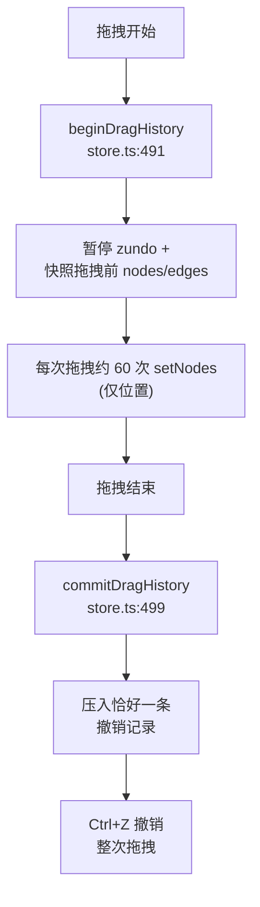
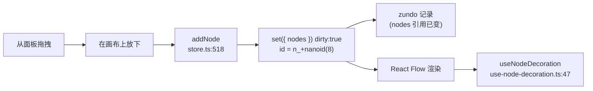
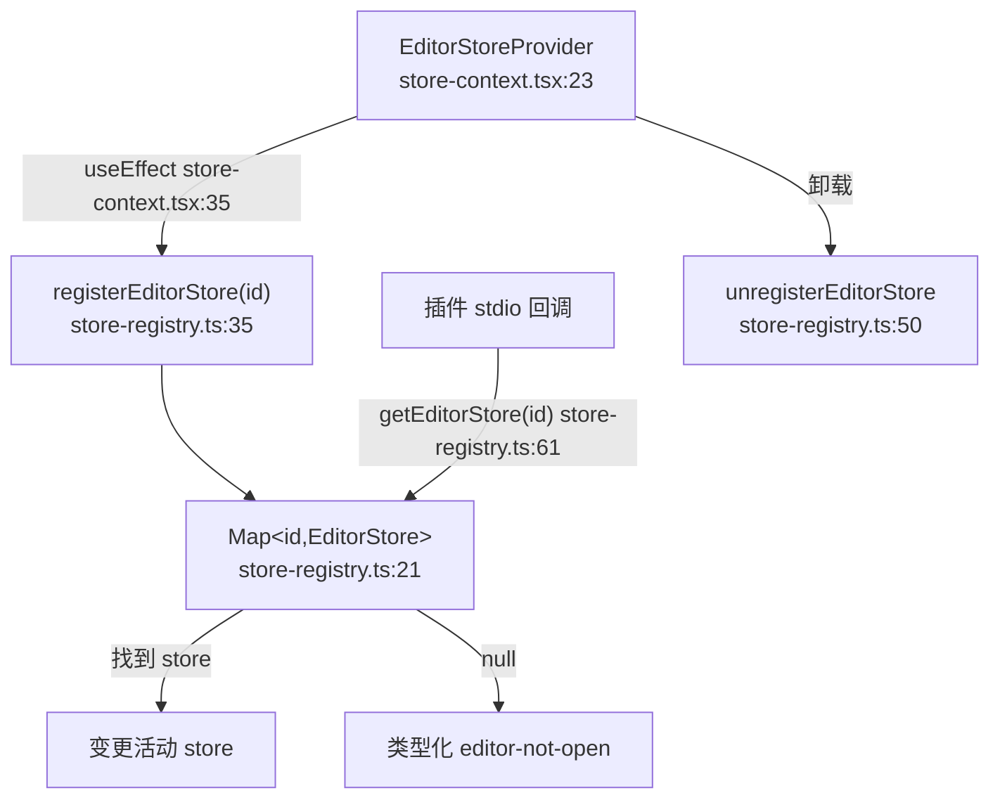
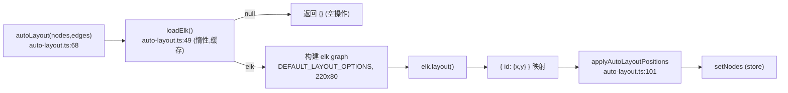

# 编辑器 store 与画布机制

<Status variant="stable" />

<TLDR>
每个打开的工作流都会由 `createEditorStore(initial)`（`lib/workflow/editor/store.ts:389`）创建一个 Zustand store，并用 `zundo` temporal 包裹，使得只有 `nodes`+`edges` 可撤销（`store.ts:981`，`EDITOR_HISTORY_LIMIT = 100` 见 `store.ts:387`）。图变更器（`addNode` `store.ts:518`、`updateNodeData` `store.ts:551`、`connect` `store.ts:571`）会置 `dirty:true` 并压入历史；实时运行映射（`runStatusByStepId` `store.ts:96`、稀疏的 `validationByStepId` `store.ts:99`）和临时偏好被刻意设为**不可撤销**。拖拽通过 `beginDragHistory`/`commitDragHistory`（`store.ts:491`/`store.ts:499`）合并为**恰好一条**撤销记录，因为一次朴素拖拽会发出约 60 次 `setNodes`，否则一两次拖拽就会耗尽历史。一个 React 之外的 `Map<id,EditorStore>`（`store-registry.ts:21`）让插件 stdio 回调能触达活动 store；纯辅助函数（`auto-layout.ts`、`connection-validator.ts`、`alignment-guides.ts`、`edge-routing.ts`、`performance-tier.ts`）承载全部画布几何。表达式与 AI 提案模块位于同级页面——见 [./expressions-copilot](./expressions-copilot)。
</TLDR>

<StatGrid>
  <Stat label="历史上限" value="100" hint="EDITOR_HISTORY_LIMIT store.ts:387" />
  <Stat label="可撤销切片" value="nodes + edges" hint="zundo partialize store.ts:981" />
  <Stat label="自动平衡阈值" value="80 节点" hint="AUTO_BALANCED_THRESHOLD" />
  <Stat label="默认节点尺寸" value="220 x 80" hint="auto-layout.ts:44" />
</StatGrid>

## 文件位置

| 文件 | 行数 | 职责 |
| --- | --- | --- |
| `lib/workflow/editor/store.ts` | 996 | 每工作流的 Zustand+zundo store：状态、变更器、历史合并 |
| `lib/workflow/editor/store-registry.ts` | 97 | React 之外的 `Map<id,EditorStore>`，供插件 stdio 触达 store |
| `lib/workflow/editor/store-context.tsx` | 61 | `EditorStoreProvider` + `useEditorStore` hook；把 store 镜像进注册表 |
| `lib/workflow/editor/workflow-editor-context.tsx` | 53 | 快捷动作上下文（`validate`/`explain`/`suggest`） |
| `lib/workflow/editor/react-flow-converter.ts` | 143 | `VisualWorkflow` ⇄ React Flow 节点/连线形态 |
| `lib/workflow/editor/auto-layout.ts` | 109 | 惰性 ELK 分层自动布局 |
| `lib/workflow/editor/connection-validator.ts` | 81 | 连线时的有序规则校验 |
| `lib/workflow/editor/clipboard.ts` | 180 | 复制/粘贴信封（`cognia.workflow.clipboard.v1`） |
| `lib/workflow/editor/align-distribute.ts` | 99 | 对齐 / 分布几何 |
| `lib/workflow/editor/alignment-guides.ts` | 254 | 基于有序索引的拖拽吸附辅助线 |
| `lib/workflow/editor/lasso.ts` | 99 | 多边形套索命中测试 |
| `lib/workflow/editor/edge-routing.ts` | 135 | 智能正交/贝塞尔连线路由 |
| `lib/workflow/editor/edge-index.ts` | 124 | WeakMap 连线邻接索引 |
| `lib/workflow/editor/node-index.ts` | 72 | WeakMap 节点按 id 索引 |
| `lib/workflow/editor/node-io-data.ts` | 165 | 输入/输出面板数据（pin 优先于 run） |
| `lib/workflow/editor/performance-tier.ts` | 111 | 档位 → 有效渲染标志 |
| `lib/workflow/editor/performance-tier-prefs.ts` | 21 | 从 `AppSettings` 读写档位 |
| `lib/workflow/editor/viewport-bookmarks-db.ts` | 72 | 视口书签（Dexie） |
| `lib/workflow/editor/use-node-decoration.ts` | 66 | 每节点 `useShallow` 装饰选择器 |
| `lib/workflow/editor/node-icons.ts` | 87 | 种类 → 图标映射 |
| `lib/workflow/editor/export-image.ts` | 94 | 经 `html2canvas` 导出 PNG |
| `lib/workflow/editor/persist-workflow.ts` | 28 | 保存流水线（`persistEditorWorkflow`） |
| `lib/workflow/editor/workflow-json.ts` | 40 | 单个工作流的 JSON 导入/导出 |

权威图类型为 `VisualWorkflow`（`types/workflow/visual.ts:242`）；见 [./data-model](./data-model)。节点种类语义见 [./node-system](./node-system)；执行见 [./runtime-execution](./runtime-execution)；周边 UI 见 [./ui-runs](./ui-runs)。

## Store 结构

`EditorState`（`store.ts:88-338`）分为四个区段。Store 类型（`store.ts:340`）是一个 `UseBoundStore` 与 `temporal: StoreApi<TemporalState<Pick<EditorState,"nodes"|"edges">>>` 的交集。

| 区段 | 成员 | 是否可撤销 |
| --- | --- | --- |
| 画布 | `nodes`/`edges`/`viewport`（来自 `EditorStateSnapshot` `store.ts:54`）、`baseWorkflow`（信封其余部分）、`selectedNodeIds`/`selectedEdgeIds`、`dirty`、`savedAt` `store.ts:88-94` | 仅 `nodes`+`edges` |
| 实时运行映射 | `runStatusByStepId`（`NodeRunStatus` `store.ts:66`）`store.ts:96`、仅保留错误节点的 `validationByStepId` `store.ts:99-103`、按引用比较的 Dexie 镜像 `lastRunByStepId` `store.ts:104-110` | 否 |
| 临时偏好 | `performanceTier` 默认 `"auto"` `store.ts:120`、`isDraggingAny`、`snapToGrid` 默认 `true`、`hoveredNodeId`/`hoveredEdgeId`、内联编辑标志、`palettePrefillPosition`、`spotlightedNodeId`/`pulseNode`、`connectionState`（`store.ts:79`） | 否 |
| 带外信号 | `requestedContextMenu` `store.ts:185`、`requestedRunFromStepId` `store.ts:200`、`requestedRunSingleStepId` `store.ts:209`——各为一组 request/clear 三件套 | 否 |

`NodeRunStatus`（`store.ts:66`）为 `idle | running | succeeded | failed | skipped | waiting`。`validationByStepId` 是**稀疏**的——只保留错误节点，因此缺席即代表"有效"。`labelByKind`（`store.ts:344`）/ `defaultLabelFor`（`store.ts:360`）为新节点命名；`shallowEqualValidation`（`store.ts:369`）避免无谓的校验抖动。

## 图变更器（可撤销）

| 变更器 | 行号 | 效果 |
| --- | --- | --- |
| `setNodes` / `setEdges` / `setViewport` | `store.ts:487-489` | 替换数组 / 视口，置 `dirty:true` |
| `addNode` | `store.ts:518` | 追加节点；id 前缀 `n_` + `nanoid(8)` `store.ts:519` |
| `removeNodes` | `store.ts:541` | 删节点**并**删其关联连线 |
| `updateNodeData` | `store.ts:551` | 对单个节点的 `data` 浅合并 |
| `updateNodeDataBatch` | `store.ts:560` | 一次 set 内多节点 data 补丁 |
| `connect` | `store.ts:571` | 加连线；id 前缀 `e_` + `nanoid(8)` `store.ts:572` |
| `updateEdgeData` / `replaceEdge` / `removeEdges` | `store.ts:585` / `598` / `608` | 连线编辑 |
| `duplicateNodes` / `pasteFromEnvelope` | `store.ts:692` / `706` | 效率类插入 |
| `applyProposalOps` | `store.ts:719` | 应用 AI 批量（见 [./expressions-copilot](./expressions-copilot)） |
| `groupSelected` | `store.ts:880` | 包裹选区；**先**插入分组节点 `store.ts:905` |

```ts
// lib/workflow/editor/store.ts:551
updateNodeData: (id, patch) => {
  set({
    nodes: get().nodes.map((n) =>
      n.id === id ? { ...n, data: { ...n.data, ...patch } } : n,
    ),
    dirty: true,
  })
}
```

每个产出数组的变更器都会复制数组，因为 temporal 相等性是**数组引用同一性**（见下文）。就地修改会悄无声息地破坏撤销。

## zundo temporal 配置与历史上限

```ts
// lib/workflow/editor/store.ts:981
{
  partialize: (state) => ({ nodes: state.nodes, edges: state.edges }),
  equality: (a, b) => a.nodes === b.nodes && a.edges === b.edges,
  limit: EDITOR_HISTORY_LIMIT, // = 100  (store.ts:387)
}
```

只有 `nodes` 和 `edges` 被追踪——`viewport`、选区、运行状态与校验被刻意设为**不可**撤销。`equality` 比较数组引用，因此返回同一数组引用的动作**不**记录历史条目，而复制数组的动作恰好记录一条。`loadWorkflow`（`store.ts:667`）重置状态并在 `store.ts:681` 清空 temporal 历史。

### 撤销 / 重做与拖拽合并



```ts
// lib/workflow/editor/store.ts:510
const past = temporalStore
  .getState()
  .pastStates.concat({ nodes: snap.nodes, edges: snap.edges })
while (past.length > EDITOR_HISTORY_LIMIT) past.shift()
temporalStore.setState({ pastStates: past, futureStates: [] })
```

拖拽前的快照保存在一个**闭包引用**里（`dragHistorySnapshot` `store.ts:393`），而非 store 状态，因此它绝不会触发画布重渲染。若不合并，一次拖拽会发出约 60 次 `setNodes`，一两次就会耗尽 100 条历史预算。同样的单次 `set()` 纪律也适用于 `applyProposalOps`（`store.ts:868`）：一次 `set()` 同时落入 `nodes`/`edges`/`selected`/`validation`/`dirty`，因此单次 Ctrl+Z 即可撤销整个 AI 提案。

## 添加节点流程



`useNodeDecoration`（`use-node-decoration.ts:47`）使用 `useShallow` 选择器，**只**读取该节点在 `runStatusByStepId`/`validationByStepId`/`lastRunByStepId` 中的槽位及其 `pinData`（搭配冻结的 `EMPTY_DECORATION` `use-node-decoration.ts:40`），因此无关变更绝不会重渲染无关节点。

## 信封、生命周期与运行状态

信封变更器 `setName`/`setDescription`/`setSettings`/`setVariables`/`setCredentials` 跨越 `store.ts:622-649`；`pinNodeData`/`unpinNodeData`（`store.ts:650-665`）将固件存于 `baseWorkflow.pinData`。生命周期：`loadWorkflow` `store.ts:667`（重置 + 清空历史）、`toWorkflow` `store.ts:684`、`markSaved`/`resetDirty` `store.ts:689-690`。运行状态 setter **不**可撤销：`setRunStatus`/`setRunStatusBatch`/`clear` `store.ts:920-926`、`setValidation`/`Batch`/`clear` `store.ts:928-938`、`setLastRunByStepId` `store.ts:939`、`revalidateNode` `store.ts:947`、`revalidateAll` `store.ts:967`。选区位于 `store.ts:618-620`，`selectAll` 位于 `store.ts:912`。

## 每工作流 store 注册



注册表是一个普通的 `Map<id,EditorStore>`（`store-registry.ts:21`），带 `listeners`（`store-registry.ts:22`）。`registerEditorStore`（`store-registry.ts:35`）幂等，HMR 时会告警并覆盖；`unregisterEditorStore`（`store-registry.ts:50`）；`getEditorStore`（`store-registry.ts:61`）返回 `null`，使插件工具得到一个类型化的 *editor-not-open* 错误而非崩溃；`listEditorStores`（`store-registry.ts:71`）、`subscribeEditorStores`（`store-registry.ts:81`）、`__resetRegistryForTesting`（`store-registry.ts:93`）。生命周期由 `EditorStoreProvider`（`store-context.tsx:23`）拥有，其 `useEffect`（`store-context.tsx:35-42`）将 store 以 `baseWorkflow.id` 为键镜像进注册表，并在卸载时清理。`useEditorStoreOrNull`（`store-context.tsx:46`）与 `useEditorStore`（`store-context.tsx:54`，在 provider 之外抛错）读取它。快捷动作上下文（`workflow-editor-context.tsx`）经 `WorkflowEditorProvider`（`workflow-editor-context.tsx:36`）/ `useWorkflowEditor`（`workflow-editor-context.tsx:51`）暴露 `WorkflowQuickActionKind` `validate | explain | suggest`（`workflow-editor-context.tsx:21`）。

## React Flow 转换

`workflowToReactFlow(wf)`（`react-flow-converter.ts:51`）将 `kind = n.type` 及 `typeVersion` 摊平进节点 `data`；`reactFlowToWorkflow(base,nodes,edges,viewport)`（`react-flow-converter.ts:93`）为其逆操作；`toWorkflowViewport`（`react-flow-converter.ts:140`）；`DEFAULT_VIEWPORT`（`react-flow-converter.ts:44`）。

```ts
// lib/workflow/editor/react-flow-converter.ts:65
// 仅当连线 kind 表明时才取 "conditional"，否则为 "default"
type: e.data?.kind === "conditional" ? "conditional" : "default"
```

## 自动布局流水线



`loadElk()`（`auto-layout.ts:49`）动态 import `elkjs/lib/elk.bundled.js`（约 250KB，惰性），缓存于 `cachedElk`（`auto-layout.ts:47`），失败时返回 `null`。`autoLayout`（`auto-layout.ts:68`）在 ELK 缺失或图为空时返回 `{}`。默认值为 `DEFAULT_NODE_WIDTH = 220` / `HEIGHT = 80`（`auto-layout.ts:44-45`）。

```ts
// lib/workflow/editor/auto-layout.ts:35
DEFAULT_LAYOUT_OPTIONS = {
  "elk.algorithm": "layered",
  "elk.direction": "RIGHT",
  "elk.layered.spacing.nodeNodeBetweenLayers": "120",
  "elk.spacing.nodeNode": "60",
  "elk.layered.nodePlacement.bk.fixedAlignment": "BALANCED",
  "elk.layered.crossingMinimization.semiInteractive": "true",
}
```

## 连线校验

`validateConnection(params,nodes,edges)`（`connection-validator.ts:42`）返回 `ValidationResult`（`connection-validator.ts:40`），并**按顺序**检查规则：缺失端点（`:47`）；自环（`:50`）；端点不在图中（`:55`）；目标 kind 以 `trigger.` 开头（`:58`）；端点为 `annotation.note`/`group` 节点（`:61`）；重复连线（`:69`）。

```ts
// lib/workflow/editor/connection-validator.ts:58
if (target.data.kind.startsWith("trigger."))
  return { valid: false, reason: "Triggers are sources only." }
```

## 剪贴板、对齐与套索

`clipboard.ts` 使用格式 `cognia.workflow.clipboard.v1`（`clipboard.ts:16`）。`cloneNodesAndEdges(...,offset={x:24,y:24})`（`clipboard.ts:46`）重映射 id、丢弃子集外的连线、剥离 `selected`/`dragging`；`buildClipboardEnvelope`（`:89`）、`serializeClipboard`（`:106`）、`parseClipboard`（`:116`，畸形时返回 `null`）、`rehydrateFromEnvelope`（`:134`）、`selectionBounds`（`:151`）。

`align-distribute.ts`：`computeAlign(rects,op)`（`align-distribute.ts:29`）需 ≥2 且对齐到包围盒；`computeDistribute(rects,axis)`（`:68`）需 ≥3 且均衡间隙。

`alignment-guides.ts`：`DEFAULT_TOLERANCE = 4`（`:50`）；`buildAlignmentIndex(peers)`（`:104`）每次拖拽以 `O(n log n)` 构建一次；`lowerBound`（`:124`）为二分查找；`computeAlignmentGuides(dragged,peersOrIndex,tolerance=4)`（`:159`）每轴最多返回一条辅助线，结果为 `GuidesResult`（`:40`，`vertical[]`/`horizontal[]`/`snap:{dx,dy}`）。

`lasso.ts`：`isPointInPolygon`（`:19`，射线法）、`rectIntersectsPolygon`（`:39`）、`nodeIdsInPolygon(nodes,polygon,options)`（`:79`，默认节点矩形 `240x80`）。

## 连线路由与索引

`computeSmartRoute(input)`（`edge-routing.ts:57`）接收 `RouteInputs`（`:26`，惰性 `getNodes` 阻挡物来源、`cornerRadius` 默认 `8`），返回 `RouteResult`（`:44`），其中 `ORTHOGONAL_MIN_DELTA = 60`（`:51`）。它从三个分支择一：水平 L 弯（`:65`）、垂直 L 弯（`:86`）、或贝塞尔回退（`:107`）并带单一阻挡物规避（`:119`）。`getNodes()` 仅在贝塞尔分支中被调用（`:120`）。

`edge-index.ts` 维护一个以连线数组同一性为键的 WeakMap `indexCache`（`:34`），因此只在 store 产出新数组时才重建：`buildEdgeIndex`（`:41`）、`getEdgeIndex`（`:62`）、`getEdgeById`（`:71`）、`getOutgoingEdgeIds`（`:84`）、`getIncomingEdgeIds`（`:95`）、`hasEdgeBetween(from,to)`（`:106`）、冻结的 `EMPTY_ID_ARRAY`（`:123`）。`node-index.ts` 经 WeakMap（`:33`）为节点做镜像：`buildNodeIndex`（`:44`，重复 id 时后者胜出）、`getNodeIndex`（`:57`）、`getNodeById`（`:66`）。

## I/O 面板数据

`node-io-data.ts`：`pickValue`（`:44`）让固定的固件**优先于**运行值（来源 `"pin" | "run" | "none"`）；`resolveNodeIo(input)`（`:59`）产出选中节点的 Output，外加按连线顺序去重的直接上游 Inputs；`toItems`（`:94`）；`typeOf`（`:99`）；`sampleOf`（`:109`，截断 >40 字符的样例）；`flattenSchema`（`:133`）搭配 `FlattenSchemaOptions`（`:121`，`maxDepth 4`、`maxRows 200`）。

## 性能档位

`PerformanceTier`（`performance-tier.ts:17`）为 `auto | high | balanced | reduced`。`resolveEffectiveTier` 依据节点数与减弱动效来解析 `auto`：

```ts
// lib/workflow/editor/performance-tier.ts:57
export function resolveEffectiveTier(tier, opts): ResolvedPerformanceTier {
  if (tier !== "auto") return tier
  if (opts.prefersReducedMotion) return "reduced"
  if (opts.nodeCount >= AUTO_BALANCED_THRESHOLD) return "balanced" // 80
  return "high"
}
```

`AUTO_BALANCED_THRESHOLD = 80`（`performance-tier.ts:26`）；`EffectivePerfFlags`（`:28`）有 8 个标志，含 `cullingThreshold`；`FLAGS_BY_TIER`（`:67`）/ `flagsForTier`（`:100`）/ `isPerformanceTier`（`:108`）。`high.cullingThreshold = 8`；`balanced`/`reduced` 始终剔除——`balanced` 降级 minimap、关闭连线动画并将 `liveQueryWhileDragging` 置 false，而 `reduced` 直接关掉 minimap + 动效 + 实时校验。偏好经 `loadPerformanceTierPref()`（`performance-tier-prefs.ts:12`，`AppSettings.workflowEditorPerformanceTier`，`undefined → "auto"`）与 `savePerformanceTierPref`（`:18`）往返。

## 书签、图标、导出与持久化

`viewport-bookmarks-db.ts`：`WorkflowViewportBookmarkRow`（`:20`，id `vb_` + `nanoid`），含 `listBookmarks`（`:34`，`[workflowId+createdAt]` 索引）、`saveBookmark`（`:45`）、`deleteBookmark`（`:63`）、`renameBookmark`（`:67`）。`node-icons.ts` 映射约 40 种 kind（`ICONS` `:40`），带 `FALLBACK_NODE_ICON = WorkflowIcon`（`:82`）与 `getNodeIcon`（`:84`）。`export-image.ts` 限制在 `MIN_DIMENSION 512` / `MAX_DIMENSION 4096`（`:16-17`）；`renderWorkflowImageCanvas`（`:39`）串联 `getNodesBounds → getViewportForBounds → html2canvas` 作用于 `.react-flow__viewport`，并经 `onclone` 在**克隆**的 DOM 上施加自适应变换（默认 padding `0.12`）；`exportWorkflowImage`（`:69`）、`renderWorkflowImageBlob`（`:83`）。

`persistEditorWorkflow(store)`（`persist-workflow.ts:19`）执行 `toWorkflow → replaceWorkflow → syncWorkflowTriggers`（仅 Tauri，空操作）`→ markSaved → revalidateAll`，且**绝不**因校验而阻塞。`workflow-json.ts`：`safeFileName`（`:9`）、`downloadWorkflowJson`（`:14`）、`parseWorkflowImport`（`:31`，浅校验，抛出可读错误并保留既有 id）。

## 注意事项

- 历史上限为 **100**（`store.ts:387`）；temporal **只**追踪 `nodes`+`edges`——视口与选区不可撤销。
- temporal 相等性是**数组引用同一性**——变更器必须复制数组，否则撤销会悄然失效。
- 不带 `beginDragHistory`/`commitDragHistory` 的拖拽会发出约 60 次 `setNodes`，一两次就耗尽历史。
- `dragHistorySnapshot` 是闭包引用（`store.ts:393`），而非 store 状态——它绝不触发画布重渲染。
- `loadWorkflow` 会清空 temporal 历史（`store.ts:681`）。
- `validationByStepId` 是稀疏的（仅错误节点）——缺席即代表有效。
- `groupSelected` **先**插入分组节点（`store.ts:905`）。
- 节点 id 为 `n_` + `nanoid(8)`（`store.ts:519`）；连线 id 为 `e_` + `nanoid(8)`（`store.ts:572`）。
- `getEditorStore` 返回 `null`，向插件暴露为类型化的 *editor-not-open* 错误，绝不抛出异常。

## 另见

- [./index](./index) — 子系统概览
- [./data-model](./data-model) — `VisualWorkflow` 信封
- [./node-system](./node-system) — 153 种节点 / 7 类
- [./expressions-copilot](./expressions-copilot) — 表达式引擎与 AI 提案（`applyProposalOps`）
- [./runtime-execution](./runtime-execution) — 执行器与运行状态馈送
- [./ui-runs](./ui-runs) — 编辑器外壳与运行视图
- ADR [../../adr/0011-workflows-subsystem](../../adr/0011-workflows-subsystem)
- ADR [../../adr/0034-workflow-editor-completeness-and-plugin-parity](../../adr/0034-workflow-editor-completeness-and-plugin-parity)
