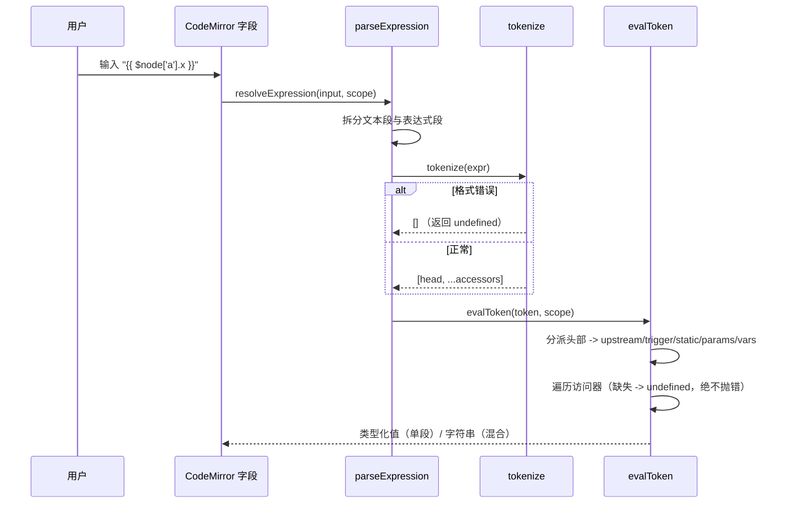
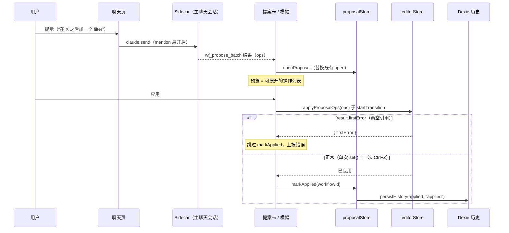

# 表达式与 AI 副驾

<Status variant="stable" />

<TLDR>
两根相互耦合的支柱。（A）一套**无 eval** 的表达式小语言：`lib/workflow/runtime/expression.ts:51` 的 `resolveExpression` 用手写词法器（`lib/workflow/runtime/expression.ts:198` 的 `tokenize`）解析 `{{ ... }}` token —— 绝不使用 `eval`/`Function`，绝不抛错，缺失路径解析为 `undefined`。编辑层叠加一个仅负责着色的 CodeMirror `StreamLanguage`（`lib/workflow/editor/expression-language.ts:65`）、由 schema 驱动的自动补全（`lib/workflow/editor/expression-suggestions.ts:38`），以及由 `buildNodeRef` 构造的拖拽映射引用（`lib/workflow/editor/expr-ref.ts:56`）。（B）一个 **AI 副驾**：模型发出由 Zod 区分联合校验的批量操作（`lib/workflow/editor/proposal-schema.ts:66`），在 `lib/workflow/editor/proposal-store.ts:124` 中按工作流每个仅暂存一条，以**单次 `set()` = 一次 Ctrl+Z** 的方式预览/应用，终态归档到 Dexie 时间线（`lib/workflow/editor/proposal-history.ts:48`）。副驾位于内嵌聊天页（`components/workflow/editor/right-sidebar/chat-tab.tsx:55`），复用主聊天会话 —— 不开第二个 SDK 会话。**关键陷阱**：没有 `.out` 包装层 —— 直接寻址 `upstream[id]`；高亮器作为遗留产物仍会把 `out` 着色，而 `.out.` 会解析为 `undefined`。
</TLDR>

<StatGrid>
- **0** 处使用 `eval` / `Function`（刻意为之；导入的 JSON 不可信）
- **5** 种提案操作类型（`add_node` `remove_node` `connect_edge` `disconnect_edge` `configure_node`）
- 每个工作流 **1** 条 open 提案；每次应用 **1** 次 `set()` = **1** 次 Ctrl+Z
- 每个工作流保留 **50** 条历史（`PROPOSAL_HISTORY_LIMIT`）
</StatGrid>

交叉链接：[./index](./index) · [./editor-store](./editor-store) · [./node-system](./node-system) · [./runtime-execution](./runtime-execution) · [./ui-runs](./ui-runs) · ADR [../../adr/0011-workflows-subsystem](../../adr/0011-workflows-subsystem)。

---

## A. 表达式小语言

### A.1 文法与运行时解析器

文法头部（`lib/workflow/runtime/expression.ts:16`）定义两条产生式：

```text
// lib/workflow/runtime/expression.ts:16-18
token    := $node['id'] | $trigger | $static | $params
accessor := .field | ['key'] | ["key"] | [index]
```

头部还接受 `$vars` 以及任意 `$ident` 兜底（解析为 `upstream[name]`，覆盖循环注入的 `$item` / `$loop`）。解析器针对一个 `ExpressionScope`（`lib/workflow/runtime/expression.ts:33`）求值：

| 成员 | 解析的头部 | 说明 |
| --- | --- | --- |
| `upstream` | `$node['id']` | 原始输出对象，**没有 `.out` 包装层** |
| `trigger` | `$trigger` | 触发器负载 |
| `staticData` | `$static` | 工作流静态数据 |
| `params` | `$params` | 节点参数 |
| `variables?` | `$vars` | 可选；缺失时为 `?? {}` |

```ts
// lib/workflow/runtime/expression.ts:51 — resolveExpression
// 解析 -> 若是单个 {{ expr }} 返回 evalToken 的“类型化”值；
// 文本+表达式混合 -> 字符串拼接；无大括号 -> 原样返回输入。
export function resolveExpression(input: string, scope: ExpressionScope): unknown {
  // ... parseExpression(input)，对单个表达式段：
  //   return evalToken(token, scope)
}
```

头部分派是关键细节 —— 注意完全没有 `.out` 间接层：

```ts
// lib/workflow/runtime/expression.ts:147-161 — evalToken 头部分派
// "node"    -> scope.upstream[head.id]      // 直接寻址，没有 .out 包装层
// $trigger  -> scope.trigger
// $static   -> scope.staticData
// $vars     -> scope.variables ?? {}
// $params   -> scope.params
```

核心解析函数：

| 符号 | 行号 | 用途 |
| --- | --- | --- |
| `ExpressionScope` | `expression.ts:33-44` | `{ upstream, trigger, staticData, params, variables? }` |
| `resolveExpression` | `expression.ts:51-69` | 单段 → 类型化值；混合 → 字符串拼接；无大括号 → 原样 |
| `resolveDeep<T>` | `expression.ts:76-91` | 递归深度解析；由步骤执行器使用 |
| `parseExpression` | `expression.ts:109-133` | 拆分文本/表达式段；未闭合的 `{{` → 字面量 |
| `evalToken` | `expression.ts:140-189` | 头部分派 + 访问器遍历；缺失路径 → `undefined`，绝不抛错 |
| `tokenize` | `expression.ts:198-261` | 手写词法器；格式错误 → `[]` → `undefined` |

**解析器不变量（陷阱）：** 任何地方都不使用 `eval`/`Function`（刻意为之 —— 工作流 JSON 可能被不可信地导入）；缺失路径返回 `undefined` 而非抛错；词法器**不支持转义**；未闭合的 `{{` 被当作字面量字符串；并且**没有 `.out` 包装层** —— 遗留的 `.out.` 访问器会解析为 `undefined`。

### A.2 编辑器：高亮、自动补全、拖拽映射

编辑层仅负责着色与交互 —— 它从不求值。一个手写的 CodeMirror 6 `StreamLanguage` 给 token 着色：

```ts
// lib/workflow/editor/expression-language.ts:24-63 — expressionStreamParser
// inMustache 状态：{{ }} -> punctuation.special
// $node / $trigger / $static / $params -> keyword
// out -> propertyName   // （遗留：运行时没有 .out 包装层）
// 其他标识符 -> variableName
export const workflowExpressionLanguage = /* StreamLanguage.define(...) */;
```

> **高亮器陷阱**（`expression-language.ts`）：尽管运行时没有 `.out` 包装层，`out` 仍被着色为属性。这是遗留产物；`expression-suggestions.ts:116-118` 注明访问器直接寻址原始输出对象（`upstream[id]`），而遗留的 `.out.` 会解析为 `undefined`。

补全建议由上游节点的输出 schema 驱动构造：

| 符号 | 行号 | 用途 |
| --- | --- | --- |
| `SuggestionEntry` | `expression-suggestions.ts:20-31` | 供补全源消费的 label/detail/insert 结构 |
| `buildExpressionSuggestions` | `expression-suggestions.ts:38-154` | 关键字根 + 每节点 `$node['id']` + 来自 `outputSchemas` 的 `.field` |
| `probeOutputFields` | `expression-suggestions.ts:164-167` | 从输出 schema 提取字段名 |

关键字根的提升权重（`buildExpressionSuggestions`）：`$trigger` 90、`$vars` 85、`$static` 80、`$params` 70。每节点条目发出 `$node['id']` 以及来自各节点 `outputSchemas` 的 `.field` 访问器，**排除**当前节点 id 与任何 `annotation.*` 节点。

拖拽映射把“节点+路径”序列化为引用字符串。访问器格式化器处理三种形态与一个不可表示的情况：

```ts
// lib/workflow/editor/expr-ref.ts:25-58
// formatAccessors：number -> [n]；裸标识符 -> .x；否则 -> ['k'] / ["k"]。
//   同时含有 ' 与 " 的 key 不可表示（expr-ref.ts:39-44）。
// buildNodeRef(nodeId, segments) 返回引用字符串：
buildNodeRef(nodeId, segments); // => `{{ $node['<id>'] ... }}`
```

| 符号 | 行号 | 用途 |
| --- | --- | --- |
| `formatAccessors` | `expr-ref.ts:25-47` | number→`[n]`，标识符→`.x`，否则→`['k']`/`["k"]`；双引号皆含的 key 不可表示 |
| `formatPath` | `expr-ref.ts:50` | 拼接格式化后的访问器 |
| `buildNodeRef` | `expr-ref.ts:56-58` | 构造 `{{ $node['id'] ... }}` 字符串 |
| `EXPR_DRAG_MIME` | `expr-ref.ts:66` | 拖拽 MIME `application/x-workflow-expr` |
| `ExprDragPayload` | `expr-ref.ts:68-71` | `{ nodeId, segments }` 拖拽负载 |
| `serializeExprDrag` / `parseExprDrag` | `expr-ref.ts:74` / `79-99` | 往返；`parseExprDrag` 无效时 → `null` |

### A.3 `ExpressionField` —— 接线后的输入控件

`ExpressionField`（`components/workflow/editor/inspector/forms/shared/expression-field.tsx:70`）是检查器控件，挂载语言、补全、放置处理与实时预览。

| 关注点 | 行号 | 行为 |
| --- | --- | --- |
| props | `expression-field.tsx:52-68` | 字段配置 + 回调 |
| store 选择器 | `expression-field.tsx:98-105` | `nodes` / `workflowId` / `variables` / `pinData` / `isDraggingAny` / `performanceTier`；回退到 `InspectorExpressionProvider` ctx（`91-93`） |
| 补全源 | `expression-field.tsx:147-180` | 匹配 `$...` / `{{ $...`；把 `SuggestionEntry` → CM 补全，`apply: e.insert` |
| 挂载 | `expression-field.tsx:183-254` | `workflowExpressionLanguage`、`autocompletion`；放置插入 `buildNodeRef`（`223-237`）；`updateListener` → `onChange` |
| 实时预览 | `expression-field.tsx:281-295` | 以 `upstream = upstreamOutputs` 调用 `resolveExpression`，截断 200 字符，错误就地捕获 |
| 性能门控 | `expression-field.tsx:116-133` | 经 `resolveEffectiveTier` / `flagsForTier` 控制 `liveQueryEnabled` |
| pinData 覆盖 | `expression-field.tsx:138-141` | 覆盖运行输出；**钉住优先** |

### A.4 表达式求值流程



---

## B. AI 副驾提案管线

### B.1 操作模型 —— 编译期联合 + 运行时 Zod

模型提出一**批**操作。编译期联合位于 `proposal-types.ts`；运行时校验器在 `proposal-schema.ts` 中镜像它。

| 操作 | 类型层行号 | schema 行号 |
| --- | --- | --- |
| `add_node` | `proposal-types.ts:32-38` | `proposal-schema.ts:31-63` |
| `remove_node` | `proposal-types.ts:40-43` | （同块内的逐操作 schema） |
| `connect_edge` | `proposal-types.ts:45-53` | （同块内的逐操作 schema） |
| `disconnect_edge` | `proposal-types.ts:55-58` | （同块内的逐操作 schema） |
| `configure_node` | `proposal-types.ts:60-64` | （同块内的逐操作 schema） |
| `ProposalOp` 联合 | `proposal-types.ts:66-71` | — |
| `ProposalOpCount` / `summarizeOps` | `proposal-types.ts:74-80` / `82-104` | — |

批量不变量（头部 `proposal-types.ts:7-11`）：**应用时整批在单次 `set()` 中运行 = 一条 zundo 条目**，因此一次 Ctrl+Z 撤销整个提案；节点 ID 在提案时即已最终确定。

运行时校验是带编译期一致性守卫的 Zod 区分联合：

```ts
// lib/workflow/editor/proposal-schema.ts:66 — proposalOpSchema
const proposalOpSchema = z.discriminatedUnion("type", [
  addNodeSchema,
  removeNodeSchema,
  connectEdgeSchema,
  disconnectEdgeSchema,
  configureNodeSchema,
]);
```

| 符号 | 行号 | 用途 |
| --- | --- | --- |
| 逐操作 schema | `proposal-schema.ts:31-63` | 每个操作一个 Zod 对象；`kind` 放宽为 `string`（非 `WorkflowNodeKind`）以支持插件 kind |
| `proposalOpSchema` | `proposal-schema.ts:66-72` | 以 `type` 为判别键的区分联合 |
| `KNOWN_PROPOSAL_OP_TYPES` | `proposal-schema.ts:77-83` | 操作类型字符串的允许列表 |
| `ProposalOpSchemaParity` | `proposal-schema.ts:91-92` | 类型联合与 schema 之间的编译期防漂移守卫 |
| `coerceProposalOp` | `proposal-schema.ts:100-112` | 返回类型化操作**或**一个按字段命名的人类可读错误字符串 —— **绝不抛错** |

### B.2 暂存 store + Dexie 历史

`useProposalStore`（`lib/workflow/editor/proposal-store.ts:124`）是 Zustand 单例，每个工作流**最多持有一条 open 提案**（lastApplied 可与之共存）。

| 符号 | 行号 | 用途 |
| --- | --- | --- |
| `ProposalPayload` | `proposal-store.ts:70-81` | 操作 + 摘要 + 来源元数据 |
| `ProposalStatus` | `proposal-store.ts:83` | `open` \| `applied` \| `discarded` |
| `ProposalEntry` | `proposal-store.ts:85-100` | 暂存条目记录 |
| `openProposal` | `proposal-store.ts:127-156` | 替换既有 open → 旧的变为一条 discarded 历史行 |
| `markApplied` | `proposal-store.ts:158-172` | 把旧 open → `lastApplied`；持久化历史 |
| `discardProposal` | `proposal-store.ts:174-188` | 丢弃 open 提案 |
| `clearProposalsFor` / `statusOf` / `getProposal` | `proposal-store.ts:190-197` / `199-207` / `209-217` | 每工作流清理 + 查找 |
| `persistHistory` | `proposal-store.ts:54-68` | 即发即忘；**绝不阻塞** store 更新 |
| `affectedNodeIdsFromOps` | `proposal-store.ts:36-52` | 为历史行推导受影响的节点 id |

```ts
// lib/workflow/editor/proposal-store.ts:158 — markApplied
// 把 prior.open -> lastApplied；若已应用：persistHistory(applied, "applied")。
```

终态（`applied` / `discarded`）流向支撑 Changelog 页的 Dexie 时间线：

| 符号 | 行号 | 用途 |
| --- | --- | --- |
| `WorkflowProposalHistoryRow` | `proposal-history.ts:17-36` | id = `${proposalId}:${status}` 复合键；`workflowId` `proposalId` `status` `summary` `opsCount` `affectedNodeIds[]` `messageId?` `createdAt` |
| `PROPOSAL_HISTORY_LIMIT` | `proposal-history.ts:39` | 每工作流保留 `50` 行 |
| `appendProposalHistory` | `proposal-history.ts:48-57` | `put` + 修剪 |
| `listProposalHistory` | `proposal-history.ts:60-70` | 最新优先 |
| `pruneOldProposalHistory` | `proposal-history.ts:76-86` | 每工作流保留最新 50 行 |
| `deleteProposalHistoryForWorkflow` | `proposal-history.ts:89-97` | 清空某工作流的时间线 |

Dexie 表 `workflowProposalHistory` 在 **schema v42** 加入，索引为 `[workflowId+createdAt]`。

### B.3 提案生命周期



### B.4 UI 界面

**提案卡**（`components/workflow/editor/chat/workflow-proposal-card.tsx:55`）是 `wf_propose_batch` / `wf_apply_template` MCP 结果的内联渲染器，含可展开的操作列表（`165-193`）：

```ts
// components/workflow/editor/chat/workflow-proposal-card.tsx:105-111 — handleApply
addOptimisticStatus("applied");
const result = store.getState().applyProposalOps(proposal.ops);
if (result.firstError) {
  // 上报错误；不要 markApplied —— 捕获在“提案与应用之间”
  // 引入的悬空引用
  return;
}
useProposalStore.getState().markApplied(workflowId);
```

| 符号 | 行号 | 用途 |
| --- | --- | --- |
| `WorkflowProposalCard` | `workflow-proposal-card.tsx:55-234` | 内联结果渲染器 |
| `handleApply` | `workflow-proposal-card.tsx:83-118` | 乐观状态 → 在 `startTransition` 中 `applyProposalOps`；遇 `firstError` 跳过 `markApplied` |
| `handleDiscard` | `workflow-proposal-card.tsx:120-126` | 丢弃 open 提案 |

**置顶横幅**（`components/workflow/editor/chat/sticky-proposal-banner.tsx:37`）是为 OPEN 提案常驻顶部的条（应用 / 丢弃 / 揭示）：

| 符号 | 行号 | 用途 |
| --- | --- | --- |
| `StickyProposalBanner` | `sticky-proposal-banner.tsx:37-136` | 三个 `useRef` 守卫的 effect 仅在状态转变时弹 toast（`52-77`）；无 open 时返回 `null`（`79`） |
| `discardOpen` | `sticky-proposal-banner.tsx:138-142` | 丢弃 |
| `applyOpen` | `sticky-proposal-banner.tsx:144-170` | 在 transition **之外**捕获 `getEditorStore` 句柄，在其内部运行 `applyProposalOps`，上报 `firstError` |

**聊天页**（`components/workflow/editor/right-sidebar/chat-tab.tsx:55`）通过复用主聊天的 `ChatPane` 与同一套 sidecar 分发来承载副驾 —— **不开第二个 SDK 会话**：

| 符号 | 行号 | 用途 |
| --- | --- | --- |
| `WorkflowEditorChatTab` | `chat-tab.tsx:55-209` | 副驾宿主（复用 `ChatPane`） |
| `handleSend` | `chat-tab.tsx:72-85` | 先 `applyWorkflowMentionExpansion` 再 `claude.send` |
| `handleQuickAction` | `chat-tab.tsx:106-114` | `buildQuickActionPrompt` |
| slash 命令监听器 | `chat-tab.tsx:121-131` | 路由编辑器 slash 命令 |
| `applyWorkflowMentionExpansion` | `chat-tab.tsx:223-231` | 展开 `@node:` / `@edge:` mention |
| `dispatchWorkflowAction` | `chat-tab.tsx:241-276` | 把副驾动作路由回编辑器 |

**快捷动作提示词**（`lib/workflow/editor/quick-action-prompts.ts`）：

| 符号 | 行号 | 用途 |
| --- | --- | --- |
| `buildQuickActionPrompt` | `quick-action-prompts.ts:19-33` | 按 kind 分派 |
| `buildValidatePrompt` | `quick-action-prompts.ts:35-60` | 运行 `validateAllNodes` + `flattenSummary`，发出 `/validate` |
| `buildExplainPrompt` | `quick-action-prompts.ts:62-82` | 从选区发出 `/explain` |
| `buildSuggestPrompt` | `quick-action-prompts.ts:84-109` | `/suggest-next` —— “Don't add the node yourself — wait for me to confirm” |

**Mention 展开**（`lib/workflow/editor/mention-expand.ts`）把 `@node:`/`@edge:` 引用改写为可读上下文：

| 符号 | 行号 | 用途 |
| --- | --- | --- |
| `expandWorkflowMentions` | `mention-expand.ts:52-86` | 正则 `@(node\|edge):id`；未知 id 原样透传；node → `id`（kind . label），edge → `id`（经 handle 的 src→tgt） |
| `snapshotFromEditorState` | `mention-expand.ts:94-134` | 构造供展开消费的快照 |

**会话栏**（`components/workflow/editor/chat/session-bar.tsx:81`）管理每工作流的聊天会话：默认 id `workflow:${workflowId}`，附加为 `...:${nanoid(6)}`；`useLiveQuery` 按前缀列出会话并将默认会话置顶；支持重命名 / 清空 / 新建 / 切换 / 删除（删除默认会话被阻止）。

---

## 陷阱（必知）

| 陷阱 | 位置 | 后果 |
| --- | --- | --- |
| 不使用 `eval` / `Function` | `expression.ts` | 刻意为之 —— 工作流 JSON 可能被不可信地导入 |
| 缺失路径 → `undefined`，绝不抛错 | `evalToken` `expression.ts:140-189` | 部分表达式静默降级 |
| **没有 `.out` 包装层** | `evalToken` `expression.ts:147-161` | `upstream[id]` 直接寻址；遗留的 `.out.` 解析为 `undefined` |
| 高亮器仍给 `out` 着色 | `expression-language.ts` | 遗留视觉产物；不改变运行时 |
| 词法器不支持转义 | `tokenize` `expression.ts:198-261` | key 内的引号可能不可表示（`expr-ref.ts:39-44`） |
| 未闭合的 `{{` → 字面量 | `parseExpression` `expression.ts:109-133` | 半输入的表达式渲染为文本 |
| `coerceProposalOp` 绝不抛错 | `proposal-schema.ts:100-112` | 无效操作返回按字段命名的错误字符串 |
| `kind` 放宽为 `string` | `proposal-schema.ts:31-63` | 兼容插件节点 kind |
| `ProposalOpSchemaParity` | `proposal-schema.ts:91-92` | 防止类型/schema 漂移的编译期守卫 |
| 每工作流 ≤1 条 open 提案 | `proposal-store.ts:127-156` | 新提案会丢弃既有 open |
| 应用 = 单次 `set()` = 一次 Ctrl+Z | `proposal-types.ts:7-11` | 整批对撤销而言是原子的 |
| 应用原子性返回 `{ firstError }` | `workflow-proposal-card.tsx:105-111` | 悬空引用会跳过 `markApplied` |
| 历史上限 50，即发即忘 | `proposal-history.ts:39`、`proposal-store.ts:54-68` | 持久化绝不阻塞 UI |
| 聊天页复用单一主聊天会话 | `chat-tab.tsx:55` | 不开第二个 SDK 会话 |
