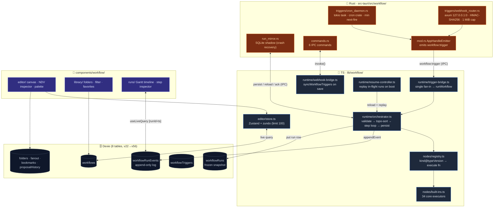

# 可视化工作流

<Status variant="stable" />

<TLDR>
  基于 React Flow v12 的编辑器（Zustand + zundo store、elkjs 自动布局），覆盖 **7 大类共 74 种节点**，
  由**混合运行时**执行：Rust 负责*工作流何时启动*（cron 守护进程、HMAC webhook 接收器）以及*某次运行是否
  从崩溃中幸存*（SQLite 镜像）；TS 负责*给定一次运行如何逐步遍历图*（`runWorkflow` —— 校验 → 拓扑排序 →
  步骤循环 → 持久化事件日志）。图类型为 `VisualWorkflow`（`types/workflow/visual.ts:242`，`schemaVersion: 1`）；
  持久化横跨 **8 张 Dexie 表**，分布在 schema v22 → v56。AI 副驾会起草经 Zod 校验的批量*提案（proposal）*，
  用户预览后作为单个撤销步骤应用。
</TLDR>

<StatGrid>
  <Stat
    label="节点种类"
    value="74"
    hint="7 大类 · trigger / action / ai / flow / data / io / annotation（pattern→action）"
  />
  <Stat label="内置执行器" value="34 核心" hint="built-ins.ts；另有 +13 desktop、+1 terminal、+13 github（插件）、+6 pattern" />
  <Stat label="内置模板" value="22" hint="10 seed · 4 进阶包 · 8 GitHub Delivery" />
  <Stat
    label="Dexie 表"
    value="8"
    hint="workflows · runs · runEvents · triggers · folders · fanout · bookmarks · proposalHistory"
  />
  <Stat label="lib/workflow" value="~14.7k 行" hint="editor 4.3k · nodes 4k · runtime 3.2k · definition/library 3k" />
  <Stat label="Rust 后端" value="~2.3k 行" hint="webhook_router 818 · run_mirror 432 · cron_daemon 351" />
</StatGrid>

cognia-next 用这一层把它成熟的运行时实体 —— [角色](../../chat/chat-and-skills)、[智能体团队](../../chat/agent-teams)、[技能](../../chat/skills-system)、[员工数字分身](../employee-twin)、[平台连接器](../platform-connectors)、MCP 服务器以及[插件](../plugin-system) —— 编排成可执行图。设计遵循 ADR 0011（子系统）、ADR 0017（插件扩展点）与 ADR 0034（编辑器完备性）。

## 唯一的承重原则

> **Rust 负责"工作流何时启动"与"这次运行是否从崩溃中幸存"。TS 负责"给定一次运行，如何逐步遍历这些步骤"。**

其余一切都由这条划分推导而来。cron 触发与 webhook 接收必须在 webview 最小化到托盘时仍然工作，因此它们位于 Rust（`src-tauri/src/workflow/`）。逐步编排会接触 Dexie、LLM 客户端、连接器总线与智能体团队运行时 —— 它们都位于 webview —— 因此留在 TS（`lib/workflow/runtime/`）。两侧仅通过 Tauri 事件（`workflow:trigger` / `workflow:resume`）与六个 IPC 命令通信。在 Web 模式下 Rust 层不存在，TS 编排器独立运行 —— cron 仅在标签页存活时触发，webhook 显示"仅桌面"横幅，其余触发器照常工作。

## 架构

## 模块地图

每张卡片都是一个文档页，包含精确到行的内部实现。任何非平凡改动前请先阅读对应模块页。

<Cards>
  <Card title="数据模型与定义" href="./data-model" description="VisualWorkflow 类型、74 种节点的分类法、Zod + 图完整性校验、8 张 Dexie 表，以及 22 个内置模板" />
  <Card title="编辑器 store 与画布机制" href="./editor-store" description="Zustand + zundo store（历史 100）、React Flow 转换器、elkjs 自动布局、连接校验、剪贴板/对齐/套索、WeakMap 索引、性能档位、视口书签" />
  <Card title="表达式与 AI 副驾" href="./expressions-copilot" description="无 eval 的 {{ }} 表达式语言、CodeMirror 高亮 + 自动补全、拖拽映射，以及经 Zod 校验、带 Dexie 历史的提案流水线" />
  <Card title="节点系统与执行器" href="./node-system" description="kind@typeVersion 注册表、catalog 元数据、按种类的 Zod 参数 schema、校验，以及 action/flow/data/io 内置执行器家族" />
  <Card title="AI 与 pattern 节点" href="./ai-pattern-nodes" description="ai.prompt / classify / extract / embed 内部实现（LLM 客户端、结构化输出、fall-open），以及 6 个仅由合成器产生的 Ultracode pattern.* 节点" />
  <Card title="运行时执行引擎" href="./runtime-execution" description="runWorkflow 流水线、带回边的 Kahn 拓扑排序、重试/超时步骤执行器、持久化事件日志、幂等、并发控制、长步骤、run-single-node、崩溃恢复，以及运行状态机" />
  <Card title="触发器与 Rust 后端" href="./triggers-rust" description="五路触发器分类法、TS 桥接、进程内 cron 守护进程、HMAC webhook 路由器，以及 SQLite 运行镜像" />
  <Card title="UI、库与运行历史" href="./ui-runs" description="三栏编辑器外壳、Config/Input/Output NDV 检查器、六标签右侧栏、支持文件夹的库，以及甘特图运行历史" />
</Cards>

## 使用场景

| 场景                  | 推荐图                                                                                 |
| --------------------- | ------------------------------------------------------------------------------------- |
| 定时数据同步          | `trigger.cron` → `io.http` → `data.transform` → `flow.set`                            |
| 入站自动回复          | `trigger.connector.inbound` → `ai.classify` → `flow.switch` → `action.connector.send` |
| RAG 支撑的 FAQ 回复   | `trigger.chat.message` → `action.twin.rag` → `ai.prompt` → `action.character.send`    |
| Webhook 桥接          | `trigger.webhook` → `ai.extract` → `io.webhook.respond`                               |
| 复杂聚合              | `flow.split` → N× `ai.prompt` → `flow.join` → `data.template`                         |
| GitHub PR 自动评审    | `trigger.github.webhook` → `ai.prompt` → `action.github.reviewPr`                     |
| 多角色编排            | `action.team.run` 驱动智能体团队生命周期                                              |

## 触发器分类法（混合分布）

五条触发路径全部汇入一个 TS 收口处 —— `trigger-bridge.ts:43 dispatchTrigger` → `runWorkflow`。

| 触发器                      | 触发方                | 路径                                                                                 |
| --------------------------- | --------------------- | ------------------------------------------------------------------------------------ |
| `trigger.manual`            | TS                    | 编辑器 Run 按钮 / IM 点击 / resume —— 直接 `dispatchTrigger`                          |
| `trigger.cron`              | **Rust** 守护进程     | `cron_daemon.rs:229` emit → `workflow:trigger` → bridge（托盘时也触发）               |
| `trigger.webhook`           | **Rust** axum         | `webhook_router.rs:292` HMAC → emit → bridge（仅桌面）                                |
| `trigger.connector.inbound` | TS 钩子               | `ConnectorBus` → `findMatchingWorkflows` → `dispatchTrigger`                          |
| `trigger.chat.message`      | TS 钩子               | `lib/db/messages.ts` → `findMatchingWorkflows` → `dispatchTrigger`                    |

完整管道见 [触发器与 Rust 后端](./triggers-rust)。

## 相关子系统

<Cards>
  <Card title="平台连接器" href="../platform-connectors" description="trigger.connector.inbound 与 action.connector.send 的来源" />
  <Card title="调度器" href="../scheduler" description="进程内 cron 守护进程复用调度器的绝对时间戳时钟" />
  <Card title="技能系统" href="../../chat/skills-system" description="action.skill.invoke / action.skill.upsert 的目标" />
  <Card title="智能体团队" href="../../chat/agent-teams" description="action.team.run 驱动 runTeamLifecycle；pattern.* 节点是高阶团队派发" />
  <Card title="员工数字分身" href="../employee-twin" description="action.twin.rag / action.twin.ingest 的入口" />
  <Card title="插件系统" href="../plugin-system" description="workflow.node / workflow.trigger / workflow.task 扩展点" />
</Cards>

## 相关 ADR

- [ADR 0011 — 可视化工作流子系统](../../adr/0011-workflows-subsystem)
- [ADR 0017 — 工作流插件扩展点](../../adr/0017-workflow-plugin-extension-points)
- [ADR 0034 — 工作流编辑器完备性与插件对等](../../adr/0034-workflow-editor-completeness-and-plugin-parity)
- [ADR 0022 — 智能体团队](../../adr/0022-agent-team)（Ultracode `pattern.*` 附录）

## 已知限制

- **子工作流递归**硬上限为深度 10（`built-ins.ts:1212 MAX_SUBWORKFLOW_DEPTH`）；超过则抛出不可重试错误。
- **`flow.loop` 上限**：每实例的 `maxIterations` 加上全局 `LOOP_HARD_CAP = 100_000`（`built-ins.ts:415`），覆盖 `forEach` / `times` / `while`。
- **Web 模式降级**：cron 仅在 webview 存活时触发；webhook 仅桌面（显示横幅）；崩溃恢复用的 SQLite 镜像仅 Tauri，因此 Web 仅依赖 Dexie 事件日志 + 启动重放。
- **`io.webhook.respond`** 是延迟透传（`deliveryDeferred: true`）—— 目前还没有"挂起 HTTP 响应直到该节点运行"的同步通道。
- **运行快照不可变**：从历史重跑使用 `WorkflowRunRow.workflowSnapshot`，在运行开始时冻结；之后的编辑不会影响历史运行（有意为之）。
- **设置外壳**（`components/settings/workflows/workflows-section.tsx`）仍硬编码英文字符串 —— 这是已知的、违反项目 i18n 规则之处。
