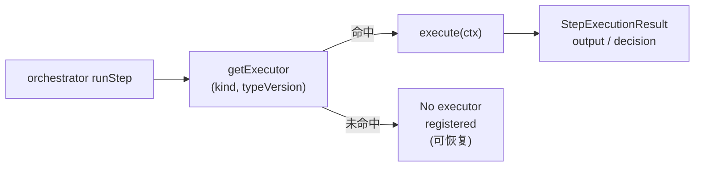
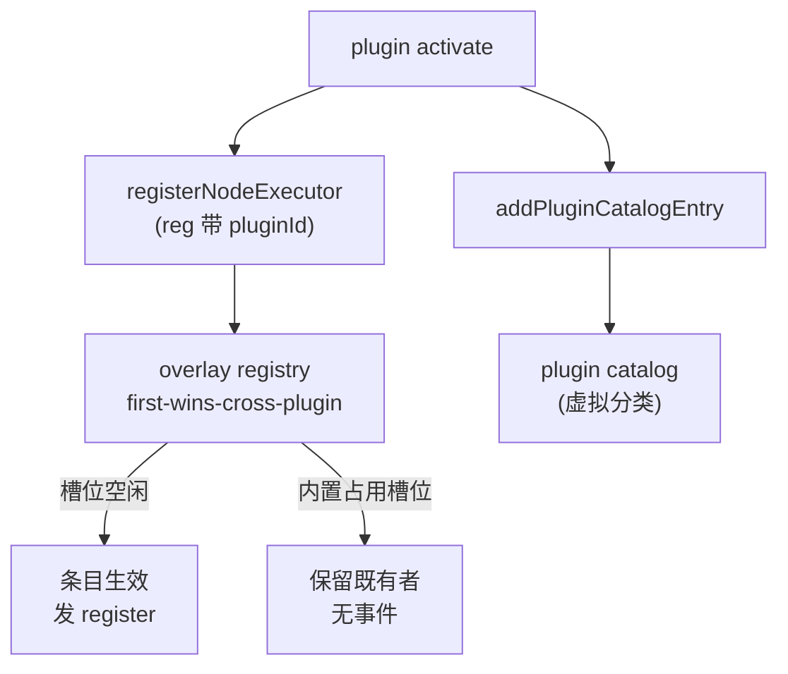

# 节点系统与执行器

<Status variant="stable" />

<TLDR>
每个工作流步骤都是一个 `kind@typeVersion` 对，通过一个 overlay 注册表（`lib/workflow/nodes/registry.ts:131`）解析，内置项在跨插件冲突中始终胜出（`registry.ts:77`）。调色板与搜索索引存放在单独的目录中（`lib/workflow/nodes/catalog.ts:489`），按相同的 kind 键控；各 kind 的 Zod schema（`lib/workflow/nodes/params-schemas.ts:384`）同时供给编辑期校验门（`lib/workflow/nodes/validate-params.ts:101`）与编译期 `TypedWorkflowNode` 可辨识联合（`lib/workflow/nodes/typed-params.ts:47`）。宿主内置项在 import 时注册（`lib/workflow/nodes/built-ins.ts:1`，副作用导入 `./desktop` 与 `./terminal`），覆盖 flow / data / io / action 家族；AI 原语与 6 个 `pattern.*` 节点见姊妹页 <a href="./ai-pattern-nodes">AI 与 pattern 节点</a>。`typeVersion` 为精确匹配——版本号上调却没有对应注册，会变成可恢复的「No executor registered」运行失败。
</TLDR>

<StatGrid>
- **74 个节点 kind**，分布于 7 个分类（标准口径）
- **`kind@typeVersion`** 注册表键；每个内置项的 typeVersion 均为 1
- **`"first-wins-cross-plugin"`** 冲突策略，内置项胜出（`registry.ts:77`）
- **`LOOP_HARD_CAP=100_000`** + **`MAX_SUBWORKFLOW_DEPTH=10`** 安全上限
</StatGrid>

## 注册表（`lib/workflow/nodes/registry.ts`）

注册表把 `kind@typeVersion` 键映射到唯一的 `NodeExecutorRegistration`，是编排器唯一的查找入口。

| 符号 | 行号 | 用途 |
| --- | --- | --- |
| `BUILTIN_PLUGIN_ID = "__builtin__"` | L33 | 盖在宿主注册项上的 owner id。 |
| `NodeExecuteFn` | L35 | `(ctx: StepExecutionContext) => Promise<StepExecutionResult>`。 |
| `NodeExecutorRegistration` | L37-51 | `{kind, typeVersion, execute, retryable?, timeoutMs?, pluginId?}`。 |
| `registry = createOverlayRegistry(...)` | L77-89 | keyFn `kind@version`，conflictPolicy `"first-wins-cross-plugin"`，`onConflict` 写日志。 |
| `registerNodeExecutor(reg)` | L108-118 | owner = `pluginId ?? BUILTIN_PLUGIN_ID`；仅当条目真正生效时才发 `"register"`。 |
| `unregisterNodeExecutor(...)` | L126-129 | 移除注册项。 |
| `getExecutor(kind, version)` | L131-136 | 编排器按精确键查找。 |
| `listRegisteredKinds()` | L138-142 | 枚举生效中的注册项。 |
| `subscribeNodeRegistry(...)` | L150-155 | 变更订阅（事件经 `queueMicrotask` 延迟派发，L95）。 |
| `__resetRegistryForTesting()` | L158-161 | 仅供测试的重置。 |

内置项赢得冲突：overlay 的 `"first-wins-cross-plugin"` 策略再加上 `BUILTIN_PLUGIN_ID` owner，意味着插件永远无法对同一 `kind@typeVersion` 遮蔽宿主执行器。

```ts
// lib/workflow/nodes/registry.ts:108
export function registerNodeExecutor(reg: NodeExecutorRegistration): void {
  const owner = reg.pluginId ?? BUILTIN_PLUGIN_ID
  const k = key(reg.kind, reg.typeVersion)
  registry.register(reg.kind, reg, { pluginId: owner })
  if (registry.get(k) === reg) { emit({ type: "register", kind: reg.kind, typeVersion: reg.typeVersion }) }
}
```

`emit` 守卫（`registry.get(k) === reg`）保证只有注册真正生效时才发 `"register"` 事件——跨插件竞争失败的一方既不发事件，也不会遮蔽既有者。



## 目录元数据（`lib/workflow/nodes/catalog.ts`）

目录是调色板 / 搜索层；它刻意与注册表分离，从而让仅由合成器使用的 kind 可以在不携带调色板元数据的情况下执行。

| 符号 | 行号 | 用途 |
| --- | --- | --- |
| `NodeCatalogEntry` | L18-45 | `{kind, category WorkflowNodeCategory \| "plugin", label, description, iconName, keywords[], hidden?, desktopOnly?, pluginId?, paramsSchema?}`。 |
| `ENTRIES` | L53-482 | `Partial<Record<...>>`——之所以 partial，是因为仅合成器使用的 `pattern.*` 不携带任何调色板元数据。 |
| `NODE_CATALOG` | L489-493 | `WORKFLOW_NODE_KINDS.flatMap(...)`，跳过 `ENTRIES` 中没有的 kind。 |
| 插件条目 | L497-553 | `addPluginCatalogEntry` / `removePluginCatalogEntry` / `subscribePluginCatalog` / `getPluginCatalogSnapshot`（适配 useSyncExternalStore）。 |
| `nodeCatalogEntry(kind)` | L563-574 | 回退合成条目，`iconName "Box"`。 |
| `groupedCatalog()` | L584-611 | 顺序 trigger / action / ai / flow / data / io / annotation + 虚拟 `"plugin"`。 |
| `searchCatalog()` | L624-651 | 加权模糊：label 精确 100 → kind 包含 10。 |

所有调色板可见的 kind 都在 `ENTRIES` 中枚举；`pattern.*` 刻意缺席（仅合成器使用——见 <a href="./ai-pattern-nodes">AI 与 pattern 节点</a>）。

```ts
// lib/workflow/nodes/catalog.ts:363
"ai.prompt": {
  label: "AI prompt",
  description: "Direct LLM call. Uses the configured provider routing.",
  iconName: "Bot",
  keywords: ["llm", "prompt", "chat", "claude", "openai", "ai"],
}
```

## 参数 schema（`lib/workflow/nodes/params-schemas.ts`）

每个 kind 拥有一个校验 `node.data.params` 的 Zod schema；所有错误都以**稳定的 i18n key**（camelCase）呈现，便于编辑器本地化。

| 符号 | 行号 | 用途 |
| --- | --- | --- |
| helpers | L24-51 | `requiredString`、`optionalString`、`numberRange`、`isHttpUrlOrExpression`（放行 `{{ }}`）。 |
| schema 常量 | L55-380 | 各 kind 的形状定义。 |
| `PARAMS_SCHEMAS` | L384-479 | `satisfies Record<WorkflowNodeKind, z.ZodTypeAny>`——`satisfies` 既为 typed-params 保留逐键类型，又提供编译期穷尽性检查。 |
| `ParamsSchemas` | L489 | 推导类型。 |
| `KNOWN_KINDS` | L492 | 拥有具体 schema 的 kind。 |
| `paramsSchemaFor(kind)` | L499-501 | 回退宽松 `z.record(z.string(), z.unknown())`。 |

GitHub Delivery 与 Desktop Automation 现在也在该 registry 中拥有具体 schema，尽管它们的执行器不在 `built-ins.ts`。当前仍保持宽松的只剩 6 个仅由合成器生成的 `pattern.*` 节点；它们的 params 由编排合成器产出，而不是直接在 inspector 中编辑。

```ts
// lib/workflow/nodes/params-schemas.ts:283
const LoopParams = z.object({
  mode: z.enum(["forEach", "times", "while"]).optional(),
  times: numberRange(0).optional(),
  inputExpression: optionalString,
  bodyExpression: requiredString("required"),
  whileCondition: optionalString,
  maxIterations: numberRange(1, 1_000_000).optional(),
}).refine(/* while -> whileCondition, forEach -> inputExpression, else times > 0 */, {
  message: "loopBodyRequired",
  path: ["mode"],
})
```

> **坑（`params-schemas.ts:133-135`）**：`requiredString` 必须被*调用*——传入裸函数引用会悄无声息地关闭该字段的校验。

## 校验门（`lib/workflow/nodes/validate-params.ts`)

这是编辑期「有错误则阻止运行」的门，独立于运行期检查。

| 符号 | 行号 | 用途 |
| --- | --- | --- |
| `looksLikeI18nKey(...)` | L19-22 | 识别已可本地化的消息。 |
| `FieldError` / `NodeValidationResult` | L29-41 | 逐字段 + 逐节点的结果形状。 |
| `mapIssueToFieldError(...)` | L47-83 | 信任 i18n-key 消息；把 zod4 码 `invalid_type` / `too_small` / `too_big` 映射为 `required` / `minItems` / `minValue` / `maxValue`。 |
| `validateNodeParams(kind, params)` | L101-111 | `paramsSchemaFor(kind).safeParse`；插件 / 未知 → 空。 |
| `validateAllNodes(nodes)` | L136-148 | 仅返回错误条目。 |
| `flattenSummary(...)` | L154-162 | 折叠为扁平列表。 |

## 类型化参数（`lib/workflow/nodes/typed-params.ts`)

纯类型模块（仅 `import type { z }`），把 schema 提升到类型层：

| 符号 | 行号 | 用途 |
| --- | --- | --- |
| `WorkflowNodeParamsFor<K>` | L32-34 | `z.infer<ParamsSchemas[K]>`。 |
| `TypedWorkflowNodeData` | L37-39 | 各 kind 的 params + node-data 形状。 |
| `TypedWorkflowNode` | L47-49 | 按 `type` 辨识的联合。 |
| `TypedStepExecutionContext` | L52-54 | 收窄到该节点 params 的上下文。 |

## 内置执行器家族（`lib/workflow/nodes/built-ins.ts`)

所有宿主内置项在 import 时注册（`built-ins.ts:1`），该模块副作用导入 `./desktop`（L37）与 `./terminal`（L41）。AI 辅助位于 L51-82；共享辅助（`sha256Hex`、`nonRetryable`、`isTruthy`、`firstUpstream`、`evalItemExpression`、`evalLoopExpression`）位于 L1835-1907。

### Trigger 与 flow

| Kind | 行号 | 说明 |
| --- | --- | --- |
| `trigger.manual` | L85 | 手动入口。 |
| `trigger.team` | L101 | 透传——**不**启动团队。 |
| `flow.set` | L113 | 设置静态 / 表达式值。 |
| `flow.branch` | L139 | 双向真值判定。 |
| `flow.switch` | L359 | 多分支路由。 |
| `flow.split` | L383 | 透传；由编排器扇出。 |
| `flow.join` | L394 | 按 `joinPolicy` 冻结 `ctx.upstream`。 |
| `flow.loop` | L416 | `forEach` / `times` / `while`；感知 abort（`LOOP_HARD_CAP=100_000` L415）。 |
| `flow.wait` | L534 | 仅 duration；event 模式为 no-op。 |
| `flow.subworkflow` | L1213 | 递归 `runWorkflow`（`MAX_SUBWORKFLOW_DEPTH=10` L1212）。 |

```ts
// lib/workflow/nodes/built-ins.ts:139
execute: async (ctx) => {
  const params = ctx.params as { condition?: unknown; truthyLabel?: string; falsyLabel?: string }
  const truthyLabel = /* ... */ "true"
  const falsyLabel = /* ... */ "false"
  if (params.condition === undefined || params.condition === "") {
    return { output: { decision: falsyLabel }, decision: falsyLabel }
  }
  const decision = isTruthy(params.condition) ? truthyLabel : falsyLabel
  return { output: { decision, evaluated: params.condition }, decision }
}
```

### Data 与 io

| Kind | 行号 | 说明 |
| --- | --- | --- |
| `data.transform` | L170 | `map` / `filter` / `sort` / `flatten` / `reduce`。 |
| `data.template` | L566 | 字符串模板。 |
| `data.code` | L582 | `new Function`，`timeoutMs 5000`，失败时不可重试。 |
| `io.http` | L612 | `fetch(url, { signal: ctx.signal })`；5xx 可重试，4xx 不可。 |
| `io.webhook.respond` | L1281 | 透传，`deliveryDeferred: true`。 |

```ts
// lib/workflow/nodes/built-ins.ts:170
// data.transform：input = firstUpstream(ctx)；若非数组则返回 { output: input }；
// 用 evalItemExpression 在 map / filter / sort / flatten / reduce 间分支
```

### Action 家族

| Kind | 行号 | 说明 |
| --- | --- | --- |
| `action.skill.invoke` | L678 | 调用技能。 |
| `action.skill.upsert` | L852 | 创建 / 更新技能。 |
| `action.character.create` | L727 | 新建角色。 |
| `action.character.update` | L760 | 变更角色。 |
| `action.character.send` | L1310 | 以角色身份发送。 |
| `action.team.create` | L791 | 新建团队。 |
| `action.team.update` | L820 | 变更团队。 |
| `action.team.run` | L1379 | `runTeamLifecycle`，配实时 Zustand 读写器 + IM 来源传播。 |
| `action.team.task.dispatch` | L1472 | `retryable: true`（每次重试重新认领一名 teammate）。 |
| `action.twin.rag` | L1534 | `tryBuildTwinDeps` → embed → `store.searchByEmbedding` → 富化；优雅降级（`degraded: true`，从不抛错）。 |
| `action.twin.ingest` | L1630 | 摄入 twin 存储。 |
| `action.connector.send` | L896 | `enqueueOutbound` source `"workflow"`，幂等键 `${runId}:${stepId}`。 |
| `action.connector.draft` | L950 | 暂存一条出站草稿。 |
| `action.mcp.invokeTool` | L1700 | 调用 MCP 工具。 |
| `action.plugin.invoke` | L1777 | 调用插件暴露的 action。 |

> 13 个 `action.github.*` kind 曾由 github-delivery 插件提供，已于 2026-07 随该插件一并**移除**（ADR-0018）。12 个 desktop kind + `trigger.desktop.event` 位于 `desktop.ts`；`action.system.terminal` 位于 `terminal.ts`。

### AI 原语（摘要——完整细节见姊妹页）

| Kind | 行号 | 一句话 |
| --- | --- | --- |
| `ai.prompt` | L228 | 经 provider 路由的直接 LLM 调用（fail-open 桩）。 |
| `ai.classify` | L984 | 给输入打标签 / 路由。 |
| `ai.extract` | L1049 | 结构化字段抽取。 |
| `ai.embed` | L1134 | 嵌入（hash 回退）。 |

`ai.*` 内部机制与 6 个仅合成器使用的 `pattern.*` 节点见 <a href="./ai-pattern-nodes">AI 与 pattern 节点</a>。

## Desktop 节点（`lib/workflow/nodes/desktop.ts`)

注册 12 个 desktop 执行器 + `trigger.desktop.event`，每个都包裹来自 `@/lib/automation/client` 的一个 desktop 客户端方法，并打上 `surface: "workflow"`，从而让 Rust gate 评估 **workflow** 策略。执行器同时接受直接 automation 参数（`locator`、`elementRef`、`target`、`rect`）与 inspector convenience 字段（`selector`、`clickCount`、`width`/`height`）。`callCtx` 在 `target.connectionId` 存在时路由到 cua 沙箱（ADR-0020），否则本地。

| Kind | 行号 | Kind | 行号 |
| --- | --- | --- | --- |
| screenshot | L101 | type | L168 |
| findElement | L126 | keys | L181 |
| readTree | L136 | invokePattern | L194 |
| click | L147 | windowFocus | L210 |
| windowClose | L223 | windowResize | L236 |
| wait（轮询，感知 abort） | L262 | `trigger.desktop.event`（透传） | L285 |

`trigger.desktop.event` 在 runtime 中透传；真正的 UIA 触发由 Rust trigger 桥完成。它的 params schema 仍会把 `kinds` 限定为受支持的 UIA 事件类型。`invokePattern` 的值与 automation `PatternKind` wire value 对齐，例如 `invoke`、`toggle`、`expandCollapse`。

## Terminal 节点（`lib/workflow/nodes/terminal.ts`)

单一执行器 `action.system.terminal`（L48，`retryable: false`），懒导入 `@/lib/terminal/dock-tool-handler` 的 `runTerminalDockAction`（仅渲染端）。它复用同意门 `requestAgentTrust`（作用域为 `ctx.runId`），等待 OSC 633 `command_end`，无 `tabId` 时 spawn 否则写入，将超时夹在 5-600s，并按 `onFailure`（默认 `"throw"`）判定 `exit 0 -> "success"` 否则 `"failure"` 或抛错。输出：`{ exitCode, output, sessionId, command }`。

## Twin-injector 辅助（`lib/workflow/nodes/shared/twin-injector.ts`)

`injectTwinContext(input)`（L40）由 `ai.prompt` 风格路径与 connector 出站共享。对于一个角色：若没有 `twinId` 则返回 base；否则 `tryBuildTwinDeps` → 嵌入 prompt + RAG + `applyTwinContext`（4 段式 system prompt）+ 记录到 M6 inject-log 环形缓冲。它**从不抛错**（静默降级），返回 `{ systemPrompt, applied, degradedReason? }`。

## 插件执行器注册路径

插件通过同一 `registerNodeExecutor` 入口带 `pluginId` 注册执行器，并经 `addPluginCatalogEntry` 加入调色板元数据。内置项始终在 `kind@typeVersion` 冲突中胜出。



契约见 ADR-0017（<a href="../../adr/0017-workflow-plugin-extension-points">工作流插件扩展点</a>）。

## 坑

- **`typeVersion` 为精确匹配**——版本号上调却没有对应注册，会变成可恢复的「No executor registered」运行失败。
- **幂等**：`ctx` / `runStep` 维护逐 run 的输出缓存；存在 pin 时 `honorPinData` 短路（跳过执行器）。
- **Fail-open**：`ai.prompt` 桩、`ai.embed` hash 回退、`twin.rag` 降级、twin-injector base、`io.webhook.respond` 延迟。
- **Fail-closed / 不可重试**：缺失必填项时 `nonRetryable()`、`data.code`、terminal、subworkflow 深度上限（10）。`io.http` 有显式重试分支；`action.team.task.dispatch` 可重试，故每次重试会重新认领一名 teammate。
- **已解析参数**：`params` 在 `execute` 之前已经过 `resolveDeep` 展开。`flow.loop` 的 `while` / `forEach` 使用原始表达式字符串，每次迭代以 `$item` / `$loop` 在作用域内重新求值。长执行器尊重 abort。

## 相关页面

- <a href="./index">Visual Workflows 总览</a>
- <a href="./data-model">数据模型</a>
- <a href="./ai-pattern-nodes">AI 与 pattern 节点</a>
- <a href="./runtime-execution">运行期与执行</a>
- <a href="./expressions-copilot">表达式与 copilot</a>
- <a href="./ui-runs">UI 与运行</a>
- ADR：<a href="../../adr/0011-workflows-subsystem">0011 工作流子系统</a> · <a href="../../adr/0017-workflow-plugin-extension-points">0017 工作流插件扩展点</a>
