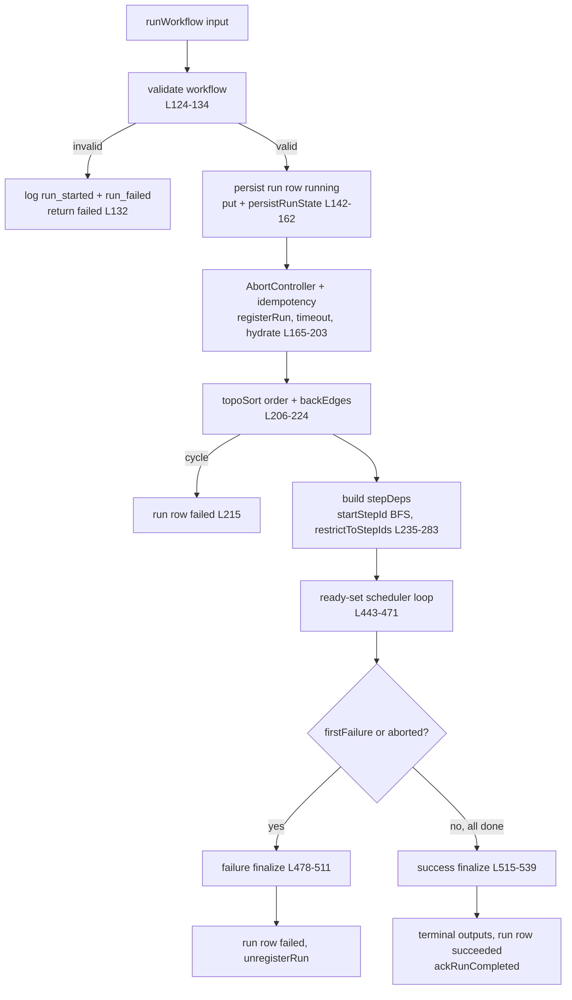
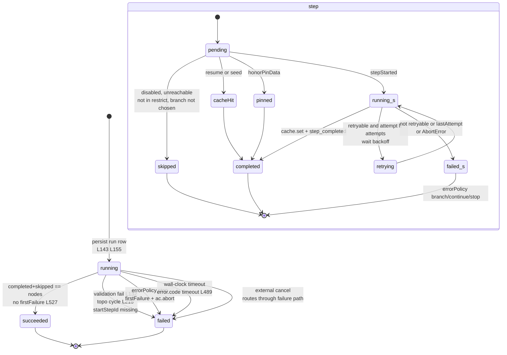
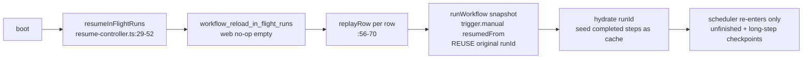

# 运行时执行引擎

<Status variant="stable" />

<TLDR>
`lib/workflow/runtime/orchestrator.ts:118` 的 `runWorkflow(input)` 是核心：它先校验、持久化 `WorkflowRunRow`（`orchestrator.ts:142`）、装配单一 run 级 `AbortController` 加挂钟超时（`orchestrator.ts:165-203`）、对 `VisualWorkflow` 做拓扑排序（`topo-sort.ts:23`），随后进入 ready-set 调度循环（`orchestrator.ts:443-471`），该循环遵守 in-run 的 `maxConcurrency` 预算。每个步骤经由 `step-executor.ts:56` 的 `runStep`，包含缓存短路、`resolveDeep` 参数解析、带退避的重试循环（`step-executor.ts:142-160`，默认 attempts 3 / 指数 / baseMs 1000 / maxMs 30000，无抖动）以及单步超时（`step-executor.ts:186`）。每次状态变迁都通过 `event-log.ts:21` 追加到 `workflowRunEvents`，而 `IdempotencyCache.hydrate(runId)`（`idempotency.ts:33`）只重放该 run 已完成的步骤，因此崩溃恢复（`resume-controller.ts:29`）会复用同一 `runId` 并跳过已完成的工作。触发器桥接与 Rust 镜像见 [./triggers-rust](./triggers-rust)；运行视图见 [./ui-runs](./ui-runs)。
</TLDR>

<Callout type="info" title="正式执行权威入口">
CLI、API、MCP、trigger、IM、运行历史与 Dead Letter 运维操作会先经过 `execution-authority.ts`。它拒绝未发布工作流，冻结 immutable version、deployment revision 与 dependency lock，创建新的 invocation/run，并传播 trace、lineage、provenance 和 Connector 来源 PII 策略。编辑器 Preview/Test 是唯一有意保留的 draft 例外。审批、风险闸门与事件等待的 pending 状态位于 Dexie v156/SQLite durable waitpoint store，而不是 event log。
</Callout>

<StatGrid>
- **核心** `runWorkflow` 579 行，`orchestrator.ts:118-540`
- **重试默认** attempts 3 / 指数 / baseMs 1000 / maxMs 30000，无抖动
- **maxConcurrency 默认** 1（保持顺序执行）
- **timeoutMs 默认** 600000（0 禁用）
- **errorPolicy 默认** `"stop"`
- **事件类型** 9 种 + long-step checkpoint/progress
</StatGrid>

## 模块地图

| 模块 | 行数 | 职责 |
| --- | --- | --- |
| `orchestrator.ts` | 579 | `runWorkflow` 核心：校验 → 持久化 → 调度 → 收尾 |
| `execution-authority.ts` | — | 正式准入、immutable version/dependency lock、重试模式与来源信息 |
| `topo-sort.ts` | 145 | 带回边剔除的确定性 Kahn 拓扑排序 |
| `step-executor.ts` | 228 | 单步执行：缓存、参数、重试/退避、超时 |
| `event-log.ts` | 123 | `workflowRunEvents` 追加/列出 + `RunLogger` |
| `idempotency.ts` | 45 | 按 `stepId` 键控的内存 memo，run 作用域 `hydrate` |
| `secret-resolver.ts` | 35 | `SecretResolver` 接口 + `NoopSecretResolver`（web 默认） |
| `secret-resolver-keyring.ts` | 49 | keyring 后端 resolver + `parseRef` |
| `concurrency-controller.ts` | 53 | 单调非递增的 in-run 节点预算 |
| `model-preference-controller.ts` | 55 | 单向模型降档，run 作用域 |
| `long-step-runner.ts` | 265 | 通过事件日志做检查点/进度的长任务步骤 |
| `waitpoint-repository.ts` / `db/workflow-waitpoints.ts` | — | durable 审批/风险/事件等待、CAS 决策与持久事件匹配 |
| `run-single-node.ts` | 87 | 运行单个节点 + 其祖先（编辑器） |
| `run-cancel-registry.ts` | 46 | 模块单例 `runId → AbortController` |
| `error-explainer.ts` | 181 | 纯函数 copilot 校验/上次运行解释器 |
| `resume-controller.ts` | 71 | 启动路径上重放进行中的运行 |
| `last-run-by-step.ts` / `last-run-summary.ts` | 52 / 139 | `useLiveQuery` 编辑器徽标 |

## `runWorkflow` 流水线

```ts
// lib/workflow/runtime/orchestrator.ts:50-116
export interface RunWorkflowInput {
  workflow: VisualWorkflow
  trigger: WorkflowTriggerEvent
  runId?: string
  secretResolver?: SecretResolver
  signal?: AbortSignal
  startStepId?: string
  concurrency?: ConcurrencyController
  triggeredBy?: string
  honorPinData?: boolean
  seedOutputs?: Record<string, unknown>
  restrictToStepIds?: string[]
  traceId?: string
  lineage?: WorkflowRunLineage
  securityContext?: WorkflowRunSecurityContext
  executionBinding?: WorkflowExecutionBinding
}
// RunWorkflowResult — orchestrator.ts:111-116
```



### 各阶段

| 阶段 | 行号 | 发生的事 |
| --- | --- | --- |
| 校验 | `orchestrator.ts:124-134` | 失败时：记录 `run_started` + `run_failed`，触发插件 hooks，返回 `failed` |
| 持久化 run | `orchestrator.ts:142-162` | `WorkflowRunRow {status:"running", workflowSnapshot: validated}`，`put`，`persistRunState` Rust 镜像，`logger.runStarted` |
| Abort + 幂等 | `orchestrator.ts:165-203` | 新建 `AbortController`；链接外部 `signal`（`:171-174`）；来自 `settings.timeoutMs` 的挂钟超时（`:178-189`，0 禁用）；`IdempotencyCache.hydrate(runId)`（`:190`）；若缺失则填充 `seedOutputs`（`:193-197`）；`concurrency = input.concurrency ?? createConcurrencyController(settings.maxConcurrency ?? 1)`（`:202-203`） |
| 拓扑排序 | `orchestrator.ts:206-224` | `order` + `backEdgeIds`；抛出 → `failed` |
| 调度 | `orchestrator.ts:227-471` | 依赖图、可达性跳过、ready-set 循环 |
| 收尾 | `orchestrator.ts:478-539` | 成功或失败的终态写入 |

## 调度与 ready-set 循环

`stepDeps` 是排除回边的前向边映射（`orchestrator.ts:235-240`），因此 `flow.loop` / `flow.wait` 环不会死锁。`startStepId` BFS 前向跳过不可达节点（`:247-274`）；`restrictToStepIds` 跳过非许可节点（`:278-283`）。

`isReady(stepId)`（`orchestrator.ts:307-317`）为真的条件是：步骤未完成/未跳过/未在飞行中、不存在 `firstFailure`、且所有依赖均已完成或已跳过。编排器每个 tick 都轮询 `concurrency.get()`（`:449`）。

```ts
// lib/workflow/runtime/orchestrator.ts:443-471
while (completed.size + skipped.size < validated.nodes.length) {
  if (firstFailure) break
  if (ac.signal.aborted && inflight.size === 0) break
  let scheduledThisTick = 0
  for (const stepId of order) {
    if (inflight.size >= concurrency.get()) break
    if (!isReady(stepId)) continue
    const promise = scheduleOne(stepId).finally(() => { inflight.delete(stepId) })
    inflight.set(stepId, promise); scheduledThisTick += 1
  }
  if (inflight.size === 0) { if (scheduledThisTick === 0) break; await flushNewSkipLogs(); continue }
  await Promise.race(inflight.values()); await flushNewSkipLogs()
}
```

`scheduleOne(stepId)`（`orchestrator.ts:319-440`）：禁用节点跳过 + 传播（`:325-331`）；先从 `stepOutputs` 再从缓存收集 `upstreamMap`（`:334-342`）；`runStep`（`:347-360`）；成功时记录 output / `lastCompletedStepId` / 持久化 / hooks（`:361-384`）；通过 `result.decision` 做分支路由、跳过未选中的边目标（`:388-397`）；随后是 `errorPolicy` 处理——branch（`:407-420`）/ continue（`:425-431`）/ 默认 stop 设置 `firstFailure` + `ac.abort`（`:433-438`）。

### 分支跳过与重新汇聚

`isErrorEdge`（`orchestrator.ts:546-548`）即 `sourceHandle === "error" || data.kind === "error"`。`propagateSkip`（`:555-571`）是传递性 BFS 跳过，当下游节点仍存在一个未被跳过的父节点时**停止**，从而允许分支重新汇聚：

```ts
// lib/workflow/runtime/orchestrator.ts:560-566
const liveParents = edges.filter(e => e.target === id && e.source !== startId && !skipped.has(e.source))
if (liveParents.length > 0 && id !== startId) continue
skipped.add(id)
```

`computeTerminalNodes`（`orchestrator.ts:573-578`）选取没有出边且非 `trigger.*` 的节点。

### 收尾

```ts
// 成功 — lib/workflow/runtime/orchestrator.ts:515-539
// computeTerminalNodes -> 收集 terminalOutputs（跳过 skipped）
// finalOutput = 单终端时取单值，否则为对象
// put run row succeeded -> logger.runCompleted -> persistRunState succeeded -> ackRunCompleted(runId)
```

```ts
// 失败 — lib/workflow/runtime/orchestrator.ts:478-511
// 清除 timeout；写入 row failed
// error.code = wallClockExpired ? "timeout" : undefined   // :489
// 持久化、触发 hooks、unregisterRun
```

## 确定性拓扑

```ts
// lib/workflow/runtime/topo-sort.ts:14-21
export interface TopoSortResult { order: string[]; backEdges: string[] }
const BACK_EDGE_KINDS = new Set(["flow.loop", "flow.wait"])
```

一条边是回边**当且仅当**其 TARGET 为 `flow.loop` / `flow.wait` 且沿非回边 `isReachable(target → source)`（`topo-sort.ts:32-48`）。`isReachable` 是排除回边目标的 DFS（`:100-128`）。Kahn 核心（`:63-91`）每轮迭代都按原始节点数组下标对队列做稳定排序，产生确定性 trace。当 `order.length != nodes.length` 时抛出 `"Cycle detected after back-edge removal"`。辅助：`downstream`（`:134-136`）、`upstream`（`:142-144`）。

## 单步执行

`runStep(input)`（`step-executor.ts:56-162`）：命中缓存提前返回（`:59-61`）；pin-data 短路仅限编辑器（`:66-76`）；executor 缺失时记录 `step_failed{retryable:false}` 并抛出（`:78-86`）；`resolveDeep` 在 `{upstream, trigger, staticData, params, variables}` 上解析参数（`:89-95`）；构建 `StepExecutionContext`（`:97-108`）；随后是 `while(true)` 重试循环（`:112-161`）。

```ts
// lib/workflow/runtime/step-executor.ts:142-160
} catch (err) {
  const message = err instanceof Error ? err.message : String(err)
  const retryable = isRetryableError(err)
  const lastAttempt = attempt >= retryPolicy.attempts
  await logger.stepFailed(node.id, { message, retryable })
  if (!retryable || lastAttempt) { throw err instanceof Error ? err : new Error(message) }
  const delay = computeBackoffMs(retryPolicy, attempt)
  await logger.log("warn", `step ${node.id} failed (attempt ${attempt}/${retryPolicy.attempts}); retrying in ${delay}ms`, { error: message }, node.id)
  await wait(delay, signal)
}
```

```ts
// lib/workflow/runtime/step-executor.ts:176-184
function computeBackoffMs(policy, attempt) {
  const base = Math.max(0, policy.baseMs)
  if (policy.backoff === "fixed") return base
  const raw = base * Math.pow(2, attempt - 1)
  if (typeof policy.maxMs === "number") return Math.min(raw, policy.maxMs)
  return raw
}
```

`attempt` 从 1 起计且**无抖动**——延迟为 `base, base*2, base*4, ...`。`isRetryableError`（`step-executor.ts:164-174`）尊重 `err.retryable`、从不重试 `AbortError`，并保守地默认为可重试。`runWithTimeout`（`:186-212`）使用单步超时 `reg.timeoutMs ?? workflow.settings.timeoutMs`（`<= 0` 跳过）配以内层 `AbortController`。`wait`（`:214-227`）感知 abort。

## 事件日志与 `RunLogger`

```ts
// lib/workflow/runtime/event-log.ts:21-32
export async function appendEvent(input) {
  const row = { id: "evt_" + nanoid(10), runId: input.runId, ts: Date.now(), type: input.type, stepId: input.stepId, level: input.level, payload: input.payload }
  await getDb().workflowRunEvents.put(row); return row
}
```

`appendEvents` 批量并递增 `ts` + `idx` 以保持顺序（`event-log.ts:36-50`）；`listRunEvents` 在 `[runId+ts]` 上做区间查询（`:56-61`）；`completedStepIds` 在 `[runId+stepId]` 上过滤 `step_completed`（`:67-74`）。`createRunLogger(runId)`（`:79-120`）暴露 `runStarted`、`runCompleted`、`runFailed(error{message,stack?,nodeId?})`、`runCancelled`、`stepStarted(stepId,params)`、`stepCompleted(stepId,output)`、`stepFailed(stepId,{message,retryable?})`、`stepSkipped(stepId,reason)`、`log(level,message,payload?,stepId?)`。

事件类型：`run_started` | `run_completed` | `run_failed` | `run_cancelled` | `step_started` | `step_completed` | `step_failed` | `step_skipped` | `run_log`（+ long-step `checkpoint` / `progress`）。

## 运行与步骤状态机



run 状态写入：`running` 于 `orchestrator.ts:143` / `:155`；`succeeded` 于 `:527`；`failed` 来自校验失败（`:132`）、拓扑环（`:215`）、缺失 `startStepId`、`errorPolicy` stop 或挂钟超时（`error.code "timeout"`，`:489`）。取消表现为 `failed`——`run_cancelled` 事件存在，但外部 abort 走失败收尾路径。

## 通过重放 + 幂等实现崩溃恢复

```ts
// lib/workflow/runtime/idempotency.ts:33-43
static async hydrate(runId) {
  // 读取 listRunEvents；对每个 step_completed 设置 cache[stepId] = payload.output
}
```

`IdempotencyCache` 是内存 `Map<stepId, output>`（`idempotency.ts`），含 `has/get/set/clear`。memo 键是 `stepId`；run 作用域来自 `hydrate(runId)`，它只读取该 run 的 `step_completed` 事件。因此恢复的运行不会重放任何已完成的步骤。



`resumeInFlightRuns()`（`resume-controller.ts:29-52`）向 Rust 请求 `workflow_reload_in_flight_runs`（web 返回 `[]`）；每行携带快照，通过 `runWorkflow({workflow: snapshot, trigger: {kind:"trigger.manual", payload:{resumedFrom: row.runId}}, runId: row.runId})` 重放——复用原 `runId` 使 `hydrate` 跳过已完成步骤（`replayRow` `:56-70`）。坏快照会被跳过。

### 长任务步骤

通用 `runLongStep` 进度仍写入 `workflowRunEvents`。Human approval、workflow risk gate 与 `flow.wait(event)` 使用独立的 Dexie v156/SQLite durable waitpoint store，使 pending 状态、绝对 deadline 与首次写入胜出的决策可以跨 renderer 和进程重启恢复。

```ts
// lib/workflow/runtime/long-step-runner.ts:139-148
try {
  await appendEvent({ runId: opts.runId, stepId: opts.stepId, type: "step.long_running.checkpoint", payload: { checkpointKey: opts.checkpointKey, state: next } })
} catch (err) { console.warn("runLongStep: checkpoint persistence failed", err) }
```

`LongStepCtx<S>`（`:37-46`）携带 `state`、`checkpoint(next)`、`progress(msg,data)`、`signal`；`registerLongStepResumer` / `getLongStepResumer`（`:98-107`）；`resumeLongStep`（`:222-245`）；`findLatestCheckpoint`（`:251-264`）。

## 并发、密钥、模型偏好

```ts
// lib/workflow/runtime/concurrency-controller.ts:13-19
export interface ConcurrencyController { get(): number; reduceTo(n: number): void; subscribe(fn): () => void }
```

`createConcurrencyController(initial)`（`concurrency-controller.ts:21-53`）是**单调非递增**的——当 `n >= current` 时 `reduceTo(n)` 为 no-op（`:35`）。生产者：`BudgetGuard` 的 `reduce_concurrency` 与 team 合成器的 HITL gate。两个不同旋钮：`concurrency`（并发**运行**）与 `maxConcurrency`（run 内**节点**）；运行时没有全局并发上限。

密钥：`SecretResolver`（`secret-resolver.ts:13-15`）；`NoopSecretResolver`（`:22-24`）是 web / Phase-4 默认，返回 `undefined`；`createInMemoryResolver`（`:30-34`）。keyring resolver `createKeyringSecretResolver()`（`secret-resolver-keyring.ts:17-26`）从 `@/lib/keyring` 读取；`parseRef`（`:33-49`）接受 `keyring:ns:key` 与 `ns/key` 简写，不匹配时返回 `null`（→ `undefined`）。

模型偏好：`createModelPreferenceController`（`model-preference-controller.ts:26-54`）持有 `{preferCheap, modelHint?}` 且只 `downshift()`（无升档，`:34-46`）；它是 run 作用域，由 AI 节点 executor 直接读取。

## 编辑器入口

`runSingleNode(input)`（`run-single-node.ts:53-86`）用 pin 然后 last-run 从祖先构建 `seedOutputs`，设置 `restrictToStepIds = [nodeId, ...ancestors]`、`trigger.manual`、`honorPinData: true`。`ancestorsOf`（`:30-51`）是对入边的 BFS 并删除自身（`:49`）。

```ts
// lib/workflow/runtime/run-single-node.ts:53-85
// 对每个 ancestor：存在 pin[a] 则用之，否则用 latestOutputs[a]
// restrictToStepIds = [nodeId, ...ancestors]
// runWorkflow({ workflow, trigger, seedOutputs, restrictToStepIds, honorPinData: true, ... })
```

对比：`startStepId` 运行 target + 所有后代；`runSingleNode` 仅运行 target + 祖先（有数据的祖先作为缓存命中被填充，无数据的祖先实际执行）。

`run-cancel-registry.ts` 是模块单例 `Map<runId, AbortController>`：`registerRun`（`:20`）、`unregisterRun`（`:25`）、`requestCancelRun(runId,reason?)`（`:34-40`，不在线时返回 `false` 以便调用方退回 Dexie 软取消）、`liveRunCount`（`:43-45`）。生产调用方：Companion API `workflow_cancel_run` RPC。

`error-explainer.ts` 是纯函数，支撑 copilot 工具 `wf_explain_validation` / `wf_explain_last_run`：`explainValidation`（`:62-93`）、`explainLastRun`（`:100-137`，按 `finishedAt` 选最近一次失败；状态 `no-run` | `succeeded` | `partial` | `failed`）、`suggestionFor`（`:144-158`）、`suggestionForRunError`（`:165-180`，匹配 `timeout` / `401` / `404` / `429`）。

`last-run-by-step.ts` 与 `last-run-summary.ts` 是用于画布徽标的 `"use client"` Dexie `useLiveQuery` hooks：`useLastRunByStep`（`:21-52`）→ `Map<stepId, ts>`；`deriveLastRunSummary(events)`（`:75-106`，按 `ts` 排序、最近终态胜出、`durationMs = finishedAt - startedAt`）；`useLastRunSummaryByStep`（`:113-139`，跨所有运行聚合、较旧在前以便较新覆盖）。

## 注意事项

- `maxConcurrency` 默认 1 保持顺序执行；`concurrency`（运行）与 `maxConcurrency`（run 内节点）是不同概念，且没有全局上限。
- `computeBackoffMs` 从 1 起计且**无抖动**。
- 子工作流递归深度上限（`MAX_SUBWORKFLOW_DEPTH` 10）位于 `built-ins.ts`，**不**在引擎中。
- 单一 run 级 `AbortController` 链接到各步骤内层 `AbortController`；挂钟 `setTimeout` 调用 `ac.abort`。
- 取消是带外的，经由 `run-cancel-registry`，表现为 `failed`。
- 密钥 resolver 在 web 下为 no-op（`Noop`）；`tauri-bridge` 的 persist/reload/ack 在 web 下为 no-op，因此 web 崩溃恢复仅依赖 Dexie 事件日志。
- 幂等键是 `stepId`，由 `hydrate(runId)` 做 run 作用域。
- 回边被排除在 `stepDeps` 之外，使 loop/wait 环不死锁；`propagateSkip` 不会跳过仍有 live parent 的节点（分支重新汇聚）；确定性来自稳定的拓扑队列排序。

## 另见

- [./index](./index) — 子系统总览
- [./node-system](./node-system) — 节点注册表与 executor
- [./triggers-rust](./triggers-rust) — 触发器桥接与 Rust 镜像
- [./data-model](./data-model) — `WorkflowRunRow`、`workflowRunEvents` schema
- [./ui-runs](./ui-runs) — 运行检视器与画布徽标
- [../../adr/0011-workflows-subsystem](../../adr/0011-workflows-subsystem) — ADR-0011
