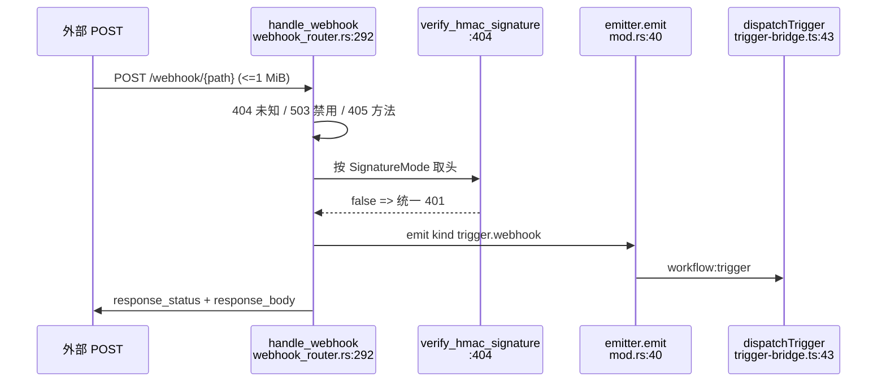
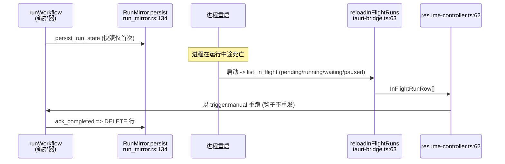

# 触发器与 Rust 后端

<Status variant="stable" />

<TLDR>
Rust 负责“何时启动工作流”（cron 守护进程 + axum webhook 接收器）以及“运行或 waitpoint 能否跨崩溃存续”（SQLite 镜像），TS 编排器负责步骤执行。每个正式触发器都汇入 `dispatchTrigger(event)`，再由 Execution Authority 冻结当前 production artifact 后启动编排器。跨进程触发仍通过单一 `workflow:trigger` Tauri 事件；Web 则由 Dexie 承担运行状态与 durable waitpoint fallback。
</TLDR>

## 触发器分类

五类触发器（外加 `trigger.goal.completed`）按"谁来触发"划分。Rust 触发那两个必须在 webview 关闭时仍运行的（cron、webhook）；TS 触发那三个挂在进程内事件总线上的（连接器入站、聊天消息、目标完成）；`trigger.manual` 仅 TS。

| 类别 | 触发方 | 路径与 file:line |
| --- | --- | --- |
| `trigger.manual` | 仅 TS | 编辑器 Preview/Test 可运行 draft；IM、CLI、MCP、API 与运维入口进入 Execution Authority；崩溃恢复以同一 run id 重入冻结快照。 |
| `trigger.cron` | Rust 守护进程 | `cron_daemon.rs` -> `workflow:trigger` -> `listenTriggerEvents` -> `dispatchTrigger` -> `executeDeployedWorkflow`。 |
| `trigger.webhook`（+`trigger.github.webhook`） | Rust axum | `webhook_router.rs:292` `handle_webhook` -> HMAC `L404` -> `state.emitter.emit`（`kind:"trigger.webhook"`）-> `mod.rs:40` -> `workflow:trigger` -> `trigger-bridge.ts:43`。注册 `commands.rs:47` `state.webhook.upsert` |
| `trigger.connector.inbound` | TS 钩子 | `ConnectorBus` -> `findMatchingWorkflows("trigger.connector.inbound")` -> `dispatchTrigger`。Rust 空操作 `commands.rs:83` |
| `trigger.chat.message` | TS 钩子 | `lib/db/messages.ts` `findMatchingWorkflows("trigger.chat.message",{characterId,sessionId})` -> `dispatchTrigger`（懒加载导入以避免内存峰值）。Rust 空操作 |

`trigger.goal.completed` 也被索引（`trigger-subscriptions.ts:32`），由 `lib/goal` 中的目标完成联动触发。

## TS 运行时桥（lib/workflow/runtime/）

| 文件 | Symbol:line | 职责 |
| --- | --- | --- |
| `trigger-bridge.ts` | `installTriggerBridge:21` | 启动时挂载一次；包装 `listenTriggerEvents`、校验、调用 `dispatchTrigger` |
| `trigger-bridge.ts` | `dispatchTrigger` | 正式触发收口——通过 Execution Authority 准入当前 production deployment |
| `trigger-bridge.ts` | `isTriggerEvent:61` | 入站 `workflow:trigger` 载荷的形状守卫 |
| `trigger-subscriptions.ts` | `INDEXED_KINDS:32` | TS 侧触发器节点的内存索引；仅 `connector.inbound` / `chat.message` / `goal.completed`（cron/webhook 被排除——Rust 拥有它们） |
| `trigger-subscriptions.ts` | `rebuildIndex:45` / `initTriggerSubscriptions:66` | 由对工作流的 Dexie `liveQuery` 重建；幂等、window 守卫 |
| `trigger-subscriptions.ts` | `findMatchingWorkflows:128` / `matches:137` | 同步缓存读取；必需 vs 可选参数，空参数 = 匹配任意 |
| `webhook-bridge.ts` | `syncWorkflowTriggers:35` / `syncOneTrigger:40` | 过滤 `n.type.startsWith("trigger.")`，逐个急切注册（Rust 处理器幂等，不计算差异） |
| `tauri-bridge.ts` | `safeInvoke:34` + 6 个命令 `L46-81` | `persistRunState` / `registerTrigger` / `unregisterTrigger` / `reloadInFlightRuns` / `ackRunCompleted` / `getWebhookUrl` |
| `tauri-bridge.ts` | `listenTriggerEvents:90` / `listenResumeEvents:101` | 订阅 `workflow:trigger` 与 `workflow:resume`；`!isTauri()` 时全部空操作 |
| `workflow-waitpoints.ts` / `waitpoint-repository.ts` | durable repository | 审批、风险闸门与事件等待共用的持久检查点；事件先持久化、只消费一次 |
| `start-from-im.ts` | `startWorkflowFromIM` | 准入 production artifact，并在新运行行持久化后返回 |
| `run-status-bridge.ts` | 状态观察器 | 通过 Dexie v156 运行索引跟踪最近运行 |

```ts
// lib/workflow/runtime/trigger-bridge.ts:43
await executeDeployedWorkflow({
  workflowId: event.workflowId,
  entrypoint: "trigger",
  caller: event.kind,
  triggerKind: event.kind,
  triggerId: event.triggerId,
  payload: event.payload,
})
```

`webhook-bridge.ts` 将节点配置映射到 Rust 注册形状。`flow.wait(event)` 会先持久化事件，再按 key、可选 correlation id 和 run start 边界匹配；未匹配事件 24 小时后过期。**恢复不经过 `dispatchTrigger`**：它复用冻结快照、原 run id、trace、lineage、security context 与已完成步骤缓存，也不会重复触发插件 hook。

## Rust 后端（src-tauri/src/workflow/）

| 文件 | Symbol:line | 职责 |
| --- | --- | --- |
| `mod.rs` | `AppHandleEmitter:34` / `impl TriggerEmitter:38` | 唯一的 Rust->TS 发射点：`Emitter::emit(&handle, "workflow:trigger", event)` |
| `state.rs` | `WorkflowState:14` / `open:25` | 持有 `{mirror, cron, webhook}`；`open(mirror_path, emitter)` 接线三者但不启动循环；`impl Drop:51` 调用 `webhook.stop()` |
| `types.rs` | workflow DTO | camelCase trigger/run DTO，以及 `WorkflowWaitpointRow`、决策输入和 durable wait-event 行 |
| `commands.rs` | `workflow_register_trigger:21` | 分派 `L26-85`：cron -> `state.cron.upsert`；webhook/github.webhook -> `WebhookEntry` + `state.webhook.upsert`；connector/chat/manual -> 空操作 Ok `L83`；否则报错 |
| `commands.rs` | run + waitpoint 命令 | 运行镜像命令，以及 waitpoint create/get/list/decide 和 wait event persist/prune |
| `run_mirror.rs` | `RunMirror` | in-flight run、durable waitpoint、首次决策胜出与 24 小时 wait event 的 SQLite 镜像 |
| `triggers/cron_daemon.rs` | `CronDaemon:110` / `upsert:127` / `spawn:177` / `fire:229` | 进程内 cron（`cron::Schedule`，含秒的 6-7 字段），只要 Tauri 进程运行就触发，不论 webview 状态 |
| `triggers/webhook_router.rs` | `WebhookRouter:120` / `start:210` / `handle_webhook:292` / `verify_hmac_signature:404` | 本地 axum 接收器，仅绑 `127.0.0.1`，1 MiB body 上限，HMAC-SHA256 |

启动接线（`lib.rs:872-903`）：`default_mirror_path` -> `AppHandleEmitter` -> `WorkflowState::open` -> `cron.clone().spawn()` `L884` -> `async_runtime::spawn webhook.start(emitter, 0)` `L894-896`（port 0 = OS 选）-> `app.manage(state)`。Web 模式永不到达此分支。`triggers/mod.rs:1` 只暴露 `cron_daemon` 与 `webhook_router`（连接器入站 + 聊天接入点留在 TS 侧）。

```rust
// src-tauri/src/workflow/mod.rs:38
impl TriggerEmitter for AppHandleEmitter {
    fn emit(&self, event: types::TriggerEvent) {
        if let Err(err) = tauri::Emitter::emit(&self.handle, "workflow:trigger", event) {
            log::warn!("workflow:trigger emit failed: {err}");
        }
    }
}
```

### Cron 守护进程——触发路径

cron 守护进程不同于 `crate::scheduler`（OS 级）：它是进程内的，只要进程运行就触发（托盘 / 最小化）。`CronEntry:34` 缓存 `next_fire_at`；`recompute:46` 用 `schedule.after(&anchor).next()`；`next_fire:66` 是已启用条目的最小值；`due_ids:76` 收集可触发 id。`spawn:177` 必须用 `tauri::async_runtime::spawn`（普通 `tokio::spawn` 在 setup 中会 panic）；`run_loop:186` 睡到下次触发（下限 25ms，空闲上限 1h 由 `Notify` 唤醒）；`fire:229` 发出 `kind:"trigger.cron"`，载荷 `{triggerId, firedAt}`。

```rust
// src-tauri/src/workflow/triggers/cron_daemon.rs:66
fn next_fire(&self) -> Option<DateTime<Utc>> { self.entries.values().filter(|e| e.enabled).filter_map(|e| e.next_fire_at).min() }
// run_loop sleep: Some(t) => from_millis(((t - now).max(0)).max(25)), None => from_secs(3600)
// tokio::select! { _ = sleep(sleep_dur) => {} _ = self.notify.notified() => {} }
```

```mermaid
sequenceDiagram
  participant Loop as run_loop<br/>cron_daemon.rs:186
  participant Fire as fire()<br/>:229
  participant Emit as AppHandleEmitter<br/>mod.rs:40
  participant Listen as listenTriggerEvents<br/>tauri-bridge.ts:90
  participant Disp as dispatchTrigger<br/>trigger-bridge.ts:43
  Loop->>Loop: sleep 到 next_fire_at (下限 25ms)
  Loop->>Fire: due_ids(now)
  Fire->>Emit: emit kind trigger.cron
  Emit->>Listen: Tauri 事件 workflow:trigger
  Listen->>Disp: 校验后的 TriggerEvent
  Disp->>Disp: getWorkflow + 插件钩子 + runWorkflow
```

### Webhook 接收器——POST 路径

`start:210` 绑定 `127.0.0.1`，路由 `/webhook/{*path}`（任意方法）外加 404 的 `/webhook/`，套用 `RequestBodyLimitLayer`，并经 `stop:257` 支持优雅关停。`upsert:153` 以 path 为键并拒绝跨触发器冲突；`bound_url_for_path:197` 返回 `http://{addr}/webhook/{path}`（仅在绑定后经 `workflow_get_webhook_url` 可知）。`handle_webhook:292` 按序把关：404 未知 -> 503 禁用 -> 405 方法 -> 401 HMAC -> 解析 body -> 发出 `kind:"trigger.webhook"` -> 以 `response_status` / `response_body` 响应。`SignatureMode:63` 默认 `Cognia`（头 `x-signature-256`）vs `github`（`x-hub-signature-256`）；注册在 kind 为 github 风味时默认 github，否则 cognia。

```rust
// src-tauri/src/workflow/triggers/webhook_router.rs:404
fn verify_hmac_signature(secret, body, headers, mode) -> bool {
    let Some(raw) = headers.get(mode.header_name()) else { return false };
    let Ok(value) = raw.to_str() else { return false };
    let Some(hex_part) = value.strip_prefix("sha256=") else { return false };
    let Ok(provided) = decode_hex(hex_part) else { return false };
    let mut mac = match <Hmac<Sha256> as KeyInit>::new_from_slice(secret.as_bytes()) { Ok(m) => m, Err(_) => return false };
    mac.update(body);
    mac.verify_slice(&provided).is_ok()
}
```



### 崩溃恢复——运行镜像 + 恢复

镜像是薄影子，非权威——Dexie 事件日志才是数据源。`open:60` 是懒的（注册路径，不碰磁盘）；`conn:96` 在首次真正使用时做 `get_or_try_init`（mkdir、打开、DDL）。`persist:134` 保留已有 snapshot/started_at（`INSERT ... ON CONFLICT(run_id) DO UPDATE`），因此快照仅首次持久化时必需。`list_in_flight:192` 选取 `status IN (pending/running/waiting/paused) ORDER BY started_at ASC`；`ack_completed:231` 直接 `DELETE` 该行。启动时 `reloadInFlightRuns`（`tauri-bridge.ts:63`）读取幸存者，恢复控制器以 `trigger.manual` 重跑（不经 `dispatchTrigger`，故钩子不重发）。

```rust
// src-tauri/src/workflow/run_mirror.rs:111
CREATE TABLE IF NOT EXISTS workflow_run_mirror (
    run_id TEXT PRIMARY KEY, workflow_id TEXT NOT NULL, status TEXT NOT NULL,
    last_step_id TEXT, snapshot_json TEXT NOT NULL, started_at INTEGER NOT NULL, updated_at INTEGER NOT NULL
);
CREATE INDEX IF NOT EXISTS idx_run_mirror_status ON workflow_run_mirror(status);
CREATE INDEX IF NOT EXISTS idx_run_mirror_workflow ON workflow_run_mirror(workflow_id);
-- PRAGMA journal_mode=WAL; synchronous=NORMAL (L108-109)
```



## 坑点

- **Web 模式完全空操作**——`isTauri()` 门（`tauri-bridge.ts:21`）：`safeInvoke` 返回 null，`reloadInFlightRuns` 返回 `[]`，监听器空操作。整个 Rust 平面永不启动。
- **Webhook 仅桌面且端口短暂**——绑 `127.0.0.1:0`，故 URL 仅在绑定后经 `workflow_get_webhook_url` 可知。
- **HMAC 细节**——`sha256=` 十六进制前缀，按 `SignatureMode` 取头，常数时间 `verify_slice`，任何失败统一 401；github 模式触发器不会校验 cognia 模式签名，反之亦然。
- **Body 上限 1 MiB**——`RequestBodyLimitLayer` 在处理器运行前以 413 拒绝。
- **镜像是薄影子**——Dexie 事件日志才权威；快照仅首次持久化必需；open 是懒的；`ack_completed` 删行。
- **恢复绕过收口**——使用 `trigger.manual` 且不调用 `dispatchTrigger`，故插件触发钩子不重发。
- **Cron 守护进程 vs OS 调度器**——进程内、`cron` crate 6-7 字段（秒）、`spawn` 必须用 `tauri::async_runtime::spawn`、`next_fire_at` 缓存、sleep 下限 25ms、空闲 1h 由 `Notify` 唤醒。
- **索引范围**——`trigger-subscriptions` 仅索引 `connector.inbound` / `chat.message` / `goal.completed`；`run-status-bridge` 锁定 `[workflowId+startedAt]` v22 索引。

## 另见

- [index](./index) · [runtime-execution](./runtime-execution) · [data-model](./data-model) · [ui-runs](./ui-runs)
- [../scheduler](../scheduler)（OS 级闹钟守护进程，区别于进程内 cron 守护进程）· [../platform-connectors](../platform-connectors)（`ConnectorBus` 入站源）
- [ADR-0011 工作流子系统](../../adr/0011-workflows-subsystem)
