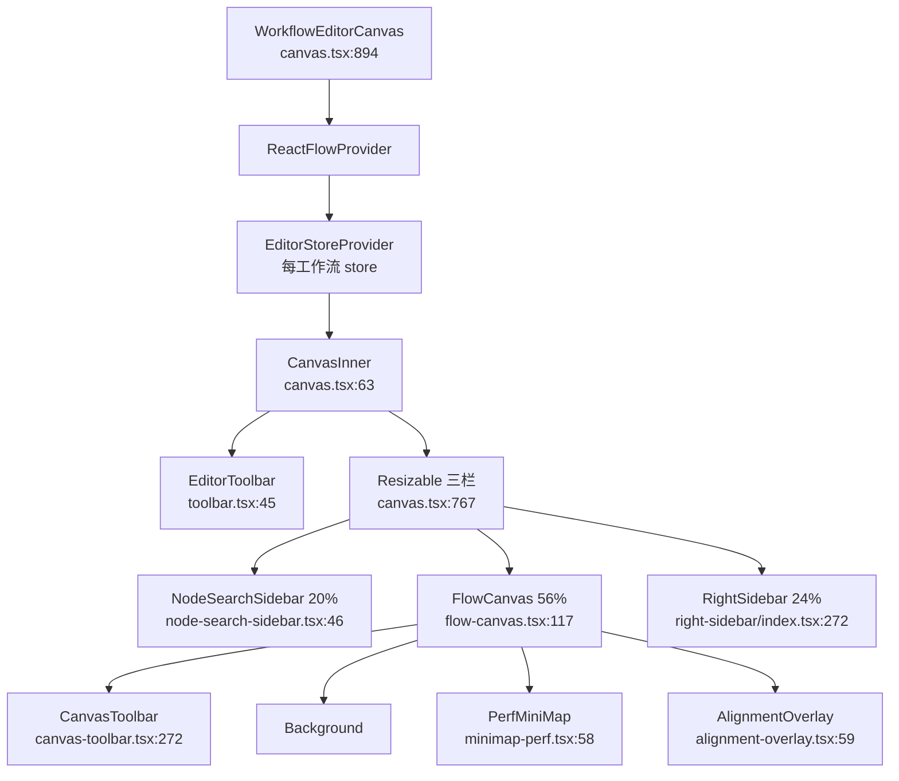
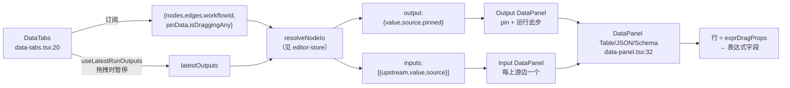
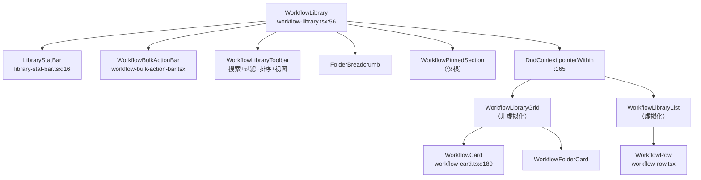
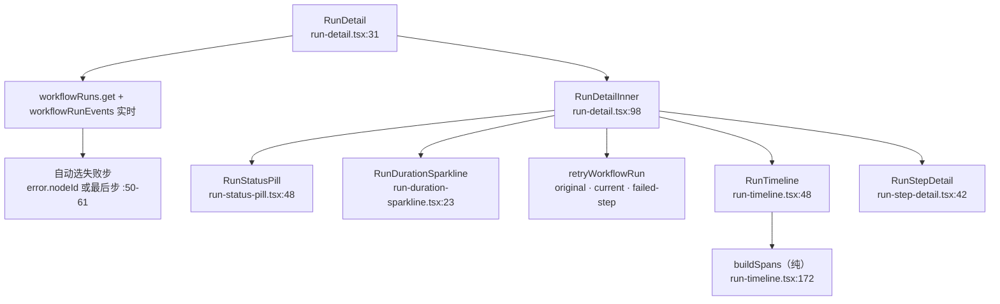
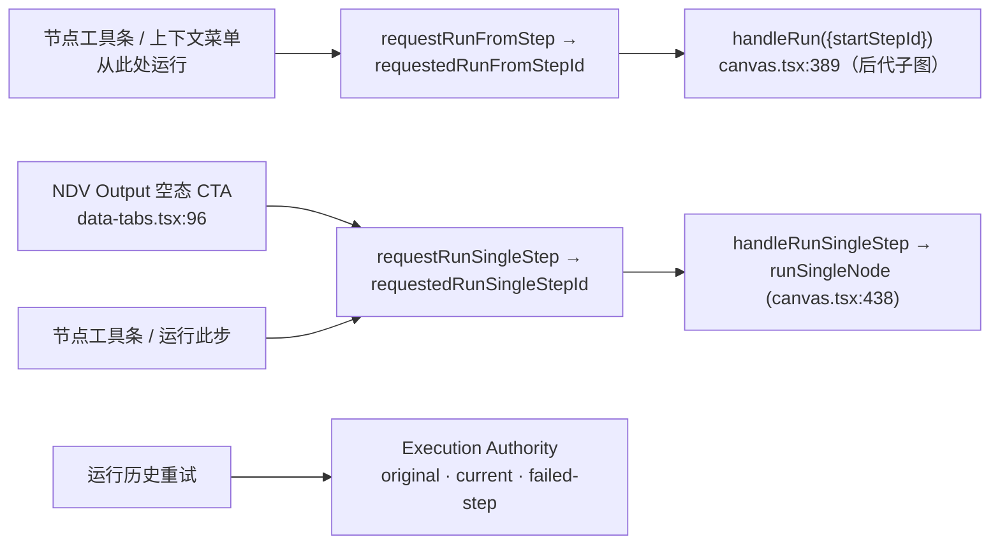

# UI、库与运行历史

<Status variant="stable" />

<TLDR>
用户可触达的一切都位于 `components/workflow/` 之下：三栏编辑器外壳在 `canvas.tsx:894` 挂载“每工作流一份 store”，外层包裹 `ReactFlowProvider` + `EditorStoreProvider`，而 `FlowCanvas`（`flow-canvas.tsx:117`）是**唯一**逐帧订阅者，外壳的其余部分（chrome）通过 `getState()` 读取。选中节点驱动 Config/Input/Output 三段式 NDV 检查器；运行详情显示甘特图、provenance、lineage、immutable version/deployment，并提供三种由 Execution Authority 驱动的重试。路由位于 `app/workflows/`，并通过 `generateStaticParams [{id:"_"}]` 输出静态导出的 `[id]` 占位页。
</TLDR>

纯 store/几何辅助函数（`createEditorStore`、对齐数学、`resolveNodeIo`、`flattenSchema`）记录于 [./editor-store](./editor-store) —— 本页仅引用而不重复推导。节点语义见 [./node-system](./node-system)，copilot/表达式面板见 [./expressions-copilot](./expressions-copilot)，执行内部见 [./runtime-execution](./runtime-execution)，schema 见 [./data-model](./data-model)。权威：[../../adr/0034-workflow-editor-completeness-and-plugin-parity](../../adr/0034-workflow-editor-completeness-and-plugin-parity)。

<StatGrid>
- **3** 栏（NodeSearchSidebar 20% / FlowCanvas 56% / RightSidebar 24%）
- **6** 个右侧栏标签（chat / inspector / runs / templates / settings / changelog）
- **6** 个运行操作：三个 draft editor 操作，加原版本、当前 deployment、失败步骤三种重试
- **~70** 个 NDV 注册表中的按 kind 配置组件
</StatGrid>

## 编辑器外壳

画布拥有**每工作流一份 store 的生命周期**：`WorkflowEditorCanvas`（`canvas.tsx:894`，props 在 `canvas.tsx:889`）在 `useState` 中惰性构建 `EditorStore`，当 `workflow.id` 变化时在渲染期重置，并包裹 `ReactFlowProvider` + `EditorStoreProvider`（`canvas.tsx:894-913`）。`CanvasInner`（`canvas.tsx:63`）读取一个 chrome 切片（`canvas.tsx:76-100`），它**不**订阅 nodes/edges —— 只取 `nodeCount` + viewport，因此外壳重渲染保持廉价。

| 区域 | 组件 | 行号 | 职责 |
| --- | --- | --- | --- |
| 外壳入口 | `WorkflowEditorCanvas` | `canvas.tsx:894` | 每工作流 store + providers |
| 内层 | `CanvasInner` | `canvas.tsx:63` | chrome 切片、运行 effect、拖放、快捷键 |
| 布局 | 三栏 `ResizablePrimitive.Group` | `canvas.tsx:767-848` | 搜索 20% / 画布 56% / 右栏 24% |
| 顶栏 | `EditorToolbar` | `toolbar.tsx:45` | 名称、dirty 徽标、溢出菜单、Save、Run |
| 浮动 | `CanvasToolbar` | `canvas-toolbar.tsx:272` | 添加节点、缩放、锁定、自动布局 |
| 画布 | `FlowCanvas` | `flow-canvas.tsx:117` | 唯一的逐帧订阅者 |



### 唯一的逐帧订阅者

`FlowCanvas`（`flow-canvas.tsx:117`）是唯一逐帧订阅的组件：`{nodes, edges, viewport, isDraggingAny, snapToGrid}`（`flow-canvas.tsx:141-149`）。`nodeTypes`/`edgeTypes` 将 `workflowNode` 映射到 `WorkflowNodeComponent`、`default`/`smart` 映射到 `SmartEdge`（`flow-canvas.tsx:75-82`）。每个变更处理器都通过 `getState()` 读取实时 store 以规避陈旧闭包：`onNodesChange` / `onEdgesChange` / `onConnect`（经 `validateConnection` 校验，`flow-canvas.tsx:190`）位于 `flow-canvas.tsx:161-215`。拖拽与对齐：`handleNodeDragStart` 快照对等矩形 + `beginDragHistory`（`flow-canvas.tsx:260`），`handleNodeDrag` 为 rAF 节流的 `computeAlignmentGuides`（`flow-canvas.tsx:296`），`handleNodeDragStop` 调用 `commitDragHistory`（`flow-canvas.tsx:322`）。`ReactFlow` 元素配置 `panOnScroll` / `selectionOnDrag` / `deleteKeyCode` / `multiSelectionKeyCode`（`flow-canvas.tsx:362`），包裹于 `PerfBoundary`（`flow-canvas.tsx:361`），并在 `nodes.length >= cullingThreshold || tier !== "high"` 时经 `onlyRenderVisibleElements` 进行档位剔除（`flow-canvas.tsx:400-402`）。

### 拖放、快捷键与运行 effect

拖放处理器（`canvas.tsx:669-683`）读取 `event.dataTransfer.getData(NODE_DRAG_MIME)`，执行 `screenToFlowPosition`，随后 `addNode` + `recordUsed`。快捷键覆盖 `Ctrl+S/Z/Y/K/F` 及剪贴板 `A/C/X/V/D/G`（`canvas.tsx:553-660`）。运行接线：`handleRun`（`canvas.tsx:315`，可选 `startStepId`）与 `handleRunSingleStep`（`canvas.tsx:401`，经 `runSingleNode`）都在 `revalidateAll` 存在问题时阻断（`canvas.tsx:320-327`）；store 驱动的请求 effect 为 `requestedRunFromStepId`（`canvas.tsx:389`）与 `requestedRunSingleStepId`（`canvas.tsx:438`）。

### 节点与边渲染

`WorkflowNodeComponent`（memo，`nodes/workflow-node.tsx:155`）使用细粒度的 `useNodeDecoration(id)`（`nodes/workflow-node.tsx:173`），使节点仅在自身状态变化时重渲染。它承载 `StatusCornerBadge`（`nodes/workflow-node.tsx:78`）、`LastRunFooter`（`nodes/workflow-node.tsx:113`）、AI 生成徽标（`nodes/workflow-node.tsx:306`）、target/source 句柄（`nodes/workflow-node.tsx:349` / `397`）、当 `errorPolicy === "branch"` 时的错误分支句柄（`nodes/workflow-node.tsx:257` + `402-419`）、连接态光环（`nodes/workflow-node.tsx:241-253`）、便签颜色覆盖（`nodes/workflow-node.tsx:268`），以及 `NodeFloatingToolbar`（`nodes/workflow-node.tsx:316`）。浮动工具条（`nodes/node-floating-toolbar.tsx:43`）有 5 个 ghost 按钮 —— Run（对 trigger/annotation 禁用，`nodes/node-floating-toolbar.tsx:82`，触发 `requestRunFromStep`）、Copy、Configure（`setSelectedNodes`）、Delete、More（`requestContextMenu`，`nodes/node-floating-toolbar.tsx:162-166`）—— 动画受门控（`nodes/node-floating-toolbar.tsx:69-72`）。`SmartEdge`（memo，`edges/smart-edge.tsx:56`）经 `computeSmartRoute` 布线（`edges/smart-edge.tsx:98`），显示 then/else/true/false/error 类型芯片（error 由 `sourceHandleId === "error"` 推断，`edges/smart-edge.tsx:114-119`），支持双击内联编辑标签（`edges/smart-edge.tsx:193-222`），仅订阅节点**计数**原语（`edges/smart-edge.tsx:90-93`），并在 reduced 档位剥离虚线动画（`edges/smart-edge.tsx:130-140`）。

### 发现与覆盖层

`NodeSearchSidebar`（memo，`node-search-sidebar.tsx:46`）是调色板与拖拽源。规范的拖拽 MIME 为 `NODE_DRAG_MIME = "application/x-workflow-kind"`（`node-search-sidebar.tsx:34`）；插件目录经 `useSyncExternalStore` 流入（`node-search-sidebar.tsx:68`），分组态与搜索态（`node-search-sidebar.tsx:73-82`），收藏/最近来自 `usePalettePreferencesStore` 且与实时目录 kind 取交集（`node-search-sidebar.tsx:88-111`，`PinnedNodeGroup` 在 `:227`）。`NodeChip`（`node-search-sidebar.tsx:269`）在拖拽开始时设置两种 MIME（`node-search-sidebar.tsx:285-287`），切换收藏（`node-search-sidebar.tsx:316-331`），并显示 `desktopOnly` 徽标（`node-search-sidebar.tsx:304`）。

```tsx
// node-search-sidebar.tsx:285
e.dataTransfer.setData(NODE_DRAG_MIME, entry.kind);
e.dataTransfer.setData("text/plain", entry.kind);
```

| 覆盖层 | 组件 | 行号 | 角色 |
| --- | --- | --- | --- |
| 命令面板 | `CommandPalette` | `command-palette.tsx:59` | Cmd-K：动作 `:107-195`、添加节点 `:199-224`、最近（5）`:226-245` |
| 画布搜索 | `SpotlightSearch` | `spotlight-search.tsx:37` | Ctrl-F：过滤 `:104`、平移 + 脉冲 `:121`、上限 200 `:81` |
| 缩略图 | `PerfMiniMap` | `minimap-perf.tsx:58` | 降级时剥离平移/缩放 + 扁平配色 |
| 性能档位 | `PerformanceTierFields` | `performance-tier-popover.tsx:33` | auto/high/balanced/reduced；解析出的有效档位 `:65` |
| 选择 | `SelectionToolbar` | `selection-toolbar.tsx:181` | 唯一订阅 `selectedNodeIds` `:187`；对齐/分布 `:213-218` |
| 上下文菜单 | `CanvasContextMenu` | `canvas-context-menu.tsx:52` | pane/node/edge；运行按类别门控 `:198`；反向已校验 `:278` |
| 书签 | `ViewportBookmarksContent` | `viewport-bookmarks.tsx:48` | Dexie list/save/delete + `useLiveQuery` |
| 面包屑 | `ViewportBreadcrumb` | `viewport-breadcrumb.tsx:80` | 名称 + 活动分组面包屑，rAF 节流 `:86-96` |
| 套索 | `LassoOverlay` | `lasso-overlay.tsx:33` | Alt+拖拽多边形，`nodeIdsInPolygon` `:95`，`ViewportPortal` `:134` |
| 对齐 | `AlignmentOverlay` | `alignment-overlay.tsx:59` | `ViewportPortal` 中的虚线 SVG 辅助线 |
| 连接 | `ConnectionPointerListener` | `connection-overlay.tsx:82` | `SNAP_DISTANCE_SCREEN` 32 `:28` + ghost 工厂 `:161` |
| 速查表 | `ShortcutsCheatsheet` | `shortcuts-cheatsheet.tsx:72` | 快捷键参考 |

## 检查器（NDV）

`InspectorPanel`（memo，`inspector-panel.tsx:351`）是 Node Detail View。选择器经 WeakMap `getNodeIndex` 解析 `selectedId`、`isMultiSelect` 与 `{node, validation}`（`inspector-panel.tsx:120-139`）；多选时路由到 `BulkNodeInspector`（`inspector-panel.tsx:207`）。按 kind 的表单由 `NodeConfigFormSection`（memo，`inspector-panel.tsx:48`）调用 `getNodeConfigComponentForEntry({kind, paramsSchema})` 派发（`inspector-panel.tsx:59`）；共享的 label/notes/disabled 字段渲染于 `inspector-panel.tsx:279-305`，包裹于 `FieldErrorProvider` + `InspectorExpressionProvider`（`inspector-panel.tsx:307-316`）。重校验防抖 150ms（`inspector-panel.tsx:73`）并在选中变化时刷新（`inspector-panel.tsx:157-165`）；错误徽标经 `jumpToNextError` 循环 `[data-invalid="true"]`（`inspector-panel.tsx:189-205`）。面板承载包裹配置子节点的 `DataTabs`（`inspector-panel.tsx:277`）。

### 配置派发器

`getNodeConfigComponentForEntry`（`inspector/node-config-registry.tsx:198`）是规范派发器：内置 `REGISTRY`（`Partial<Record<WorkflowNodeKind, NodeConfigComponent>>`，约 70 条映射，`inspector/node-config-registry.tsx:97`）优先命中；否则 `paramsSchema` 驱动 `SchemaForm`（`inspector/node-config-registry.tsx:205`）；再否则 `GenericJsonConfig`。`getNodeConfigComponent(kind)`（`:188`）与 `hasDedicatedConfig`（`:215`）为查找辅助函数。

```ts
// node-config-registry.tsx:201
const builtIn = REGISTRY[entry.kind];
if (entry.paramsSchema) {
  // ... SchemaForm ...
}
```

### NDV 数据标签（Config / Input / Output）

`DataTabs`（`inspector/data/data-tabs.tsx:20`）是 Config/Input/Output 的 `ToggleGroup`（`:65`）。它订阅 `{nodes, edges, workflowId, pinData, isDraggingAny}`（`:32`），并以 `latestOutputs = useLatestRunOutputs(workflowId, !isDraggingAny, {anyStatus: true})`（`:49`）调用 `resolveNodeIo`（`:51`）—— 因此实时输出读取在拖拽期间暂停。**Config** 渲染 `children`；**Output** 是带 pin + `onRunStep` 的单个 `DataPanel`（`:86`）；**Input** 为每条上游边渲染一个 `DataPanel`（`:100-121`）。



`DataPanel`（`inspector/data/data-panel.tsx:32`）提供 Table/JSON/Schema `ToggleGroup`（`:97`）、数组项导航器（`:122-148`）、`source === "none"` 时带**运行此步** CTA 的空态（`:59-74`）、pin 徽标（`:114`），以及 pin/unpin/编辑 fixture（`:82`）。`DataTableView`（`data-table-view.tsx:15`）的行（`FieldRow` `:66`）经 `exprDragProps` 作为拖拽源插入表达式引用；`DataSchemaView`（`data-schema-view.tsx:15`）渲染 `flattenSchema` 路径，其行同样可拖拽（`:36`）。`source` 取值为 `pin | run | none`。

### 表单、边与批量

`inspector/forms/index.tsx`（2538 行）容纳约 70 个就地的按 kind 配置组件（如 `ManualTriggerConfig` `:54`、`CronConfig` `:60`）。`inspector/forms/shared.tsx` 提供 `Field`（盖戳 `data-invalid`，`:53`/`:81`）、`FieldErrorProvider`/`useFieldError`/`useTranslatedError`（`:16`/`:36`）、强制转换器 `readString`/`readNumber`/`readBoolean`（`:115-134`），以及 `patchParam`（`:140`）。`inspector/forms/schema-form.tsx` 为插件节点把 JSON-Schema 转成表单 —— `SchemaForm`（`:521`）、`StringField`（`:99`，enum→Select，format expression/textarea/password/url/email）、`NumberField`（`:217`）、`BooleanField`（`:262`）、`StringArrayField`（`:295`）、`JsonFallbackField`（`:350`）、`ObjectFields`（`:400`，递归 + 播种默认值 `:412-426`）。expression-field 及其它共享控件位于 `inspector/forms/shared/*`（expression-field 记录于 [./expressions-copilot](./expressions-copilot)）。

`EdgeInspector`（memo，`edge-inspector.tsx:264`）编辑 label + kind（`EDGE_KINDS` `:40`）、反向与删除。它执行**双字段写入** —— 顶层 `label` + `data.label`，以及 `data.kind` + `data.workflowKind`（`edge-inspector.tsx:9-15`）—— 使实时渲染与保存均得以保留；`setLabel`（`:95`）、`setKind`（`:108`）、多边批量删除（`:133`）。`BulkNodeInspector`（memo，`bulk-node-inspector.tsx:196`）仅做跨 kind 安全的操作：三态 disabled（`:55-68`）+ 经 `updateNodeDataBatch` 的 notes 应用/清除（单次撤销，`:70`）；按设计 params **不**可批量编辑，批量删除经 `AlertDialog` 确认（`:149`）。

## 右侧栏

`RightSidebar`（memo，`right-sidebar/index.tsx:272`）是 6 标签的 `Tabs` 网格（`:139`，`grid-cols-6`）：chat | inspector | runs | templates | settings | changelog（`:56`）。非 inspector 标签惰性加载（`:40-54`）；默认 chat（`:70`）；在 `0 -> >=1` 选中时自动切到 inspector，除非 chat 被钉住（`:73` / `:99-105`）。chat 为 `forceMount` 并带 Activity 覆盖层（`:162-188`），inspector 标签在仅选中边时渲染 `EdgeInspector`，否则 `InspectorPanel`（`:189-195`）。

| 标签 | 组件 | 行号 | 内容 |
| --- | --- | --- | --- |
| runs | `RunsTab` | `right-sidebar/runs-tab.tsx:35` | 侧栏执行；`RunListRail` `:50` → `RunDetailRail` `:121`（自动选失败/最后步 `:145`）；画布揭示 `:159` |
| settings | `SettingsTab` | `right-sidebar/settings-tab.tsx:37` | envelope mutators；运行策略 / 重试 / 时区 / 变量 / 凭据 / 插件 / 扇出 |
| changelog | `ChangelogTab` | `right-sidebar/changelog-tab.tsx:43` | 来自 `workflowProposalHistory` 的提案应用/丢弃时间线（`:56-72`） |
| templates | `TemplatesTab` | `right-sidebar/templates-tab.tsx:51` | copilot 脚手架 → `materializeCopilotTemplate` → `templateToProposalOps` |

`SettingsTab` 经 store envelope mutators `setSettings`/`setVariables`/`setCredentials` 编辑（Ctrl+S 持久化），分区包含 `errorPolicy` stop/continue/branch（`:70`）、timeout `DurationField`、concurrency/`maxConcurrency`、重试 attempts/backoff/baseMs/maxMs、时区 `TimezoneSelect`、`WorkflowVariablesEditor`、`WorkflowCredentialsList`、`PluginCapabilitiesSection` 与 `FanoutSubscriptionsPanel`。支撑控件：`PluginCapabilitiesSection`（`right-sidebar/settings/plugin-capabilities-section.tsx:40`，只读插件节点/触发器 + 带警告芯片的插件模板及 Use）、`WorkflowCredentialsList`（`workflow-credentials-list.tsx`）、`WorkflowVariablesEditor`（`workflow-variables-editor.tsx:43`，`KEY_RE = /^[A-Za-z_][A-Za-z0-9_]*$/` `:19`，内联重复/非法错误）。

## 工作流库

`WorkflowLibrary`（`workflow-library.tsx:56`）是页面编排器。UI 状态来自 `useWorkflowLibraryStore`（`currentFolderId`/`viewMode`/`sort`/`filters`/`query`，`:58-64`）；实时数据使用按文件夹作用域的 `listChildFolders`/`getFolderPath`/`listWorkflowsInFolder` 加上 `getRecentlyFailedWorkflowIds`/`getRunCounts`（`:66-87`）—— 文件夹作用域是主要的性能杠杆。可见集合为 `filterWorkflows` + `sortWorkflows`（`:89`）。文件夹拖放为 `@dnd-kit/core` 的 `DndContext` 配 `pointerWithin`（`:165`）；`handleDragEnd` 读取 `over.folderId`，运行 `resolveDragMoveIds`，再 `moveWorkflowsToFolder`（`:140-153`），配 `DragOverlay`（`:209`）。创建对话框由 `useUIStore.pendingCreateRequest` 驱动（`:114-122`）。



| 关注点 | 组件 | 行号 | 说明 |
| --- | --- | --- | --- |
| 网格 | `WorkflowLibraryGrid` | `workflow-library-grid.tsx:23` | 文件夹 + 工作流网格；**非**虚拟化 |
| 列表 | `WorkflowLibraryList` | `workflow-library-list.tsx:29` | 经 `@tanstack/react-virtual` 虚拟化 `:41`，行高 64 `:18`，overscan 8 |
| 卡片 | `WorkflowCard` | `workflow-card.tsx:189` | 复选框、node/trigger/action/builtin/template/tag 徽标 `:137-168`、pin |
| 统计条 | `LibraryStatBar` | `library-stat-bar.tsx:16` | 4 卡 runs7d/successRate/active/failedToday；全零时自动隐藏 `:36-43` |
| 工具条 | toolbar | `workflow-library-toolbar.tsx` | 搜索 200ms 防抖 + filter + sort + view + 新建文件夹/新建 |
| 过滤 | filter bar | `workflow-filter-bar.tsx` | 类型 all/user/template/builtin + hasTrigger/recentlyFailed |
| 排序 | sort menu | `workflow-sort-menu.tsx` | nameAsc/nameDesc/updated/created/runCount |
| 置顶 | `WorkflowPinnedSection` | `workflow-pinned-section.tsx` | 仅根，来自 `settings.pinnedWorkflowIds` |

只有**列表**视图虚拟化；网格依赖按文件夹作用域的 Dexie 查询以获得有界结果集。

### 文件夹、批量与扇出

文件夹系统配对 `@dnd-kit` 的 draggable/droppable：`workflow-draggable.tsx:18` 用 `useDraggable` 数据 `{type:"workflow", workflowId}`；`workflow-folder-droppable.tsx:23` 用 `useDroppable` id `folder-drop-${id}` 数据 `{type:"folder", folderId}`。文件夹卡片/行（`workflow-folder-card.tsx` / `workflow-folder-row.tsx`）调用 `enterFolder`；`workflow-folder-menu.tsx` 重命名并经 `deleteFolder(id, "reparent")` 删除，使内容移至父级（`:46`）；另有面包屑（`workflow-folder-breadcrumb.tsx`）与创建/移动对话框。

批量操作：`WorkflowBulkActionBar`（`workflow-bulk-action-bar.tsx`）在 `selection.size > 0` 时吸附（Move/Tag/Delete/Clear），标签经 `workflow-bulk-tag-dialog.tsx`。`FanoutSubscriptionsPanel`（`fanout-subscriptions-panel.tsx:50`）把每工作流的运行进度镜像到 IM 频道 —— 适配器选择器 + `conversationKey` + 启用 + 删除，经 `createFanoutSubscription`/`setSubscriptionEnabled`/`deleteFanoutSubscription` 操作实时 `workflowFanoutSubscriptions`，在**下一次**运行开始时读取。

后端 name→id 解析器 `lib/workflow/library/lookup.ts` 与 UI store 不同：`findWorkflowByName`（`:47`，精确 → 子串 → 歧义，`MAX_CANDIDATES` 5 `:34`）与 `listWorkflowSummaries`（`:84`）为纯 Dexie，可被插件执行器与 IM 总线调用。

## 运行历史

运行历史是从持久事件日志构建的甘特图时间线。`RunTimeline`（`run-timeline.tsx:48`）渲染条形；纯函数 `buildSpans`（`run-timeline.tsx:172`）将逐事件日志按 `stepId` 卷积成一个 `StepSpan`：首个 `step_started` 胜出（重试递增 `attemptCount`，`:177-191`），`step_completed → succeeded`（`:192`），`step_failed → failed`（`:195`），`step_skipped`（`:198-211`），按 `startTs` 排序（`:214`），运行中的步使用 `fallbackEnd` = 最新事件 ts（`:67-72`）。条形按比例定位 `left = (startTs - startedAt) / total * 100`，最小宽度钳制 0.5%（`:92-94`），按类别配色（`:20-38`），点击 → `onSelectStep`，尝试计数 `xN`（`:154`）。

```ts
// run-timeline.tsx:172
export function buildSpans(events, fallbackEnd): StepSpan[] {
  // 重试经 existing.attemptCount += 1 折叠为同一条形（第 180 行）
}
```



| 组件 | 行号 | 职责 |
| --- | --- | --- |
| `RunDetail` | `run-detail.tsx:31` | 实时联接 run + events；自动选失败/最后步 `:50-61` |
| `RunDetailInner` | `run-detail.tsx` | 状态、trigger/caller、version/deployment/revision、trace 与父子/重试导航 |
| `retryWorkflowRun` | `execution-authority.ts` | 从原版本、当前 production 或失败步骤创建新的 invocation |
| `RunStepDetail` | `run-step-detail.tsx:42` | params 来自 `step_started.payload.params`，output 来自 `step_completed`，错误+栈 `:163` 可重试 `:175`，可过滤日志 `:202-210` |
| `RunList` | `run-list.tsx:28` | 整页表格，实时 `[workflowId+startedAt]` 倒序 |
| `RunStatusPill` | `run-status-pill.tsx:48` | `STATUS_META` `:17` 将 7 种状态映射为颜色+图标；running 旋转 |
| `RunDurationSparkline` | `run-duration-sparkline.tsx:23` | 近 20 次 recharts；`<2` 时隐藏，`MAX_RUNS` 20 `:21` |

`RunStepDetail` **仅**读取持久事件日志 —— 解析后的 params、output、错误消息 + 可折叠栈、跳过原因，以及可过滤的 `run_log` 日志（级别多选 `:210` + 搜索 `:202`），时长计算在 `:57-83`。

### 运行入口



- **从此处运行** → 节点工具条 / 上下文菜单 → `requestRunFromStep`/`requestedRunFromStepId` → `handleRun({startStepId})`（`canvas.tsx:389`，作用域限定到后代子图）。
- **运行此步** → `requestRunSingleStep`/`requestedRunSingleStepId` → `handleRunSingleStep` → `runSingleNode`（`canvas.tsx:438`）；NDV Output 空态 CTA 也触发 `requestRunSingleStep`（`data-tabs.tsx:96`）。
- **原版本** → 使用原始 immutable version 与 dependency lock 从头执行。
- **当前 deployment** → admission 时解析 active production deployment。
- **失败步骤** → 使用原 immutable version，复用已完成输出、跳过其副作用，从失败/选定步骤恢复。

每次重试都会创建新的 run 与 invocation，并记录 `retryOfRunId`、`retryMode` 和操作者。缺少 immutable binding 的历史 draft run 仍可查看，但不能伪装为正式重试。

## 路由与设置

| 路由 | 文件 | 行号 | 行为 |
| --- | --- | --- | --- |
| `/workflows` | `app/workflows/page.tsx` | 26 | `WorkflowLibrary`（桌面）或 `WorkflowList`（移动端，经 `usePlatform`） |
| `/workflows/[id]` | `app/workflows/[id]/page.tsx` | 26 | 服务端占位 `generateStaticParams [{id:"_"}]` 用于 `output:"export"` `:16` |
| 编辑器客户端 | `page-client.tsx` | 27 | `getWorkflow(id)`，为空则 `notFound`，移动端或 `WorkflowEditorCanvas` `data-bg-target="canvas"` `:66` |
| 运行 / 运行详情 | `runs/page.tsx`、`runs/[runId]/page.tsx` | — | `RunList`/`RunDetail`（+ 移动端变体） |

由于应用为静态导出，`[id]` 仅输出单个占位 HTML；真实 id 在运行时经 SPA 客户端路由解析。

设置外壳 `components/settings/workflows/workflows-section.tsx:41` 是按 `?wfTab=` 分键的 5 标签外壳（`:31`）：library / runs / templates / defaults / audit，其中 library 标签内嵌 `WorkflowLibrary`。**已知 i18n 偏差：** 此 section 的字符串为硬编码英文（`:59-88`）—— 本页其余所有界面均完整接入 `next-intl`。

## 注意事项

- **UI 中的性能档位门控** —— 档位标志驱动缩略图可用性、对齐辅助线、边动画，以及 `onlyRenderVisibleElements` 的剔除阈值（`flow-canvas.tsx:400-402`）。
- **仅库列表虚拟化** —— 网格依赖按文件夹作用域的 Dexie 查询（`workflow-library.tsx:66-87`）以获得有界结果集。
- **`FlowCanvas` 是唯一的逐帧订阅者** —— chrome 经 `getState()` 读取，节点/边/面包屑仅订阅 `nodes.length` 原语。
- **i18n 全量接入，唯独** `settings/workflows-section.tsx`（硬编码英文 `:59-88`）。
- **静态导出输出 `[id]` 占位 HTML** —— `generateStaticParams [{id:"_"}]`；真实 id 经 SPA 客户端路由。
- **边双字段写入** —— 顶层 + `data.*`，兼顾保存留存与实时渲染（`edge-inspector.tsx:9-15`）。
