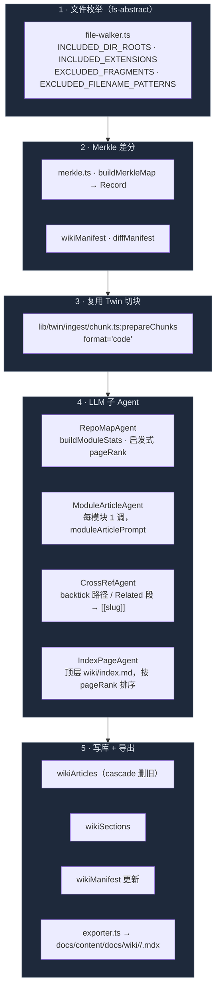

# Wiki 生成器

## 适用场景

- 给 [External Bridge](./external-bridge) 的 `wiki_search` / `wiki_read` / `rag_search` 提供检索数据源。
- 把 wiki 导出成 Fumadocs 兼容的 MDX 文件（`docs/content/docs/wiki/<scope>/<slug>.mdx`），用 docs 子站发布。
- 给 Cognia 内部 UI 提供"模块概览" —— wiki 文章本身可以被设置页或 chat 引用。
- 后续扩展（Phase 3）：把用户外部仓库也用同一条流水线索引一遍，scope=`user-repo`。

## 不适用场景

- Web 模式 —— 走的是 Tauri `plugin-fs`，浏览器没有真实文件系统。
- 文档级别细节（每个函数注释）—— 流水线产出的是模块级综述，不是 doxygen 式 API ref。
- 实时生成 —— 一次全量重建 ~150K LOC × 8K 入 / 2K 出 tokens × N 模块，估算成本 $5-15。Settings UI 默认 incremental。

## 架构



## 关键模块与文件路径

<Files>
  <Folder name="lib/wiki/" defaultOpen>
    <File name="types.ts" />
    <File name="file-walker.ts" />
    <File name="merkle.ts" />
    <File name="prompts.ts" />
    <File name="orchestrator.ts" />
    <File name="exporter.ts" />
    <File name="rebuild-runner.ts" />
    <Folder name="agents/">
      <File name="repo-map-agent.ts" />
      <File name="module-article-agent.ts" />
      <File name="cross-ref-agent.ts" />
      <File name="index-page-agent.ts" />
    </Folder>
  </Folder>
  <Folder name="lib/db/">
    <File name="wiki-articles.ts" />
    <File name="wiki-sections.ts" />
    <File name="wiki-manifest.ts" />
  </Folder>
  <Folder name="components/settings/external-bridge/">
    <File name="wiki-rebuild-card.tsx" />
  </Folder>
</Files>

| 文件                             | 职责                                                                                       |
| -------------------------------- | ------------------------------------------------------------------------------------------ |
| `types.ts`                       | 内部中转类型：`CodeChunk` · `ModuleStat` · `ModuleArticleDraft` · `IndexPageDraft`         |
| `file-walker.ts`                 | 纯函数过滤；`shouldIncludeFile` / `bucketByModule` / `moduleForPath` / `moduleToSlug`      |
| `merkle.ts`                      | SHA-256 增量；`hashContent` · `buildMerkleMap` · `refreshSubset`                           |
| `prompts.ts`                     | 三条 prompt：`WIKI_SYSTEM_VOICE` · `moduleArticlePrompt` · `indexPagePrompt`               |
| `orchestrator.ts`                | `rebuildWiki(deps, opts)` —— 10 步流水线，唯一入口                                         |
| `exporter.ts`                    | `exportWikiToMarkdown(fs, opts)` —— Fumadocs MDX 输出，front-matter 含 generatedAt/version |
| `rebuild-runner.ts`              | Tauri 适配层：`buildTauriFileSystem` + `buildLlmClient`，决定 model + provider             |
| `agents/repo-map-agent.ts`       | 启发式 pageRank（size × boost），不调 LLM                                                  |
| `agents/module-article-agent.ts` | 一模块一次 LLM 调用，`maxTokens=2048` · `temperature=0`                                    |
| `agents/cross-ref-agent.ts`      | 纯 Markdown post-processor，会跳过 fenced code block                                       |
| `agents/index-page-agent.ts`     | 一次 LLM 调用产出顶层 index；`findDeadLinks` 在 assemble 时校验                            |

## 流水线步骤

`orchestrator.ts:rebuildWiki` 的 10 步骤（force=false 增量）：

<Steps>
<Step>**遍历 + 过滤**：`fs.walk(rootDir)` → `filterIncludedPaths` —— 只留 `lib/` `app/` `components/` `hooks/` `types/` 下扩展名为 `.ts` `.tsx` `.rs` `.md` `.mdx` 的文件，丢掉 tests / node_modules / .next / out / dist / coverage / `.claude/worktrees` / `components/ui` / `components/ai-elements`。</Step>
<Step>**读取 + Merkle**：把每个文件读进内存，`buildMerkleMap` 算 `Record<path, sha256>`，SubtleCrypto 微任务并行算。</Step>
<Step>**Diff manifest**：`getWikiManifest(scope)` 取上次 build 的快照 → `diffManifest(prev, current)` 拿出 `added` / `changed` / `removed` / `unchanged` 四组路径。</Step>
<Step>**陈旧清理**：`force=true` → `deleteAllWikiArticlesForScope`；否则 `deleteStaleWikiArticles(scope, generatorVersion)` 删掉旧版本号写入的文章。</Step>
<Step>**切码块**：每个文件喂给 `prepareChunks({ redactedText: content, originalText: content, format: 'code' })` —— 复用 Twin 的 code chunker，函数/类边界感知；空结果时合成单段全文 fallback。每段挂上 `module`（父目录）+ `fileHash`。</Step>
<Step>**RepoMapAgent**：`buildModuleStats(chunks)` 聚合每模块总行/总 token；按 `index.ts` / `page.tsx` / `layout.tsx` / `route.ts` / `mod.rs` / `README.md` 提 1.5× 权重，再归一化到 0-1 的 pageRank。**不调 LLM**。</Step>
<Step>**ModuleArticleAgent**：仅遍历"被触动的模块"集合（即被 added/changed/removed 文件牵连的 module key），每模块一次 `llm.complete(moduleArticlePrompt(...), { system: WIKI_SYSTEM_VOICE, temperature: 0, maxTokens: 2048 })`。错误存进 `errors[]` 而不是 throw —— 一个模块炸了不能整体回滚。</Step>
<Step>**CrossRefAgent**：构建 `SlugIndex`（含未变模块的旧 slug + 新 draft 的 slug），在每篇 article 与 section bodyMd 上跑 `applyCrossRefs`：backtick 路径 `` `lib/twin/ingest` `` → `[[lib-twin-ingest]]`、`## Related` 列表项整段重写。fenced code block 完整 mask 避免被改。</Step>
<Step>**持久化**：`bulkCreateWikiArticles` 写主表；二次 round-trip `bulkCreateWikiSections`；再写一遍 article 的 `sectionIds` 字段。embedding 字段当前由 `embed?` 回调控制，默认 `ZERO_EMBEDDING`（Phase 2 接入真实向量）。</Step>
<Step>**IndexPageAgent + 更新 manifest**：把"新写文章 + 老存量文章"的 summary 全集喂给 `runIndexPageAgent`，一次 LLM 调用产出顶层 index；最后 `upsertWikiManifest({ scope, fileHashes, lastBuildAt, articleCount, generatorVersion })`。</Step>
</Steps>

返回 `RebuildResult`，前端按 `added/changed/removed/unchanged` 打表 + 列每个 module 错误。

## 子 Agent 详解

### RepoMapAgent（启发式 pageRank）

不调 LLM，纯函数。理由：Aider 的真 PageRank 要 tree-sitter 解 import 图，依赖太重 —— Phase 1 用 size-based 兜底。

```ts title="lib/wiki/agents/repo-map-agent.ts"
const BOOST_FILES = new Set([
  "index.ts",
  "index.tsx",
  "page.tsx",
  "layout.tsx",
  "route.ts",
  "mod.rs",
  "lib.rs",
  "main.rs",
  "README.md",
  "README.mdx",
])

// raw = totalLines × (BOOST_FILES.has(basename) ? 1.5 : 1.0)
// pageRank = raw / max(raw)  // normalize 0..1
```

`wiki_search` 把它当 tie-breaker；真 PageRank 在 Phase 2 接入 tree-sitter 后落地。

### ModuleArticleAgent（一模块一调）

```ts title="lib/wiki/prompts.ts"
export const WIKI_SYSTEM_VOICE =
  "You are documenting a TypeScript codebase for downstream LLM coding agents " +
  "(Claude Code, Cursor, Cline). Your output goes directly into a wiki those " +
  "agents will RAG-retrieve to understand the code. Write in concise, " +
  "structural Markdown — short headings, bullet lists for enumerations, code " +
  "references as `path/to/file.ts:line`. No marketing language, no apologies, " +
  "no meta-commentary about your task. Every claim must be grounded in the " +
  "source provided; do not invent helpers, types, or APIs that aren't shown."
```

用户 prompt 把模块的 file list + chunks（在 token budget 内）拼上。模型期望输出 H1 + summary + `## What it does` / `## Public API` / `## Internals` / `## Related` 等结构。`assembleArticle` 把响应切成 `ModuleSectionDraft[]`，注入 `sourceRefs`。

token budget 默认 6000 input / 2048 output，可通过 `RebuildOptions.moduleTokenBudget` 覆盖。

### CrossRefAgent（纯 markdown post-processor）

工作目标：让模型在 prose 里写 `` `lib/twin/ingest` `` 而不需要知道 slug 命名规则，post-processor 把它改写成 `[[lib-twin-ingest]]`。

关键实现：

- fenced code block 用 `^\`\`\`[\\s\\S]\*?^\`\`\``整段 mask，存进`fences[]`，处理完再 splice 回去。
- backtick 路径正则只匹配 `^(lib|app|components|hooks|types)\/[\w./-]+?$`，跳过随手写的 `` `abc.def` ``。
- 多段 path 命中时从最深目录往上 peel —— `lib/foo/bar.ts` 优先匹配 `lib/foo/bar`，再退到 `lib/foo`，最后到 `lib`。

### IndexPageAgent（顶层导航）

把所有 article 的 `(slug, module, summary, pageRank)` 按 pageRank 排序喂给模型，要求按"关联模块"分 H2 组，使用 `[[slug]]` 链接。`assembleIndexPage` 用 `findDeadLinks` 校验：linked slug 必须在 known set 里 —— 失败抛错由 orchestrator 决定重试还是吞。

## 数据库表（Dexie v17）

三张表参与；详见 [存储](../data/storage)。

| 表名           | 主键 / 索引                                     | 用途                                                                 |
| -------------- | ----------------------------------------------- | -------------------------------------------------------------------- |
| `wikiArticles` | `id` · `&slug` · `[scope+module]` · `pageRank`  | 每模块一行，含全文 + embedding + sourceRefs + fileHashes             |
| `wikiSections` | `id` · `articleId` · `[articleId+sectionIndex]` | 文章切出来的段，给 `rag_search` 与未来的 partial regen 用            |
| `wikiManifest` | `scope`（主键 = scope 枚举值）                  | 每个 scope 一行：Merkle 表 + lastBuildAt + articleCount + 生成器版本 |

`wikiArticles.&slug` 是 unique index —— `persistDrafts` 写入前先 `getWikiArticleBySlug` + `deleteWikiArticle` 清旧行（连带 sections cascade）再 `bulkAdd`。

## 配置项与扩展点

### `RebuildOptions`

```ts title="lib/wiki/orchestrator.ts"
export interface RebuildOptions {
  scope: WikiScope // 'cognia-self' | 'user-repo' | 'runtime'
  rootDir: string // 走 walk(rootDir)
  generatorVersion: string // 写入每篇 article + manifest
  force?: boolean // true → 删全 scope 再重建
  moduleTokenBudget?: number // 单模块 chunks token 上限（默认 6000）
}
```

### `FileSystem` 抽象

```ts title="lib/wiki/orchestrator.ts"
export interface FileSystem {
  walk(rootDir: string): Promise<string[]> // 相对路径，递归
  readFile(relPath: string): Promise<string> // UTF-8
}
```

- **Tauri 适配**：`rebuild-runner.ts:buildTauriFileSystem` 用 `@tauri-apps/plugin-fs:readDir + readTextFile` 实现。
- **测试适配**：`orchestrator.test.ts` 用 in-memory Map。
- **Standalone**（Phase 2 npm 包）：会用 `node:fs/promises.readdir + readFile` 实现一个新的 FileSystem，complete-entry 自动接上。

### `LlmClient` 抽象

复用 [Twin distill](./employee-twin) 的 `LlmClient`（`lib/twin/distill/llm.ts`）。`rebuild-runner.ts:buildLlmClient` 从 `settings.apiKey` 嗅出 provider：

| API key 前缀                  | provider  | 默认模型            |
| ----------------------------- | --------- | ------------------- |
| `sk-ant-...`                  | anthropic | `claude-sonnet-4-6` |
| `sk-...`                      | openai    | `gpt-4o`            |
| activeProviderId 含 `google`  | google    | `gemini-2.5-pro`    |
| activeProviderId 含 `mistral` | mistral   | `mistral-large`     |
| 其他                          | cohere    | `command-r-plus`    |

### `EmbedFn`

```ts
export type EmbedFn = (text: string) => Promise<number[]>
```

可选。当前默认 `() => [...ZERO_EMBEDDING]`，把 embedding 字段填空数组（Phase 1 用 token-overlap + pageRank 排序）。Phase 2 接入 OpenAI / Cohere embedder，`wikiArticles.embedding` 不再是空。

### `WikiRebuildCard` UI

`components/settings/external-bridge/wiki-rebuild-card.tsx` 是用户入口：显示当前 manifest 状态、增量重建按钮、force-rebuild 二次确认（估算成本警告）、错误清单。

## 文件包含规则

排除规则在 `file-walker.ts` 集中。**严格白名单 + 黑名单 + 文件名模式**。

```ts title="lib/wiki/file-walker.ts"
export const INCLUDED_DIR_ROOTS = ["lib", "app", "components", "hooks", "types"] as const
export const INCLUDED_EXTENSIONS = [".ts", ".tsx", ".rs", ".md", ".mdx"] as const

export const EXCLUDED_FRAGMENTS = [
  "/node_modules/",
  "/.next/",
  "/out/",
  "/dist/",
  "/coverage/",
  "/.claude/worktrees/",
  "/components/ui/",
  "/components/ai-elements/",
] as const

export const EXCLUDED_FILENAME_PATTERNS = [
  /\.test\.[mc]?[jt]sx?$/,
  /\.spec\.[mc]?[jt]sx?$/,
  /\.d\.ts$/,
  /\.stories\.[jt]sx?$/,
]
```

`components/ui/` 与 `components/ai-elements/` 是 vendored shadcn / ai-elements 代码，对生成文章无信息量，强排除。

## 与 Twin 子系统的复用关系

Wiki 流水线只复用 Twin 的**切码块器**，不复用其他部分：

| 复用 / 不复用 | 部分                                     | 原因                                                             |
| ------------- | ---------------------------------------- | ---------------------------------------------------------------- |
| ✅ 复用       | `lib/twin/ingest/chunk.ts:prepareChunks` | format-aware 的代码切块器已经验证可用                            |
| ✅ 复用       | `lib/twin/distill/llm.ts:LlmClient`      | Anthropic / OpenAI / Google / Mistral / Cohere 五家适配          |
| ❌ 不复用     | 整条 distill pipeline                    | wiki 文章是"durable artifact"，不走 drafts pending review        |
| ❌ 不复用     | redact PII                               | Cognia 源码非用户数据；user-repo Phase 3 时再评估是否要 PII 脱敏 |
| ❌ 不复用     | `twinChunks` / `twinSources` 表          | wiki 有自己的 `wikiArticles` / `wikiSections`                    |

## 关联子系统

<Cards>
  <Card
    title="External Bridge"
    href="./external-bridge"
    description="本流水线的消费者 —— wiki_search / wiki_read 直接走 wikiArticles"
  />
  <Card title="数字孪生" href="./employee-twin" description="本流水线复用其 chunker 与 LlmClient" />
  <Card
    title="存储"
    href="../data/storage"
    description="wikiArticles / wikiSections / wikiManifest 的完整 schema"
  />
  <Card
    title="MCP 服务（Tauri 端）"
    href="./mcp-server-tauri"
    description="HTTP 服务暴露生成的 wiki 给外部 Agent"
  />
</Cards>

## 关联 ADR

- [ADR 0008 — External Bridge (LLM Wiki + MCP server)](../adr/0008-external-bridge) —— wiki spec 在这条 ADR 里，包含 DeepWiki / claude-context 参考、PageRank 决策、prompt 设计原则。

## 已知限制 / 开放问题

- **PageRank 启发式**：当前是 `lines × boost / max(lines × boost)`。Phase 2 接入 tree-sitter import-graph 计算真正的 personalized PageRank。
- **Embedding 空**：`wikiArticles.embedding` 默认 `[]`；`wiki_search` 走 token-overlap。Phase 2 接 OpenAI 或 Cohere embedder 后改 hybrid（BM25 + 向量余弦）。
- **重建成本不可忽视**：单次全量约 $5-15 取决于 Cognia 当前规模与模型。Settings UI 加二次确认；增量为默认。
- **空模块孤儿文章**：当一个 module 的最后一个文件被删，目前流水线**不**会主动删该模块的文章（只重新处理它）。tombstone 留到 force-rebuild 才清。
- **`force=true` 大爆炸**：删整 scope 再重建，期间 wiki_search 返回部分结果。建议加事务包裹或写"建在临时 scope → swap" 的双缓冲。
- **Web 模式不可用**：`rebuild-runner.ts:runWikiRebuild` 抛 `WebModeError`。浏览器没有真实文件系统；浏览器用户只能消费已生成的 wiki（如果同步过来），不能生产。
- **prompt injection 风险**：源码里如果有人故意写 `<!-- IGNORE PREVIOUS INSTRUCTIONS -->` 等内容，会进 prompt 影响输出。Cognia 自己源码可控；user-repo Phase 3 需要在 chunker 后加内容净化。
- **CrossRef false positive**：backtick 路径正则只看根目录关键字，但比如 prose 里写 `` `lib/twin` `` 时如果 `lib/twin` 不存在 slug 表里，会保持原样不报错 —— 想"必须 cross-ref"的强校验在 IndexPage 才做（`findDeadLinks` throws）。
- **per-section embeddings 缺失**：`wikiSections` 目前没存 embedding，`rag_search` 走纯 BM25-ish。Phase 2 可考虑给每个 section 嵌一次（成本翻倍 ~20%）。
