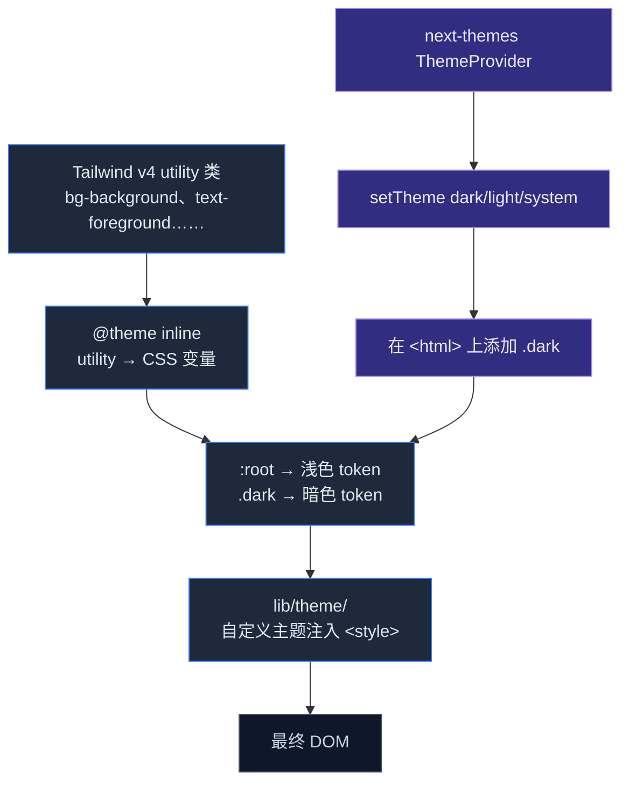

# 主题 & 国际化

Cognia 完全可换肤，并自带英文与简体中文两种翻译。本页同时讲视觉主题流水线和 i18n 架构。

## Tailwind CSS v4

Cognia 使用 **Tailwind CSS v4**，通过 PostCSS 插件（`@tailwindcss/postcss`）。**没有** `tailwind.config.{js,ts}` —— v4 是无配置的，直接读 `app/globals.css` 中的指令。

`app/globals.css`：

```css
@import "tailwindcss";
@import "tw-animate-css";

@custom-variant dark (&:is(.dark *));

@theme inline {
  /* token 映射到下方 CSS 变量 */
  --color-background: var(--background);
  --color-foreground: var(--foreground);
  /* ... */
}

:root {
  --background: oklch(1 0 0);
  --foreground: oklch(0.145 0 0);
  /* ... */
}

.dark {
  --background: oklch(0.145 0 0);
  --foreground: oklch(0.985 0 0);
  /* ... */
}
```

注意三件事：

1. **`@theme inline`** 把 Tailwind utility 映射到 CSS 变量。
2. **CSS 变量** 是单一真理源 —— 改 `--background`，所有 `bg-background` 跟着变。
3. **oklch 色彩空间**（不是 HSL/RGB）—— 在亮/暗模式下感知一致。

自定义变体 `@custom-variant dark (&:is(.dark *))` 让 `dark:bg-foo` 在祖先有 `.dark` 类时生效。这是基于 class 的暗色模式（不是 `prefers-color-scheme`）；`next-themes` 在 `<html>` 上切换 `.dark`。

## 主题级联



## 主题 token

`globals.css` 中的完整 token 集覆盖：

- `background`、`foreground` —— 基础画布
- `card`、`card-foreground` —— 表面
- `popover`、`popover-foreground` —— 浮层
- `primary`、`primary-foreground` —— 主操作
- `secondary`、`secondary-foreground` —— 次操作
- `muted`、`muted-foreground` —— 弱化
- `accent`、`accent-foreground` —— 强调
- `destructive`、`destructive-foreground` —— 危险
- `border`、`input`、`ring` —— 控件
- `chart-1` … `chart-5` —— 图表色板
- `sidebar-*` —— 侧栏专属

每一个 shadcn/ui 组件都从这些 token 取色；要换肤 = 改 CSS 变量。

## 自定义主题

Cognia 支持用户自定义主题 —— 覆盖 CSS 变量的 JSON 块。它们位于 `lib/themes/`（系统 + 用户）和 `lib/theme/`（运行时）。

自定义主题 JSON：

```jsonc
{
  "id": "ocean",
  "name": "Ocean",
  "tokens": {
    "light": {
      "--background": "oklch(0.98 0.02 220)",
      "--foreground": "oklch(0.18 0.04 250)",
      // ...
    },
    "dark": {
      // ...
    }
  }
}
```

主题 runtime（`lib/theme/`）会在 body 顶部注入一个带活动主题 token 的 `<style>` 标签。换主题 = 重新渲染该 style 标签。

主题可通过[域传输](./backup-and-data#%E6%8C%89%E5%9F%9F%E4%BC%A0%E8%BE%93)导入/导出。

## 暗色模式开关

暗色模式开关接 `next-themes`：

- `ThemeProvider`（挂在 `app/layout.tsx`）暴露 `theme`、`setTheme`、`resolvedTheme`。
- `setTheme("dark" | "light" | "system")` 写 `localStorage` 并切换 `<html>` 上的 `.dark`。
- 用户的选择跨会话保留。

组件中直接用 `next-themes` 的 `useTheme()` —— 不要重复维护状态。

## 美化 HTML / 动画 HTML 导出

聊天导出格式（美化 HTML、动画 HTML）共用同一套主题 token。导出器：

1. 从 `lib/themes/` 读取活动主题 token。
2. 在导出 HTML 中以 `<style>` 块内联。
3. 也接受自定义主题覆盖（导出对话框含 JSON 编辑器）。

也就是说，导出的聊天在 Cognia 内、浏览器、邮件附件中观感一致。

## 字体

Geist Sans + Geist Mono，通过 `next/font/google`：

```tsx
// app/layout.tsx
const geistSans = Geist({ variable: "--font-geist-sans", subsets: ["latin"] })
const geistMono = Geist_Mono({ variable: "--font-geist-mono", subsets: ["latin"] })
```

在 `body` 元素上注入：

```tsx
<body className={`${geistSans.variable} ${geistMono.variable} antialiased`}>
```

Tailwind 的 `font-sans` 与 `font-mono` 从这两个 CSS 变量读取。

CJK 文字依赖 `globals.css` 的系统字体回退链（中文、日文、韩文）。**没有**为 CJK 下载 web 字体，避免 bundle 增大。

## 国际化（next-intl）

`next-intl` 是 i18n 库。语言：

- `en` —— 英文（默认）
- `zh-CN` —— 简体中文

文案文件位于 `i18n/messages/{en,zh-CN}.json`，结构镜像路由树：`chat.send`、`settings.data.export` 等。

### Locale gate

`LocaleGate`（`components/providers/locale-gate.tsx`）等翻译加载完毕再渲染，避免用户 locale 是 `zh-CN` 时一闪而过的英文。

### 在组件中使用

```tsx
import { useTranslations } from "next-intl"

function Button() {
  const t = useTranslations("chat")
  return <button>{t("send")}</button>
}
```

带格式化值：

```tsx
t("greeting", { name: "Alice" })
// zh-CN：'你好，Alice'；en：'Hello, Alice'
```

### 加新语言

1. 新增 `i18n/messages/<locale>.json`，结构镜像 EN 文件。
2. 在 `lib/i18n/` 注册该 locale。
3. 在 **设置 → 外观 → 语言** 加 UI 控件（下拉读已注册列表）。
4. 翻译每个 key。任意 key 缺失则构建失败。

文案文件入仓。**没有**自动翻译流水线 —— 每条字符串人手写。

### 加新翻译 key

1. 同时在 **`en.json`** 与 **`zh-CN.json`** 的对应区段加 key。
2. 组件中使用 `useTranslations(...)`。
3. 跑 `pnpm typecheck` —— 任意语种缺 key，TypeScript 会报错（`next-intl` 通过 schema 生成类型）。

### CLI 提取

`next-intl` 不带提取工具。Cognia 全靠纪律：每条新字符串从一开始就用 `useTranslations`。代码评审拦截组件里的临时字符串。

## 语言切换

切换器在 **设置 → 外观 → 语言**。改动：

1. 选择持久化到 `settings` Dexie 表。
2. `LocaleGate` 重新拉取新 locale 的消息。
3. UI 重渲染。

无需刷新。

## RTL 支持

`@radix-ui/react-direction` 已安装但**未**接入主题 —— Cognia 当前所有 locale 都是 LTR。如要加 RTL 语言：

1. 把应用包在 `<DirectionProvider dir="rtl">`。
2. 审查每条 CSS 规则的方向属性（`text-align: left` → `start` 等）。
3. 替换 `→` 之类箭头为方向无关版本。

留作后续，但记录在此。

## 在哪里入手

| 目标 | 文件 |
| --- | --- |
| 调默认主题 token | `app/globals.css` |
| 加内置自定义主题 | `lib/themes/` |
| 加翻译 | `i18n/messages/{en,zh-CN}.json`，组件用 `useTranslations` |
| 加新 locale | 新 JSON + 在 `lib/i18n/` 注册 + 设置 UI |
| 加新图表色板 | `app/globals.css`（`--chart-*` token） |

## 测试

- 翻译 key 由 `next-intl` 在构建期校验。
- `lib/themes/` 有主题解析 + 注入的单元测试。

## 下一篇

<Cards>
  <Card title="开发工作流" href="./development" description="日常脚本、约定、测试" />
  <Card title="备份 & 数据传输" href="./backup-and-data" description="自定义主题通过域传输系统导出/导入" />
</Cards>
