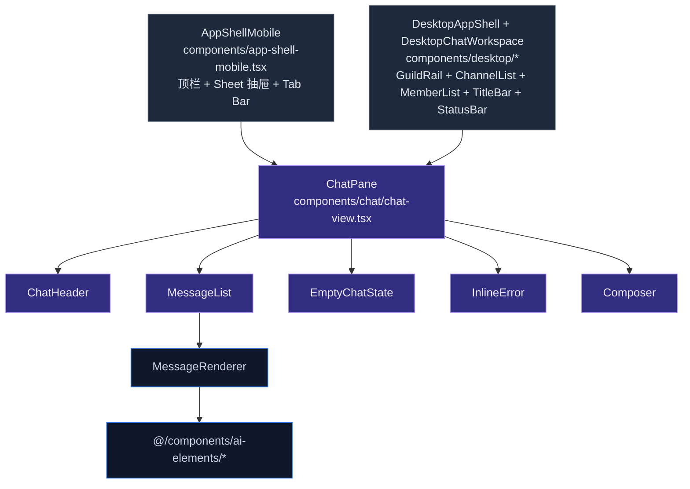
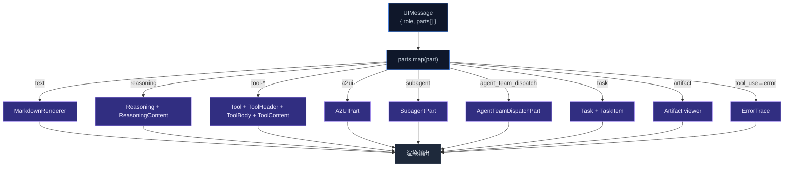
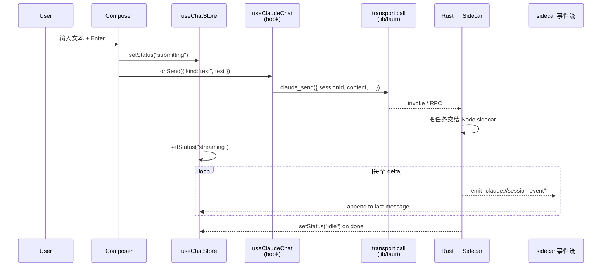

# 聊天 UI 架构

聊天界面是 cognia-next 最核心的视觉表达。它把 Claude Agent SDK 的流式输出、工具调用、reasoning trace、子代理任务、A2UI 表单、artifact 沙箱、画板等多种"消息部件"统一渲染成可滚动、可编辑、可重发的对话流。

本页讲清楚组件分层、消息渲染流水线、Composer 行为，以及桌面壳与移动壳如何复用同一个 `ChatPane`。

## 三个壳，一个 Pane



`ChatPane` 是**单一可视组件**，桌面与移动通过两条不同的路径到达它，但它本身只接受同一组 props：

```tsx title="components/chat/chat-view.tsx (节选)"
interface ChatPaneProps {
  activeSession: ChatSession | null
  onSend: (content: SendContent) => Promise<void>
  onStop: () => Promise<void>
  onRegenerate: () => Promise<void>
  onEditResend: (messageId: string, newContent: SendContent) => Promise<void>
  onCreate: () => void
  onUseSample: (text: string) => void
  onOpenSettings: (tab?: string) => void
  composerRef?: Ref<ComposerHandle>
  mobileMentionMembers?: readonly Character[]
}
```

桌面壳的横切关注点（命令面板、approval 对话框、title bar）一律放壳层；`ChatPane` 保持薄。

## ChatHeader

`components/chat/chat-header.tsx` 是会话标题栏。承担：

- **当前会话标题** + 重命名 inline 编辑。
- **角色 / 预设选择器** —— Popover 内嵌 `<Select>`，与 `usePresets()` + `useCharacter()` data hook 协作。
- **导出触发器** —— `single-export-trigger.tsx`（`components/chat/dialogs/`），弹 Markdown / JSON / Plain text / Beautiful HTML / Animated HTML 五选一的对话框。详见 [备份 & 数据](../data/backup-and-data#%E5%8D%95%E4%BC%9A%E8%AF%9D%E5%AF%BC%E5%87%BA)。
- **会话花费徽章** —— `session-cost-badge.tsx`，累加 token 与费用估算。
- **消息展示控件** —— `session-settings-sheet.tsx` 内的会话级 `MessageDisplayControls`（从头部齿轮打开）驱动预设、布局、Agent 流程、推理/工具展开与元数据（ADR-0114；原独立的 `agent-flow-display-toggle.tsx` 已在 ADR-0127 移除）。
- **Twin 徽章** —— `twin-header-badge.tsx`，会话绑定了员工孪生时显示。
- **权限模式指示** —— `permission-mode-indicator.tsx`：allow / deny / ask / plan。


桌面下，Header 同时作为窗口拖拽区（除按钮 hit-box 外）。

## MessageList & 流式渲染

`components/chat/message-list.tsx` 拉所有消息，按 `id` 用 `key` 渲染 `MessageRenderer`。关键属性：

- **`isStreaming`** —— 最后一条 assistant 消息且当前 store status 是 `streaming` 时为 true。把光标动画、reasoning live trickle、token-by-token UI 解锁。
- **`isLastAssistant`** —— 启用"重新生成"按钮；非末条不显示，避免误操作。
- **`characterById`** —— 团队会话下 sender 解析（agent A 说了什么，agent B 说了什么）。

滚动锚定：`<MessageList>` 内部用 `Conversation`（ai-elements）的 sticky-bottom 行为 —— 用户没主动滚开时自动锚最底部；用户上滑后停止锚，避免抢焦。

## MessageRenderer：part-pipeline 派发

每条 `UIMessage` 持有 `parts: MessagePart[]`，每个 part 有自己的 `type` 判别。`MessageRenderer` 是一个**派发器**：



### text part

`MarkdownRenderer`（`components/chat/markdown-renderer.tsx`）用 Streamdown 渲染 Markdown，自带：

- **Shiki 语法高亮**，主题跟随当前 light/dark。
- **Mermaid 图表**（懒加载）。
- **KaTeX 数学公式**（`globals.css` 注入 `katex.min.css`）。
- **CJK 字符**自动调字距。
- **链接安全策略** —— 外链加 `rel="noopener noreferrer"`，`<a>` hover 显示 host 提示。

### reasoning part

`<Reasoning>` 是可折叠卡片，标题"Thinking…"，体内是 reasoning 流。流式时一行行渗出，结束后折叠。

### tool-\* part

`Tool` + `ToolHeader` + `ToolBody` + `ToolContent` 构成"工具调用"框：

- **Header**：工具名 + 状态徽章（pending / running / done / error）。
- **Body**：输入参数（折叠 JSON）。
- **Content**：工具输出 —— 文本、JSON、图片、Markdown。
- **Approval inline**：需要用户批准的工具（写文件、执行 shell）在 Body 下方插入"Approve / Deny"按钮组，写到 `pendingApprovals` store。

### Agent 流程展示模式

Agent 调用流程（工具调用、推理、子代理）按三种**展示模式**渲染——这是一个全局外观偏好，区别于 `density`（后者只调间距）：

| 模式 | 工具调用 | 推理 / 子代理 |
| --- | --- | --- |
| **简化** | 单行行（`ToolCallRow`）：图标 + 工具名 + 简洁目标 + **结果摘要 chip** + 状态字形，点击展开。 | 默认折叠。 |
| **标准**（默认） | 完整 `Tool` 卡——运行时展开、完成后折叠。 | 推理自动开合，卡片各自折叠。 |
| **详细** | 每张卡强制展开，显示完整输入/输出。 | 推理 + 子代理树展开。 |

- **状态** —— `AppSettings.agentFlowMode`（`{ mode }`），通过 `hooks/chat/use-agent-flow-mode.ts`（`useAgentFlowMode`）读写。默认 `standard`，经设置 store 的通用 `save()` 持久化。
- **两个入口、同一值** —— 会话设置抽屉（`MessageDisplayControls`，会话级覆盖）与外观设置卡（`components/settings/appearance/components/message-display-card.tsx`，全局）都写 `messageDisplay.overrides.agentFlowMode`；`AppSettings.agentFlowMode` 仅作为遗留读取回退保留（ADR-0114 / ADR-0127）。
- **单行摘要** —— `lib/chat/tool-summary.ts`（`summarizeToolCall`）按工具抽取简洁目标（文件名、命令头、模式、URL host、查询…）和图标分类。
- **结果摘要** —— `lib/chat/tool-result-summary.ts`（`describeToolResult`）把工具**输出**蒸馏成紧凑、i18n 中立的描述符——grep → `matches`、glob → `files`、ls → `entries`、read/bash → `lines`、edit/write → `diff`（从输入算 `+N −M`），任何出错工具 → 首行错误。描述符的 `tone`（`neutral`/`success`/`error`）给 chip 着色；行组件（`ToolResultChip`）把 `kind` 映射成翻译标签（`chat.agentFlow.result.*`）。仍在流式或无自然摘要时返回 `null`，故 chip 不会过早显示"0"。逻辑对齐 CLI `cli/src/tui/format/tools.ts` 的结果助手，适配 Web `ToolUIPart` 形状（字符串 / MCP 内容块数组 / 对象）。注意工具 part **不携带逐工具时间**，故不显示任何捏造的耗时。

#### 活动分组

**≥2 个连续工具调用**会聚合成一个可折叠的**活动组**（`ToolActivityGroup`）——如"5 次工具调用 ✓"——带汇总状态字形、**类型计数预览**（`read ×3 · grep ×1 · edit ×1`，经 `lib/chat/tool-summary.ts:tallyToolNames`——首见序、命名空间折叠）与**全部展开/折叠**控件。该计数让折叠态无需展开也能一眼看清。分段是纯函数（`lib/chat/agent-flow-grouping.ts:groupAgentParts`）：子代理 part 透明（它们作为调度树单独渲染一次），`TodoWrite` 排除（它渲染为计划），单个工具调用保持单卡（无分组装饰）。简化档由组掌管每行开合状态；标准/详细档委托 `renderCard` 并可选 `forceOpen` 覆盖。

#### 子代理调度树

同一套三档模式也驱动**子代理调度树**（`SubagentTree` → `SubagentPart`）——当一个 Agent 派发子 Agent 时，这正是「Agent 调用流程」的核心：

- **简化** —— 每个节点压缩成单行 `SubagentPart`（机器人图标 + 名称 + 状态字形 + 耗时），点击展开看进度 + 日志，沿用 `ToolCallRow` 的视觉语言。
- **标准** —— 完整卡片，默认折叠。
- **详细** —— 完整卡片，默认展开（进度 + 日志可见）。

`SubagentTree` 掌管树级的**全部展开/折叠**控件（≥2 个节点时出现）以及逐节点切换，经一个稀疏的 `Map<id, boolean>` 覆盖表：缺省项表示该节点跟随模式默认值（`详细`档开、其余折叠），因此切换模式时无需 state-syncing effect 即可保持响应。每个节点带 `MotionReveal` 入场。团队调度横幅（`AgentTeamDispatchPart`）也感知模式——`简化`档会去掉任务正文以保持紧凑。

#### 动效

`components/chat/motion/motion-reveal.tsx` 是 agent-flow 各界面**统一的动效词汇**（`useFlowMotion` 从外观设置 + 系统 `prefers-reduced-motion` 解析 `reduce` + `speed`）：

- **`MotionReveal`** —— 交错的 **spring** 入场（淡入 + 轻微 translateY），用于新工具卡/行、子代理节点与调度横幅。
- **`MotionCollapse`** —— *统一*的展开/折叠：高度 + 透明度上的轻柔、低过冲 spring，被工具行、活动组正文、子代理行共用，使一切以同样方式揭示（此前各行是瞬间弹开、只有组做动画）。动效降级时退化为普通显隐。
- **`MotionStatusSwap`** —— 状态字形变化（如 运行中 → 完成）时做 crossfade，用 `mode="wait"` 避免双字形闪烁；被工具行、活动组汇总字形、子代理行共用。

三者都对 GPU 友好（仅 `opacity` + `transform` / 动画高度，不引 `backdrop-filter`），按 `motion.speed` 缩放节奏，并在 `motion.reduce` / `prefers-reduced-motion` 下退化为普通标记。

### artifact part

`Artifact` 是带有打开/嵌入两态的 React/Vue/HTML "片段查看器"：

- **嵌入**：iframe 沙箱里渲染（`sandbox="allow-scripts"` + CSP）。
- **打开**：路由跳到 `/canvas` 或专用 sandbox 页 —— 详见 [Artifacts 沙箱](../subsystems/artifacts-sandbox)。

### a2ui / subagent / agent_team_dispatch

这三类是 cognia-next 自有的扩展 part，定义在 `lib/claude/parts-extensions.ts`：

- **A2UIPart** —— 由 A2UI MCP 服务器声明的"提交式表单"或"动作按钮"，在聊天里直接渲染交互控件，提交后回写为新消息。
- **SubagentPart** —— 子代理（subagent）的会话快照：标题、状态、嵌套 `parts[]`。
- **AgentTeamDispatchPart** —— 团队会话里"我要把任务派给谁"的派发框。

每个 part 类型对应一个独立组件（`components/chat/message-parts/<kind>-part.tsx`），它们都遵循同一接口：接收 part 数据 + 上下文，返回 React 树。

## 流式管线



- **`status`** 转移：`idle → submitting → streaming → idle`（或 → `error`）。
- **delta 累积**：`useChatStore` 的 reducer 把每个 `text_delta` 追加到最后一条 assistant 消息的最后一个 text part。
- **工具调用插入**：sidecar 发的 `tool_use_start` 在 parts 末尾追加一个空 Tool part；后续 `tool_use_delta` 渐进填入参数；`tool_result` 完成 Content。
- **错误处理**：sidecar 报错 → 设 `errorMessage`，UI 顶部出 `<InlineError>`，提供"重试"。
- **中断**：Stop 按钮触发 `onStop` → `claude_interrupt` Tauri 命令 → sidecar 取消生成，状态回 `idle`。

## Composer

`components/chat/composer.tsx` 是输入组件，水平布局：

```
[📎 📷 🎤 ⚙ ⇧⇥]  ┌─Textarea（flex-1）────────┐  [▶ Submit / ■ Stop]
                  │  字符计数右下角              │
                  └────────────────────────────┘
```

底层用 `<PromptInputProvider>`（ai-elements），因为它提供了 `controller.textInput` 与 `attachments` 两个 context，是 slash/@/!/# 触发器机制赖以工作的基础。但 Composer **自己**渲染 form + textarea，不用 `<PromptInput>`（那个组件强制竖向 `<InputGroup>` 布局）。

### Composer Handle（imperative）

桌面壳通过 `composerRef` 拿到 `ComposerHandle`：

```ts
interface ComposerHandle {
  insertMention(name: string): void // 把 @Name 注入光标处
  focus(): void
  clear(): void
}
```

用例：用户在团队成员列表点了一行，桌面壳调 `composerRef.current?.insertMention(member.name)`，光标处插入 `@Alice `。

### Bottom Toolbar

`components/chat/composer/bottom-toolbar.tsx` 挂在 Composer 下方，承载**会话级元数据**：

- **ModelPicker** —— 切当前会话默认 model；写入会话设置。
- **AgentRuntimeSelector** —— 选哪个 agent 实现处理这条消息：内置 Claude SDK 运行时与各个已配置的外部 Agent 同处一个单选组（详见 [Provider 系统](../chat/provider-system)）。
- **AgentModeSelector** —— Claude SDK 运行时组合的 Agent Mode；选中外部 Agent 时隐藏，因为外部 Agent 自带模式。
- **WebSearchToggle** —— 启用搜索工具调用。
- **PermissionModeIndicator** —— 当前 allow / deny / ask / plan。
- **Context Usage** —— 实时计算并显示当前会话上下文窗口的输入/输出/缓存使用率：

```tsx
import {
  Context,
  ContextContent,
  ContextContentBody,
  ContextInputUsage,
  ContextOutputUsage,
  ContextCacheUsage,
  ContextTrigger,
} from "@/components/ai-elements/context"
```

`ContextTrigger` 是一个紧凑徽章；展开是详细分解（每个 model 的 context window、token 消耗、近似费用）。

### 触发器（slash / @ / ! / #）

`composer-trigger.ts` 监听输入变化，扫描 caret 位置前的字符：

| 前缀 | 触发           | Popover 内容       | 接入                                 |
| ---- | -------------- | ------------------ | ------------------------------------ |
| `/`  | 在行首或空格后 | slash 命令列表     | `lib/chat/slash-command-registry.ts` |
| `@`  | 任意位置       | 角色 / 团队成员    | `useCharacter()` data hook           |
| `!`  | 在行首         | 技能（skills）列表 | `useSkills()`                        |
| `#`  | 任意位置       | 知识引用 / 文档    | `lib/search/`                        |

匹配时弹 popover（`components/chat/composer-popover.tsx`），方向键导航 + Enter 选中后 `spliceToken` 替换前缀片段。方向键 / Tab 导航会让高亮项始终滚动到可视区。

候选列表由共享的模糊匹配器排序（`lib/chat/completion/fuzzy-match.ts`）：查询的每个字符须按顺序出现（子序列），并对词边界（`/ - _ . :` 之后）、连续命中、靠前 / 更短的匹配加分。斜杠命令按命令名排序（描述作为降权的次要来源）；`@` 提及复用同一打分器，两个面板体验一致。popover 宽度跟随 composer 自身宽度（`--radix-popper-anchor-width`，上限 480px），因此在窄侧栏中也不会溢出。

### Ghost 文本（行内自动补全）

启用后（`设置 → 对话 → Composer 辅助`），composer 会以暗色单行展示当前草稿的续写（`hooks/chat/use-composer-ghost-text.ts` → `lib/chat/completion/ghost-controller.ts`）。`Tab` 接受、`Esc` 关闭。建议会防抖、缓存，并在调用工具 LLM 前经过 PII 门控；当触发器 popover 打开、正在流式输出、或光标不在输入末尾时会被抑制。

### 自适应 composer（窄侧栏）

composer 外层声明了 `@container/composer`。低于 `@sm` 时文本域独占第一行，附件与发送控件共享第二行；达到 `@sm` 后回流为单行 `[附件 | 文本域 | 发送]`。placeholder 始终保持单行，空间不足时裁切提示，而不会把整个输入控件撑高。**底部工具栏**会测量自身宽度（`hooks/use-element-width.ts`）：模型、权限、上下文用量与 `⋯ 更多` 在 384px 以上保持单行，更窄时拆成两行，并将次级状态控件靠右成组。会话形态控件（沙箱 / Agent 运行时 / 模式 / 外部 Agent / 插件槽）在所有宽度下都保留在「更多」弹层中。每个控件只挂载在一处——把这些 popover 触发器重挂进 `DropdownMenuItem` 会让其开合状态错乱——当溢出控件处于激活状态时「更多」按钮会显示一个圆点。这样工作流编辑器聊天侧栏（可缩到视口 20%）里所有控件依然可达。

### 附件

附件按钮支持：

- **📎 文件**：`<input type="file" multiple>`，落进 `attachments` context。
- **📷 截图**：桌面调 Rust 截图命令；移动调 `@capacitor/camera`。
- **🎤 语音**：录音 → `lib/speech/` 转写后填入文本。
- **拖拽 / 粘贴**：监听 `onDragOver` / `onPaste`，文件/图片直入附件。

## Empty / Error / Welcome

- **EmptyChatState**（`components/chat/empty-state.tsx`）：会话刚建未发消息时显示，提供"试试这些示例"卡片，点击调 `onUseSample(text)` 预填 Composer。
- **InlineError**（`components/chat/inline-error.tsx`）：顶部红条，错误信息 + "重试" + "查看详情"。详情链跳到 `?section=logs`。
- **welcome 流**（`components/chat/welcome/`）：新装用户首次进入的引导卡组，介绍 API key、角色、技能。

## Approval 对话框

工具调用需要批准时，sidecar 推 `pendingApproval` 进 `useChatStore`。`ToolApprovalDialog`（壳层挂在 chat 工作区）订阅 `pendingApprovals[0]` —— 唯一不在 ChatPane 内部，因为它要覆盖整个工作区，且对接 keyboard shortcut（Y / N / Esc）。

## 桌面专有：命令面板 + Title/Status/Guild Rail

桌面壳堆 4 个全局浮层：

| 组件             | 用途                                                         | 文件                                     |
| ---------------- | ------------------------------------------------------------ | ---------------------------------------- |
| `TitleBar`       | 自定义窗口标题栏（无原生 chrome），含 close/min/max + 拖拽区 | `components/desktop/title-bar.tsx`       |
| `GuildRail`      | 左极窄垂直 rail，列 guild（团队）切换                        | `components/shell/guild-rail.tsx`        |
| `StatusBar`      | 底部状态条 —— sidecar 健康、当前 transport、网络指示         | `components/desktop/status-bar.tsx`      |
| `CommandPalette` | `Ctrl+K` 唤起：跨 section 搜索 + 跳转 + 执行 slash 命令      | `components/desktop/command-palette.tsx` |

`CommandPalette` 用 shadcn `Command`（cmdk）+ 自定义结果分类：会话、设置 section、slash 命令、角色、技能、文档。Enter 直接执行（跳转或触发）。

## 移动专有：手势与 plus 菜单

- **`ComposerPlusMenu`**（`components/mobile/chat/composer-plus-menu.tsx`）—— 触屏上的"+"按钮抽屉，列附件、语音、技能、引用等入口；替代桌面的工具栏图标。
- **`MessageActionSheet`**（`components/mobile/chat/message-action-sheet.tsx`）—— 长按消息弹底部 sheet：复制、编辑重发、引用、删除、分享。
- **`MentionPopover`** —— 移动专属 @-mention popover，因为桌面 popover 在小屏上太挤。
- **手势**：`<LongPress>`、`<SwipeRow>`、`<PullToRefresh>` 包消息列表 / 列表项，统一 `test-pointer-polyfill.ts` 让 jsdom 测试也能跑。

## 主题与 i18n 集成

每个消息组件都用 shadcn token：`bg-card`、`text-foreground`、`border-border`、`text-muted-foreground`。代码块用 Shiki + `font-mono`（CSS 变量来自 Geist Mono）。详见 [主题 & i18n](./theming-and-i18n)。

文案统一走 `useTranslations(...)`：

- `chat.copy.success` —— "已复制"toast。
- `chat.composer.toolbar.*` —— Bottom toolbar 提示。
- `desktop.shell.*` —— 桌面壳菜单与按钮。

## 测试

| 文件                                  | 覆盖                                        |
| ------------------------------------- | ------------------------------------------- |
| `chat-view.test.tsx`                  | empty / streaming / error 三态 + 回调路由   |
| `composer.test.tsx`                   | 提交、触发器、附件、stop 切换               |
| `composer.draft-and-mention.test.tsx` | 草稿持久 + @-mention 注入                   |
| `composer.platform-binding.test.tsx`  | 平台绑定会话下 Send 按钮的禁用              |
| `message-list.test.tsx`               | 锚滚动、key 稳定性                          |
| `message-renderer.test.tsx`           | 各 part 类型的派发                          |
| `markdown-renderer.test.tsx`          | Mermaid / KaTeX / 代码块 / 链接安全         |
| `composer-trigger.test.ts`            | `/`、`@`、`!`、`#` 触发检测                 |
| `bottom-toolbar.*` (通过 composer)    | Context 显示、Model picker、Permission 切换 |

`components/ui/` 与 `components/ai-elements/` **不**写测试，不计入覆盖率（CLAUDE.md 例外清单）。

## 在哪里入手

| 目标                    | 文件                                                                                 |
| ----------------------- | ------------------------------------------------------------------------------------ |
| 新消息 part 类型        | `lib/claude/parts-extensions.ts` 定义 + `components/chat/message-parts/<x>-part.tsx` |
| 加 Composer 工具按钮    | `components/chat/composer.tsx` 的水平 toolbar 区                                     |
| 加 BottomToolbar 元数据 | `components/chat/composer/bottom-toolbar.tsx`                                        |
| 新 slash 命令           | `lib/chat/slash-command-registry.ts` 加注册                                          |
| 改 Markdown 渲染行为    | `components/chat/markdown-renderer.tsx` + Streamdown 插件配置                        |
| 改 ChatHeader 项        | `components/chat/chat-header.tsx`                                                    |
| 改桌面命令面板入口      | `components/desktop/command-palette.tsx`                                             |
| 改移动手势              | `components/interactions/*`                                                          |

## 相关页

<Cards>
  <Card
    title="聊天 & 技能"
    href="../chat/chat-and-skills"
    description="会话/角色/技能的领域模型与生命周期"
  />
  <Card title="主题 & i18n" href="./theming-and-i18n" description="oklch token + next-intl 翻译" />
  <Card title="shadcn/ui 配置" href="./shadcn-ui-setup" description="本页用到的所有 UI 原子" />
  <Card title="画板（Canvas）" href="../subsystems/canvas" description="Artifact 'open' 态跳转的目标" />
  <Card
    title="Artifacts 沙箱"
    href="../subsystems/artifacts-sandbox"
    description="嵌入式 iframe 沙箱的 CSP 与运行时"
  />
</Cards>
