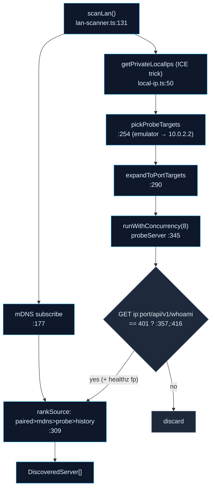

# 发现与配对

<Status variant="beta" />

<TLDR>
  手机在发起任何调用之前，必须先 (a) 找到桌面端，(b) 建立信任关系。发现功能由两套独立系统组成：`lan-scanner.ts` 用于*发现未知*主机（并行 mDNS 订阅 + IP 段 probe，以 `/api/v1/whoami` 返回 `401` 作为 Cognia 服务器的证明）；而 `connection-strategy.ts` 用于*解析已知*配对设备的可达 URL，遍历一份按优先级排列的 candidate 列表（mDNS → tunnel → 缓存），并 probe `/api/v1/healthz`。信任关系通过三步配对向导建立：扫描 QR（或手动输入 6 位码）→ 兑换为设备 JWT → pin 住 TLS fingerprint → 将 `CompanionConfig` 持久化到 OS keystore。扫描所需的本地 IP 通过 WebRTC ICE 技巧（`local-ip.ts:50`）获取，因为移动端 WebView 无法直接读取网络接口。
</TLDR>

<StatGrid>
  <Stat label="mDNS 服务名" value="_cognia._tcp" hint="mdns-discovery.ts:42" />
  <Stat label="Probe 端口" value="7890·7891·7900·8443" hint="lan-scanner.ts:119" />
  <Stat label="Probe 目标" value="GET /api/v1/whoami → 401" hint="lan-scanner.ts:357" />
  <Stat label="Candidate 顺序" value="mDNS → tunnel → cache" hint="connection-strategy.ts:43" />
</StatGrid>

## 两套发现系统

两者共用 fingerprint pinning 的思路，但代码完全独立——请勿混淆：

- **`lan-scanner.ts` — 发现未知主机。** 配对向导的"发现"步骤调用它，将手机从未见过的桌面端呈现出来。
- **`connection-strategy.ts` — 连接已知主机。** 在实际调用时使用，为*已配对*且 fingerprint 已知的设备选取最优 URL。

### LAN scanner — `scanLan` (`lan-scanner.ts:131`)

同时运行 mDNS 订阅（`:177`）和 IP 段 probe，与 5 秒 mDNS 窗口或中止信号竞速（`:225`）：

候选主机**仅在**返回 HTTP `401` 且携带 `{code,message}` 响应体时才被接受（`evaluateProbeResponse`，`:409-432`）——对 `/api/v1/whoami` 的未认证请求*应当*被拒绝，这恰好证明该主机是 Cognia 服务器。随后通过 `healthz` 补充 TLS fingerprint 信息。默认端口为 `7890`（`:110`）；额外端口 `[7890, 7891, 7900, 8443]`（`:119`）仅对已配对设备或模拟器 IP 尝试。

### 本地 IP 获取技巧 — `local-ip.ts:50`

移动端 WebView 无法枚举网络接口，因此 `getPrivateLocalIps()` 通过打开一个无 STUN 的 `RTCPeerConnection`（附带一个假数据通道）收集 host ICE candidate（`:50`），再过滤出 RFC-1918 地址段（`isPrivateIpv4`，`:151`）。`enumerateSlash24()`（`:159`）将已发现的 IP 展开为 `/24` 子网，供 scanner 遍历。

### 连接策略 — `connection-strategy.ts`

对于*已知*设备，`buildCandidates()`（`:43`）生成一份有序尝试列表：

1. **mDNS** — 仅当发现的 TXT 记录中的 `fp` 与 pinned fingerprint 匹配时（`:47-59`）；
2. **tunnel** — 若存在 cloudflared URL 则使用（`:62-68`）；
3. **cache** — 上次成功使用的 `baseUrl`（`:71-80`）。

`pickReachable(candidates, probe)`（`:90`）按序遍历，返回第一个响应 `GET /api/v1/healthz`（`healthz.ts:48`）的候选地址。

## mDNS 订阅

`mdns-discovery.ts` 通过 `capacitor-zeroconf` 订阅 `_cognia._tcp`（`SERVICE_TYPE`，`:42`）。`subscribe()`（`:119`）在非移动端返回一个空操作的取消订阅函数（`:127`）。在 iOS 上，操作系统在 Local Network 权限背后限制多播；`mdns-permission.ts:requestMdnsPermission`（`:46`）负责请求该权限，返回 `granted` / `denied` / `unsupported`。桌面端的广播通过同一文件经 Tauri 控制（`startBroadcast` → `companion_mdns_start`，`:172`）。

## 配对向导

`app/(mobile-onboard)/pair/page.tsx` 挂载一个三步骤引导流程（`components/mobile/pair/`）：

<Steps>
<Step>
**发现** — `discover-step.tsx` 运行 `scanLan`，以雷达样式展示发现的服务器（`scan-radar.tsx` + `server-card.tsx`）；点击某一结果会预填其 `baseUrl`。
</Step>
<Step>
**配对** — `pair-step.tsx`。可以扫描 QR（`barcode.ts` → 解析载荷）或手动输入 6 位码。提交后调用 `pair-api.ts`，向 `POST /api/v1/auth/pair`（QR）或 `/api/v1/auth/pair/redeem-code`（码）兑换，接收 `{ deviceJwt, deviceId, serverVersion, rendezvousId, rendezvousSecret, fingerprint }`。校验逻辑位于 `pair-helpers.ts`。
</Step>
<Step>
**已配对** — `paired-step.tsx` 执行只读冒烟测试（`claude_sidecar_status`），验证 WS 路径，并提供诊断面板（服务器版本、绑定地址、fingerprint 前缀、最后一次心跳）。`saveCompanionConfig(...)` 将配置写入 keystore。解除配对操作受[生物特征守卫](./capacitor-shell#biometric-guard)保护。
</Step>
</Steps>

## QR 载荷与 TLS Pinning

QR 码编码了桌面端解析后的 `baseUrl`（优先级：tunnel > LAN > loopback）、5 分钟有效期的配对 JWT、服务器版本，以及 **TLS SPKI fingerprint**。手机解析后兑换 JWT，并将 fingerprint 存入 `CompanionConfig.serverFingerprint`。此后每次请求均经过 [TLS-pinned fetch](./transport-layer#tls-pinned-fetch)：手机将服务器实时证书的 SPKI 哈希与 pinned 值对比，不匹配则拒绝连接。由于桌面端跨重签名复用同一密钥，fingerprint 永远不变，手机无需重新配对。

## 最近连接的服务器

`recent-servers.ts` 在 localStorage 的 `cognia.mobile.recentServers`（`:22`）键下维护一份上限为 `MAX_RECENTS = 5`（`:23`）的最近配对服务器日志。`recordRecentServer()`（`:84`）将新记录插入列表头部（upsert 语义）；`recentServersToDiscovered()`（`:125`）将这些记录以 `history` 来源注入扫描列表，使曾经配对过的桌面端排序高于冷 probe 结果。`paired-summary.ts:companionConfigToPairedSummary`（`:21`）将当前 `CompanionConfig` 转换为 scanner 所用的排序条目。

## 相关页面

<Cards>
  <Card title="外部 API：发现、tunnel 与 TLS" href="../../subsystems/companion-api/discovery-tunnel" description="服务器端实现 —— mDNS 广播、healthz、cloudflared tunnel 以及 fingerprint 来源。" />
  <Card title="外部 API：服务器与认证" href="../../subsystems/companion-api/server-and-auth" description="向导所兑换的配对处理程序。" />
  <Card title="传输层" href="./transport-layer" description="配对结果 CompanionConfig 被每次调用所消费的地方。" />
</Cards>
