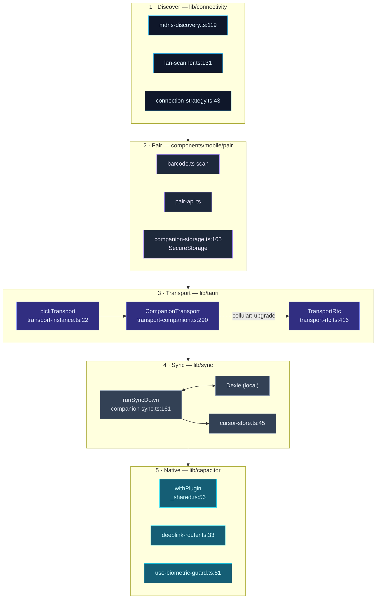

# 移动端架构

<Status variant="beta">beta · V2 + WebRTC</Status>

<TLDR>
  Cognia 的移动客户端**不是**独立的 React Native 应用，也**不是**精简版桌面构建——
  它是同一份 `out/` 静态导出，由 **Capacitor 8** 封装在 iOS/Android WebView 中，
  再通过 [External API](../../subsystems/companion-api) 连回桌面端。一个 JS bundle，三个
  Shell（Tauri / Capacitor / Web），一份共享的 React 代码库。关键接缝是 `Transport` 接口
  （`transport-types.ts:19`）：三态选择器（`transport-instance.ts:22`）在桌面端选取 `TauriTransport`，
  在移动端选取 `CompanionTransport`，或在纯浏览器中选取 `WebStubTransport`——因此每次
  `transport.call(name, args)` 都会解析为 Tauri IPC、HTTPS `_rpc` POST，或（当 LAN 与隧道
  均不可用时）WebRTC DataChannel。原生能力通过 `lib/capacitor/*` 包装器传递，在设备外
  降级为 `unsupported`，读取操作来自增量同步的本地 Dexie。
</TLDR>

<StatGrid>
  <Stat label="Transport 状态数" value="3" hint="Tauri / Companion / WebStub — transport-instance.ts:22" />
  <Stat label="Transport 层级数" value="4" hint="ws-lan · ws-tunnel · rtc-direct · rtc-relay" />
  <Stat label="原生包装器数" value="20" hint="lib/capacitor/*.ts via withPlugin" />
  <Stat label="同步表数" value="10" hint="lib/sync/handlers/*" />
  <Stat label="深度链接路由数" value="6" hint="DeeplinkRoute — deeplink.ts:16" />
  <Stat label="移动端组件数" value="100+" hint="components/mobile/**" />
</StatGrid>

## 核心理念：一个 bundle，三个 Shell

`mobile/capacitor.config.ts` 设置 `webDir: "../out"`（`:17`）；`src-tauri/tauri.conf.json` 设置
`frontendDist: "../out"`。两个原生 Shell 都指向同一个由单次 `pnpm build` 生成的目录。在
iOS/Android WebView 内运行的 React 与在 Tauri 中运行的 React 字节完全相同——相同的
Zustand stores、相同的 Dexie schema、相同的 `useTranslations()` 调用。运行时只有两点不同：
选择器返回哪个 `Transport`，以及 `usePlatform()` 报告哪个枚举值。

| 选项 | 结论 |
| --- | --- |
| **Tauri 2 Mobile** | 已拒绝——移动端不支持 sidecar；Claude Agent SDK sidecar 是核心桌面运行时。 |
| **React Native** | 已拒绝——将 57 个 shadcn/ui 组件重写为 RN 原语，功能零增益。 |
| **Capacitor 8** | 已采用——将现有静态导出直接放入原生 WebView，无需重写 UI。 |

更深层的事实：手机**从不**是 sidecar 运行时。Claude Agent SDK 需要 Node ≥ 20 及原生扩展；
connector webhook 无法从运营商 NAT 后面暴露公网 URL。因此有五个子系统受平台现实限制而仅
限桌面端——桌面才是真正的服务器，手机是受信任的客户端。参见
[ADR-0014](../../adr/0014-capacitor-mobile-shell)。

## 客户端主干

移动端会话沿固定主干推进：**发现**桌面端、与其**配对**、选择**Transport**、**同步**本地
数据、访问**原生**能力。每个方框都标注了其所在文件和行号。

## 模块地图

请查阅各模块子页面以获取行级精确的内部细节。每张卡片对应一个文档页面。

<Cards>
  <Card title="Capacitor Shell 与原生桥接" href="./capacitor-shell" description="withPlugin 降级模板、20 个原生插件包装器、运行时插件注册、6 路由深度链接解析器/路由器、capacitor.config.ts，以及 AppShellMobile 抽屉/标签/底部表单结构。" />
  <Card title="Transport 层" href="./transport-layer" description="Transport 接口、三态选择器、CompanionTransport（HTTPS _rpc + 带重放的 WSS 事件）、WebRTC 子层级、TLS 固定 fetch、层级分类器，以及 SecureStorage 凭据存储。" />
  <Card title="发现与配对" href="./discovery-pairing" description="mDNS 订阅、LAN IP 段扫描器、WebRTC-ICE 本地 IP 技巧、connection-strategy 候选遍历、三步配对向导、QR 载荷，以及 TLS 指纹固定。" />
  <Card title="同步与离线" href="./sync-offline" description="runSyncDown 编排器、10 个分表处理器、分页增量、持久化游标存储、设置的允许列表合并、四种同步触发器，以及 Dexie 优先查询 hook。" />
  <Card title="WebRTC Transport" href="./webrtc-transport" description="仅 v2 的 ECDSA/ECDH/AES-GCM 信令、受界 DataChannel offerer、恢复控制，以及 Cloudflare Durable Object rendezvous（ADR-0021）。" />
</Cards>

## 为什么手机是客户端而非服务器

所有有状态且需特权的内容都保留在桌面端。手机仅持有设备 JWT、固定的 TLS 指纹、
v2 room descriptor、安全保存的 mobile 角色 key 和本地 Dexie 缓存——仅此而已。它无法运行 agent sidecar、向量存储、
MCP 或 connector webhook。这使攻击面保持最小（丢失的手机可从桌面端的
[拒绝列表](../../subsystems/companion-api/server-and-auth#revocation-deny-list-and-control-allow-list)
中撤销），并保持 bundle 完全相同——这正是 Capacitor 方案的核心价值所在。

## Web 模式降级

同一份 `out/` 可作为纯 PWA 提供服务。此时选择器返回 `WebStubTransport`
（`transport-web.ts`）：每次 `transport.call` 都会拒绝，`usePlatform()` 报告 browser，
所有 `lib/capacitor/*` 包装器返回 `unsupported`，其 UI 入口随之隐藏。只有 Dexie、
翻译与主题得以保留——这是为演示和截图而刻意设计的最小子集。

## 相关页面

<Cards>
  <Card title="External API" href="../../subsystems/companion-api" description="桌面端服务器一侧——客户端所调用的端点、RPC 清单与信令平面。" />
  <Card title="Settings UI" href="../settings-ui" description="驱动桌面端配对、mDNS、隧道和 WebRTC 的 Companion 设置面板。" />
</Cards>

## 相关 ADR

- [ADR-0012 — Transport Abstraction](../../adr/0012-transport-abstraction)
- [ADR-0013 — Command Manifest](../../adr/0013-command-manifest)
- [ADR-0014 — Capacitor Mobile Shell](../../adr/0014-capacitor-mobile-shell)
- [ADR-0015 — Mobile V2 Completion](../../adr/0015-mobile-v2-completion)
- [ADR-0021 — WebRTC DataChannel WAN Transport](../../adr/0021-webrtc-datachannel-wan-transport)
- [ADR-0027 — Mobile Offline & Discovery](../../adr/0027-mobile-offline-and-discovery)
