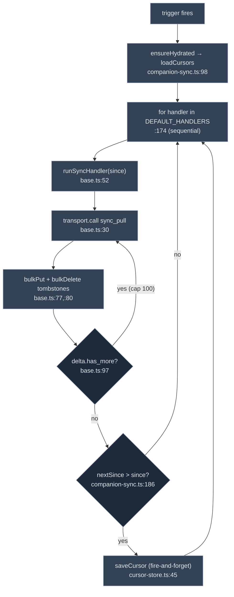

# 同步与离线

<Status variant="beta">beta · offline-first</Status>

<TLDR>
  手机端维护自己的 Dexie 数据库并优先从中读取，网络只负责填充数据。引擎是
  `runSyncDown`（`companion-sync.ts:161`），它按顺序迭代 **10** 个已注册的表处理器，每个处理器以上次的
  cursor 调用 `sync_pull` RPC，并通过通用的 `runSyncHandler`（`base.ts:52`）将返回的 delta
  （`bulkPut` + tombstone `bulkDelete`）应用到本地。Cursor 在 Dexie（`cursor-store.ts`）中按表持久化，
  且只能单调递增。同步由四种触发器驱动——前台、事件驱动、网络恢复和应用唤醒——而
  `useDexieFirstQuery`（`use-dexie-first-query.ts:54`）是读取原语，它立即从 Dexie 渲染数据，并在挂载时
  触发后台同步。
</TLDR>

<StatGrid>
  <Stat label="同步处理器数量" value="10" hint="DEFAULT_HANDLERS — companion-sync.ts:52" />
  <Stat label="RPC" value="sync_pull" hint="base.ts:30" />
  <Stat label="分页上限" value="100" hint="MAX_PAGES — base.ts:38" />
  <Stat label="Cursor 表" value="syncCursors" hint="Dexie v44 — cursor-store.ts" />
  <Stat label="触发器数量" value="4" hint="foreground · event · network · resume" />
</StatGrid>

## 编排器

`runSyncDown(opts)`（`companion-sync.ts:161`）**按顺序**（`:174`）迭代 `DEFAULT_HANDLERS`（`:52`，即按执行顺序排列的 10 张表）。重入门控（`inflight`，`:163`）防止并发执行，但针对性的 `opts.only` 运行除外。对每个处理器，它读取该表的 cursor（`:176`），调用 `run(t, { since })`（`:177`），应用 **monotonic 守卫**（`nextSince > since`，`:186`）以防止过期响应回退 cursor，并以 fire-and-forget 方式持久化新 cursor（`:196`）。`ensureHydrated()`（`:98`）在首次运行时一次性加载 cursor 映射。



## 处理器

每个处理器都很轻薄——它委托给 `runSyncHandler<TRow extends { id: string }>`（`base.ts:52`），后者持续抽取分页直至 `!has_more`（上限 `MAX_PAGES = 100`，`:38`），对行执行 `bulkPut`，并按 `id` 键对 tombstone 执行 `bulkDelete`：

| Handler | Table | Strategy | Entry |
| --- | --- | --- | --- |
| `syncCharacters` | `characters` | `bulkPut`；过滤内置项 | `characters.ts:15` |
| `syncSkills` | `skills` | `bulkPut` | `skills.ts:8` |
| `syncSessions` | `sessions` | `bulkPut` | `sessions.ts:8` |
| `syncMessages` | `messages` | `bulkPut`，**分页** | `messages.ts:14` |
| `syncWorkflows` | `workflows` | `bulkPut`；过滤内置项 | `workflows.ts:14` |
| `syncTwinProfile` | `twinProfile` | `bulkPut` | `twin-profile.ts:13` |
| `syncPlugins` | `plugins` | `bulkPut` | `plugins.ts:12` |
| `syncAdapterInstances` | `adapterInstances` | `bulkPut` | `adapter-instances.ts:13` |
| `syncConversationOverrides` | `conversationOverrides` | `bulkPut` | `conversation-overrides.ts:14` |
| `syncAppSettings` | `settings` | **allowlist-merge** | `app-settings.ts:66` |

这些处理器与服务端的[同步表 allowlist](../../subsystems/companion-api/data-plane-bridges#the-sync-table-allowlist)
一一对应。设置处理器比较特殊：它**不会**覆盖本地单例，而是仅通过 `applySettingsRows`（`:47`）合并
`CROSS_PLATFORM_SETTING_KEYS`（`app-settings.ts:21-40`）中的键，因此设备本地偏好在同步后依然保留。

## Cursor 存储

`cursor-store.ts` 在 Dexie 的 `syncCursors` 表（v44）中持久化 `{ table, lastSyncAt, since }` 行。
`loadCursors()`（`:24`）将数据水化到内存映射；`saveCursor(row)`（`:45`）`put` 单条记录；
`clearCursors()`（`:57`）重置所有内容（在 `resync_required` 时使用）。这三个函数均包裹在静默
try/catch 中——cursor 存储是优化手段，从不处于关键读取路径上。

## 触发器

`companion-sync.ts` 提供四个安装器，各自将不同的信号接入 `runSyncDown`：

| 安装器 | 信号 | 位置 |
| --- | --- | --- |
| `installForegroundSync` | `visibilitychange` → 页面可见 | `:222` |
| `installEventDrivenSync` | `sync://invalidate` 频道 | `:239` |
| `installNetworkSync` | 网络重新上线 | `:256` |
| `installResumeSync` | Capacitor 应用恢复 | `:271` |

`sync://invalidate` 频道是 WebSocket 事件（[事件总线](../../subsystems/companion-api/events-ws-push#the-event-bus)）
转化为定向重拉取的机制：收到帧后，WS 处理器发出 `sync://invalidate`，事件驱动安装器仅对受影响的表
运行 `runSyncDown({ only: [table] })`。

## 读取原语

`useDexieFirstQuery<T>(opts)`（`use-dexie-first-query.ts:54`）是页面读取数据的方式：

```ts title="hooks/data/use-dexie-first-query.ts:54"
const data = useClientLiveQuery(opts.query, opts.deps, opts.initial)  // :57 — renders from Dexie now
useEffect(() => { /* :75 */
  if (opts.table) { await runSyncDown(); snapshot getSyncStateFor(table) }  // :87,:93
}, …)
return { data, isSyncing, lastSyncedAt, error }  // :106
```

它立即渲染本地 IndexedDB 中的行（offline-first），然后在挂载时触发后台同步，并以 SWR 风格暴露
`{ isSyncing, lastSyncedAt, error }` 状态。UI 永远不会阻塞在网络请求上。

## 离线与出站

读操作始终可以离线从 Dexie 完成。写操作通过 `transport.call` 发送，在移动端路径上会生成
[Idempotency-Key](./transport-layer#call--transport-companionts290)，因此在不稳定连接后重试
是安全可重放的。连接状态和最近同步时间由
`components/mobile/me/sync-status-panel.tsx` 和 `connection-state-badge.tsx` 呈现；当
`@capacitor/network` 报告断网时，`OfflineBanner`（`components/mobile/offline-banner.tsx`）会显示提示。

## 相关页面

<Cards>
  <Card title="外部 API：数据平面与桥接" href="../../subsystems/companion-api/data-plane-bridges" description="sync_pull 的服务端实现，以及本文所镜像的 10 表 allowlist。" />
  <Card title="外部 API：事件、WebSocket 与推送" href="../../subsystems/companion-api/events-ws-push" description="驱动 sync://invalidate 的 WebSocket 帧。" />
  <Card title="传输层" href="./transport-layer" description="每个处理器和写操作所经过的 transport.call。" />
</Cards>
