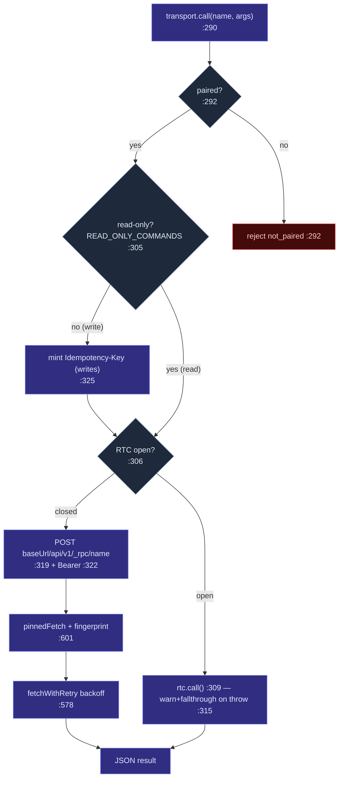

# Transport 层

<Status variant="beta" />

<TLDR>
  `Transport`（`transport-types.ts:19`）是一个双方法接口——`call(name, args)` 和
  `subscribe(event, handler)`——共享包中的所有模块都通过它与后端交互，而无需直接触碰 Tauri 或
  HTTP。`pickTransport()`（`transport-instance.ts:22`）在模块加载时一次性选定实现：桌面端使用
  `TauriTransport`（IPC），Capacitor 端使用 `CompanionTransport`，普通浏览器使用
  `WebStubTransport`。`CompanionTransport`（`transport-companion.ts`）通过 **TLS-pinned** fetch
  携带 Bearer JWT 以 POST 方式请求 `/api/v1/_rpc/<name>`，并开启一个支持 `?since=` 回放的
  `/ws/v1/events` WebSocket 连接。在移动网络环境下，它会透明地升级至 **WebRTC DataChannel** 子层
  （`transport-rtc.ts`），失败时自动回退到 HTTP。凭据通过 `SecureStorage`（`companion-storage.ts:127`）
  存储于操作系统 keystore 中。
</TLDR>

<StatGrid>
  <Stat label="选择器状态数" value="3" hint="Tauri / Companion / WebStub" />
  <Stat label="调用超时" value="30 s" hint="transport-companion.ts:206" />
  <Stat label="传输层级数" value="4" hint="ws-lan · ws-tunnel · rtc-direct · rtc-relay" />
  <Stat label="配置键" value="cognia.companion.config.v1" hint="companion-storage.ts:68" />
</StatGrid>

## 接口定义

```ts title="lib/tauri/transport-types.ts"
export interface Transport {
  call<T = unknown>(name: string, args?: Record<string, unknown>): Promise<T>  // :19
  subscribe<T = unknown>(event: string, handler: (payload: T) => void): () => void  // :26
}
```

`lib/tauri.ts` 是公共 barrel 文件——它重新导出单例 `transport`、`isTauri` / `isCapacitor`
检测函数以及插件包装器。`app/`、`components/` 和 `hooks/` 中的任何模块都不会自行构造 transport；
它们只需导入 `transport` 并直接调用。

## 三态选择

```ts title="lib/tauri/transport-instance.ts:22"
function pickTransport(): Transport {
  if (isTauri()) return new TauriTransport()       // __TAURI_INTERNALS__ present
  if (isCapacitor()) return new CompanionTransport() // Capacitor.isNativePlatform()
  return new WebStubTransport()                     // plain web
}
export const transport = pickTransport()            // eager, module-load
```

`isTauri` / `isCapacitor` 委托给规范的检测叶节点 `@/lib/platform/detect`（`:16`）——该文件不直接
检查任何 `window` 全局变量。选择结果是 **3 态**的；WebRTC 层级并不是这里的第四个并列选项——它是
`CompanionTransport` *内部*的子层，仅在 Capacitor 分支上可用，并在运行时按调用粒度选择。

| 实现 | `call` | `subscribe` |
| --- | --- | --- |
| `TauriTransport`（`transport-tauri.ts`） | `@tauri-apps/api` `invoke` | `listen` → unsubscribe |
| `CompanionTransport`（`transport-companion.ts:290`） | `POST {baseUrl}/api/v1/_rpc/<name>` + Bearer | `GET {baseUrl}/ws/v1/events` |
| `WebStubTransport`（`transport-web.ts`） | 拒绝（`tauri-only command from web`） | 无操作 |

## CompanionTransport — HTTP+WS 路径

### call() — `transport-companion.ts:290`



写操作仅当名称**不在** `READ_ONLY_COMMANDS`（`:15-59`，`:325`）中时才生成
`Idempotency-Key = crypto.randomUUID()`——该集合是 Rust 端 `READ_ONLY_COMMANDS` 的客户端镜像，
两者必须保持同步。若 RTC 层级已开启，调用会路由至 `rtc.call()`（`:309`），发生任何异常时则
打印警告并回退到 HTTP（`:315`）。`fetchWithRetry`（`:578`）在 30 秒 `CALL_TIMEOUT_MS`
（`:206`）内以 `[250, 500, 1000] ms`（`:200`）进行 backoff 重试，请求经由
`pinnedFetch`（`:601`）携带服务器指纹发送；`401` 响应会将连接状态置为 `unauthenticated`
并抛出不可重试错误（`:637`）。

### subscribe() — `transport-companion.ts:334`

逐通道注册处理器（`:341`），当 RTC 层级开启时同步在其上订阅（`:351`），并在尚无 WebSocket
连接时主动建立（`:356`）。`openWebSocket`（`:680`）以各通道最大 seq 的全局最大值
（`globalMaxSeq`，`:827`）计算 `since`，将 `https` 改写为 `wss`，并连接至
`{wsBase}/ws/v1/events?token=<jwt>&since=<seq>`（`:688-689`）。`handleWsMessage`（`:726`）
处理 `resync_required`（清空游标，`:739`），回复 `pong` 响应 `ping`（`:758`），并在推进
各通道游标的同时分发事件帧（`:771-782`）。断线重连在 `[1, 2, 4, 8, 16, 30] s`（`:197`）
区间内进行 backoff；当最后一个通道取消订阅后，WebSocket 将在 30 秒宽限期
（`WS_CLOSE_GRACE_MS`，`:203`）后关闭。

## TLS-pinned fetch

`pinned-fetch.ts` 将请求路由至原生 `CapacitorHttp` 插件，并设置 `serverTrustMode: "self-signed"`，
使手机信任桌面端的自签名证书**并**验证 SPKI 指纹——这是 WebView 的 `fetch` 所无法做到的。
这也是 `capacitor.config.ts` 中将 `CapacitorHttp.enabled` 设为 `true` 的原因。
指纹来自存储的 `CompanionConfig.serverFingerprint`。

## 传输层级

`CompanionTransport` 将当前连接的*质量*以 `TransportTier`（`transport-companion.ts:145`）
的形式暴露出来，并由 `transport-tier-indicator.tsx` 在界面上展示：

| 层级 | 含义 | 选择方式 |
| --- | --- | --- |
| `ws-lan` | WebSocket 连接至 LAN/`.local`/loopback 主机 | `classifyWsHost`（`:173`） |
| `ws-tunnel` | WebSocket 经由 Cloudflared 隧道连接 | `classifyWsHost`（`:173`） |
| `rtc-direct` | WebRTC，host/srflx ICE 候选对 | `getSelectedCandidateKind`（`transport-rtc.ts:469`） |
| `rtc-relay` | WebRTC 经由 TURN relay 转发 | 同上 |

`recomputeTier()`（`:549`）优先选用已开启的 RTC 层级，其次是已分类的 WS 主机类型，否则为
离线；消费方通过 `onTierChange`（`:526`）订阅变化。

## WebRTC 子层

`TransportRtc`（`transport-rtc.ts`）是 [ADR-0021](../../adr/0021-webrtc-datachannel-wan-transport)
中的 Offerer 端。它**不**由 `pickTransport` 选择，而是通过 `enableWebRtcTier()`（`:395`）启用，
该方法由[移动端信令控制器](./webrtc-transport#the-controllers)在网络条件满足时调用。
`call()`（`:416`）通过 DataChannel（`:432`）发送 `{ id, method, params }`，超时为 30 秒
（`:178`）；`subscribe()`（`:437`）分发 `{ kind: "event", event, seq, payload }` 格式的帧。
当连接状态变为 `closed`/`failed` 时，`CompanionTransport` 的监听器会将 `this.rtc` 置为
`null`（`transport-companion.ts:424`），使后续调用跳过 RTC 分支并改用 HTTP——回退是自动的。
完整机制详见 [WebRTC transport](./webrtc-transport)。

## 凭据存储

`CompanionConfig`（`companion-storage.ts:28`）的结构为
`{ baseUrl, deviceJwt, deviceId, serverVersion, serverFingerprint?, rendezvousId?, rendezvousSecret? }`。
`CompanionConfigStorage` 接口（`:62`）有两个实现，由 `pickCompanionStorage()`（`:165`）选定：

- **`LocalStorageCompanionStorage`**（`:74`）——使用 `window.localStorage`，适用于 web/jsdom。
- **`SecureStorageCompanionStorage`**（`:127`）——通过 `capacitor-secure-storage-plugin` 访问
  iOS Keychain / Android Keystore，使用键名 `cognia.companion.config.v1`（`:68`）。

读取操作使用 `transport-companion.ts` 中的内存缓存——`hydrateCompanionConfig()`（`:83`）在
启动时预热缓存，使 `call()` 能同步读取 JWT；`saveCompanionConfig()`（`:88`）在等待 keystore
写入完成*之前*先更新缓存。该配置**永远不会**写入 `~/.claude/.credentials.json`——该文件归
subscription OAuth 所有，与移动端无关。

## 相关页面

<Cards>
  <Card title="External API：RPC 清单" href="../../subsystems/companion-api/rpc-manifest" description="这些 _rpc 调用的服务端实现，以及客户端所镜像的 READ_ONLY 集合。" />
  <Card title="WebRTC transport" href="./webrtc-transport" description="DataChannel Offerer、签名信封以及 rendezvous 服务器。" />
  <Card title="发现与配对" href="./discovery-pairing" description="baseUrl、指纹和 JWT 最初是如何写入 CompanionConfig 的。" />
</Cards>
