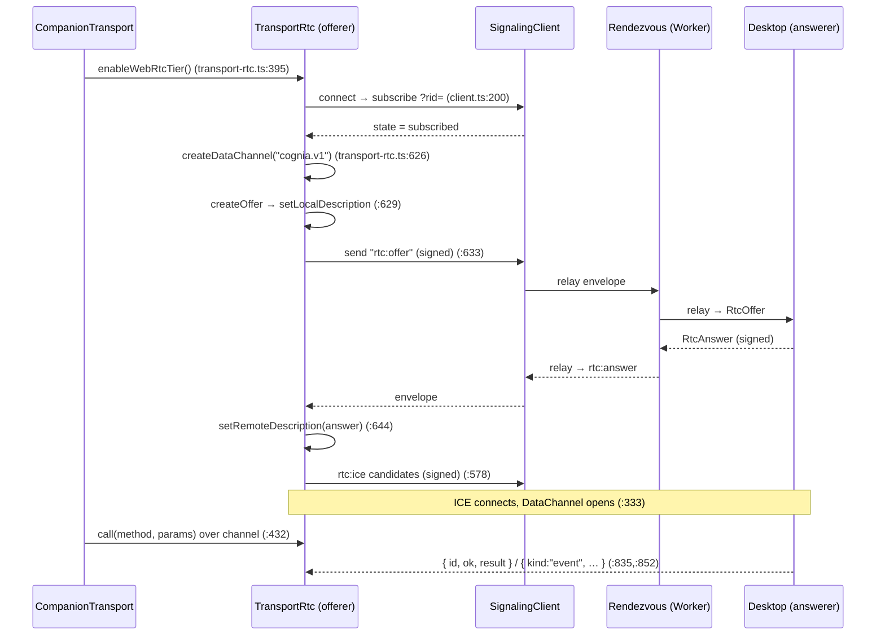

# WebRTC Transport

<Status variant="beta">beta · M-RTC</Status>

<TLDR>
  当手机处于蜂窝网络——无 LAN、无隧道——时，`CompanionTransport` 会升级为 **WebRTC
  DataChannel**。手机作为 **offerer**：`TransportRtc`（`transport-rtc.ts`）创建
  `cognia.v1` DataChannel 和 SDP offer，通过连接至公共 rendezvous 的 `SignalingClient`
  （`lib/signaling/client.ts:89`）完成交换，并在通道开启后将 `transport.call`
  路由到该通道。每个 signaling 帧都用由配对阶段得到的 `rendezvousSecret` 密钥
  进行 HMAC-SHA256 签名的 canonical-JSON 信封（`lib/signaling/envelope.ts`）包裹——
  这是 Rust 信封的字节级 TS 双胞胎，因此两端均不信任中继节点。rendezvous
  是一个小型 Cloudflare Worker，**每个房间分配一个 Durable Object**，在对端之间
  转发不透明信封。
</TLDR>

<StatGrid>
  <Stat label="DataChannel" value="cognia.v1" hint="types.ts:97 — 有序" />
  <Stat label="手机角色" value="offerer" hint="桌面端为 answerer" />
  <Stat label="Replay LRU" value="256" hint="types.ts:88" />
  <Stat label="Rendezvous" value="wss://signaling.cognia.cn" hint="types.ts:108" />
  <Stat label="房间容量" value="4 peers / 1 desktop" hint="wrangler.toml" />
</StatGrid>

## 所处位置

这是 [WebRTC signaling 平面](../../subsystems/companion-api/signaling-webrtc) 的客户端半侧。
`TransportRtc` 由移动端控制器调用的 `enableWebRtcTier()`（`transport-rtc.ts:395`）*启用*（非选择）；
`CompanionTransport` 随后对每次调用优先使用它，若通道关闭则回退到 HTTP。角色划分是刻意为之：
**手机发起 offer**（它知道何时需要通道），**桌面端回复 answer**（它为每个已配对设备保持一个常驻的 rendezvous 客户端）。

## Offerer

`TransportRtc.connect()`（`:258`）构建 `SignalingClient`，当其报告 `subscribed` 状态后，
运行 `startNegotiation()`（`:563`）：

`call()`（`:416`）通过 `dc.send`（`:432`）发送 `{ id: "rpc-N", method, params }`（`:420`），
由 `handleDataChannelMessage`（`:852`）匹配 `{ id, ok, result|error }` 完成解析；
`subscribe()`（`:437`）分发带有每通道 seq 游标的 `{ kind: "event", event, seq, payload }` 帧（`:835`）。
容错机制：重连退避 `[1…60] s`（`:66`）、节流的 `reconnectNow`（`:379`），以及 ICE-restart
梯级策略（`attemptIceRestart`，`:760`；`createOffer({ iceRestart: true })`，`:772`）。

## 签名信封（TS 双胞胎）

`lib/signaling/envelope.ts` 与 [Rust 信封](../../subsystems/companion-api/signaling-webrtc#the-signed-envelope)
字节兼容——跨实现的 MAC 测试将两者钉在一起。中继节点不受信任，因此真实性为端到端保证：

- **Canonical JSON** — `canonicalJson`（`:71`）对键排序（`:94`），并拒绝非有限数及**非整数**数（`:86-88`），
  以保持与 Rust serde 输出的字节级一致。
- **签名** — `buildSignedEnvelope`（`:159`）先以 `mac: ""` 起草，再由 `macFor`（`:236`）
  使用 32 字节导入的 `rendezvousSecret`（`importSecret`，`:122`）对 canonical 字节进行 HMAC-SHA256。
- **验证** — `verifySignedEnvelope`（`:203`）检查结构、`ver === 1`、时钟偏移窗口
  （`REPLAY_CLOCK_SKEW_MS`，`types.ts:85`），以及常数时间 MAC 比较（`:216`）。
- **Replay 防护** — `ReplayWindow`（`:267`）；`observe(role, seq, nonce)`（`:282`）在
  `(role,seq)` 和 `(role,nonce)` 两个维度上维护每角色 256 条 LRU（`REPLAY_LRU_CAPACITY`，`types.ts:88`）。

`freshNonce`（`:250`）为每个信封提供 16 字节随机数。

## Signaling 客户端

`SignalingClient`（`client.ts:89`）是一个连接 rendezvous 的轻量 WSS 客户端。`connectUrl()`
追加 `?rid=<rendezvousId>`（`:200`），使 Worker 能将连接路由到正确房间。连接成功后发送
`subscribe` 帧，并启动 25 秒心跳（`:214-221`）。`send(kind, body)`（`:156`）构建签名信封，
将其 base64url 编码后包装进 `relay` `ClientFrame`（`:168`）。入站服务器帧由 `handleRaw`
（`:238`）处理：`subscribed` / `peerJoined` / `peerLeft` / `relay` / `pong` / `error`；
终止错误 `room_full` / `role_taken`（`:49`）会拒绝连接。`handleRelay`（`:289`）解析、
**验证**（`:297`）、**replay 检查**（`:304`），然后发出信封。线路类型
（`ClientFrame` / `ServerFrame` / `Envelope` / `EnvelopeKind`，`types.ts:16-49`）
与 Rust `proto` crate 完全镜像。

## 控制器

控制器仅负责连接配置——它们*不*包含 RTC 逻辑：

- **`mobile-controller.ts`**（Capacitor）— `installMobileSignalingController`（`:63`）将
  `AppSettings` 映射为对 `tx.enableWebRtcTier({ signalingUrl, rtcConfiguration })`（`:169`）
  的调用，决定手机何时尝试 RTC 层级。
- **`desktop-controller.ts`**（Tauri）— `installDesktopSignalingController`（`:90`）通过
  `companion_signaling_sync_devices` / `companion_signaling_configure`（`:113-140`）将已配对
  设备列表和配置推送到 Rust hub。

## Rendezvous 服务器

`signaling-server/` 是一个 Rust signaling 中继，拥有两个可互换的后端，共享
`cognia_signaling_core` crate（`proto` / `policy` / `limits`）。客户端两种方式均发送 `?rid=`；
HMAC 信封对两者均**不透明**——服务器原样转发，从不接触明文。

### Cloudflare Worker（生产环境）

部署的后端是一个 Worker，**每个房间分配一个 Durable Object**：

- `lib.rs:fetch`（`:23`）路由 `/healthz`（`:32`）和 `/v1/signaling` → `route_signaling`（`:37`）。
- `route_signaling`（`:59`）要求 WebSocket 升级，检查来源，读取 `?rid=`（`:74`），并通过
  `env.durable_object("ROOM").id_from_name(&rid).get_stub()`（`:84`）解析 DO——每个房间因此
  是独立的单实例 actor。
- `RoomDurableObject`（`room.rs:68`）使用可休眠 WebSocket；`websocket_message`（`:123`）逐帧
  镜像 axum 后端——`Subscribe`（策略门控 `evaluate_subscribe`，`:179`）、`Unsubscribe`、
  `Relay` → 广播至 `subscribed_others`（`:233`）、`Ping`。房间容量来自 `wrangler.toml`
  `[vars]`：`SIGNALING_MAX_PEERS_PER_ROOM = 4`、`SIGNALING_MAX_DESKTOPS = 1`、
  `SIGNALING_MAX_CONN_PER_IP_PER_ROOM = 4`。该 Worker 命名为 `cognia-signaling`，绑定自定义
  域名 `signaling.cognia.cn`（`*.workers.dev` 主机在中国大陆被 GFW 封锁）。

### axum（自托管）

`signaling-server/src/` 是等效的单进程服务器，用于自托管：`router()`（`server.rs:76`）
提供 `/healthz`、`/metrics` 和 `any /v1/signaling` → `ws_upgrade`（`ws.rs:62`）；
`Mutex<HashMap<rid, Vec<PeerHandle>>>` 类型的 `RoomRegistry`（`room.rs:45`）将房间保存在内存中；
`handle_frame`（`ws.rs:256`）实现相同的 `Subscribe` / `Relay` / `Ping` 语义。
默认端口 `$PORT` 7892，可部署至 Fly.io。

## 设计原理

- **零信任中继。** rendezvous 可以是一个商品化 Worker，因为它只传递经过签名、replay
  保护的信封。攻破它既不会泄露任何信息，也无法伪造任何内容。
- **一个房间，一个 actor。** 每个 `rid` 对应一个 Durable Object，提供严格的每房间隔离和
  无需共享数据存储的简单广播。
- **同一协议，两种后端。** 共享 `cognia_signaling_core` 意味着 TS 客户端、Rust 桌面端
  answerer、axum 自托管实例和 Worker 均使用同一线路格式——由跨实现 MAC 测试验证。

## 相关页面

<Cards>
  <Card title="外部 API：WebRTC signaling 平面" href="../../subsystems/companion-api/signaling-webrtc" description="桌面端 answerer、webrtc-rs peer，以及 DataChannel→dispatch 泵。" />
  <Card title="传输层" href="./transport-layer" description="CompanionTransport 如何启用、优先使用并回退 RTC 层级。" />
  <Card title="发现与配对" href="./discovery-pairing" description="rendezvousId 与 rendezvousSecret 的生成位置。" />
</Cards>
