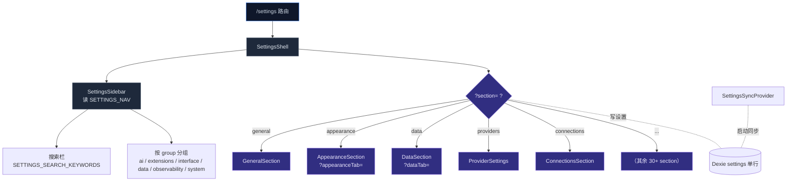

# 设置 UI

cognia-next 的设置中心是一个**单页+侧栏导航**的子系统：左边是一个分组侧栏，右边是按 URL 参数动态加载的"section"。所有子系统的可配置项都通过这一入口暴露，使用同一套布局、同一套 i18n key、同一套 URL 协议（`?section=` 选 section，`?<sectionTab>=` 选其内部子 tab）。

## 整体结构



## 导航注册表

`components/settings/settings-nav-config.ts` 是设置侧栏的**唯一**真理源。它导出三样：

```ts title="components/settings/settings-nav-config.ts"
export type SettingsGroup = "ai" | "extensions" | "interface" | "data" | "observability" | "system"

export type SettingsSectionId =
  | "general"
  | "api-key"
  | "providers"
  | "subscription"
  | "ccswitch"
  | "agents"
  | "agent-modes"
  | "agent-runtime"
  | "agent-teams"
  | "hooks"
  | "slash-commands"
  | "tools"
  | "search"
  | "appearance"
  | "speech"
  | "characters"
  | "skills"
  | "subagents"
  | "teams"
  | "presets"
  | "artifacts"
  | "canvas"
  | "mcp"
  | "a2ui"
  | "plugins"
  | "connections"
  | "data"
  | "workflows"
  | "scheduled-tasks"
  | "logs"
  | "diagnostics"
  | "remote-control"
  | "external-bridge"
  | "companion"
  | "network"
  | "desktop"
  | "about"

export const SETTINGS_NAV: NavItem[]
export const SETTINGS_GROUP_ORDER: SettingsGroup[]
export const SETTINGS_SEARCH_KEYWORDS: Record<SettingsSectionId, string[]>
```

每条 `NavItem`：

```ts
interface NavItem {
  id: SettingsSectionId
  labelKey: string // settings.tabs.<key> 的 i18n key
  descriptionKey: string // settings.descriptions.<key>
  group: SettingsGroup
  icon: ComponentType<{ className?: string }>
  desktopOnly?: boolean // 仅 Tauri/桌面
}
```

`desktopOnly: true` 的条目（如 `subscription`、`ccswitch`、`hooks`、`tools`、`connections`、`remote-control`、`companion`、`desktop`）在 `usePlatform() === "web" | "mobile"` 时被侧栏自动过滤。这是单一开关，section 内部不需要重复判断。

## 分组语义

| Group           | 含义                   | 典型 section                                                        |
| --------------- | ---------------------- | ------------------------------------------------------------------- |
| `ai`            | 模型、密钥、agent 行为 | general、api-key、providers、subscription、ccswitch、agents…        |
| `extensions`    | 用户可装配的扩展点     | characters、skills、teams、mcp、a2ui、plugins、connections          |
| `interface`     | 视觉与交互             | appearance、speech、presets、artifacts、canvas                      |
| `data`          | 数据生命周期           | data（备份/导出）、workflows、scheduled-tasks                       |
| `observability` | 排错与监控             | logs、diagnostics                                                   |
| `system`        | 系统级集成             | remote-control、external-bridge、companion、network、desktop、about |

顺序由 `SETTINGS_GROUP_ORDER` 控制，**不**按字母排。

## Shell：URL 即状态

`components/settings/settings-shell.tsx` 是骨架：

```tsx title="components/settings/settings-shell.tsx (节选)"
const requested = searchParams.get("section")
const activeSection: SettingsSectionId = isSection(requested) ? requested : "general"

const handleSectionSelect = (section: SettingsSectionId) => {
  const next = new URLSearchParams(searchParams.toString())
  next.set("section", section)
  router.replace(`/settings?${next.toString()}`, { scroll: false })
}
```

关键设计：

1. **`router.replace`** 而非 `push` —— 设置内部切 tab 不污染历史栈，浏览器后退一次直接回应用主界面。
2. **不验证就回 `general`** —— `isSection()` 守卫无效值，避免坏链接报错。
3. **URLSearchParams 拷贝** —— 保留 section 之内的二级 tab（`?dataTab=`、`?appearanceTab=`）。

加载 section 用 `next/dynamic`：

```tsx
const DataSection = dynamic(() => import("./data/data-section").then((m) => m.DataSection), {
  ssr: false,
  loading: () => <SectionLoading />,
})
```

`ssr: false` —— 设置页只在客户端跑（Dexie 是 IndexedDB，SSR 时不存在）。`<SectionLoading />` 是骨架占位，避免空白闪烁。

### Suspense 边界

整个 Shell 包在 `<Suspense>` 中以满足 `useSearchParams()` 的 Next.js 16 要求：

```tsx
export function SettingsShell({ actions }: Props = {}) {
  return (
    <Suspense fallback={<SettingsShellFallback />}>
      <SettingsShellInner actions={actions} />
    </Suspense>
  )
}
```

### FILL_HEIGHT_SECTIONS

某些 section（如 `providers`，列表+详情双栏布局）自带内部滚动；外层 `ScrollArea` 反而会撞双滚动条。`FILL_HEIGHT_SECTIONS` 集合的成员绕过外层 ScrollArea，撑满高度内部自管：

```tsx
const FILL_HEIGHT_SECTIONS = new Set<SettingsSectionId>(["providers"])
```

新加的 list+detail 类 section 想要同样的体验，把 id 塞进这个集合即可。

## Section 内的 Tabbed Shell

绝大多数 section 内部又是一个 tabbed 容器。约定：

- URL key = `?<section>Tab=<tabId>`，例如 `?dataTab=backup`、`?appearanceTab=theme`、`?wfTab=runs`。
- tab 状态走 query，**不**走 React local state（否则刷新丢）。
- 用 shadcn `<Tabs>`，TabsList 外包 `overflow-x-auto` 处理窄屏。

### 模板：data-section

```tsx title="components/settings/data/data-section.tsx (节选)"
const DATA_TAB_PARAM = "dataTab"
export type DataTabId = "overview" | "backup" | "domain" | "maintenance"

export function DataSection() {
  const router = useRouter()
  const searchParams = useSearchParams()
  const requested = searchParams.get(DATA_TAB_PARAM)
  const activeTab: DataTabId = isDataTab(requested) ? requested : "overview"

  const onTabChange = (value: string) => {
    if (!isDataTab(value)) return
    const next = new URLSearchParams(searchParams.toString())
    next.set(DATA_TAB_PARAM, value)
    router.replace(`?${next.toString()}`, { scroll: false })
  }

  return (
    <Tabs value={activeTab} onValueChange={onTabChange}>
      <TabsList>
        <TabsTrigger value="overview">概览</TabsTrigger>
        <TabsTrigger value="backup">备份 & 恢复</TabsTrigger>
        <TabsTrigger value="domain">域传输</TabsTrigger>
        <TabsTrigger value="maintenance">维护</TabsTrigger>
      </TabsList>
      <TabsContent value="overview">
        <DataOverviewTab />
      </TabsContent>
      {/* … */}
    </Tabs>
  )
}
```

写新的 section 时，直接复制这个 35 行的模板，改 `DATA_TAB_PARAM`、`DataTabId`、TabsContent 的内容即可。

### 现有 tabbed sections

| Section           | URL tab key       | tabs                                                           |
| ----------------- | ----------------- | -------------------------------------------------------------- |
| `data`            | `?dataTab=`       | overview / backup / domain / maintenance                       |
| `appearance`      | `?appearanceTab=` | theme / wallpaper / custom / import / typography / advanced    |
| `workflows`       | `?wfTab=`         | library / runs / templates / defaults / audit                  |
| `subscription`    | `?subTab=`        | overview / account / usage / settings                          |
| `connections`     | （内嵌）          | overview / adapters / conversations / inbox / outbound / audit |
| `external-bridge` | （内嵌）          | server / scopes / setup / audit                                |

## 搜索与键盘

侧栏顶部一个搜索框，按 label / description / `SETTINGS_SEARCH_KEYWORDS` 三栏匹配：

```ts
export const SETTINGS_SEARCH_KEYWORDS: Record<SettingsSectionId, string[]> = {
  general: ["defaults", "model", "system prompt", "permission"],
  "api-key": ["anthropic", "key", "secret", "claude"],
  providers: ["openai", "anthropic", "google", "gemini", "mistral", …],
  // …
}
```

加 section 时务必同步加 keywords，否则用户在搜"openai"找不到 providers。

## 桌面 vs 移动

桌面壳是 `<SidebarProvider>` 包 `<SettingsSidebar>` 与 `<SidebarInset>`，宽度固定 `15rem`；窄屏自动折叠为汉堡菜单按钮。

移动壳（`components/mobile/settings/mobile-settings-panel.tsx`）把同一份 `SettingsShell` 装进 Sheet 抽屉：

- 进入 `/settings` 时检测 `usePlatform()`。
- mobile = 顶栏汉堡按钮触发 Sheet，section 列表在 Sheet 内；选中后 Sheet 自动关。
- 移动 chrome（statusbar/safe-area）由 mobile-shell-wrapper 顶层处理；设置 panel 不重复关心。

## SettingsSyncProvider

设置数据本身走 `lib/settings/` + Dexie：

- **Dexie 表**：`settings`，单行，主键 `"singleton"`。schema 见 [storage](../data/storage)。
- **TypeScript 类型**：`types/settings/index.ts` 的 `AppSettings`，每个子系统拥有自己的命名空间（`AppSettings.externalBridge`、`AppSettings.connectors`……）。
- **Provider**：`SettingsSyncProvider`（`app/layout.tsx` Provider 链的第 3 个），启动时从 Rust 调 `settings_load`，反向写入由 Dexie live query 自动镜像。
- **Store**：Zustand `useSettingsStore`，section 组件直接 `useSettingsStore((s) => s.settings?.something)`，更新走 `useSettingsStore.getState().setSettings(...)`。

每个 section 的写路径都是：本地表单 state → 校验 → `setSettings({ …partial })` → Dexie patch → live query 通知所有订阅者。Rust 侧不直接持有完整设置；只有少数命令（如 `external_bridge_set_scopes`）从 store 读快照后落 sqlite。

## 加新 Section（步骤）

<Steps>

<Step>

### 写组件

新建 `components/settings/<area>/<area>-section.tsx`，导出命名导出。如有二级 tab，复用 data-section 模板。

</Step>

<Step>

### 注册到 SETTINGS_NAV

在 `settings-nav-config.ts` 的数组中加一行：

```ts
{
  id: "my-section",
  labelKey: "mySection",
  descriptionKey: "mySection",
  group: "extensions",
  icon: BlocksIcon,
  desktopOnly: false,
}
```

同时给 `SettingsSectionId` 联合加成员。

</Step>

<Step>

### 写 i18n

在 `i18n/messages/{en,zh-CN}.json` 的 `settings.tabs` 与 `settings.descriptions` 下加 key；中英都要。

</Step>

<Step>

### 注册到 Shell

`settings-shell.tsx`：

```tsx
const MySection = dynamic(() => import("./my-area/my-section").then((m) => m.MySection), {
  ssr: false,
  loading: () => <SectionLoading />,
})
```

`<SectionContent>` 的 switch 加一个 `case "my-section": return <MySection />`。

</Step>

<Step>

### 加搜索 keywords

`SETTINGS_SEARCH_KEYWORDS["my-section"] = ["...", "..."]`。

</Step>

<Step>

### 写测试

`<area>-section.test.tsx` + 各子 tab 的测试，目标覆盖率 ≥90%。

</Step>

</Steps>

## 测试

| 文件                          | 覆盖                                                   |
| ----------------------------- | ------------------------------------------------------ |
| `settings-nav-config.test.ts` | 类型 ID 与数组成员一一对应、group 顺序、关键字索引完整 |
| `settings-shell` 间接覆盖     | section 切换、URL 校验、ScrollArea 切换                |
| 各 section `*.test.tsx`       | 表单状态、写 Dexie 路径、降级分支                      |

`pnpm test:coverage` 验证整体阈值；新 section 不达 90% CI 会 fail。

## URL 协议小结

| URL                                                 | 行为                                             |
| --------------------------------------------------- | ------------------------------------------------ |
| `/settings`                                         | 默认 section = `general`                         |
| `/settings?section=providers`                       | 跳到 Providers section                           |
| `/settings?section=data&dataTab=backup`             | Data section 的 backup tab                       |
| `/settings?section=external-bridge`                 | External Bridge section（含 server/scopes 子页） |
| `/settings?section=appearance&appearanceTab=custom` | Appearance 的 custom theme tab                   |

凡是想发"深链给同事"的设置，都用这套 URL —— 它们会保留 section 与 tab 两层状态。

## 相关页

设置 UI 是几乎所有子系统的"入口面板"。下表给出每个 section 对应的核心子系统文档：

<Cards>
  <Card
    title="Provider 系统"
    href="../chat/provider-system"
    description="?section=providers 背后的 6+ 个 AI provider 注册"
  />
  <Card
    title="平台连接器"
    href="../subsystems/platform-connectors"
    description="?section=connections 的 5 个连接器适配"
  />
  <Card
    title="备份 & 数据"
    href="../data/backup-and-data"
    description="?section=data 的备份/恢复/域传输/维护"
  />
  <Card
    title="可视化工作流"
    href="../subsystems/visual-workflows"
    description="?section=workflows 的库 / 运行 / 模板 / 审计"
  />
  <Card title="技能子系统" href="../subsystems/skills" description="?section=skills 的技能库管理" />
  <Card title="角色管理" href="../chat/chat-and-skills" description="?section=characters 的角色编辑" />
  <Card
    title="MCP 服务器"
    href="../subsystems/misc-subsystems"
    description="?section=mcp 的本地与远端 MCP 注册"
  />
  <Card title="A2UI" href="./a2ui-system" description="?section=a2ui 的 A2UI 工具面板" />
  <Card title="插件系统" href="../subsystems/plugin-system" description="?section=plugins 的本地插件安装" />
  <Card title="调度器" href="../subsystems/scheduler" description="?section=scheduled-tasks 的 cron 与历史" />
  <Card
    title="外部桥"
    href="../subsystems/external-bridge"
    description="?section=external-bridge 的 MCP 服务器对外暴露"
  />
  <Card title="远程控制" href="../subsystems/remote-control" description="?section=remote-control 的设备链接" />
  <Card
    title="伴生端 API"
    href="../subsystems/companion-api"
    description="?section=companion 的 LAN bind / pair JWT 管理"
  />
  <Card
    title="Claude 订阅 OAuth"
    href="../chat/claude-subscription-oauth"
    description="?section=subscription 的订阅登录与额度"
  />
  <Card
    title="CCSwitch"
    href="../chat/ccswitch"
    description="?section=ccswitch 的 Claude Code profile 管理"
  />
  <Card
    title="外观主题与 i18n"
    href="./theming-and-i18n"
    description="?section=appearance 的主题/壁纸/字体/语言"
  />
  <Card title="Slash 命令" href="../chat/slash-commands" description="?section=slash-commands 的注册表" />
  <Card title="语音" href="../subsystems/misc-subsystems" description="?section=speech 的 TTS / STT 配置" />
  <Card title="日志" href="../subsystems/observability" description="?section=logs 与 ?section=diagnostics" />
</Cards>
