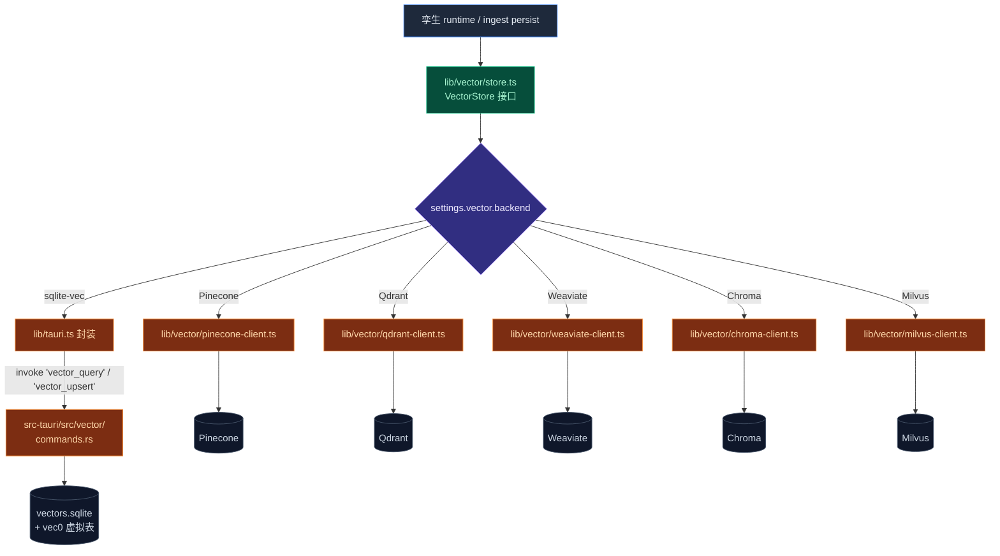

# 向量库

Cognia 的 [员工数字孪生](./employee-twin) 需要向量索引来支持 RAG。整个向量库藏在一层薄抽象（`lib/vector/store.ts`）后面，应用其余部分不必关心活动后端是哪一个。

完整设计原由参见 [ADR-0004](../adr/0004-vector-native-backend)。

## 后端

| 后端 | 适用 | 备注 |
| --- | --- | --- |
| **sqlite-vec（原生）** | 仅桌面 | 桌面默认。数据位于 `<app_data>/cognia/vectors.sqlite`。 |
| **Pinecone** | Web + 桌面 | `@pinecone-database/pinecone` |
| **Qdrant** | Web + 桌面 | `@qdrant/js-client-rest` |
| **Weaviate** | Web + 桌面 | `weaviate-client` |
| **Chroma** | Web + 桌面 | `chromadb` |
| **Milvus** | Web + 桌面 | `@zilliz/milvus2-sdk-node` |

Web 模式（`!isTauri()`）会在孪生设置中隐藏原生选项；必须用云端。

<Tabs groupId="vector-backend" persist items={["sqlite-vec", "Pinecone", "Qdrant", "Weaviate", "Chroma", "Milvus"]}>
  <Tab value="sqlite-vec">
    **优点**：零运维、单文件、无网络往返、易备份。
    **缺点**：仅桌面、无水平扩展、暴力扫描（≤ 10 万 chunk 内表现良好）。

    文件：`<app_data>/cognia/vectors.sqlite`。可用 `sqlite3` + `.tables` 检视。
  </Tab>
  <Tab value="Pinecone">
    托管云，搭建最快。在孪生设置里配 API key + 环境。
    **注意**：延迟以地域为主 —— 选最靠近用户的区域。
  </Tab>
  <Tab value="Qdrant">
    可自托管或托管。过滤能力丰富。希望数据留在自有基础设施时是好选择。
  </Tab>
  <Tab value="Weaviate">
    模块化，自带混合搜索。基础设施开销较重。
  </Tab>
  <Tab value="Chroma">
    最轻的云端选项。适合原型；企业特性较后期。
  </Tab>
  <Tab value="Milvus">
    超大规模（百万到十亿级）首选。搭建最重。仅在 sqlite-vec / 更小后端不够用时再考虑。
  </Tab>
</Tabs>

<Callout type="info" title="切换后端">
  重新嵌入需**手动**。切后端后请在孪生 Sources tab 用"重新嵌入"动作 ——
  维度、距离度量、元数据 schema 可能不同。
</Callout>

## 桌面为何选 sqlite-vec

ADR-0004 选择 sqlite-vec 的理由：

- **单文件** —— 易备份、易跨设备拷贝、可用任何 sqlite 工具检查。
- **无服务器** —— 零运维成本；数据与 Cognia 其他数据放在一起。
- **可打包进 Tauri** —— `sqlite-vec = "0.1"` 在任何连接打开前作为 SQLite **auto-extension** 加载。该 crate 不依赖 rusqlite，唯一约束是宿主 SQLite 支持加载扩展（Tauri 自带 SQLite 通过 `rusqlite` 的 `bundled` 特性满足）。
- **足够快** —— 一个用户的孪生通常 < 100k chunk，sqlite-vec 的 SIMD 暴力扫描足够，免去 HNSW 维护复杂度。

## 原生后端内部

```
src-tauri/src/vector/
  mod.rs          # 公共 API：register_extension、open_store 等
  db.rs           # 连接池、迁移
  schema.rs       # 表定义（向量 + 元数据）
  filters.rs      # 元数据过滤的 WHERE 构造
  types.rs        # 插入 / 查询 / 结果结构体
  commands.rs     # #[tauri::command] 封装
  error.rs        # 向量专用错误类型
```

### 表结构

每个集合两张表：

```sql
CREATE TABLE vec_<name> (
  id        INTEGER PRIMARY KEY,
  embedding BLOB    -- sqlite-vec 定长向量编码
);

CREATE VIRTUAL TABLE vec_<name>_idx USING vec0(
  embedding float[<dim>]
);

CREATE TABLE meta_<name> (
  id        TEXT    PRIMARY KEY,
  source    TEXT    NOT NULL,
  metadata  TEXT    NOT NULL  -- JSON
);
```

`vec0` 虚拟表是 sqlite-vec 索引；元数据表是普通 SQL，方便在相似度搜索之前/期间按 source / chunk 类型等过滤。

### Auto-extension 加载

`db.rs` 在**进程启动时一次性**通过 `unsafe { Connection::load_extension_enable() }` 注册 sqlite-vec 扩展，先于任何连接打开。这与 sqlite-vec 自身的集成测试一致。后续所有连接都自动继承该扩展。

### 查询

原生 `query` 命令接收：

- 查询嵌入（Float32 数组）。
- 集合名。
- 可选元数据过滤（key/value JSON 匹配）。
- `topK` 上限。

返回 `(id, score, metadata)` 三元组，按余弦相似度排序。score 范围 `[0, 1]`（sqlite-vec 返回 `1 - cosine`）。

## 架构速览



## 前端抽象（`lib/vector/`）

```
lib/vector/
  index.ts            # 公共 API（createStore、fromSettings）
  store.ts            # 实现分发
  embedding.ts        # 嵌入客户端（孪生 ingest 也用它）
  readiness.ts        # 健康检查（被 SettingsSyncProvider 使用）
  pinecone-client.ts  # 云端客户端实现
  qdrant-client.ts
  weaviate-client.ts
  chroma-client.ts
  milvus-client.ts
```

`store.ts` 暴露一个 `VectorStore` 接口：

```ts
interface VectorStore {
  upsert(rows: VectorRow[]): Promise<void>
  query(input: QueryInput): Promise<QueryResult[]>
  delete(ids: string[]): Promise<void>
  collectionExists(name: string): Promise<boolean>
  ensureCollection(name: string, dim: number): Promise<void>
}
```

每种后端各有一份实现；`fromSettings(settings)` 读取 Dexie 中的向量设置返回对应实现。原生后端走 `lib/tauri.ts`（命令在 `src-tauri/src/vector/commands.rs`）；云端后端直接调各自 SDK。

## 设置

用户在 **设置 → 孪生 → 向量库** 选择后端：

- 后端单选（sqlite-vec / Pinecone / Qdrant / Weaviate / Chroma / Milvus）。Web 模式隐藏原生项。
- 云端后端的连接信息（URL、API key、namespace）。
- 嵌入维度 —— 必须与所选嵌入模型输出一致（OpenAI text-embedding-3-small 默认 1536）。

`readiness.ts` 在保存时跑健康检查：一次小的 upsert + query 往返。失败则提示用户清晰错误，原后端保持不动。

## 切换后端时的重新 ingest

切换后端**不会**自动迁移。孪生工作台 Sources tab 的"重新嵌入"动作会针对新后端重跑 ingest 流水线的 embed + persist 阶段。这是唯一安全做法：维度、距离度量、元数据 schema 可能不同。

## 性能要点

<TypeTable
  type={{
    "批量大小": {
      description: "每次 LLM 嵌入 100 chunk，每次后端 upsert 100 行。可在 `lib/twin/ingest/{embed,persist}.ts` 调。",
      type: "调参",
    },
    "并发 ingest": {
      description: "每个孪生一次一个，由 job worker 强制。",
      type: "不变量",
    },
    "原生查询延迟": {
      description: "2024 笔电上 ~50k chunk 的 `topK ≤ 20` < 50ms。",
      type: "指标",
    },
    "云端延迟": {
      description: "往返为主；从非美用户访问 Pinecone us-east-1 通常 80–150ms。",
      type: "指标",
    },
  }}
/>

<Callout type="info" title="不要混维度">
  切换嵌入模型意味着切换向量维度 —— 在查询之前必须重新嵌入所有 chunk。
  存储不会自动检测维度错配；你只会拿到无意义的最近邻，而不是清晰错误。
</Callout>

## 在哪里入手

| 目标 | 文件 |
| --- | --- |
| 加一个新云端后端 | `lib/vector/<provider>-client.ts`，在 `store.ts` 注册，加设置 UI |
| 调 sqlite-vec schema | `src-tauri/src/vector/schema.rs`（提升迁移版本号） |
| 加新的元数据过滤 | `src-tauri/src/vector/filters.rs` 与 `lib/vector/store.ts` 类型 |
| 改进 readiness 检查 | `lib/vector/readiness.ts` |

## 测试

- 每个云端客户端 mock 自己的 SDK（`*-client.test.ts`）。
- `lib/vector/store.test.ts` 覆盖分发逻辑。
- 原生后端有 Rust 集成测试在 `src-tauri/tests/`：建临时 DB、upsert 向量、查询。

## 下一篇

<Cards>
  <Card title="员工数字孪生" href="./employee-twin" description="向量库的最大消费者" />
  <Card title="备份 & 数据传输" href="./backup-and-data" description="默认向量数据不在备份内 —— 只备份 twin sources 与 chunk 元数据" />
  <Card title="存储" href="./storage" description="承载 chunk 元数据的 Dexie 表" />
</Cards>
