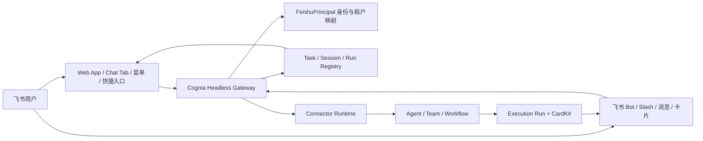

# 飞书双入口与 IM 多用户生产化完整实施计划

**日期**：2026-07-24  
**状态**：待评审，未实施  
**范围**：以现有 Cognia IM/Connector Runtime 为基础，完整实现飞书 Web 发现/管理入口、Bot 执行/协作入口、统一身份、多租户隔离、原生平台入口、回调授权、三端验证及生产运维闭环。  
**源文档**：[Aiden × 飞书入口与多用户方向](https://bytedance.larkoffice.com/docx/PRYfdQtOjo3AOoxOoPpc24zMnVe)  
**主要参考**：ADR-0009、ADR-0059、ADR-0089、`docs/research/connector-live-steer-lark-followup-2026-07-22.md`

---

## 0. 执行摘要

当前 Cognia IM 核心已经能够良好覆盖源文档中的“机器人执行与协作”方向，飞书 Bot 适配也明显强于源文档记录的旧版 `aiden-bot` 现状：

- 已有消息、附件、富文本、图片、文件、音频、视频、Reaction、撤回、已读和成员事件。
- 已有私聊、群聊、话题的精确 `conversationKey` 隔离。
- 已有入站持久化、每会话 FIFO、live steer、租约、恢复、幂等和队列上限。
- 已有多 Chat Session、Execution Run、Team、Workflow、取消、恢复和 AskUserQuestion。
- 已有 CardKit 流式呈现、稳定元素 ID、序列号、UUID、重试、协调、重建和最终普通消息兜底。
- 已有 `application.bot.menu_v6` 处理和确定性内部 Slash 命令。

但按源文档的最终方向验收，当前仍不能判定为完整覆盖，剩余阻断项集中在：

1. 缺少飞书 Web App、Chat Tab、群菜单、原生 App Slash、消息快捷方式、`+` 菜单和搜索/导航入口。
2. 缺少 `tenantKey + appId + openId → Cognia account/user` 的服务端统一主体映射。
3. Web OIDC 身份与 Bot `open_id` 尚未形成可验证的一致身份。
4. 部分高权限卡片短路回调缺少统一的 actor、tenant、account 和 conversation scope 授权。
5. Headless 多账号路径仍需彻底消除默认落入 `HEADLESS_LOCAL_ACCOUNT_ID` 的可能。
6. 缺少 PC、iOS、Android 的真实飞书客户端验收、灰度、监控和回滚闭环。

本计划按以下硬顺序实施：

```text
身份与租户隔离
→ 回调授权
→ Web SSO 与安全入口上下文
→ Chat Tab / 菜单 / 原生 Slash
→ + 菜单 / 消息快捷方式
→ 三端验证 / 灰度 / 运维
```

身份、隔离和回调授权未完成前，不得开放多租户 Web 入口、群审批或具备写能力的飞书入口。

---

## 1. 目标与非目标

### 1.1 最终目标

形成两条统一但职责清晰的入口：



完成后必须满足：

- 同一飞书用户通过 Web 和 Bot 进入时识别为同一个 Cognia 用户。
- 不同租户、应用、用户、群、话题、任务、Session 和 Run 不串线。
- Chat Tab、Slash、菜单、消息快捷方式等入口具备幂等性。
- Bot 继续支持现有消息、附件、话题、卡片、流式输出、AskUserQuestion、审批、取消和恢复。
- 所有写操作和审批回调检查真实点击者权限。
- 浏览器不持有飞书 App Secret、Bot Token 或本地 Companion 凭证。
- PC、iOS、Android 有明确的支持和降级行为。
- 支持租户灰度、监控、审计、限流和回滚。

### 1.2 必须完成的范围

1. 飞书与 Cognia 统一身份。
2. 多租户、多用户服务端隔离。
3. 所有高权限卡片回调授权闭环。
4. 飞书 Web App SSO。
5. Chat Tab。
6. 飞书原生稳定 Slash。
7. Bot 菜单和群菜单完整接入。
8. Web/Bot 任务与会话安全 Deep Link。
9. `+` 菜单和消息快捷方式。
10. PC、iOS、Android 三端兼容验证。
11. 权限、监控、灰度、审计和回滚。
12. 现有 IM 能力的完整回归。

### 1.3 明确非目标

- 不把所有动态 Agent 能力暴露为原生 Slash。
- 不让飞书入口直接访问本地 `/context` 或本地长期密钥。
- 不在 Next.js static export 中增加公开服务端 API。
- 不使用单独的 `open_id` 作为全局用户 ID。
- 不为每种入口建立彼此独立的任务、Session 或 Run 体系。
- 不重写已经成熟的 ConnectorBus、话题队列、CardKit 和 Execution Run。
- 不为了赶入口进度绕过 PII、授权、审计、幂等或多账号隔离。

---

## 2. 当前能力基线与缺口矩阵

### 2.1 飞书入口矩阵

| 源文档入口        | 当前状态                                                                     | 目标状态                                   | 结论              |
| ----------------- | ---------------------------------------------------------------------------- | ------------------------------------------ | ----------------- |
| 中央 Web 工作台   | 已有 Cognia Web、Inbox、Headless Brain、Companion Transport、Logto OIDC 基础 | 接入飞书 SSO 和安全入口上下文              | 部分覆盖          |
| 飞书主导航        | 未发现平台配置和交付流程                                                     | 可从飞书客户端进入授权后的中央工作台       | 未覆盖            |
| 顶部搜索快捷入口  | 未发现实现                                                                   | 跳转到安全工作台或搜索页                   | 未覆盖            |
| Chat Tab          | 未发现 `chat_tabs` 同步实现                                                  | 私聊/群聊幂等创建、更新、失效重建          | 未覆盖，P1 主路径 |
| Bot 自定义菜单    | 已处理 `application.bot.menu_v6`                                             | 接入稳定注册表、审计和安全链接             | 运行时已覆盖      |
| 群菜单            | 未发现 `menu_tree` 实现                                                      | 只放轻量链接，不直接执行高风险操作         | 未覆盖            |
| `+` 菜单          | 未发现 TriggerCode/AppLink/H5 JS SDK 接入                                    | 创建任务、打开工作台、选择 Agent/Workflow  | 未覆盖            |
| 消息快捷方式      | 未发现上下文导入                                                             | 支持最多 20 条消息的安全导入               | 未覆盖            |
| 原生 App Slash    | 内部命令完整                                                                 | 实现飞书原生命令发现、执行、缓存和版本兼容 | 未覆盖原生能力    |
| Web/Bot Deep Link | 有 `/inbox/c?key=...` 和移动端 Deep Link 基础                                | 改为短期授权入口，不泄露内部键             | 部分覆盖          |

### 2.2 IM 核心能力矩阵

| 能力             | 当前状态                            | 本计划动作                        |
| ---------------- | ----------------------------------- | --------------------------------- |
| 消息规范化       | 成熟                                | 回归，不重写                      |
| 附件和媒体       | 成熟                                | 补入口上下文导入测试              |
| 飞书话题隔离     | 已纳入 `thread_id`                  | 回归和跨入口绑定                  |
| 入站持久化       | 已有 durable inbound job            | 增加 account/principal scope      |
| 每会话 FIFO      | 已有，深度上限 100                  | 增加多租户压力验证                |
| live steer       | 已接入，危险 PII 可降级             | 回归                              |
| Session 管理     | 已有 `/new`、`/sessions`、`/switch` | 与原生 Slash 共用注册表           |
| Execution Run    | 已有 initiator、binding、control    | 增加 principal/account 权威字段   |
| CardKit          | 成熟                                | 回调授权和入口一致性              |
| AskUserQuestion  | 已有                                | 多用户 actor 授权测试             |
| 出站队列         | 已有重试、熔断、限流、DLQ           | 多租户观测和限流                  |
| 平台身份目录     | `[platform+remoteUserId]`           | 保留为联系人目录，不承担认证主体  |
| Web/Bot 统一身份 | 缺失                                | 新增 `FeishuPrincipal`            |
| 多用户高权限回调 | 部分分支缺少统一授权                | 新增 Callback Authorization Guard |

### 2.3 现有回调安全缺口

Execution Run 通用控制已经使用签名回调中的真实用户并检查 initiator/operator，但以下短路分支尚未看到等价的统一授权：

- `wf_approve`
- `wf_cancel`
- `wf_fanout_approve`
- `wf_fanout_cancel`
- `tool_approve`
- `skill_invoke`

安全风险不是“事件是否来自飞书”，而是“点击该卡片的人是否有权代表任务发起人批准该操作”。群聊或话题里的卡片可见性不能替代权限模型。

---

## 3. 目标架构与数据模型

### 3.1 身份模型

新增服务端权威身份模型：

```text
FeishuTenant
  id
  tenantKey
  appId
  cogniaAccountId
  status
  configuredAt
  disabledAt?

FeishuPrincipal
  id
  tenantKey
  appId
  openId
  unionId?
  cogniaAccountId
  cogniaUserId
  platformIdentityId?
  status
  linkedAt
  lastVerifiedAt
  version

FeishuWebSession
  id
  principalId
  cogniaAccountId
  scopes
  nonceHash
  issuedAt
  expiresAt
  revokedAt?
```

唯一性约束：

```text
FeishuTenant:    unique(tenantKey, appId)
FeishuPrincipal: unique(tenantKey, appId, openId)
```

现有 `platformIdentities` 保留为联系人、头像、显示名称和可逆人工合并目录，但不继续承担认证主体和租户授权职责。

### 3.2 身份解析链路

每个飞书事件都必须经过：

```text
verified event
→ tenantKey + appId + openId
→ FeishuPrincipal
→ cogniaAccountId + cogniaUserId
→ account-scoped Connector Runtime
```

无法解析时：

- 不创建 Agent Turn。
- 不进入默认本地账号。
- 返回可追踪的未绑定提示。
- 记录 tenant、adapter、event、openId 哈希和失败原因。
- 支持管理员完成绑定。
- 只有满足时效、幂等和安全条件的事件才允许重放。

### 3.3 任务、Session 和 Run 注册表

建立服务端权威关系：

```text
FeishuPrincipal
  → CogniaTask
  → ChatSession
  → ExecutionRun
  → ConnectorConversation
  → DeliveryTarget
```

建议新增：

```text
EntryBinding
  id
  accountId
  principalId
  adapterId
  platform
  conversationKey
  chatId
  threadId?
  taskId
  sessionId
  activeRunId?
  entryType
  createdAt
  updatedAt
  revokedAt?
```

`entryType` 至少包括：

- `bot_message`
- `bot_menu`
- `group_menu`
- `native_slash`
- `chat_tab`
- `web_app`
- `message_shortcut`
- `plus_menu`

所有 Web Deep Link 只携带不可猜测的短期授权 token，不直接暴露原始 `conversationKey`、`sessionId` 或本地凭证。

### 3.4 入口上下文

统一定义：

```text
FeishuEntryContext
  id
  principalId
  tenantKey
  appId
  accountId
  entryType
  chatId?
  threadId?
  selectedMessageIds?
  taskId?
  sessionId?
  nonce
  issuedAt
  expiresAt
  consumedAt?
```

要求：

- 由服务端签发并验证。
- 单次或短期有效。
- 防篡改、防重放。
- 不信任浏览器提交的 account、user、chat、task 和 session。
- 不在 URL 中暴露长期令牌。

### 3.5 服务边界

主应用是 Next.js static export，因此公开服务端能力必须放在 Rust Headless/Companion，而不是新增 Next.js Server Route。

逻辑端点至少包括：

```text
/integrations/lark/events
/integrations/lark/card-callback
/integrations/lark/slash
/integrations/lark/web/login
/integrations/lark/web/callback
/integrations/lark/entry/resolve
/integrations/lark/chat-tabs/sync
```

最终路径可以按现有 Companion API 约定调整，但必须统一经过：

1. 请求真实性校验。
2. tenant 和 app 解析。
3. Principal 解析。
4. account scope 注入。
5. 幂等检查。
6. 授权检查。
7. 审计。
8. 业务分发。

---

## 4. 实施阶段

## Phase 0：基线、ADR 与交付契约

### 目标

在写代码前冻结范围、现状和验收方式，避免重复实现已有 Connector 能力或把内部 Slash 误判为飞书原生 Slash。

### 任务

- 编写飞书双入口与统一身份 ADR。
- 固化当前飞书 Bot 能力矩阵。
- 记录测试基线、数据库版本和 Connector Runtime 行为。
- 建立源文档要求到代码、测试和验收项的追踪矩阵。
- 明确飞书应用类型、tenant/app 拓扑和部署方式。
- 明确 Headless 多账号权威存储，不允许多租户请求落入默认本地账号。
- 形成飞书权限、事件订阅、客户端最低版本和管理员配置清单。
- 完成回调、Deep Link、SSO、消息快捷方式的威胁建模。

### 验证

- ADR 评审通过。
- 每项需求都有 owner、实现位置、测试和 Gate。
- 当前飞书定向测试基线继续通过。
- `test:coverage`、typecheck、lint、build 和 Rust 测试基线留档。

### 交付物

- ADR。
- 权限清单。
- 数据模型。
- API 契约。
- 威胁模型。
- 三端验证矩阵。
- 灰度和回滚草案。

---

## Phase 1：统一身份与多账号隔离

这是所有 Web、Chat Tab、Deep Link 和多用户能力的前置条件。

### P1.1 服务端身份存储

- 新增 `FeishuTenant`、`FeishuPrincipal` 和必要索引。
- 增加 enabled/disabled/unlinked 等状态及审计字段。
- 所有查询强制携带 `accountId`。
- 建立 tenant/app/principal 创建、禁用、解绑和重绑定流程。
- 禁止未知 Principal 自动映射到默认本地账号。
- 决定 Dexie 本地镜像与服务端权威表的边界；多用户授权不得依赖浏览器本地 Dexie。

### P1.2 Bot 事件主体解析

- 从经过验证的飞书事件读取 `tenantKey`、`appId` 和 `openId`。
- 解析为 Cognia account/user。
- 将 principal 信息注入 Connector Event、Execution Run initiator、EntryBinding 和审计。
- 保留 `platformIdentityId` 作为显示身份引用。
- 处理 tenantKey 缺失、App ID 不匹配、Principal 禁用和绑定未完成。

### P1.3 Logto/OIDC 对接

- 建立 `FeishuPrincipal ↔ Logto subject ↔ Cognia user` 映射。
- 校验 `organization_id` 与飞书 tenant 的绑定关系。
- 拒绝跨 organization/tenant 访问。
- 定义首次登录自动绑定和管理员预绑定两种流程。
- 所有绑定、解绑和失败事件写安全审计。

### P1.4 账号作用域传播

- Connector 入站、回调、Session、Run、Workflow、Team、内置 Skill 和 Outbound 全链路传递 `accountId`。
- 对所有现有默认账号 fallback 做结构化搜索和删除或显式限制。
- 恢复任务时必须从持久化 binding 恢复 account/principal，不得从当前登录用户推断。

### 测试

- 相同 `openId`、不同 tenant 不得识别为同一主体。
- 相同 tenant、不同 App ID 不得静默合并。
- Bot 与 Web 登录解析到同一 Cognia user。
- 禁用用户不能通过 Bot、Web 或卡片回调继续操作。
- 未绑定用户不能进入默认账号。
- account A 不可读取 account B 的 task/session/run。
- 重启后 principal/account scope 不丢失。

### 完成标准

- 所有 Lark 入站事件都有明确 `accountId` 和 `principalId`。
- 不存在多租户请求落入 `HEADLESS_LOCAL_ACCOUNT_ID` 的路径。
- Web/Bot 身份一致性集成测试通过。

---

## Phase 2：回调安全与授权闭环

### P2.1 统一 Callback Authorization Guard

在所有 callback 短路分支之前新增统一授权层：

```text
authorizeCallback(
  actorPrincipal,
  binding,
  callbackConversation,
  adapter,
  tenant,
  account,
  requestedAction
)
```

必须校验：

- actor 是否为运行或请求发起人。
- actor 是否在 `runOperatorUserIds`。
- actor 是否具有管理员、审批者或对应 workflow 角色。
- tenant、app、account 是否一致。
- adapter 是否一致。
- callback 的 chat/topic 是否与 binding 一致。
- binding 是否过期、已消费、已撤销或已被替换。
- action 是否在 binding 允许动作集合内。
- callback payload 的 run/action/revision 是否与服务端权威记录一致。

### P2.2 覆盖全部高权限回调

逐一改造：

- `tool_approve`
- `wf_approve`
- `wf_cancel`
- `wf_fanout_approve`
- `wf_fanout_cancel`
- `skill_invoke`
- Execution Run approve/deny/retry
- AskUserQuestion
- follow-up bubble 控制
- CardKit stop/pause/resume
- 插件和未来自定义 callback

### P2.3 幂等、过期与审计

- callback binding 增加 actor scope、tenant、account、expiresAt、consumedAt 和 allowedActions。
- 重复点击返回已有结果，不重复执行。
- 授权失败记录 actor、action、binding、conversation 和拒绝原因。
- 审计中不记录敏感 token、完整用户输入或完整原始 payload。
- 转发卡片、旧卡片、失效卡片和跨话题点击均有确定行为。

### 测试

- 群中非发起人点击审批必须拒绝。
- 配置 operator 点击允许。
- 其他群或话题中的卡片点击必须拒绝。
- 跨租户伪造 binding 必须拒绝。
- 重复点击只执行一次。
- 过期 callback 必须拒绝。
- `skill_invoke` 未通过 guard 时不得进入 `hitlBypass`。
- 授权拒绝不会破坏原运行或错误消费合法 callback。

### 完成标准

- 所有写操作卡片回调都经过统一 guard。
- 不存在依赖“卡片可见性”等同权限的路径。
- 完整授权测试、PII 审计和安全评审通过。

---

## Phase 3：Web App SSO 与安全 Deep Link

### P3.1 飞书 Web SSO

- 实现登录发起、回调、state、nonce 和 PKCE。
- 服务端交换并验证飞书用户身份。
- 解析 `FeishuPrincipal`。
- 创建短期 Cognia Web Session。
- 不在浏览器持有飞书 App Secret、Bot Token 或本地 Companion 长期凭证。
- 处理无权限、未绑定、tenant 不一致、Principal 禁用和回调重放。

### P3.2 Entry Context 签发和解析

- 服务端签发 `FeishuEntryContext`。
- 所有飞书 Web 入口通过同一解析端点。
- 支持 entry type、chat、thread、task、session 和 selected messages。
- 过期、撤销、重复消费和 scope 不匹配有确定错误码。

### P3.3 任务与会话 Deep Link

- 将 `/inbox/c?key=...` 封装为授权入口，不允许飞书外部入口直接提供原始 key。
- Deep Link 解析后再导航到内部会话。
- 支持 Web、Tauri 和 Capacitor。
- 处理无权访问、任务删除、Session 切换、租户迁移和链接过期。
- 链接日志不包含长期 token。

### 测试

- SSO state/nonce 重放失败。
- Deep Link 被其他用户打开时拒绝。
- 跨 tenant/account 链接拒绝。
- 任务迁移或 Session 切换后解析到正确目标。
- 浏览器端不出现 Bot Secret 或 Companion 长期凭证。
- Web 与 Bot 打开的任务保持一致。

---

## Phase 4：Chat Tab、菜单与原生 Slash

### P4.1 Chat Tab

#### 任务

- 新增 Chat Tab 同步服务。
- 私聊和群聊采用稳定幂等键。
- 重复安装、事件重投和服务重启不产生重复 Tab。
- Tab 指向经过授权的 Web 入口。
- 支持配置更新、域名或 URL version 更新、失效重建和应用卸载清理。
- 持久化 chat、tab、tenant、app、URL version 和同步状态。
- 不依赖点击事件存在；点击后的身份和上下文由 Web SSO/Entry Context 解析。

#### 验收

- 同一 chat 多次同步只有一个目标 Tab。
- 修改域名或路由版本后可原地更新。
- 无权限用户打开 Tab 时不能访问任务数据。
- Tab 不支持或创建失败时仍能通过 Bot/Web 工作台降级。
- PC、iOS、Android 均有真实客户端证据。

### P4.2 Bot 菜单

现有 `application.bot.menu_v6` 运行时继续复用。

#### 补充任务

- 将平台菜单配置纳入发布清单。
- menu event key 使用稳定注册表。
- 直接命令走确定性 dispatcher。
- 跳转菜单使用安全 Web 入口。
- 未知 event key 记录审计并返回明确提示，不进入模型。
- 验证私聊限定和平台缓存行为。

### P4.3 群菜单

- 创建群菜单链接。
- 指向当前群或话题的安全上下文入口。
- 不支持动态上下文时降级到 Cognia 工作台。
- 群菜单只放链接或轻量入口，不直接执行高风险写操作。
- 菜单配置变更纳入租户发布与回滚流程。

### P4.4 原生 App Slash

#### 首批命令范围

```text
/new
/status
/help
/sessions
/switch
```

`/model`、`/mode`、`/reasoning`、`/team`、`/workflow` 等只有在配置、权限和缓存语义稳定后再评估公开。

#### 实现要求

- 建立单一命令注册表，内部 Slash 和飞书原生 Slash 共用定义。
- 实现飞书要求的命令发现和执行协议。
- 明确 GET/POST、签名、缓存、超时和错误协议。
- 未知命令不进入 Agent。
- `/new`、`/switch` 等状态变更命令继续使用私聊/everyone/allowlist 授权规则。
- Slash 事件与普通消息共用 conversation/session/run registry。
- 客户端缓存旧命令时返回稳定兼容提示。

#### 测试

- 内部和原生 Slash 产生一致结果。
- 重复事件不创建两个 Session。
- 群内无权限用户不能执行状态变更命令。
- 未知命令不会构造模型 Prompt。
- 缓存旧命令时行为可预测。
- PC 和移动端分别验证最低版本与降级行为。

---

## Phase 5：`+` 菜单、消息快捷方式与上下文导入

### P5.1 `+` 菜单

- 接入 Web App、AppLink 或 TriggerCode。
- 通过飞书支持的 H5 能力获取经过验证的会话上下文。
- 不信任 URL 或浏览器直接传入的 chat/user/account。
- 支持新建任务、打开当前会话工作台、选择 Agent/Team/Workflow。
- 入口只创建意图，不绕过现有策略、PII 和审批。
- 移动端不支持时降级到普通 Web 工作台。

### P5.2 消息快捷方式

- 支持选择最多 20 条消息。
- 服务端校验用户对消息和会话的可见权限。
- 拉取正文、发送者、时间、附件、reply 和 thread 关系。
- 将导入内容作为显式引用上下文，不伪装为新的用户消息。
- 附件继续经过现有下载、安全校验、OCR 和 PII gate。
- 记录来源 message IDs，避免重复导入。
- 处理撤回、删除、无权限、跨话题和附件下载失败。

### 测试

- 混合文本、图片、文件和富文本可以导入。
- 撤回或无权限消息不能导入。
- 20 条上限严格执行。
- 同一快捷操作重放不会重复创建任务。
- 话题消息保持原始 thread scope。
- Prompt 能区分“选中消息上下文”和“当前用户指令”。
- PII、恶意附件和超大附件沿用既有安全策略。

---

## Phase 6：多用户恢复、可观测性与生产运维

### P6.1 多用户运行和恢复

- 不同用户、任务、Session 和 Run 保持独立。
- 同一会话并发消息继续使用现有 FIFO/live steer。
- 服务重启后恢复 queued/running/recovery-required 状态。
- 取消、暂停、恢复和审批严格检查 actor 权限。
- 保持最大 pending 深度和账号/租户限流。
- 提供操作员 continue、retry、dismiss 和审计入口。
- 验证旧 lease、失效 callback、CardKit 超期和重建。

### P6.2 监控指标

至少包括：

- 飞书事件接收成功率。
- 签名或解密失败率。
- Principal 解析失败率。
- 未绑定用户数量。
- 回调授权拒绝次数。
- 入站去重次数。
- 队列深度和等待时间。
- live steer 成功和降级次数。
- Execution Run 成功、失败、取消和恢复率。
- CardKit 创建、更新、协调、重建和普通消息兜底率。
- Chat Tab 同步失败率。
- Slash 发现和执行错误率。
- Web SSO 成功率。
- 跨租户访问拒绝次数。
- 单租户、单用户和单 chat 的限流命中。

### P6.3 告警

- Principal 解析失败突增。
- callback signature 失败突增。
- callback 授权拒绝异常增长。
- 队列接近 100。
- `recovery_required` 持续增长。
- CardKit 更新连续失败。
- Headless 服务不可用。
- SSO 回调错误率超过阈值。
- 单用户或单租户出现异常高频。
- Chat Tab 或 Slash 配置与运行时版本漂移。

---

## 5. 工作包与依赖

| 工作包 | 内容                                     | 前置依赖     | 主要验证                 |
| ------ | ---------------------------------------- | ------------ | ------------------------ |
| WP-01  | ADR、能力矩阵、权限和威胁模型            | 无           | 评审通过                 |
| WP-02  | FeishuTenant/Principal 数据模型          | WP-01        | 唯一性、状态和迁移测试   |
| WP-03  | Bot 事件 Principal 解析                  | WP-02        | 多 tenant/app 隔离       |
| WP-04  | Logto/OIDC 与飞书身份绑定                | WP-02        | Web/Bot 同一主体         |
| WP-05  | account-scoped task/session/run registry | WP-02        | 跨账号拒绝               |
| WP-06  | 统一 callback authorization guard        | WP-02、WP-05 | actor/scope/幂等安全测试 |
| WP-07  | Web SSO 与 Entry Context                 | WP-04        | state/nonce/PKCE/重放    |
| WP-08  | 授权 Deep Link                           | WP-05、WP-07 | 跨用户/跨租户拒绝        |
| WP-09  | Chat Tab 同步                            | WP-08        | 创建、更新、重建幂等     |
| WP-10  | Bot/群菜单交付                           | WP-08        | event key 和链接安全     |
| WP-11  | 原生 Slash                               | WP-03、WP-05 | 发现、执行、缓存和授权   |
| WP-12  | `+` 菜单                                 | WP-07、WP-08 | 上下文真实性和降级       |
| WP-13  | 消息快捷方式                             | WP-07、WP-08 | 20 条消息、附件和 PII    |
| WP-14  | PC/iOS/Android E2E                       | WP-09～WP-13 | 真实客户端 CUJ           |
| WP-15  | 监控、灰度、限流和回滚                   | 全部         | 演练和告警验证           |
| WP-16  | 安全审查和上线 Gate                      | 全部         | 全量签字                 |

每个工作包应独立 PR，包含：

- 范围与不做事项。
- 数据或 API 兼容策略。
- 单元和集成测试。
- 真实验证证据。
- 风险和回滚。
- 对既有 IM 行为的回归结果。

---

## 6. 测试计划

### 6.1 单元测试

覆盖：

- Principal 唯一性和状态转换。
- tenant/app/openId 解析。
- account scope 查询。
- callback authorization guard。
- callback binding 过期、消费和重放。
- Deep Link 签发、过期和重放。
- Slash 注册表和命令分发。
- Chat Tab 幂等同步。
- 消息快捷方式上下文规范化。
- Entry Context 的签名和 scope。

所有新增或修改的 `lib/**`、`components/**`、`hooks/**`、`src-tauri/src/**` 文件按仓库要求提供共置测试或 Rust 内联测试。

### 6.2 集成测试

完整链路：

```text
Feishu event
→ signature verification
→ principal resolution
→ account scope
→ conversation resolution
→ session/run creation
→ agent execution
→ CardKit update
→ authorized callback
→ final response
```

场景至少包括：

- 私聊。
- 群聊。
- 群话题。
- 两个用户同时操作。
- 两个租户使用相同 openId 文本值。
- 两个 App 使用不同 app-scoped openId。
- 事件重投。
- 回调重复点击。
- 非发起人点击审批。
- 服务中途重启。
- CardKit 更新失败和重建。
- Web SSO 与 Bot 身份一致。
- Principal 禁用和解绑。

### 6.3 E2E/CUJ

1. 从飞书主入口打开工作台。
2. 从 Chat Tab 打开当前会话。
3. Bot 中使用原生 `/new` 创建 Session。
4. 在 Web 中看到同一 Session。
5. 发消息启动任务并观察 CardKit 流式状态。
6. 发起 AskUserQuestion 并由正确用户响应。
7. 工具审批由发起人通过。
8. 非发起人点击审批被拒绝。
9. operator 按配置完成审批或取消。
10. 取消运行并确认 Bot/Web 状态同步。
11. 从消息快捷方式导入多条消息创建任务。
12. 从 `+` 菜单创建任务并回到原 conversation。
13. 手机端不支持某入口时正确降级。
14. Headless 重启后恢复任务。
15. 租户禁用后所有入口停止工作且数据保持可审计。

### 6.4 回归验证

每个阶段至少运行：

```bash
rtk pnpm test
rtk pnpm test:coverage
rtk pnpm typecheck
rtk pnpm lint
rtk pnpm lint:i18n
rtk pnpm build
rtk cargo test
rtk git status
```

涉及真实飞书交互时必须执行测试租户的真实客户端验证，不能只依赖 mock。

UI 改动还必须验证：

- PC 飞书。
- iOS 飞书。
- Android 飞书。
- 浏览器直接访问。
- Tauri 桌面端。
- Capacitor 移动端。

---

## 7. 发布、灰度与回滚

### 7.1 环境顺序

1. 本地 mock。
2. 飞书测试应用。
3. 内部测试租户。
4. 单租户灰度。
5. 多租户灰度。
6. 正式发布。

### 7.2 Feature Flags

建议至少设置：

- `larkPrincipalRegistry`
- `larkWebSso`
- `larkChatTab`
- `larkNativeSlash`
- `larkMessageShortcut`
- `larkPlusMenu`
- `larkStrictCallbackAuthorization`

严格回调授权完成验证后应成为不可关闭的默认行为；Feature Flag 只用于迁移和灰度，不得长期允许绕过授权。

### 7.3 灰度顺序

1. 仅管理员。
2. 内部 allowlist 用户。
3. 单个测试私聊和测试群。
4. 单租户全量。
5. 多租户小流量。
6. 全量。

每一级灰度必须观察：

- 身份解析。
- 授权拒绝。
- 入口成功率。
- 队列和 Run。
- CardKit。
- SSO。
- 跨租户安全指标。

### 7.4 回滚要求

- 不删除 Principal、Task、Session、Run 和审计数据。
- 新入口可关闭，但 Bot 基础消息继续工作。
- Chat Tab 可保留并展示维护或降级页。
- Slash 返回稳定的暂不可用提示。
- 已运行任务仍可完成或被授权取消。
- 旧 CardKit callback 在兼容窗口内仍能解析。
- 数据迁移提供向后读取能力。
- 不使用破坏性数据库降级。
- 回滚后禁止将多租户请求落入默认本地账号。

---

## 8. 风险与控制

| 风险                           | 后果                     | 控制措施                          |
| ------------------------------ | ------------------------ | --------------------------------- |
| `openId` 跨 tenant/app 误合并  | 数据越权                 | 复合主体键和服务端唯一索引        |
| Web OIDC 与 Bot 身份映射错误   | 看到他人任务             | tenant/org 双向校验、绑定审计     |
| 群成员点击他人审批卡片         | 未授权写操作             | 统一 callback authorization guard |
| 外部 Deep Link 暴露内部 key    | 会话枚举或越权           | 短期签名 Entry Context            |
| 入口事件重复投递               | 重复 Session/Run         | 服务端幂等键和持久化 ledger       |
| Chat Tab 重复创建              | 用户界面污染             | tenant/app/chat 级稳定幂等键      |
| 飞书客户端能力差异             | 移动端入口不可用         | 三端矩阵和明确降级                |
| static export 中误加服务端逻辑 | Tauri/Capacitor 生产失效 | 所有公开 API 放 Rust Companion    |
| Headless 默认账号 fallback     | 跨租户混用               | 未解析 Principal 时 fail closed   |
| CardKit 过期或更新失败         | 状态不一致               | reconcile、重建和最终消息兜底     |
| 消息快捷方式导入敏感内容       | PII 泄露                 | 权限检查、PII gate、附件策略      |
| 动态 Agent 命令放入 Slash      | 缓存和配置漂移           | 只公开稳定命令注册表              |

---

## 9. 最终上线 Gate

只有以下条件全部满足，才能判定“完整覆盖源文档方向”：

### 身份与隔离

- [ ] Web 与 Bot 对同一飞书用户解析为同一 Principal。
- [ ] tenant、app、account、user 全链路隔离。
- [ ] 未知用户不落入默认本地账号。
- [ ] 不同用户、任务、Session 和 Run 不共享状态。
- [ ] 重启和恢复后 account/principal scope 不丢失。

### 入口

- [ ] 中央 Web 工作台完成飞书 SSO。
- [ ] Chat Tab 创建、更新和重建幂等。
- [ ] Bot 菜单配置和事件处理闭环。
- [ ] 群菜单具备安全链接和降级。
- [ ] 原生 Slash 具备发现、执行、缓存和版本兼容。
- [ ] `+` 菜单完成。
- [ ] 消息快捷方式完成。
- [ ] 所有外部 Deep Link 都使用安全 Entry Context。

### 安全

- [ ] 所有写操作回调检查真实操作者。
- [ ] 非授权群成员无法审批、取消或执行 Skill。
- [ ] callback tenant/account/chat/thread 与 binding 一致。
- [ ] callback 幂等、过期和撤销有效。
- [ ] 浏览器端无飞书或 Companion 长期密钥。
- [ ] 所有模型、Embedding 和云调用继续经过 PII gate。

### 功能回归

- [ ] 消息、附件、话题和历史无回归。
- [ ] CardKit 流式呈现、协调、重建和最终消息无回归。
- [ ] AskUserQuestion、审批、取消、暂停、恢复无回归。
- [ ] Team、Workflow、单 Agent 路由无回归。
- [ ] FIFO、live steer、queue cap、lease 和 recovery 无回归。

### 质量和发布

- [ ] PC、iOS、Android 完成真实客户端验证。
- [ ] `pnpm test:coverage` 满足仓库阈值。
- [ ] typecheck、lint、i18n、build 和 Rust 测试通过。
- [ ] 监控、审计、限流和告警上线。
- [ ] 租户灰度完成。
- [ ] 回滚演练完成。
- [ ] 权限范围、管理员配置和最低客户端版本形成发布文档。
- [ ] 安全审查和租户隔离测试签字通过。

---

## 10. 执行纪律

- 每个工作项先建立失败测试或可重复验证，再实现。
- 新增模块前先检索现有 `lib/`、`components/`、`hooks/`、`src-tauri/` 和相关 ADR。
- 优先扩展现有 ConnectorBus、Execution Run、Session Binding 和 Companion API，不创建平行体系。
- 每个修改过的非 vendored 源文件按仓库要求提供共置测试。
- 所有新增用户可见字符串接入 `next-intl`，同时更新英文和中文消息。
- 数据库改动遵循 Dexie/Rust 数据迁移规范，升级可恢复、可回滚读取。
- 新模块必须完成 runtime wiring，禁止“实现完成但未注册/未启动”。
- 涉及公开路由时执行 static export 审查。
- 涉及飞书或本地文本送模型时执行 PII gate 审查。
- 每个阶段完成后独立提交和验证，不混入相邻重构。

---

## 11. 当前验证基线

本计划形成前已执行以下飞书与 IM 定向测试：

```text
Test Suites: 9 passed, 9 total
Tests:       249 passed, 249 total
Snapshots:   0 total
```

覆盖：

- 飞书事件解析。
- 飞书适配器。
- 飞书群管理。
- 飞书能力矩阵。
- CardKit Run Presentation。
- follow-up control。
- ConnectorBus 话题/回合队列。
- Connector Runtime。
- Session Binding。

该结果只是现有能力基线，不代表本计划中的 Web SSO、Chat Tab、原生 Slash、统一 Principal 和多用户回调授权已经完成。
