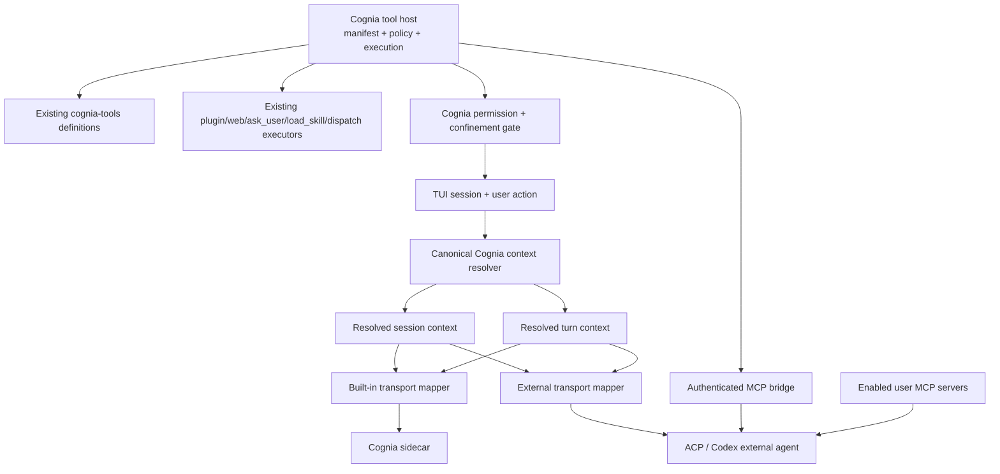

# TUI External-Agent Cognia Parity Plan

**Date:** 2026-07-24  
**Status:** Planning — corrected against the current code  
**Scope:** Interactive TUI sessions using `codex`, `codex-app-server`, `claude-code`, or another
external-agent preset

## 0. Correction to the previous plan

The previous version was based on an older implementation snapshot and had the wrong center of
gravity.

The current code already has:

- external-agent process hosting through the Node backend;
- strict macOS/Linux sandbox launch;
- startup-time handshake and capability discovery;
- persistent external sessions, resume links, cancellation, model switching, and permission
  translation;
- user MCP forwarding through ACP `session/new`;
- truthful external identity in both scrollback and fullscreen layouts;
- Codex reasoning-effort and native skill-root forwarding.

Those are the baseline, not future work.

The remaining architectural problem is **Cognia parity**:

1. `createAgentSession` resolves Cognia's complete session and turn context through
   `toBuildContext` → `resolveSendOptions`, then adds attachments, twin context, skills,
   subagents, plugin tools, tool policy, and approval state.
2. `createExternalAgentSession` bypasses that pipeline. It sends the raw prompt plus a small
   subset of `ResolvedConfig`: `config.systemPrompt`, model, permission mode, working directory,
   additional roots, and user MCP servers.
3. Cognia's built-in tools are hosted in-process by the sidecar as `cognia-tools`. Passing
   `.mcp.json` servers to an external agent does not expose those tools.
4. Cognia's plugin, web, elicitation, skill-loading, and subagent tools are hosted through the
   separate `cognia-plugin-tools` relay. They also do not reach external sessions.

Therefore this plan is not “finish launching Claude Code/Codex.” It is:

> Make every TUI backend consume the same Cognia-resolved context and the same effective
> Cognia-owned tool surface, while keeping the external agent's own native tools and protocol.

## 1. Product contract

### 1.1 “All Cognia tools” means effective parity

An external agent must receive every Cognia-owned tool that the built-in backend would receive
for the same session after applying:

- `BuiltinToolsConfig` category toggles;
- agent-mode tool filters;
- `allowedTools` and disabled-tool overlays;
- workspace restriction/confinement rules;
- plan/don't-ask/bypass permission semantics;
- plugin/web/skill/subagent feature gates;
- runtime availability, such as an LSP server or code-graph resolver being constructible.

It does **not** mean silently enabling categories the user disabled or bypassing approval for
high-risk tools.

The parity invariant is:

```text
effectiveExternalCogniaTools(session)
  == effectiveBuiltinCogniaTools(session)
```

The external agent's own tools are additive and remain agent-owned:

```text
externalVisibleTools
  = externalNativeTools
  + effectiveCogniaTools
  + enabledUserMcpTools
```

### 1.2 One context, backend-specific transport

The built-in and external paths may encode a turn differently, but they must not independently
decide what the session means.

One Cognia resolver owns:

- default and custom system instructions;
- output style;
- project instruction files;
- active agent mode and its prompt template;
- skills and progressive disclosure;
- working directory and additional roots;
- user MCP selection;
- model and reasoning preference;
- permission mode and tool allow/deny policy;
- attachments and OCR/text extraction;
- stable and per-turn twin context;
- subagent discovery and dispatch context;
- plugin/web/`ask_user`/`load_skill` manifests;
- cache-stable versus dynamic prompt sections.

Backend adapters only translate the resolved result into:

- sidecar `SendOptions` for the built-in backend; or
- ACP/Codex session metadata, MCP servers, and prompt content for an external backend.

### 1.3 Cognia remains the security authority

An external agent must not gain host capabilities merely because it can call an MCP tool.

For Cognia-owned tools:

- Cognia computes the visible tool list.
- Cognia applies workspace confinement.
- Cognia owns approval and persisted allow rules.
- Cognia executes or explicitly delegates the handler.
- Cognia records the result and audit event.
- The external agent cannot forge a tool name, workspace root, approval decision, or session id.

The external agent's ACP permission callback continues to govern its native tools. It is not a
replacement for Cognia's gate.

## 2. Current implementation map

### 2.1 Built-in session path

The built-in path currently assembles context across:

- `cli/src/config/to-build-context.ts`
  - synthesizes the CLI `ChatSession`, `AppSettings`, provider settings, output style,
    permission mode, active model, built-in tool toggles, roots, and preloaded MCP rows;
- `lib/claude/build-options.ts`
  - resolves project instructions, skills, agent mode, tool filters, MCP selection, Cognia
    built-ins, LSP configuration, plugin tools, and system-prompt composition;
- `cli/src/agent/session-runner.ts`
  - loads plugin runtime and skills, builds attachments, fetches twin context, registers
    subagent dispatch, applies approvals/disabled tools, and sends the turn to the sidecar.

This is the behavioral source of truth.

### 2.2 External session path

`cli/src/agent/external-agent-session.ts` currently builds execution options directly. It
forwards:

- raw prompt text;
- `config.systemPrompt` only;
- model;
- permission mode and `allowedTools`;
- working directory and additional roots;
- enabled user MCP rows via `toAcpMcpServers`;
- streamed events and ACP permission requests.

It does not consume the resolved built-in session context.

### 2.3 Cognia tool planes

There are three different concepts that must not be conflated:

| Plane                    | Current implementation                                                              | Purpose                                                                                                                   | External TUI status |
| ------------------------ | ----------------------------------------------------------------------------------- | ------------------------------------------------------------------------------------------------------------------------- | ------------------- |
| Cognia built-ins         | `sidecar/builtin-tools/index.mjs`                                                   | Files, git, process, environment, shell, terminal, LSP, code graph, AST, dependency research, web clone, tasks, plan exit | Missing             |
| Cognia host/plugin tools | `sidecar/builtin-tools/plugin-tools.mjs` + `cli/src/plugin/plugin-tool-dispatch.ts` | Plugins, web tools, `ask_user`, `load_skill`, `dispatch_agent`, host-routed features                                      | Missing             |
| User MCP servers         | `.mcp.json` → `toAcpMcpServers`                                                     | User-configured external MCP servers                                                                                      | Already forwarded   |

`lib/external-bridge/mcp-server/` is not a substitute for the first two rows. It exposes Cognia
wiki/runtime/orchestration data to third-party clients, not the interactive agent's local coding
tool set.

### 2.4 Existing parallel instruction stack

`lib/ai/instructions/external-agent-instruction-stack.ts` is not wired into the TUI external
session and is not equivalent to `resolveSendOptions`.

Do not wire it as a shortcut. It would create a second source of truth and still miss current
CLI behavior such as agent modes, instruction-file discovery, output styles, disabled tools,
attachments, twin dynamics, and CLI subagent dispatch.

The implementation should reuse or extract the active built-in resolver instead.

## 3. Confirmed gaps against the current code

### G1 — External sessions bypass canonical context [P0]

**Observed behavior**

- The external path uses `config.systemPrompt`, not the final prompt produced by
  `resolveSendOptions`.
- Project `AGENTS.md`/`CLAUDE.md`, active mode prompt, output style, skill catalog, and other
  composed sections can differ between built-in and external turns.
- Stable and dynamic twin context are fetched only in `session-runner.ts`.
- Attachment processing is absent from the external path.
- A change shown as active in the TUI can therefore affect the built-in backend while doing
  nothing, or something different, on Claude Code/Codex.

**Required behavior**

- A session-context snapshot test must show backend-independent semantic fields.
- A per-turn snapshot test must show identical user content, attachments, dynamic context, and
  policy before transport mapping.
- Unsupported transport features must be disclosed explicitly; they must not disappear
  silently.

### G2 — External sessions cannot call Cognia built-in tools [P0]

**Observed behavior**

- `builtinTools` is a sidecar-only protocol field.
- The sidecar turns it into an in-process `cognia-tools` MCP server.
- External sessions receive only user MCP rows.
- `/tools` can describe tools that the selected external agent cannot call.

**Required behavior**

- Every enabled `cognia-tools` definition must be projected into the external session.
- Tool schemas and descriptions must come from the same definitions as the built-in path.
- Resolver-bound tools such as LSP, code graph, task state, read tracking, and background shells
  must receive session-scoped dependencies.
- Disabled tools must be both absent from discovery and denied at execution.

### G3 — Host/plugin tools stop at the sidecar boundary [P0]

**Observed behavior**

- `resolveSendOptions` and `session-runner.ts` assemble plugin manifests and add
  `ask_user`, `load_skill`, and `dispatch_agent`.
- The built-in sidecar relays those calls back to the CLI.
- The external session neither advertises the manifests nor subscribes an equivalent executor.

**Required behavior**

- External agents receive the same effective `cognia-plugin-tools` manifest.
- Calls use the existing CLI executors rather than reimplementing plugin, web, or subagent
  logic.
- Human-blocking tools such as `ask_user` retain their no-fixed-timeout behavior.
- External tool calls render in the same TUI tool cells and participate in cancellation.

### G4 — Session mutation semantics are ambiguous [P1]

Several settings are resolved at different times:

- system instructions, MCP rows, and tool manifests can change while the TUI is open;
- ACP `session/new` consumes stable context only when the external session is created;
- dynamic twin context belongs to the current prompt;
- Codex reasoning and native skill roots are currently connect-time metadata;
- built-in sessions cache `SendOptions` and use explicit invalidation.

The UI does not have one rule for `/mode`, `/skill`, `/mcp`, `/tools`, `/add-dir`,
`/settings systemPrompt`, or plugin activation while an external session is live.

**Required behavior**

- Classify every field as connect-time, session-create-time, or per-turn.
- A setting that changes session-create-time context recreates the external protocol session
  before the next turn.
- The UI states when external conversational context is restarted.
- Tool-host manifests may refresh in place only if the external MCP client supports
  `tools/list_changed`; otherwise recreate the protocol session.

### G5 — Cognia permission and sandbox boundaries are incomplete [P0]

Projecting a host tool through MCP creates a capability tunnel out of the external process
sandbox unless Cognia re-applies policy at the host boundary.

**Required behavior**

- The MCP bridge authenticates to one TUI session with an unguessable, short-lived token.
- The host rejects calls from a stale attempt, wrong session, wrong tool, or wrong workspace.
- Path confinement is rechecked by Cognia even if the external process is sandboxed.
- Mutating/high-risk Cognia tools enter the existing permission overlay.
- “Allow once” is scoped to one call; persisted rules retain their existing cwd/expiry scope.
- Secrets are never placed in tool schemas, logs, launch summaries, or argv.
- Native external-agent tool permissions and Cognia-tool permissions never produce two user
  prompts for the same Cognia call.

### G6 — Capability UI models transport support, not Cognia parity [P1]

`backend-capabilities.ts` currently marks:

- user MCP as supported;
- plugins as not forwarded;
- skills as Codex-only;
- subagent models as not forwarded.

After the host tool bridge and shared context land, those answers must come from the actual
projection, not static backend assumptions.

The capability model must distinguish:

1. protocol can attach an MCP server;
2. agent negotiated the required MCP/session capability;
3. Cognia tool host started successfully;
4. current policy produced at least one tool;
5. feature requires a session restart.

An external preset that cannot attach Cognia's MCP bridge is not “ready with fewer tools” under
the default Cognia-parity contract. It is incompatible and should fail before the composer opens.

### G7 — Connect cancellation still has a late-registration race [P1]

The current `App.tsx` connect effect still uses a local `cancelled` flag and a stable id cleanup.
A process registered after the one-shot disconnect can remain registered because the late result
is ignored without a second authoritative cleanup.

This remains valid work, but it follows the context/tool architecture rather than defining it.

### G8 — Stream reveal and launch layouts still need interaction work [P2]

- `usePacedReveal` retains only a character count and has no stream/turn identity.
- A shorter next turn can inherit the previous count.
- `TURN_COMMIT` can replace a partially revealed inflight prefix with the complete committed
  cell.
- startup/connect/install/failure still replace the full layout tree rather than occupying a
  stable fixed-region shell.
- picker height is item-based rather than wrapped-row-based.

These remain UI remediation items after semantic parity.

## 4. Target architecture



### 4.1 Canonical resolved session

Introduce a backend-neutral value owned by the CLI agent layer, not by React and not by the
external adapter:

```ts
interface ResolvedCliSessionContext {
  sessionId: string
  cwd: string
  additionalDirectories: string[]
  systemPrompt: string
  instructionEnvelope: {
    hash: string
    developerInstructions: string
    customInstructions?: string
    skillsSummary?: string
    sourceFlags: Record<string, boolean>
    projectContextSummary?: string
  }
  model?: string
  reasoning?: string
  permission: ResolvedPermissionPolicy
  userMcpServers: McpServer[]
  cogniaBuiltinTools: ResolvedToolManifest[]
  cogniaHostTools: ResolvedToolManifest[]
  contextVersion: string
}
```

This is illustrative, not permission to duplicate the prompt builder. Prefer extracting a
result from the current `resolveSendOptions` path and adapting that result.

### 4.2 Canonical resolved turn

```ts
interface ResolvedCliTurn {
  prompt: BuiltAttachmentContent
  dynamicContext?: string
  trace: { sessionId: string; turnId: string }
  gate: PermissionResponder
  signal?: AbortSignal
  onEvent: (event: CaptureStreamEvent) => void
}
```

Stable instructions enter external `session/new`. Per-turn twin recall and current attachment
content enter the prompt. A stable-context hash change invalidates the external protocol session.

### 4.3 External Cognia tool host

Use a small, standard MCP stdio shim supplied in the external session's `mcpServers`. The shim
runs inside the external agent's sandbox and connects back to a CLI-owned session broker over an
authenticated local channel.

The design should reuse:

- schemas and handlers from `sidecar/builtin-tools/`;
- metadata from `lib/settings/builtin-tools-data.json`;
- plugin execution from `handlePluginToolExec`;
- CLI subagent execution from the existing dispatch context;
- current approval persistence and workspace-confinement logic;
- current timeout and tool-result cap behavior.

The broker owns session identity, policy, approvals, plugin runtime access, and cancellation.
The shim owns standard MCP framing only.

Why not pass an ordinary command that directly executes every tool without a broker?

- it cannot reach CLI-only plugin/subagent/elicitation executors;
- it cannot safely display Cognia's permission overlay;
- it would duplicate approval and session policy inside a foreign child process;
- it cannot reject stale sessions after a backend switch.

### 4.4 Permission choreography

For a Cognia-projected tool:

1. The external model chooses `mcp__cognia-tools__<name>` or
   `mcp__cognia-plugin-tools__<name>`.
2. The external agent may emit its own permission request.
3. Cognia auto-acknowledges only the known, projected Cognia namespace because this is not the
   authoritative execution approval.
4. The MCP shim sends the call to the authenticated Cognia broker.
5. The broker revalidates tool visibility, arguments, workspace confinement, and session state.
6. The existing Cognia gate prompts the user when required.
7. The existing handler executes.
8. Result/error returns through MCP and the external agent's event stream.
9. TUI rendering uses the same tool-name normalization, diff view, elapsed state, and audit
   accounting as the built-in path.

Native external-agent tools continue using the ACP permission request normally.

## 5. Implementation phases

Each changed file under `cli/src`, `lib`, or `sidecar` requires a co-located test. Keep each
phase independently verifiable and do not combine tool-host work with animation refactors.

### Phase 0 — Freeze parity contracts with failing tests

**Work**

- Build a test-only context probe around the current built-in path.
- Define semantic snapshots for:
  - default prompt and output style;
  - project instruction discovery;
  - agent mode prompt/tool/permission override;
  - name-only and full skill modes;
  - additional directories;
  - user MCP selection;
  - twin stable/dynamic sections;
  - text, document, PDF, and image attachments;
  - plugin/web/`ask_user`/`load_skill`/`dispatch_agent` manifests.
- Add an inventory assertion generated from the existing Cognia tool definitions:

```ts
expect(externalEffectiveToolNames).toEqual(builtinEffectiveToolNames)
```

- Add a negative matrix for disabled categories, plan mode, restricted workspace, and
  `allowedTools`.

**Verify**

- New external parity tests fail for missing context and tools.
- Existing built-in snapshots remain unchanged.

### Phase 1 — Extract one shared CLI context assembler

**Work**

- Extract session-stable and per-turn preparation from `session-runner.ts`.
- Keep `toBuildContext` and `resolveSendOptions` as the source of truth.
- Move attachment build, twin resolution, skill loading, active-mode resolution, approvals,
  disabled tools, agent discovery, and plugin manifest assembly behind the shared seam.
- Adapt the built-in session to consume the extracted result with no behavior change.
- Remove or formally deprecate the unused parallel external instruction stack; do not add a
  third prompt builder.

**Required tests**

- Before/after equivalence for the built-in session.
- Cache invalidation by context hash.
- Stable versus dynamic section placement.
- Failure degradation remains unchanged: plugin/twin/skill lookup failures do not crash plain
  chat unless the current contract already treats them as fatal.

**Changeset:** none.

### Phase 2 — Build the authenticated Cognia MCP tool host

**Work**

- Add a session-scoped tool-host broker.
- Add a minimal stdio MCP shim entry that the external agent can spawn.
- Project all currently effective `cognia-tools` definitions.
- Construct session-bound dependencies for core files, tasks, read tracking, background shells,
  LSP, and code graph.
- Reuse existing read-only timeouts and result caps.
- Filter discovery and enforce call-time denial from the same policy object.
- Add authenticated session/attempt tokens and explicit broker shutdown.
- Extend the strict sandbox policy only for the exact bridge endpoint and workspace resources
  required; never grant broad home or network access.

**Required tests**

- `tools/list` parity for every built-in category.
- One representative read-only and mutating call per category.
- Unknown/stale session, forged tool, path escape, expired token, and cancelled call.
- “Allow once,” persisted approval, deny, plan mode, don't-ask, and bypass modes.
- Broker/shim exit when the session or backend closes.

**Changeset:** none until wired.

### Phase 3 — Project Cognia host/plugin tools

**Work**

- Export the resolved `cognia-plugin-tools` manifest from the shared assembler.
- Route calls to existing plugin/web/elicitation/skill/subagent executors.
- Preserve special timeout semantics for `ask_user`, `load_skill`, and `dispatch_agent`.
- Register and clear the CLI subagent context per external turn.
- Ensure plugin activation/deactivation updates the manifest or invalidates the session.

**Required tests**

- External call to `ask_user` opens and resolves the TUI overlay.
- External call to `load_skill` returns the selected skill body.
- External call to `dispatch_agent` runs through the existing CLI subagent path.
- Plugin and web calls use the existing runtime and approval policy.
- Cancellation clears every pending broker request.

**Changeset:** none until external transport is wired.

### Phase 4 — Map canonical context and tools into external sessions

**Work**

- Make `createExternalAgentSession` consume the shared session/turn assembler.
- Map the final stable prompt and `instructionEnvelope` into `session/new`.
- Append the Cognia built-in and host-tool MCP configs to enabled user MCP configs.
- Map built attachments:
  - native content blocks where the protocol supports them;
  - Cognia OCR/text extraction where that is the established fallback;
  - an explicit pre-send error when fidelity cannot be preserved.
- Send per-turn dynamic twin context with the current user content.
- Preserve external session id/resume behavior only while `contextVersion` matches.
- Auto-acknowledge ACP permission prompts only for the broker-enforced Cognia namespaces.
- Keep native tool permission requests on the existing overlay path.

**Required tests**

- Golden semantic parity between built-in and external prepared context.
- A stub external agent calls a Cognia read tool, mutating tool, plugin tool, and user MCP tool
  in one turn.
- Project instructions, mode, skill, output style, twin context, and attachment content are
  visible to the stub.
- No duplicate permission prompt for one Cognia call.
- Native external tools still prompt normally.

**Changeset:** minor — first complete user-visible parity.

### Phase 5 — Define live mutation and restart behavior

**Work**

- Add a field-lifecycle table to the runtime:

| Field                                                              | Application point                                                  |
| ------------------------------------------------------------------ | ------------------------------------------------------------------ |
| dynamic twin context, current attachments                          | per turn                                                           |
| permission mode                                                    | live when adapter supports it; otherwise next session              |
| user MCP, Cognia tool manifest, system prompt, mode, skills, roots | session recreation unless protocol supports a truthful live update |
| Codex reasoning/native skill roots                                 | reconnect when still connect-time                                  |

- Make `/mode`, `/skill`, `/mcp`, `/tools`, `/add-dir`, plugin toggles, and system-prompt edits
  invalidate the right layer.
- Before recreation, show a concise notice that the TUI transcript remains but the external
  runtime context will restart.
- Persist the new external link only after the replacement session is created.
- Do not resume an external session under a different `contextVersion`.

**Required tests**

- Each command changes exactly the intended lifecycle layer.
- No turn can race with a pending context restart.
- Failed recreation returns to the prior usable session when safe, otherwise to an actionable
  failure state.

**Changeset:** patch.

### Phase 6 — Normalize capability and diagnostics truth

**Work**

- Replace static “plugins not forwarded” and Codex-only skill assumptions.
- Compute readiness from protocol negotiation × Cognia host health × effective manifest.
- Add `/status` and `/doctor` sections for:
  - canonical context version;
  - Cognia built-in tool count;
  - Cognia host/plugin tool count;
  - user MCP count;
  - broker/shim health;
  - restart-required settings.
- If a backend cannot attach the Cognia MCP bridge, fail compatibility before opening the
  composer.
- Keep an advanced, explicitly labeled “raw external agent” mode only if product decides to
  support a non-parity escape hatch.

**Changeset:** patch.

### Phase 7 — Close lifecycle and cancellation races

**Work**

- Move connect attempt id, process ownership, session ownership, broker ownership, cancellation,
  retry, and disposal into one lifecycle controller.
- Make cancellation await terminal cleanup.
- Clean a process that registers after its attempt was cancelled.
- Shutdown order:

```text
stop accepting tool calls
→ reject pending broker calls
→ cancel external turn
→ close external protocol session
→ disconnect MCP shim/broker
→ remove external agent/process
```

- Make install cancellation use the same lifecycle ownership model.

**Required tests**

- Cancel before registration, during registration, after handshake, during tool call, during
  permission prompt, and during session recreation.
- Two rapid backend switches.
- Double cancel/dispose.
- Unmount in every non-terminal state.
- Every spawn has one terminal exit/remove record.

**Changeset:** patch.

### Phase 8 — Repair reveal and fixed-region interaction

**Work**

- Key paced reveal by turn/stream epoch.
- Preserve reveal continuity when inflight content becomes a committed cell.
- Use a stable fullscreen shell for startup, route resolution, connect, install, failure, and
  ready states.
- Measure picker viewport by wrapped rows rather than item count.
- Keep cancellation hints and the selected recovery action visible at 40×12.
- Make tool cells from Cognia-projected external calls visually identical to built-in calls,
  while optionally showing a subtle backend-origin detail in verbose mode.

**Required tests**

- Short second turn after a long first turn.
- Commit while reveal lags.
- Abort/error during reveal.
- 40×12, 60×16, 80×24, and 120×40 render fixtures.
- Long tool name, executable path, error, and install output.

**Changeset:** patch.

### Phase 9 — Full-chain verification and documentation

**Automated verification**

```bash
rtk pnpm test:coverage
rtk pnpm typecheck
rtk pnpm lint
rtk pnpm lint:i18n
rtk pnpm build
rtk pnpm cli:build
```

Add an integration fixture that behaves like an ACP agent and:

1. receives canonical instructions;
2. lists Cognia and user MCP tools;
3. calls read, edit, `ask_user`, `load_skill`, and `dispatch_agent`;
4. receives approval/results;
5. survives a follow-up turn;
6. restarts after a context-version change;
7. exits cleanly on cancellation.

Run real smoke tests with:

- native `codex app-server`;
- Codex ACP fallback;
- Claude Code ACP.

The smoke is incomplete unless each real agent successfully invokes at least one read-only and
one mutating Cognia tool through the host bridge.

Update the English and Chinese CLI/external-agent docs only after the behavior is verified.

## 6. Acceptance criteria

The work is complete only when all of the following are true:

- Selecting Claude Code or Codex no longer changes which Cognia instructions, modes, skills,
  roots, or dynamic context apply.
- For identical config and policy, built-in and external sessions advertise the same Cognia
  tool names.
- Every enabled Cognia built-in is callable by the external agent, including resolver-bound
  categories when their runtime dependencies are available.
- Plugin, web, `ask_user`, `load_skill`, and `dispatch_agent` use existing Cognia executors.
- User MCP servers remain additive and independently toggleable.
- Disabled or policy-blocked tools are absent and cannot be invoked by name.
- Cognia-owned mutating tools always pass through Cognia confinement and approval.
- A Cognia-projected tool creates at most one user-facing approval prompt.
- Context/tool changes have deterministic live-update or session-restart behavior.
- External resume never reuses a session created under a different context version.
- Backend cancellation leaves no process, broker, MCP shim, pending approval, or pending tool
  call.
- `/tools`, `/status`, `/doctor`, settings, footer, and command gates report the same capability
  truth.
- Stream reveal and narrow layouts remain stable across external tool-heavy turns.

## 7. Decisions to discuss before implementation

### D1 — Incompatible agents

**Recommendation:** the normal external-backend mode requires Cognia tool-host support. If the
agent cannot attach the MCP bridge, fail before opening the composer.

An optional raw mode may exist later, but it must be explicitly selected and must visibly say
that Cognia context/tool parity is disabled.

### D2 — Stable-context changes

**Recommendation:** recreate the external protocol session on the next turn and show one notice.
Do not append a second system-prompt copy into an existing context; that creates conflicting
instructions and makes resume nondeterministic.

### D3 — External native tool overlap

**Recommendation:** keep the external agent's native tools. Cognia tools remain namespaced, so
the agent can prefer its native file tools or Cognia's policy-governed tools.

For modes that require Cognia auditing or confinement, restrict the overlapping native mutating
tools and instruct the agent to use the Cognia namespace.

### D4 — Scope of “all tools”

This plan treats the user's requirement as decided:

- all effective `cognia-tools`;
- all effective `cognia-plugin-tools`;
- all enabled user MCP tools;
- no force-enabling of disabled categories.

If “all” is intended to bypass category toggles, permission modes, or workspace restriction,
that would be a separate security-policy change and is intentionally out of scope.

## 8. Do not do

- Do not build a second external-only prompt stack.
- Do not treat user MCP forwarding as Cognia built-in-tool parity.
- Do not point external agents only at `lib/external-bridge/mcp-server`; it is a different tool
  product.
- Do not execute host tools solely on the authority of the external agent's permission result.
- Do not put approval tokens or secrets in argv, logs, schemas, or persisted external-agent
  config.
- Do not silently degrade to a tool-less external session under the default parity contract.
- Do not restart an external session without telling the user what context is retained.
- Do not mix semantic parity work with animation/layout refactors in the same phase.

## 9. Primary files likely to change

Existing seams to extract or adapt:

- `cli/src/agent/session-runner.ts`
- `cli/src/agent/external-agent-session.ts`
- `cli/src/config/to-build-context.ts`
- `lib/claude/build-options.ts`
- `cli/src/plugin/plugin-tool-dispatch.ts`
- `cli/src/agent/subagent-dispatch.ts`
- `cli/src/tui/runtime/backend-capabilities.ts`
- `cli/src/tui/runtime/backend-controller.ts`
- `cli/src/tui/components/App.tsx`
- `cli/src/tui/render/use-paced-reveal.ts`

Tool definitions and policy to reuse:

- `sidecar/builtin-tools/index.mjs`
- `sidecar/builtin-tools/plugin-tools.mjs`
- `sidecar/builtin-tools/confinement.mjs`
- `sidecar/builtin-tools/read-only-timeout.mjs`
- `sidecar/builtin-tools/result-cap.mjs`
- `lib/settings/builtin-tools-data.json`
- `cli/src/agent/tool-approvals.ts`
- `cli/src/agent/tool-suppression.ts`

Expected new deep modules:

- one shared CLI session/turn context assembler;
- one session-scoped Cognia tool-host broker;
- one minimal authenticated MCP stdio shim;
- one backend lifecycle owner.

New modules are justified because none of the existing modules owns these cross-backend
contracts. Extend existing prompt, tool, permission, and handler implementations rather than
reimplementing them inside the new modules.

## 10. Suggested commit sequence

1. `test(cli): define external context and tool parity`
2. `refactor(cli): share session and turn context assembly`
3. `feat(cli): host Cognia tools for external agents`
4. `feat(cli): project host tools to external sessions`
5. `feat(cli): apply canonical context to external agents`
6. `fix(cli): restart external sessions on context changes`
7. `fix(cli): report external parity capabilities`
8. `fix(cli): own external backend lifecycle cleanup`
9. `fix(cli): stabilize TUI reveal and launch layout`
10. `docs(cli): document external Cognia parity`

## 11. Evidence reviewed

This correction was based on the current source, including:

- `cli/src/agent/session-runner.ts`
- `cli/src/agent/external-agent-session.ts`
- `cli/src/config/to-build-context.ts`
- `cli/src/tui/runtime/backend-bridge.ts`
- `cli/src/tui/runtime/backend-capabilities.ts`
- `cli/src/tui/runtime/backend-controller.ts`
- `cli/src/tui/components/App.tsx`
- `cli/src/tui/components/app/TranscriptRegion.tsx`
- `cli/src/tui/render/use-paced-reveal.ts`
- `lib/claude/build-options.ts`
- `lib/ai/agent/external/manager.ts`
- `lib/ai/agent/external/acp-client.ts`
- `lib/ai/agent/external/resolve-acp-mcp-servers.ts`
- `lib/ai/instructions/external-agent-instruction-stack.ts`
- `sidecar/builtin-tools/index.mjs`
- `sidecar/builtin-tools/plugin-tools.mjs`
- `lib/external-bridge/mcp-server/server.ts`
- ADR-0077 and the archived external-agent hosting implementation plan.

No production-code change is part of this planning update.
