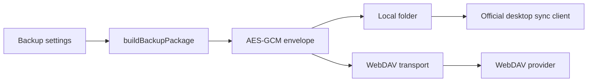
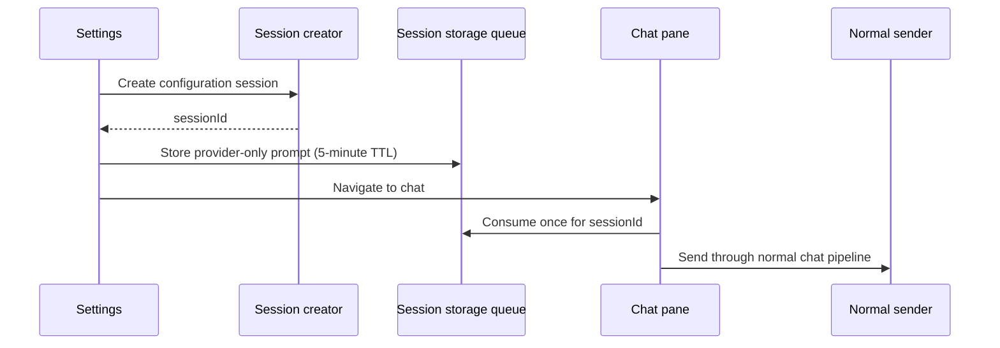

# Storage and backup provider completion

**Status:** Implemented  
**Date:** 2026-07-26  
**Owners:** Data, Connectors, Settings

## Summary

Cognia already had a sound v3 encrypted backup envelope, local scheduled writes, and WebDAV upload/restore. The implementation audit found three gaps that made the advertised behavior unreliable:

1. The desktop HTTP bridge rejected WebDAV contract methods (`PROPFIND`, `MKCOL`).
2. Every WebDAV client implicitly accepted invalid certificates, while Tauri ignored the flag.
3. Scheduled selection controls and plugin payload declarations did not match the exported/restored data.

This change completes those contracts, adds documented provider presets, supports major consumer cloud providers through their official desktop-sync folders, and adds a credential-free AI configuration entry point.

## Goals

- Make connection test, collection creation, listing, upload, and restore work on Tauri and Capacitor.
- Keep TLS verification strict unless a user explicitly opts into an invalid certificate for one endpoint.
- Support current documented WebDAV endpoints for Nextcloud, ownCloud, Nutstore, Koofr, pCloud US/EU, and Yandex Disk.
- Support Google Drive, Dropbox, OneDrive, and iCloud Drive without unofficial APIs.
- Ensure every scheduled backup selection maps to an exact payload.
- Round-trip the complete non-builtin plugin domain.
- Let users start an AI-guided configuration without copying credentials or private paths into chat.

## Non-goals

- Add OAuth connectors for Drive, Dropbox, OneDrive, or iCloud.
- Store server passwords or encryption passphrases in prompts, settings rows, or backup metadata.
- Bypass provider desktop clients for cloud-folder synchronization.
- Disable TLS validation globally.

## Existing architecture

The server password uses the platform keyring. The WebDAV sync passphrase is memory-only by default and may be persisted only through the existing explicit “remember on this device” control.

## Provider contracts

### Direct WebDAV

Provider metadata is centralized in `lib/webdav/provider-presets.ts`. Fixed hosted endpoints are applied exactly; self-hosted Nextcloud and ownCloud remain user-supplied because the host and username path are private configuration.

| Provider    | Endpoint                          |
| ----------- | --------------------------------- |
| Nutstore    | `https://dav.jianguoyun.com/dav`  |
| Koofr       | `https://app.koofr.net/dav/Koofr` |
| pCloud US   | `https://webdav.pcloud.com`       |
| pCloud EU   | `https://ewebdav.pcloud.com`      |
| Yandex Disk | `https://webdav.yandex.ru`        |

The desktop bridge allowlists `HEAD`, `OPTIONS`, `PROPFIND`, and `MKCOL` in addition to the existing HTTP methods. Unknown methods remain rejected.

### Desktop-synced folders

Google Drive, Dropbox, OneDrive, and iCloud Drive are represented as a distinct support mode. Cognia writes an encrypted local file into a user-selected folder. The official desktop client performs authentication, upload, retries, and conflict handling. This avoids undocumented APIs and duplicate synchronization engines.

## TLS and credential security

`allowInvalidCertificates` is optional and defaults to `false` across settings, TypeScript transport, Tauri serialization, and reqwest. When enabled it affects only the configured WebDAV request client.

AI prompts contain only:

- provider display name;
- public official documentation URL;
- public configuration workflow.

They exclude the current base URL, local path, username, password, app password, and sync passphrase. The prompt tells the assistant to have the user enter secrets only in local settings controls.

## AI configuration handoff

The queue is session-scoped, single-consumption, and short-lived. Corrupt or expired records fail closed. Sending stays in `ChatPane`, preserving persistence, model routing, tools, plugins, skills, and PII gates.

## Backup selection semantics

| Type       | Settings | Sessions | Core Dexie | Plugins | Persisted state | Artifacts |
| ---------- | -------: | -------: | ---------: | ------: | --------------: | --------: |
| Settings   |      yes |       no |         no |      no |             yes |        no |
| Sessions   |       no |      yes |         no |      no |              no |        no |
| Plugins    |       no |       no |         no |     yes |              no |        no |
| Everything |      yes |      yes |        yes |     yes |             yes |       yes |
| Full       | checkbox | checkbox |   checkbox |      no |             yes |  checkbox |

The cron path always excludes `settings.apiKey`.

Plugin export now reads `plugins`, `pluginPermissions`, `pluginReviews`, and `pluginAnalytics`, filters built-in plugins by default, and removes child rows for filtered parents. Restore writes all four tables and forces imported plugins disabled until reviewed.

## Compatibility and migration

- No Dexie schema migration is needed.
- `providerId` and `allowInvalidCertificates` are optional settings fields.
- Existing WebDAV configurations infer known hosted providers from `baseUrl`; unknown/self-hosted endpoints remain generic.
- Existing backup v3 envelopes remain valid because payload fields are optional and additive.
- Legacy unsupported scheduler destinations return an explicit failure and history record.

## Verification

- Rust unit tests cover WebDAV methods and certificate opt-in defaulting.
- WebDAV config, transport, provider metadata, and settings-card tests cover strict TLS and fixed endpoints.
- Pending-prompt and chat-pane tests cover session scoping and exactly-once normal sending.
- Backup builder/apply tests cover all plugin tables and exact domain selection.
- Schedule-card tests cover cloud-folder official guidance and credential-free AI handoff.
- `pnpm typecheck`, i18n build/ICU validation, lint, coverage, and production build are release gates.

## Official sources checked

- [Nextcloud WebDAV](https://docs.nextcloud.com/server/stable/developer_manual/client_apis/WebDAV/basic.html)
- [ownCloud WebDAV](https://doc.owncloud.com/server/next/classic_ui/files/access_webdav.html)
- [Nutstore WebDAV](https://help.jianguoyun.com/?tag=webdav)
- [Koofr WebDAV](https://koofr.eu/help/koofr_with_webdav/how-do-i-connect-a-service-to-koofr-through-webdav/)
- [pCloud WebDAV](https://help.pcloud.com/article/webdav)
- [Yandex Disk WebDAV](https://yandex.com/support/yandex-360/customers/disk/web/en/webdav)
- [Google Drive desktop sync](https://support.google.com/drive/answer/13401938?hl=en)
- [Dropbox desktop sync](https://help.dropbox.com/installs/download-dropbox)
- [OneDrive desktop sync](https://support.microsoft.com/en-us/onedrive/sync-your-computer-s-files-and-folders-with-onedrive)
- [iCloud Drive](https://support.apple.com/en-us/102314)
