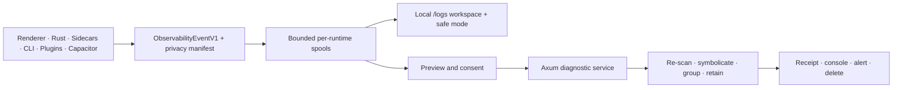
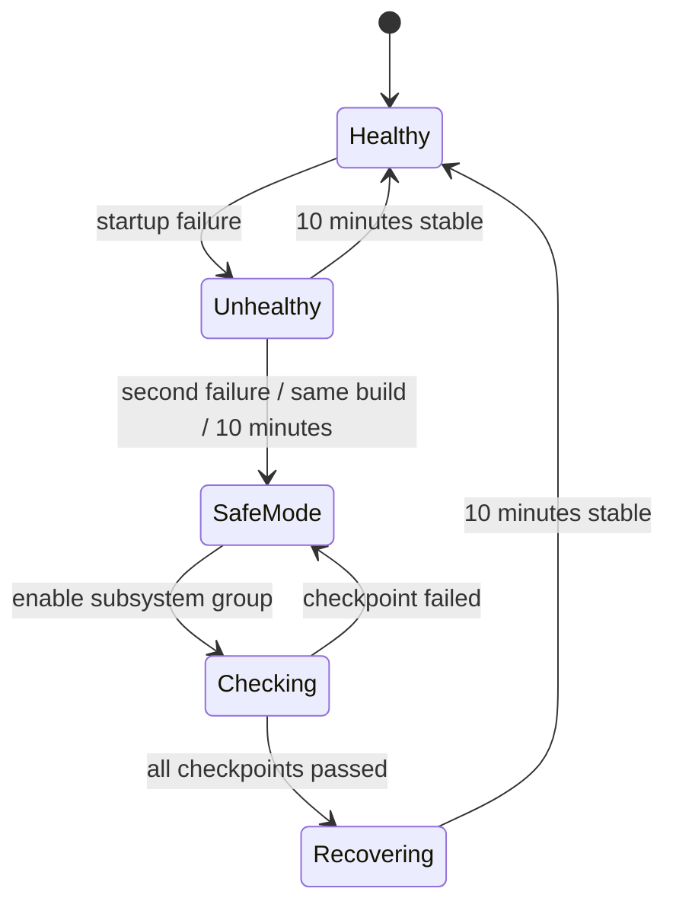

# Complete cross-runtime logging and crash diagnostics

| Field         | Value                                                                                                             |
| ------------- | ----------------------------------------------------------------------------------------------------------------- |
| Status        | Approved; implementation in progress                                                                              |
| Author · Date | Cognia observability owner · 2026-08-01                                                                           |
| Scope         | Next.js renderer, Tauri/Rust, CLI/TUI, Sidecars, plugins, Companion, Capacitor, diagnostic service, CI/deployment |
| Source        | Approved user implementation request                                                                              |
| Related       | ADR-0068, ADR-0074, ADR-0102                                                                                      |
| Branch        | `dev`                                                                                                             |
| Reviewers     | Product owner, privacy/security owner, desktop/mobile maintainers, service operator                               |

> **Executive summary**
>
> - **Change:** Extend the tested logger and native crash monitor into a V1 cross-runtime event pipeline, bounded recovery system, consented diagnostic delivery service, and unified `/logs` workspace.
> - **Reason:** Current capture, persistence, correlation, retention, and UI owners are individually capable but do not form one mobile-to-service incident lifecycle.
> - **Impact:** Adds versioned persisted contracts, native mobile capture, a multi-tenant Axum service, symbol storage, recovery state, CLI/plugin APIs, deployment, and strict privacy gates.
> - **Decision:** ADR-0102 records all product and architecture choices; there are no open product decisions blocking implementation.

## 1. The outcome is one local-first incident lifecycle without replacing working capture

Cognia already passes 38 core TypeScript suites (456 tests), 18 logging/crash UI suites
(370 tests), and 33 Rust crash tests. The gap is cross-runtime completeness: the browser
logger persists `StructuredLogEntry`, the native monitor writes separate crash reports,
and mobile/service/CLI surfaces do not share one receipt, recovery, or deletion lifecycle.

### Goals and acceptance

| Goal        | Baseline                                   | Target                                                     | Evidence                                |
| ----------- | ------------------------------------------ | ---------------------------------------------------------- | --------------------------------------- |
| Contract    | Runtime-specific shapes                    | Schema-valid `ObservabilityEventV1` plus legacy adapters   | JSON Schema and golden round-trip tests |
| Correlation | Partial trace/session IDs                  | Explicit W3C context across every process/network boundary | Concurrency and cross-process tests     |
| Durability  | IndexedDB/native files                     | Bounded spool per runtime with watermarks                  | Restart, truncation, and drain tests    |
| Recovery    | Sentinel and prompt                        | Bounded restart and progressive safe mode                  | State-machine and real-process E2E      |
| Delivery    | Local reports and generic remote transport | Previewed, resumable, withdrawable incident upload         | Compose and client E2E                  |
| Operations  | Local UI                                   | Symbolized tenant console, grouping, retention, alerts     | Service integration and RC matrix       |

In scope is every released runtime and all supporting CI/deployment. Hosted SaaS operation,
automatic capture of user content, background screenshots, and silent minidump submission are
explicitly unsupported.

## 2. Existing owners remain authoritative and V1 is the compatibility boundary

Confirmed owners are `packages/logging`, `lib/logging`, `src-tauri/src/crash`, the `/logs`
components/hooks, and the existing CLI crash-log discovery. New code extends those owners.
The main app remains a static export; the new control plane is a Rust service, never a Next.js
API route.

> All producers normalize at V1; rollback can disable remote edges while local capture and old readers continue to work.

### Invariants

- Routine remote logs and product content are default-off.
- Host identity, tenant, runtime, process, build, and plugin scope are never trusted from plugins.
- A crash is useful locally without network access or an account.
- Old `StructuredLogEntry` and native reports remain readable through the compatibility window.
- Diagnostic state never enters WebDAV, settings sync, or ordinary business-data backup.

## 3. V1 uses immutable execution scopes and durable, bounded delivery

`ObservabilityEventV1` is a discriminated `log | span | crash | lifecycle | metric` envelope.
Required root fields are `schemaVersion`, `eventId`, `occurredAt`, `kind`, `severity`, `name`,
`code`, `scope`, `correlation`, `privacy`, `delivery`, and `payload`. The checked-in JSON Schema
is the wire authority; TypeScript, Rust, OpenAPI, offline packages, and service ingestion use
golden fixtures from that schema.

| Contract             | Producer                          | Validator                         | Consumers                  | Persistence/version             |
| -------------------- | --------------------------------- | --------------------------------- | -------------------------- | ------------------------------- |
| V1 event             | Host logger/runtime adapter       | Client privacy gate + schema      | Spools, UI, service        | NDJSON.zst; schema v1           |
| Incident manifest    | Incident assembler                | Client + server streaming scanner | UI, upload, offline import | Signed JSON; manifest v1        |
| Upload grant/session | OIDC exchange or installation key | Service authn/authz and quota     | Resumable uploader         | PostgreSQL; OpenAPI v1          |
| Receipt              | Service state machine             | Tenant/RLS policy                 | Client, CLI, console       | PostgreSQL; stable support code |
| Symbol artifact      | Release CI                        | Build ID, checksum, role          | Symbolicator               | Encrypted S3 object             |

Scoped logger instances carry immutable trace/span context. `span` and `spanAsync` pass the
scoped logger into the callback; 128-bit trace IDs and 64-bit span IDs make valid W3C
`traceparent` values. Legacy global context is compatibility-only and receives no new call sites.

Every runtime spool records a monotonically increasing sequence and flush watermark. Low levels
batch; `warn` requests prompt forwarding; `error`, `fatal`, crash markers, and terminal lifecycle
events request the runtime's strongest synchronous durability. Shutdown drains are time-bounded
and persist unfinished counts. Incident assembly names missing sources instead of hiding gaps.

## 4. Crash recovery is a persisted state machine with a diagnostics-first safe mode

The Tauri sentinel remains the desktop persistence owner. Renderer reload is capped at one per
five minutes. A child/Sidecar receives at most three exponential restarts. Safe mode starts only
account access, read-only local data, logs/crash reports, settings reset, backup/export, and report
submission. Plugins, Sidecars, automation, connectors, schedulers, terminal, and appearance
extensions are enabled progressively; failures name the suspected group in the recovery audit.

iOS uses a first-party Capacitor bridge around pinned KSCrash 2.5.1 and MetricKit. Android uses
ACRA 5.13.1 and `ApplicationExitInfo` on API 30+. The unstable KSCrash deadlock termination
feature is prohibited. Mobile uploads its own incidents directly and only shares authorized
receipt summaries with a paired desktop.

## 5. Privacy, consent, tenancy, and deletion are enforced at both trust boundaries

| Boundary/threat        | Required control                                                            | Audit evidence                            |
| ---------------------- | --------------------------------------------------------------------------- | ----------------------------------------- |
| Runtime to local spool | Versioned key/pattern scanner; metadata-only default                        | Redaction version and removed-field paths |
| Client to service      | Preview, explicit consent or explicit auto-submit policy                    | Consent timestamp and manifest hash       |
| Untrusted attachment   | Streaming server re-scan; reject high-confidence credentials before storage | Rejection code without source bytes       |
| Tenant access          | Short-lived scoped token, service checks, PostgreSQL RLS                    | Tenant-scoped audit event                 |
| Raw minidump           | Tenant opt-in, JIT approval, step-up MFA, reason, one-time URL              | Immutable access audit                    |
| Deletion               | Receipt or anonymous deletion credential                                    | Tombstone and object deletion result      |

Signed-in clients exchange the existing OIDC identity for a short-lived diagnostic grant.
Anonymous clients prove possession of an installation key and receive a project/tenant-scoped,
quota-limited grant. Per-tenant DEKs are wrapped by a KMS/HSM KEK; key rotation and crypto-shred
are required. Ordinary PII is redacted twice; a probable credential rejects its attachment.

Crash packages default to metadata, stacks, system facts, redacted breadcrumbs, and related logs.
Minidumps, screenshots, and descriptions are separate unchecked attachments with preview/remove.
A local debug session expires after 30 minutes or restart and does not authorize remote content
upload.

## 6. The service owns resumable upload, processing, grouping, retention, and operations

The Axum service uses PostgreSQL for tenant metadata/state/audit and S3-compatible storage for
encrypted artifacts, symbols, and exports. Development/CI runs PostgreSQL, MinIO, and a KMS
emulator through Docker Compose; production uses Helm migration jobs, readiness/liveness, HPA,
PDB, NetworkPolicy, backups, and tested rollback.

Client states are `detected → packaged → awaitingConsent → queued → uploading → processing →
accepted | rejected | cancelled | deleted`. Server states are `received → scanning →
symbolicating → grouping → accepted`, with typed retryable/permanent failures. Incident ID plus
artifact SHA-256 is the idempotency key. Upload sessions expose create, part/checksum, status,
complete, cancel, receipt, withdraw, and delete operations through OpenAPI.

Limits are 20 attachments, 50,000 events, 1 GB total, 100 MB per non-minidump attachment, and
512 MB per minidump. Over-limit incidents retain a minimal manifest and reason. Defaults are:
local logs seven days/250 MB; local crashes 30 days/50/1 GB; server minidumps 14 days;
attachments 30 days; metadata/symbolized results 90 days; symbols 180 days.

Grouping uses a versioned fingerprint of platform, exception, compatible build family, module,
and symbolized top frames. The OIDC console provides viewer/triager/admin roles, explainable
grouping, merge/split/suppress/assign/regression actions, symbol status, attachment controls, and
deletion. Webhook, SMTP, and OTel alerts cover regressions, crash spikes, missing symbols,
upload/storage failure, and backlog.

## 7. `/logs`, CLI/TUI, and plugins consume the same contract

`/logs` becomes the sole inspection workspace: three resizable/collapsible panes at 1280 px and
above, two panes plus a detail drawer from 768–1279 px, and list-to-detail navigation below 768
px. Per-device layout, density, source, view, and filters persist with a reset action. Simple views
explain health, incidents, receipts, and recovery; advanced views expose traces, raw structured
fields, capabilities, queues, and symbol state. All states and accessible labels are localized in
English and Chinese.

CLI/TUI commands are `logs tail|query|doctor|export` and
`crash list|show|package|submit|status|delete`, with human/JSON/NDJSON output and the same consent
contract. Plugins receive only scoped log/trace/lifecycle/error-code methods; hosts inject scope,
redact payloads, and prohibit arbitrary transports or cross-plugin reads.

## 8. Rollout preserves old data and has independent kill switches

| Phase      | Entry                         | Change                                                              | Success                                | Abort/rollback                                  |
| ---------- | ----------------------------- | ------------------------------------------------------------------- | -------------------------------------- | ----------------------------------------------- |
| 0 Contract | Existing tests green          | Schema, adapters, context, privacy, capability and governance gates | Golden parity and isolated concurrency | Stop new writers; old logger unchanged          |
| 1 Local    | Phase 0 green                 | Runtime spools, incident assembly, recovery/safe mode               | Restart and local package E2E          | Disable spool/safe-mode flags; retain files     |
| 2 Service  | Compose integration green     | Auth, upload, scan, receipt/delete, symbols, grouping               | Processing SLO in canary               | Disable grants/processing; local reports remain |
| 3 Surfaces | Stable APIs                   | Responsive workspace, CLI/plugin/mobile parity                      | Platform E2E and accessibility         | Fall back to legacy readers/settings entry      |
| 4 Cutover  | Compatibility telemetry clean | Block unmanaged/legacy writes                                       | No unsupported producers               | Re-enable dual-write; never down-migrate data   |

Database migrations are expand-only. Readers accept supported older schemas. Remote upload,
automatic recovery, mobile native capture, symbol processing, and alerts have separate kill
switches. A rollback never deletes local incidents or rewrites an existing V1 spool.

## 9. Verification gates prove correctness, privacy, performance, and operability

- Core contracts, redaction, spool, upload/retry, tenancy, retention, grouping, and recovery pure
  logic require 100% line/branch/function coverage. UI, hooks, adapters, CLI, and console require
  at least 90% per changed file.
- PR checks run schema/unit tests, service integration, responsive web E2E, current-host crash
  smoke, typecheck, lint, i18n, static export, Rust fmt/clippy/tests, plugin contracts, and docs
  build. Nightly/RC covers Windows, macOS, Linux, iOS, and Android; RC failures block release.
- Development fault injection covers JS throw/rejection, React boundary, Rust panic/abort,
  renderer kill, Sidecar signal, native mobile crash, and Android ANR. Release self-test is
  non-destructive.
- With remote logging disabled, frontend `info` p95 is at most 0.25 ms and p99 at most 1 ms,
  memory at most 16 MB/process, initialization at most 50 ms desktop and 30 ms web/mobile, and
  1,000 events/s loses no `warn+` with at most 3% CPU increase.
- Service objectives are 99.9% monthly ingest/control availability, non-upload p95 at most 300 ms,
  99% processing within five minutes, metadata RPO at most five minutes, and RTO at most 60 minutes.

## 10. Work packages and ownership

| Package | Deliverable                                                                         | Owner role                | Verification                                      | Rollback                             |
| ------- | ----------------------------------------------------------------------------------- | ------------------------- | ------------------------------------------------- | ------------------------------------ |
| WP-1    | ADR, V1 schema/adapters, scoped context, privacy/capability contracts, logging gate | Observability owner       | Package tests and schema golden fixtures          | Keep legacy writer                   |
| WP-2    | Spools, incident assembly/package, backup exclusion, lifecycle instrumentation      | Runtime persistence owner | Restart, bounds, package/import tests             | Disable spool transport              |
| WP-3    | Desktop/mobile capture, recovery and safe mode                                      | Desktop/mobile owner      | Native unit and real-process matrix               | Disable recovery/native plugin flags |
| WP-4    | Axum service, storage, auth/tenant, upload, privacy, receipts/delete                | Diagnostic service owner  | Compose integration and adversarial tenancy tests | Disable grants and processing        |
| WP-5    | Symbols, grouping, retention, alerts, console                                       | Service operations owner  | Symbol golden files and retention drills          | Pause workers; preserve raw state    |
| WP-6    | `/logs`, settings, CLI/TUI, plugin SDK                                              | Product surfaces owner    | Responsive/a11y/E2E and contract pack tests       | Legacy readers/settings link         |
| WP-7    | CI matrix, Helm, SLO/performance gates, rollout cleanup                             | Release engineering owner | Nightly/RC and rollback drill                     | Hold rollout                         |

## 11. Decisions and review record

All material decisions in ADR-0102 were approved by the requester on 2026-08-01. No open
implementation decision may be silently changed; a conflict requires an ADR amendment.

| Reviewer                | Conclusion  | Date       | Conditions                                                         |
| ----------------------- | ----------- | ---------- | ------------------------------------------------------------------ |
| Requester/product owner | Approved    | 2026-08-01 | Implement the complete plan without simplified placeholders        |
| Implementation owner    | In progress | 2026-08-01 | Preserve concurrent worktree edits and verify every vertical slice |

There are no unowned TODOs. Remaining work is represented by WP-1 through WP-7 and is complete
only when its acceptance and rollback checks pass.

## Sources

- `packages/logging/src`, `lib/logging`, `hooks/logging`, and `components/logging`
- `src-tauri/src/crash` and the registered Tauri crash commands/permissions
- `cli/src/tui/runtime/crash-log-discovery.ts` and existing log commands
- ADR-0068, ADR-0074, and ADR-0102
- KSCrash 2.5.1, Apple MetricKit, ACRA 5.13.1, and Android `ApplicationExitInfo` official documentation
