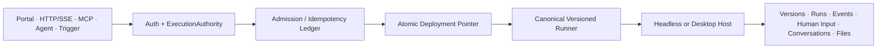

# Workflow capability alignment with Dify 1.15.0

**Status:** Accepted program proposal; implementation is milestone-gated

**Baseline:** Dify tag `1.15.0` (2026-06-25)

**Decision:** Preserve Cognia's canonical TypeScript runtime and add an immutable publication/control plane plus product surfaces. Do not clone Dify internals or wire contracts.

## Executive summary

Cognia already has the stronger execution substrate: DAG scheduling, bounded concurrency, loops, retry/error branches, leases and resume, typed callable workflows, agent orchestration, replay, Headless execution, CLI/TUI, and OTEL foundations. The blocking defect is above that substrate: a publication marker still points at the editable workflow row. Formal callers can therefore execute graph content changed after publication.

The program first introduces immutable `WorkflowVersion` artifacts, atomic environment-scoped `WorkflowDeployment` pointers, and one `ExecutionAuthority`. Later milestones add durable Human Input and files, typed node boundaries and hardened executors, account-scoped Knowledge and Conversation products, Portal/Embed, portable bundles, Dify DSL import, and complete observability. Every milestone is independently testable and reversible at its deployment boundary.

## Goals and non-goals

### Goals

- Pin every formal run to an immutable workflow and dependency version.
- Route HTTP/SSE, MCP, Portal, triggers, Skills, agent tools, and subworkflows through the same admission and runner contract.
- Make Human Input, files, conversations, and events restart-safe and account-isolated.
- Reach Dify 1.15 product capability while retaining Cognia Agent, Plugin, Headless, RAG, and telemetry advantages.
- Preserve existing run/event history and import older workflow JSON.

### Non-goals

- Dify OpenAPI/error-envelope compatibility or UI cloning.
- A second workflow runtime.
- CRDT collaboration, presence, or comments.
- Persisting provider-hidden chain-of-thought. Only provider-exposed reasoning blocks may be streamed and retained under redaction policy.

## Confirmed baseline and capability matrix

| Domain             | Confirmed Cognia baseline                                                   | Program change                                                                        |
| ------------------ | --------------------------------------------------------------------------- | ------------------------------------------------------------------------------------- |
| Runtime            | DAG, parallel scheduling, `flow.loop@2`, retry/error branch, resume, leases | Preserve; formal runs receive immutable provenance                                    |
| Callable workflows | Typed runner, Subworkflow, Skill projection, completion chaining            | Resolve active deployment rather than live draft                                      |
| Publication        | `VisualWorkflow.published` marker on editable row                           | Immutable versions, atomic deployment pointer, rollback                               |
| Human Input        | Binary approval; in-memory response registry                                | Durable multi-field, multi-action request state machine                               |
| Debugging          | Pin, single-node, run-from-step, replay, event inspector                    | Persisted workflow test cases and unified variable workbench                          |
| Public ingress     | Companion RPC and internal tools                                            | Cognia-native HTTP/SSE, MCP lifecycle tools, remote CLI                               |
| Headless           | Same TS brain, account durability roots, OIDC front door                    | Host all new contracts; no parallel service                                           |
| Files              | Project/editor and connector-specific references                            | Account-owned `WorkflowFileRef`; never inline binary                                  |
| Knowledge          | Project/Twin ingest and retrieval primitives                                | Generic collection/document/index-revision product model                              |
| Code/HTTP          | `data.code@1` uses `new Function`; basic `io.http`                          | Isolated JS/Python and SSRF-safe HTTP v2                                              |
| Conversation       | Chat trigger and chat storage exist                                         | Workflow conversation variables/history and `io.answer@1`                             |
| Dify 1.15 deltas   | Partial                                                                     | Durable select/file Human Input, reasoning events, long-operation polling, remote CLI |

Evidence: `lib/workflow/CONTEXT.md`, ADR-0011/0017/0034/0059/0061/0070/0077/0081, `lib/workflow/runtime/orchestrator.ts`, `lib/workflow/publish/publication-lifecycle.ts`, and Dify tag `1.15.0` models/controllers.

## Target control path

Formal APIs accept a deployment identity or stable slug, never a draft or caller-selected version. Draft tests use the editor runner directly and are marked non-production. A run locks its root `versionId`, deployment revision, and resolved subworkflow/index revisions before side effects begin.

## Stored and public contracts

- `WorkflowVersion`: immutable graph, published interface, dependency manifest, config definition, digest, sequence, creator, and timestamp.
- `WorkflowDeployment`: unique `(accountId, workflowId, environment)` pointer with revision and `active | disabled` status.
- `WorkflowInvocation`: authority decision and idempotency ledger; uniqueness is scoped by account, entrypoint, deployment, caller, and key.
- `WorkflowRun`: stores version/deployment/revision, entrypoint, caller, conversation/trace identity, and dependency lock.
- `HumanInputRequest/Submission`: schema/action snapshot and `waiting → submitted | timed_out | cancelled` compare-and-set state.
- `WorkflowFileRef`: account ownership, object locator, MIME, size, digest, and lifecycle metadata.
- `WorkflowConversation`: durable history/variables with optimistic revision.
- `PortableWorkflowBundle`: format version, interface, dependencies, config definition, and secret references only.

HTTP v1 provides run creation/status/cancel, cursor-based SSE events, Human Input read/respond, and scoped upload init/complete. OAuth scopes are `workflow:read`, `workflow:run`, `workflow:respond`, `workflow:deploy`, and `workflow:admin`. External MCP extends the existing permission/audit bridge; it does not create another server.

## Milestones, verification, and rollback

1. **Baseline gates:** commit this proposal, matrix, and golden workflow fixtures. No runtime change.
2. **Immutable publication:** additive Dexie/Headless repositories; migrate each legacy publication to v1 plus production deployment; route formal triggers, typed tools, Skills, and subworkflows through the pointer. Roll back by disabling the feature flag and retaining the legacy projection.
3. **Authority and ingress:** admission/idempotency, HTTP/SSE, MCP, and remote CLI. Roll back ingress independently without moving deployment data.
4. **Human Input and FileRef:** durable state machine, upload grants, timeout jobs, Approval adapter. Roll back node authoring while continuing to resume existing requests.
5. **Typed nodes:** schema diagnostics/runtime validation, `io.http@2`, isolated `data.code@2`, `ai.prompt@3`, reasoning events, provider-operation polling. Keep readers for old node versions; never silently change semantics.
6. **Knowledge and Conversation:** generic collections/index revisions, persistent workflow conversations, `io.answer@1`, PII-gated cloud paths.
7. **Portal/Embed:** static-export-compatible client UI calling the Headless front door; private by default, revocable signed anonymous tokens.
8. **Bundle/import/debug/telemetry:** portable bundle, blocking Dify compatibility report, test cases, run/node spans, redacted analytics.
9. **Production rollout:** account/environment flags, additive schema first, dual-read, write cutover, ingress cutover, then legacy-field cleanup. There is no destructive database down migration.

Each milestone requires focused unit/integration tests, `pnpm typecheck`, `pnpm lint`, `pnpm lint:i18n`, `pnpm test:coverage`, `pnpm build`, applicable Rust checks, and Playwright/Headless/Tauri smoke coverage. Production enablement additionally requires contract parity, load tests, PII/static-export/wiring audits, and security review.

## Security, privacy, and observability

- `accountId` is the ownership boundary for deployments, files, secrets, invocations, conversations, and quotas.
- Graphs, versions, events, traces, and bundles contain secret references and file references only; public payloads are redacted by default.
- HTTP v2 denies loopback, private networks, metadata endpoints, DNS rebinding, and redirect-to-private unless an explicit capability grants access.
- Code v2 executes outside the renderer with CPU, memory, time, network, and filesystem policy. New `data.code@1` publications are blocked.
- Portal tokens bind deployment, expiry, origin, scope, rate policy, and revocation state.
- Run/node spans carry low-cardinality workflow/version/deployment/entrypoint/caller dimensions. Audit events record admission, deployment changes, Human Input transitions, file access, and administrative actions.

## Required acceptance scenarios

- Editing a published draft cannot change its deployed output; rollback is atomic and does not affect in-flight runs.
- Every formal ingress resolves the same deployment/version; duplicate idempotency keys return the original run.
- SSE reconnect by `Last-Event-ID` has no loss or duplicate delivery.
- Human Input survives restart/offline operation and rejects late/double/cross-account submission.
- File ownership, sandbox escape, resource exhaustion, SSRF/DNS rebinding, secret leakage, conversation CAS, and Portal token abuse are denied and audited.
- Supported Dify fixtures import deterministically; unsupported providers/plugins/datasets/files produce blockers and no partial silent import.
- Headless and Desktop repositories pass the same control-plane contract suite; old run/event history remains readable.

## Decisions and review record

| Decision               | Resolution                                                                    |
| ---------------------- | ----------------------------------------------------------------------------- |
| Alignment definition   | Capability parity against exact tag `1.15.0`; Cognia-native architecture      |
| Compatibility          | Cognia-native HTTP/SSE/MCP/bundle plus one-way Dify DSL importer              |
| Portal access          | OIDC/private by default; explicit revocable signed Share/Embed tokens         |
| Deployment cardinality | One active pointer per account/workflow/environment                           |
| Production host        | Headless preferred; Desktop supports draft test and explicit local deployment |
| Delivery model         | Isolated worktree and milestone commits; no big-bang merge                    |

Implementation evidence and review results are appended to milestone commits and their PR validation records rather than rewriting this accepted contract.
