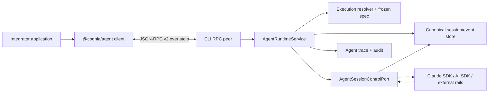
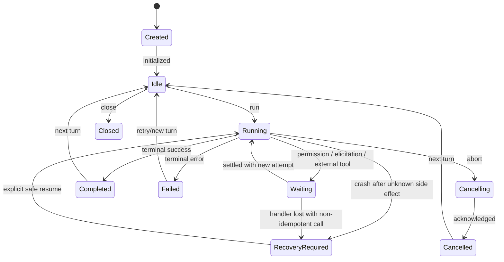

# Make `@cognia/agent` a production RPC-first external SDK

> **Superseded — 2026-08-23 by [ADR-0142](../content/docs/en/adr/0142-agent-sdk-two-layer-product.md).**
>
> This plan treated the SDK as one release. ADR-0142 splits it into a v0.1
> runtime client and a v0.2 authoring SDK, and reverses several statements here
> that the shipped code disproves. Read it for the historical gap analysis only;
> the following claims in this document are **not** true of the implementation:
>
> - **Reconnection.** No reconnect exists. A host crash ends the client; there is
>   no re-negotiation, no handler re-registration, and no cursor replay.
> - **Filesystem undo.** `session/compact/undo` restores an in-memory message
>   snapshot only, and `sandbox/snapshot` records a policy — neither is a
>   filesystem checkpoint. ADR-0142 keeps the two names separate.
> - **Attachments.** `AgentInput.attachments` is accepted by the client schema and
>   read by no host code path. Until asset references land it is refused with
>   `invalid_params`, not carried.
> - **Event delivery.** Replay and live delivery race, and concurrent `events()`
>   subscribers split one shared queue rather than each receiving the full stream.
>
> Protocol v2, the RPC-first boundary, and the host/client split stand unchanged.

| Field              | Value                                                                                                                           |
| ------------------ | ------------------------------------------------------------------------------------------------------------------------------- |
| Status             | Superseded by ADR-0142 (2026-08-23)                                                                                             |
| Author · Date      | Codex · 2026-08-11                                                                                                              |
| Scope              | `@cognia/agent`, `cognia-agent rpc`, agent runtime/session control, protocol, packaging, security, observability, documentation |
| Source             | User-approved SDK gap research and product-direction review                                                                     |
| Related            | ADR-0090; unified agent execution plan; headless parity plan                                                                    |
| Branch / Milestone | Current branch · Agent SDK 1.0 readiness                                                                                        |
| Reviewers          | Agent Runtime · CLI/Host · SDK/API · Security · Release/Docs                                                                    |
| Evidence state     | Current implementation confirmed locally; external SDK baselines retrieved 2026-08-11                                           |

> **Executive summary**
>
> - **Change:** Replace the unpublished embedded-runtime facade with a standalone, typed RPC client and make `cognia-agent rpc` the only public host boundary.
> - **Reason:** The current package cannot build, typecheck, pack, or execute several advertised controls; nine RPC methods are stubs and `steer` is a no-op.
> - **Impact:** The CLI owns runtime execution; the SDK owns protocol/client ergonomics; existing canonical execution, session, permission, sandbox, trace, and Team authorities are reused rather than rebuilt.
> - **Decision:** Ship only when the complete mature baseline is implemented: resumable HITL, tools/MCP/hooks, session branching, sandbox policy, tracing, crash recovery, and clean-room package verification.

## 1. The release target is a complete external SDK, not another runtime

The product boundary is **RPC-first**. `@cognia/agent` runs in the integrator's Node process and talks over a bidirectional JSON-RPC peer to a local Cognia host. The host owns model access, tool execution policy, persistence, credentials, and runtime adapters.

### Goals

| Goal             | Confirmed baseline                            | Release target                                                 | Acceptance evidence           |
| ---------------- | --------------------------------------------- | -------------------------------------------------------------- | ----------------------------- |
| Installability   | npm package absent; build fails               | Clean install on supported platforms                           | Packed-tarball consumer smoke |
| Contract honesty | Nine stubs; `steer` no-op                     | Zero success-shaped stubs/no-ops                               | Protocol conformance suite    |
| Runtime parity   | Public facade bypasses canonical handle       | RPC maps to canonical control/session authorities              | Adapter parity tests          |
| Extensibility    | No public tools, MCP, hooks, or guardrails    | Bidirectional registered callbacks and MCP lifecycle           | Deterministic custom-tool run |
| Durability       | Transcript persistence only on public surface | Resumable run/HITL state and replay cursor                     | Kill/restart/resume E2E       |
| Safety           | Default deny exists but is not injectable     | Fail-closed permissions, sandbox ceilings, secret/PII controls | Adversarial security tests    |
| Operability      | No SDK/RPC traces or health contract          | Bounded logs, traces, metrics, audit, health                   | Fault-injection assertions    |

### In scope

- A stable `@cognia/agent@1.0.0` client API and protocol v2.
- Bundled platform host discovery with an explicit host-path escape hatch.
- Full session lifecycle, event streaming/replay, model controls, compaction, branching, and import/export.
- Serializable permissions, elicitation, and external tool settlement.
- Custom tools, hooks/guardrails, MCP, plugins/skills, subagent controls, sandbox policy, traces, and eval fixtures.
- macOS arm64, Linux x64, and Windows x64 as the required v1 host matrix; unsupported platforms may supply `hostPath`.

### Non-goals

- Browser/Edge execution, realtime voice, or a hosted Cognia Agent service.
- A Pi-compatible API or wire protocol.
- Publishing an in-process Cognia runtime in v1.
- Duplicating the Workflow engine as a LangGraph-style arbitrary DAG inside the SDK.
- Global exactly-once guarantees for external side effects; the contract is at-least-once with stable identities and declared idempotency.
- Inline secrets or raw provider-request mutation hooks.

## 2. Current code proves the package boundary, not Agent capability, is the primary defect

| Claim                                                         | Status    | Source                                                 | Verification                                                                                   |
| ------------------------------------------------------------- | --------- | ------------------------------------------------------ | ---------------------------------------------------------------------------------------------- |
| The package build is not independently publishable            | Confirmed | `scripts/build/build-agent-sdk.mjs`                    | Build fails on the `@/` alias; only the root entry is emitted                                  |
| The RPC subpath cannot exist in the built package             | Confirmed | `packages/agent/package.json`, build script            | Export declares `dist/rpc/index.js`; build has one entry                                       |
| Published declarations would point outside the tarball        | Confirmed | `build-agent-sdk.mjs`                                  | `index.d.ts` re-exports `../src/index`, while `src` is not in `files`                          |
| The SDK has direct type errors                                | Confirmed | `packages/agent/src/runtime.ts`                        | Credential narrowing and permission responder mismatch                                         |
| Credentials are resolved but not provisioned                  | Confirmed | `createCogniaRuntime`, `CogniaSessionImpl.run`         | Secret is stored on the instance but absent from `UnifiedTurnParams`                           |
| Public controls are not truthful                              | Confirmed | `runtime.ts`, `rpc/server.ts`                          | `steer` discards input; model/thinking/compact/fork/HITL methods return stubs                  |
| Runtime/RPC behavior lacks tests                              | Confirmed | `packages/agent/src/*.test.ts`, `src/rpc/*.test.ts`    | Runtime test covers annotations; RPC test covers only framing helpers                          |
| Canonical capability/session/control primitives already exist | Confirmed | `AgentExecutionHandle`, `SessionStore`, ADR-0090 types | Capability gates, events, branching, export, controls, and identity are implemented internally |
| The multi-turn renderer handle is dormant                     | Confirmed | `openAgentSession`                                     | Comment and repository references show test-only use                                           |

The earlier `docs/research/pi-cognia-agent-gap-analysis-2026-08-05.md` is not an authority for implementation. It compares a different project under the name Pi and treats source-level equivalents as public SDK parity. The documentation work package must replace it with the verified benchmark used by this proposal.

## 3. The CLI host is the authority and the npm package is a dependency-light peer



> Figure 1: The changed boundary removes every `@/` import from the npm package; the CLI remains the only process that loads Cognia's runtime graph.

### Ownership

| Contract/data         | Producer/owner                                   | Validator                   | Consumers                      | Persistence/version                                    |
| --------------------- | ------------------------------------------------ | --------------------------- | ------------------------------ | ------------------------------------------------------ |
| Public client API     | `packages/agent`                                 | TypeScript + runtime guards | External Node applications     | Package semver                                         |
| RPC method map        | `packages/agent` protocol module                 | Generated guards + fixtures | Client and CLI server          | Protocol v2, additive minors                           |
| Execution policy/spec | `agent-config-types` + resolver                  | Existing spec guards        | Host service, session controls | Existing spec version                                  |
| Canonical events      | Runtime adapters                                 | Existing envelope guard     | Client stream, store, trace    | Envelope schema v1                                     |
| Session/run state     | CLI session store                                | Manifest/log validation     | Host service, replay, export   | Existing canonical version plus pending-action records |
| Permissions/sandbox   | Existing permission cascade and sandbox policies | Host boundary               | Tools, callbacks, runtimes     | Policy refs; no secrets                                |
| Traces/audit          | `agent-trace` and host audit                     | Redaction/shape validation  | Client exporter, operators     | Existing span shape, OTLP projection                   |

### Required internal refactor

Introduce a transport-neutral `AgentSessionControlPort` that describes the capability-gated operations already exposed by `AgentExecutionHandle`. The current renderer implementation remains an IPC adapter. The CLI adds a direct-host adapter over the live provider session and session store. Neither adapter re-resolves the frozen execution spec.

`AgentRuntimeService` owns session instances, leases, pending actions, event replay, and shutdown. It composes `runUnifiedTurn`; it is not a fourth runtime rail. The RPC server delegates only to this service and contains no provider-specific logic.

### Rejected alternatives

| Option                                            | Benefit                     | Cost/risk                                                                            | Decision           |
| ------------------------------------------------- | --------------------------- | ------------------------------------------------------------------------------------ | ------------------ |
| Bundle the current app graph into `@cognia/agent` | Smallest initial diff       | Broken declarations/dependencies, browser stubs, native coupling, poor embeddability | Rejected           |
| Extract an in-process runtime core first          | Best single-process latency | Largest refactor; exposes native/runtime dependencies to consumers                   | Deferred beyond v1 |
| Keep generic `call<T>(string)` as the main API    | Minimal client code         | No discoverability, invalid calls compile, protocol drift stays invisible            | Rejected           |
| Build a new SDK-specific agent loop               | Independent implementation  | Creates a fourth rail and duplicates security/session semantics                      | Rejected           |

## 4. The public TypeScript API is session-oriented and fully typed

The root package exports client APIs only. `./protocol` exports wire types and guards for advanced clients. The current public server export and `createCogniaRuntime()` are removed before the first published stable release.

The package ships ESM, CommonJS, declarations, and source maps from two entry points: `.` and `./protocol`. It is built with `tsup`, has no `@/` aliases, and declares every runtime dependency. Protocol validation uses a `valibot` schema map; TypeScript params/results are inferred from those schemas rather than duplicated by hand. The package engine is Node `>=20.19.0` and CI verifies Node 20, 22, 24, and 26.

```ts
export interface CogniaClientOptions {
  host?:
    | { kind: "bundled"; startupTimeoutMs?: number }
    | { kind: "path"; path: string; args?: string[]; cwd?: string; env?: Record<string, string> }
    | { kind: "streams"; readable: NodeJS.ReadableStream; writable: NodeJS.WritableStream }
  requestTimeoutMs?: number
  onDiagnostic?: (diagnostic: CogniaDiagnostic) => void
}

export interface CogniaClient extends AsyncDisposable {
  readonly runtime: RuntimeApi
  readonly models: ModelApi
  readonly sessions: SessionApi
  close(): Promise<void>
}

export interface CogniaSession extends AsyncDisposable {
  readonly id: string
  readonly spec: ResolvedAgentExecutionSpec
  run(input: AgentInput, options?: RunOptions): Promise<AgentTurnOutcome>
  events(options?: {
    afterEventId?: string
    signal?: AbortSignal
  }): AsyncIterable<AgentEventEnvelope>
  steer(input: AgentInput, options?: CommandOptions): Promise<CommandReceipt>
  followUp(input: AgentInput, options?: CommandOptions): Promise<CommandReceipt>
  abort(options?: CommandOptions): Promise<CommandReceipt>
  waitForIdle(options?: WaitOptions): Promise<SessionState>
  resolvePermission(
    requestId: string,
    decision: PermissionDecision,
    options?: CommandOptions
  ): Promise<CommandReceipt>
  resolveElicitation(
    requestId: string,
    response: ElicitationResponse,
    options?: CommandOptions
  ): Promise<CommandReceipt>
  setModel(model: string, options?: CommandOptions): Promise<CommandReceipt>
  setThinking(level: ThinkingLevel, options?: CommandOptions): Promise<CommandReceipt>
  setPermissionMode(mode: AgentPermissionMode, options?: CommandOptions): Promise<CommandReceipt>
  compact(options?: CompactOptions): Promise<CompactionResult>
  undoCompact(boundaryId: string, options?: CommandOptions): Promise<CommandReceipt>
  fork(options: ForkOptions): Promise<CogniaSession>
  clone(options?: CloneOptions): Promise<CogniaSession>
  state(): Promise<SessionState>
  messages(): Promise<CanonicalTurn[]>
  entries(options?: EntryPageOptions): Promise<EntryPage>
  export(): Promise<CanonicalSession>
  close(): Promise<void>
}
```

`createCogniaClient()` defaults to the bundled platform host, then fails with a typed `host_not_found` error containing searched locations. It never downloads executable code at runtime. Explicit `host.path` and injected streams remain available for development, alternative packaging, and conformance tests.

Host binaries are version-matched optional dependencies:

- `@cognia/agent-host-darwin-arm64`;
- `@cognia/agent-host-linux-x64`;
- `@cognia/agent-host-win32-x64`.

Discovery order is explicit `host.path`, matching optional host package, then `cognia-agent` on `PATH`. A discovered host must pass the protocol/version handshake; finding an executable is not treated as compatibility. The packages use the repository AGPL license, npm provenance, checksums, and no install-time network downloader.

### Run and suspended-state contract

`run()` returns a discriminated `AgentTurnOutcome`:

- `completed`, `failed`, `cancelled`, or `timeout` carries `AgentRunResultV1`;
- `requires_action` carries a serializable `SuspendedRunState` with pending permissions, elicitations, or external tool calls;
- resumption preserves `sessionId`, `runId`, and `turnId`, mints a new `attemptId`, and never replays an unknown/non-idempotent side effect automatically.

The existing `AgentRunResultV1` remains unchanged for internal/CLI compatibility. The public outcome wraps it rather than widening its status union.

## 5. Protocol v2 is a bidirectional, negotiated JSON-RPC peer

The transport remains newline-delimited UTF-8 JSON over stdio. Both sides may issue JSON-RPC requests: the application invokes host methods; the host invokes registered client tools/hooks. Diagnostics use stderr and never share stdout framing.

### Handshake and compatibility

1. Client sends `initialize` with client name/version, supported protocol versions, capabilities, and limits.
2. Host selects one version, returns host/CLI/runtime versions, method/capability catalogs, limits, and instance ID.
3. Client sends `initialized`; all other calls before this transition fail with `protocol_error`.
4. Major versions are incompatible. Minor additions are capability-negotiated; unknown event kinds are ignored and preserved.
5. SDK and host version skew produces a typed incompatibility error before a session/model call.

The current numeric protocol 1 is classified as a prototype. During canary it is available only with `--allow-legacy-rpc`; stub methods return `unsupported_capability`, never success. Stable clients speak v2 only, and legacy mode is removed before `@cognia/agent@1.0.0`.

### Method catalog

| Area           | Required v2 methods                                                                                                                                                                                                                                               |
| -------------- | ----------------------------------------------------------------------------------------------------------------------------------------------------------------------------------------------------------------------------------------------------------------- |
| Lifecycle      | `initialize`, `shutdown`, `runtime/status`, `runtime/capabilities`                                                                                                                                                                                                |
| Models/auth    | `model/list`, `model/refresh`, `auth/status`                                                                                                                                                                                                                      |
| Sessions       | `session/create`, `session/open`, `session/list`, `session/state`, `session/messages`, `session/entries`, `session/rename`, `session/tag`, `session/delete`, `session/export`, `session/import`, `session/fork`, `session/clone`, `session/tree`, `session/close` |
| Turns          | `turn/run`, `turn/steer`, `turn/followUp`, `turn/abort`, `turn/wait`                                                                                                                                                                                              |
| Controls       | `session/model/set`, `session/thinking/set`, `session/permissionMode/set`, `session/compact`, `session/compact/undo`                                                                                                                                              |
| Settlement     | `permission/respond`, `elicitation/respond`, `externalTool/respond`                                                                                                                                                                                               |
| Extensibility  | `tool/register`, `tool/unregister`, `hook/register`, `hook/unregister`, `mcp/configure`, `mcp/status`, `plugin/reload`, `skill/reload`                                                                                                                            |
| Tasks/sandbox  | `task/list`, `task/stop`, `task/background`, `sandbox/status`, `sandbox/snapshot`, `sandbox/restore`                                                                                                                                                              |
| Observability  | `trace/subscribe`, `trace/export`, `audit/query`                                                                                                                                                                                                                  |
| Host-to-client | Requests: `client/tool/invoke`, `client/hook/invoke`; notifications: `agent/event`, `tool/progress`, `runtime/diagnostic`                                                                                                                                         |

The source of truth is `rpcMethodSchemas`, a complete `Record<RpcMethod, { params: valibot.Schema; result: valibot.Schema }>` in the standalone protocol entry. `RpcMethodMap`, client signatures, dispatcher validation, and fixture validation derive from that map. Host-to-client requests use a separate but equivalent schema map. No dispatcher may accept a method absent from these maps, and every entry must have positive, invalid-params, typed-error, and version-skew conformance cases.

### Ordering, correlation, and limits

- Every command carries a caller-generated `commandId`; the host persists recent receipts and returns the original receipt on duplicates.
- Events remain at-least-once and dedupe by existing `eventId`. Replay uses opaque `afterEventId`, because envelope `sequence` resets per attempt.
- One active turn is allowed per session; multiple sessions may run concurrently within a host limit.
- Proposed defaults: 32 open sessions, 8 concurrent active turns, 16 MiB maximum frame, 10,000 replayed events per page, and a 32 MiB per-connection outbound buffer. Limits are reported in `initialize` and configurable downward by administrators.
- Crossing a hard buffer limit pauses producers where possible; otherwise the peer closes with `backpressure_exceeded` after persisting recoverable state.
- Control calls default to 30 seconds; host startup defaults to 15 seconds; `turn/run`, `wait`, and callback invocations have no implicit total timeout and use caller deadlines.

## 6. Tools, hooks, MCP, and HITL survive process boundaries

### Registered client callbacks

Custom tools and hooks are registered with a stable `handlerId`, JSON Schema, capability requirements, and side-effect classification:

```ts
type SideEffectClass = "none" | "idempotent" | "non-idempotent"

interface ClientToolRegistration {
  handlerId: string
  name: string
  description: string
  inputSchema: JsonSchema
  outputSchema?: JsonSchema
  sideEffect: SideEffectClass
  timeoutMs?: number
}
```

When the model calls a registered tool, the host persists the pending call and issues `client/tool/invoke` with `toolCallId`, `runId`, `attemptId`, validated input, and an idempotency key. The client returns a typed result/error and may emit bounded progress. Output passes the existing PII redaction and tool-result limits before it reaches a model.

If the client disconnects:

- `none` or `idempotent` work may be retried with the same tool/idempotency identity after the handler re-registers;
- `non-idempotent` or unknown work enters `requires_action`/`recovery_required`; it is never called again automatically;
- duplicate responses return the original receipt and cannot append a second tool result.

Hooks use the same reverse-request mechanism, but each hook declares whether timeout means continue, deny, or fail. Security/permission hooks are always fail-closed. Observational hooks may fail-open with a warning.

### Permissions and elicitation

Permission and elicitation requests are canonical persisted events with stable request IDs. A registered callback may settle immediately; otherwise `run()` returns `requires_action`. Approve, approve-always, reject, modified input, timeout, and cancel are represented explicitly. Historical approvals never become current approvals during replay.

### MCP and resources

The host owns MCP transports and credential resolution. The SDK configures servers by reference or secret-free transport description, queries connection/tool/resource/prompt status, and can reconnect/toggle servers. OAuth and secret material stay in the host credential store. MCP elicitation is projected into the same durable elicitation contract.

## 7. Lifecycle recovery follows mature SDK semantics without claiming impossible exactly-once behavior



> Figure 2: Automatic recovery stops at the first unknown or non-idempotent side effect; transcript recovery and side-effect recovery remain separate decisions.

### Recovery invariants

- The canonical append-only event log is authoritative; renderer/Zustand state is never recovery authority.
- Pending actions are persisted before their request is surfaced externally.
- A response receipt is persisted before a resumed model step is scheduled.
- Host restart reconstructs open sessions, unresolved actions, event cursors, and runtime bindings; it does not reconstruct an approval as allowed.
- Provider retries remain limited by the existing one-way side-effect boundary.
- Workspace snapshots apply only to Cognia-managed sandboxes. External tools own rollback of their external systems.
- Corrupt or partial log tails are truncated/reported according to the existing session-store recovery policy; loss appears in the resume fidelity report.

## 8. Security and privacy are enforced in the host, not trusted to the client

| Boundary/threat               | Control                                                                                             | Audit evidence                                      |
| ----------------------------- | --------------------------------------------------------------------------------------------------- | --------------------------------------------------- |
| Malicious/mismatched client   | Handshake, method/capability allowlists, schema validation, size/rate limits                        | Protocol rejection event without payload content    |
| Secret leakage                | Credential references only; allowlisted subprocess environment; redact diagnostics, traces, exports | Credential source/ref and redaction counters        |
| Prompt/tool PII egress        | Existing PII gate before model, embedding, MCP cloud, and callback-derived tool output              | Redaction decision span, never original secret text |
| Path traversal/symlink escape | Canonicalize in host; enforce workspace/read/write roots after symlink resolution                   | Denied path hash/category, not full sensitive path  |
| Process/network abuse         | Existing permission cascade and `SandboxResourcePolicy`; default deny for undeclared elevation      | Permission request/decision and sandbox policy ID   |
| Callback spoof/replay         | Negotiated handler registry, stable invocation ID, command receipt dedupe                           | Registration and settlement audit records           |
| Cross-session confusion       | Bind every request, callback, receipt, and cursor to host instance/session/run identity             | Mismatch rejection metric                           |
| Untrusted plugin/MCP          | Capability clamp, transport allowlist, credential isolation, timeout and teardown                   | Plugin/MCP lifecycle spans and status               |

The stdio host has no listening network socket. A future remote transport requires a separate proposal covering authentication, tenancy, TLS, quotas, and remote execution trust.

## 9. Observability and resource budgets are part of the release contract

| Signal                           | Bounded dimensions              | Release threshold / operator action                             |
| -------------------------------- | ------------------------------- | --------------------------------------------------------------- |
| `agent_sdk_host_start_total`     | platform, result, error code    | Any release-smoke failure blocks publish                        |
| `agent_sdk_rpc_request_total`    | method, result, protocol minor  | Unknown/stub success count must remain zero                     |
| `agent_sdk_rpc_duration_ms`      | method class, result            | Local control p95 under 1 second in conformance tests           |
| `agent_sdk_event_lag_ms`         | event kind class, host          | Local p95 under 250 ms excluding provider latency               |
| `agent_sdk_cancel_ack_ms`        | runtime family                  | p95 under 1 second; timeout forces host teardown/recovery state |
| `agent_sdk_pending_action_count` | action type, age bucket         | Warn at 100/session or oldest over 24 hours                     |
| `agent_sdk_replay_total`         | result, loss fidelity           | Any unexplained loss blocks rollout                             |
| `agent_sdk_callback_total`       | kind, side-effect class, result | Duplicate non-idempotent invocation is a release blocker        |
| `agent_sdk_buffer_bytes`         | direction, threshold bucket     | Hard limit closes peer into recoverable state                   |

Use existing `agent-trace` spans for run/turn/provider/tool/permission/subagent operations and add RPC/host spans as parents or links. Public trace subscription is opt-in, redacted, and excludes raw prompts/tool payloads by default. High-cardinality IDs remain in traces/audit, never metric labels.

## 10. Migration removes the prototype instead of carrying its false contracts forever

| Phase                 | Preconditions                      | Change                                                                                           | Verification                                        | Abort/rollback                                                   |
| --------------------- | ---------------------------------- | ------------------------------------------------------------------------------------------------ | --------------------------------------------------- | ---------------------------------------------------------------- |
| 0. Contain            | Proposal approved                  | Mark current SDK/RPC prototype; replace stub success with typed unsupported errors               | Existing tests plus regression tests for every stub | Revert behavior-only change; no stored-data effect               |
| 1. Contract           | Method map and public API reviewed | Build standalone client/protocol package; add v2 handshake and generated guards                  | Typecheck, package build, fixture conformance       | Keep unpublished; CLI v1 remains available                       |
| 2. Host core          | Contract frozen                    | Add `AgentRuntimeService` and direct `AgentSessionControlPort`; wire real run/events/abort/close | Fake-runtime integration and CLI smoke              | Disable v2 command path; canonical logs remain readable          |
| 3. Session parity     | Host core stable                   | Add model/thinking, steer/follow-up, compact/undo, branch/tree/import/export, event replay       | Session parity and crash-reopen matrix              | Disable affected capabilities in discovery                       |
| 4. Extensibility/HITL | Pending-action persistence landed  | Add custom tools/hooks, MCP lifecycle, durable permission/elicitation                            | Disconnect/re-register/restart E2E                  | Capability kill switches; preserve pending state                 |
| 5. Safety/durability  | Threat model approved              | Sandbox/workspace policies, callback idempotency, snapshots, recovery-required flow              | Adversarial and fault-injection suite               | Force default-deny/read-only; stop automatic resume              |
| 6. Operability        | Stable event/state contracts       | Trace/export/audit, metrics, limits, runbook, deterministic eval fixtures                        | SLO and leak/handle tests                           | Disable trace export; retain local audit                         |
| 7. Distribution       | All prior gates green              | Platform optional host packages, README/examples, bilingual docs, prerelease npm publish         | Clean-room install on three required platforms      | Unpublish/deprecate prerelease; no stable tag                    |
| 8. Stable cutover     | Canary has zero blockers           | Publish `@cognia/agent@1.0.0`; remove legacy v1 and embedded facade                              | Release certification and consumer E2E              | Deprecate stable version; host protocol capability rollback only |

No canonical session migration is required for existing completed turns. Pending-action records are additive and ignored by old readers. New clients must not send v2 sessions back through the prototype server.

## 11. Verification proves behavior at the owning layer and in a clean consumer

### Required behavior contracts

```text
Given a packed @cognia/agent tarball and supported host package
When a clean Node project installs and imports it
Then createCogniaClient starts the host, negotiates v2, runs a deterministic tool turn,
streams canonical events, closes every process/handle, and exits zero.

Given a permission or external tool request with no live client handler
When the client disconnects and the host restarts
Then the run is discoverable as requires_action with the same request/tool identity,
and settling it resumes with a new attempt without duplicating prior side effects.

Given an unsupported method or capability
When a client invokes it
Then the host returns unsupported_capability and never a success-shaped stub/no-op.

Given an active streamed turn
When AbortSignal aborts the SDK call
Then the client sends turn/abort, awaits acknowledgement, persists the terminal event,
and force-terminates the host only after the cancellation deadline.
```

### Test matrix

| Layer                   | Contract                                                    | Command/gate                                                                                                        | Required result                                      |
| ----------------------- | ----------------------------------------------------------- | ------------------------------------------------------------------------------------------------------------------- | ---------------------------------------------------- |
| Protocol unit           | Guards, mapping completeness, errors, negotiation           | `pnpm --dir packages/agent test`                                                                                    | 100% method catalog covered                          |
| Client/peer integration | Correlation, cancellation, backpressure, callbacks, cleanup | Package Jest suites                                                                                                 | No leaked timers/processes/listeners                 |
| Host integration        | Real service delegation, session/control parity             | `pnpm cli:test`                                                                                                     | All runtime families satisfy advertised capabilities |
| Agent regression        | Existing canonical runtime/store/control behavior           | Focused Jest suites                                                                                                 | No duplicate authority or format drift               |
| Security                | Paths, secrets, PII, replay, callback spoof, limits         | Focused adversarial suites                                                                                          | All fail closed with typed errors                    |
| Crash E2E               | Kill/restart/reconnect/replay/pending actions               | New CLI subprocess E2E                                                                                              | No silent data or side-effect duplication            |
| Package consumer        | Pack/install/import/run/dispose/types/exports               | New `packages/agent` pack test                                                                                      | Pass on Node 20, 22, 24, and 26                      |
| Platform host           | Binary discovery/start/run/shutdown                         | macOS arm64, Linux x64, Windows x64 CI                                                                              | All required artifacts certified                     |
| Repository gates        | Types, lint, coverage, CLI/package build                    | `pnpm typecheck`, `pnpm lint`, `pnpm test:coverage`, `pnpm cli:build`, `pnpm sdk:ts:build`, `pnpm sdk:ts:pack:test` | Green; changed governed files at least 90% coverage  |
| Documentation           | English/Chinese API parity and build                        | `pnpm docs:build` plus docs parity gate                                                                             | Examples compile against packed SDK                  |

Real-provider certification is optional and explicitly billable; release correctness uses deterministic Anthropic-compatible, AI SDK, and external-agent fixtures. Sandbox and native-binary claims must also run on their actual platform CI.

## 12. Work packages are independently reviewable and revertible

| Work package                   | Deliverable                                                               | Depends on | Owner role             | Independent verification              | Rollback seam                         |
| ------------------------------ | ------------------------------------------------------------------------- | ---------- | ---------------------- | ------------------------------------- | ------------------------------------- |
| WP-0 Contract containment      | No stubs/no-ops; corrected research; deprecation notice                   | None       | SDK/API owner          | Focused package/RPC tests             | Revert before protocol work           |
| WP-1 Standalone SDK package    | Client/protocol sources, build, declarations, package metadata, pack test | WP-0       | SDK/API owner          | Clean consumer compile/import         | Package remains unpublished           |
| WP-2 Bidirectional peer        | Negotiation, typed method map, reverse calls, limits, cancellation        | WP-1       | SDK/API + CLI owner    | In-memory peer integration            | Disable v2 entry                      |
| WP-3 Host service/control port | `AgentRuntimeService`, direct/IPC adapters, real discovery/run/lifecycle  | WP-2       | Agent Runtime owner    | Fake-runtime and CLI subprocess tests | Route CLI back to legacy command      |
| WP-4 Session parity            | Real controls, branching, compaction, replay, import/export               | WP-3       | Runtime/Session owner  | Cross-adapter parity suite            | Capability flags off                  |
| WP-5 Extensibility/HITL        | Tools/hooks/MCP, pending state, settlements, idempotency                  | WP-3, WP-4 | Runtime/Plugin owner   | Disconnect/recovery fixtures          | Disable registrations; preserve state |
| WP-6 Sandbox and recovery      | Policy projection, snapshots, crash recovery, recovery-required state     | WP-5       | Security/Runtime owner | Platform adversarial E2E              | Default deny/read-only kill switch    |
| WP-7 Observability/evals       | Traces, metrics, audits, budgets, deterministic conformance               | WP-3–WP-6  | Observability owner    | Fault-injection and SLO gates         | Disable exporters, retain core logs   |
| WP-8 Distribution/docs         | Platform host packages, npm workflow, README/examples, bilingual docs     | All        | Release/Docs owner     | Three-platform clean install          | Prerelease deprecation                |

Each work package includes co-located tests for governed source. No work package may add a public method whose implementation or conformance test is deferred to another package.

## 13. Primary risks have explicit containment

| Risk                                               | Likelihood / impact | Mitigation                                                                                      | Trigger / owner                                     |
| -------------------------------------------------- | ------------------- | ----------------------------------------------------------------------------------------------- | --------------------------------------------------- |
| Public surface grows faster than runtime parity    | High / High         | Capability-gated method map; no success stubs; phase-by-phase discovery                         | Any unimplemented advertised capability / SDK owner |
| Reverse callback duplicates external work          | Medium / Critical   | Side-effect classification, stable idempotency key, persisted receipts, recovery-required state | Duplicate invocation test or metric / Runtime owner |
| Host binary packaging becomes brittle              | Medium / High       | Platform optional packages, checksums/provenance, no runtime downloads, PATH escape hatch       | Platform smoke failure / Release owner              |
| Canonical store changes damage existing sessions   | Low / Critical      | Additive pending records, old-reader tests, backup/export before mutation                       | Loss/fidelity regression / Session owner            |
| SDK bypasses existing permission/PII authorities   | Medium / Critical   | Host-only enforcement and dedicated PII/security audit before release                           | Any bypass path / Security owner                    |
| Full-scope delivery turns into a long-lived branch | High / Medium       | Eight independently releasable internal phases; no stable npm release until all gates pass      | Phase exceeds reviewable diff / Engineering lead    |
| Event or trace buffers grow without bound          | Medium / High       | Negotiated hard limits, paging, persisted replay, backpressure close state                      | Buffer threshold / CLI owner                        |

## 14. Decisions and review record

### Decisions already approved

- **Q1 — Product boundary:** RPC-first external SDK. The TypeScript package is a client, not an embedded Cognia runtime.
- **Q2 — Release bar:** Complete mature baseline, not a minimal vertical slice marketed as stable.
- **Q3 — Durability:** Match mature SDK semantics: durable sessions/pending actions, safe-boundary restart, at-least-once delivery, stable idempotency; no impossible global exactly-once claim.
- **Q4 — Runtime ownership:** Reuse ADR-0090 execution/session/control authorities; do not add a runtime rail.
- **Q5 — Compatibility:** Treat the current RPC as an unpublished prototype; stable SDK supports negotiated v2 only.

### Review record

| Reviewer role | Conclusion         | Date       | Conditions                                                           |
| ------------- | ------------------ | ---------- | -------------------------------------------------------------------- |
| Product owner | Direction approved | 2026-08-11 | RPC-first; complete mature baseline; align with mature SDK semantics |
| SDK/API       | Pending            | —          | Public API and protocol method map                                   |
| Agent Runtime | Pending            | —          | Control-port extraction and recovery semantics                       |
| Security      | Pending            | —          | Threat model, callback idempotency, sandbox/PII gates                |
| Release/Docs  | Pending            | —          | Platform artifacts, npm provenance, support matrix                   |

### Scheduling TODOs

- [ ] Assign named owners and milestone dates for WP-0 through WP-8 — Owner: Engineering lead · Proposed DDL: 2026-08-14.
- [ ] Approve public TypeScript API and protocol v2 method map before implementation expands — Owner: SDK/API reviewer · Proposed DDL: 2026-08-21.
- [ ] Complete the security threat-model review before WP-5/WP-6 merge — Owner: Security reviewer · Proposed DDL: 2026-08-28.
- [ ] Confirm npm scope, provenance, signing, and platform-host artifact policy before prerelease — Owner: Release owner · Proposed DDL: 2026-09-04.

## Sources

### Repository evidence

- `packages/agent/src/runtime.ts`, `packages/agent/src/rpc/*`, `packages/agent/package.json`
- `cli/src/agent/runtime/*`, `cli/src/agent/session-store/*`, `cli/src/cli/rpc-command.ts`
- `lib/ai/agent/execution/agent-execution-handle.ts`, `agent-execution-service.ts`
- `packages/agent-config-types/src/agent-execution.ts`, `agent-run-result.ts`
- `docs/content/docs/en/adr/0090-unified-agent-execution-and-gateway-compatibility.md`

### External primary baselines, retrieved 2026-08-11

- Pi SDK and RPC: <https://github.com/earendil-works/pi/blob/main/packages/coding-agent/docs/sdk.md>, <https://github.com/earendil-works/pi/blob/main/packages/coding-agent/docs/rpc.md>
- OpenAI Agents SDK TypeScript: <https://openai.github.io/openai-agents-js/>, <https://openai.github.io/openai-agents-js/guides/human-in-the-loop/>
- Claude Agent SDK: <https://code.claude.com/docs/en/agent-sdk/overview>, <https://code.claude.com/docs/en/agent-sdk/typescript>
- Vercel AI SDK ToolLoopAgent: <https://ai-sdk.dev/docs/reference/ai-sdk-core/tool-loop-agent>
- LangGraph persistence and interrupts: <https://docs.langchain.com/oss/javascript/langgraph/persistence>, <https://docs.langchain.com/oss/javascript/langgraph/interrupts>
- Pydantic AI durable execution and deferred tools: <https://pydantic.dev/docs/ai/capabilities/durable_execution/overview/>, <https://pydantic.dev/docs/ai/tools-toolsets/deferred-tools/>
