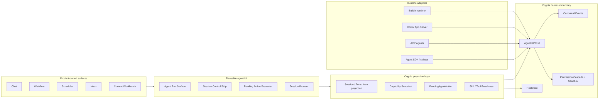
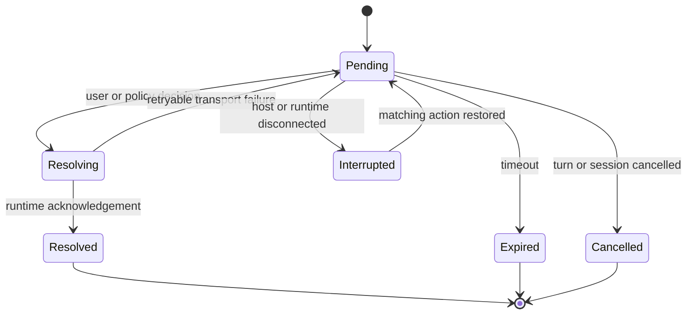
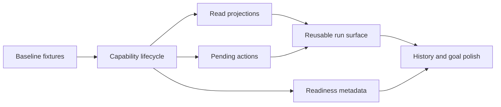

# Codex Open Harness Lessons and Cognia Adoption Plan

**Status:** Proposed  
**Date:** 2026-08-21  
**Owners:** Agent Platform, Desktop, Chat, Workflow, Security  
**Decision scope:** Cognia agent runtime contracts and reusable product surfaces  
**Related ADRs:** ADR-0048, ADR-0077, ADR-0090, ADR-0108, ADR-0116, ADR-0120

## 1. Executive summary

OpenAI has open-sourced the Codex agent harness and its integration surfaces: the CLI, SDK, App Server, security SDK/CLI, Skills, Plugins, and cloud-environment definition. The hosted Codex service, models, and IDE extension are separate products and are not all open source. The relevant lesson for Cognia is therefore not “adopt Codex as the runtime.” It is that a single harness can expose a stable session/turn/item protocol and let several products own their own UI, domain context, tools, and operational boundaries.

Cognia already has most of the difficult runtime machinery:

- Agent RPC v2 provides session, turn, tool, permission, hook, MCP, task, sandbox, trace, and audit methods.
- HostState provides host-authoritative coordination above the runtime protocol.
- The Codex App Server adapter, ACP clients, external-agent manager, event mapper, permission cascade, and replay/backpressure behavior already exist.
- Chat already has durable run visualization, tool activity, plans, cost/context indicators, goals, and external-session controls.
- The Skills parser already understands Codex `agents/openai.yaml` metadata.

The plan is to productize these foundations as Cognia's provider-neutral harness contract instead of adding another protocol or embedding the Codex harness into the frontend. The first release should deliver four outcomes:

1. A read-efficient, capability-driven Session → Turn → Item projection over Agent RPC v2.
2. One canonical pending-action contract and one reusable presentation layer for permissions, elicitations, and gates.
3. A reusable agent run surface and session control strip across Chat, Workflow, Scheduler, Inbox, and Context Workbench.
4. Discoverable capability, skill dependency, and tool readiness metadata that fails closed.

This plan deliberately preserves Cognia's existing multi-provider architecture, Goal model, permission cascade, sandbox, Plugin/MCP registries, and UI primitives.

## 2. Why this matters now

The Codex App Server contract makes several architectural choices explicit:

- the harness owns the agent loop and durable execution semantics;
- products own UI, supplied context, available tools, and operational policy;
- persistent clients consume a bidirectional protocol rather than importing runtime internals;
- capabilities and experimental lifecycle stages are discoverable;
- read APIs are separated from resume or execution APIs;
- approvals are scoped, resumable, and observable;
- dynamic tools, skills, hooks, apps, and plugins have explicit readiness states.

Cognia has independently converged on much of this design. The remaining problem is fragmentation at the product boundary: similar concepts are represented differently across built-in chat, external agents, teams, workflows, and goals. That makes new surfaces expensive and encourages provider-specific UI paths.

The opportunity is to finish the convergence without replacing working subsystems.

## 3. Evidence and confidence

| Finding                                                                                                          | Status    | Evidence                                                        |
| ---------------------------------------------------------------------------------------------------------------- | --------- | --------------------------------------------------------------- |
| Codex App, CLI, and IDE integration are powered by the same open harness                                         | Confirmed | OpenAI, “Codex as a platform”                                   |
| The open-source boundary includes CLI, SDK, App Server, Skills, Plugins, and security tooling                    | Confirmed | OpenAI open-source guide                                        |
| Codex models, hosted service, and IDE extension are not all open source                                          | Confirmed | OpenAI open-source guide                                        |
| App Server exposes session/thread, turn, item, approval, terminal, capability, skill, hook, app, and plugin APIs | Confirmed | OpenAI App Server documentation                                 |
| Cognia already has a broad provider-neutral runtime protocol                                                     | Confirmed | `packages/agent/src/rpc/protocol.ts`                            |
| Cognia already supports durable suspended actions, replay cursors, backpressure, compaction, and branching       | Confirmed | `cli/src/agent/rpc/runtime-service.ts`                          |
| Cognia already has a production Codex App Server adapter                                                         | Confirmed | `lib/ai/agent/external/codex-app-server-client.ts`              |
| Similar human-in-the-loop UI and state are implemented in several separate paths                                 | Confirmed | Chat, external-agent, team, and pending-gate components/stores  |
| A shared pending-action contract will reduce drift without requiring a runtime rewrite                           | Inferred  | Existing adapters already normalize events before UI projection |
| The shared contract can eventually become the only persisted gate journal                                        | Proposed  | Requires staged migration and compatibility telemetry           |

## 4. Borrowability matrix

| Codex concept                                         | Cognia today                                                     | Recommendation                                                                                    | Priority |
| ----------------------------------------------------- | ---------------------------------------------------------------- | ------------------------------------------------------------------------------------------------- | -------- |
| One harness, several product surfaces                 | Agent RPC and HostState exist, but product projections vary      | Make Agent RPC v2 the only provider-neutral harness boundary for new surfaces                     | P0       |
| Thread → turn → item protocol                         | Session/turn/event APIs exist; read projections are less uniform | Add read-only, cursor-paginated Session → Turn → Item projections without renaming stored domains | P0       |
| Bidirectional event stream                            | Existing replay cursor and backpressure                          | Preserve; add subscription filters and explicit event capability metadata                         | P1       |
| Capability and feature lifecycle discovery            | Capability snapshots and compatibility evidence exist            | Extend the existing snapshot with lifecycle stage, source, and requirements                       | P0       |
| Scoped approval requests                              | Several provider/runtime-specific dialogs and stores             | Introduce `PendingAgentAction` plus shared presentation primitives                                | P0       |
| Persistent rich-client session controls               | External-agent session panel exists                              | Generalize it into a capability-driven session control strip                                      | P0       |
| Dynamic tools restored with a session                 | Tool registration exists                                         | Persist descriptors only; require callback re-registration and fail closed                        | P1       |
| Skill dependency readiness                            | Codex YAML parser exists; dependencies mostly become warnings    | Normalize dependency readiness and reuse MCP/plugin inventories                                   | P1       |
| Accessible / enabled / callable app states            | Connector/plugin stores exist                                    | Adopt the three-state vocabulary in current catalogs and badges                                   | P1       |
| Goal metadata on a thread                             | Cognia has a richer Goal subsystem                               | Project existing goals into session APIs; do not create a Codex-shaped goal store                 | P1       |
| Read without resume                                   | Thread browser exists, runtime read semantics vary               | Add an explicit non-activating read mode                                                          | P1       |
| Pin, archive, lineage, source, runtime status filters | Some fields and controls exist                                   | Extend current thread/conversation browser filters                                                | P1       |
| Background terminal sessions                          | Tauri/sidecar command execution exists                           | Expose through existing sandboxed command abstractions only                                       | P2       |
| Hook start/complete events                            | Hooks and `hook_fire` exist                                      | Normalize hook lifecycle events and display them in existing activity UI                          | P2       |
| Provider-native review start                          | Review/diff boundaries exist                                     | Map into a provider-neutral review contract                                                       | P2       |
| Deprecated rollback API                               | Provider rollback adapter still exists                           | Do not expand; prefer checkpoints, branching, compact undo, or provider-native undo               | P2       |
| Codex marketplace/app directory                       | Cognia already has Plugins, Skills, MCP, and connectors          | Do not copy wholesale; reuse vocabulary and readiness semantics only                              | Skip     |
| Codex harness as Cognia's core runtime                | Would narrow multi-provider support and duplicate Agent RPC      | Do not adopt                                                                                      | Skip     |

## 5. Product principles

### 5.1 Product owns the experience; the harness owns execution

Chat, Workflow, Scheduler, Inbox, and Context Workbench should keep their domain-specific composition. They should consume the same execution projection rather than importing Codex-, ACP-, or Claude-specific clients.

### 5.2 Extend canonical contracts before adding adapters

Provider clients map native messages into Cognia contracts. Product code never branches on provider protocol message names. Provider-specific controls remain available only through declared capabilities.

### 5.3 Reuse state and presentation independently

A large, simultaneous store migration is unnecessary. First extract shared visual primitives and a canonical pending-action shape. Thin controllers may continue to use their current stores until telemetry proves that journal consolidation is safe.

### 5.4 Fail closed

Missing capability metadata, missing dynamic-tool callbacks, stale approval identifiers, unknown permission scopes, or unavailable dependencies must disable the action and explain why. They must never silently widen permissions or execute a side effect.

### 5.5 Preserve public Cognia terminology

Codex calls the durable container a thread. Cognia's public runtime contract already calls it a session. Add semantic aliases in documentation where useful, but do not rename databases, RPC methods, or product navigation merely to match Codex.

## 6. Target architecture



The projection layer is deliberately thin. It assembles read models and canonical UI inputs; it does not become another runtime, socket, or source of authority.

## 7. Canonical contracts

The following types describe intended semantics, not final generated API names.

### 7.1 Session → Turn → Item read projection

```ts
interface AgentSessionSummary {
  sessionId: string
  runtimeId: string
  sourceKind: AgentSessionSourceKind
  status: AgentSessionStatus
  title?: string
  parentSessionId?: string
  ancestorSessionId?: string
  pinned: boolean
  archived: boolean
  cwd?: string
  goalRef?: string
  capabilitySnapshotId: string
  updatedAt: string
}

interface AgentTurnSummary {
  turnId: string
  sessionId: string
  status: AgentTurnStatus
  startedAt: string
  completedAt?: string
  itemCount: number
  usage?: AgentUsageSummary
}

interface AgentItem {
  itemId: string
  turnId: string
  sequence: number
  kind: AgentItemKind
  payload: unknown
  createdAt: string
}
```

Required behavior:

- list/read methods use cursor pagination and stable ordering;
- read operations do not resume or activate a runtime unless explicitly requested;
- lineage, source, status, pinned, archived, cwd, and text-search filters are server-side;
- provider-native payloads remain available only in diagnostic envelopes, not primary UI contracts;
- canonical items are derived from the existing event journal or message parts, not stored twice without need;
- partial in-progress turns declare whether their current items are authoritative or best-effort.

### 7.2 Capability lifecycle

Extend the existing capability snapshot rather than create a second catalog:

```ts
type CapabilityStage = "stable" | "beta" | "under_development" | "deprecated" | "removed"

interface AgentCapabilityEvidence {
  support: "native" | "equivalent" | "unsupported"
  stage: CapabilityStage
  source: "runtime" | "signed_manifest" | "local_resolution"
  reason?: string
  requirements?: AgentCapabilityRequirement[]
}
```

Rules:

- signed manifest or live runtime evidence outranks optimistic local inference;
- `under_development` controls are hidden unless the user opts into experiments;
- `deprecated` controls remain readable but are not offered for new flows;
- an unknown capability is unsupported until proved otherwise;
- UI components receive resolved evidence, never raw provider version comparisons.

### 7.3 Pending agent actions

```ts
type PendingAgentActionKind =
  | "tool_permission"
  | "filesystem_permission"
  | "network_permission"
  | "elicitation"
  | "plan_gate"
  | "budget_gate"
  | "external_side_effect"

interface PendingAgentAction {
  actionId: string
  sessionId: string
  turnId?: string
  kind: PendingAgentActionKind
  lifecycle: "pending" | "resolving" | "resolved" | "expired" | "cancelled" | "interrupted"
  requestedScope: "turn" | "session" | "persistent_policy"
  allowedDecisions: PendingAgentDecision[]
  presentation: PendingAgentActionPresentation
  policyContext: PendingAgentPolicyContext
  createdAt: string
  expiresAt?: string
}
```



Rules:

- the runtime/controller owns settlement; the shared presenter owns layout and interaction conventions;
- scope grants are a subset of the policy engine's offered grants;
- reconnect restoration requires the same session, action identity, and policy fingerprint;
- duplicate decisions are idempotent;
- unsupported request fields appear in a diagnostic disclosure, not as silently ignored controls;
- external side effects require an explicit decision unless an existing user policy authorizes them.

### 7.4 Dynamic tool registration

Extend `tool/register` with session scope and restoration metadata:

- persist tool descriptors, JSON Schema, policy class, source, and version;
- never serialize executable callbacks or credentials;
- on resume, a descriptor is `unbound` until the host re-registers a compatible callback;
- calls to an unbound or version-mismatched tool fail closed with a recoverable error;
- tool registration and invocation remain visible in trace and audit APIs;
- reuse Plugin, MCP, workflow-tool, and built-in tool registries as sources.

### 7.5 Goal projection

Expose `goal/get`, `goal/set`, and `goal/clear` behavior as references to Cognia's existing Goal entities:

- session metadata stores a `goalRef`, not a copied goal body;
- token budgets and usage project existing Goal budget fields where compatible;
- status changes use the Goal service and its authorization rules;
- the current Goal console and status components remain authoritative;
- a runtime that supports only text objectives receives a lossy, declared projection.

## 8. Component and module reuse plan

| Target capability            | Reuse                                                                                                                                                     | Minimal extension                                                                       |
| ---------------------------- | --------------------------------------------------------------------------------------------------------------------------------------------------------- | --------------------------------------------------------------------------------------- |
| Embedded agent run surface   | `components/chat/run-panel.tsx`                                                                                                                           | Accept a provider-neutral run projection and compact/full layout modes                  |
| Tool timeline                | Existing components under `components/chat/message-parts/`: `tool-activity-group.tsx`, `tool-call-row.tsx`, `mcp-tool-card.tsx`, `terminal-tool-part.tsx` | Add canonical hook/action item renderers; no provider branching                         |
| Plan rendering               | `components/agent/external-agent/plan.tsx`                                                                                                                | Move to a runtime-neutral location or export through a neutral facade                   |
| Session controls             | `components/agent/external-agent/session-panel.tsx`                                                                                                       | Replace `runtime === "external"` gating with capability evidence                        |
| Context and cost             | `components/chat/context-usage-indicator.tsx`, `components/chat/session-cost-badge.tsx`                                                                   | Consume the canonical session summary and compaction events                             |
| Goal state                   | `components/goal/goal-status-pill.tsx` and current Goal console                                                                                           | Bind through `goalRef`; no new goal UI                                                  |
| Session discovery            | `components/agent/agent-thread-browser.tsx` and conversation filters                                                                                      | Add source, lineage, runtime status, pinned, archived, and search filters               |
| Run context                  | `components/context-workbench/panels/run-context-panel.tsx`                                                                                               | Embed the shared run surface where appropriate                                          |
| Permissions and elicitations | Existing chat/external/team dialogs, `components/ui/dialog.tsx`, `components/ui/button.tsx`, code display primitives                                      | Extract shared body, decision footer, scope selector, expiry, and diagnostic disclosure |
| Pending-action durability    | `stores/agent/pending-gates-store.ts`, `stores/agent/approval-journal-store.ts`, `stores/agent/ask-user-store.ts`                                         | Add adapters first; consolidate storage only after dual-read telemetry                  |
| Capability resolution        | `lib/ai/agent/execution/capability-snapshot.ts`, compatibility manifests                                                                                  | Add stage/source/requirements fields and selectors                                      |
| Codex transport              | `lib/ai/agent/external/codex-app-server-client.ts`                                                                                                        | Add missing read/capability methods behind the provider adapter only                    |
| Skill metadata               | `lib/skills/bundle/codex-yaml.ts`, bundle parser, current skill UI                                                                                        | Normalize dependency readiness and reuse MCP/plugin status                              |
| Runtime lifecycle            | `ExternalAgentManager`, Agent RPC runtime service, HostState                                                                                              | No new lifecycle manager                                                                |

New files are justified only for canonical contracts, neutral facades, and shared presentation primitives that cannot live in an existing module without creating a circular dependency. All edited source files follow Cognia's co-located test rule.

## 9. Detailed work packages

### WP0 — Baseline and contract inventory

**Depends on:** none  
**Owners:** Agent Platform, Architecture

- Record the current Agent RPC method and event inventory.
- Map every built-in, Codex, ACP, SDK, team, and workflow pending action to proposed canonical fields.
- Identify authority for session metadata, runtime status, item history, goal references, and policy decisions.
- Freeze golden compatibility fixtures before changing contracts.

**Success criteria**

- every proposed field has one named source of authority;
- every provider/runtime event has a mapping or an explicit unsupported reason;
- no planned field requires duplicating an existing database entity.

**Abort condition**

- two authorities cannot be reconciled without a new ADR.

### WP1 — Capability snapshot lifecycle

**Depends on:** WP0  
**Owners:** Agent Platform, Security

- Extend the existing capability evidence schema with lifecycle stage, source, and requirements.
- Populate it from runtime handshakes, signed manifests, and local execution resolution.
- Add selectors for visible, enabled, and experimental controls.
- Mark legacy provider rollback as deprecated.

**Success criteria**

- product components do not compare provider names or versions to decide whether a control exists;
- unknown capabilities fail closed;
- capability snapshots are traceable to evidence.

**Rollback**

- retain backward-compatible defaults for existing manifests; disable the new selectors with a feature flag.

### WP2 — Read-only Session → Turn → Item projection

**Depends on:** WP0, WP1  
**Owners:** Agent Platform, Storage, SDK

- Add cursor-paginated session, turn, and item read methods to Agent RPC.
- Support filters for runtime/source, status, lineage, pinned, archived, cwd, and search.
- Add a read-without-resume path.
- Derive item projections from the current event/message journal.
- Add TypeScript SDK bindings and compatibility fixtures.

**Success criteria**

- a client can browse and inspect a dormant session without activating its runtime;
- pagination has stable ordering under concurrent writes;
- partial turns declare consistency semantics;
- old clients continue to run unchanged.

**Rollback**

- methods are additive; hide new consumers and retain current session APIs.

### WP3 — Canonical pending actions and shared presenter

**Depends on:** WP0, WP1  
**Owners:** Agent Platform, Chat UI, Security

- Add `PendingAgentAction` and protocol adapters for built-in, Codex, ACP, team, and workflow gates.
- Extract reusable dialog body, decision footer, scope selection, expiry state, and diagnostic disclosure.
- Keep existing controllers/stores behind adapters in the first release.
- Add idempotent settlement and reconnect restoration tests.
- Add telemetry for duplicate, expired, stale, interrupted, and policy-denied decisions.

**Success criteria**

- all gate types render through shared presentation primitives;
- native provider semantics remain available through adapters;
- no grant can exceed the permission cascade's offered scope;
- stale and duplicate decisions never execute twice.

**Abort condition**

- a provider request cannot be represented without losing a security-relevant field. Extend the canonical envelope before proceeding.

**Rollback**

- each controller can switch back to its original presenter independently.

### WP4 — Reusable run surface and session control strip

**Depends on:** WP1, WP2, WP3  
**Owners:** Chat UI, Workflow UI, Desktop

- Generalize the external session panel into a capability-driven control strip.
- Compose the existing run panel, tool activity, plan, context, cost, and goal components into compact and full run surfaces.
- Mount the compact surface in one non-Chat pilot, recommended Context Workbench.
- Preserve domain-specific surrounding UI and navigation.

**Success criteria**

- the same session projection renders in Chat and the pilot surface;
- unsupported controls are absent or explain why they are disabled;
- no new provider-specific React branches are added;
- all user-facing strings are translated in both locales.

**Rollback**

- keep the existing Chat mount; disable the pilot and neutral facade separately.

### WP5 — Skill, app, and tool readiness

**Depends on:** WP1  
**Owners:** Agent Platform, Plugins, MCP

- Normalize `agents/openai.yaml` dependency declarations already parsed by Cognia.
- Resolve dependency status against MCP servers, plugins, connectors/apps, environment variables, and available tools.
- Adopt `accessible`, `enabled`, and `callable` as distinct product states.
- Expose reasons and remediation without auto-enabling or auto-installing dependencies.
- Add session-scoped dynamic-tool descriptors and rebind-on-resume behavior.

**Success criteria**

- users can tell why a skill or tool is unavailable before starting a run;
- missing credentials and callbacks fail closed;
- registration and invocation are auditable;
- existing Skill bundles remain compatible.

**Rollback**

- readiness is additive metadata; fall back to current warning behavior.

### WP6 — History, goals, hooks, review, and compaction polish

**Depends on:** WP2, WP4  
**Owners:** Chat UI, Agent Platform, Goal, Review

- Add session browser filters and lineage navigation.
- Project current Goal entities into session goal APIs.
- Normalize hook start/complete events into the tool/activity timeline.
- Map provider-native review start into the current review/diff boundary.
- Add explicit compaction events and before/after token metrics.
- Stop offering deprecated rollback for new integrations.

**Success criteria**

- dormant and active sessions have consistent browsing behavior;
- goal edits remain authoritative in the Goal subsystem;
- compaction effects are visible and measurable;
- review remains provider neutral.

## 10. Release sequence



### Phase A — Contract foundation

Deliver WP0 and WP1 behind backward-compatible schema defaults.

**Exit gate:** compatibility fixtures, type checks, and capability resolution tests pass for every supported runtime.

### Phase B — Read model and human-in-the-loop convergence

Deliver WP2 and WP3. Keep existing UI controllers as adapters.

**Exit gate:** dormant read, stable pagination, replay, reconnect, expiry, duplicate settlement, and policy-scope tests pass.

### Phase C — Product reuse pilot

Deliver WP4 in Chat plus Context Workbench. Do not fan out to every surface yet.

**Exit gate:** the same recorded session renders equivalently in both products; accessibility and both locales pass.

### Phase D — Ecosystem readiness

Deliver WP5 with no automatic installation or permission widening.

**Exit gate:** every dependency state has a reason, remediation, and audit evidence.

### Phase E — Broader rollout and cleanup

Deliver WP6, expand the run surface to Workflow, Scheduler, and Inbox, then retire duplicated presenters only after usage and failure telemetry are clean.

**Exit gate:** no active consumer remains on a retired presenter or legacy capability branch.

## 11. Security and failure behavior

| Failure                                    | Required behavior                                          | User-visible recovery                                           |
| ------------------------------------------ | ---------------------------------------------------------- | --------------------------------------------------------------- |
| Runtime disconnects with a pending action  | Mark interrupted; preserve identity and policy fingerprint | Reconnect and restore only on an exact match                    |
| Approval expires                           | Reject settlement and never execute                        | Explain expiry and offer a fresh request if runtime supports it |
| Duplicate approval submission              | Return the prior result idempotently                       | No duplicate side effect                                        |
| Capability is missing or stale             | Disable the action                                         | Show evidence source and refresh option                         |
| Dynamic tool descriptor has no callback    | Reject invocation                                          | Ask host to re-register; do not fall back to shell execution    |
| Skill dependency is inaccessible           | Keep skill non-callable                                    | Show the missing MCP/plugin/env/tool requirement                |
| Read projection cursor is unknown          | Return a typed cursor error                                | Refresh from the latest stable page                             |
| Provider payload contains unknown fields   | Preserve diagnostic envelope; do not infer permission      | Show unsupported-field disclosure where relevant                |
| Persistent scope is not authorized         | Offer only turn/session grants                             | Explain policy restriction                                      |
| Background command requests broader access | Route through Cognia sandbox and permission cascade        | Request scoped permission or fail                               |

The Codex `shellCommand` or terminal surface must never bypass Cognia's sandbox, permission cascade, audit log, or Tauri capability model.

## 12. Observability

Add structured metrics without logging prompts, credentials, or raw sensitive tool arguments:

- session read latency and non-activating read rate;
- event replay distance, unknown cursor count, and backpressure failures;
- capability source, stage, and mismatch count;
- pending-action time to decision, expiry, interruption, duplicate settlement, denial, and restore success;
- dynamic-tool bind failures and version mismatches;
- skill dependency states and remediation success;
- compaction before/after tokens and subsequent turn failure rate;
- shared run-surface render errors by product surface and runtime.

Trace correlation uses existing session, turn, action, tool-call, and audit identifiers. Diagnostic payloads remain redacted at current boundaries.

## 13. Compatibility and migration

- All new Agent RPC methods are additive.
- Existing clients ignore new capability evidence fields.
- Existing event types remain accepted while adapters emit canonical pending actions in parallel.
- UI migration is per controller and per product surface, guarded independently.
- Stored sessions are not renamed from threads or copied into a new schema.
- Existing Goal rows, Plugin/MCP inventories, tool registries, and permission policies remain authoritative.
- Codex-native APIs stay inside the Codex adapter.
- Provider rollback remains readable for compatibility but is deprecated for new UI and SDK flows.

A later store consolidation requires a separate migration plan only after dual-read telemetry proves that `pending-gates`, approval journal, and ask-user semantics can share persistence safely.

## 14. Verification strategy

### Contract and unit tests

- Agent RPC schema compatibility fixtures for old and new clients.
- Capability resolution precedence and lifecycle selectors.
- Cursor pagination under concurrent appends.
- Read-without-resume and partial-turn consistency.
- Every pending-action kind, lifecycle transition, scope restriction, idempotent settlement, timeout, disconnect, and restore path.
- Dynamic-tool descriptor restoration, callback rebinding, version mismatch, and fail-closed behavior.
- Skill readiness across missing MCP, plugin, environment, credential, and tool dependencies.
- Co-located component and module tests for every edited source file.

### UI tests

- Shared pending-action presenter accessibility, keyboard behavior, focus restoration, expiry, diagnostics, and both locales.
- Session control visibility from capability evidence, including experimental and deprecated states.
- Golden run projection rendered in Chat and Context Workbench.
- Session browser filters, lineage, archive, pin, and search.

### Repository gates

Run the smallest relevant checks during each work package and the full gates before rollout:

```bash
pnpm typecheck
pnpm lint
pnpm test:coverage
pnpm i18n:build
pnpm i18n:build:check
pnpm lint:i18n
pnpm lint:static-export
pnpm build
pnpm sdk:ts:build
pnpm sdk:ts:pack:test
pnpm sidecar:test
pnpm smoke:external-parity
```

Changes that cross the Tauri/Rust boundary additionally require focused Rust tests and a real Tauri smoke test. UI rollout requires browser verification of the affected user paths.

## 15. Decisions required before implementation

### D1. Canonical naming

**Recommendation:** keep `session` in public Cognia contracts and document Codex `thread` as an adapter term.

### D2. Item storage

**Recommendation:** derive items from the existing journal/message parts first. Add materialized projections only if measured read latency requires them.

### D3. Pending-action persistence

**Recommendation:** introduce the contract and shared presenter first; defer store consolidation until dual-read telemetry validates equivalent durability semantics.

### D4. First reuse pilot

**Recommendation:** use Context Workbench because it already exposes run context and can validate reuse without changing Chat's primary path.

### D5. Codex harness dependency

**Recommendation:** keep Codex as one adapter/runtime option. Do not make its SDK or App Server the core dependency of Agent RPC or frontend components.

## 16. Explicit non-goals

- Forking or vendoring the Codex harness.
- Replacing Agent RPC v2, HostState, or Cognia's multi-provider runtime.
- Creating a second Goal, Plugin, Skill, MCP, connector, tool, or permission subsystem.
- Rebuilding Chat as a generic Codex clone.
- Exposing raw provider messages directly to product UI.
- Allowing terminal, tool, or app execution outside Cognia's policy and sandbox boundaries.
- Expanding the deprecated Codex rollback API.
- Copying the Codex marketplace or app directory wholesale.

## 17. Source map

### Official Codex sources

- [Codex as a platform: build on the open agent harness](https://learn.chatgpt.com/blog/codex-as-a-platform)
- [Codex App Server](https://learn.chatgpt.com/docs/app-server)
- [Codex open source](https://learn.chatgpt.com/docs/open-source)

### Cognia architecture and implementation

- `docs/content/docs/en/adr/0048-codex-support-expansion.md`
- `docs/content/docs/en/adr/0077-tui-external-agent-hosting.md`
- `docs/content/docs/en/adr/0090-unified-agent-execution-and-gateway-compatibility.md`
- `docs/content/docs/en/adr/0108-codex-inspired-desktop-workflows.md`
- `docs/content/docs/en/adr/0116-host-authoritative-session-state.md`
- `docs/content/docs/en/adr/0120-deepseek-harness-managed-runtime.md`
- `docs/plans/2026-07-23-unified-agent-execution-gateway-compatibility.md`
- `docs/plans/2026-08-11-rpc-first-agent-sdk-productization.md`
- `packages/agent/src/rpc/protocol.ts`
- `cli/src/agent/rpc/runtime-service.ts`
- `lib/ai/agent/external/codex-app-server-client.ts`
- `lib/ai/agent/external/event-to-parts.ts`
- `lib/ai/agent/execution/capability-snapshot.ts`
- `packages/agent-config-types/src/compatibility-manifest.ts`
- `lib/skills/bundle/codex-yaml.ts`
- `components/chat/run-panel.tsx`
- `components/agent/external-agent/session-panel.tsx`
- `components/agent/agent-thread-browser.tsx`
