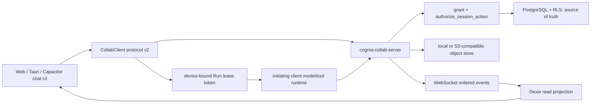
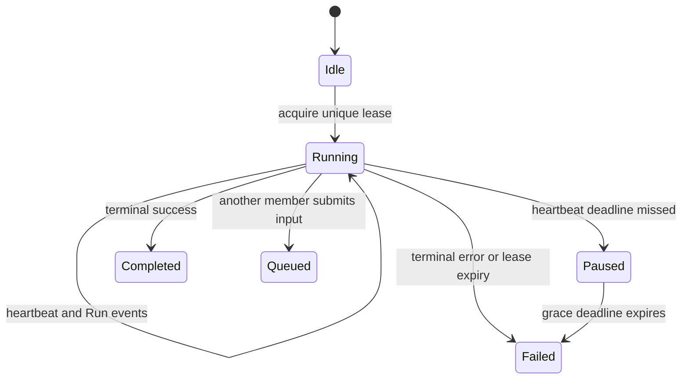

# Server-authoritative shared AI chat and session permissions

| Field              | Value                                                                                                                                |
| ------------------ | ------------------------------------------------------------------------------------------------------------------------------------ |
| Status             | Implemented; rollout disabled by default                                                                                             |
| Author · Date      | Cognia engineering · 2026-08-29                                                                                                      |
| Scope              | Next.js/Tauri/Capacitor UI, Dexie mirror, collaboration service, PostgreSQL/RLS, object store, Connector/Companion/Canvas boundaries |
| Source             | Product request: complete multi-person shared AI chat and permissions                                                                |
| Related            | ADR-0149, ADR-0054, ADR-0091, ADR-0133                                                                                               |
| Branch / Milestone | `dev` · shared chat protocol v2                                                                                                      |
| Reviewers          | Product, collaboration service, security, chat UX, mobile                                                                            |

> **Executive summary**
>
> - **Change:** Shared AI conversations are server-authoritative resources with explicit membership, append-only events, a single Agent Run lease, risk-based approvals, protected attachments, audit, and time-bound break-glass access.
> - **Reason:** Local `ChatSession`/`StoredMessage` records and device-wide Companion grants could not identify authors, revoke one collaborator, order concurrent writes, or prevent duplicate tool execution.
> - **Impact:** PostgreSQL migration `0008`, Dexie v207/v209 projections, collaboration protocol v2, shared run coordination, bilingual UI, and hardened Connector/Companion/Canvas boundaries.
> - **Decision:** Keep local conversations private by default; import full history only after explicit confirmation; execute the first release's Agent Run on the initiating client under a unique server lease.

## 1. Shared chat is a distinct consistency and trust plane

ADR-0149 established a server-readable collaboration plane but explicitly deferred sessions and messages. The implemented second cut does not make every local chat collaborative. A chat without `ChatSession.collaboration` remains local and private; a shared chat has a server session id, explicit roster, policy revision, and event cursor. Dexie is a cache, never an authority for access.

### Goals and acceptance

| Goal                        | Baseline                                                | Target                                                                          | Acceptance evidence                                       |
| --------------------------- | ------------------------------------------------------- | ------------------------------------------------------------------------------- | --------------------------------------------------------- |
| Non-member privacy          | Local ids could be guessed through coarse device grants | Private sessions are non-discoverable (`404`)                                   | cross-tenant/non-member service tests                     |
| Deterministic collaboration | No server message order                                 | Unique monotonic `sequence` and idempotent `operationId`                        | event/storage tests and reconnect compensation            |
| Exactly one Agent Run       | Every client could execute locally                      | One active lease per session; loss pauses then fails                            | lease competition and heartbeat tests                     |
| Immediate revocation        | Device grant was the practical principal                | session membership checked for every command and stream update                  | membership removal closes streams and revokes credentials |
| Content-safe moderation     | Edits overwrote local content                           | correction/redaction append events; ordinary projection exposes tombstones only | redaction projection and break-glass audit tests          |
| Cross-surface parity        | No shared chat product path                             | shared semantics in web, Tauri, and Capacitor renderer                          | shared components/hooks and Playwright projects           |

### In scope and non-goals

- In scope: private session membership, full-history import, messages, attachments, run leases, queued input, steer, approvals, audit, break-glass, and three-renderer UX.
- In scope: fail-closed Connector and Companion boundaries when a target is a shared mirror.
- Not supported: silently sharing an existing local conversation, offline queued sends/runs, automatic run takeover, group E2EE, or a new cloud model runtime.
- Separate trust models remain separate: public snapshot links, Agent Teams, terminal sharing, and same-person Companion pairing do not inherit chat permissions.

## 2. Current implementation centralizes authority in the collaboration service

| Confirmed fact                                     | Evidence                                                                                                       |
| -------------------------------------------------- | -------------------------------------------------------------------------------------------------------------- |
| Shared contracts and policy decisions are reusable | `packages/agent-config-types/src/shared-chat.ts`, `lib/collab/session-permissions.ts`                          |
| Service storage is tenant/workspace scoped         | `crates/cognia-collab-server/migrations/0005_shared_chat.sql`, `0008_shared_chat_control.sql`, `chat_store.rs` |
| Events are append-only and ordered                 | `chat_sessions.next_sequence`, unique session/sequence constraint, `append_session_event`                      |
| Shared data is a Dexie mirror                      | `lib/db/schema.ts` v207/v209 and `lib/db/collab-chat-mirror.ts`                                                |
| Runtime is local but coordinated remotely          | `lib/collab/shared-run-coordinator.ts` and `hooks/chat/use-claude-chat-controller.ts`                          |
| UI is wired to the active chat                     | `components/chat/shared-session-panel.tsx`                                                                     |
| Rollout is reversible                              | `COLLAB_SHARED_CHAT_ENABLED`, `NEXT_PUBLIC_SHARED_CHAT_ENABLED`, protocol v2 health/features                   |

> All cross-person state is validated and ordered by the service; the client owns model execution but cannot publish a Run event without the corresponding short-lived lease token.

### Invariants

1. A session has at least one owner; the last owner cannot leave or be demoted.
2. Workspace membership is an upper bound, not implicit session membership.
3. Guest membership is capped at `member` and never carries approver, export, audit, or break-glass capability.
4. Every write is bound to org, workspace, session, actor, `operationId`, and where mutable, `revision`.
5. Redacted content is absent from ordinary projections; raw access requires a valid break-glass grant and emits an audit event.
6. A lease token is stored only as a digest and is bound to user, device, session, Run, and expiry.

## 3. RBAC plus resource relationships and context is the chosen policy model

The implementation uses a small session role ladder, an orthogonal `approver` capability, workspace-role ceilings, stable action names, and contextual checks for message ownership, risk, and guest status. This follows the practical resource-override shape documented by [Discord permissions](https://docs.discord.com/developers/topics/permissions), Matrix's room-scoped state/event model in the [Client-Server API](https://spec.matrix.org/v1.19/client-server-api/), NIST's [ABAC definition](https://csrc.nist.gov/pubs/sp/800/162/upd2/final), and Zanzibar's relationship/consistency approach in [Google's paper](https://research.google/pubs/zanzibar-googles-consistent-global-authorization-system/).

| Option                            | Benefit                                             | Cost/risk                                                     | Decision                                 |
| --------------------------------- | --------------------------------------------------- | ------------------------------------------------------------- | ---------------------------------------- |
| Workspace role alone              | Few records                                         | over-grants every private chat and cannot model guests safely | rejected                                 |
| Client-computed permissions       | responsive UI                                       | forgeable and stale after revocation                          | rejected; UI hints only                  |
| Pure ACL per action               | flexible                                            | difficult to explain and migrate                              | rejected for v1                          |
| Session RBAC + approver + context | stable UX, explicit roster, supports ownership/risk | policy engine must be the single implementation               | chosen                                   |
| Cloud Agent Runtime               | survives initiator loss                             | new credential/model/tool trust boundary and cost             | deferred; compatible with lease contract |

### Permission contract

| Role/capability      |                  Read | Post/run | Correct/redact |                         Manage |                   High-risk approval |           Audit/break-glass |
| -------------------- | --------------------: | -------: | -------------: | -----------------------------: | -----------------------------------: | --------------------------: |
| viewer               |                   yes |       no |             no |                             no |                                   no |                          no |
| member               |                   yes |      yes |            own |                             no | if explicitly approver and not Guest |                          no |
| maintainer           |                   yes |      yes |            any |                            yes |                                  yes |                  audit only |
| owner                |                   yes |      yes |            any | yes, including transfer/delete |                                  yes |                  audit only |
| org admin with grant | no implicit discovery |       no |             no |                             no |                                   no | time-bound break-glass only |

`authorize_session_action(subject, action, resource, context)` returns `allowed`, a stable denial reason, and `policyRevision`. HTTP preserves the security distinction: `404` for non-discoverability, `403` for a known but forbidden action, `409` for revision/lease conflict, `410` for expired or consumed credentials, and `426` for pre-v2 clients.

## 4. Data, ordering, and lifecycle contracts prevent split brain

### Ownership matrix

| Contract/data              | Producer               | Validator/source of truth               | Consumer                    | Persistence/version   |
| -------------------------- | ---------------------- | --------------------------------------- | --------------------------- | --------------------- |
| session/membership/invite  | UI command             | collaboration service + PostgreSQL RLS  | roster UI and policy engine | migration 0005/0008   |
| message/run/approval event | member or lease holder | service sequence + action authorization | WebSocket/Dexie projection  | append-only events    |
| attachment metadata        | member                 | service + PostgreSQL                    | event/UI                    | migration 0008        |
| attachment bytes           | upload ticket holder   | hash, length, current membership        | short-lived download ticket | local/S3 object store |
| local projection           | sync reducer           | server sequence/policy revision         | all renderer surfaces       | Dexie v207/v209       |

### Import lifecycle

```mermaid
stateDiagram-v2
  [*] --> Private
  Private --> Importing: explicit confirmation
  Importing --> Importing: idempotent event/attachment retry
  Importing --> Active: atomic activation after complete upload
  Importing --> Private: abort; local source unchanged
  Active --> Archived: owner/maintainer action
  Active --> Deleting: owner confirmation
  Deleting --> Deleted: async body/object purge
```

The client first counts messages and attachments and warns that invitees can read the complete imported history. It creates an owner-only `importing` session, uploads deterministic operations and verified attachments, then changes status to `active`. A failed import leaves the local conversation unchanged and the server draft retryable.

### Sync and reconnect

HTTP owns commands and gap recovery; WebSocket owns low-latency increments. The reducer accepts only the next sequence. Any gap, reconnect, or policy change triggers HTTP recovery from the last cursor. Membership loss purges the local shared projection while leaving unrelated private chats untouched. Offline mode permits cached reading and drafts only; sending or starting a Run requires renewed user action after reconnect.

### Agent Run lifecycle

Only the initiator, owner, or maintainer may steer. Ordinary tools are approved by the initiator; high-risk, irreversible, or permission-expanding actions require owner, maintainer, or a non-Guest approver. Approval resolution uses revision comparison so double-clicks and competing approvers produce one terminal decision.

## 5. Failures recover without replaying user or tool intent

| Failure/skew                     | Detection                        | Behavior                                         | Recovery                               |
| -------------------------------- | -------------------------------- | ------------------------------------------------ | -------------------------------------- |
| duplicate command                | repeated `operationId`           | return original result                           | safe retry                             |
| event gap                        | non-consecutive sequence         | stop incremental apply                           | HTTP fetch after cursor                |
| stale mutation                   | base revision mismatch           | `409` + authoritative resource                   | refresh and explicit retry             |
| active Run exists                | lease uniqueness conflict        | queue input; do not execute                      | user cancels/steers or waits           |
| heartbeat loss                   | lease deadline                   | pause then fail                                  | no silent takeover                     |
| membership removal               | policy event/reauthorization     | close stream, revoke tickets, cancel queue/lease | re-invite explicitly                   |
| expired invite/ticket/delegation | timestamp or compare-and-consume | `410`                                            | issue a new credential                 |
| attachment mismatch              | byte length/SHA-256              | reject commit                                    | re-upload                              |
| old client                       | absent/protocol < 2              | `426`; shared routes unusable                    | upgrade client; private chats continue |
| feature rollback                 | either rollout flag false        | no new shared entry/writes                       | re-enable; stored data remains         |

## 6. Threat controls are enforced at every outbound boundary

| Threat                                 | Control                                                                       | Evidence                                                |
| -------------------------------------- | ----------------------------------------------------------------------------- | ------------------------------------------------------- |
| cross-tenant IDOR                      | org path must match grant; RLS transaction scope on every table               | migrations and `chat_store.rs`                          |
| guessed private session id             | membership join before discovery; uniform `404`                               | `visible` authorization boundary                        |
| forged frontend capability             | service policy engine on every command and stream policy change               | `chat.rs`, `chat_api.rs`                                |
| invite replay                          | token digest only; atomic pending-to-accepted transition                      | `chat_session_invites`                                  |
| duplicate tool execution               | one active lease, device/run token binding, no takeover                       | run lease store/coordinator                             |
| approval double-click                  | revision compare-and-consume                                                  | approval and Connector callback stores                  |
| redacted body leakage                  | tombstone projection; break-glass raw path only                               | `project_redacted_events`                               |
| attachment URL/token leak              | credentials in headers, single-use and short-lived; object key not serialized | attachment API/object store                             |
| Companion privilege widening           | shared membership revalidated; shared mirror writes refused locally           | `shared-session-access.ts`, `desktop-message-source.ts` |
| untrusted Connector principal          | unresolved subject fails closed; shared mirror local mutation blocked         | Connector runtime/bus/callback authorization            |
| unauthenticated Canvas participant ids | remote provider disabled without a resource-bound, unexpired ticket           | Canvas hook/provider                                    |

Logs and authorization audits contain ids, action names, revisions, reasons, and outcomes, never message bodies, invite tokens, email addresses, attachment URLs, or model/tool payloads. Normal deletion removes session content and objects asynchronously; audit retains metadata only.

## 7. Operational signals are bounded and actionable

| Signal               | Bounded dimensions        | Abort/SLO                                       | Operator action                      |
| -------------------- | ------------------------- | ----------------------------------------------- | ------------------------------------ |
| authorization denied | action, stable reason     | any cross-tenant allow is severity 0            | disable server flag; preserve audit  |
| event append failure | event kind, storage class | >1% for 5 minutes                               | stop canary; inspect DB/object store |
| WebSocket reconnect  | cause class               | p95 recovery >10 seconds                        | inspect ingress and ticket expiry    |
| sync lag             | fixed latency buckets     | p95 >5 seconds                                  | inspect event stream/backlog         |
| lease conflict       | result class              | informational unless duplicate execution occurs | inspect clients and lease expiry     |
| approval timeout     | risk class                | >5% high-risk requests                          | inspect approver UX/notification     |
| attachment failure   | stage, reason class       | >1% commits                                     | inspect object store/hash mismatch   |

Health advertises protocol version 2 and includes `shared-chat` only while the server gate is enabled. The kill switch removes shared routes and the client gate disables entry and mutation without deleting local or server data.

## 8. Additive migrations and two flags make rollback non-destructive

| Phase                | Entry condition                                     | Verification                                   | Abort/rollback                        |
| -------------------- | --------------------------------------------------- | ---------------------------------------------- | ------------------------------------- |
| schema dark launch   | migrations applied, both flags false                | RLS/constraint/storage tests                   | disable service; keep additive tables |
| internal canary      | protocol v2 clients, selected orgs                  | invite/history/revocation/lease/attachment E2E | turn off either flag                  |
| staged expansion     | zero authorization escapes and duplicate executions | latency/error/audit dashboards                 | stop expansion and disable writes     |
| general availability | web/Tauri/mobile critical paths green               | release gates and incident drill               | keep data; revert product entry only  |

There is no down migration in rollback. Old local sessions remain readable because collaboration fields are optional, old clients remain usable for private sessions, and newly written shared data is retained for later recovery.

## 9. Verification maps directly to the security contract

The user explicitly excluded coverage execution for this delivery; focused tests, type/lint/build, Rust, docs, and critical E2E remain required.

| Layer                 | Contract                                                                        | Command                                                                                           |
| --------------------- | ------------------------------------------------------------------------------- | ------------------------------------------------------------------------------------------------- |
| Rust unit/storage/API | RLS, role matrix, ordering, replay, lease, approval, redaction, break-glass     | `cargo test -p cognia-collab-server chat_`                                                        |
| TypeScript/Jest       | compatibility, Dexie migration/projection, sync, run, UI and boundary hardening | focused `pnpm test -- --runInBand …`                                                              |
| i18n/static           | EN/ZH parity and static export                                                  | `pnpm i18n:build:check`, `pnpm lint:i18n`, `pnpm lint:static-export`, `pnpm build`                |
| Rust quality          | format and warnings                                                             | `cargo fmt --all -- --check`, `cargo clippy -p cognia-collab-server --all-targets -- -D warnings` |
| E2E                   | invite/history, Guest, queue, approval, removal, attachment, offline recovery   | focused Playwright shared-chat projects                                                           |
| Docs                  | bilingual subsystem and ADR supplement                                          | `pnpm docs:build`                                                                                 |

Release is blocked by any cross-tenant authorization escape, stale access after revocation, unrecoverable event gap, duplicate tool execution, or failure of a critical renderer path.

## 10. Decisions and review record

### Resolved decisions

- **Q1:** local or cloud Agent Runtime? **Chosen:** initiating client under a server lease; no cloud runtime in protocol v2.
- **Q2:** share automatically or explicitly? **Chosen:** explicit full-history import with owner-only draft and atomic activation.
- **Q3:** one role ladder or ad-hoc ACL? **Chosen:** four session roles plus orthogonal non-Guest approver and contextual checks.
- **Q4:** optimistic offline writes? **Chosen:** cached reads and drafts only; sending/runs require online reconfirmation.
- **Q5:** destructive schema rollback? **Chosen:** additive schema plus dual kill switch; never drop shared data during rollback.

### Review record

| Reviewer role         | Conclusion                                              | Date       | Conditions                             |
| --------------------- | ------------------------------------------------------- | ---------- | -------------------------------------- |
| Product owner         | Approved through implementation request                 | 2026-08-29 | full implementation, not research-only |
| Security/architecture | Implementation evidence recorded in ADR-0149 supplement | 2026-08-29 | rollout disabled by default            |

## Sources

- `docs/content/docs/en/adr/0149-a-person-is-not-a-device.md`
- `crates/cognia-collab-server/src/chat.rs`
- `crates/cognia-collab-server/src/chat_api.rs`
- `crates/cognia-collab-server/src/chat_store.rs`
- `crates/cognia-collab-server/migrations/0005_shared_chat.sql`
- `crates/cognia-collab-server/migrations/0008_shared_chat_control.sql`
- `lib/collab/`
- `components/chat/shared-session-panel.tsx`
- [Discord permissions](https://docs.discord.com/developers/topics/permissions)
- [Matrix Client-Server API v1.19](https://spec.matrix.org/v1.19/client-server-api/)
- [NIST SP 800-162 ABAC](https://csrc.nist.gov/pubs/sp/800/162/upd2/final)
- [Zanzibar paper](https://research.google/pubs/zanzibar-googles-consistent-global-authorization-system/)
