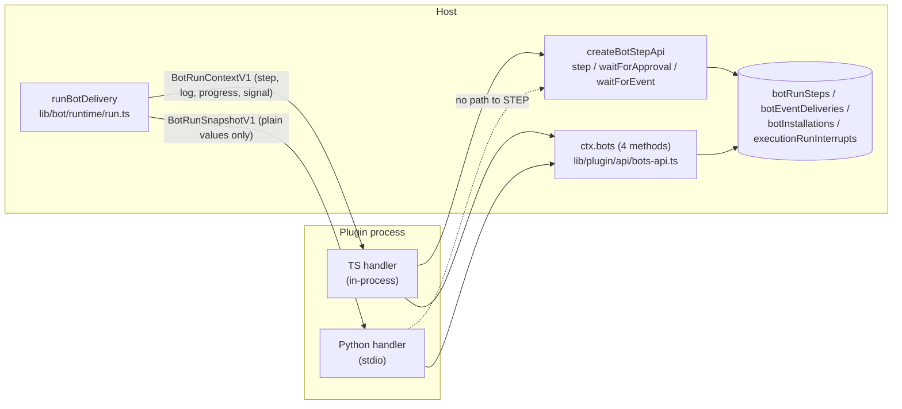
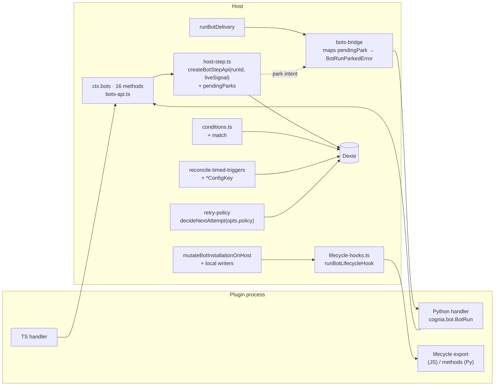

# The Bot plugin API reaches parity across processes and grows a declarative surface

| Field              | Value                                                                                                                                                                                                                                                                                                                                                       |
| ------------------ | ----------------------------------------------------------------------------------------------------------------------------------------------------------------------------------------------------------------------------------------------------------------------------------------------------------------------------------------------------------- |
| Status             | Approved 2026-09-15 (Q1–Q5 as recommended); implemented in working tree, not yet committed                                                                                                                                                                                                                                                                  |
| Author · Date      | Devin · 2026-09-15                                                                                                                                                                                                                                                                                                                                          |
| Scope              | `types/bot/**`, `types/plugin/plugin-bot.ts`, `lib/plugin/api/bots-api.ts`, `lib/bot/{runtime,events,schedule,control-writes}/**`, `lib/plugin/bridge/bots-bridge.ts`, `lib/plugin/core/validation.ts`, `lib/db/bot-event-deliveries.ts`, `lib/queue/retry-policy.ts`, `packages/plugin-sdk/{contract,src}/**`, `plugin-sdk/python/src/cognia/bot.py`, docs |
| Source             | User request: "扩展现在 bot 的插件 API，扩大自定义面，寻找缺口"                                                                                                                                                                                                                                                                                             |
| Related            | ADR-0174 (Bot control plane), ADR-0155 (plugins reach the host through one door), ADR-0145 (Python runtime refuses callbacks), ADR-0026 (plugin extension points), `docs/content/docs/en/plugin-dev/`                                                                                                                                                       |
| Branch / Milestone | current working tree · Bot plane v2                                                                                                                                                                                                                                                                                                                         |
| Reviewers          | plugin platform owner, Bot runtime owner, Python SDK owner                                                                                                                                                                                                                                                                                                  |
| Evidence state     | Every "Confirmed" row below was read from the working tree on 2026-09-15                                                                                                                                                                                                                                                                                    |
| Security impact    | New host calls are all scoped by `requireOwnedBotRun`; one new outbound fan-out (`emit`) and one new plugin code entry (lifecycle hooks)                                                                                                                                                                                                                    |

> **Executive summary**
>
> - **Change:** grow `ctx.bots` from 4 to 16 run-scoped host methods so a Python handler can drive durable steps, approvals, waits, logs and progress exactly as a TypeScript one does; add read/write host calls for trigger state, arming, deliveries, prior run results and cross-Bot events; extend the Bot definition with generic payload conditions, config-driven schedules, per-trigger retry, approval risk, and four lifecycle hooks; fix `agent-turn` prompt interpolation so `{{config.*}}` works as documented.
> - **Reason:** `types/bot/run.ts` and `plugin-sdk/python/src/cognia/bot.py` both document a `stepBegin/stepComplete/stepFail` host contract that does not exist. A Python Bot today re-executes all work on every re-entry and cannot ask for approval. The one real consumer (`plugins/github-devin-bot`, 3,055 lines) rebuilt a dedupe table, a cursor store and a publication index in `ctx.storage` because the host offers no query surface. Trigger conditions are GitHub-shaped, so any non-GitHub Bot starts a run for every event.
> - **Impact:** additive contract change (catalog namespace `bots` grows, no method removed), no Dexie schema version, one new error-free park path across stdio, one new manifest field family (`lifecycle`, `retry`, `match`, `*ConfigKey`) validated in `lib/plugin/core/validation.ts`, ADR-0174 amended.
> - **Decision:** Q1 park propagation across stdio (host-recorded intent, recommended), Q2 `emit` type namespacing, Q3 lifecycle hook failure semantics, Q4 permission gate stays `agent:control` (user pre-decided; `bots:*` deferred).

## 1. A Bot author can declare a Bot in Python but cannot run one durably, and a TypeScript author cannot query the plane they are writing to

### Context

**Situation.** ADR-0174 made the Bot plane reachable: six trigger kinds, four executors, a durable delivery queue, park-instead-of-block, and one contributed Bot (`plugins/cognia-scheduler-tools`) plus one substantial one (`plugins/github-devin-bot`). The plugin-facing surface is `PluginBotsAPI` in `types/bot/api.ts` with four methods, all gated on `agent:control`, plus the in-process `BotRunContextV1` (`step`, `log`, `progress`, `signal`).

**Complication.** Three classes of gap, all confirmed in code:

1. _Cross-process parity is broken._ `types/bot/run.ts:12-20` states the host side of a step is `stepBegin / stepComplete / stepFail` reached through `ctx.bots.*`. `plugin-sdk/python/src/cognia/bot.py:27-29` says "the durable-step surface it drives, `ctx.bots`, arrives with the Bot runtime". Neither exists: `lib/plugin/api/bots-api.ts` exports exactly `getInstallation`, `enqueue`, `cancelResource`, `recordMonitor`. The Python handler synthesised in `lib/plugin/bridge/bots-bridge.ts:115-132` receives a `BotRunSnapshotV1` and has no way to memoise, wait, log or report progress. This is the split ADR-0155 exists to prevent.
2. _No query or control surface for a running handler._ The only "query" is `cancelResource`, which mutates. Trigger state can be written only through `result.output.cursor` and only for the trigger that fired (`lib/bot/runtime/run.ts:158-176`). A Bot cannot disarm itself, cannot read a sibling run's `__host:result`, cannot fan out a custom event to another Bot (`dispatchBotRunToBots` emits only `run.completed`/`run.failed`). `plugins/github-devin-bot/src/monitor.ts` therefore keeps `dispatched:`, `included:`, `published:`, `exhausted:` and `monitor:` keys in `ctx.storage` and JSON-encodes a cursor into `monitor.cursor`.
3. _The declarative surface is GitHub-shaped._ `lib/bot/events/conditions.ts` reads `payload.pull_request`, `payload.issue`, `payload.check_run`, `payload.sender.login`. No generic path match exists. `agent-turn` prompt interpolation passes only the envelope (`lib/bot/runtime/executors/agent-turn.ts:34`) while the type comment promises config too. Schedule/poll intervals cannot be bound to a config key the way `repositoryConfigKey` is. Retry is the global `MAX_ATTEMPTS = 5` in `lib/queue/retry-policy.ts:9` with no per-trigger override. `BotApprovalRequestV1.risk` is accepted and never read (`rg risk lib/bot/runtime/step.ts` → 0 hits). A definition has no lifecycle hook, so it cannot register a remote webhook on install or clean up on uninstall.

**Question.** How does the plane grow its author-facing surface without a second engine, without a TypeScript/Python split, and without letting a plugin reach outside the run it owns?

**Answer.** Every new capability is a run-scoped plain-value host call on `ctx.bots` (so Python gets it for free), a declarative manifest field (so it is validated once and executed by the host), or a host-resolved lifecycle export (so it follows the same module-resolution path `handler` already uses). Nothing new is registered by callback.

### Goals

| Goal                                                                    |                Baseline (confirmed) |                                                 Target | Acceptance evidence                                                                                                                                                                                      |
| ----------------------------------------------------------------------- | ----------------------------------: | -----------------------------------------------------: | -------------------------------------------------------------------------------------------------------------------------------------------------------------------------------------------------------- |
| G1 Python handler drives durable steps, approvals, waits, log, progress |         0 of 5 primitives reachable |                           5 of 5, same semantics as TS | `bots-api.test.ts` + `bots-bridge.test.ts` prove a synthesized handler parks and re-enters with memoised steps; Python `test_bot.py` proves the context manager drives `stepBegin/stepComplete/stepFail` |
| G2 Handler reads and writes its own plane without `ctx.storage` shadows | 4 host methods, 0 read-only queries |                                16 methods, 4 read-only | `github-devin-bot` can drop the `dispatched:` key family in a follow-up (recorded as deferred, not in this change)                                                                                       |
| G3 Non-GitHub Bots filter declaratively                                 |    conditions cover 7 GitHub fields |                      generic `match` on envelope paths | `conditions.test.ts` covers Lark/Slack-shaped payloads                                                                                                                                                   |
| G4 `agent-turn` honours `{{config.*}}`                                  |                         yields `""` |                                 resolves scalar config | `agent-turn.test.ts`                                                                                                                                                                                     |
| G5 Per-installation schedule and per-trigger retry                      |                         global only |            `cronConfigKey`/`everyMsConfigKey`, `retry` | `reconcile-timed-triggers.test.ts`, `bot-event-deliveries.test.ts`                                                                                                                                       |
| G6 Approval `risk` reaches the decision surface                         |                             dropped |                   persisted on the interrupt, rendered | `step.test.ts`, attention panel test                                                                                                                                                                     |
| G7 Definition lifecycle hooks                                           |                                none | `onInstall/onConfigure/onArm/onUninstall`, JS + Python | `lifecycle-hooks.test.ts`, `lifecycle-host.test.ts`                                                                                                                                                      |
| G8 Contract and validation stay in lockstep                             |      catalog has 4 `bots.*` methods |                              16, generated TS + Python | `pnpm plugin:contract:check` green                                                                                                                                                                       |

### Scope and non-goals

- ✅ In scope: everything in the goals table; ADR-0174 amendment recording the new surface and resolving known limitation #3 as "deferred with a decision".
- ⏭️ Deferred but compatible:
  - `bots:read` / `bots:execute` as real permissions (ADR-0174 limitation #3). The user chose to keep `agent:control` for this change. Introducing the vocabulary later is additive: the catalog `requiredPermissions` arrays grow, `agent:control` remains accepted for one minor version.
  - `agent-turn` `systemPrompt` / `tools` allowlist / `maxSteps` / session reuse per resource. `runPluginAgentTurn` (`packages/plugin-sdk/src/api/agent-turn.ts:3-11`) accepts none of these; adding them is an engine change, which "a Bot is a binding" forbids from this proposal.
  - Migrating `github-devin-bot` off its `ctx.storage` shadows onto `listDeliveries`/`getRunResult`. Separate change with its own tests; this proposal only makes it possible.
  - A companion answering a Bot approval (ADR-0174 limitation #1). Unchanged.
- ❌ Not supported:
  - A `ctx.bots.registerHandler(fn)` callback form. ADR-0145/0155.
  - Cross-installation writes. Every method resolves through `requireOwnedBotRun(pluginId, runId)` and acts on that run's installation only. `emit` is the sole exception and it publishes an _event_, which the receiving installation's own trigger policy and loop guard still filter.
  - Handler-visible credentials. `getInstallation` reports slot _bound/unbound_, never account ids or sessions.

## 2. The runtime is complete and the plugin door is narrow; the gap is entirely in the door

### Evidence

| Claim                                                                                                                                   | Status    | Source                                                                                                                      | Verification                                                                                                         |
| --------------------------------------------------------------------------------------------------------------------------------------- | --------- | --------------------------------------------------------------------------------------------------------------------------- | -------------------------------------------------------------------------------------------------------------------- |
| `PluginBotsAPI` has 4 methods, all `agent:control`                                                                                      | Confirmed | `types/bot/api.ts:41-49`, `packages/plugin-sdk/contract/catalog.json:2537-2600`                                             | read                                                                                                                 |
| Step primitives documented but absent from host API                                                                                     | Confirmed | `types/bot/run.ts:12-20`, `plugin-sdk/python/src/cognia/bot.py:27-29`, `lib/plugin/api/bots-api.ts`                         | read; `rg stepBegin lib/plugin/api` → 0                                                                              |
| Python handler gets `BotRunSnapshotV1` only                                                                                             | Confirmed | `lib/plugin/bridge/bots-bridge.ts:115-132`                                                                                  | read                                                                                                                 |
| Park leaves the queue by throwing `BotRunParkedError` from inside the step API                                                          | Confirmed | `lib/bot/runtime/step.ts:76-86, 311, 400`; caught in `run.ts:392-420`                                                       | read                                                                                                                 |
| Live run signal is reachable by `runId`                                                                                                 | Confirmed | `lib/bot/runtime/run.ts:69-71 getLiveBotRunSignal`                                                                          | read                                                                                                                 |
| Trigger state written only from `result.output` for the firing trigger                                                                  | Confirmed | `lib/bot/runtime/run.ts:158-176 persistTimedTriggerState`                                                                   | read                                                                                                                 |
| Poll/derivedState envelope carries `cursor` / `previousEdgeValue`                                                                       | Confirmed | `lib/scheduler/executors/bot-executor.ts:105-108`                                                                           | read                                                                                                                 |
| Conditions are GitHub-shaped                                                                                                            | Confirmed | `lib/bot/events/conditions.ts:17-39`                                                                                        | read                                                                                                                 |
| `agent-turn` interpolates envelope only                                                                                                 | Confirmed | `lib/bot/runtime/executors/agent-turn.ts:33-35`, `lib/bot/events/envelope.ts:130-140`                                       | read                                                                                                                 |
| Retry policy has no per-caller options                                                                                                  | Confirmed | `lib/queue/retry-policy.ts:58-63`, `lib/db/bot-event-deliveries.ts:96,338`                                                  | read                                                                                                                 |
| `risk` unused in step runtime                                                                                                           | Confirmed | `rg -n risk lib/bot/runtime/step.ts lib/bot/runtime/run.ts` → 0                                                             | command                                                                                                              |
| Lifecycle mutations funnel through one host seam                                                                                        | Confirmed | `lib/bot/control-writes/lifecycle-host.ts:134-207 mutateBotInstallationOnHost`; local writers in `lifecycle.ts:147,214,281` | read                                                                                                                 |
| Trigger arming funnels through `setBotTriggerArmed` → `setBotTriggerArmedLocally` → `updateBotInstallation` → `syncBotTriggerSchedules` | Confirmed | `lib/bot/control-writes/index.ts:66-76`, `local.ts:67-90`, `lib/db/bot-installations.ts:98-103`                             | read                                                                                                                 |
| Read helpers exist for deliveries                                                                                                       | Confirmed | `lib/db/bot-event-deliveries.ts:522-557 getBotDelivery, listBotDeliveries, findBotDeliveryByCorrelation`                    | read                                                                                                                 |
| Python-backed proxy preserves only `message` and `stack`; no error `code`/`data` survive stdio                                          | Confirmed | `lib/plugin/bridge/_shared/python-backed-proxy.ts:102-107 wrapFailure`                                                      | read; this is why park crosses as host-recorded intent (D2), not as an error code                                    |
| Catalog compatibility baseline rejects removals/renames only; method additions pass                                                     | Confirmed | `scripts/plugin/generate-contract.mjs:31-63 validateApiSurfaceCompatibility`                                                | read                                                                                                                 |
| `DispatchBotEventResult.enqueued` gives `emit` its matched count                                                                        | Confirmed | `lib/bot/events/dispatch.ts:39-44`                                                                                          | read                                                                                                                 |
| No envelope payload size clamp exists anywhere on the Bot plane or integration events                                                   | Confirmed | `rg "MAX_.*(BYTES\|SIZE)\|byteLength" lib/bot lib/integrations` → 0                                                         | command; `emit` introduces `BOT_EVENT_PAYLOAD_MAX_BYTES` in `lib/bot/events/envelope.ts` and `enqueue` adopts it too |
| Manifest validation for bots lives in one function                                                                                      | Confirmed | `lib/plugin/core/validation.ts:3439-3660`                                                                                   | read                                                                                                                 |
| Catalog → TS/Python generated                                                                                                           | Confirmed | `scripts/plugin/generate-contract.mjs:12-24`, gate `pnpm plugin:contract:check`                                             | read                                                                                                                 |
| Sole substantial consumer                                                                                                               | Confirmed | `plugins/github-devin-bot/src/*.ts`, 3,055 lines incl. tests                                                                | `wc -l`                                                                                                              |

### Current flow



> Figure 1: the step surface is bound to the in-process context object; the only door a Python handler has is the 4-method `ctx.bots`, and none of those four is a step.

### Constraints and invariants

- A handler is re-entered from the top; `botRunSteps` is the memoisation store; step names starting `__host:` are reserved (`step.ts:120-124`).
- A wait leaves the queue by parking; a parked delivery still holds its concurrency key (`lib/db/bot-types.ts` on `parked`).
- The approval interrupt id is derived from `(runId, stepName)` (`step.ts:95-99`); content drift expires the prior interrupt and fails the step.
- Every `ctx.bots` call is scoped by `requireOwnedBotRun(pluginId, runId)`; no method takes an installation id from the caller.
- `botRunSteps` never crosses the companion plane; `botEventDeliveries` mirrors are fenced by `syncedFromHost` (ADR-0174).
- Python receives and returns plain JSON; no callback, no disposer, no `AbortSignal` (ADR-0145).
- The manifest is world-readable; nothing secret goes in a definition.

## 3. Grow the one door: plain-value host calls, declarative fields, and host-resolved lifecycle exports

### Alternatives

| Option         | Design                                                                                                                                                                                               | Benefits                                                                                           | Costs/risks                                                                                                                                                     | Decision                                                            |
| -------------- | ---------------------------------------------------------------------------------------------------------------------------------------------------------------------------------------------------- | -------------------------------------------------------------------------------------------------- | --------------------------------------------------------------------------------------------------------------------------------------------------------------- | ------------------------------------------------------------------- |
| A              | Add run-scoped plain-value methods to `ctx.bots`; Python SDK wraps them; park crosses stdio as host-recorded intent                                                                                  | One contract for both runtimes; reuses `createBotStepApi` and `getLiveBotRunSignal`; no new tables | `ctx.bots` grows to 16 methods; needs catalog + generated bindings                                                                                              | ✅ chosen                                                           |
| B              | Give Python a dedicated `ctx.botStep` namespace separate from `ctx.bots`                                                                                                                             | Smaller diff to existing namespace                                                                 | Two namespaces for one concept; TS authors would have `step` on ctx and Python authors a namespace, i.e. the split again                                        | rejected                                                            |
| C              | Stream the `BotRunContextV1` to Python over the existing streaming method channel and proxy callbacks                                                                                                | Python could receive `step.run(fn)`                                                                | Violates ADR-0145; a closure still cannot cross; disposer lifetime undefined on crash                                                                           | rejected                                                            |
| D (park)       | Python raises `BotRunParked`; bridge maps a preserved error code back to `BotRunParkedError`                                                                                                         | Explicit                                                                                           | Depends on `wrapFailure` preserving `code` and structured `data` across stdio (Open in evidence); a handler that swallows the exception would silently continue | rejected as sole mechanism, kept as a courtesy exception in the SDK |
| E (conditions) | Add a generic `match: Record<envelopePath, scalar \| scalar[]>` evaluated with `readEnvelopePath`                                                                                                    | Reuses the interpolation path resolver and its prototype guards; same missing-never-matches rule   | Authors must know the envelope shape; documented in plugin-dev                                                                                                  | ✅ chosen                                                           |
| F (conditions) | JSONPath / JMESPath expression                                                                                                                                                                       | Powerful                                                                                           | New dependency, new injection surface, untestable breadth                                                                                                       | rejected                                                            |
| G (lifecycle)  | `lifecycle` export resolved by `bots-bridge` from the same `entry` (JS) or extra methods on the same `@contribution` (Python); host invokes from `mutateBotInstallationOnHost` and the local writers | Same resolution path as `handler`; one registry entry; Python parity free                          | Plugin code now runs inside an admin mutation; needs timeout and failure semantics (Q3)                                                                         | ✅ chosen                                                           |
| H (lifecycle)  | Emit `bot.installed` etc. as Bot events and let the Bot subscribe with an `event` trigger                                                                                                            | Zero new code path                                                                                 | A run per lifecycle event, cannot veto install/config, needs the installation to already be armed                                                               | rejected                                                            |

### Proposed architecture



> Figure 2: the step machinery stays where it is; a thin host-step adapter makes it addressable by `runId`, and the bridge turns a recorded park intent into the same `BotRunParkedError` the in-process path throws.

### Decisions and rationale

| Decision                                                      | Chosen design                                                                                                                                                                                                                                         | Why                                                                                                                                                                       | Tradeoff                                                                                  |
| ------------------------------------------------------------- | ----------------------------------------------------------------------------------------------------------------------------------------------------------------------------------------------------------------------------------------------------- | ------------------------------------------------------------------------------------------------------------------------------------------------------------------------- | ----------------------------------------------------------------------------------------- |
| D1 Step primitives are three plain calls, not one `run`       | `stepBegin / stepComplete / stepFail`                                                                                                                                                                                                                 | Matches the contract already documented in `types/bot/run.ts`; a `run(fn)` cannot cross stdio                                                                             | Python SDK must wrap them into a context manager (it already promised to)                 |
| D2 Park crosses stdio as host-recorded intent                 | `waitForApproval/waitForEvent` return `{status:"parked", …}` **and** record `pendingParks.set(runId, BotRunParkedError)`; the bridge's synthesized handler checks the map after `proxy.run` settles (resolve or reject) and throws the recorded error | Does not depend on error-code fidelity through `wrapFailure`; a handler that ignores the park still parks, which is the correct outcome because the wait was not answered | A handler that keeps working after a park wastes that work; documented                    |
| D3 Host-side step calls use the run's live signal             | `getLiveBotRunSignal(runId)`; if absent → error `Bot run is not executing on this host`                                                                                                                                                               | A cross-process step must observe cancellation exactly where the in-process one does; a run not live here cannot be stepped from here                                     | A companion-mirrored run cannot be stepped, which is already the fence ADR-0174 sets      |
| D4 `getInstallation` grows instead of new getters             | add `definitionId, pinnedVersion, status, scope, triggers[{id,kind,armed}], credentialSlots[{id,optional,bound}]`                                                                                                                                     | One call already exists and is `idempotent:true`; adding fields is additive for JSON consumers                                                                            | Response grows; `publications` stays the only unbounded part and is already capped at 256 |
| D5 `writeTriggerState` writes `cursor`/`watermark` only       | reject `lastEdgeValue`, `lastFiredAt`, `debounceUntil`                                                                                                                                                                                                | Those are host-owned semantics (edge memory, debounce); letting a handler write them turns the edge trigger back into a level trigger                                     | A derivedState Bot still reports `edgeValue` through the result, as today                 |
| D6 `setTriggerArmed` goes through `setBotTriggerArmedLocally` | not `updateBotInstallation` directly                                                                                                                                                                                                                  | It re-evaluates `needs_setup`, writes `activatedAt`, and `updateBotInstallation` syncs schedules                                                                          | None; this is the existing seam                                                           |
| D7 `listDeliveries` never returns `payload`                   | summary rows only, `limit` clamped to 200, `syncedFromHost` excluded                                                                                                                                                                                  | Payload is untrusted and unbounded; the summary answers "is there work for resource X" which is the question the storage shadows answer today                             | A handler needing the payload re-reads its own record by `eventId`                        |
| D8 `getRunResult` requires same installation                  | `executionRuns.get(target).sourceId === installation.id`                                                                                                                                                                                              | Result output is stored verbatim; another installation's output is another tenant's data                                                                                  | None                                                                                      |
| D9 `emit` types are namespaced by plugin id                   | `type` must start with `${pluginId}.`                                                                                                                                                                                                                 | Prevents spoofing host types (`run.completed`) or another plugin's                                                                                                        | Authors write `myplugin.review.ready`                                                     |
| D10 `match` paths are envelope-rooted                         | evaluated with `readEnvelopePath` (prototype-guarded); scalar equality or membership; missing never matches                                                                                                                                           | One resolver for `concurrencyKey`, `correlationKey`, prompt templates and conditions                                                                                      | No wildcards/regex (rejected option F)                                                    |
| D11 Config keys for timed triggers                            | `cronConfigKey`, `timezoneConfigKey`, `everyMsConfigKey`; definition value is the fallback; `everyMs` floor 15 000 ms                                                                                                                                 | Mirrors `repositoryConfigKey`; fallback keeps an unconfigured install valid                                                                                               | Reconcile must re-run on config change (it already does via `updateBotInstallation`)      |
| D12 Per-trigger retry is a _narrowing_                        | `retry.maxAttempts ≤ 5`, `retry.baseDelayMs ≥ policy default`; `decideNextAttempt` gains optional `policy`                                                                                                                                            | The global policy is the ceiling ADR-0174 relies on to dead-letter a host-killing delivery                                                                                | A trigger cannot ask for more than 5 attempts                                             |
| D13 `risk` persists on the interrupt                          | `ExecutionRunInterrupt.approvalRisk?: "low"\|"medium"\|"high"` (additive optional field, no Dexie index)                                                                                                                                              | The attention panel can order and colour by it; the ceremony resolver reads it                                                                                            | Field addition without schema bump is safe because Dexie stores whole objects             |
| D14 Lifecycle hooks are exports, not events                   | JS: named exports `onInstall/onConfigure/onArm/onUninstall` from `lifecycle.entry ?? entry`; Python: same-named methods on the `@contribution` object                                                                                                 | Same resolution path as `handler`; can veto install/config                                                                                                                | Plugin code runs inside an admin mutation (Q3 governs failure and timeout)                |
| D15 Permission gate stays `agent:control`                     | all 16 methods                                                                                                                                                                                                                                        | User decision; ADR-0174 limitation #3 recorded as deferred with additive migration path                                                                                   | Coarser than ideal for read-only methods                                                  |

## 4. Contracts, state, and data

### Ownership

| Contract/data                                          | Producer                       | Validator                                                               | Consumer                                        | Persistence/version                                                                         |
| ------------------------------------------------------ | ------------------------------ | ----------------------------------------------------------------------- | ----------------------------------------------- | ------------------------------------------------------------------------------------------- |
| `PluginBotsAPI` (16 methods)                           | `lib/plugin/api/bots-api.ts`   | `requireOwnedBotRun`, method-level input checks                         | TS handlers, Python `cognia.bot.BotRun`         | catalog `apiNamespaces[bots]`, `introducedIn` bumped to current SDK version for new methods |
| `pendingParks: Map<runId, BotRunParkedError>`          | `lib/bot/runtime/host-step.ts` | —                                                                       | `bots-bridge.ts` synthesized handler            | in-memory; cleared in `runBotDelivery` `finally`                                            |
| `PluginBotTriggerConditions.match`                     | manifest                       | `validation.ts` (paths are `[A-Za-z0-9_.]+`, values scalar or scalar[]) | `conditions.ts`                                 | manifest                                                                                    |
| `cronConfigKey / timezoneConfigKey / everyMsConfigKey` | manifest                       | `validation.ts` (key exists in `configSchema.properties`)               | `reconcile-timed-triggers.ts`                   | manifest                                                                                    |
| `PluginBotTriggerBase.retry`                           | manifest                       | `validation.ts` (1 ≤ maxAttempts ≤ 5)                                   | `bot-event-deliveries.ts` → `decideNextAttempt` | manifest                                                                                    |
| `ExecutionRunInterrupt.approvalRisk`                   | `step.ts waitForApproval`      | type                                                                    | attention panel, ceremony resolver              | Dexie object field, no index, no version bump                                               |
| `PluginBotDefBase.lifecycle`                           | manifest                       | `validation.ts`                                                         | `bots-bridge.ts` → registry entry `lifecycle`   | manifest                                                                                    |
| `BotRegistryEntry.lifecycle?`                          | `bots-bridge.ts`               | —                                                                       | `lib/bot/control-writes/lifecycle-hooks.ts`     | registry (in-memory)                                                                        |

### Interface

```typescript
// types/bot/api.ts — additions. Every method is scoped by a live run the plugin owns.
export interface BotStepBeginResult {
  memoized: boolean
  /** Present when memoized. */
  value?: unknown
  /** Present when not memoized. */
  attempt?: number
}
export type BotWaitOutcome<T> =
  | { status: "settled"; value: T }
  /** The run must leave the queue. In-process callers never see this: they get BotRunParkedError. */
  | { status: "parked"; stepName: string; resumeAt: number; waitingFor?: string }

export interface BotTriggerSnapshot {
  id: string
  kind: PluginBotTriggerKind
  armed: boolean
}
export interface BotCredentialSlotSnapshot {
  id: string
  optional: boolean
  bound: boolean
}

export interface BotInstallationSnapshot {
  // existing fields unchanged …
  definitionId: string
  pinnedVersion: string
  status: "enabled" | "disabled" | "needs_setup"
  scope: { kind: "account" | "workspace" | "project"; workspaceId?: string; projectId?: string }
  triggers: BotTriggerSnapshot[]
  credentialSlots: BotCredentialSlotSnapshot[]
}

export interface BotDeliverySummary {
  id: string
  eventId: string
  triggerId: string
  type: string
  status: BotDeliveryStatus
  runId?: string
  resource?: BotEventResource
  correlation?: string
  receivedAt: number
  nextAttemptAt?: number
  attempts: number
}

export interface PluginBotsAPI {
  // existing four …
  // --- A. cross-process step parity ---
  stepBegin(runId: string, name: string): Promise<BotStepBeginResult>
  stepComplete(runId: string, name: string, value: unknown): Promise<void>
  stepFail(runId: string, name: string, error: string): Promise<void>
  waitForApproval(
    runId: string,
    name: string,
    request: BotApprovalRequestV1
  ): Promise<BotWaitOutcome<BotApprovalDecisionV1>>
  waitForEvent(
    runId: string,
    name: string,
    input: BotWaitForEventInput
  ): Promise<BotWaitOutcome<BotEventEnvelopeV1 | null>>
  log(
    runId: string,
    level: BotLogLevel,
    message: string,
    data?: Record<string, unknown>
  ): Promise<void>
  progress(runId: string, update: BotProgressUpdateV1): Promise<void>
  // --- B. plane read/write ---
  writeTriggerState(
    runId: string,
    input: { triggerId: string; cursor?: string; watermark?: number }
  ): Promise<void>
  setTriggerArmed(runId: string, input: { triggerId: string; armed: boolean }): Promise<void>
  listDeliveries(
    runId: string,
    query?: {
      resourceId?: string
      triggerId?: string
      status?: BotDeliveryStatus[]
      limit?: number
    }
  ): Promise<BotDeliverySummary[]>
  getRunResult(
    runId: string,
    input: { runId: string }
  ): Promise<{ status: ExecutionRunStatus; summary?: string; output?: unknown } | null>
  emit(
    runId: string,
    input: { type: string; payload: unknown; resource?: BotEventResource }
  ): Promise<{ matchedInstallations: number }>
}
```

```typescript
// types/plugin/plugin-bot.ts — additions
export type BotMatchScalar = string | number | boolean
export interface PluginBotTriggerConditions {
  // existing GitHub-shaped fields stay …
  /** Envelope-rooted dotted paths (e.g. "payload.event.type", "actor.kind") → required scalar or one-of list. */
  match?: Record<string, BotMatchScalar | BotMatchScalar[]>
}
export interface PluginBotRetryPolicy {
  maxAttempts?: number
  baseDelayMs?: number
  maxDelayMs?: number
}
interface PluginBotTriggerBase {
  /* … */ retry?: PluginBotRetryPolicy
}
export interface PluginBotScheduleTrigger {
  /* … */ cronConfigKey?: string
  timezoneConfigKey?: string
}
export interface PluginBotPollTrigger {
  /* … */ everyMsConfigKey?: string
}
export interface PluginBotDerivedStateTrigger {
  /* … */ everyMsConfigKey?: string
}
export interface PluginBotLifecycleDef {
  /** Module path; defaults to the handler's `entry` for a JS plugin. Ignored for Python. */
  entry?: string
  /** Hooks this definition implements. The host only resolves what is declared. */
  hooks: Array<"onInstall" | "onConfigure" | "onArm" | "onUninstall">
}
interface PluginBotDefBase {
  /* … */ lifecycle?: PluginBotLifecycleDef
}
```

```typescript
// types/bot/run.ts — lifecycle hook contract (plain values, both runtimes)
export interface BotLifecycleContextV1 {
  installation: BotInstallationSnapshot
  /** Present for onConfigure. */
  previousConfig?: Record<string, unknown>
  /** Present for onArm. */
  trigger?: { id: string; armed: boolean }
}
export type BotLifecycleHookV1 = (ctx: BotLifecycleContextV1) => Promise<void> | void
```

```python
# plugin-sdk/python/src/cognia/bot.py — wrapper the SDK hands to `run`
class BotRunParked(Exception): ...
class BotRun:
    def __init__(self, ctx, snapshot): ...
    @asynccontextmanager
    async def step(self, name: str):            # stepBegin → yield holder → stepComplete / stepFail
    async def wait_for_approval(self, name, request) -> BotApprovalDecision   # raises BotRunParked
    async def wait_for_event(self, name, key, timeout_ms) -> Optional[dict]   # raises BotRunParked
    async def log(self, level, message, data=None)
    async def progress(self, fraction=None, message=None)
```

The Python `@cognia.contribution` dispatcher wraps the incoming snapshot into `BotRun` when the contribution is a Bot handler. `BotRunParked` propagating out of `run` is fine and expected; the host does not rely on it (D2).

### State and lifecycle

```mermaid
stateDiagram-v2
  [*] --> running: runBotDelivery
  running --> stepping: ctx.bots.stepBegin (cross-process) / step.run (in-process)
  stepping --> running: stepComplete / stepFail
  running --> parked: waitForApproval / waitForEvent unanswered\n(in-process: throw; cross-process: pendingParks + {status:"parked"})
  parked --> running: delivery re-entered, steps memoised
  running --> completed
  running --> failed: throw / stepFail without completion
  running --> cancelled: signal aborted → next host call rejects BotRunCancelledError
```

Guards and semantics for the new host methods:

- **Ownership + liveness.** `own(runId)` = `requireOwnedBotRun(pluginId, runId)` then `getLiveBotRunSignal(runId)` must be defined; otherwise `Bot run is not executing on this host`. `getInstallation`, `listDeliveries`, `getRunResult` keep the current ownership-only check (they are safe on a settled run, and `github-devin-bot` calls `getInstallation` first thing).
- **`stepBegin`/`stepComplete`/`stepFail`** call `beginBotRunStep` / `completeBotRunStep` / `failBotRunStep` from `lib/db/bot-run-steps` and the journal helper extracted from `step.ts` (`journalBotStep`). `assertPublicStepName` is exported and applied. `stepComplete` on a step that was never begun in this run → error. `stepComplete` twice → idempotent no-op if the value is canonically equal, error otherwise (protects the memoisation key from drift, same rule as approval content drift).
- **`waitForApproval`/`waitForEvent`** build `createBotStepApi({ runId, signal: liveSignal, projectId, deps: { waitMode: "park" } })`, call the existing method, and translate: resolved → `{status:"settled"}`; `BotRunParkedError` → record in `pendingParks` and return `{status:"parked"}`; `BotRunCancelledError` → rethrow.
- **Bridge.** After `proxy.run(snapshot)` settles, `takePendingPark(runId)`; if present, throw it (even if `run` resolved). `runBotDelivery` clears the map entry in `finally`.
- **`writeTriggerState`** validates the trigger exists on the pinned definition and is `poll`/`derivedState`; delegates to `writeBotTriggerState`.
- **`setTriggerArmed`** delegates to `setBotTriggerArmedLocally` (the run is live here, so the route is local by construction). Disarming the trigger that owns the current run does not cancel the run; it stops future deliveries.
- **`listDeliveries`** → `listBotDeliveries({ installationId, … })` filtered in memory by `resourceId`/`triggerId`/`status`, `syncedFromHost` excluded, `limit` default 50, clamp 200, ordered by `receivedAt` desc.
- **`getRunResult`** → `executionRuns.get(target)`; require `kind === "bot"` and `sourceId === installation.id`; read `botRunSteps.get(\`${target}::__host:result\`)`; return `null` when the run is unknown _or_ belongs elsewhere (no existence oracle across installations).
- **`emit`** builds an envelope with `source: "bot"`, `type` (must match `^${pluginId}\.[A-Za-z0-9_.-]+$`), `actor: {kind:"bot", id: botId}`, `resource` from input, `provenance: provenanceForBotOutput({runId, installationId, cause: run.event})` (so `depth` increments and the loop guard applies), then `dispatchBotEvent({ envelope, query: { source: "bot", type } })`. Returns `{ matchedInstallations: result.enqueued.length }`. Payload is clamped at `BOT_EVENT_PAYLOAD_MAX_BYTES = 64 * 1024` (UTF-8 bytes of `JSON.stringify(payload)`), a new constant in `lib/bot/events/envelope.ts`; `enqueue` applies the same clamp so a self-enqueued and an emitted envelope obey one limit. No such limit exists today (confirmed), so this is the first; 64 KiB comfortably holds a GitHub webhook body and is far below IndexedDB row cost concerns.
- **Timed trigger config keys** are resolved in `syncBotTriggerSchedules` from `resolveBotConfig(...).values`; invalid cron or `everyMs < 15_000` → fall back to the definition value. There is no run to journal against at reconcile time, so the reconciler records the reason on `triggerState[triggerId].configFallback: string` (additive field on `BotTriggerRuntimeState`) and clears it when the config becomes valid; the console renders it as a badge. This is the only new persisted field on installations.
- **Retry.** `failBotDelivery`, `chargeAbandonedAttempt` and `recoverAbandonedBotDelivery` pass `{ policy: trigger.retry }` to `decideNextAttempt`, which clamps `maxAttempts` to `MAX_ATTEMPTS` and uses the larger of the caller's and default delays.
- **Lifecycle hooks.** `runBotLifecycleHook(resolved, phase, ctx)` in `lib/bot/control-writes/lifecycle-hooks.ts`: no-op when the registry entry has no `lifecycle[phase]`; otherwise invoke with a 30 s timeout (`AbortSignal.timeout` for JS; the Python proxy call already has the runtime's request timeout). Called from: `installBotFromCatalogLocally` (`onInstall`, before the row is written; throw aborts), `updateBotConfigLocally` (`onConfigure` with `previousConfig`, before write; throw aborts), `setBotTriggerArmedLocally` (`onArm`, before write; throw aborts), `uninstallBotInstallationLocally` (`onUninstall`, after schedules are removed and before the row is deleted; a throw is logged and never blocks removal — Q3). Remote-routed mutations already land on the owning host through `mutateBotInstallationOnHost`, so hooks run exactly once, on the host that owns the definition's plugin.

## 5. Failure, compatibility, and recovery

| Failure/skew                                                                 | Detection                                                                                                | User/system behavior                                                                                                      | Recovery                                                     | Test                                                |
| ---------------------------------------------------------------------------- | -------------------------------------------------------------------------------------------------------- | ------------------------------------------------------------------------------------------------------------------------- | ------------------------------------------------------------ | --------------------------------------------------- |
| Python handler calls `stepBegin` after the run was cancelled                 | `liveSignal.aborted`                                                                                     | host call rejects `BotRunCancelledError`; bridge maps to cancelled outcome                                                | none needed; delivery dismissed as cancelled                 | `bots-api.test.ts`                                  |
| Python handler ignores `{status:"parked"}` and keeps working                 | `pendingParks` has entry when `run` settles                                                              | bridge throws recorded `BotRunParkedError`; run parks; handler's extra work is not persisted unless it went through steps | re-entry replays steps                                       | `bots-bridge.test.ts`                               |
| Python handler raises `BotRunParked` but no park recorded (SDK bug / forged) | `pendingParks` empty                                                                                     | proxy error surfaces as ordinary failure → retry budget                                                                   | dead-letter after 5                                          | `bots-bridge.test.ts`                               |
| Host crashes between `stepBegin` and `stepComplete`                          | `beginBotRunStep` sees `running` step on re-entry                                                        | existing semantics: step re-runs, `attempt` increments                                                                    | same as in-process                                           | existing `bot-run-steps.test.ts`                    |
| `stepComplete` called with different value on re-entry                       | canonical inequality                                                                                     | error `Bot step value changed`                                                                                            | author fixes determinism                                     | `bots-api.test.ts`                                  |
| Old SDK (4-method contract) against new host                                 | catalog `introducedIn`                                                                                   | old plugins keep working; new methods simply absent from old generated bindings                                           | none                                                         | `plugin:contract:check` compatibility baseline      |
| New SDK against old host (paired remote host older)                          | method missing on host                                                                                   | `PluginHostCapabilityError`-style rejection already used by the python router for unknown methods                         | author checks `ctx.capabilities`                             | `host-request-router.test.ts`                       |
| `match` path resolves to object                                              | `readEnvelopePath` returns object                                                                        | never matches (same as missing)                                                                                           | author names a scalar leaf                                   | `conditions.test.ts`                                |
| `cronConfigKey` points at invalid cron in config                             | reconciler validation                                                                                    | falls back to definition `cron`, records `configFallback`                                                                 | console shows fallback; user fixes config                    | `reconcile-timed-triggers.test.ts`                  |
| `retry.maxAttempts` > 5 in manifest                                          | `validation.ts`                                                                                          | manifest rejected at load                                                                                                 | author lowers it                                             | `validation.test.ts`                                |
| `onInstall` throws / times out                                               | hook result                                                                                              | install aborted, no row written, error surfaced in `/bots` install dialog                                                 | user retries after fixing                                    | `lifecycle-hooks.test.ts`, `lifecycle-host.test.ts` |
| `onUninstall` throws                                                         | hook result                                                                                              | logged via `loggers.manager.error`, uninstall proceeds                                                                    | plugin storage may leak; visible in plugin storage inspector | `lifecycle-hooks.test.ts`                           |
| Plugin disabled while its Bot is installed; user uninstalls                  | registry has no entry                                                                                    | hooks are no-ops; uninstall proceeds                                                                                      | none                                                         | `lifecycle-hooks.test.ts`                           |
| `emit` type outside plugin namespace                                         | regex                                                                                                    | error                                                                                                                     | author renames                                               | `bots-api.test.ts`                                  |
| `emit` loop: Bot A emits, Bot B's trigger fires, B emits back                | `provenance.depth` increments via `provenanceForBotOutput`; loop guard + `allowSelfTriggering` unchanged | cut at depth cap                                                                                                          | none                                                         | `router.test.ts`, `provenance.test.ts`              |
| Local (Creator) definition with `lifecycle`                                  | `BotDefinitionRow` has no lifecycle field                                                                | not representable; type excludes it                                                                                       | —                                                            | type-level                                          |
| Companion-mirrored run calls `stepBegin`                                     | `getLiveBotRunSignal` undefined                                                                          | `Bot run is not executing on this host`                                                                                   | —                                                            | `bots-api.test.ts`                                  |

Compatibility windows: stored data unchanged except two additive optional fields (`ExecutionRunInterrupt.approvalRisk`, `BotTriggerRuntimeState.configFallback`); no Dexie version bump; rollback leaves both fields ignored.

## 6. Security, privacy, and permissions

| Boundary/threat                                           | Control                                                                                                                                                          | Audit/evidence                                                   |
| --------------------------------------------------------- | ---------------------------------------------------------------------------------------------------------------------------------------------------------------- | ---------------------------------------------------------------- |
| Plugin steps a run it does not own                        | `requireOwnedBotRun(pluginId, runId)` on every method                                                                                                            | existing `owned-run.test.ts`                                     |
| Plugin steps a run not live on this host (mirror)         | `getLiveBotRunSignal` liveness gate                                                                                                                              | new test                                                         |
| Plugin reads another installation's result                | `sourceId === installation.id`, `null` otherwise (no oracle)                                                                                                     | `bots-api.test.ts`                                               |
| Plugin spoofs host or other-plugin event types via `emit` | `^${pluginId}\.` prefix                                                                                                                                          | `bots-api.test.ts`                                               |
| Bot-to-Bot amplification                                  | `provenanceForBotOutput` depth + existing loop guard; `emit` payload clamp                                                                                       | `router.test.ts`                                                 |
| Handler learns credentials via `getInstallation`          | slots reported as booleans only                                                                                                                                  | `bots-api.test.ts` asserts no `integrationAccountId` in snapshot |
| Handler writes host-owned edge/debounce state             | `writeTriggerState` whitelist `cursor`/`watermark`                                                                                                               | `bots-api.test.ts`                                               |
| Untrusted payload reaches approval title                  | unchanged: `detail` is data, `title` is author text; `risk` is an enum                                                                                           | existing                                                         |
| Lifecycle hook runs plugin code inside admin mutation     | 30 s timeout; hooks receive `BotInstallationSnapshot` (no secrets); `onInstall/onConfigure/onArm` may veto, `onUninstall` may not block                          | `lifecycle-hooks.test.ts`                                        |
| Permission                                                | all methods `agent:control` (D15); catalog `consentTier: "policy"`, `risk` set per method (`emit`, `setTriggerArmed`, `writeTriggerState` = medium; reads = low) | `plugin:contract:check`                                          |
| PII                                                       | no new outbound model/embedding call; `log` goes through `runEventJournal`, which already redacts strings                                                        | existing journal tests                                           |

## 7. Observability and operations

| Signal                                                                                                                                                                                                | Dimensions                                                           | Threshold/SLO                                                       | Owner action                             |
| ----------------------------------------------------------------------------------------------------------------------------------------------------------------------------------------------------- | -------------------------------------------------------------------- | ------------------------------------------------------------------- | ---------------------------------------- |
| `step.started/completed/failed` journal events for cross-process steps                                                                                                                                | `runId`, `stepId`, `attempt`, `via: "host-call"` (new payload field) | none; timeline                                                      | operator inspects run in `/bots` cockpit |
| `run.waiting` with `stepId` for parks recorded via host call                                                                                                                                          | as today                                                             | park count per installation > 20/h suggests a handler ignoring park | check plugin logs                        |
| `bot.lifecycle.hook` journal on the installation (new `semanticRunEvent` type is not applicable, there is no run) → `loggers.manager.info/error` with `{pluginId, botId, phase, durationMs, outcome}` | bounded by phase enum                                                | hook duration > 10 s warn                                           | plugin author                            |
| `configFallback` on `triggerState`                                                                                                                                                                    | per trigger                                                          | any value present                                                   | console badge (i18n key added)           |
| `emit` matched count returned to caller and journaled as `step.progress {emitted: type, matched}`                                                                                                     | type namespaced, cardinality bounded by manifest                     | matched = 0 repeatedly indicates a misconfigured consumer           | author                                   |

## 8. Migration, rollout, and rollback

| Phase    | Preconditions     | Change                                                                                         | Verification                                                                                                                               | Abort/rollback                                              |
| -------- | ----------------- | ---------------------------------------------------------------------------------------------- | ------------------------------------------------------------------------------------------------------------------------------------------ | ----------------------------------------------------------- |
| 0        | proposal approved | ADR-0174 amendment section drafted                                                             | docs build                                                                                                                                 | n/a                                                         |
| 1 (WP-1) | —                 | host-step adapter, 7 parity methods, bridge park mapping, Python `BotRun`, catalog + generated | focused Jest, Python tests, `plugin:contract:check`                                                                                        | revert; no stored data touched                              |
| 2 (WP-2) | 1                 | 5 plane methods, `getInstallation` growth                                                      | focused Jest                                                                                                                               | revert                                                      |
| 3 (WP-3) | —                 | `match`, config keys, retry narrowing, `agent-turn` config interpolation, `approvalRisk`       | focused Jest; validation tests                                                                                                             | revert; `approvalRisk`/`configFallback` fields become inert |
| 4 (WP-4) | 1                 | lifecycle hooks JS + Python, host seam wiring                                                  | focused Jest                                                                                                                               | revert; installations unaffected                            |
| 5        | 1–4               | docs (`plugin-dev` en/zh), changeset (`minor`), full gates                                     | `pnpm test:coverage`, `typecheck`, `lint`, `lint:i18n`, `i18n:build:check`, `audit:colocated-tests`, `plugin:contract:check`, `docs:build` | —                                                           |

No feature flag: every addition is opt-in by the plugin (a method call or a manifest field). No backfill.

## 9. Verification and acceptance

### Behavior contracts

```text
Given a Python-backed handler Bot and a delivery
When the handler calls ctx.bots.stepBegin(runId, "fetch") twice across a host restart
Then the second call returns {memoized: true, value} without re-running
And botRunSteps has one row `${runId}::fetch` with status completed

Given the same handler calls ctx.bots.waitForApproval(runId, "publish", {...})
When no decision exists
Then the call returns {status: "parked", resumeAt, waitingFor}
And pendingParks has runId
And when `run` settles, the bridge throws BotRunParkedError and the delivery is `parked`
And executionRunInterrupts has `bot-approval:<sha>` with approvalRisk set

Given an installation whose trigger `poll` has everyMsConfigKey "intervalMs" and config {intervalMs: 5000}
When syncBotTriggerSchedules runs
Then the scheduler task interval is the definition everyMs
And triggerState.poll.configFallback === "everyMs below floor 15000"

Given a trigger with retry {maxAttempts: 2}
When its delivery fails twice
Then the delivery is deadletter after the second attempt

Given trigger conditions {match: {"payload.event.type": ["message", "reaction"], "actor.kind": "human"}}
When an envelope with payload.event.type "message" and actor.kind "bot" arrives
Then botConditionMismatch returns "match:actor.kind"

Given an agent-turn Bot with prompt "Review {{config.repository}} PR {{resource.id}}"
When run with config {repository: "a/b"}
Then the prompt sent is "Review a/b PR <id>"

Given a JS Bot declaring lifecycle.hooks ["onInstall"] whose onInstall throws
When a user installs it
Then installBotFromCatalogLocally rejects and no botInstallations row exists

Given ctx.bots.emit(runId, {type: "other.thing", payload})
Then it rejects with a namespace error
And with type "<pluginId>.thing" it dispatches with provenance.depth = cause.depth + 1
```

### Test matrix

| Layer         | Contract                                                    | Command                                                                                                                | Required result              |
| ------------- | ----------------------------------------------------------- | ---------------------------------------------------------------------------------------------------------------------- | ---------------------------- |
| Unit          | bots-api (16 methods), host-step, bridge park mapping       | `pnpm test -- lib/plugin/api/bots-api.test.ts lib/bot/runtime/host-step.test.ts lib/plugin/bridge/bots-bridge.test.ts` | green, ≥90% on changed files |
| Unit          | conditions, envelope interpolation with config, agent-turn  | `pnpm test -- lib/bot/events lib/bot/runtime/executors/agent-turn.test.ts`                                             | green                        |
| Unit          | reconcile config keys, retry narrowing                      | `pnpm test -- lib/bot/schedule lib/db/bot-event-deliveries.test.ts lib/queue/retry-policy.test.ts`                     | green                        |
| Unit          | lifecycle hooks                                             | `pnpm test -- lib/bot/control-writes`                                                                                  | green                        |
| Unit          | manifest validation                                         | `pnpm test -- lib/plugin/core/validation.test.ts`                                                                      | green                        |
| Python        | `BotRun` context manager, park exception, lifecycle methods | `cd plugin-sdk/python && python -m pytest tests/test_bot.py`                                                           | green                        |
| Contract      | catalog ↔ generated TS/Python, compatibility baseline       | `pnpm plugin:contract:check`                                                                                           | green                        |
| Types/lint    | —                                                           | `pnpm typecheck && pnpm lint`                                                                                          | green                        |
| i18n          | console badge + attention-panel risk label                  | `pnpm i18n:build && pnpm i18n:build:check && pnpm lint:i18n`                                                           | green                        |
| Coverage gate | —                                                           | `pnpm test:coverage` (final)                                                                                           | thresholds met               |
| Docs          | plugin-dev en/zh pages, ADR amendment                       | `pnpm docs:build`                                                                                                      | green                        |

### Unverified constraints

- The real Python subprocess round-trip (stdio) is exercised only through the mocked `createPythonBackedProxy` transport in Jest; a live smoke via a Python example plugin is manual.

## 10. Work plan, dependencies, and risks

### Work packages

| Package             | Deliverable                                                                                                                                                                                                                                                                      | Dependencies                          | Owner                 | Verification          | Rollback |
| ------------------- | -------------------------------------------------------------------------------------------------------------------------------------------------------------------------------------------------------------------------------------------------------------------------------- | ------------------------------------- | --------------------- | --------------------- | -------- |
| WP-1 Parity         | `lib/bot/runtime/host-step.ts` (adapter + `pendingParks` + exported `assertPublicStepName`, `journalBotStep`), 7 methods in `bots-api.ts`, bridge mapping, `types/bot/api.ts`, catalog + `pnpm plugin:contract` regen, Python `BotRun` + `BotRunParked` + dispatcher wrap, tests | —                                     | Bot runtime owner     | row 1, 6, 7 of matrix | revert   |
| WP-2 Plane calls    | `getInstallation` growth, `writeTriggerState`, `setTriggerArmed`, `listDeliveries`, `getRunResult`, `emit`, catalog, tests                                                                                                                                                       | WP-1 (shared `own()` liveness helper) | Bot runtime owner     | row 1, 7              | revert   |
| WP-3 Definition     | `match`, `*ConfigKey`, `retry`, `approvalRisk`, `agent-turn` config interpolation, `validation.ts`, `define_bot` parity in Python, `BotTriggerRuntimeState.configFallback`, console badge i18n, tests                                                                            | —                                     | plugin platform owner | rows 2, 3, 5, 6, 9    | revert   |
| WP-4 Lifecycle      | `PluginBotLifecycleDef`, registry `lifecycle`, `bots-bridge` resolution (JS export / Python methods), `lifecycle-hooks.ts`, wiring in 4 local writers, validation, tests                                                                                                         | WP-1 (python proxy method list)       | plugin platform owner | rows 4, 5, 6          | revert   |
| WP-5 Docs + release | ADR-0174 amendment, `plugin-dev` en/zh Bot pages, changeset `minor`, full gates                                                                                                                                                                                                  | WP-1..4                               | Devin                 | rows 8–11             | —        |

### Risks and mitigations

| Risk                                                                                                                      | Likelihood/impact | Mitigation                                                                                                                                                                          | Trigger/owner |
| ------------------------------------------------------------------------------------------------------------------------- | ----------------- | ----------------------------------------------------------------------------------------------------------------------------------------------------------------------------------- | ------------- |
| Host-side step API built from `getLiveBotRunSignal` diverges from the run's own instance (two `createBotStepApi` per run) | medium / medium   | both instances are stateless over Dexie rows; the only in-memory state is `pendingParks`, owned by host-step; add a test that interleaves in-process and host-call steps on one run | WP-1          |
| `pendingParks` leak when a Python process dies mid-run                                                                    | low / low         | cleared in `runBotDelivery` `finally`; entry keyed by runId so a re-entry overwrites                                                                                                | WP-1          |
| Lifecycle hooks slow down admin mutations                                                                                 | medium / low      | 30 s timeout, hooks optional and declared                                                                                                                                           | Q3            |
| `match` encourages authors to filter on untrusted payload fields for authorization                                        | medium / medium   | plugin-dev docs state conditions are routing, not authorization; approvals remain the gate                                                                                          | WP-5          |
| Python SDK's courtesy `BotRunParked` exception is invisible to the host (only `message` crosses)                          | certain / none    | by design (D2): the host never reads it; documented so nobody later "fixes" the bridge to depend on it                                                                              | WP-1          |

## 11. Decisions and review record

### Decisions required

- **Q1 Park propagation across stdio.** Options: (a) host-recorded intent + bridge check (D2); (b) error-code mapping only. — **Recommendation: (a)**, because it does not depend on error fidelity and yields the correct outcome even for a handler that ignores the park. The SDK still raises `BotRunParked` for ergonomics.
- **Q2 `emit` type namespace.** Options: (a) enforce `${pluginId}.` prefix; (b) free-form with a reserved-prefix denylist. — **Recommendation: (a)**; a denylist has to be maintained every time the host adds a type.
- **Q3 Lifecycle hook failure semantics.** Options: (a) `onInstall/onConfigure/onArm` veto, `onUninstall` never blocks; (b) all hooks advisory; (c) all hooks veto. — **Recommendation: (a)**; a Bot that cannot validate its config should refuse the config, and a user must always be able to remove a Bot.
- **Q4 Permission gate.** Pre-decided by the user: keep `agent:control`. `bots:read/execute` recorded as deferred with additive path. Reviewers confirm.
- **Q5 `everyMs` floor.** 15 000 ms proposed (poll cadence below that on a laptop host is a battery and rate-limit problem). Alternatives: 5 000 or 60 000. — **Recommendation: 15 000**.

### Review record

| Reviewer | Conclusion | Date | Conditions/TODO |
| -------- | ---------- | ---- | --------------- |
|          |            |      |                 |

### TODO

- [x] `wrapFailure` preserves only `message`/`stack` → D2 stands; SDK exception is courtesy only — closed 2026-09-15
- [x] `validateApiSurfaceCompatibility` checks removals only → additions pass — closed 2026-09-15
- [x] `DispatchBotEventResult.enqueued.length` is the matched count — closed 2026-09-15
- [x] No payload clamp exists → `BOT_EVENT_PAYLOAD_MAX_BYTES` introduced in `envelope.ts`, shared by `enqueue` and `emit` — closed 2026-09-15
- [ ] Reviewers answer Q1–Q5 — Owner: reviewers · DDL: before WP-1 starts

## Sources

- `types/bot/{api,run,event}.ts`, `types/plugin/plugin-bot.ts`, `types/plugin/plugin.ts:1148-1152, 2585`
- `lib/plugin/api/bots-api.ts`, `lib/plugin/api/bot-integration-binding.ts`
- `lib/bot/runtime/{run,step}.ts`, `lib/bot/runtime/executors/{types,handler,agent-turn}.ts`
- `lib/bot/events/{conditions,envelope}.ts`, `lib/bot/sources/bot-run.ts`
- `lib/bot/schedule/reconcile-timed-triggers.ts`, `lib/scheduler/executors/bot-executor.ts`
- `lib/bot/control-writes/{index,local,lifecycle,lifecycle-host}.ts`
- `lib/db/{bot-types,bot-installations,bot-event-deliveries}.ts`, `lib/queue/retry-policy.ts`
- `lib/plugin/bridge/bots-bridge.ts`, `lib/plugin/bridge/_shared/python-backed-proxy.ts`
- `lib/plugin/core/validation.ts:3439-3660`
- `packages/plugin-sdk/contract/catalog.json:2537-2600`, `scripts/plugin/generate-contract.mjs`
- `plugin-sdk/python/src/cognia/bot.py`
- `plugins/github-devin-bot/src/monitor.ts`, `plugins/github-devin-bot/plugin.json`
- `docs/content/docs/en/adr/0174-the-bot-control-plane.md`
