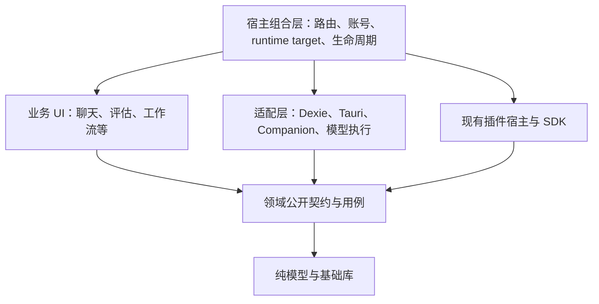

# Cognia 微前端与模块边界研究

日期：2026-10-04。状态：讨论稿，未实施架构迁移。

用户明确的首要目标是**降低模块耦合，让开发和维护更容易**。本文结合当前工作树的源码审查、静态导入统计、现有边界检查和[外部一手资料研究](./sources.md)形成判断。新建日期化报告用于保存本次观察，不覆盖既有 ADR，也不把旧 ADR 的数字当成当前事实。

## 结论与判断条件

Cognia 可以采用微前端，但当前更合适的方向是：**保留统一应用交付，强化领域模块边界，沿用插件体系处理可选扩展；有明确独立交付需求的领域，再选择性增加运行时组合。**

原因在于，用户的目标首先需要控制“谁可以依赖谁、谁拥有状态和生命周期”，而微前端主要增加独立构建、交付与组合的能力。若各微应用继续共享内部 Zustand store、Dexie 表结构和宿主运行时单例，维护耦合仍然存在，还会增加版本协调、加载失败和跨应用调试成本。这是本次架构判断，不是已经测出的性能收益。[single-spa 对共享状态的建议](https://single-spa.js.org/docs/recommended-setup/)

如果后续出现多个团队需要独立上线、某个领域需要替换技术栈、或必须接入独立旧应用，选择会改变。当前没有团队规模、实际变更耗时、缺陷归因或构建基准，不能承诺投资回报或排期。

## 四类边界不能混为一谈

| 边界             | 判断方式                                                            | Cognia 的优先级        |
| ---------------- | ------------------------------------------------------------------- | ---------------------- |
| 业务边界         | 一个领域的规则、数据和操作由谁负责，其他领域依赖什么契约            | 最高                   |
| 代码与编译边界   | 是否只能访问公开入口，能否独立检查，源码是否仍进入同一个 TS program | 高                     |
| 部署边界         | 能否不重新发布宿主就更新某个模块，如何保证版本兼容                  | 暂无明确需求           |
| 运行时与安全边界 | 是否共享 JS realm、DOM、原生权限，谁能终止谁                        | 对第三方视图有明确价值 |

`dynamic import` 可以推迟加载，workspace package 可以整理依赖，iframe 可以隔离浏览上下文；三者都不自动等同于完整微前端架构。微前端也不要求拆仓库。

## 当前源码的观察

### 1. Cognia 已经有模块化基础

- `pnpm-workspace.yaml` 实际包含 root、docs、web、mobile、cli、browser-extension、`packages/*` 和 workspace-runtime；不能沿用 AGENTS.md 中“只有两个包”的结构描述。
- 本次统计 `packages/*/package.json` 为 **33 个**，包含运行库、SDK 和平台分发包，并非 33 个业务域。
- `packages/rag/src/runtime-adapters.ts` 已提供 logger/proxyFetch 注入，说明依赖通过接口进入包的模式已有先例。
- `components/runtime/platform-shell.tsx` 与 `.mobile.tsx` 配合构建配置区分平台；`deferred-boot-initializers.tsx` 已按 capability 分组动态加载。其当前说明及调用明确保留生产 eager 行为，不能把“已有动态 import”说成“生产按访问才启动全部功能”。
- 插件已有公开 SDK、共享模块加载、注册表与卸载约定，且 `PluginWebviewHost` 使用不带 `allow-same-origin` 的 sandbox iframe；无需另造一套插件宿主。

源码入口：`pnpm-workspace.yaml`、`packages/rag/src/runtime-adapters.ts`、`components/providers/initializers/deferred-boot-initializers.tsx`、`lib/plugin/core/shared-modules.ts`、`components/plugins/plugin-webview-host.tsx`。

### 2. 包边界仍有回穿，不能只按包数量判断解耦程度

本次 AST 扫描在非测试 package 源码中发现 **529 条指向 `@/` 宿主路径的模块引用**。其中 **515 条来自 plugin-sdk**：408 条纯类型引用、107 条值引用或混合引用。SDK 有意作为宿主能力门面，不能把这些全判成缺陷，也不能推断为 529 个运行时耦合错误。

其余 14 条分布如下：

| 包             | 数量 | 具体例子                                                                                              | 判断                                                                   |
| -------------- | ---: | ----------------------------------------------------------------------------------------------------- | ---------------------------------------------------------------------- |
| error-parsers  |    4 | `src/parsers/stack-trace-parser.ts:1` 导入宿主 `lib/terminal/stack-trace`；另有 URL parser 和类型引用 | 适合小型边界试点：解析实现应有清楚的基础层归属                         |
| provider-types |    1 | `src/auto-router.ts:18` 导入宿主 `types/agent/agent-mode`                                             | 类型依赖也应确定所有者，但不等同于运行时加载                           |
| vector         |    9 | `src/embedding.ts:21` 导入宿主 `lib/claude/feature-call`；store 导入平台检测和插件 hooks              | 平台、模型执行、事件能力可逐步通过接口进入；需要保留现有策略与生命周期 |

数值只描述 literal `@/` 引用，未计入相对路径回穿、TypeScript import-type 节点和运行时计算路径，不是完整依赖图，也没有证明循环依赖。真正的边界门禁应做路径解析，并区分纯类型、值引用和动态加载。

### 3. 业务 UI 与宿主服务仍直接相连

`components/eval/eval-dashboard.tsx` 直接读取 settings store、调用数据库 `createDataset`；`eval-lab-workspace.tsx` 同时读取账号与设置，创建 `EvalProjectService`，并持有 browser orchestrator。`lib/ai/eval/project-service.ts` 又直接操作 Dexie 的项目、任务、实验及报告相关表。

这不是说组件不能调用服务，而是说明：把这页直接变成 remote，并没有形成独立业务边界。应先让 UI 面向评估用例和结果模型，把数据库、账号作用域和运行环境装配留在明确的应用服务/适配层。

根 `AppRuntime` 本次有 99 条模块引用，集中装配账号、恢复、插件、同步、执行句柄和 UI hosts。组合根集中装配本身合理，不能把 import 数量当成缺陷。需要审查的是每个服务的初始化前提、作用域、清理责任是否明确，以及业务 UI 是否在绕过它自行创建长期运行对象。

源码入口：`components/eval/eval-dashboard.tsx:32`、`components/eval/eval-lab-workspace.tsx:295`、`components/eval/eval-lab-workspace.tsx:921`、`lib/ai/eval/project-service.ts:9`、`components/runtime/app-runtime.tsx`。

### 4. 源码包不自动等于编译隔离

根 `tsconfig.json` 将许多 `@cognia/*` 与子路径映射到 `packages/*/src`，并广泛 include TS/TSX 源码；根配置没有 project references。`packages/rag/package.json` 直接导出源码，package 的 tsconfig 继承根配置。

因此，“移入 packages 后，消费者自动不再检查其实现”在这里不能成立。源码包仍然有组织和 API 治理价值；若要编译隔离，需要另行验证声明产物、project references 或构建产物消费的方案。`package.json exports` 也不能单独阻止根源码别名访问私有文件。既有 ADR-0068 的方向值得沿用，其中历史数字及“零构建源码包自动带来编译边界”的表述不能作为当前验证结论。[TypeScript Project References](https://www.typescriptlang.org/docs/handbook/project-references.html)

### 5. 三端交付限制了独立发布的直接收益

当前声明依赖为 Next `^16.3.6`、React `^19.3.0`，不是本次锁文件安装版本核验。Next 生产配置为静态导出；Tauri `frontendDist` 和 Capacitor 生产 `webDir` 都使用 `../out`。移动端会生成平台定制内容，路径相同不代表所有平台产物字节相同。

Tauri CSP 当前限制 script 与 frame 来源。引入远端模块需针对实际加载机制、来源与原生能力访问做验证。即便独立构建后随安装包一起分发，也不自动获得独立更新；如要远端更新，还需处理版本固定、资源完整性、断网回退和 native bridge 兼容。这里没有实施或验证任何更新机制。

源码：`package.json`、`next.config.ts`、`src-tauri/tauri.conf.json`、`mobile/capacitor.config.ts`。平台约束及其推论见 [sources.md](./sources.md)。

## 方案选择

| 方案                             | 对降低耦合的价值                           | 对 Cognia 的判断                               |
| -------------------------------- | ------------------------------------------ | ---------------------------------------------- |
| 模块化单体 + 公开 API + 依赖门禁 | 直接约束变更传播，保留统一发布与调试       | 第一选择                                       |
| 现有插件体系                     | 可选功能通过稳定契约扩展，有现成宿主与治理 | 继续强化，不把所有核心能力强行插件化           |
| Module Federation                | 独立构建模块的运行时加载与依赖共享         | 暂不引入核心；未来可做 client-only island 实验 |
| single-spa / qiankun             | 应用挂载卸载、跨框架或旧应用整合           | 当前没有足够理由增加另一层生命周期编排         |
| Next Multi-Zones                 | 站点路径级独立交付                         | 更适合独立 Web 页面群，持久工作台收益较弱      |
| sandbox iframe                   | 隔离第三方视图和内容                       | 沿用现有 webview 能力，单独审查 native bridge  |

这里有明确的选型约束：`nextjs-mf` 官方集成文档不支持 App Router，列出的 Next 支持范围到 15，并提示支持退出。不能把它当成当前 Next 16 的成熟升级路径；但通用 Federation runtime 可独立使用，因此也不能断言静态 Next 宿主绝对不能加载客户端模块。两种路线的兼容性不是同一件事。[官方 Next 集成](https://module-federation.io/integrations/framework/nextjs/)、[通用 runtime](https://module-federation.io/guide/runtime/)

## 建议的依赖形态

以下是逻辑依赖方向，不要求立即创建这些目录、包或通用注册框架。



箭头表示代码依赖；适配层实现领域所需接口，组合层把实现注入用例。运行时业务仍会调用这些实现。

落地规则应尽量少而明确：

1. **先标注领域所有权。**评估拥有评估用例和表访问，聊天拥有会话/消息操作；平台能力和身份上下文由宿主管理。保留一个物理 Dexie DB 和集中 schema 迁移也可以实现逻辑所有权，无需为了模块化先拆数据库。
2. **业务 UI 依赖用例。**逐步把跨域 store 读取和直接表操作收敛到有明确语义的服务，例如加载评估报告、创建数据集。复用 `EvalProjectService`、已有 report-view 和数据库模块，避免第二套 repository/service 重复实现。
3. **接口保持窄。**给模块所需能力和 DTO，不传整个宿主 store、完整 settings、万能 `invoke` 或一个无边界 `HostAPI`。同进程同步调用可以保留，不为“微前端风格”强制全部 RPC 化。
4. **事件用于事实通知。**命令和查询用显式函数；已有 hooks/event 通道适合传播“已更新”等事实，不把所有操作转成无类型全局 event bus。需要持久投递的事件保留现有持久任务机制。
5. **生命周期跟随账号与运行目标。**复用 `RuntimeTargetScope` 和 transition participant/stopper。UI 卸载只释放自己的订阅；后台任务是否继续由现有执行所有者决定。账号锁定、target 切换后，旧结果不能写回新作用域。
6. **共享基础能力，不共享任意内部状态。**UI primitives、主题 token、i18n 服务可以共享；保留局部状态归属。公开入口可使用显式子路径，不要求聚成一个巨大 barrel。

现有模式依据：`lib/runtime/runtime-target-context.ts`、`lib/runtime/runtime-target-lifecycle.ts`、`packages/rag/src/runtime-adapters.ts`、`scripts/plugin/check-author-imports.mjs`、`scripts/gates/check-root-loading-boundaries.mjs`。

## 渐进试点及验收

| 步骤             | 范围与动作                                                                                      | 验收证据                                                                                |
| ---------------- | ----------------------------------------------------------------------------------------------- | --------------------------------------------------------------------------------------- |
| 建基线           | 记录选中领域的公开入口、依赖方向、测试装配和修改传播；区分 SDK 宿主门面与基础包                 | 每条限制有理由；不把所有共享引用判违规；新增违规不能增加                                |
| 基础包试点       | `error-parsers` 的 4 条宿主引用：确定解析实现和类型的唯一归属，必要时让旧宿主路径暂时 re-export | 包不依赖 app 私有模块；解析行为回归测试、独立 typecheck、现有调用方验证；不复制解析实现 |
| 业务试点         | 从 eval 的报告读取/展示这一条用例开始，明确 DTO 和数据访问入口，保持当前路由                    | UI 不直接操作宿主表或跨域 store；用窄接口即可测试；只读报告功能行为一致                 |
| 逐步扩展         | 用同一方式处理数据集、评估执行和其他领域；能力初始化延续已有分组                                | 路由来回、账号锁定切换、target 切换、后台任务继续/取消、重复订阅均有证据                |
| 按需增加编译边界 | 仅对实际编辑/检查瓶颈包试验声明产物或 project references                                        | 同机器同缓存条件对比；声明刷新正确；Next、CLI、测试消费一致                             |
| 重新判断微前端   | 只有明确独立发布/技术栈迁移需求才做单领域 remote 原型                                           | 版本错配、断网、回滚、宿主上下文与三端兼容得到验证，再决定推广                          |

第一轮不应拆聊天流、账号数据库切换、审批或全局运行时：这些边界需要整体一致性，迁移验证成本高。eval 也不是“已经低耦合”，只是已有独立 route 和 eval-core，适合缩小到一条只读用例学习。

衡量成功时，优先检查：选中模块的宿主私有引用归零或只剩明确适配层；领域内部改动不要求消费者一起修改；测试不再需要启动整套应用或模拟无关 store；公开契约和生命周期行为保持稳定。性能另设基准，不承诺固定提速比例。

依赖门禁需覆盖 import、export-from、dynamic import、require 和类型依赖，并解析 `@/`、package alias、相对路径到实际文件。只检查字符串前缀或只加 `no-restricted-imports` 不能覆盖全部绕行。先扩展现有检查机制；没有证据表明必须引入 Nx、另一个 monorepo 工具或新的路由框架。[ESLint 规则范围](https://eslint.org/docs/latest/rules/no-restricted-imports)

## 本次实际检查与证据边界

源码快照为 2026-10-04 的共享工作树，开始时已有其他会话的修改。静态扫描范围为 `app`、`components`、`hooks`、`lib`、`stores`、`packages`、`cli/src` 的 TS/TSX/MTS 文件，排除测试、spec、stories、声明、`.generated.` 文件，以及 node_modules/dist/vendor/fixtures/mocks；共读到 **10,527 个文件**。用 TypeScript AST 统计 import/export 与字符串形式 dynamic import/require；后续包扫描单独识别纯类型 imports。该范围未包括整个仓库，未执行 bundler 可达性分析，也不是内存或构建性能测试。

实际执行：

```text
rtk node scripts/gates/check-root-loading-boundaries.mjs
exit 0
[root-loading] OK: 17 high-fan-out boundaries preserved.

rtk node scripts/plugin/check-author-imports.mjs
exit 1
plugins/pro-ide-fixture/src/index.test.ts imports @/lib/plugin/ide/manifest
plugins/pro-ide-fixture/src/index.test.ts imports @/types/plugin
```

第二项是本次发现的现存测试边界问题，不是本次研究引入，也不证明生产插件无法运行。本次没有顺手修复，没有执行完整 typecheck、build、单元测试或浏览器/桌面/移动兼容性实验；研究结论只到静态证据与方案可行性层面。

## 接下来值得讨论的问题

最有信息量的是一个真实变更案例：最近哪项功能因为跨目录、跨 store 或初始化顺序而难以修改？可用它检验上面的领域划分，而不是先决定全仓迁移。

建议先讨论是否认可“业务边界优先、保持统一发布”的方向，然后选最痛的一条用例。如果痛点主要来自领域之间互相读写，优先服务与数据所有权；如果来自巨型 UI 文件，优先组件和用例组织；如果来自多团队发布互相阻塞，才把部署边界提升为主问题。

## Sources

外部资料、技术支持状态和隔离限制集中在 [sources.md](./sources.md)，各结论旁亦有直接链接。仓库依据为上述实际源码与检查输出；ADR-0068、ADR-0156 仅作为设计背景读取，未将其历史统计和完成状态视为当前事实。

## 后续修复记录：2026-10-04

用户随后授权修复本次发现的包边界问题。上文保留研究时的基线；以下记录实际实现：

- `error-parsers` 接管 stack trace 和 file-link 解析实现与类型，terminal 原路径兼容重导出，4 条宿主反向引用删除。
- `provider-types` 接管共享 `AgentModeType` 联合类型，宿主原路径重导出，1 条类型反向引用删除。
- `vector` 通过显式 host adapter 获取 Bedrock sidecar 模型和插件事件能力；readiness 契约与 registry 移入包，宿主路径兼容重导出，9 条宿主反向引用删除。保留 RAG 原有独立 registry。
- renderer 在 `instrumentation-client.ts` 中于 hydration 前注册；CLI 在主逻辑加载前注册；headless 在各 runtime 启动前注册。SSR/native capability 查询保留原行为，实际执行缺失 adapter 时明确失败。
- 三个包的独立 tsconfig 使用 `paths: {}`，不再继承根 `@/*` 源码别名。
- `pro-ide-fixture` 两处宿主私有测试引用修复：宿主 normalization 断言移入 host 测试，插件通过公开 SDK 引用 manifest 类型。
- 新增 `audit:package-boundaries`，注册到现有 `check:all`/CI audit 组。检查上述三个包的生产源码 literal 模块引用，包括静态导入、类型、re-export、动态 import、require；按 TS 配置解析别名和相对路径。它不声称证明所有包的传递依赖、计算式动态路径或业务域边界。

定向验证：两个基础包 50 suites / 316 tests；vector 及宿主/消费者 21 suites / 300 tests；terminal 兼容路径和 mode 行为另外验证。插件 fixture 与 host manifest 2 suites / 50 tests；gate/registry/root-loading 的 Node 测试 31 条通过。三个包 standalone typecheck、修改文件 ESLint 与格式检查通过。根 `tsc --noEmit --incremental false --pretty false`（16 GiB heap）退出码 0；未运行另含 sidecar 构建与检查的完整 `pnpm typecheck` 脚本。

边界检查输出为 `OK: 3 packages have no host-private source imports`；plugin author 检查确认 67 个插件只引用公开 SDK；root-loading 17 条规则通过；static-export 审计 9,921 个 TS 文件通过。co-located-test 门禁无新增缺口。全局 gate registry 另报告 5 个无关脚本未登记，本次未改动它们。这里没有宣称完成微前端迁移或真实设备端到端验证。

## Eval 边界修复：2026-10-04

本轮完成报告读取/展示与数据集创建、运行配置这两条用例的边界整理：

- `packages/eval-core/src/report-view.ts` 定义报告 DTO、状态/成本/推荐投影及筛选；`candidate-evidence.ts` 接管候选指标和配对比较，输入仅包含所需领域指标。两者均不引用宿主。
- `lib/ai/eval/report-view.ts` 保留数据库查询与解密，向领域函数提交数据。报告不再暴露数据库行类型或评分密文；旧加载入口、依赖注入方式及 finalization 的纯函数导出保持兼容。
- `components/eval/eval-report-panel.tsx` 接收报告 DTO 和筛选回调。workspace 保留筛选状态及加载生命周期；展示模块不读取数据库、账号或设置。原有 shared UI primitives 仍可能读取主题/密度等宿主配置，这不是传递依赖完全隔离。
- `createEvalDataset` 扩展现有 eval service，负责创建校验及当前默认 gate；dashboard 不直接创建数据库记录或读取全局设置。
- `useEvalRunConfiguration` 扩展现有 hook，向对话框提供 eval 配置、默认模型和执行回调；移除 dashboard → detail → dialog 的完整设置传递。`RunConfigOptions` 由 hook 拥有，组件保留类型兼容导出。两个 Storybook 调用方同步移除旧 prop。
- 既有包边界门禁增加 `eval-core`，并检查上述四个 UI 文件的直接依赖；run dialog 可访问 eval 自有 UI store，不能访问其他域 store。类型引用、重导出、literal 动态引用和相对路径均纳入检查。

验证结果：32 suites / 334 tests（eval-core、宿主 finalization、加密 DB 报告），5 suites / 67 tests（数据集及运行配置），2 suites / 19 tests（报告组件、workspace）；共 420 tests 通过。门禁及其注册测试 31 条通过。eval-core standalone TypeScript、修改文件 ESLint/Prettier、static-export 和 co-located-test 门禁通过。

使用 agent-browser 对临时组件宿主页验证英文报告、成本/错误提示、证据展开、状态筛选及组合筛选。该页面使用合成报告、默认密度设置适配和独立样式；不是完整应用、真实账号、真实模型调用、视觉回归或三端打包验收。临时浏览器与 HTTP 服务已关闭。

范围仍有边界：完整 eval workspace 的执行编排、blind-review 数据写入及其他既有 eval 页面尚未整体重构。本轮没有改变账号切换或运行目标切换协议，也不据此宣称整个 eval 已可独立部署。

根 `tsc --noEmit --incremental false --pretty false`（16 GiB heap）最终退出码 0；第一次检查发现并修复了上述两个 Storybook 旧 prop。未运行完整 `pnpm typecheck` 中的 sidecar 构建链或三端生产构建。

## Eval 执行生命周期与盲评用例：2026-10-04

用户进一步授权完整实现两个高优先级边界。本节接续前轮记录，前文中“尚未处理执行编排和 blind-review”的描述仅对应当时范围。

依赖方向现在是：`EvalLabWorkspace → useEvalExecution → EvalExecutionRuntime → 既有 DurableEvalOrchestrator / EvalProjectService`；盲评由 `BlindReviewPanel → EvalReviewService → 既有 review/finalization 与 Dexie` 完成。没有引入微前端框架、第二套任务引擎、另一套数据库或事件总线。新增 runtime 的理由是既有 orchestrator 负责实验执行，缺少 UI 之外的账号/运行目标级所有者；hook 则负责 React 订阅和视图选择，二者职责不同。

### 执行生命周期

- runtime 固定 `accountId + targetId + routingGeneration + accountRevision + DB 实例`，拥有 artifact key 和执行任务；UI 卸载只取消订阅，重新挂载可以接回原运行。
- 复用 runtime-target teardown，并添加可并存的一次性清理注册；直接 context 更新和账户状态变化也能使旧 runtime 失效。账号先进入 locked 状态，再执行异步清理，避免期间重建旧 runtime。
- 同项目重复启动去重；Web Locks 限制同数据库执行所有权，恢复在获得所有权后重新读取状态。其他窗口可以观察状态、暂停/取消，不能抢占正在执行的任务。恢复后的安全 queued 项可通过 Resume 继续。
- 任务领取、预算预留、完成写入以及取消状态使用既有持久化事务并补充竞争校验；账号失效或取消后的晚到结果不能继续提交。暂停退出与恢复竞争、同一实验重复选择的订阅也有回归测试。
- chat/team/workflow 继续使用现有执行器；扩展现有 session/settings/project/preset/memory helper 的可选 scope，固定原 DB 并在异步阶段检查。取消信号继续沿用 shared runner 和 judge client；原有 PII 路径保持不变。
- 报告由 scoped runtime 加载和解密，组件只收到结果 DTO；旧选择、旧账号、旧路由的晚到报告不会覆盖当前视图。

### 盲评完整用例

- 评审服务接管 batch 加载/复用、投票、加密导出、导入合并、裁决与推荐刷新；UI 不再接收 artifactKey 或直接访问表/finalization。
- 重复投票、导入和裁决沿用现有规则并保持幂等；按钮并发与 StrictMode 的过期加载回调不会覆盖当前会话。
- batch 的可选 `reviewRevision / recommendationRevision` 与评审写入在同一事务更新，不增加索引或重复迁移。刷新失败保留 durable pending；重载后只重试推荐，不重复写票。
- 推荐写入核对预期 review revision；最终返回状态也核对最新 snapshot，避免另一窗口的新票被“已刷新”状态掩盖。强制刷新推荐不会重新调度 adaptive evaluation。
- 新增 pending/retry 文案的中英 split source，生成聚合消息并验证。

包边界门禁扩展到 4 个包和 6 个 eval UI 文件，包含 workspace 和 blind-review。它约束直接模块引用；项目配置、推荐应用、legacy eval 工具及共享引擎内部并未被宣称已完成全域独立化。

### 验证与限制

定向验证覆盖执行/评审/React 订阅/账号 teardown、目标适配与 session helpers、memory 清理；包括真实 Dexie/fake-indexeddb 事务回归及受控异步竞争。最终 14 suites / 291 tests，加上目标与 DB helper 的 10 suites / 258 tests、memory 的 3 suites / 78 tests，共 27 suites / 627 tests 通过。边界与 registry 的 Node 测试 32 条通过；修改范围 ESLint、Prettier、co-located-test、i18n build/check/lint、root-loading 与 static-export 检查通过。

agent-browser 使用真实 BlindReviewPanel、真实消息和配对 helper，在独立临时宿主页中验证合成服务：投票产生 pending、卸载/重挂后仍显示重试、重试成功后隐藏提示；计数为 1 次 vote 和 1 次 refresh。该验证替换了服务持久化及宿主密度适配，不证明完整 app、跨窗口真实 provider 或 Tauri/移动设备行为。浏览器及临时 HTTP 服务已关闭。

执行所有权依赖 Web Locks；缺失该能力时执行明确失败，观察/报告仍可用。没有调用真实收费模型，没有进行三端生产构建或设备验收；完整页面项目配置/推荐应用流程仍有后续边界优化空间。本轮工作保留在共享工作树，未提交。

最终根 TypeScript 检查 `node --max-old-space-size=16384 ./node_modules/typescript/bin/tsc --noEmit --pretty false --incremental` 退出码 0（日志 `/tmp/cognia-eval-lifecycle-final-tsc-2026-10-04.log`）。此前诊断中的本轮 Dexie mock 类型错误已修复；共享工作树中另两项 cloud-sign-in 测试诊断也已由并行工作消失，本任务未编辑其文件。未运行 `pnpm typecheck` 所包含的额外 sidecar 构建链。最终执行/评审整合测试日志为 `/tmp/cognia-eval-lifecycle-final-jest-2026-10-04.log`。
