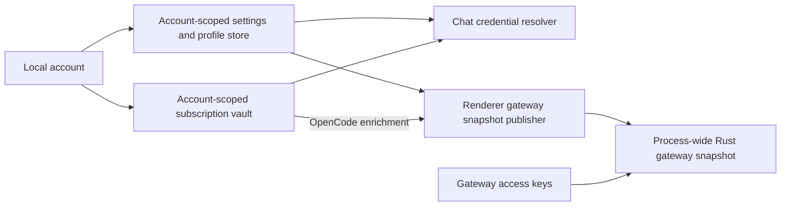

# Gateway, API settings, and account integration audit

Date: 2026-09-11

Scope: the current working tree, including concurrent uncommitted changes. The initial audit was read-only. After the user authorized full optimization, the ten findings below were addressed in the implementation described here. The original findings and evidence are retained as the pre-change record; their line numbers refer to that earlier snapshot.

## Implementation and validation — 2026-09-11

All ten findings have corresponding implementation and regression coverage:

| Findings | Implemented behavior                                                                                                                                                                                                                                                                                                                                                                                                               |
| -------- | ---------------------------------------------------------------------------------------------------------------------------------------------------------------------------------------------------------------------------------------------------------------------------------------------------------------------------------------------------------------------------------------------------------------------------------- |
| 1        | Desktop gateway state, keys, and tickets are bound to the unlocked local account and a host generation. Lock, switch, and relevant committed subscription-vault mutations invalidate snapshots and cancel pending requests and streams. Stale publishers and queued renderer events are rejected. Middleware rejection logs retain request-entry account attribution. Version comparison and snapshot commit share one write lock. |
| 2        | Explicitly disabled providers and disabled deployment profiles remain disabled during credential enrichment. Credential availability does not grant routing permission.                                                                                                                                                                                                                                                            |
| 3, 6, 7  | Publication begins before the first gateway access key exists. Relevant settings, subscription events, and host invalidation trigger refresh. Each retry rebuilds the complete account-bound snapshot, including subscription enrichment. Unrelated settings writes do not discard a valid publication.                                                                                                                            |
| 4        | API-settings readiness, enable guards, and connection tests resolve effective subscription credentials without persisting vault secrets. Codex probes use Responses; OpenCode probes retain relay headers. Results started for an obsolete account are discarded.                                                                                                                                                                  |
| 5        | An explicitly selected session or character account takes precedence over a manual API key and fails closed when unavailable. An inherited global account default preserves existing manual-key precedence. Same-family routing retries preserve the explicit selection; cross-family retries resolve the destination provider's account settings.                                                                                 |
| 8        | OpenCode gateway enrichment uses the shared credential resolver and projects the effective relay endpoint and filtered headers. Vault headers override case-insensitive collisions.                                                                                                                                                                                                                                                |
| 9        | Credential/transport changes reconcile cooldown state. Settings expose a localized, retryable restore action backed by `gateway_reset_cooldowns`, registered in IPC permissions and canonical protocol metadata. Resetting cooldowns does not send a paid probe.                                                                                                                                                                   |
| 10       | The mounted chat picker follows authoritative same-session account replacements and displays the effective credential source.                                                                                                                                                                                                                                                                                                      |

**Compatibility:** legacy gateway access keys without a local-account owner are rejected on desktop. The status API reports their count, and gateway settings explain how to create a replacement for the current account and update external tools. Legacy keys are not automatically assigned to the first account that opens the application. Upstream provider credentials do not need to be recreated.

**Preserved product boundary:** gateway subscription enrichment supports OpenCode. This work does not add a new Anthropic/Codex OAuth gateway transport. Headless hosting retains its intentional host-owned projection; it does not mount the desktop account publisher.

**Renderer-closed behavior:** a relevant subscription credential or preset change revokes copied gateway credentials immediately. The desktop renderer must publish a fresh snapshot before service resumes; there is no native unattended snapshot rebuild. Unrelated Anthropic/Codex vault refreshes, no-op saves, and label/usage/preset-display metadata edits do not revoke gateway authority. Actual OpenCode/Commandcode runtime changes conservatively invalidate the generation even when the last accepted snapshot uses manual keys, because a new subscription projection may already be in flight.

Validation performed against the shared working tree:

| Check                                         | Result and evidence boundary                                                                                                                                                                                                                                                                                                                                                                                                         |
| --------------------------------------------- | ------------------------------------------------------------------------------------------------------------------------------------------------------------------------------------------------------------------------------------------------------------------------------------------------------------------------------------------------------------------------------------------------------------------------------------ |
| Account/API settings/routing focused Jest     | 11 suites, 765 tests passed. Scoped aggregate coverage: 97.06% lines, 92.52% branches, 90.81% functions. Core credential/routing files meet 90% individually. Subsequent targeted UI coverage (overlapping suites, 147 tests) raised all three settings shells above the individual 90% gate: ConfigTab 98.96% lines / 96.15% branches / 94.11% functions; DetailHost 99.78% / 97.72% / 92%; ProviderSettings 96.16% / 91.21% / 90%. |
| Gateway publication/snapshot/IPC focused Jest | 3 suites, 59 tests passed. Each of the three collected source files exceeds 90% in all metrics; aggregate 99.13% lines, 91.84% branches, 100% functions.                                                                                                                                                                                                                                                                             |
| Gateway settings UI Jest                      | 3 suites, 103 tests passed, covering recovery, legacy-key guidance, and settings integration. All three collected source files exceed 90% individually in all metrics; aggregate 99.92% lines / 95.67% branches / 96.55% functions. Upstream panel reached 100% in all metrics.                                                                                                                                                      |
| Rust gateway                                  | `cargo test -p cognia-gateway --no-default-features --no-fail-fast`: 218 tests passed, including real loopback TCP account isolation, stale/concurrent publishers, ticket/key ownership, and pending/stream cancellation. After the final rejection-log correction, the real-listener and stale-event focused tests passed again; the listener regression checks six rejection events retain their original account scope.           |
| Rust subscription vault                       | `cargo test -p cognia-subscription --lib vault::tests --no-fail-fast`: final 27 tests passed, including committed runtime mutation notification and suppression of display-only changes.                                                                                                                                                                                                                                             |
| Rust compilation/lint                         | `cargo check -p cognia-gateway` with default Tauri feature and gateway Clippy with `--all-targets --no-default-features -- -D warnings` passed.                                                                                                                                                                                                                                                                                      |
| TypeScript/lint/generated contracts           | Project `pnpm typecheck`, scoped ESLint, `pnpm i18n:build:check`, `pnpm lint:i18n`, and `pnpm companion-api:check` passed.                                                                                                                                                                                                                                                                                                           |
| Rendered browser fixture                      | Actual recovery/key-card components with synthetic host IPC: English success and Chinese failure/retry, recovery button disabled after success, and legacy-key notice verified. This is not a real desktop account flow.                                                                                                                                                                                                             |
| Full repository coverage                      | Attempted `pnpm test:coverage --out coverage/gateway-integration-20260911 --jobs 1 --workers 2`. Shard 1/8 reported unrelated failures and then terminated with Node heap OOM/SIGABRT. Full-repository coverage is not established.                                                                                                                                                                                                  |
| Full desktop/external accounts                | Full desktop compile and its new account-auth lifecycle test were not executed because of limited disk (approximately 348 MiB free at the final native check). No real OAuth account, public-network relay, or billable upstream request was used.                                                                                                                                                                                   |

Focused logs are under `/tmp/cognia-account-settings-coverage-final.log`, `/tmp/cognia-gateway-focused-final.log`, `/tmp/cognia-gateway-ui-final.log`, and `/tmp/cognia-gateway-typecheck-final.log`. Browser screenshots are `/tmp/cognia-gateway-recovery-en-20260911.png` and `/tmp/cognia-gateway-recovery-zh-20260911.png`. These temporary artifacts may be removed by the operating system.

Remaining acceptance work: run the full desktop build/account-auth tests and a real desktop lock/switch flow when disk permits, and resolve full-suite failures before asserting the repository-wide coverage gate.

## Result

The three surfaces are connected, but they do not share one credential-selection and invalidation contract. The highest-impact gap is local-account isolation: the gateway owns a process-wide credential snapshot and version watermark, while API settings and subscription vaults are account-scoped.

Two meanings of account must remain distinct:

- **Local account** owns a Cognia database, settings, and vault namespace.
- **Provider account** is an Anthropic, Codex, or OpenCode credential managed inside a local account.

Current flow:



The gateway intentionally survives a closed renderer window. That does not establish authorization to retain credentials after a local account locks or switches. See [ADR-0054](../content/docs/en/adr/0054-local-multi-account-isolation.md) and the [gateway bridge](../../../components/providers/gateway-provider.tsx).

## Findings

### 1. P1: Local account lock/switch does not invalidate the gateway credential snapshot

**Trigger:** account A has published a working gateway snapshot; lock A or switch to B while the listener remains available to an existing gateway client.

The lock path clears subscription runtime and the local host binding, but neither teardown touches gateway state. Gateway authentication checks gateway access keys or route tickets rather than local-account unlock state. Its keys use a fixed global secret-store namespace.

The problem can persist beyond a refresh interval: account-local profile versions restart from their own database counter, while gateway CAS compares them against a process-wide watermark. If A published version 10 and B publishes version 2, B is rejected and A's snapshot remains live. Listener stop/start retains both the snapshot and watermark.

Evidence: `stores/account/account-store.ts:1156-1186`; `src-tauri/src/subscription/commands.rs:328-344`; `src-tauri/src/account_auth/mod.rs:375-395`; `src-tauri/src/lib.rs:533`; `crates/cognia-gateway/src/lib.rs:435-477,525-542`; `crates/cognia-gateway/src/api_keys.rs:22-24,156`; `crates/cognia-gateway/src/server.rs:812`; `lib/db/provider-profiles.ts:68-83`.

**Evidence boundary:** confirmed missing lifecycle/account ownership in source; no live request was sent after locking a real account. The Rust stale-version unit test at `crates/cognia-gateway/src/lib.rs:855-870` explicitly preserves the old snapshot, but was not executed in this audit.

**Correction:** give snapshots an explicit account owner and lifecycle generation; invalidate or reject requests at the host boundary on lock/switch; scope version comparison and access-key policy to that owner. Define separately whether any intentionally unattended gateway may continue serving a designated account.

### 2. P1: Vault enrichment re-enables explicitly disabled OpenCode providers

**Trigger:** disable OpenCode in API settings while a matching active subscription credential still exists.

The builder emits a disabled, keyless provider. The enrichment step cannot distinguish missing configuration from an explicit disable and sets `enabled: true` when it finds a vault credential. A literal provider/model route can therefore remain usable despite the API-settings toggle.

Evidence: `lib/gateway/snapshot-publisher.ts:169-171,447-487`. **Reproduced:** isolated regression probe expects the disabled state to remain false and receives true.

**Correction:** preserve explicit disable as an authoritative policy and enrich only eligible providers. Do not infer permission from credential availability.

### 3. P1: Provider-account changes do not promptly update gateway credentials

**Trigger:** switch, deactivate, delete, or rotate an OpenCode provider account, or edit its relay preset after a snapshot has been published.

The publisher observes only default provider, provider settings, custom providers, model mappings, and routing config. It does not subscribe to subscription-change events or observe account-default selection. Without another settings change it waits for the five-minute periodic push. With the renderer closed, that publisher cannot refresh at all. Requests during that window can continue using a deleted or previous account's copied key.

Evidence: `components/providers/gateway-provider.tsx:42-58,64-95,117-131`; `lib/subscription/core/subscription-events.ts`; `lib/subscription/opencode/chat-bridge.ts:51-56`.

**Reproduced:** broadcast `notifySubscriptionChanged()` after the initial snapshot and advance the debounce; no new snapshot is pushed.

**Correction:** publish after committed credential/account/preset mutations, and put revocation enforcement in the host for renderer-independent behavior. Resolve the intended active/default account explicitly rather than reading only the active vault pointer.

### 4. P1: Subscription-only accounts do not satisfy API-settings readiness and enable/test guards

**Trigger:** activate a Codex subscription account without also storing a manual API key in API settings.

Codex is disabled by default and requires credentials. API-settings readiness and enable/test guards inspect the settings key fields, while account activation updates the vault and account defaults. A usable vault credential therefore does not satisfy the setup page. The normal chat provider resolver also avoids vault fallback when the unresolved reason is `enable_provider`, so this is more than an inaccurate status badge.

Evidence: `packages/provider-types/src/built-in-provider-catalog.ts:1259-1276`; `components/settings/provider/provider-settings.tsx:244-254,294`; `packages/provider-core/src/providers/completeness.ts:319-340`; `hooks/settings/use-provider-settings.ts:180-185`; `lib/subscription/core/hooks.ts:154-159`; `lib/subscription/core/account-lifecycle.ts:63-85`; `lib/claude/provider-attempt-options.ts:191-218`.

**Evidence boundary:** source-confirmed setup/credential-source mismatch; no live Codex login or UI interaction was attempted.

**Correction:** use the same effective credential-source resolver for readiness, enable/test actions, and execution. Show which account supplies credentials without copying its secret into the manual-key field.

### 5. P1: Account-switch success can disagree with the credential used by the next request

**Trigger:** configure a manual API key for Codex/OpenCode, then select a different subscription account in the chat header.

The picker saves the selected account and displays success. Request construction only consults the subscription vault when `resolution.apiKey` is absent, so a manual API key continues to win. The chosen provider account has no effect on credential ownership or billing for that request.

Evidence: `components/chat/header-account-switcher.tsx:82-97`; `lib/claude/provider-attempt-options.ts:149-181`.

**Correction:** make the credential source visible and explicit. Either a deliberately selected account takes precedence, or the picker must explain/disable account switching while a manual key overrides it. The current precedence itself may be intentional; the misleading interaction is the defect.

### 6. P2: First gateway enable does not promptly publish configured upstreams

**Trigger:** the bridge mounts before any gateway access key exists; the user later creates the first key and starts the listener.

The initial push exits at `!status.hasToken`. Key creation/start refreshes settings-panel state but not the bridge's dependency slice. Existing upstream API settings can remain absent until another relevant settings mutation or the five-minute interval.

Evidence: `components/providers/gateway-provider.tsx:68-73,117-131`; `components/settings/gateway/gateway-section.tsx:208-218`.

**Reproduced:** change mocked status from no token to token available, rerender, and advance the debounce; zero snapshots are sent.

**Correction:** first key creation/start must request and await a valid snapshot, or publish configuration independently of listener-key existence.

### 7. P2: Rejected-snapshot retry drops subscription-vault enrichment

**Trigger:** the host rejects a snapshot and the renderer retries with refreshed profile metadata.

The initial push runs `enrichSnapshotWithSubscriptionCreds`, but the retry only calls `buildGatewaySnapshot`. A retry accepted after a version update can remove OpenCode vault-only upstreams or their usable credentials.

Evidence: `components/providers/gateway-provider.tsx:91-114`.

**Reproduced:** first push rejected, second accepted; the first contains the synthetic OpenCode credential and the second lacks it.

**Correction:** both attempts must run the same complete, account-bound projection pipeline using current inputs.

### 8. P2: Subscription relay headers do not reach the gateway snapshot

The current OpenCode resolver returns preset relay headers, and the direct chat resolver now preserves them. Gateway enrichment copies only the key/base URL; it does not project those headers into `transport.staticHeaders`. A subscription relay requiring a tenant or routing header can work in chat and fail through the built-in gateway.

Evidence: `lib/subscription/opencode/chat-bridge.ts:76-83`; `lib/gateway/snapshot-publisher.ts:432-434,471-487`; `crates/cognia-gateway/src/execute.rs:320-376`.

**Correction:** project the full effective transport, including filtered relay headers, using the same authority and precedence as direct execution.

**Concurrent-change note:** early checks found failures in the direct chat URL/header path. Other ongoing work fixed those files during this audit, and the final recheck passed. Those earlier direct-chat failures are not reported as outstanding defects.

### 9. P2: Permanently disabled pooled keys have no recovery path in gateway settings

**Trigger:** a pooled key is permanently disabled after 401/quota rejection; the user restores the account or corrects its endpoint while keeping the same key.

The pool excludes permanently disabled keys. A new snapshot and listener restart preserve the cooldown map; there is no clear/reset command. `cooldown.rs` promises recovery through a fresh snapshot, but snapshot ingest does not implement it.

Evidence: `crates/cognia-gateway/src/cooldown.rs:1-9,140-145`; `crates/cognia-gateway/src/server.rs:2120-2129`; `crates/cognia-gateway/src/lib.rs:403-477,506,525-542`; `crates/cognia-gateway/src/commands.rs`.

**Correction:** expose an explicit recheck/reset action and reconcile cooldowns when credential or transport revisions change. Define whether quota-related disable expires automatically.

### 10. P2: Account replacement can leave the mounted chat picker stale

**Trigger:** keep a session open, delete its pinned account A, and migrate references to B in account management.

The lifecycle code rewrites the persisted session. The picker retains its initial local `accountId` for the same session ID and ignores later prop changes, so it can show deleted A or an unavailable selection while the session points to B.

Evidence: `lib/subscription/core/account-lifecycle.ts:150-157`; `components/chat/header-account-switcher.tsx:56-61`.

**Correction:** synchronize selection with authoritative session revisions while protecting in-flight optimistic updates. Add a same-session prop-update regression test.

## Additional boundaries and follow-up

- Gateway subscription enrichment currently targets OpenCode. Do not assume that successfully logging into Anthropic or Codex automatically makes their OAuth accounts usable through the external gateway; that integration needs an explicit transport and credential contract. Evidence: `components/providers/gateway-provider.tsx:29-30,88-95`; `crates/cognia-gateway/src/credentials.rs`; `crates/cognia-gateway/src/execute.rs:194-196`.
- The gateway CAS check reads, releases the lock, validates the version, and later writes. Concurrent v2/v3 pushes may both validate against v1 and write out of order. This is a source-derived concurrency risk, not runtime reproduced: `crates/cognia-gateway/src/lib.rs:452-477`.
- Existing tests cover individual modules well enough to pass their current assertions, but do not establish local lock/switch revocation, first-enable readiness, subscription event publication, or enriched retry behavior.

## Verification

Isolated probe: `/tmp/cognia-gateway-audit-20260911/gateway-audit.test.tsx`, using the repository's resolved Jest jsdom configuration with a temporary root. All credentials in these probes are synthetic. No external HTTP calls or real account changes were made.

```text
rtk pnpm exec jest --config /tmp/cognia-gateway-audit-20260911/jest.config.json --runInBand --silent
Tests: 4 failed, 11 passed, 15 total
```

The four failures deliberately assert the missing desired behaviors in findings 2, 3, 6, and 7. The 11 inherited gateway bridge tests pass. These probes do not modify repository tests.

The final focused suite rerun covers gateway publishing, snapshot construction, OpenCode credential bridging, local-account lifecycle, header account selection, chat credential construction, provider settings, and provider-account lifecycle:

```text
rtk pnpm exec jest --runInBand --runTestsByPath components/providers/gateway-provider.test.tsx lib/gateway/snapshot-publisher.test.ts lib/subscription/opencode/chat-bridge.test.ts stores/account/account-store.test.ts components/chat/header-account-switcher.test.tsx lib/claude/provider-attempt-options.test.ts hooks/settings/use-provider-settings.test.ts lib/subscription/core/account-lifecycle.test.ts --silent
Test Suites: 8 passed, 8 total
Tests: 173 passed, 173 total
Time: 10.508 s
```

No Rust build/test, real desktop UI flow, external gateway client request, or full coverage run was performed. Rust execution was avoided with approximately 2.5 GiB of disk space remaining. Runtime-sensitive conclusions are labeled accordingly.

## Suggested repair order

1. Account ownership, lock/switch invalidation, explicit disabled-state enforcement.
2. Shared credential-source selection across account picker, API-settings guards, and execution.
3. Immediate and complete snapshot publication on startup, account/preset changes, and retries.
4. Relay transport parity, cooldown recovery, and UI replacement-state synchronization.

Each stage should add a regression at the user-flow boundary, including a real gateway request after account lock/switch before claiming runtime isolation.
