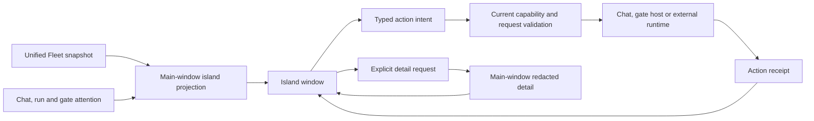

# Dynamic Island: activity continuity and complete control paths

Date: 2026-09-12

The island is Cognia's compact task and approval surface. This change extends its
existing projection and owner model, fixes lost event responses and wrong-owner
navigation, and gives users control over expansion without suppressing new asks.
It does not introduce a second task executor or approval authority.

## Design references and applied decisions

| Reference                                                                                                   | Relevant observation                                                                                                                                                              | Applied decision                                                                                                                                                              |
| ----------------------------------------------------------------------------------------------------------- | --------------------------------------------------------------------------------------------------------------------------------------------------------------------------------- | ----------------------------------------------------------------------------------------------------------------------------------------------------------------------------- |
| [Apple: Design dynamic Live Activities, WWDC23](https://developer.apple.com/videos/play/wwdc2023/10194/)    | Prioritize glanceable information, reserve controls for essential activity operations, vary height with relevant content, and remove completed activities after a short interval. | Retain minimal/compact/expanded presentations, priority ordering and completed-row expiry. Add explicit collapse and preserve the visible attention indicator after collapse. |
| [Apple: Live Activities HIG](https://developer.apple.com/design/human-interface-guidelines/live-activities) | Official reference for activity presentation across system surfaces.                                                                                                              | Use activity-oriented terminology and treat the desktop overlay as Cognia UI; this is not an iOS ActivityKit implementation.                                                  |
| [TheBoredTeam: Boring Notch](https://github.com/TheBoredTeam/boring.notch)                                  | A desktop notch can expose useful activity controls through a compact, expandable surface.                                                                                        | Reuse the quick-access interaction pattern for agent tasks. Every visible action must have a real owning runtime and a receipt.                                               |

The reference comparison informs interaction principles. The implementation and
acceptance evidence below come from Cognia's current source and checks.

## User paths and changes

| User path                                              | Previous gap                                                                                                                 | Implemented behavior                                                                                                                                                                                     |
| ------------------------------------------------------ | ---------------------------------------------------------------------------------------------------------------------------- | -------------------------------------------------------------------------------------------------------------------------------------------------------------------------------------------------------- |
| Open a chat from its island row                        | Navigating to `/` left the previously selected chat active.                                                                  | Select the exact owner session and DM context before navigation.                                                                                                                                         |
| Notice an AgentPlan or cost-budget gate                | Legacy team mapping dropped plan gates without team/run IDs or opened the Squad page for a non-Squad budget gate.            | A dedicated `gate` owner carries the exact scope/id and optional chat session. Open the main window, whose existing root-mounted `GateModalsHost` owns the decision.                                     |
| Dismiss an interrupted gate                            | Matching a broad team/run could select the wrong gate.                                                                       | Match the exact gate key and recheck that the current gate is interrupted. Refuse live, renewed or missing gates.                                                                                        |
| Open the island while Fleet is quiet                   | The initial state request could precede listener registration and lose the only reply.                                       | Install the state listener before requesting the snapshot; clean up late registration after unmount.                                                                                                     |
| Submit an action immediately after opening             | Sending before receipt-listener registration could lose a completed action's receipt.                                        | Wait for the shared listener within the existing action timeout, surface setup/send failure, and never emit after timeout or unmount.                                                                    |
| Reveal task detail                                     | Lost or failed delivery left loading indefinitely. Reopening the same row could briefly display old detail.                  | Bound setup/send/response time, surface `unavailable`, discard previous reveal state, reject stale responses, and retain per-row refresh coalescing. Closing and revealing again retries the request.    |
| Collapse an expanded task list                         | Hover and answerable gates overrode Escape. Hidden controls remained keyboard-reachable.                                     | Explicit collapse and Escape acknowledge the currently displayed gate IDs, clear detail, return focus to the pill and make the hidden body inert. A new gate still expands the island.                   |
| Use the island with a keyboard                         | Pointer departure could tuck focused controls; native deactivation could leave focus state stuck.                            | Keep keyboard controls visible while focused, release transient focus on window blur, and respect Escape already handled by an inner editor.                                                             |
| Answer an external multi-question request              | Projection truncated questions/options while retaining the submit capability.                                                | Offer inline answering only when all required questions and options are representable. Keep the existing terminal fallback for larger requests.                                                          |
| Act on an ended/detached session                       | Stale capability flags could retain runtime controls.                                                                        | Narrow runtime controls to live external sessions; retain only proven navigation/detail affordances.                                                                                                     |
| Change island settings                                 | Failed open/close, display or fullscreen changes were silent; tray changes left switches stale.                              | Persistent localized errors with exact-operation retry, foreground refresh, stale-read suppression and late-listener cleanup.                                                                            |
| Move to a shorter or differently scaled display        | The native geometry cache omitted height/scale and repositioned without resizing.                                            | Retain requested logical content size, reconcile target physical size and position, clamp to available space and restore the request on a larger display. Include display scale in notch-cache identity. |
| Update visibility and display preferences concurrently | Independent read-modify-write operations could overwrite another field; direct truncating writes risked corrupt persistence. | Serialize the complete mutation and use the existing atomic-write helper. Preserve unreadable/corrupt existing data on error; bound backups and skip no-op writes.                                       |

## Ownership and privacy

The regular state remains a bounded projection. Detail remains on-demand,
redacted and unpersisted. No new model, embedding or cloud request path was
introduced. Gate ownership uses a separate identity from a chat session so
sibling gates cannot be hidden by an accidental merge.

## Verification and limitations

Focused tests cover actual projection, routing, listener sequencing, stale
request rejection, detail privacy, user collapse, native event handling and
settings mutation behavior. Browser verification uses the actual island
components and hooks with simulated native transport; it is not evidence of
macOS window placement or a real external-agent approval.

Final combined verification: **22 suites / 336 tests passed**. Each of the ten
changed frontend source modules was subject to its own strict 90% threshold for
statements, branches, functions and lines. Combined coverage was 99.90%
statements/lines, 96.34% branches and 100% functions. All individual gates passed.
Targeted ESLint, Prettier, i18n generation/freshness/parity and diff checks passed.

The browser harness exercised expansion, detail reveal/content measurement,
Escape with focus return and inert controls, pointer departure after collapse,
arrival of a new approval, exact external permission intent/receipt, and the
new gate row's localized owner action. It used React, the actual island
components/hooks and compiled Tailwind styling, with only native transport
seams simulated.

The full `pnpm test:coverage` command was attempted in an isolated output
directory. Its first shard reported failures outside this change, including
plugin namespace expectations, connector callback payload shape, recording
recovery and chat runtime-provider fixtures. The run was stopped after those
failures; no repository-wide coverage pass is claimed.

The full `pnpm typecheck` command exhausted its configured 16 GB JavaScript heap.
An RTK summary printed “No errors found” despite exit code 134; the raw output
contains the fatal heap error, so that summary is not a valid type-check pass.

A subsequent source-scoped check completed with one dependency diagnostic at
`lib/placement/host-dispatch-runner.ts:65` (string versus UUID-template type).
It emitted no diagnostic in the changed island files; the overall check still
failed and is not presented as passing.

The focused application Rust test command reached application compilation but
failed before running tests on unrelated errors: `code_sandbox.rs` omitted
`LaunchScope.denied_readable`, and `provider_admin.rs` omitted
`MintRequest.provider_overrides` and called missing `GatewayState::set_snapshot`.
No compiler error was reported in `island_window.rs`. The real Tauri debug bridge
was unavailable. Fullscreen Spaces, native focus/click-through, tray behavior and
mixed-DPI monitor movement therefore remain unverified on device.

An isolated temporary Rust harness extracted the exact new island helper code
and seven tests, and directly included the existing atomic-file module. All 20
tests passed (seven island tests and 13 existing atomic-file tests). This checks
the helper algorithms and persistence behavior without claiming application
linkage or native-window verification.

The application build script also refreshed the already-dirty command grant
file; the island command signatures were not changed. Its unrelated generated
edits were preserved with the concurrent worktree changes.

Disk exhaustion also interrupted initial broad Jest indexing and one translation
generation attempt. Narrowed tests and a later `pnpm i18n:build` succeeded. No
shared build cache or user files were deleted by this task.
