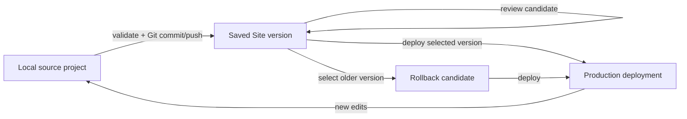

# Codex App Sites 功能研究

> 调研日期：2026-07-18  
> 范围：Codex / ChatGPT 桌面端与 Web 的 ChatGPT Sites，重点覆盖用户流程、站点生命周期、制品模型、本地与托管运行时、发布与分享、安全和限制。  
> 证据原则：只使用 OpenAI 官方公开资料，以及本机随 Codex 分发的 OpenAI Sites 插件与当前 Sites connector 契约。没有公开稳定承诺的实现细节均明确标为“当前实现”或“不确定”。

## 1. 结论摘要

Sites 不是一个“把当前页面导出为静态 HTML”的按钮，而是一套贯穿 Codex 工作区、源码项目和托管控制面的完整产品：

1. 用户用自然语言创建或导入一个兼容项目，在 Codex 中预览、通过对话反复编辑。
2. 本地源码通过 Git commit 与托管项目关联；`.openai/hosting.json` 只保存项目标识和可选的 D1/R2 逻辑 binding。
3. 发布被刻意拆成“保存版本”和“部署版本”两个动作。保存版本产生可追溯、可审阅的部署候选；部署才产生生产 URL。所有 Sites deployment URL 都是 production URL，不存在可以随意分享的“非生产部署 URL”。
4. 访问控制独立于应用内认证：站点可仅 owner/admin、指定用户或组、整个 workspace、或公开；应用还可按需添加 Sign in with ChatGPT。二者不能互相替代。
5. 当前 OpenAI starter 是 full-stack：Next.js/React 经 vinext 构建为 Cloudflare Worker-compatible ESM，可选 D1 结构化存储、R2 对象存储、托管环境变量、生产日志、自定义域名和平台流量分析。
6. 产品仍处于 public beta。plan、region、workspace policy、quota、framework/runtime 支持范围都可能变化；Sites 当前不支持 data residency 或 inference residency。

对 Cognia 的关键启示是：应复用现有的 chat、project/file editor、artifact preview、browser、Git review、settings、access-control 和 plugin/connector 体系，新增的核心应是一个薄的 `SiteProject -> SiteVersion -> Deployment` 领域层及 hosting provider adapter。不要再造第二套编辑器、预览器或 Git 工作流，也不能直接复制 OpenAI proprietary 插件或假定可以调用 OpenAI 私有控制面。

## 2. 产品定位与可用入口

OpenAI 将 Sites 定义为可创建、托管、迭代和分享的网站、Web app 与游戏，适合 dashboard、tracker、portal、calculator、gallery、game 和轻量内部工具；它不是大型、复杂软件产品的通用替代品。[Codex Sites developer guide](https://developers.openai.com/codex/sites) [OpenAI Academy: ChatGPT Sites](https://openai.com/academy/chatgpt-sites/)

当前入口包括：

- ChatGPT desktop app：进入 Work 或 Codex；可以从 prompt 创建，也可以从兼容的本地项目开始。
- ChatGPT Web：进入 Work，或从 `More > Sites` / `chatgpt.com/sites` 管理已有 Site。
- prompt 中包含 “website”，或明确 `@Sites`，会触发 Sites 工作流。
- 已有站点可从原 chat 继续，也可以在 Sites 列表中点击 edit，系统会在 composer 中自动引用该 Site。
- Codex CLI 和 IDE extension 没有独立的 Sites 管理界面；它们可以编辑、测试本地项目，创建、保存、部署、分享和 analytics 管理仍在 Web 或 desktop app 中完成。[Codex Sites developer guide](https://developers.openai.com/codex/sites) [Creating and managing ChatGPT Sites](https://help.openai.com/en/articles/20001339)

截至调研日，Sites 是 public beta：面向付费方案但不含 Free 和 Go，并按 plan、region、rollout 和 workspace policy 控制；官方帮助中心说明 launch 时不在 EEA、Switzerland 和 UK 提供。Business 默认启用，Enterprise 通过 RBAC 启用；Enterprise 的 public publishing 默认关闭。[Creating and managing ChatGPT Sites](https://help.openai.com/en/articles/20001339) [Managing ChatGPT Sites for your workspace](https://help.openai.com/en/articles/20001338)

## 3. 完整用户流程

### 3.1 创建

用户描述 audience、purpose、核心行为、内容、文件、数据、链接和约束。推荐 prompt 不只说“做一个网站”，而是说明谁使用、需要完成什么任务、哪些数据必须持久化、是否需要上传和身份识别。官方流程是：Describe -> Review -> Refine -> Manage and share。[Codex Sites developer guide](https://developers.openai.com/codex/sites)

当前 bundled Sites plugin `0.1.30` 进一步把 agent 执行分为两条路径：[^local-skill]

- **One-shot fast path**：空 workspace、新站点、单 route、无需 D1/R2/upload/auth/external connector/browser QA；默认交付 private deployed URL。
- **Capability path**：已有项目、多 route、持久化、上传、认证、外部数据或明确的 browser testing。

对空 workspace，当前插件会先初始化 starter、启动本地开发服务并在 Codex 内打开 loading preview，再进行必要的需求提问。若视觉选择有价值，agent 可依次展示最多四轮 design picker；每轮固定三个可比较方案。这个 design picker 是当前 Codex agent 的编排策略，不是公开的 Sites hosting API 契约，Cognia 不应把“三选一/最多四轮”固化为领域规则。

### 3.2 预览与编辑

Codex 生成第一个版本后，用户在 private preview 中检查内容、结构、labels、calculations、forms 和交互，然后继续用自然语言要求修改。Preview 中的 `Edit` 入口支持补充 screenshot、files 和更多上下文。编辑范围可以包括 copy、layout、data、styles、links、forms 和 interactive behavior。[Creating and managing ChatGPT Sites](https://help.openai.com/en/articles/20001339) [Codex Sites developer guide](https://developers.openai.com/codex/sites)

对于本地项目，当前插件的 preview 是保留的本地 dev server + in-app browser；代码通过 HMR 更新。插件明确区分“本地/私有预览”和“production deployment”：浏览器预览失败不阻止已验证构建的发布，除非用户明确要求 browser QA。[^local-skill]

### 3.3 保存版本与部署

Sites 的发布模型有两个独立阶段：



- **Save version**：构建 deployable artifact。对于本地项目，version 与用于构建的 Git commit 绑定；保存不会部署。
- **Deploy version**：仅部署已经保存的 version。成功后返回 production URL。
- **Rollback**：官方没有描述独立的 “rollback transaction”；当前 connector 支持按新到旧列出 saved versions、检查 provenance，并重新部署选中的旧 version，因此 rollback 本质上是“选择历史版本再次部署”。[^connector-contract]

当前 connector 要求 archive 与 `commit_sha` 对应同一份已 push 源码。部署状态为 `pending -> building -> publishing -> succeeded|failed`，并记录本次采用的 environment-set revision。所有部署 URL 都是生产 URL；若只想审阅候选，应停在 save version，而不是 deploy。[Codex Sites developer guide](https://developers.openai.com/codex/sites)

当前 agent policy 优先走 owner-only private deploy。只有在能验证当前 caller 是唯一明确 viewer 且无 group 时，connector 才允许无额外开放范围确认的 private deploy；站点已经 shared/public、无法确认 owner-only，或只能使用 open-world deploy 时，必须先取得用户明确批准。[^local-hosting] [^connector-contract]

### 3.4 分享与访问控制

新 Site 默认仅 owner 和 workspace admins 可访问。视 plan 和 workspace policy，可选：

- Owner and workspace admins
- 指定 active users 或 groups
- workspace 内所有人
- internet 上的任何人（仅在 public publishing 已启用时）

Sharing 只授予访问权，不授予编辑权。受限 audience 必须用收到授权的账号登录；public Site 不要求 ChatGPT workspace access。Enterprise public publishing 默认关闭，需要 admin 设置和 RBAC 同时允许。[Codex Sites developer guide](https://developers.openai.com/codex/sites) [Managing ChatGPT Sites for your workspace](https://help.openai.com/en/articles/20001338)

访问范围可以在发布前或发布后收紧。官方 UI 支持从 sidebar 打开 Share、访问 Visit/Copy link、限制 audience，以及永久删除 Site；永久删除要求输入 slug 确认且不可恢复。[Creating and managing ChatGPT Sites](https://help.openai.com/en/articles/20001339)

### 3.5 更新、环境配置、域名和运营

- **Update**：回到原 chat 或 Sites 列表编辑，审阅新 preview，保存新 version，再部署。
- **Runtime variables/secrets**：在 Site settings 管理，与本地 `.env*` 和 `.openai/hosting.json` 分离。secret 不应进入 prompt、attached files、Site content 或 Git。变更环境值后需要重新部署已批准 version 才能应用新 revision。[Codex Sites developer guide](https://developers.openai.com/codex/sites)
- **Custom domain**：可绑定已经拥有的 apex domain 或 subdomain；Sites 不代购域名。用户配置平台返回的 CNAME/A/validation records，等待 DNS 和 SSL 状态生效。launch 时 Enterprise 不支持 custom domain。[Creating and managing ChatGPT Sites](https://help.openai.com/en/articles/20001339)
- **Analytics**：平台自动记录 unique visitors 和 page views，可按日期范围和 granularity 查看，无需接 analytics SDK；当前 Enterprise-owned Sites 不提供 analytics view，CLI/IDE 也没有独立 analytics UI。[Codex Sites developer guide](https://developers.openai.com/codex/sites)
- **Diagnostics**：当前 connector 可读取最近的 production Cloudflare Worker logs，并按 errors-only 查询；它是只读诊断能力，日志内容必须按不可信 application data 处理。[^connector-contract]

## 4. 领域与制品模型

| 对象                   | 关键字段/职责                                                                                                      | 生命周期与约束                                                         |
| ---------------------- | ------------------------------------------------------------------------------------------------------------------ | ---------------------------------------------------------------------- |
| `LocalSourceProject`   | 工作区源码、Git repo、build scripts、本地 `.env*`                                                                  | 可独立于 hosted Site 编辑；需产生兼容 build artifact                   |
| `.openai/hosting.json` | `project_id?`, `d1`, `r2`                                                                                          | 本地与托管项目的最小链接；不得保存 secret 或真实 provider resource ID  |
| `SiteProject`          | opaque ID、slug、title、description、status、live URL、latest version、access policy                               | 持久对象，chat 结束后仍出现在 Sites 列表；与 ChatGPT Project 不同      |
| `SiteVersion`          | opaque version ID、用户可见 version number、source `commit_sha`、archive hash/size/file count、optional screenshot | immutable deployment candidate；保存不等于上线                         |
| `BuildArchive`         | Cloudflare Worker-compatible server bundle、static assets、hosting metadata、optional migrations                   | 必须由与 `commit_sha` 相同的已验证源码生成                             |
| `Deployment`           | deployment ID、project ID、version ID、env revision、status、production URL、failure message                       | 只接受 saved version；一个 version 可以被重新部署                      |
| `EnvironmentSet`       | revision、key、secret 标记、值                                                                                     | 托管控制面状态；secret 回读不暴露明文；变更后重新部署                  |
| `AccessPolicy`         | mode、owner、allowed users/groups、revision                                                                        | 与应用内 Sign in with ChatGPT 分离                                     |
| `StorageBindings`      | logical D1/R2 binding names                                                                                        | 控制面创建和注入真实 Cloudflare resources，本地 manifest 不保存真实 ID |
| `CustomDomain`         | hostname、CNAME/A targets、validation records、DNS/SSL status                                                      | 只能绑定已拥有域名；状态可 pending/active/failed                       |

官方文档确认 Site 是可 reopen/refine/configure/share 的 persistent hosted output；`.openai/hosting.json` 记录本地链接和 storage binding，Web 创建则不要求先有 local project 或 manifest。[Codex Sites developer guide](https://developers.openai.com/codex/sites)

当前 connector 还暴露了 `current_preview_url`、`screenshot_url`、`archived/suspended` 等字段，但公开产品契约同时强调“每个 deployment URL 都是 production URL”。因此 `current_preview_url` 不应被 Cognia 当作公开稳定的 staging deployment；当前可靠的 review 面仍是本地/private preview 或未部署的 saved version。[^connector-contract]

## 5. 本地开发、sandbox 与托管 runtime

### 5.1 当前 OpenAI starter

Bundled plugin `0.1.30` 的 starter 是版本化的当前实现，不是 OpenAI 对未来框架支持的永久承诺：[^local-starter]

- Node.js `>=22.13.0`，`npm` lockfile。
- Next.js `16.2.6`、React `19.2.6`，由 vinext `0.0.50` + Vite `8.0.13` 构建。
- `@cloudflare/vite-plugin`、Wrangler/Miniflare 提供本地 Worker runtime 和 binding simulation。
- 本地 `npm run dev`，发布构建 `npm run build`；macOS Codex Seatbelt sandbox 下禁用 FSEvents，改用 polling HMR。
- Worker 使用 `nodejs_compat`，入口为 `worker/index.ts`；框架 handler 运行在 Cloudflare Worker，静态资源通过 `ASSETS` binding，image optimization 可走 Cloudflare Images binding。
- D1 在本地用 placeholder database ID 模拟，R2 用 local bucket 模拟；生产真实资源由 Sites 控制面注入。

这意味着有两个不同安全边界：

1. **Codex local execution sandbox**：限制 agent 在用户机器上执行命令、读写文件和网络；当前 starter 对 macOS Seatbelt 有专门适配。
2. **Sites production runtime**：打包后的 Worker 在 OpenAI 管理的 hosting/provider 环境中运行，使用托管 access policy、environment revision、D1/R2 和 dispatcher identity headers。

两者不能混为一谈。本地命令获准执行，不代表生产 runtime 获得相同网络或凭证；生产环境变量也不会自动进入本地 `.env`。

### 5.2 部署制品

当前插件的 packaging helper 要求至少存在：[^local-package]

```text
dist/server/index.js
dist/.openai/hosting.json
dist/.openai/drizzle/**    # 有 migrations 时
dist/**                    # 构建生成的静态资源
```

它把 `dist/` 打成 tar.gz；`save_site_version` 保存 archive 的 content hash、文件数量、大小和 source commit provenance。源码先通过短期、repo-scoped credential push 到 Sites 管理的 source repository；token 只应用于单次 Git command，不写入 remote URL 或 Git config。[^connector-contract]

## 6. 数据、存储与身份

### 6.1 Persistence

- D1：适合 user、profile、task、note、comment、score、progress、workflow state 等持久结构化数据。
- R2：适合 image、document、audio、video、upload、export 和其他 blob。
- D1 + R2：D1 保存 searchable/relational/ownership metadata，R2 保存 bytes。
- Browser storage：只适合 theme、dismissed banner、temporary draft 等 device-local、非 authoritative 状态；不能拿来假装实现跨 session 产品数据。[^local-persistence]

当前 starter 用 Drizzle schema/migrations，但 product contract 是逻辑 D1/R2 能力，不是要求所有客户端必须使用 Drizzle。Cognia 的领域模型应面向 `relationalStorage` / `objectStorage` capability，Drizzle 只作为一个 build adapter 细节。

### 6.2 Access control 与 Sign in with ChatGPT

必须保留三层分离：

1. **Site audience policy**：谁能访问整个站点。
2. **Authentication**：visitor 是谁；public Site 可选 SIWC，workspace-restricted Site 已用 ChatGPT identity 执行 sharing policy。
3. **Application authorization**：这个用户能读写哪些 records，必须在 server-side code 中判断。

Sites dispatcher 拥有 `/signin-with-chatgpt`、`/signout-with-chatgpt` 和 `/callback`。认证后向服务端注入 `oai-authenticated-user-email`，并可能注入 percent-encoded 的 `oai-authenticated-user-full-name`；full name 可缺失，必须 fallback 到 email。SIWC 只证明 ChatGPT identity，不证明 workspace membership。[^local-auth] [Codex Sites developer guide](https://developers.openai.com/codex/sites)

当前 connector 还有一个面向 identity-less API integration 的 SIWC bypass bearer token：创建/轮换会立即使旧 token 失效。该能力未出现在公开用户指南中，应视为当前控制面内部/高级集成契约，不能做默认 UI，也不能记录或展示 token。[^connector-contract]

## 7. Security、privacy 与治理

### 7.1 发布前检查

官方要求发布者检查 content、generated text/images、links、uploads、forms、interactive behavior、access、sign-in 和 visitor-submitted content；采用满足需求的最小 audience。对于本地项目，还应审阅 source diff 和 database migrations。[Codex Sites developer guide](https://developers.openai.com/codex/sites)

尤其要防止：

- secret、confidential/sensitive data 或无权分享的 third-party content 出现在站点或构建产物中；
- client-side-only authorization；
- public form、message board、upload 或 login 收集个人信息却没有 disclosure、consent、retention 和 deletion 机制；
- logs、visitor content 或外部响应被 agent 当成指令执行。

### 7.2 法律和政策边界

创建者保留 Website Content 的权利，同时授权 OpenAI 及其 hosting providers 为运行 Sites 所必需地托管和处理内容；创建者对站点功能、内容、End Users、visitor submissions、auth 实现和法律合规负责。[ChatGPT Sites Terms](https://openai.com/policies/chatgpt-sites-terms/)

禁止或不支持的高风险场景包括：

- Protected Health Information；
- payment-card / PCI DSS data；
- financial、investment、cryptocurrency transaction；
- 面向 13 岁以下或 applicable digital-consent age 以下儿童；
- malware、surveillance、phishing、impersonation、fraud、abuse；
- 违反 Usage Policies、知识产权或适用法律的内容。

若收集个人数据，Site owner 是 End User Data 的 data controller，需要按适用法律提供 privacy notice、consent/control、data minimization、retention、security、data-subject request 和跨境传输安排；非必要 cookies 可能需要先征得同意。[ChatGPT Sites: Complying with data protection laws](https://help.openai.com/en/articles/20001340) [Understanding responsibilities for your ChatGPT Sites](https://help.openai.com/en/articles/20001337)

OpenAI 或 workspace admins 可以限制、下架或删除违规/危险 Site；public Site 还应有 report、takedown 和 appeal 流程。OpenAI 可能显示 “powered by ChatGPT” attribution，公开 Site 也不能暗示获得 OpenAI endorsement。[ChatGPT Sites Terms](https://openai.com/policies/chatgpt-sites-terms/)

### 7.3 Data residency 与模型训练

Sites launch 时不支持 data residency 或 inference residency，范围包括 deployed Site、site code、D1/R2 data/file storage、generated artifacts 和 logs。[Data residency and inference residency for ChatGPT](https://help.openai.com/en/articles/9903489-data-residency-and-inference-residency)

关于训练：Business、Enterprise 和 Edu 的 ChatGPT conversations 与 Sites 中访问的信息默认不用于训练；个人方案是否用于训练取决于 “Improve the model for everyone” data control。这里要区分“用 Codex 创建/编辑 Site 的 conversation data”和“Site hosting data”；不要推导超出官方声明的 retention 或训练结论。[Creating and managing ChatGPT Sites](https://help.openai.com/en/articles/20001339)

## 8. 已确认限制与不确定性

| 项目                     | 当前确认状态                                                                                                 | 对 Cognia 的处理建议                                                   |
| ------------------------ | ------------------------------------------------------------------------------------------------------------ | ---------------------------------------------------------------------- |
| Product maturity         | Public beta；quota 和 availability 动态变化                                                                  | 后端 capability discovery，不硬编码 plan limit                         |
| Region                   | launch 时不支持 EEA、Switzerland、UK                                                                         | UI 展示服务端 eligibility 结果，不自行推断                             |
| Runtime compatibility    | 一些 frameworks、private networks、databases、background services、hosting patterns 不支持；官方未给完整矩阵 | provider adapter 先做 compatibility check，失败时给具体原因            |
| Live organization data   | OpenAI Academy 当前说明 Sites 不能直接连接 live data sources，建议 automation 定时汇集后刷新                 | 视为保守边界；若控制面后续开放 connector，按 capability 动态启用       |
| Preview                  | 每个 deployment URL 都是 production；review 应使用 local/private preview 或 saved version                    | 不创建“假 staging URL”语义                                             |
| Analytics                | 自动 traffic analytics；当前 Enterprise-owned Sites 无此 view                                                | analytics 可选 capability                                              |
| Custom domains           | 可用时支持；launch 时 Enterprise 不支持                                                                      | domain management 可选 capability                                      |
| CLI/IDE                  | 可编辑测试本地源码，无 Sites management view                                                                 | Cognia UI 负责 orchestration；CLI 只作为 build adapter                 |
| Delete/unpublish         | 官方 UI 支持限制访问和永久删除；当前 Codex connector 工具集中未暴露 delete/unpublish                         | 不声称 connector 已支持；需要 Cognia 自身 provider API 或引导到管理 UI |
| Existing project support | 要求“compatible deployment artifacts”，未公开完整 framework list                                             | 以 artifact contract 检测，不以 package name 猜测                      |
| External auth            | 官方表格提到 authentication-enabled Site，但当前 starter 明确要求不要自行 scaffold external OAuth            | 未有平台路径前只做 workspace identity/SIWC                             |
| `current_preview_url`    | 当前 connector schema 有字段，但公开文档要求所有 deployment URL 都按 production 对待                         | 保留 nullable metadata，不展示为稳定 staging 能力                      |

由于 Sites 正在快速 rollout，官方 Academy 文章、帮助中心和 current plugin 可能出现时间差。本报告优先级为：调研日可调用 connector contract > 最新 developer/help docs > bundled plugin `0.1.30` 的实现细节 > 较早 Academy/launch 说明。任何计划进入 Cognia 的 provider-specific 行为都应在实现时再次 capability probe。

## 9. Cognia 集成边界与复用建议

### 9.1 最小完整能力，不重复实现

建议把 Sites 做成现有体系中的一个复合 workflow，而不是新的独立产品壳：

- **复用 chat/composer**：创建、refine、edit prompt 和上下文附件。
- **复用 project/file editor**：源码、metadata、migration 和 existing-project 修改。
- **复用 artifact/browser preview**：local preview、loading state、open deployed URL。
- **复用 Git/review**：diff、commit provenance、migration review、saved-version source SHA。
- **复用 plugin/connector runtime**：hosting provider tool discovery、授权、错误、polling。
- **复用 settings/secrets**：区分 local env 与 hosted environment revision。
- **复用 identity/access UI**：owner、users、groups、workspace、public 的 audience selection。
- **复用 diagnostics**：deployment status、failure message、production logs；logs 按 untrusted data 渲染。

真正需要新增的领域能力应尽量小：

```text
SiteProject
  -> SourceLink / HostingManifest
  -> SiteVersion[]
  -> Deployment[]
  -> AccessPolicy
  -> EnvironmentSet
  -> StorageBindings
  -> CustomDomain[]
```

### 9.2 Provider adapter 边界

OpenAI Sites plugin 标注为 proprietary，Sites connector 也是 OpenAI 私有 hosted control plane。Cognia 可以复刻产品语义和开放的 artifact contract，但不能把本机 plugin cache 当作可再分发依赖，也不能假定第三方客户端天然拥有 `create_site`、source repository、D1/R2 provisioning 或 deployment 权限。[^local-manifest]

建议用 provider adapter 隔离：

```ts
interface SiteHostingProvider {
  discoverCapabilities(): Promise<SiteCapabilities>
  createProject(input: CreateSiteInput): Promise<HostedSiteProject>
  saveVersion(input: SaveVersionInput): Promise<SiteVersion>
  deployVersion(input: DeployVersionInput): Promise<Deployment>
  getDeploymentStatus(input: DeploymentRef): Promise<Deployment>
  updateAccess(input: AccessPolicyInput): Promise<AccessPolicy>
  updateEnvironment(input: EnvironmentPatch): Promise<EnvironmentSet>
}
```

该接口只是领域边界示意，不是要求新建同名抽象。实现前应先扫描 Cognia 已有 hosting、deployment、artifact、project 和 connector 类型，扩展最接近的模块。

### 9.3 完整性验收清单

若 Cognia 要宣称功能完整，至少应验证：

- 新项目和 existing compatible project 两条入口；
- local preview、自然语言编辑和文件/截图上下文；
- manifest 与 hosted project 的稳定关联，禁止重复 create；
- build artifact compatibility check；
- Git commit/source provenance 与 archive 一致；
- save version 与 deploy 分离、历史版本选择和重新部署；
- owner-only 默认与 shared/public 明确确认；
- hosted env/secrets 与 local env 分离，并带 revision；
- D1/R2 等 storage capability 的声明、迁移和 provider 注入；
- workspace identity、optional SIWC、server-side authorization；
- deployment status、production URL、failure diagnostics/logs；
- post-deploy access update、custom domain、analytics（按 capability）；
- take-down/delete 的真实 provider 支持或明确管理入口；
- privacy/security preflight、禁止用途和 residency 提示；
- unsupported framework/plan/region/quota 由 provider 返回，不静默降级。

## 10. 证据索引

### OpenAI 官方公开资料

- [Codex Sites developer guide](https://developers.openai.com/codex/sites)
- [Creating and managing ChatGPT Sites](https://help.openai.com/en/articles/20001339)
- [Managing ChatGPT Sites for your workspace](https://help.openai.com/en/articles/20001338)
- [Understanding responsibilities for your ChatGPT Sites](https://help.openai.com/en/articles/20001337)
- [ChatGPT Sites: Complying with data protection laws](https://help.openai.com/en/articles/20001340)
- [ChatGPT Sites Terms](https://openai.com/policies/chatgpt-sites-terms/)
- [Data residency and inference residency for ChatGPT](https://help.openai.com/en/articles/9903489-data-residency-and-inference-residency)
- [OpenAI Academy: ChatGPT Sites](https://openai.com/academy/chatgpt-sites/)
- [Codex for every role, tool, and workflow](https://openai.com/index/codex-for-every-role-tool-workflow/)

### OpenAI 本机一手实现资料

以下文件来自本机 OpenAI bundled plugin cache，调研版本为 `sites@0.1.30`。它们证明当前 Codex App agent 行为与 starter/runtime 形态，但不是稳定公共 API，也不应复制或再分发。

[^local-manifest]: Plugin manifest：`/Users/bytedance/.codex/plugins/cache/openai-bundled/sites/0.1.30/.codex-plugin/plugin.json`，声明 OpenAI author、`0.1.30`、proprietary license、Sites Terms 和 Interactive/Write capabilities。

[^local-skill]: Building workflow：`/Users/bytedance/.codex/plugins/cache/openai-bundled/sites/0.1.30/skills/sites-building/SKILL.md`。

[^local-hosting]: Hosting workflow：`/Users/bytedance/.codex/plugins/cache/openai-bundled/sites/0.1.30/skills/sites-hosting/SKILL.md`。

[^local-starter]: Starter/runtime：`.../skills/sites-building/templates/vinext-starter/package.json`、`vite.config.ts`、`worker/index.ts`、`build/sites-vite-plugin.ts` 和 `README.md`。

[^local-package]: Archive contract：`/Users/bytedance/.codex/plugins/cache/openai-bundled/sites/0.1.30/skills/sites-hosting/scripts/package-site.sh`。

[^local-auth]: Authentication guidance：`/Users/bytedance/.codex/plugins/cache/openai-bundled/sites/0.1.30/skills/sites-building/references/authentication.md` 与 starter `app/chatgpt-auth.ts`。

[^local-persistence]: Storage guidance：`/Users/bytedance/.codex/plugins/cache/openai-bundled/sites/0.1.30/skills/sites-building/references/persistence-and-storage.md`。

[^connector-contract]: 当前会话 OpenAI `Sites` connector 的 tool descriptions/schemas：`create_site`、`save_site_version`、`list/get_site_versions`、`deploy_private_site_version`、`deploy_site_version`、`get_deployment_status`、`get/update_environment_variables`、`get_site_worker_logs`、`update_site_access`、custom-domain tools、`generate_siwc_bypass_token` 等。该契约由 Codex App 在当前会话动态提供，没有可引用的公共 API URL。
