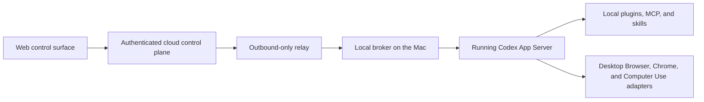
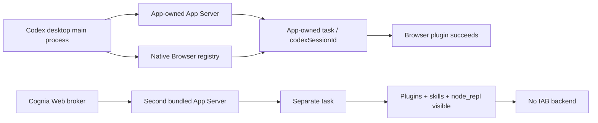
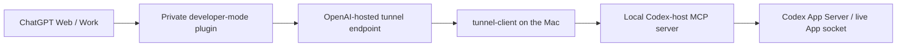

# Web-initiated control of a local Codex desktop host

Date: 2026-08-11  
Status: Research and architecture recommendation  
Scope: Start and steer work from a Web/cloud surface while execution remains on a local Codex desktop host, including local plugins, MCP, Browser, Chrome, and Computer Use.

## Executive decision

There are two materially different requirements hidden inside “start a task from the Web”:

1. **Remote control of a local desktop host.** OpenAI now documents this as **Codex Remote**. Tasks execute on the connected Mac or Windows host and explicitly inherit that host's projects, chats, files, credentials, permissions, plugins, MCP servers, skills, browser setup, Computer Use, and local tools. This is the strongest supported answer when the controller may be the ChatGPT mobile app or, where rolled out, another Mac/Windows desktop app. [Codex Remote](https://learn.chatgpt.com/docs/remote) and [Remote connections](https://learn.chatgpt.com/docs/remote-connections) are the primary sources.
2. **A literal browser-based control surface.** The official Remote documentation currently lists ChatGPT on iOS/Android and, subject to rollout, another Mac/Windows desktop app as controllers. It does not list `chatgpt.com` in a browser as a Remote controller. This is a supported-surface inference, not an explicit OpenAI statement that Web Remote will never exist.

If a browser UI is a hard requirement, the correct control-plane shape is:



The local broker must connect to the **App-owned** App Server/session and preserve App Server's approval flow. Do not expose App Server directly to the public internet. If ChatGPT Web itself is an acceptable front end, an OpenAI [Secure MCP Tunnel](https://developers.openai.com/api/docs/guides/secure-mcp-tunnels) can replace the custom relay. If a standalone Cognia Web UI is required, use Cognia's existing companion/control-plane transport rather than introducing a second public remote-execution ingress.

This diagram is a target architecture, not a capability available on every desktop build. On the installed 2026-08-11 build, the App-owned server had no accepting control socket, while a second bundled App Server failed the real Browser test. Secure transport cannot repair that ownership gap. Therefore a custom Cognia Web product must fail the native-parity gate unless it can capability-detect and attach to the App-owned runtime.

The largest risk is now experimentally resolved for the installed desktop build: a separately spawned SDK/App Server process does **not** inherit the running App's in-app Browser backend. It can enumerate the installed Browser plugin, load the Browser skill, start `node_repl`, create canonical threads, and stream events, yet `agent.browsers.list()` is empty and `agent.browsers.get("iab")` fails. The same call succeeds inside an App-owned task and returns a backend explicitly bound to that task's `codexSessionId`. Official Remote remains the only documented route that guarantees host capability inheritance.

## Capability map

| Surface           | Where work executes                                              | Can start remotely                                       | Local plugins/MCP/skills                                                    | Local Browser/Chrome/Computer Use                                                                         | Fit                                                              |
| ----------------- | ---------------------------------------------------------------- | -------------------------------------------------------- | --------------------------------------------------------------------------- | --------------------------------------------------------------------------------------------------------- | ---------------------------------------------------------------- |
| Codex Remote      | Connected Mac/Windows host                                       | Mobile; another desktop where available                  | Explicitly inherited from host                                              | Explicitly inherited from host                                                                            | Best supported option, but no documented browser controller      |
| Codex cloud       | Isolated OpenAI cloud environment                                | Web, GitHub, Linear, Slack, CLI                          | Cloud environment only                                                      | Not the local desktop/browser session                                                                     | Wrong execution boundary                                         |
| App Server        | Machine running `codex app-server`                               | Custom client over stdio, Unix socket, or WebSocket      | Discoverable through App Server; depends on that host/process configuration | Only inherited when using the App-owned host/session; a second runtime failed the real Browser smoke test | Best protocol only if Cognia can attach to the App-owned runtime |
| Codex SDK         | Local SDK-managed Codex runtime                                  | Any server-side application that reaches the host        | Uses local Codex runtime/config                                             | No documented promise of active desktop-host adapters                                                     | Good broker implementation layer                                 |
| `codex exec`      | Local non-interactive process                                    | Scripts, CI, job runner                                  | Loads user config unless explicitly ignored                                 | Poor fit for interactive desktop approvals                                                                | Good for bounded automation, not a full remote console           |
| Secure MCP Tunnel | Local private MCP server, invoked through OpenAI-hosted endpoint | ChatGPT, Codex, Responses API, supported OpenAI surfaces | Only capabilities deliberately exposed by the local MCP server              | Not automatic; the local MCP broker must bridge them                                                      | Best outbound-only path for a ChatGPT Web PoC                    |

## What OpenAI Remote actually provides

[Remote connections](https://learn.chatgpt.com/docs/remote-connections) is unusually explicit about the execution boundary:

- The phone sends prompts, approvals, and follow-up messages; the connected host provides the execution environment.
- Repository files, local documents, shell commands, credentials, signed-in websites, desktop apps, MCP servers, skills, browser access, and Computer Use come from the connected host.
- The host's sandboxing, security controls, and action approvals continue to apply.
- A secure relay keeps trusted machines reachable without exposing them directly to the public internet.
- The host must remain awake, online, running the desktop app, and signed into the same ChatGPT account and workspace.
- Setup uses a host-side approval and QR pairing, with workspace policy, SSO, MFA, or passkeys applied where configured.

Remote can start and continue chats, steer active work, answer questions, approve actions, and review outputs, diffs, tests, terminal output, and screenshots. This is already the desired product behavior, including the difficult approval and GUI-control cases.

### Supported-controller gap

The current documentation says a host can be controlled from ChatGPT on iOS or Android and, where **Control other devices** is available, from another Mac or Windows desktop app. It also says mobile setup starts from the desktop app and cannot be set up from the Codex CLI or IDE extension. It does not document a normal browser tab as a Remote controller. Therefore:

- If “Web” means “away from the computer,” use official Remote and avoid custom infrastructure.
- If “Web” means “must work in a browser URL,” official Remote is not yet a documented solution.

The locally installed CLI currently exposes experimental `remote-control start|stop|pair` and daemon remote-control commands. These are first-party artifacts, but the official setup documentation does not present them as a stable public integration API. They should not be a production dependency without version gating and a fallback.

## Why Codex cloud is not local Codex control

[Codex cloud](https://learn.chatgpt.com/docs/cloud) can start tasks from the Web, GitHub, Linear, or Slack, but the task runs in an isolated cloud environment configured for a GitHub repository. Its dependencies, environment variables, secrets, tools, and internet policy belong to that cloud environment.

That means Codex cloud does not automatically receive:

- local uncommitted state or arbitrary local files;
- the desktop App's installed plugin processes and local STDIO MCP servers;
- signed-in Chrome tabs, saved local browser state, or native desktop apps;
- macOS Screen Recording and Accessibility grants;
- the local App's live approvals and GUI session.

Local/remote-host handoff exists, but the Remote documentation explicitly says handoff to a Codex cloud environment is not supported. Cloud is therefore useful for repository-isolated coding work, but it is not a bridge into the local Codex App.

## Codex App Server as the control protocol

[Codex App Server](https://learn.chatgpt.com/docs/app-server) is the documented protocol behind rich Codex clients. It is the correct substrate for a custom Web console because it exposes:

- authentication and account state;
- thread start, resume, fork, list, read, archive, naming, and goals;
- turn start, steering, interruption, and streamed lifecycle events;
- command, file, network, permission, connector, and MCP approvals;
- diffs, terminal sessions, screenshots/tool results, and persisted history;
- skill discovery and explicit skill inputs;
- app/connector availability and installed/callable state;
- MCP startup status, resources, OAuth, tool calls, and elicitation;
- sandbox and permission profile selection.

The default transport is JSONL over stdio. Unix-socket and WebSocket transports are also documented. App Server can listen on WebSocket and the Codex TUI can connect with `codex --remote`; for a non-local connection, the docs require TLS and bearer authentication. However, the WebSocket transport and the remote Code Mode host are explicitly described as experimental and unsupported for production workloads. Plain WebSocket is only appropriate for localhost or SSH forwarding.

This leads to an important boundary:

- **Recommended:** the public Web service talks to an authenticated local broker over an outbound connection; the broker talks to App Server over stdio, localhost, or Unix socket.
- **Not recommended:** the browser connects directly to a publicly reachable App Server listener.

### Running App versus a new local runtime

The [Codex SDK](https://learn.chatgpt.com/docs/codex-sdk) starts and resumes local Codex threads. The Python SDK explicitly controls a local App Server over JSON-RPC. This is enough to implement the broker, but official SDK docs do not promise that a newly spawned App Server is the same process currently owned by the desktop App.

That distinction matters for UI-visible tasks and native adapters:

- A separate process may read the same persisted Codex configuration and thread store.
- It may not inherit the desktop App's client-injected tools, native browser host, Computer Use service, or active UI state.
- A thread created in a separate runtime may persist without appearing immediately in the running App's cached list.

Repository-local probing on 2026-08-06 found that the running desktop App's Unix control socket could accept a second App Server client and create a canonical, immediately visible App thread. See [Codex App conversation dispatch feasibility](./codex-app-conversation-dispatch-2026-08-06.md). On 2026-08-11, read-only inspection showed the desktop App still launching a bundled App Server and separate Computer Use processes, but the default managed-daemon control socket was not accepting a connection. This is evidence that live-App attachment is feasible but cannot yet be treated as an unconditional stable contract. A production integration needs version negotiation, capability detection, bounded reconnect, and a clear unsupported-version error.

## Executable PoC results on the installed App

The disposable demo is in [`prototypes/codex-app-web-control`](../../prototypes/codex-app-web-control/README.md). Run it from the repository root:

```bash
pnpm --dir prototypes/codex-app-web-control dev
```

It binds only to `127.0.0.1:4317`, keeps App Server behind a local Node broker, exposes a Web UI, streams normalized App Server events over SSE, forwards approval requests, starts and interrupts turns, enumerates plugins/skills/MCP, opens persisted tasks in Codex desktop, and contains a Browser smoke target with a random rendered verification code.

The test host ran ChatGPT/Codex desktop build `26.803.41515` with bundled Codex CLI `0.147.0-alpha.6.5`.

| Probe                                                                              | Result                                                                                                                                         | What it proves                                                                                         |
| ---------------------------------------------------------------------------------- | ---------------------------------------------------------------------------------------------------------------------------------------------- | ------------------------------------------------------------------------------------------------------ |
| Second bundled App Server: plugin and skill discovery                              | Browser and Computer Use plugins were installed/enabled; `browser:control-in-app-browser` was visible/enabled; `node_repl` exposed three tools | Configuration discovery works across a second runtime                                                  |
| Second bundled App Server: Browser smoke                                           | Browser bootstrap loaded, but `agent.browsers.list()` returned `[]`; `get("iab")` returned `Browser is not available: iab`                     | Plugin visibility is not Browser backend ownership                                                     |
| Second App Server with the desktop App's exact `features.code_mode_host=true` flag | Same empty backend list and same failure                                                                                                       | The missing capability is not the Code Mode feature flag                                               |
| App-owned task: identical Browser bootstrap                                        | Returned one `Codex In-app Browser` whose metadata included the current App task's `codexSessionId`                                            | The desktop main process registers Browser per App-owned session                                       |
| App-owned task: local page smoke                                                   | Opened the demo's rendered localhost page and read its random `LOCAL-BROWSER-*` code through the Browser API                                   | The installed Browser plugin and native backend are healthy                                            |
| Web-created canonical thread                                                       | Appeared immediately in the Codex desktop project/sidebar                                                                                      | Thread persistence and cross-client discovery work                                                     |
| Open the thread while the second App Server is alive                               | Desktop showed “opened in another application”                                                                                                 | A thread has one active writer/runtime owner; separate clients cannot simultaneously render/control it |
| `thread/unsubscribe` while the second runtime remains alive                        | Desktop remained blocked                                                                                                                       | Subscription release alone is not a UI handoff                                                         |
| Unsubscribe and terminate the second runtime                                       | Desktop opened the thread and displayed the completed `HANDOFF_READY` response                                                                 | Sequential handoff works; simultaneous App + Web control does not                                      |
| Attach to the App-owned control socket                                             | The existing owner-only socket path refused connections in this build                                                                          | The previously proven live-attachment route is version/build dependent                                 |

This A/B test narrows the desktop capability chain:



The `codexSessionId` binding is direct runtime evidence. The conclusion that registration is performed through a private desktop-host route is an inference from that evidence and the empty backend in both second-runtime variants; no public registration API is documented.

### Writer ownership and UI display

The demo proves two different product behaviors:

1. **Web-owned execution with later handoff:** Cognia Web can own a second local App Server, stream everything, then terminate it and hand the persisted task to Codex desktop. This does not retain desktop Browser/Computer Use while Web owns the task.
2. **True simultaneous Web control and desktop display:** Cognia must be a second client of the App-owned App Server, or use the official Remote path. Starting another App Server cannot provide this behavior.

Electron CDP was useful as a read-only laboratory probe to confirm the desktop UI states. It is not a product solution: a normal App launch is not documented to expose CDP, relaunch flags and UI selectors are fragile, and CDP would expand the local attack surface.

### SDK and `codex exec`

Use App Server or the SDK for a conversational remote UI. [Non-interactive mode](https://learn.chatgpt.com/docs/non-interactive-mode) is better for one-shot automation:

- `codex exec --json` produces JSONL events and supports session resume.
- It has explicit sandbox controls and loads local config by default.
- It is designed for scripts and CI rather than long-lived bidirectional approval UX.

Using `approvalPolicy: never` to make a Web prototype easier would remove the safety behavior required for shell, file, connector, browser, and Computer Use actions. The broker must forward approval requests instead.

## Plugins, MCP, Browser, Chrome, and Computer Use

### Plugins and MCP

[Plugins](https://learn.chatgpt.com/docs/plugins) can bundle skills, connectors, MCP servers, browser extensions, hooks, and scheduled-task templates. Codex in the desktop app and Codex CLI support plugins; the IDE extension does not. Installed capabilities are loaded into new chats.

[MCP](https://learn.chatgpt.com/docs/extend/mcp) adds two important details:

- The desktop app, CLI, and IDE extension share MCP configuration for the same Codex host.
- Local Codex clients support local STDIO MCP servers and remote Streamable HTTP MCP servers, with bearer/OAuth options and per-tool approval policies.

App Server can enumerate skills, apps, installed/callable app state, MCP status, and MCP tool calls. It also exposes plugin installation APIs, but those methods are documented as under development and unsuitable for production clients. Therefore the first version should treat plugin installation and authentication as a local administrative operation. The Web console should only invoke preinstalled, capability-checked plugins.

### Built-in Browser

[Browser](https://learn.chatgpt.com/docs/browser) distinguishes two unrelated browsers:

- In the desktop app, the built-in browser has a local profile and can be controlled by Work or Codex through the Browser plugin. It can open, click, type, inspect, screenshot, and verify local or public pages.
- In ChatGPT Work on the Web, a cloud-operated browser runs separately from the user's device. It cannot use local open tabs, extensions, saved passwords, local history, or signed-in local sessions.

The Web cloud browser therefore cannot substitute for the local Browser plugin when the goal is to test localhost or use local signed-in context.

### Chrome

[Chrome extension](https://learn.chatgpt.com/docs/chrome-extension) combines a desktop plugin, a Chrome extension, and a cooperating native application. It can operate already-signed-in sites, but uses per-domain approval by default and exposes explicit allow/block lists. The browser extension permissions are broad, while ChatGPT still applies its own confirmations and site policies.

This is a host-native chain. A custom Web controller must start a task on the desktop host that already owns the Chrome plugin and extension connection. Recreating Chrome control in the cloud would lose the signed-in local browser context and change the security model.

### Computer Use

[Computer Use](https://learn.chatgpt.com/docs/computer-use) is a desktop plugin for Work and Codex. On macOS it requires separate Screen Recording and Accessibility grants. App approvals are separate from shell and filesystem sandbox approvals. It can operate desktop apps and signed-in browser pages, but cannot automate terminal apps or ChatGPT itself, authenticate as an administrator, or approve macOS security/privacy prompts.

Official Remote explicitly carries the host's Computer Use capability. A custom App Server path must prove the same behavior. Capability discovery alone is insufficient; the PoC must execute a real Computer Use turn and validate permission/approval routing.

## Two literal-Web transport architectures

Neither transport changes Browser ownership. Both are viable for reaching a local broker, but full desktop parity still requires that broker to attach to the App-owned App Server/session. On the tested build that attachment point was unavailable, so these are transport designs rather than proof that the complete product requirement is currently achievable.

### Option A: ChatGPT Web plugin plus Secure MCP Tunnel

Use this when ChatGPT Web is an acceptable UI and the primary goal is minimal custom infrastructure.



[Secure MCP Tunnel](https://developers.openai.com/api/docs/guides/secure-mcp-tunnels) provides an outbound-only HTTPS path. `tunnel-client` long-polls OpenAI for MCP work, forwards JSON-RPC to a private local STDIO or HTTP MCP server, and posts results back. The local MCP server needs no public listener. Platform tunnel RBAC and ChatGPT developer-mode access are separate controls.

The local MCP server should expose narrow job-oriented tools, for example:

- `list_hosts_and_capabilities`
- `list_projects`
- `start_codex_task`
- `send_codex_followup`
- `read_codex_task`
- `wait_codex_task`
- `answer_codex_approval`
- `interrupt_codex_task`

It should not expose arbitrary App Server JSON-RPC, raw shell execution, filesystem paths, or credentials. Long-running tasks should return an opaque task id quickly, persist state locally, and use polling or bounded streaming for progress.

Advantages:

- no inbound firewall port;
- ChatGPT Web already supplies identity, plugin selection, and a conversational UI;
- private MCP server stays on the Mac;
- OpenAI documents tunnel associations, RBAC, mTLS/proxy support, audit boundaries, and health checks.

Limitations:

- this is a ChatGPT Web experience, not a custom product UI;
- the tunnel transports MCP calls; it does not automatically attach to the running desktop App or inherit Browser/Computer Use;
- private tunnel connections are for private/developer-mode use and are not public plugin distribution;
- the broker still needs the live-App/App Server integration and approval model.
- falling back to a second App Server preserves code, files, ordinary plugins, and many MCPs, but the real Browser smoke test proved it does not preserve the App-owned IAB backend.

### Option B: Custom Web control plane plus local outbound broker

Use this when Cognia needs its own Web UI, task list, event timeline, approvals, screenshots, and host management.

The local broker should establish an outbound authenticated WebSocket or long-poll connection to the Cognia control plane. The public service queues commands; the host pulls them, executes only allowed App Server operations, and sends normalized events back.

Cognia already has a Web companion, host routing, device pairing, bounded sync, headless RPC classification, and remote-control scopes. See [Cloud session/history transport research](./cloud-session-history-transport-2026-07-29.md) and [Headless and remote-separated deployment gap analysis](./headless-remote-deployment-gap-analysis-2026-07-19.md). Reuse those boundaries:

- `cognia-server` remains the only public ingress;
- Codex App Server, Unix sockets, Browser/CDP, Playwright, and Computer Use stay private to the host;
- remote-control identity remains different from service-scope identity;
- powerful operations require an explicit delegated grant rather than widening the entire companion RPC surface.

This route offers full product UI control but requires substantially more work than the tunnel PoC: device enrollment, task/event persistence, reconnect/replay, remote approvals, screenshot retention, revocation, host liveness, protocol skew, and audit. It still cannot claim Codex desktop parity until a stable App-owned attachment API is available and passes the native capability gates.

## Security requirements

The threat model is remote code execution on a developer's workstation, not ordinary chat synchronization. The minimum requirements are:

1. **Outbound-only host connectivity.** Use official Remote, Secure MCP Tunnel, or a broker-initiated relay. Do not expose App Server, its Unix-socket proxy, Browser CDP, Computer Use, or MCP STDIO processes to the public network.
2. **Strong identity binding.** Bind every command to user, workspace, enrolled device, host, project root, thread, and a short-lived authorization context.
3. **Narrow methods.** Expose job semantics, not arbitrary JSON-RPC, shell, filesystem, MCP, or CDP passthrough.
4. **Approval fidelity.** Forward command, file, network, connector, MCP, Browser, Chrome, and Computer Use approval requests. Default to deny on timeout, disconnect, stale task, or host mismatch.
5. **Least privilege.** Resolve project ids to local allowlisted roots. Keep sandbox and managed requirements authoritative. Never allow the Web caller to select `danger-full-access` unless an independently managed policy permits it.
6. **Local secret custody.** Keep ChatGPT tokens, MCP OAuth tokens, API keys, Chrome state, cookies, passwords, and macOS permissions on the host. Return capability and status metadata, not credentials.
7. **Replay protection.** Use opaque task ids, monotonic event cursors, nonce/idempotency keys, short command expiry, and exactly-once handling for state-changing approvals.
8. **Data minimization.** Redact environment values and sensitive tool payloads. Bound terminal output and screenshot retention. Treat website text and screenshots as untrusted input.
9. **Revocation and liveness.** A user must be able to revoke a device or host immediately. Signing out, closing the App/broker, locking policy, or losing network must fail closed.
10. **Version negotiation.** Generate App Server schemas from the installed runtime, detect required methods/capabilities at connection time, and refuse unsupported versions with a clear update path.

App Server's direct remote WebSocket support does not remove these requirements. The documentation calls the transport experimental and unsupported, and direct exposure would expand the attack surface around a protocol that includes unsandboxed user-initiated shell methods and broad filesystem/config APIs.

## Recommended rollout

### Phase 0: validate the supported product

Enable official Remote on one test Mac and verify:

1. start a Codex task from mobile;
2. run a normal installed plugin;
3. call one local STDIO MCP server;
4. use the built-in Browser against localhost;
5. use Chrome on an already signed-in, allowlisted test site;
6. use Computer Use against a harmless desktop app;
7. approve one shell command and one consequential browser action remotely;
8. disconnect, sleep, sign out, and revoke the device to verify fail-closed behavior.

If this meets the actual workflow, stop. It is the only route where OpenAI explicitly guarantees that the local host's browser and Computer Use setup comes along.

### Phase 1: literal-Web PoC

If a browser is mandatory, build a narrow local MCP controller and connect it through Secure MCP Tunnel. Limit the first PoC to:

- host/capability discovery;
- project selection;
- start, read, follow up, wait, interrupt;
- command and file approvals;
- no plugin installation and no arbitrary shell/file API.

Test both connection modes, but do not treat them as equivalent:

- attach to the running desktop App's App Server/control socket when supported;
- start a broker-owned App Server only as a reduced-capability fallback, clearly labeled as a local Codex runtime rather than “the running App.”

The current build already fails the full-parity acceptance gate: task visibility and event streaming work, but simultaneous desktop ownership and IAB capability ownership do not. Continue this mode only for code/MCP tasks and sequential handoff, not as the final native-control architecture.

### Phase 2: plugin and GUI gates

Before claiming parity, pass these independent gates:

1. ordinary installed plugin tool call;
2. local STDIO MCP tool call and OAuth reauthentication;
3. built-in Browser interaction and screenshot;
4. Chrome signed-in interaction with domain approval;
5. Computer Use on macOS unlocked and locked-use states;
6. sensitive-action rejection and timeout;
7. desktop App restart and broker restart;
8. App/CLI version skew;
9. remote disconnect during an approval;
10. host revocation during an active turn.

If Browser/Chrome/Computer Use are unavailable through a custom client, do not emulate them with a cloud browser and call it equivalent. Keep official Remote for native GUI work and use the Web broker only for code/MCP tasks.

### Phase 3: custom Cognia Web UI only if needed

Once the tunnel PoC proves the host boundary, move the broker behind Cognia's existing companion transport if the product requires a branded Web console, multi-host routing, or deeper task visualization. Preserve the same narrow local controller and approval protocol rather than exposing App Server directly.

## Unsupported or uncertain gaps

- No official documentation currently identifies `chatgpt.com` in a browser as a Codex Remote controller.
- No public API is documented for controlling the desktop App's own UI window, tabs, focused panel, or the exact App-owned App Server process from a third-party Web client.
- SDK-created local threads are documented; equivalence to the active desktop process and immediate App UI visibility is not.
- App Server plugin install/uninstall APIs are under development and should not be called by production clients.
- App Server WebSocket and remote Code Mode transports are experimental and unsupported for production.
- Browser, Chrome, and Computer Use are desktop-native integrations. The Browser PoC failed through a second App Server even though capability metadata was present; Chrome and Computer Use must be assumed unavailable until separately proven through an App-owned connection.
- Secure MCP Tunnel supplies private transport, not task persistence, approval UX, desktop attachment, or GUI capability inheritance.
- Official Remote availability can depend on rollout and workspace policy.

## Final recommendation

Use this decision rule:

1. **Away-from-desk is the requirement:** adopt official Codex Remote.
2. **ChatGPT Web is the required UI:** build a private local Codex-host MCP controller behind Secure MCP Tunnel.
3. **A custom Cognia Web UI is required:** reuse Cognia's companion/control-plane ingress and run an outbound local broker that translates narrow job operations to the running App Server.
4. **Only repository automation is needed:** use Codex SDK or `codex exec`; do not involve desktop Browser or Computer Use.

For the user's exact requirement—Cognia Web initiates, controls, and displays work in the running Codex App while retaining Browser and other desktop-native plugins—the current installed build has **no proven stable public integration path**. The second-runtime approach is now disproven for Browser parity.

The recommended decision is:

1. Use **official Codex Remote** for the production workflow that must retain all App-owned native capabilities.
2. Keep the Cognia Web demo as a reduced-capability research harness: it proves Web event/control UX, ordinary plugin/MCP discovery, canonical task persistence, and sequential handoff.
3. Make **live App-owned App Server attachment** a hard capability gate for a custom Cognia Web product. When a supported socket/daemon API is present, attach as a secondary client and rerun Browser, Chrome, Computer Use, approval, restart, and revocation tests.
4. If Cognia must ship before that API exists, expose two honestly labeled modes: **Local Codex runtime** for code/MCP work and **hand off to Codex App** for desktop-native work. Do not claim that this is simultaneous control of Codex App.
5. Do not productize Electron CDP, macOS accessibility automation, direct public App Server WebSocket, or reverse-engineered Remote APIs as the primary control plane.

## Primary sources

- [Codex Remote](https://learn.chatgpt.com/docs/remote)
- [Remote connections](https://learn.chatgpt.com/docs/remote-connections)
- [Codex cloud](https://learn.chatgpt.com/docs/cloud)
- [Codex App Server](https://learn.chatgpt.com/docs/app-server)
- [Codex SDK](https://learn.chatgpt.com/docs/codex-sdk)
- [Non-interactive mode](https://learn.chatgpt.com/docs/non-interactive-mode)
- [Plugins](https://learn.chatgpt.com/docs/plugins)
- [Model Context Protocol](https://learn.chatgpt.com/docs/extend/mcp)
- [Browser](https://learn.chatgpt.com/docs/browser)
- [Chrome extension](https://learn.chatgpt.com/docs/chrome-extension)
- [Computer Use](https://learn.chatgpt.com/docs/computer-use)
- [Secure MCP Tunnel](https://developers.openai.com/api/docs/guides/secure-mcp-tunnels)

## Local evidence

- [Codex App conversation dispatch feasibility](./codex-app-conversation-dispatch-2026-08-06.md)
- [Cloud session/history transport research](./cloud-session-history-transport-2026-07-29.md)
- [Headless and remote-separated deployment gap analysis](./headless-remote-deployment-gap-analysis-2026-07-19.md)
